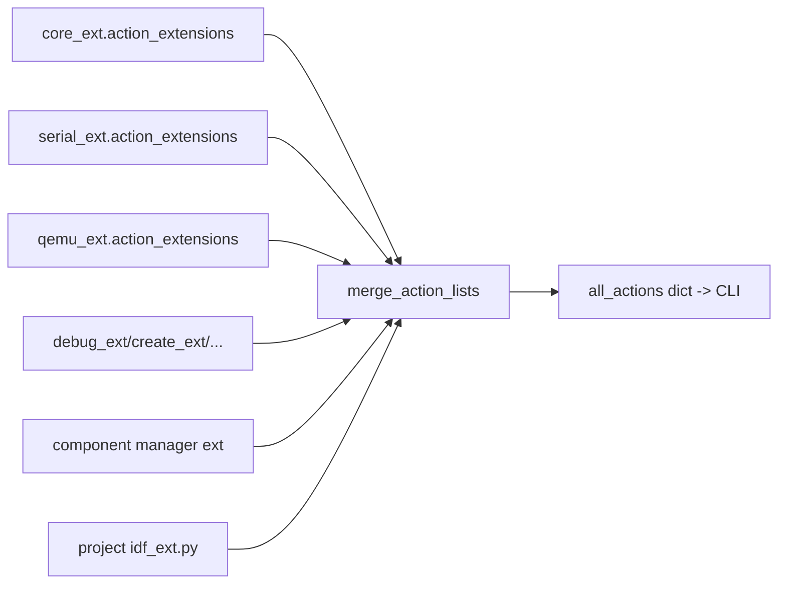
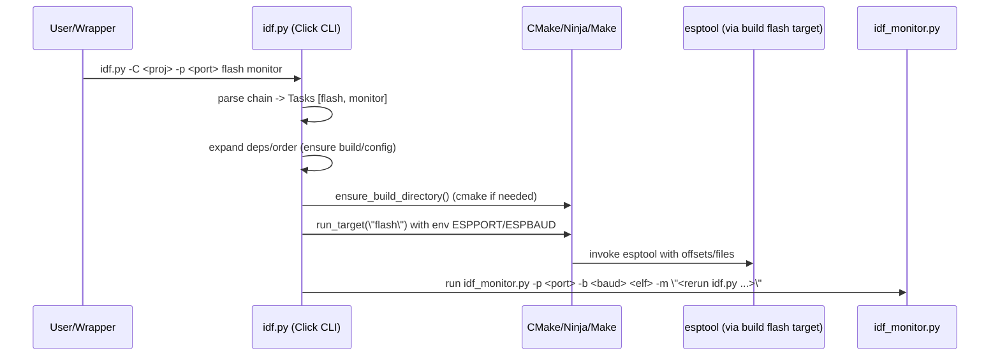

# ESP-IDF `idf.py`: architecture, commands, and internals (ESP-IDF 5.4.1)

## Executive summary

`idf.py` is ESP-IDF’s primary *project* CLI. It wraps (and orchestrates) CMake configuration, the build tool (Ninja/Make), and device/QEMU tooling (flash, erase, monitor, merge_bin, secure boot helpers, etc.). Implementation-wise, `idf.py` is not “one big hard-coded command list”; it is a **Click** CLI which **loads extension modules** (`*_ext.py`) at runtime. Those extensions register commands, options, and callbacks through a dictionary-based “action list” structure.

The single most important implementation detail for tool builders: `idf.py` is a **chained multi-command** (`idf.py flash monitor` is normal usage), and it performs **task scheduling** (dependencies and reordering) *after parsing* the chain. Some extensions (notably QEMU) mutate global args based on the presence of other tasks in the chain.

This analysis is based on the local ESP-IDF checkout at:
- `/home/manuel/esp/esp-idf-5.4.1/tools/idf.py`
- `/home/manuel/esp/esp-idf-5.4.1/tools/idf_py_actions/*.py`

---

## 1) What `idf.py` can do (capability map)

The exact command list depends on enabled extensions, but in ESP-IDF 5.4.1 the baseline command families include:

### 1.1 Configure/build (core build actions)

From `idf_py_actions/core_ext.py`:
- `build` (alias of `all`)
- `reconfigure` (force CMake re-run)
- `menuconfig` (kconfig UI)
- `clean` / `fullclean`
- `set-target <chip>` (regenerates sdkconfig + build cache)
- size reporting targets: `size`, `size-components`, `size-files`
- build subsets: `bootloader`, `app`, `partition-table`
- `docs` (open docs URL)
- `save-defconfig` (generate `sdkconfig.defaults` delta)

### 1.2 Serial workflows (flash/erase/monitor) + chip tools

From `idf_py_actions/serial_ext.py`:
- `flash` (via build system target + environment variables)
- `erase-flash` (esptool direct)
- `monitor` (runs `tools/idf_monitor.py`)
- chained usage: `idf.py flash monitor`

Plus utilities (serial_ext is large):
- `merge-bin` (esptool merge_bin)
- `espsecure` wrappers (encrypt/decrypt/sign/verify…)
- `espefuse` wrappers (burn/read-protect/summary…)
- OTA targets and other flash-related helpers

### 1.3 QEMU runner integration

From `idf_py_actions/qemu_ext.py`:
- `qemu` (runs QEMU with appropriate args per target)
- `qemu monitor` (wires monitor to a socket port by setting `--port socket://localhost:5555`)
- flash image generation for QEMU (`build/qemu_flash.bin`, `build/qemu_efuse.bin`)

### 1.4 Other extension families

Baseline ESP-IDF ships more extension modules under `tools/idf_py_actions/`, including:
- `debug_ext.py` (gdb/openocd-related workflows)
- `create_ext.py` (project creation)
- `dfu_ext.py`, `uf2_ext.py` (alternate flashing flows)

### 1.5 Dynamic extensions (important)

`idf.py` loads extensions from:
- `${IDF_PATH}/tools/idf_py_actions` (ESP-IDF’s built-ins)
- extra directories in `IDF_EXTRA_ACTIONS_PATH` (semicolon-separated)
- component manager extensions (unless `IDF_COMPONENT_MANAGER=0`)
- project-local `idf_ext.py` (in the project directory)
- optional `pyclang` extensions (if installed)

So, the command set is not static: a wrapper tool should assume “commands may appear/disappear”.

---

## 2) Architecture: how `idf.py` is structured

### 2.1 File/module roles (overview)

- `tools/idf.py`
  - environment checks + interpreter setup
  - defines Click wrappers (`Action`, `Option`, `CLI`, `Task`)
  - loads action extensions and merges them into a unified CLI
  - expands “@argsfile” syntax before parsing

- `tools/idf_py_actions/tools.py`
  - build directory setup: `ensure_build_directory()`
  - build tool execution: `run_target()`
  - subprocess wrapper: `RunTool`
  - serial port detection via `esptool`/pyserial
  - hint system used to print “HINT:” messages on errors
  - `PropertyDict` (args object with attribute access)

- `tools/idf_py_actions/core_ext.py`
  - registers most build/configure actions
  - registers global options like `--project-dir`, `--build-dir`, etc.

- `tools/idf_py_actions/serial_ext.py`
  - registers flash/erase/monitor and many related chip tool wrappers

- `tools/idf_py_actions/qemu_ext.py`
  - registers qemu + qemu integration callbacks

### 2.2 Execution flow (call graph)

```mermaid
flowchart TD
  A[tools/idf.py: main()] --> B[check_environment()]
  B --> C[init_cli()]
  C --> D[parse_project_dir (mini click parse)]
  D --> E[load extensions: *_ext.py]
  E --> F[merge_action_lists -> all_actions dict]
  F --> G[CLI(click.MultiCommand, chain=True)]
  G --> H[expand_file_arguments(@file)]
  H --> I[click parses argv -> Task list]
  I --> J[CLI.execute_tasks()]
  J --> K[global action callbacks]
  K --> L[dependency/order resolution]
  L --> M[execute each task callback]
  M --> N[closing message + flash hints]
```

### 2.3 Key design choice: `chain=True` and “tasks”

In Click terms, the top-level command is a `click.MultiCommand` with:
- `chain=True`: multiple subcommands can be specified in one invocation
- `result_callback=self.execute_tasks`: instead of executing each command immediately, commands return “task objects” and then `execute_tasks()` runs them.

This is why commands can be re-ordered or auto-inserted (dependencies).

---

## 3) Command model: Actions, Options, and Tasks

### 3.1 Actions are wrapped so they return Tasks (instead of running immediately)

`idf.py` defines:
- `Action(click.Command)` wrapper which wraps the callback to return a `Task`
- `Task` object which stores:
  - the real callback function (`callback`)
  - action name (`name`)
  - `dependencies` and `order_dependencies`
  - parsed action args (`action_args`)
  - aliases (for “Executing action: …” logging)

Conceptually:

```text
click parses -> produces Task objects
idf.py schedules tasks -> runs Task.callback later
```

### 3.2 Dependencies vs order-dependencies

Two distinct mechanisms exist:

- `dependencies`: hard prerequisites
  - if A depends on B, B will be inserted before A even if B wasn’t requested

- `order_dependencies`: reordering constraints
  - if A and B are both requested, ensure B runs first

This is used heavily in `core_ext.py` for workflows like:
- `idf.py clean build` (clean should run before build)
- `idf.py fullclean build` (fullclean before build)

### 3.3 Pseudocode: scheduler in `CLI.execute_tasks()`

This is a simplified reconstruction of the logic in `tools/idf.py`:

```pseudo
function execute_tasks(ctx, tasks, global_args):
  tasks_dict = map task.name -> task (for all parsed tasks)
  queue = []  # ordered map by insertion (dedupe by name)

  # Let extensions inspect the full chain and mutate global args or task args
  for cb in global_action_callbacks:
    cb(ctx, global_args, tasks)

  while tasks not empty:
    t = tasks[0]

    # 1) Ensure hard dependencies exist and come first
    for dep_name in t.dependencies:
      if dep_name not in queue:
        dep_task = tasks_dict.get(dep_name) or synthesize_task(dep_name)
        insert dep_task at front of tasks
        continue outer-loop

    # 2) Ensure order-only dependencies move to the front (only if present in command list)
    for dep_name in t.order_dependencies:
      if dep_name in tasks_dict and dep_name not in queue:
        move tasks_dict[dep_name] to front of tasks
        continue outer-loop

    pop tasks[0]
    if t.name not in queue:
      queue[t.name] = t

  if not global_args.dry_run:
    for task in queue in order:
      print "Executing action: <task name>"
      task.callback(task.name, ctx, global_args, **task.action_args)
```

### 3.4 Practical implication for wrappers

When you do `idf.py qemu monitor`, `monitor`’s port behavior depends on `qemu` being present in the chain. So a wrapper tool that tries to run “monitor separately” may not reproduce official behavior unless it replicates these chain-level callbacks.

### 3.5 Option scopes: `default` vs `global` vs `shared`

`tools/idf.py` defines an `Option(click.Option)` wrapper which supports a `scope` concept:

- `default`: option exists only at the level it’s declared (global vs action)
- `global`: if declared for an action, it’s also promoted to global options (first time seen)
- `shared`: if declared globally, it is also copied onto all actions

This is used to implement patterns like:
- `-C/--project-dir` as a shared option: available globally and on all actions
- `-p/--port` and `-b/--baud` as global options that can be specified once for the whole chain or once for a specific subcommand

**Wrapper implication:** if you translate `idf.py` invocations, preserve where options live. For example, `idf.py -p PORT flash monitor` and `idf.py flash -p PORT monitor` are both meaningful patterns (subject to “used at most once globally or for one subcommand” enforcement).

---

## 4) Bootstrapping and environment checks

### 4.1 `idf.py` assumes an ESP-IDF python environment

At import time, `idf.py` imports `idf_py_actions` modules. If imports fail, it prints a message explaining that:
- idf.py likely wasn’t run from an ESP-IDF shell environment, or
- the python env is corrupted,
and suggests reinstalling ESP-IDF tools.

### 4.2 `check_environment()` responsibilities

In `tools/idf.py`:

1) **IDF_PATH resolution**
- Detects IDF path from `tools/idf.py` location and sets `IDF_PATH` if not present.
- If `IDF_PATH` is present but differs, it warns.

2) **Python version compatibility**
- Runs `python_version_checker.check()`.

3) **Python dependency validation**
- Runs:
  - `python $IDF_PATH/tools/idf_tools.py check-python-dependencies`
- On failure, prints output and exits.

4) **Interpreter sanity warning**
- If `IDF_PYTHON_ENV_PATH` exists but `sys.executable` is not inside it, prints a warning.

This is the upstream root cause behind many “tmux uses wrong python” failures: `idf.py` will often *work* but warn; later commands may fail if modules are missing.

### 4.3 Locale/Unicode behavior

If running on POSIX and locale is ASCII-only, `idf.py` tries to find a UTF-8 locale (prefers `C.UTF-8`) and re-execs itself with `LC_ALL` set.

### 4.4 `@file` argument expansion (“argfiles” at the idf.py level)

Before Click parses argv, `tools/idf.py` expands any argument starting with `@` by reading the referenced file and inserting its tokens (split by shell rules via `shlex.split`). Nested `@` includes are supported and cycles are detected.

This is distinct from the build-system argfile `build/flash_args` (consumed by esptool); this is an `idf.py` feature for supplying large argument lists via files.

Pseudocode summary:

```text
expand_args(argv, parent_dir):
  for each arg in argv:
    if arg does not start with "@": keep it
    else:
      read file relative to parent_dir
      for each line: shlex.split(line) -> recursively expand
```

---

## 5) Extension mechanism (the internal “API”)

### 5.1 How extensions are discovered

Inside `init_cli()` in `tools/idf.py`:
- determines extension dirs:
  - `${IDF_PATH}/tools/idf_py_actions`
  - plus `IDF_EXTRA_ACTIONS_PATH` split by `;`
- scans those dirs for modules where name ends with `_ext`
- imports them and calls `action_extensions(all_actions, project_dir)`

Then additionally:
- component manager extension is added (unless `IDF_COMPONENT_MANAGER == '0'`)
- `pyclang` extension is added if importable
- project local `idf_ext.py` is loaded if present in `--project-dir`

### 5.1.1 Code snippet: extension discovery loop (conceptual)

This is the effective shape of the logic in `tools/idf.py`:

```python
extension_dirs = [realpath(IDF_PATH/tools/idf_py_actions)] + split(IDF_EXTRA_ACTIONS_PATH, ';')
extensions = []
for directory in extension_dirs:
    sys.path.append(directory)
    for name in iter_modules([directory]):
        if name.endswith('_ext'):
            extensions.append(import_module(name))

for ext in extensions:
    all_actions = merge_action_lists(all_actions, ext.action_extensions(all_actions, project_dir))
```

Plus optional additions (component manager, pyclang, project-local idf_ext).

### 5.2 What an extension returns: action list schema

Each extension returns a dict merged into one global `all_actions`. Schema (as observed in `core_ext.py` and `serial_ext.py`):

```yaml
global_options:
  - names: ["-C", "--project-dir"]
    scope: shared|global|default
    help: "..."
    type: click.Path()
    default: ...
    envvar: OPTIONAL_ENVVAR
    is_flag: bool
    multiple: bool
    callback: OPTIONAL_CLICK_CALLBACK

global_action_callbacks:
  - callable(ctx, global_args_dict, tasks_list)

actions:
  <action-name>:
    callback: callable(action_name, click_ctx, args_PropertyDict, **action_args)
    help: string
    short_help: string
    aliases: ["build", ...]
    options: [ option-dicts like global_options entries ]
    arguments: [ {names: [...], nargs: N, type: ...}, ... ]
    dependencies: [ "fullclean", ... ]
    order_dependencies: [ "reconfigure", ... ]
    deprecated: bool|string|dict
    hidden: bool
```

This is the closest thing to an “API” that `idf.py` offers: it’s the plugin protocol between idf.py and its command modules.

### 5.2.1 Action list schema: required vs optional keys

For implementers of `idf_ext.py` (or external tooling that wants to interpret the schema), the effective contract is:

- Top-level keys:
  - `actions` (optional but usually present)
  - `global_options` (optional)
  - `global_action_callbacks` (optional)

- Each `actions.<name>` entry:
  - required:
    - `callback` (callable)
  - optional:
    - `help`, `short_help`, `aliases`
    - `options`, `arguments`
    - `dependencies`, `order_dependencies`
    - `deprecated` (bool|string|dict), `hidden` (bool)

- Each `options` entry:
  - required:
    - `names` (list of option strings; click “param_decls”)
  - optional/common:
    - `help`, `type`, `default`, `envvar`
    - `is_flag`, `multiple`, `scope`
    - `deprecated`, `hidden`

Semantics to be aware of:
- options with `scope=global` are “single use”: either globally or on one subcommand
- `shared` options must be declared at global level (idf.py enforces this)

### 5.3 Diagram: extension merge



---

## 6) Build/configure internals

### 6.1 `ensure_build_directory()` is the central contract

In `idf_py_actions/tools.py`, `ensure_build_directory(args, prog_name, ...)`:

- validates `cmake` exists
- validates project directory and `CMakeLists.txt`
- creates build dir if missing
- parses `build/CMakeCache.txt` (if present)
- processes `-D/--define-cache-entry` values (CMake cache overrides)
- validates `IDF_TARGET` consistency across:
  - sdkconfig `CONFIG_IDF_TARGET`
  - environment `IDF_TARGET`
  - cache `IDF_TARGET` in CMakeCache
  - command line `-DIDF_TARGET=...`
- runs CMake when required:
  - generator detection if missing
  - passes `-DPYTHON_DEPS_CHECKED=1`, `-DPYTHON=<sys.executable>`, `-DESP_PLATFORM=1`
  - passes uninitialized warnings setting
  - passes `-D...` cache entries
- ensures generator consistency (error recommends `fullclean` on mismatch)
- loads `build/project_description.json` into a global context (used by other modules)

### 6.2 `set-target` is “CMake + sdkconfig regeneration”

In `core_ext.py`, `set-target`:
- adds `-DIDF_TARGET=<target>` to cache entries
- sets an env var `_IDF_PY_SET_TARGET_ACTION=1` so `_check_idf_target` ignores stale sdkconfig target
- forces CMake reconfigure to regenerate config for the new target

### 6.3 Code snippet: build target execution

In `core_ext.py`, `build_target` is effectively:

```python
ensure_build_directory(args, ctx.info_name)
run_target(target_name, args, force_progression=...)
```

It’s “configure if needed, then build tool target”.

### 6.4 Subprocess execution and error “hints” (`RunTool`)

Most idf.py actions ultimately call a helper that runs external tools. This is encapsulated in `idf_py_actions/tools.py` as `RunTool`.

Key behaviors:
- Always prints:
  - `Running <tool> in directory <cwd>`
  - `Executing "<quoted args>"...`
- By default (when `--no-hints` is not used), it runs the tool via `asyncio.create_subprocess_exec`, captures stdout/stderr into files under `build/log/`, and then:
  - prints “HINT:” messages derived from `tools/idf_py_actions/hints.yml`
  - and from any installed hint modules under `tools/idf_py_actions/hint_modules/`
- In `interactive=True` mode it streams output live while still writing a sanitized log (ANSI escapes stripped). It can also emit hints in “near real time”.
- `run_target()` always goes through `RunTool`, so build tool output is also subject to this machinery.

Why wrapper tools care:
- If you call `idf.py` directly, you get this hinting/log behavior “for free” (but it also creates log files and can clutter output).
- If you want more structured output, you can run `idf.py --no-hints ...` and implement wrapper-side capture, but you lose ESP-IDF’s curated hint system.

---

## 7) Serial internals: flash and monitor

### 7.1 Serial port auto-detection (upstream)

In `idf_py_actions/tools.py`, `get_default_serial_port()`:
- enumerates ports with `serial.tools.list_ports.comports()`
- uses `esptool.get_default_connected_device(...)` to probe candidates
- returns the detected serial port or raises `NoSerialPortFoundError`

This is more “active” than our repo scripts’ `/dev/serial/by-id` heuristics: it actually tries to connect.

### 7.2 `flash` is (mostly) “run the build system’s flash target”

In `idf_py_actions/serial_ext.py`, `flash()`:
- ensures build dir exists
- ensures `args.port` exists (auto-detect if missing)
- sets env vars used by the underlying build system’s flash rule:
  - `ESPBAUD`, `ESPPORT`
  - `SERIAL_TOOL_EXTRA_PRE_CMD_ARGS` (e.g. `--trace`)
  - `SERIAL_TOOL_EXTRA_ARGS` (e.g. `--force`, `--compress`, `--verify`, …)
- then runs `run_target("flash", ...)`

Design implication:
- if you need “stable USB-JTAG flashing”, it is reasonable to bypass `idf.py flash` and use generated `build/flasher_args.json` / `build/flash_args` to drive `esptool` directly (which is what several helper scripts do).

### 7.3 `monitor` is a wrapper for `tools/idf_monitor.py`

In `idf_py_actions/serial_ext.py`, `monitor()`:
- loads `build/project_description.json`
- picks ELF path (`build/<app>.elf`)
- chooses port and baud (with a specific precedence order)
- supplies toolchain prefix, target, revision, coredump decode settings, etc.
- runs `tools/idf_monitor.py` via `RunTool(..., interactive=True, convert_output=True)`
- passes `-m "<re-run idf.py command>"` so monitor can relaunch idf.py actions

Key detail:
- it temporarily ignores SIGINT because esp-idf-monitor uses SIGINT when spawning gdb.

### 7.4 “Closing message” includes a direct esptool command line

`tools/idf.py` prints flash instructions after builds by reading `build/flasher_args.json`, including a fully expanded:

```text
python -m esptool --chip ... -b ... --before ... --after ... write_flash <offset file pairs...>
```

This is an implicit contract: “direct esptool flashing” is a supported debugging path.

### 7.5 Diagram: `idf.py flash monitor` (typical device workflow)



---

## 8) QEMU internals

In `idf_py_actions/qemu_ext.py`:
- UART serial is exposed on TCP port 5555 by default, and monitor uses the pyserial URL:
  - `socket://localhost:5555`
- `global_callback()` inspects the chain of tasks and adjusts:
  - whether QEMU should run in background
  - whether monitor should connect to the socket port
  - whether `efuse-*` tasks should set `--before no_reset`

### 8.1 Why this matters

This is a concrete example of “chain-level behavior”:
- the monitor command line and the chosen port are not determined only by monitor’s flags; they can depend on what else is in the command list.

---

## 9) External API surfaces (for wrapper tooling)

`idf.py` is a CLI, but for external tooling these are the practical interfaces:

### 9.1 CLI conventions to preserve

- `-C/--project-dir` and `-B/--build-dir`
- global options with `scope=global` can be specified once globally or once for a subcommand
- chaining: `idf.py <cmd1> <cmd2> ...`
- argument file expansion: `@file` (recursive, cycle-detected)

### 9.2 Build metadata files (contracts)

Common automation hooks:
- `build/project_description.json` (used by monitor, qemu, and others)
- `build/flasher_args.json` (used to print esptool invocation details)
- `build/flash_args` (argfile consumed by `esptool merge_bin`, etc.)

### 9.3 Extension API (project-local `idf_ext.py`)

Projects can add commands by defining `idf_ext.py` in the project dir, exporting `action_extensions(all_actions, project_dir)` which returns the same action list schema as built-in extensions.

---

## 10) Implications and recommendations for our Go helper tool

### 10.1 Wrap first; reimplement selectively

The safest initial Go tool stance:
- wrap `idf.py` and preserve chaining semantics
- provide “doctor” style introspection and preflight checks *around* it
- only reimplement small, high-leverage pieces where idf.py is not robust enough for our needs:
  - deterministic by-id port selection (multi-device safe)
  - stable USB-JTAG flashing mode (esptool direct using build outputs)
  - procedures with consistent artifact capture (logs/transcripts)

### 10.2 Be explicit about the python interpreter

Because idf.py uses `sys.executable` for many subprocesses, launching it with the “wrong python” can cause missing-module failures later (especially in tmux panes). A wrapper should prefer `IDF_PYTHON_ENV_PATH/bin/python` to run `IDF_PATH/tools/idf.py`.

### 10.3 Respect extension dynamism

Treat “idf.py command list” as dynamic:
- do not hardcode an allowlist of known commands
- consider using `idf.py help --json --add-options` for introspection when needed

---

## Appendix A: key env vars referenced in code (selected)

- `IDF_PATH` (set/validated by idf.py)
- `IDF_PYTHON_ENV_PATH` (used for warnings; also used by many shell workflows)
- `IDF_EXTRA_ACTIONS_PATH` (extra extension directories; semicolon-separated)
- `IDF_COMPONENT_MANAGER` (set to `0` disables component manager extensions)
- `IDF_PY_PROGRAM_NAME` (overrides program name string)
- `ESPPORT` / `ESPBAUD` (defaults for `--port` / `--baud`)
- `IDF_MONITOR_BAUD` / `MONITORBAUD` (monitor baud overrides)

## Appendix B: “reading order” for implementation work

If you need to match or emulate behavior:
1. `/home/manuel/esp/esp-idf-5.4.1/tools/idf.py`
2. `/home/manuel/esp/esp-idf-5.4.1/tools/idf_py_actions/tools.py`
3. `/home/manuel/esp/esp-idf-5.4.1/tools/idf_py_actions/core_ext.py`
4. `/home/manuel/esp/esp-idf-5.4.1/tools/idf_py_actions/serial_ext.py`
5. `/home/manuel/esp/esp-idf-5.4.1/tools/idf_py_actions/qemu_ext.py`
