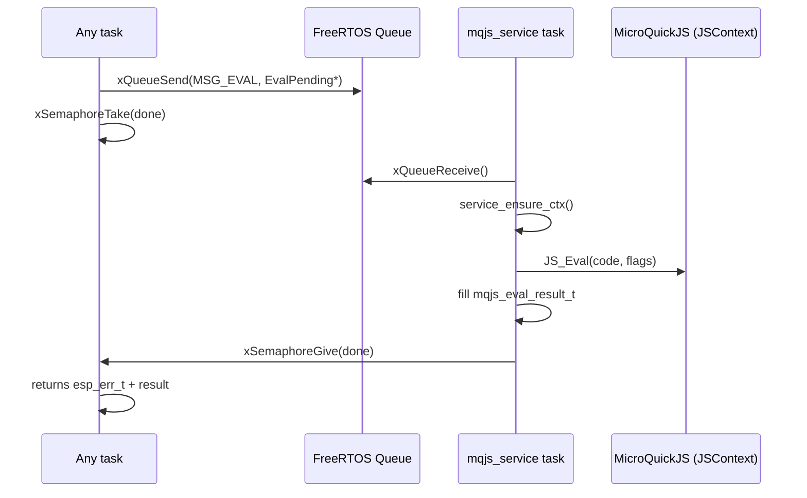

# Textbook: mqjs_service deep dive

## Executive Summary

`mqjs_service` is a reusable ESP-IDF component that turns a single-threaded MicroQuickJS runtime into a safe(ish) multi-producer service. It does this by centralizing *ownership* of `JSContext*` in a dedicated FreeRTOS task and exposing a small message-based API (`eval`, `run`, and `post`) that other tasks can call without touching the VM directly.

This document explains:
- The *fundamental constraint* (JavaScript VM is single-threaded and not re-entrant) and the standard embedded remedy (actor/message-passing).
- The concrete `mqjs_service` API contract and what its timeouts do (and do **not**) guarantee.
- The internal mechanics: message types, pending completions, VM initialization, and deadline enforcement.
- Real usages in this repo:
  - `0048-cardputer-js-web`: interactive eval + hardware event callbacks + WS event flushing.
  - `0066-cardputer-adv-ledchain-gfx-sim`: eval + a one-shot timer scheduler that posts callbacks into the JS thread.
- A critical assessment of quality and risks (deadlocks, memory pressure, shutdown semantics, and timeout limitations).

**Primary code references**
- Component API: `components/mqjs_service/include/mqjs_service.h`
- Component implementation: `components/mqjs_service/mqjs_service.cpp`
- Supporting VM host primitive: `components/mqjs_service/include/mqjs_vm.h`, `components/mqjs_service/mqjs_vm.cpp`
- Usage case studies: `0048-cardputer-js-web/main/js_service.cpp`, `0066-cardputer-adv-ledchain-gfx-sim/main/mqjs/js_service.cpp`, `0066-cardputer-adv-ledchain-gfx-sim/main/mqjs/mqjs_timers.cpp`

---

## Reading Guide (Textbook Style)

If you are new to embedded JS concurrency, start with:
1) “Fundamentals: single-threaded VMs and message passing”
2) “Mental model and architecture diagram”
3) “Public API: what you can assume and what you must ensure”

If you are integrating `mqjs_service` today, skip to:
- “How to use `mqjs_service` safely (checklist)”
- “Usage analysis: 0048 and 0066”

If you are debugging timeouts or stalls, go directly to:
- “Timeouts, deadlines, and why timeouts are not what they sound like”
- “Critical assessment: likely shortcomings”

---

## Problem Statement

MicroQuickJS (like many embedded JS engines) expects the host to treat a `JSContext*` as a single-threaded, non-reentrant interpreter state. In real firmware, however, multiple subsystems want to “talk to JS”:
- An interactive console wants `eval()`.
- A network task wants to call JS callbacks in response to WS/HTTP activity.
- Hardware input tasks want to deliver events (buttons, encoders, sensors).
- Timer/task scheduler wants `setTimeout`-like behavior.

The naive approach—allowing every task to call into the JS API directly—produces undefined behavior (corruption, crashes, random exceptions), because it violates VM ownership.

Therefore, we need:
1) A single place where `JSContext*` is used (one owner thread).
2) A way for other tasks to request work.
3) A way to return results/errors to the requesting task.
4) Optional “deadlines” so the VM can be interrupted if a script runs too long.
5) A pattern that remains readable and reusable across projects.

---

## Proposed Solution

`mqjs_service` implements an actor-like concurrency wrapper:

- A dedicated FreeRTOS task (“service task”) owns:
  - the MicroQuickJS arena memory,
  - the `MqjsVm` wrapper,
  - the `JSContext*`,
  - and a work queue.
- All external callers interact through a small C API:
  - `mqjs_service_eval`: evaluate JS source and capture output/error.
  - `mqjs_service_run`: synchronously run a host callback on the JS thread.
  - `mqjs_service_post`: asynchronously enqueue a host callback on the JS thread.

### Mental Model: An Actor With a Private Heap

The canonical mental model is:
- The JS VM is a *private mutable state*.
- Messages are *pure descriptions of work*.
- The only place side effects happen to JS state is inside the actor.

```
          (many tasks)                      (one task)
 ┌─────────────────────────┐         ┌───────────────────────┐
 │ HTTP / WS / UI / Timers │         │ mqjs_service task      │
 │ - produce "work"        │  Msg    │ - owns JSContext       │
 │ - never touch JS        ├────────►│ - runs eval/job        │
 └─────────────────────────┘         │ - replies via sema     │
                                     └───────────────────────┘
```

### Architecture Diagrams

**Diagram 1: Components and dependencies**

```mermaid
flowchart LR
  subgraph Component[mqjs_service component]
    A[mqjs_service.h] --> B[mqjs_service.cpp]
    B --> C[mqjs_vm (MqjsVm)]
    B --> D[FreeRTOS queue/semaphores]
    B --> E[esp_timer / interrupt deadlines]
  end

  C --> F[mquickjs.h / MicroQuickJS]

  U1[0048 js_service.cpp] --> A
  U2[0066 js_service.cpp] --> A
  U3[0066 mqjs_timers.cpp] --> A
```

**Diagram 2: Request/response sequencing for eval()**



---

## Symbols and Glossary

This document uses the following symbols to mirror the code:

| Symbol | Meaning | Where it appears |
|---|---|---|
| `s` | the internal service object (`Service*`) | `components/mqjs_service/mqjs_service.cpp` |
| `cfg` | configuration (`mqjs_service_config_t`) | `mqjs_service_start` |
| `q` | FreeRTOS queue handle for messages | `Service::q` |
| `task` | FreeRTOS task handle | `Service::task` |
| `vm` | `MqjsVm*` wrapper around the JS context | `Service::vm` |
| `ctx` | `JSContext*` (MicroQuickJS interpreter state) | `Service::ctx` |
| `Msg` | a queued work item: `{type, pending*}` | internal `Msg` struct |
| `Pending` | base “completion” object (semaphore + status) | internal `Pending` struct |
| `EvalPending` | pending data for `eval` requests | internal `EvalPending` struct |
| `JobPending` | pending data for “job” requests | internal `JobPending` struct |

Key “host” APIs (MicroQuickJS):

| Function | Purpose | Notes |
|---|---|---|
| `JS_Eval()` | Evaluate JS source | Always runs on `ctx` owner thread |
| `JS_SetInterruptHandler()` | Install deadline-based interrupt hook | Used by `MqjsVm` |
| `JS_SetLogFunc()` | Capture `print`/logging output | Used by `MqjsVm::WriteFunc` |

---

## File Map and Dependency Graph (Concrete)

### `components/mqjs_service/`

- `components/mqjs_service/include/mqjs_service.h`
  - Defines the stable public contract: `mqjs_service_start/stop/eval/run/post`, plus result type and job type.
- `components/mqjs_service/mqjs_service.cpp`
  - Implements:
    - A dedicated task (`service_task`) that receives `Msg` from a queue and runs them on the VM.
    - The `eval` path (capturing return value and exception text).
    - The “job” path (arbitrary host callback on the JS thread).
  - Depends on:
    - FreeRTOS queue/semaphore/task APIs,
    - `esp_timer` for time tracking,
    - `mqjs_vm` for VM lifecycle and deadline enforcement.
- `components/mqjs_service/CMakeLists.txt`
  - Declares the component and its `PRIV_REQUIRES`: `freertos`, `esp_timer`, `mquickjs`, `mqjs_vm`.

### `components/mqjs_service/` (VM host primitive)

- `components/mqjs_service/include/mqjs_vm.h`, `components/mqjs_service/mqjs_vm.cpp`
  - A minimal “VM host primitive” around MicroQuickJS:
    - Installs interrupt handler and log function.
    - Provides deadline operations: `SetDeadlineMs()` / `ClearDeadline()`.
    - Provides exception printing: `GetExceptionString()` and helpers to capture VM output.

### In-repo consumers

- `0048-cardputer-js-web/main/js_service.cpp`
  - Uses `mqjs_service_eval` for user-provided JS.
  - Uses `mqjs_service_post` for callback-style event delivery (encoder click/delta).
  - Uses `mqjs_service_run` for bootstrapping scripts.
- `0066-cardputer-adv-ledchain-gfx-sim/main/mqjs/js_service.cpp`
  - Similar eval + bootstrap + asynchronous flushing.
  - Adds timer integration via `mqjs_timers`.
- `0066-cardputer-adv-ledchain-gfx-sim/main/mqjs/mqjs_timers.cpp`
  - Timer scheduler that *never* runs JS in the timer task; posts “fire” jobs into `mqjs_service`.

---

## Fundamentals: Why This Pattern Exists

### Fundamental 1: A JS VM is a Single-Writer Data Structure

For embedded JS engines, the interpreter state (`JSContext*`) is:
- Mutable.
- Not designed for concurrent access.
- Often not designed for nested/re-entrant access (calling into JS while JS is already executing).

If two tasks call into `JS_Eval()` concurrently, you are essentially mutating the same graph of objects, stacks, and GC metadata without synchronization. “Sometimes it works” is not a comfort; it is a warning.

### Fundamental 2: The Actor Model is a Natural Fit

The actor model can be summarized as:
- Each actor owns private state.
- Messages are queued.
- The actor processes messages sequentially.

`mqjs_service` is an actor where the private state is the JS VM and its memory arena.

### Fundamental 3: Deadlines are Best-Effort, Not Hard Real-Time

`mqjs_service` uses MicroQuickJS’s interrupt hook to stop long-running code. This is a *cooperative* interruption mechanism:
- It can interrupt pure JS evaluation that periodically checks for interrupts.
- It may **not** interrupt native/C functions or certain tight loops depending on engine behavior.
- It does **not** automatically bound the caller’s wait time (see “Timeouts” section).

---

## Public API: Contract and Semantics

All API definitions live in `components/mqjs_service/include/mqjs_service.h`.

### Types

#### `mqjs_service_config_t`

Key fields:
- `arena_bytes` (required): size of the MicroQuickJS heap arena (bytes).
- `stdlib` (required): pointer to the MicroQuickJS standard library definition.
- Task settings: `task_name`, `task_stack_words`, `task_priority`, `task_core_id`.
- Queue setting: `queue_len`.
- Compatibility option: `fix_global_this` (default true).

#### `mqjs_eval_result_t`

Return payload for `mqjs_service_eval`:
- `ok`: true if evaluation produced a non-exception value.
- `timed_out`: true if evaluation exceeded the intended deadline (best-effort).
- `output`: captured “printed output” and/or printed return value (malloc’d).
- `error`: exception text (malloc’d) or `nullptr`.

Caller frees via `mqjs_eval_result_free()`.

#### `mqjs_job_t`

Defines a host “job” that will run on the JS thread:
- `fn`: `esp_err_t (*)(JSContext* ctx, void* user)`
- `user`: caller-supplied pointer
- `timeout_ms`: deadline applied to JS execution while the job runs (best-effort)

### Functions

#### `mqjs_service_start(cfg, out)`

Starts a service task, allocates queue and a “ready” handshake semaphore, and returns a handle.

**Preconditions**
- `cfg->arena_bytes > 0`
- `cfg->stdlib != nullptr`

**Postconditions**
- `*out` is non-null and can be used by callers from other tasks.
- The service task has started (handshake completes).

#### `mqjs_service_eval(s, code, len, timeout_ms, filename, out)`

Synchronously evaluates `code[0..len)` on the service thread.

**Important: lifetime**
- `code` is not copied. However, `mqjs_service_eval` blocks until completion, so the pointer only needs to remain valid for the duration of the call.

**Return value**
- `ESP_OK` for “request executed” (even if JS code threw).
- `ESP_ERR_TIMEOUT` if the request could not be enqueued (queue busy/full).
- `ESP_FAIL` if the VM could not be initialized.

The JS-level outcome is reported in `mqjs_eval_result_t`.

#### `mqjs_service_run(s, job)`

Synchronously runs `job->fn(ctx, job->user)` on the service thread.

This is the mechanism used for “host integration” such as:
- binding native functions,
- calling callbacks,
- flush-to-WS operations,
- modifying JS globals from the host.

#### `mqjs_service_post(s, job)`

Asynchronously enqueues a job. It does not wait for completion.

This is the mechanism used when:
- the current task must not block (e.g., timer task),
- the event can be delivered “eventually,”
- the caller manages `user` lifetime explicitly.

---

## Internal Design: How the Service Works

All internals are in `components/mqjs_service/mqjs_service.cpp`. The component is written in C++ but exposes a C API.

### Internal Data Structures

`mqjs_service.cpp` defines three key internal structs (names simplified here):

1) `Service`
   - holds config, task handle, queue, and VM pointers (`vm`, `ctx`, `arena`).
2) `Msg`
   - `{ type: MSG_EVAL|MSG_JOB, pending: void* }`.
3) `Pending` and its subclasses
   - contain a completion semaphore and an `esp_err_t status`.

**Callout: why “pending objects”?**

Because the work is processed by the service task, the calling task needs a rendezvous point for synchronous calls. A “pending” object is that rendezvous:
- caller allocates `Pending`,
- caller enqueues pointer to it,
- service fills it and gives a semaphore,
- caller wakes and returns.

### Core Loop Pseudocode (service task)

The service task is an infinite receive/process loop:

```text
service_task(Service* s):
  signal_ready_to_creator()
  verify_queue_exists_and_is_internal()

  loop forever:
    msg = queue_receive(s.q, block_forever)
    if msg.pending is null: continue

    ensure_vm_initialized(s)   // lazy init

    if msg.type == EVAL:
      p = (EvalPending*)msg.pending
      run_js_eval_and_fill_result(s, p)
      semaphore_give(p.done)

    else if msg.type == JOB:
      p = (JobPending*)msg.pending
      st = run_job_fn_on_ctx(s.ctx, p.fn, p.user, p.timeout_ms)
      p.status = st
      if p.done: semaphore_give(p.done)
      if p.heap_owned: free(p) and possibly delete its semaphore
```

### Lazy VM Initialization (`service_ensure_ctx`)

The VM and JS context are not created at `mqjs_service_start()`. Instead, they are created the first time real work arrives.

This has practical benefits:
- reduces startup time for firmwares that may not use JS immediately,
- defers large heap allocations (`arena_bytes`) until needed.

It also introduces a failure mode:
- if VM init fails, the service remains “started” but returns failures per-message.

---

## The Two Message Types: `eval` and `job`

### `eval`: code string → result struct

At a high level:
- apply deadline (`timeout_ms`),
- run `JS_Eval()`,
- determine whether a deadline was exceeded,
- if exception: capture exception string,
- else: print return value (if not `undefined`),
- reply.

**Pseudocode**

```text
eval_message(Service s, EvalPending p):
  if s.ctx not initialized:
    p.out = { ok:false, timed_out:false, output:"", error:"js init failed" }
    p.status = ESP_FAIL
    give(p.done); return

  vm.SetDeadlineMs(p.timeout_ms)
  deadline_us = now_us + timeout_ms
  val = JS_Eval(ctx, p.code, p.len, p.filename, flags=REPL|RETVAL)
  timed_out = (timeout_ms>0) and (now_us > deadline_us)
  vm.ClearDeadline()

  if p.out is null: p.status = ESP_OK; give(p.done); return
  p.out.timed_out = timed_out

  if val is exception:
    p.out.ok = false
    p.out.output = ""
    p.out.error = vm.GetExceptionString()
    p.status = ESP_OK
    give(p.done); return

  p.out.ok = true
  p.out.output = (val != undefined) ? vm.PrintValue(val) + "\n" : ""
  p.out.error = null
  p.status = ESP_OK
  give(p.done)
```

### `job`: host callback runs on the JS thread

This is the “escape hatch” that makes `mqjs_service` useful beyond `eval()`.

Jobs are executed in the service task context, which means they are allowed to:
- call into MicroQuickJS functions,
- use `MqjsVm::From(ctx)` to get utilities like exception printing,
- call JS callbacks (`JS_Call`) safely (because we are on the owner thread).

Jobs come in two “delivery” modes:

1) **Synchronous** (`mqjs_service_run`)
   - caller waits on a semaphore until completion
   - safe to pass stack pointers as `user`
2) **Asynchronous** (`mqjs_service_post`)
   - caller returns immediately
   - caller must ensure `user` remains valid until job executes

---

## Timeouts, Deadlines, and Why Timeouts Are Not What They Sound Like

This section is intentionally blunt because it is a frequent source of subtle bugs.

### There are (at least) three time-related concepts

1) **Queue admission timeout** (fixed)
   - `mqjs_service_eval/run` try to enqueue with a fixed ~100ms timeout.
   - If the queue is full/busy, these functions return `ESP_ERR_TIMEOUT`.

2) **VM execution deadline** (best-effort)
   - `timeout_ms` on `mqjs_service_eval` and on `mqjs_job_t` is passed to `MqjsVm::SetDeadlineMs`.
   - MicroQuickJS calls the interrupt handler periodically; the VM can decide to stop execution.

3) **Caller wait time** (unbounded for synchronous calls)
   - After enqueuing, `mqjs_service_eval/run` waits with `xSemaphoreTake(..., portMAX_DELAY)`.
   - If the service task wedges, crashes, or blocks forever, callers block forever too.

### Consequence

The `timeout_ms` parameter does **not** guarantee that the API call returns within `timeout_ms`.

It means: “When the JS VM runs this work, it should *try* to interrupt itself after ~timeout_ms.”

### Practical guidance

- If you need hard upper bounds on caller wait time, the API needs an additional timeout or cancel mechanism (not currently present).
- Use `mqjs_service_post` for latency-insensitive events, and accept that events can drop/fail under load.
- Keep jobs small and side-effect focused; long jobs amplify queueing delays and risk WDT.

---

## Memory and Ownership: The Real Contract

### Ownership map

| Resource | Owner | Lifetime | Notes |
|---|---|---|---|
| `Service*` | caller (created in `start`, freed in `stop`) | service lifetime | Stored behind `mqjs_service_t*` |
| `QueueHandle_t q` | service | service lifetime | Created with `xQueueCreateWithCaps(..., MALLOC_CAP_INTERNAL)` |
| `TaskHandle_t task` | service | service lifetime | Created via `xTaskCreate` |
| `arena` | service | VM lifetime | `malloc(cfg.arena_bytes)` (not `WithCaps`) |
| `MqjsVm* vm`, `JSContext* ctx` | service | VM lifetime | Lazy init; freed in `stop` |
| `EvalPending/JobPending` | caller for sync calls | one request | heap-allocated per request |
| `JobPending` for `post` | service task (frees after execution) | one request | “heap_owned” model |

### Two different “user pointer” lifetimes

The API exposes `void* user` in jobs; lifetime depends on call:
- `mqjs_service_run`: safe to pass `&stack_object` because caller blocks until completion.
- `mqjs_service_post`: caller returns immediately; pass heap memory or a stable global/static.

**Example (safe async)**
- `0048-cardputer-js-web/main/js_service.cpp` allocates a heap `ClickArg` and frees it inside the job.

**Example (safe async with static)**
- `0066-cardputer-adv-ledchain-gfx-sim/main/mqjs/js_service.cpp` posts a job with `user = "eval"` (string literal).

---

## How to Use `mqjs_service` Safely (Checklist)

Use this checklist as the operational contract:

1) **Create the service once**
   - Guard startup with a mutex if multiple tasks may race to initialize (see `0048`).
2) **Never call `mqjs_service_eval/run` from inside a job**
   - That is re-entrancy through the same queue and can deadlock.
3) **Keep `job->fn` small**
   - Avoid long blocking operations; jobs run on the JS owner thread.
4) **Treat `timeout_ms` as best-effort**
   - It bounds VM execution attempts, not caller wait time.
5) **Treat `mqjs_service_stop` as “only when quiescent”**
   - Stop is best-effort and does not coordinate with in-flight requests.
6) **For async jobs, manage `user` lifetime explicitly**
   - Heap-allocate and free in the job, or use static/global pointers.

---

## Usage Analysis: 0048-cardputer-js-web

Primary file: `0048-cardputer-js-web/main/js_service.cpp`.

This consumer demonstrates a “JS-backed firmware subsystem” pattern:

### 1) Lazy start + bootstrap

- `js_service_start()` creates a mutex (`s_start_mu`) so multiple tasks can call start safely.
- It configures `mqjs_service_config_t` (stack words, queue length, arena size from Kconfig).
- It runs a bootstrap job via `mqjs_service_run`, which:
  - injects helper functions and namespaces into `globalThis`,
  - defines `encoder.on/off` registration,
  - defines `emit()` and a batching helper `__0048_take_lines()` for WS output.

### 2) Interactive eval endpoint

- `js_service_eval_to_json()` calls `mqjs_service_eval()`.
- It converts `mqjs_eval_result_t` into JSON.
- After eval, it schedules an async flush job (`mqjs_service_post`) so WS events are drained without holding up the eval response.

### 3) Hardware event delivery (encoder)

Two patterns are visible:

- **Coalescing** (delta updates):
  - the firmware updates an `EncoderDeltaSnap` guarded by a spinlock (`portMUX_TYPE`).
  - it posts a job only when transitioning from “no pending” → “pending”, which prevents queue flooding.

- **Per-event heap allocation** (click):
  - it allocates `ClickArg` on heap and frees in the job.

### 4) Job code structure: “get callback, build JS object, call, flush”

The jobs follow a consistent template:

```text
job_handle_event(ctx):
  cb = find_js_callback(ctx, path)
  if not function: return OK
  ev = JS_NewObject(ctx); set fields...
  JS_Call(cb, ev)
  flush_js_events_to_ws(ctx)
```

This is exactly what `mqjs_service` enables: host tasks do not touch `JSContext*`, but still drive callbacks predictably.

---

## Usage Analysis: 0066-cardputer-adv-ledchain-gfx-sim

Primary file: `0066-cardputer-adv-ledchain-gfx-sim/main/mqjs/js_service.cpp`.

This consumer shows a similar interactive-eval pattern, but adds two additional integration points:

### 1) Timer scheduling without running JS in the timer task

`0066-cardputer-adv-ledchain-gfx-sim/main/mqjs/mqjs_timers.cpp` implements a small one-shot scheduler:
- A separate timers task tracks due times and processes schedule/cancel commands.
- When a timer fires, it posts a job into `mqjs_service` (`mqjs_service_post`) that calls the JS callback.

This illustrates an important “rule” for embedded JS:
- Timer tasks are not the JS thread.
- Never call into JS from a timer task.
- Always marshal to the JS owner thread (via the service queue).

### 2) After-callback hook

`mqjs_timers.cpp` calls a weak hook:
- `mqjs_0066_after_js_callback(ctx, "timer")`

`0066` defines this hook to flush WS events after callback execution. This avoids scattering “flush” logic across job sites.

---

## Design Decisions (What the Code Chooses and Why It Matters)

### Decision: “Single VM owner task + queue”

This is the primary concurrency decision. It matches both:
- the constraints of MicroQuickJS,
- and the patterns used by the consumers in this repo.

### Decision: “Internal RAM for queue and startup semaphore”

`mqjs_service_start` uses:
- `xQueueCreateWithCaps(..., MALLOC_CAP_INTERNAL)`
- `xSemaphoreCreateBinaryWithCaps(MALLOC_CAP_INTERNAL)`

This strongly suggests the component was designed to avoid placing synchronization primitives in external memory (e.g., PSRAM), which can be problematic under certain configurations and watchdog conditions.

### Decision: “Lazy VM init”

`service_ensure_ctx` allocates and initializes the VM only on-demand.

### Decision: “Return JS output/error as malloc’d strings”

This simplifies caller code (especially for network/JSON responses) but introduces:
- dynamic allocation per eval,
- explicit free discipline (`mqjs_eval_result_free`).

---

## Alternatives Considered (And Why They’re Usually Worse)

### Alternative A: “Global mutex around JSContext”

This would allow multiple tasks to “safely” enter the VM, but:
- it does not prevent re-entrancy (a task could call into JS while JS calls back into the host),
- it encourages long lock-holds and WDT risk,
- it makes it harder to reason about `ctx->opaque` and output capture state.

### Alternative B: “Multiple JS contexts, one per subsystem”

This avoids contention but:
- increases memory dramatically (multiple arenas),
- complicates sharing state between subsystems,
- often fails on small microcontrollers.

### Alternative C: “Event loop in the main task”

If your firmware already has a central “main loop,” embedding JS there can work. But it tends to:
- create tight coupling to a specific firmware architecture,
- reduce reuse across projects.

---

## Critical Assessment: Quality, Risks, and Likely Shortcomings

This section is intended as a “reader warning label.” It does not say the code is bad; it says where it is most likely to surprise you.

### 1) Synchronous calls can block forever

Both `mqjs_service_eval` and `mqjs_service_run` enqueue work and then wait with `portMAX_DELAY`.

Risks:
- If the service task dies, wedges, or is deleted while requests are in-flight, callers can deadlock.
- “Timeout” (`timeout_ms`) does not bound caller wait time.

Potential mitigations:
- Add a caller-side wait timeout and return `ESP_ERR_TIMEOUT` if the service doesn’t respond.
- Add health checks / “ping” jobs.

### 2) Re-entrancy deadlock is easy to create accidentally

If a job running on the service thread calls `mqjs_service_eval/run`, it will:
- enqueue onto the same queue,
- then wait for itself to process the message,
- deadlocking.

Potential mitigations:
- Detect service thread via `xTaskGetCurrentTaskHandle() == s->task` and return `ESP_ERR_INVALID_STATE`.
- Provide a “run inline if already on service thread” helper for advanced users (with strict guardrails).

### 3) Shutdown (`mqjs_service_stop`) is best-effort and can strand waiters

`mqjs_service_stop` deletes the task and queue without coordinating with:
- in-flight synchronous waiters,
- queued-but-not-yet-processed messages,
- or pending completions.

This is consistent with the header comment (“not required for normal firmware lifetime”), but it is still a footgun if used in a reset/restart flow.

Potential mitigations:
- Implement a `STOP` message type and a “drain + shutdown” sequence.
- Track outstanding pending requests and wake them with `ESP_ERR_INVALID_STATE`.

### 4) The “ready” handshake happens before validation checks

In `service_task`, the “ready” semaphore is given early, before:
- verifying `s->q` is non-null,
- verifying `s->q` is internal memory.

If the service task exits immediately after giving ready, `mqjs_service_start` can still return success, but the service will never process requests.

Potential mitigations:
- Move `xSemaphoreGive(s->ready)` after the validation checks.
- Add an initial “self-test” message exchange during `start`.

### 5) Heap allocation on every request can be a pressure point

Each `eval`/`run` call allocates a `Pending` struct via `calloc`, and `eval` additionally allocates output/error strings.

Under load, or with fragmented heaps, this can fail in ways that are hard to reproduce.

Potential mitigations:
- For synchronous calls, allocate `Pending` on the caller stack and use static semaphores; pass pointer through the queue (lifetime is bounded by the call).
- Use a small pool allocator for pending structs.

### 6) Deadline enforcement is cooperative

The VM interrupt mechanism is powerful but not absolute:
- It can stop JS code that checks interrupts.
- It may not stop native/C functions.

Practical guidance:
- Keep host functions fast.
- Prefer splitting work across multiple jobs rather than one large job.

---

## Implementation Plan (Forward-Looking Improvements)

Even though `mqjs_service` already exists, the following plan can guide hardening work if/when needed:

1) Add “bounded wait” variants:
   - `mqjs_service_eval_with_wait_timeout(...)`
   - `mqjs_service_run_with_wait_timeout(...)`
2) Add service-thread re-entrancy detection and fail fast.
3) Improve start handshake to ensure the worker is alive and consuming.
4) Add graceful stop/drain semantics (optional).
5) Consider reducing heap churn via stack pending objects (sync) or a pool (async).

---

## Open Questions

- Should `timeout_ms` be split into two independent timeouts?
  - queue admission timeout
  - caller wait timeout
  - VM execution deadline
- Should `mqjs_service_eval` permit `out == nullptr` (currently rejected), or should the implementation simplify and remove the `out == nullptr` codepath?
- Should the service expose an explicit “is ready / is healthy” function?

---

## References

- Code:
  - `components/mqjs_service/include/mqjs_service.h`
  - `components/mqjs_service/mqjs_service.cpp`
  - `components/mqjs_service/include/mqjs_vm.h`
  - `components/mqjs_service/mqjs_vm.cpp`
  - `0048-cardputer-js-web/main/js_service.cpp`
  - `0066-cardputer-adv-ledchain-gfx-sim/main/mqjs/js_service.cpp`
  - `0066-cardputer-adv-ledchain-gfx-sim/main/mqjs/mqjs_timers.cpp`
- Prior internal docs that mention the component (useful historical context):
  - `ttmp/2026/01/20/0048-CARDPUTER-JS-WEB--cardputer-web-js-ide-preact-microquickjs/analysis/01-analysis-componentizing-0048-firmware-into-reusable-modules-wi-fi-http-ws-js-vm-service-bindings.md`
  - `ttmp/2026/01/21/0055-MQJS-SERVICE-COMPONENT--reusable-queue-owned-microquickjs-service-eval-callbacks-event-flush/design-doc/01-design-implementation-plan.md`
  - `ttmp/2026/01/21/0061-MQJS-SERVICE-BOOT-WDT--interrupt-wdt-timeout-in-mqjs-service-service-task-xqueuereceive-at-boot/tasks.md`
