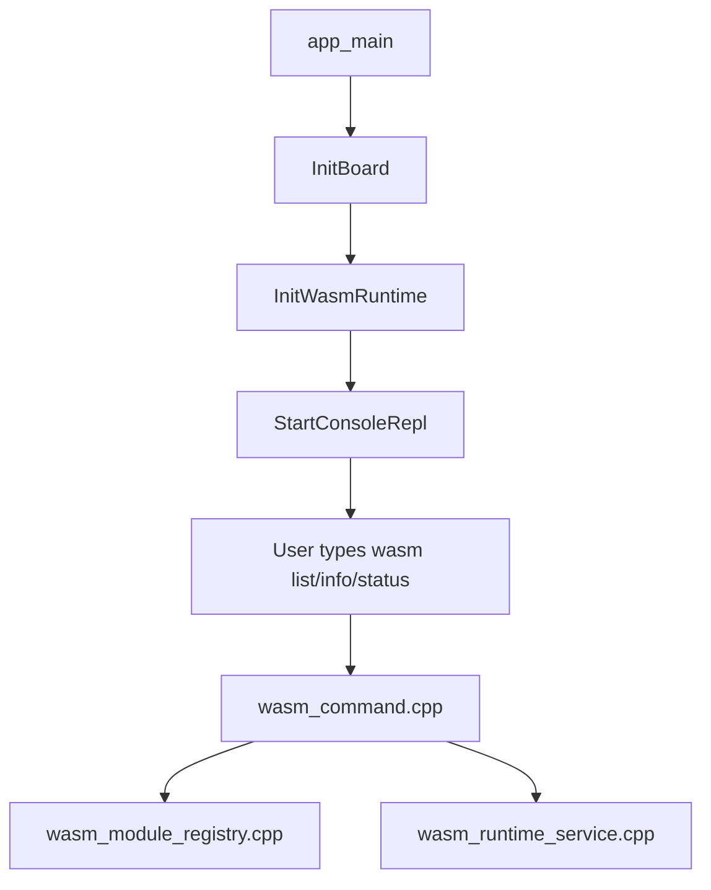
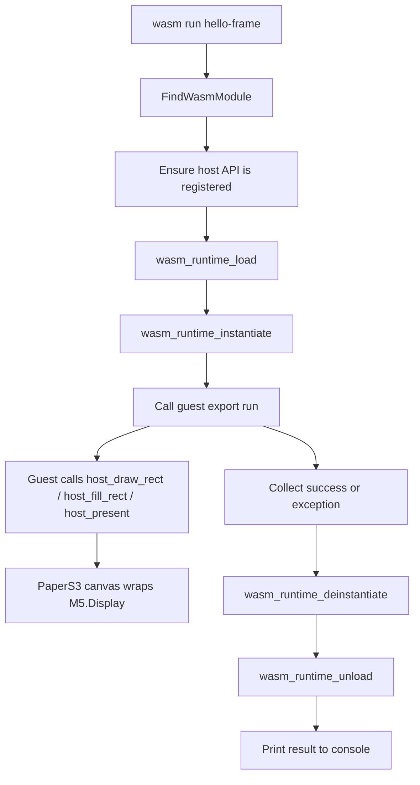

# PaperS3 WAMR execution primitives analysis, design, and implementation guide

## Executive Summary

<!-- Provide a high-level overview of the design proposal -->

## Problem Statement

<!-- Describe the problem this design addresses -->

## Proposed Solution

<!-- Describe the proposed solution in detail -->

## Design Decisions

<!-- Document key design decisions and rationale -->

## Alternatives Considered

<!-- List alternative approaches that were considered and why they were rejected -->

## Implementation Plan

<!-- Outline the steps to implement this design -->

## Open Questions

<!-- List any unresolved questions or concerns -->

## References

<!-- Link to related documents, RFCs, or external resources -->
---
Title: PaperS3 WAMR execution primitives analysis design and implementation guide
Ticket: ESP-37-PAPERS3-WAMR-EXECUTION-PRIMITIVES
Status: active
Topics:
    - papers3
    - wasm
    - assemblyscript
    - wamr
    - firmware
DocType: design-doc
Intent: long-term
Owners: []
RelatedFiles:
    - Path: 0079-papers3-wamr-assemblyscript-console/main/app_main.cpp
      Note: Project bootstrap and current board initialization
    - Path: 0079-papers3-wamr-assemblyscript-console/main/wasm_command.cpp
      Note: Current console subcommand parser and placeholder run path
    - Path: 0079-papers3-wamr-assemblyscript-console/main/wasm_runtime_service.cpp
      Note: Existing WAMR init logic and status reporting
    - Path: 0079-papers3-wamr-assemblyscript-console/main/wasm_module_registry.cpp
      Note: Embedded module catalog that the runner will consume
    - Path: 0079-papers3-wamr-assemblyscript-console/wasm-src/shared/host.ts
      Note: Guest-visible host ABI declarations
    - Path: 0079-papers3-wamr-assemblyscript-console/main/idf_component.yml
      Note: Upstream WAMR component dependency source
    - Path: 0079-papers3-wamr-assemblyscript-console/managed_components/bytecodealliance__wasm-micro-runtime/core/iwasm/include/wasm_export.h
      Note: Local WAMR embedding API surface used by the design
ExternalSources:
    - https://github.com/bytecodealliance/wasm-micro-runtime/blob/main/doc/export_native_api.md
Summary: Detailed implementation guide for the PaperS3 WAMR host ABI and module execution pipeline needed to make embedded AssemblyScript demos runnable from `esp_console`.
LastUpdated: 2026-03-22T11:19:54.100000000-04:00
WhatFor: Explain the current system, the missing execution primitives, and the implementation plan for replacing the placeholder `wasm run` path with a real runner.
WhenToUse: Read this before implementing or reviewing host imports, module execution, or display-side Wasm rendering on PaperS3.
---

# PaperS3 WAMR execution primitives analysis design and implementation guide

## Executive Summary

This document explains the missing half of the `0079-papers3-wamr-assemblyscript-console` firmware: the execution primitives required to make the bundled AssemblyScript programs actually run. Today the firmware can initialize WAMR, enumerate embedded modules, and describe them through `wasm list` and `wasm info`. It still cannot execute them because there is no host-side drawing ABI, no native-symbol registration, and no load/instantiate/execute/unload path behind `wasm run <name>`.

The right first implementation is intentionally small:

- keep the host ABI numeric and fixed-width
- keep the module lifecycle per-run and short-lived
- keep the guest entrypoint to `run(): i32`
- keep the display API limited to screen clear, rectangle outline, rectangle fill, present, log, and delay
- keep WAMR in interpreter mode
- keep the control plane on `esp_console` over USB Serial/JTAG

That is enough to make the first demos work while staying simple enough for a new intern to understand, debug, and extend.

## Problem Statement

The guest-side programs already exist. They are authored in AssemblyScript under `0079-papers3-wamr-assemblyscript-console/wasm-src/` and compiled to `.wasm` files embedded into firmware. The guest-side import surface also already exists in `0079-papers3-wamr-assemblyscript-console/wasm-src/shared/host.ts`.

The missing pieces are on the host side:

- nothing registers the `host_*` functions declared by the guest
- nothing maps guest drawing calls to `M5.Display`
- nothing loads the embedded module bytes into WAMR
- nothing instantiates a module instance with execution memory
- nothing calls the guest `run` export
- nothing reports load, instantiation, or exception failures in a structured way

As a result, the current `wasm run` path stops at a placeholder string in `0079-papers3-wamr-assemblyscript-console/main/wasm_command.cpp`.

## What an Intern Needs to Understand First

Before changing code, a new engineer needs a mental model of the system boundaries.

### There are four distinct layers

1. Host firmware layer
   - ESP-IDF app, console, display driver access, logging, memory ownership
2. WAMR embedding layer
   - runtime init, native registration, module load/instantiate/deinstantiate/unload
3. Guest program layer
   - AssemblyScript modules compiled ahead of time to `.wasm`
4. Operator layer
   - the human at the USB Serial/JTAG console using `wasm list`, `wasm info`, and `wasm run`

### The project already has a clean split between "inventory" and "execution"

- inventory exists now:
  - runtime status via `wasm status`
  - module discovery via `wasm list`
  - module metadata via `wasm info`
- execution does not exist yet:
  - no host imports
  - no runner
  - no display presentation path

That separation is useful because it means we do not need to redesign the whole app. We only need to add the missing execution layer and plug it into the existing command surface.

## Current System Map

### Relevant local files

- `0079-papers3-wamr-assemblyscript-console/main/app_main.cpp`
  - initializes M5Unified and starts WAMR plus the console
- `0079-papers3-wamr-assemblyscript-console/main/wasm_runtime_service.cpp`
  - owns runtime initialization and status reporting
- `0079-papers3-wamr-assemblyscript-console/main/wasm_module_registry.cpp`
  - describes the embedded `.wasm` assets
- `0079-papers3-wamr-assemblyscript-console/main/wasm_command.cpp`
  - currently routes console subcommands and contains the `wasm run` placeholder
- `0079-papers3-wamr-assemblyscript-console/wasm-src/shared/host.ts`
  - the guest ABI contract
- `0079-papers3-wamr-assemblyscript-console/main/idf_component.yml`
  - confirms the runtime is upstream WAMR from the ESP-IDF component manager
- `0079-papers3-wamr-assemblyscript-console/managed_components/.../wasm_export.h`
  - the local WAMR embedding API reference used by the code

### Runtime flow today



### Runtime flow we need



## The Guest ABI Contract

The first host ABI is already visible in `wasm-src/shared/host.ts`. That file is important because it is the contract the firmware must satisfy. If the names or signatures do not match, the module will fail to resolve imports during load or instantiation.

### Guest imports currently declared

- `host_log_i32(tag: i32, value: i32): void`
- `host_delay_ms(ms: i32): void`
- `host_screen_clear(color: i32): void`
- `host_draw_rect(x: i32, y: i32, w: i32, h: i32, color: i32): void`
- `host_fill_rect(x: i32, y: i32, w: i32, h: i32, color: i32): void`
- `host_present(mode: i32): void`

### Why this ABI shape is good for milestone 1

- every argument is `i32`
- no guest string or guest buffer pointers cross the boundary
- no guest-managed objects cross the boundary
- the import names are explicit and self-documenting
- the implementation on the host side can be a small `NativeSymbol[]` table

### Why not support strings yet

WAMR can validate and convert guest strings and buffers with signature letters like `$`, `*`, and `~`. That is useful, but it adds memory-boundary semantics that are not needed for the first drawing demos. A numeric ABI is easier to validate and far less likely to hide subtle sandbox mistakes.

## Host-Side WAMR APIs That Matter

These are the specific local APIs an intern should read in `wasm_export.h`.

### Runtime bootstrap

- `wasm_runtime_full_init(RuntimeInitArgs *init_args)`
  - already used in `wasm_runtime_service.cpp`

### Native registration

- `wasm_runtime_register_natives(const char *module_name, NativeSymbol *native_symbols, uint32_t n_native_symbols)`
  - the `module_name` must match the AssemblyScript import module string, which is `"host"`
  - the symbol array must be static or otherwise live forever after registration

### Module lifecycle

- `wasm_runtime_load(uint8_t *buf, uint32_t size, char *error_buf, uint32_t error_buf_size)`
- `wasm_runtime_instantiate(wasm_module_t module, uint32_t default_stack_size, uint32_t host_managed_heap_size, char *error_buf, uint32_t error_buf_size)`
- `wasm_runtime_deinstantiate(wasm_module_inst_t module_inst)`
- `wasm_runtime_unload(wasm_module_t module)`

### Function execution

- `wasm_application_execute_func(wasm_module_inst_t module_inst, const char *name, int32_t argc, char *argv[])`
- `wasm_runtime_get_exception(wasm_module_inst_t module_inst)`

For the first runnable version, `wasm_application_execute_func(..., "run", 0, nullptr)` is good enough because all current demos export `run(): i32` and do not require typed argument marshalling from the console.

## Host-Side Display Design

The display side is easy to get wrong if you treat every host function as a naked `M5.Display.*` call. PaperS3 is an e-paper device with meaningful update modes. A small wrapper makes the behavior predictable and localizes display policy decisions.

### Proposed canvas wrapper responsibilities

- know the PaperS3 screen bounds
- normalize RGB integer colors into the display color type we actually use
- clamp rectangles so guest bugs do not create negative or absurd coordinates
- manage `M5.Display.startWrite()` and `M5.Display.endWrite()`
- map numeric present modes to `epd_mode_t`
- optionally wait for the display to finish after a present

### Why use a wrapper instead of calling `M5.Display` directly from each host function

- it centralizes clipping and safety checks
- it avoids duplicating update-mode logic across six host imports
- it gives one place to instrument or debug rendering behavior
- it lets us evolve the API later without touching the WAMR registration table for every display concern

### Suggested present-mode mapping

- `0` -> `epd_text`
- `1` -> `epd_fast`
- `2` -> `epd_quality`
- anything else -> default to `epd_fast`

### Important limitation to explain clearly

The guest API calls `present(mode)` at the end of a frame, but the display mode is ideally chosen before the write transaction begins. For milestone 1, the simplest practical behavior is:

- start a frame lazily with a default fast mode
- let draw calls happen immediately
- on `present(mode)`, end the transaction and wait for the display
- treat `mode` as a hint for the transaction-finalization policy and for future refinement

This is not a perfect general rendering architecture. It is a pragmatic first implementation that gets demos on screen safely.

## Proposed Runtime Components

### 1. `papers3_canvas.*`

Purpose:

- minimal drawing adapter around `M5.Display`

Likely functions:

- `InitializePaperCanvas()`
- `PaperCanvasScreenWidth()`
- `PaperCanvasScreenHeight()`
- `PaperCanvasScreenClear(uint32_t color)`
- `PaperCanvasDrawRect(int32_t x, int32_t y, int32_t w, int32_t h, uint32_t color)`
- `PaperCanvasFillRect(int32_t x, int32_t y, int32_t w, int32_t h, uint32_t color)`
- `PaperCanvasPresent(int32_t mode)`
- `PaperCanvasResetFrame()`

### 2. `wasm_host_api.*`

Purpose:

- own the `NativeSymbol` table
- implement the host imports required by `host.ts`
- register the host module once after runtime init

Likely functions:

- `bool InitWasmHostApi();`
- `bool IsWasmHostApiReady();`
- `void PrintWasmHostApiStatus();`

### 3. `wasm_module_runner.*`

Purpose:

- own the embedded-module execution lifecycle
- load, instantiate, execute, inspect exception, and clean up
- return a structured result to the console layer

Likely structures:

- `WasmExecutionResult`
  - `bool success`
  - `bool loaded`
  - `bool instantiated`
  - `bool executed`
  - `int32_t return_code`
  - `char error_stage[...]`
  - `char error_message[...]`

## Data Flow and Ownership

### Ownership model

- module bytes are owned by the embedded binary asset and described by `WasmModuleDescriptor`
- WAMR runtime is initialized once for the lifetime of the process
- native symbol table is static and registered once
- each `wasm run` call creates a fresh WAMR module object and instance
- each `wasm run` call destroys those objects before returning to the console

### Why per-run instances are the right default

- simpler cleanup model
- easier to reason about for a new intern
- fewer stale-state bugs between repeated console runs
- friendlier failure recovery when guest code traps or misbehaves

### Ownership diagram

```text
firmware image
  -> embedded wasm bytes (static)
  -> static host NativeSymbol table
  -> singleton WAMR runtime
  -> per-command module object
  -> per-command module instance
  -> per-command guest execution
```

## Pseudocode for the Final Control Flow

```text
function wasm_run_command(name):
    module_desc = FindWasmModule(name)
    if module_desc == null:
        print "unknown example"
        return failure

    if runtime not initialized:
        print "runtime is not ready"
        return failure

    if host api not registered:
        print "host api is not ready"
        return failure

    result = RunEmbeddedWasmModule(module_desc, "run")
    print result summary
    return result.success ? 0 : 1
```

```text
function RunEmbeddedWasmModule(module_desc, export_name):
    clear previous canvas frame state

    wasm_module = wasm_runtime_load(module_desc.bytes, module_desc.size, error_buf)
    if wasm_module == null:
        return failure(stage="load", message=error_buf)

    wasm_inst = wasm_runtime_instantiate(wasm_module, stack_size, heap_size, error_buf)
    if wasm_inst == null:
        wasm_runtime_unload(wasm_module)
        return failure(stage="instantiate", message=error_buf)

    success = wasm_application_execute_func(wasm_inst, export_name, 0, null)
    if not success:
        exception = wasm_runtime_get_exception(wasm_inst)
        wasm_runtime_deinstantiate(wasm_inst)
        wasm_runtime_unload(wasm_module)
        return failure(stage="execute", message=exception)

    wasm_runtime_deinstantiate(wasm_inst)
    wasm_runtime_unload(wasm_module)
    return success
```

## Design Decisions and Rationale

### Decision 1: Keep import module name as `"host"`

Rationale:

- it already matches `@external("host", "...")` in the AssemblyScript code
- it is short and clear
- changing it now would force guest rebuilds without any benefit

### Decision 2: Use static `NativeSymbol[]`

Rationale:

- WAMR explicitly requires the registration data to remain valid after registration
- static storage duration is the simplest safe answer

### Decision 3: Use integer-only signatures

Rationale:

- the current guest contract is all `i32`
- WAMR signatures are therefore simple:
  - `"(ii)"` for two `i32` void-return host calls
  - `"(iiiii)"` for rectangle operations
  - `"(i)"` for single-argument void-return calls
- integer-only calls avoid pointer validation and address conversion complexity

### Decision 4: Use `wasm_application_execute_func` first

Rationale:

- current demos do not need typed argument/result reflection
- it is simpler than hand-building `argv` arrays for `wasm_runtime_call_wasm`
- it keeps the first runner straightforward

### Decision 5: Keep stack and heap sizes explicit and small

Rationale:

- embedded Wasm brings hidden memory failure modes
- explicit sizes make failure analysis easier
- if we need to tune sizes later, we will have a single place to do it

Suggested first values:

- guest stack: `16 * 1024`
- host-managed heap: `32 * 1024`

These are starting points, not truths. Hardware testing should confirm whether they are generous enough for the current demos.

## Failure Modes to Expect

An intern should know the most likely failure classes before they appear.

### 1. Import resolution failure

Symptoms:

- `wasm_runtime_load` or instantiation fails
- error string mentions missing import or unresolved symbol

Likely cause:

- import name mismatch between `host.ts` and `NativeSymbol[]`

### 2. Signature mismatch

Symptoms:

- native registration seems fine, but module load fails with signature-related diagnostics

Likely cause:

- wrong WAMR signature string for a host function

### 3. Guest exception during `run`

Symptoms:

- `wasm_application_execute_func` returns `false`
- `wasm_runtime_get_exception` reports a trap or abort

Likely causes:

- AssemblyScript generated code hit an out-of-bounds condition
- host import behavior caused unexpected state

### 4. Display transaction issues

Symptoms:

- console run succeeds but screen does not change
- repeated runs leave the display in a bad update state

Likely causes:

- missing `startWrite/endWrite`
- present-mode handling not aligned with PaperS3 behavior
- failing to wait for display completion

## Minimal API Reference Table

### WAMR APIs

- `wasm_runtime_full_init`
  - file: `0079-papers3-wamr-assemblyscript-console/managed_components/bytecodealliance__wasm-micro-runtime/core/iwasm/include/wasm_export.h`
  - use: one-time runtime initialization
- `wasm_runtime_register_natives`
  - same file
  - use: register the `"host"` import module
- `wasm_runtime_load`
  - same file
  - use: parse embedded module bytes into a WAMR module object
- `wasm_runtime_instantiate`
  - same file
  - use: allocate guest instance state
- `wasm_application_execute_func`
  - same file
  - use: call `run`
- `wasm_runtime_get_exception`
  - same file
  - use: read guest failure message
- `wasm_runtime_deinstantiate`
  - same file
  - use: free the guest instance
- `wasm_runtime_unload`
  - same file
  - use: free the loaded module object

### Firmware files

- `main/app_main.cpp`
  - runtime and console startup order
- `main/wasm_command.cpp`
  - command dispatch and user-facing result printing
- `main/wasm_runtime_service.cpp`
  - runtime readiness and memory status
- `main/wasm_module_registry.cpp`
  - module lookup and binary-size reporting
- `wasm-src/shared/host.ts`
  - import names that must match the host registration table

## Implementation Plan

### Phase 1: Add the canvas wrapper

Deliverables:

- `papers3_canvas.h`
- `papers3_canvas.cpp`

Acceptance criteria:

- can clear the screen, draw outlines, fill rectangles, and present
- clamps invalid dimensions instead of blindly drawing them
- contains the only direct display-policy logic used by Wasm host imports

### Phase 2: Add host API registration

Deliverables:

- `wasm_host_api.h`
- `wasm_host_api.cpp`

Acceptance criteria:

- registers a static `"host"` module once
- exposes the six current imports from `host.ts`
- reports ready/not-ready state

### Phase 3: Add the module runner

Deliverables:

- `wasm_module_runner.h`
- `wasm_module_runner.cpp`

Acceptance criteria:

- executes an embedded module by descriptor
- surfaces load/instantiate/execute failure stage
- always tears down WAMR objects on failure paths

### Phase 4: Replace the console placeholder

Deliverables:

- updated `wasm_command.cpp`

Acceptance criteria:

- `wasm run hello-frame` attempts a real module execution
- console output clearly distinguishes host-api-not-ready, module-load failure, guest exception, and success

### Phase 5: Hardware validation

Deliverables:

- flash log
- console log
- diary entry with exact test commands and observations

Acceptance criteria:

- `wasm run hello-frame` updates the PaperS3 display
- repeated runs do not crash the firmware
- `wasm status` still reports runtime ready after execution

## Alternatives Considered

### Alternative 1: Generic graphics command buffer instead of direct primitives

Rejected for milestone 1 because:

- more code
- more ABI surface
- harder for an intern to debug
- no actual need yet

### Alternative 2: Keep a long-lived module instance

Rejected for milestone 1 because:

- harder lifetime management
- hidden state across runs
- worse failure recovery

### Alternative 3: Add string imports immediately

Rejected for milestone 1 because:

- increases WAMR boundary-checking complexity
- current demos do not require it
- logging through `logI32` is enough for first-pass diagnostics

## Review Checklist for the Intern

When reviewing or extending this implementation, ask these questions:

- Do the import names in `wasm_host_api.cpp` exactly match `host.ts`?
- Are all `NativeSymbol` signatures correct?
- Does every failure path free the module instance and module object if they were created?
- Does `wasm run` print the stage of failure clearly?
- Are drawing arguments clamped before touching the display?
- Does hardware behavior stay stable over repeated runs?

## Suggested First Reading Order

For a new intern joining this work, read files in this order:

1. `0079-papers3-wamr-assemblyscript-console/wasm-src/shared/host.ts`
2. `0079-papers3-wamr-assemblyscript-console/main/wasm_command.cpp`
3. `0079-papers3-wamr-assemblyscript-console/main/wasm_module_registry.cpp`
4. `0079-papers3-wamr-assemblyscript-console/main/wasm_runtime_service.cpp`
5. `0079-papers3-wamr-assemblyscript-console/managed_components/bytecodealliance__wasm-micro-runtime/core/iwasm/include/wasm_export.h`
6. the new `papers3_canvas.*`, `wasm_host_api.*`, and `wasm_module_runner.*` files once they exist

## Final Recommendation

Implement the first runner as a narrow, explicit path rather than a framework. A small PaperS3 canvas wrapper, a static WAMR host API table, and a per-run module runner are enough to make the demos work. Once `wasm run hello-frame` reliably renders and repeats on hardware, then it makes sense to consider broader host APIs, richer guest diagnostics, or persistent module state.
