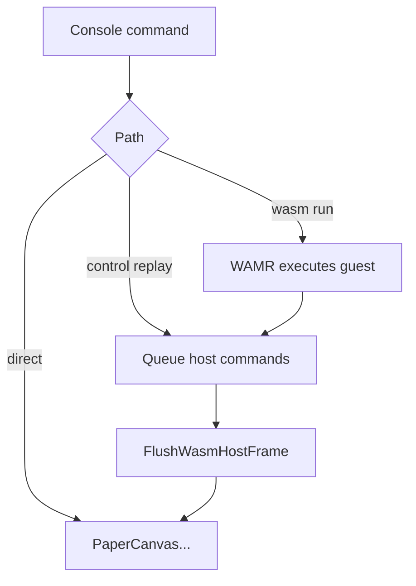

# PaperS3 replay isolation implementation plan

## Executive Summary

The current `0079` firmware can run far enough through WAMR to queue host commands, but it still panics when the queued commands are replayed on PaperS3. That means the current problem statement is narrower than "WAMR is broken." The next experiment must remove WAMR from the path entirely while preserving the replay mechanism as much as possible.

This ticket therefore proposes a WAMR-free control path:

- add a console command that does not load a Wasm module
- queue the same `hello-frame` drawing and logging operations that the AssemblyScript guest would have emitted
- flush the queued commands through the exact same replay logic already used by the WAMR-backed path
- compare the hardware result against `wasm run hello-frame`

If the control path crashes, the queue/replay/display path is independently broken. If the control path works but the Wasm-backed path still crashes, WAMR state or teardown remains a credible cause.

## Problem Statement

The current backtrace has already moved through several layers:

- first WAMR memory mapping
- then WAMR thread identity
- then direct native-import side effects
- then queued host-command replay

That is progress, but it still leaves an ambiguity: the queued replay happens after a Wasm run, so it is not yet proven that the replay path itself is safe in isolation.

The key debugging mistake to avoid is continuing to patch WAMR before we know whether WAMR is still materially involved in the final crash.

## Scope

This ticket is intentionally narrow.

Included:

- a control-path command for `hello-frame`
- explicit queueing of the same host operations that the Wasm guest would emit
- hardware validation of both the control path and the WAMR path
- detailed diary entries for each observed result

Excluded for now:

- generalizing to all bundled demos
- adding new host primitives
- redesigning the PaperS3 display stack
- replacing the WAMR component integration model

## System Context

There are now three relevant execution paths:

1. Direct display path
   - firmware code calls `PaperCanvas...` directly
2. Control replay path
   - firmware code queues host commands and flushes them without WAMR
3. Wasm replay path
   - guest code queues host commands through WAMR and then firmware flushes them

The second path is the missing baseline.



## Behavioral Target

The first control-path command should mirror `hello-frame`.

The guest program currently does this:

```text
screenClear(WHITE)
drawRect(16, 16, DISPLAY_WIDTH - 32, DISPLAY_HEIGHT - 32, BLACK)
drawRect(28, 28, DISPLAY_WIDTH - 56, DISPLAY_HEIGHT - 56, MID_GRAY)
fillRect(56, 72, 260, 92, BLACK)
fillRect(70, 86, 232, 64, WHITE)
fillRect(DISPLAY_WIDTH - 320, DISPLAY_HEIGHT - 164, 248, 76, MID_GRAY)
drawRect(DISPLAY_WIDTH - 320, DISPLAY_HEIGHT - 164, 248, 76, BLACK)
present(1)
logI32(1, 79)
```

The control path should emit the same sequence in the same order.

## Design

### Console shape

Add a small subcommand under `wasm` rather than inventing a new top-level command.

Recommended initial syntax:

- `wasm replay hello-frame`
- `wasm replay-status`

Why:

- keeps the investigation near the existing Wasm commands
- makes operator comparison simple
- avoids implying that the control path is a permanent product surface

### Host API surface

The queue/flush implementation already exists in [wasm_host_api.cpp](/home/manuel/workspaces/2025-12-21/echo-base-documentation/esp32-s3-m5/0079-papers3-wamr-assemblyscript-console/main/wasm_host_api.cpp), but most queueing helpers are still file-local.

For the control path, expose only what is necessary:

- `ResetWasmHostFrame()`
- `FlushWasmHostFrame(...)`
- explicit queue helpers:
  - `QueueWasmHostLogI32(...)`
  - `QueueWasmHostDelayMs(...)`
  - `QueueWasmHostScreenClear(...)`
  - `QueueWasmHostDrawRect(...)`
  - `QueueWasmHostFillRect(...)`
  - `QueueWasmHostPresent(...)`

Avoid exposing internal storage structs directly. The console command should be able to say "queue this operation," not manipulate queue entries itself.

### Control-sequence builder

Add one small host-side helper that mirrors the guest `hello-frame` behavior.

Suggested location:

- new file:
  [main/wasm_replay_control.cpp](/home/manuel/workspaces/2025-12-21/echo-base-documentation/esp32-s3-m5/0079-papers3-wamr-assemblyscript-console/main/wasm_replay_control.cpp)

Responsibilities:

- translate a control example name into a known replay sequence
- queue commands in the same order as the guest program
- flush and report success/failure

Keep this small and literal. This is not the time for a generic scene graph.

### Status reporting

The operator needs enough visibility to compare runs.

Minimum recommended output:

- `control_example=hello-frame`
- `queued_commands=<n>`
- `flush=success|failure`
- `error_stage=...`
- `error_message=...`

Optionally, track a separate `last_replay` section in `wasm status`.

## Pseudocode

### Control command

```cpp
if (argv[1] == "replay") {
  const char* name = argv[2];
  ReplayResult result = RunReplayControlExample(name);
  PrintReplayResult(result);
  return result.success ? 0 : 1;
}
```

### Replay builder

```cpp
ReplayResult RunReplayControlExample(const char* name) {
  ResetWasmHostFrame();
  PaperCanvasResetFrame();

  if (name == "hello-frame") {
    QueueWasmHostScreenClear(WHITE);
    QueueWasmHostDrawRect(16, 16, DISPLAY_WIDTH - 32, DISPLAY_HEIGHT - 32, BLACK);
    QueueWasmHostDrawRect(28, 28, DISPLAY_WIDTH - 56, DISPLAY_HEIGHT - 56, MID_GRAY);
    QueueWasmHostFillRect(56, 72, 260, 92, BLACK);
    QueueWasmHostFillRect(70, 86, 232, 64, WHITE);
    QueueWasmHostFillRect(DISPLAY_WIDTH - 320, DISPLAY_HEIGHT - 164, 248, 76, MID_GRAY);
    QueueWasmHostDrawRect(DISPLAY_WIDTH - 320, DISPLAY_HEIGHT - 164, 248, 76, BLACK);
    QueueWasmHostPresent(1);
    QueueWasmHostLogI32(1, 79);
  } else {
    return failure("lookup", "unknown replay example");
  }

  if (!FlushWasmHostFrame(err_buf, sizeof(err_buf))) {
    return failure("flush", err_buf);
  }

  return success();
}
```

## Implementation Plan

### Step 1: Document the experiment and create the diary

Deliverables:

- this implementation plan
- a dedicated diary for the ticket
- a task list with code, hardware, and follow-up branches

### Step 2: Expose queue helpers safely

Code changes:

- expand [wasm_host_api.h](/home/manuel/workspaces/2025-12-21/echo-base-documentation/esp32-s3-m5/0079-papers3-wamr-assemblyscript-console/main/wasm_host_api.h)
- refactor [wasm_host_api.cpp](/home/manuel/workspaces/2025-12-21/echo-base-documentation/esp32-s3-m5/0079-papers3-wamr-assemblyscript-console/main/wasm_host_api.cpp) so queueing logic can be reused by both Wasm imports and host control code

Acceptance check:

- `idf.py build`

### Step 3: Add the control replay runner

Code changes:

- add a small replay helper module
- implement `hello-frame` sequence literally

Acceptance check:

- build succeeds
- no change to existing `wasm run` command behavior except added console options

### Step 4: Add console wiring

Code changes:

- extend [wasm_command.cpp](/home/manuel/workspaces/2025-12-21/echo-base-documentation/esp32-s3-m5/0079-papers3-wamr-assemblyscript-console/main/wasm_command.cpp)

Acceptance check:

- `help` and `wasm examples` show the new commands

### Step 5: Hardware baseline pass

Run on device:

- `wasm replay hello-frame`
- `wasm run hello-frame`

Interpretation:

- replay fails, run fails:
  display/replay path is independently broken
- replay succeeds, run fails:
  WAMR state remains implicated
- both succeed:
  current crash has been eliminated

### Step 6: Record the result and branch the next ticket/work

If replay fails:

- reduce the control path further:
  - one clear only
  - one rect only
  - present only

If replay succeeds:

- compare queue contents, timing, and teardown order against the Wasm-backed path

## Risks

- The control path may still crash and provide no immediate fix.
  That is acceptable because the value is in narrowing the problem.
- The replay builder may accidentally diverge from the guest sequence.
  Keep it literal and short to reduce this risk.
- The experiment may start mutating the production command surface.
  Keep names explicit and investigation-oriented.

## Open Questions

- Does `PaperCanvasScreenClear(...)` crash even when invoked through the same queue without any prior Wasm execution?
- Does `present(1)` alone trigger the same failure?
- Is `M5.Display.waitDisplay()` interacting badly with the console task regardless of WAMR?

## Review Checklist

- Verify that the control path uses the same queue and flush implementation as the Wasm path.
- Verify that `hello-frame` control replay matches the guest sequence exactly.
- Verify that diary entries include command, observed failure, hypothesis, and next action for each hardware cycle.
