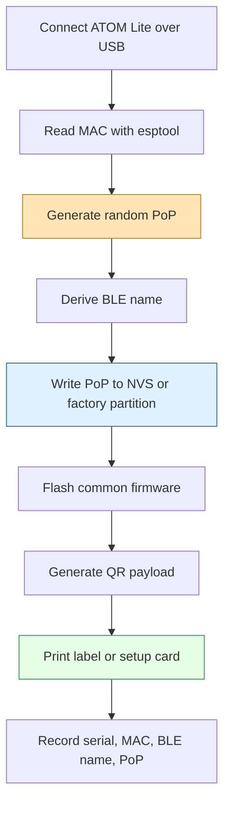
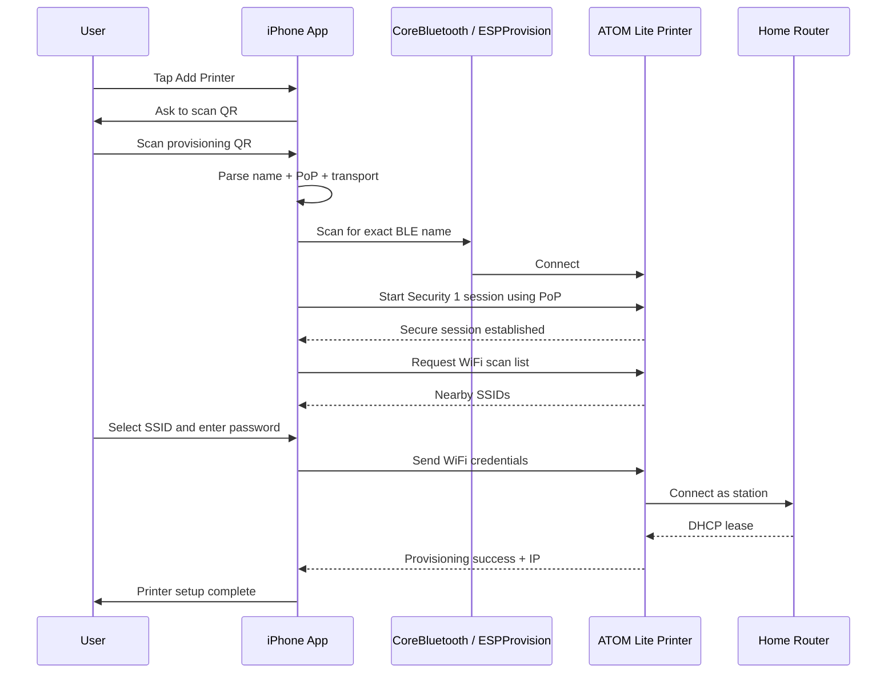

# Production PoP and iPhone Provisioning Analysis

## Executive Summary

The current ATOM Lite printer firmware proves that Espressif's ESP-IDF BLE provisioning flow works on the M5Stack ATOM Thermal Printer Kit. The device boots, initializes the printer UART, starts BLE provisioning, advertises as `M5PRN_538700`, accepts Security 1 provisioning with PoP `12345678`, and can be provisioned from a phone.

That is a correct development milestone, but it is not a production provisioning design. A production design needs a **unique per-device Proof-of-Possession (PoP)** and a smooth iPhone flow that hides protocol details from the user. The user should not manually type `M5PRN_538700`, guess security versions, or copy a PoP from serial logs. They should scan a QR code, enter their WiFi password, and watch the printer complete setup.

> [!summary]
> - The development PoP `12345678` must become a random, per-device secret before real-world deployment.
> - The best iPhone UX is QR-code driven: scan QR → connect to exact BLE device → run Espressif provisioning → wait for IP → show success.
> - Use Espressif's iOS provisioning SDK unless there is a strong reason to reimplement protocomm, protobuf, and Security 1 over CoreBluetooth.
> - Current hardware validation uncovered a post-provisioning task watchdog warning in `app_main()` that should be fixed before treating the firmware as product-ready.

---

## 1. What PoP Means

PoP stands for **Proof of Possession**. In Espressif's Security 1 provisioning mode, the phone and the ESP32 perform a secure session setup using X25519 and then use the PoP as an authentication ingredient. The PoP is not the WiFi password. It is a small per-device secret that answers a practical question: does the person trying to provision this printer physically possess the printer, its package, its setup card, or its label?

The distinction matters. BLE advertisements are public. Anyone nearby can see a device advertising as `M5PRN_538700`. Without a PoP, a nearby attacker could attempt to provision the device before the intended user does. With a PoP printed on the device or packaging, the phone app can prove that the user has access to something physically shipped with the printer.

The development firmware currently logs:

```text
Device    : M5PRN_538700
Security  : Security 1
PoP       : 12345678
QR data   : {"ver":"v1","name":"M5PRN_538700","pop":"12345678","transport":"ble"}
```

That is excellent for bring-up because it makes every part of the flow visible. It is wrong for production because every printer would share the same secret and because production firmware should not print the PoP to serial logs.

---

## 2. Development PoP vs Production PoP

A development PoP optimizes for speed. A production PoP optimizes for physical possession, supportability, and safe onboarding.

| Property | Development firmware | Production firmware |
| --- | --- | --- |
| PoP value | Fixed `12345678` | Unique random per device |
| User entry | Serial log / manual typing | QR scan or printed setup card |
| Firmware logging | Logs PoP for debugging | Does not log PoP |
| Device identity | MAC-derived name | MAC/serial-derived name plus backend record |
| Attack resistance | Low | Reasonable for consumer setup |
| Manufacturing requirement | None | Generate/store/print per-device secret |

A good production PoP should be random. It does not need to be a human-memorable password, because the best user flow uses QR scanning rather than manual typing. A reasonable shape is 8-12 uppercase alphanumeric characters:

```text
K7P93QX2
AB92KQ7PZ4
```

A numeric 6-digit PoP is easier to type but weaker and more collision-prone. It can be acceptable for consumer devices if rate limiting and physical possession assumptions are adequate, but alphanumeric QR-carried PoPs are better.

Avoid PoPs derived only from public information:

- Do not use the MAC address as the PoP.
- Do not use the last six MAC digits as the PoP.
- Do not use one shared factory password.
- Do not use a predictable serial counter.

A nearby scanner can read the BLE name and infer MAC-like suffixes. The PoP should add secret entropy, not reformat public identity.

---

## 3. The QR Code as the Product Boundary

The QR code is the clean boundary between manufacturing and app onboarding. Manufacturing creates a device identity and secret. The app consumes them. The user only performs a familiar action: scan.

A provisioning QR payload should contain enough information for the app to find and authenticate the device:

```json
{"ver":"v1","name":"M5PRN_538700","pop":"K7P93QX2","transport":"ble"}
```

The fields have specific jobs:

| Field | Meaning | Example |
| --- | --- | --- |
| `ver` | Payload schema version | `v1` |
| `name` | BLE provisioning device name | `M5PRN_538700` |
| `pop` | Per-device Proof-of-Possession | `K7P93QX2` |
| `transport` | Provisioning transport | `ble` |

The QR code can live in several places:

1. **On a sticker under the printer.** This is durable and strongly implies physical possession.
2. **On a setup card in the box.** This is user-friendly but can be separated from the device.
3. **Inside the paper bay.** This is protected but requires opening the printer.
4. **Printed by the printer on first boot.** This is elegant for a printer, but it requires firmware support for QR printing or a simple text/URL setup receipt.

For the ATOM printer, the most product-specific idea is first-boot printing. The device is a printer; setup can begin with the printer printing its own setup code. The first version does not need to render a QR code. It could print:

```text
Printer setup
Device: M5PRN_538700
PoP: K7P93QX2
Open app and scan setup QR on label
```

A later version can add ESC/POS QR support and print the actual provisioning QR payload.

---

## 4. Where to Store the PoP on the Device

The firmware needs access to the PoP before provisioning starts. There are three practical storage strategies.

### 4.1 Compile-Time Constant

The simplest approach is to generate a header during flashing:

```c
#define DEVICE_PROV_POP "K7P93QX2"
```

This is easy for a few devices, but it creates one firmware binary per device. That complicates reproducibility and makes it easy to lose track of which binary belongs to which serial number.

Use this for prototypes, not for a scalable process.

### 4.2 Regular NVS Key

A better small-batch approach is to flash the same firmware to every device and then write a per-device PoP into NVS:

```text
namespace: factory
key: prov_pop
value: K7P93QX2
```

At boot, the firmware reads `factory/prov_pop`. If the key does not exist, it can fall back to a development PoP or refuse to start production provisioning.

This approach is easy to implement and works well for dozens or hundreds of devices. The main discipline is to keep a manufacturing CSV or backend table:

| Serial | MAC | BLE name | PoP |
| --- | --- | --- | --- |
| M5P-0001 | `14:08:08:53:87:00` | `M5PRN_538700` | `K7P93QX2` |

### 4.3 Manufacturing Partition

The most robust approach is a dedicated manufacturing partition. ESP-IDF supports custom partition tables, so the device can have a read-only-ish factory data area containing serial number, model, hardware revision, and PoP.

Example CSV extension:

```csv
# Name,   Type, SubType, Offset,  Size, Flags
nvs,      data, nvs,     ,        0x6000,
phy_init, data, phy,     ,        0x1000,
factory_data,data, nvs,  ,        0x4000,
factory,  app,  factory, ,        0x180000,
```

This is the right direction if the printer becomes a repeatable product rather than a one-off firmware experiment.

---

## 5. Manufacturing Flow

A small-batch manufacturing flow can be simple and still disciplined.



The simplest command sequence for the first steps is:

```bash
python -m esptool --chip esp32 -p /dev/ttyUSB0 read_mac
```

Generate a PoP:

```bash
python3 - <<'PY'
import secrets, string
alphabet = string.ascii_uppercase + string.digits
print(''.join(secrets.choice(alphabet) for _ in range(10)))
PY
```

Derive the BLE name from the last three bytes of the station MAC, matching the current firmware pattern:

```text
MAC:      14:08:08:53:87:00
BLE name: M5PRN_538700
```

Generate the QR payload:

```json
{"ver":"v1","name":"M5PRN_538700","pop":"K7P93QX2","transport":"ble"}
```

The operational rule is simple: the QR code and the firmware must agree on the same `name` and `pop`. Everything else in the user experience depends on that invariant.

---

## 6. iPhone App Architecture

A smooth iPhone provisioning flow should not expose BLE jargon. The user should never see GATT services, characteristics, Security 1, protocomm, or protobufs. The app can use those internally, but the UI should speak in product language.

Recommended user flow:

```text
Add Printer → Scan QR → Connect to Printer → Choose WiFi → Enter Password → Setup Complete
```

Under the hood, the app does this:



The best implementation path is to use Espressif's iOS provisioning SDK:

```text
https://github.com/espressif/esp-idf-provisioning-ios
```

This SDK exists to avoid reimplementing:

- BLE discovery and connection management.
- Espressif protocomm endpoint discovery.
- Security 1 session setup.
- Protobuf request/response messages.
- WiFi scan, credential send, and status polling.

Writing directly against CoreBluetooth is possible, but it moves too much protocol complexity into the app. The product value is not in implementing protocomm. The product value is in a reliable printer setup experience.

---

## 7. iPhone UX Details

The iPhone app has one unavoidable constraint: iOS will not give arbitrary apps full access to saved WiFi credentials. The app should assume the user must enter the WiFi password.

A good setup screen looks like this:

```text
Set up Printer

Printer: M5PRN_538700 ✓ Connected

WiFi Network
[ HomeNetwork        v ]

Password
[ •••••••••••••••••    ]

[ Connect Printer ]
```

The WiFi network list can come from the ESP32's provisioning WiFi scan endpoint, not from iOS. That is often better than trying to read the phone's current SSID, because iOS SSID access requires entitlements and permissions that vary by version.

The app should handle these states explicitly:

| State | User-facing message | Internal condition |
| --- | --- | --- |
| QR scanned | `Looking for your printer...` | BLE scan for exact name |
| BLE connected | `Printer found.` | BLE connection established |
| PoP failed | `The setup code did not match this printer.` | Security credentials mismatch |
| WiFi auth failed | `WiFi password was not accepted.` | `WIFI_PROV_STA_AUTH_ERROR` |
| AP not found | `The printer could not see that WiFi network.` | AP not found failure |
| Success | `Printer is connected.` | IP received / provisioning success |

The most important UX rule is to preserve context. If WiFi authentication fails, do not send the user back to the QR scanner. Keep the BLE session if possible, keep the selected SSID visible, and let the user retype the password.

---

## 8. Firmware Changes Needed for Production

The current firmware has the correct provisioning skeleton but needs production hardening.

### 8.1 Replace Fixed PoP

Current code:

```c
static const char *PROV_POP = "12345678";
```

Production direction:

```c
char pop[PROV_POP_MAX_LEN];
if (read_factory_pop(pop, sizeof(pop)) != ESP_OK) {
    // development fallback or production error path
}
```

For development builds, a fallback PoP is useful. For production builds, missing PoP should be treated as a manufacturing defect.

### 8.2 Stop Logging PoP in Production

Development logs currently include:

```text
PoP       : 12345678
QR data   : {"ver":"v1",...}
```

Production logs should include the device name but not the secret:

```text
Provisioning service started: M5PRN_538700
Scan the device QR code in the mobile app.
```

If support needs the PoP, support should read it from the product label or backend, not from serial logs.

### 8.3 Add QR Setup Receipt

Because this is a printer, the firmware can eventually print its own setup receipt. The first version can print plain text; a later version can print an actual QR code using ESC/POS QR commands.

Plain text setup receipt:

```text
M5 Printer Setup
Device: M5PRN_538700
Open the app and scan the QR code on this card.
```

QR receipt direction:

```text
M5 Printer Setup
[ QR code containing provisioning payload ]
```

### 8.4 Fix Post-Provisioning Watchdog

Current tmux monitor captured repeated watchdog warnings after provisioning:

```text
E task_wdt: Task watchdog got triggered.
E task_wdt:  - IDLE0 (CPU 0)
E task_wdt: CPU 0: main
Backtrace ... xEventGroupWaitBits ... app_main ... main.c:239
```

This is not part of PoP design, but it is part of product readiness. The likely issue is that the main task is blocking or looping in a way that starves IDLE0 on CPU0. The next firmware task should restructure the post-provisioning wait loop so it yields cleanly, moves long waits to a separate task, or unsubscribes/resets task watchdog assumptions.

---

## 9. Backend and Support Model

A production app may not need a backend for local-only printers, but a backend is useful if users will register printers, receive updates, or ask for support.

A minimal backend device table:

| Field | Purpose |
| --- | --- |
| `serial` | Human support identifier |
| `mac` | Hardware identity |
| `ble_name` | Provisioning scan target |
| `pop_hash` | Optional support verification without storing raw PoP |
| `model` | Hardware model |
| `manufactured_at` | Traceability |
| `owner_account_id` | Registration after setup |

The app can register the device after provisioning succeeds. At that point the printer has WiFi and can call home itself, or the app can tell the backend which serial was provisioned. Avoid making backend access mandatory for local setup unless the product needs account binding.

---

## 10. Recommended Roadmap

### Phase 1: Stabilize the Current Firmware

- Fix the post-provisioning task watchdog.
- Validate reboot behavior after provisioning.
- Validate GPIO39 factory reset.
- Validate that `115200` or `230400` is the documented safe flashing speed for this ATOM Lite unit.

### Phase 2: Add Per-Device PoP

- Add `factory/prov_pop` NVS read path.
- Add a small manufacturing script that reads MAC, generates PoP, writes NVS data, and emits QR payload.
- Stop logging PoP in production mode.

### Phase 3: Build the iPhone Setup App

- Use Espressif's iOS provisioning SDK.
- Implement QR scan and exact BLE device matching.
- Show WiFi scan list from the device.
- Send credentials and show provisioning progress.
- Handle auth failure and AP-not-found failure without restarting the entire flow.

### Phase 4: Printer-Native Setup Experience

- Print setup instructions or QR on first boot.
- Print setup success receipt after WiFi connects.
- Add printer test output from the app after provisioning.

---

## 11. Working Rules

- Treat PoP as a physical-possession secret, not as a user password.
- Use unique per-device PoPs for any real deployment.
- Prefer QR scanning over manual code entry.
- Use Espressif's iOS provisioning SDK rather than reimplementing protocomm in CoreBluetooth.
- Do not log production PoPs.
- Keep the BLE name stable and derivable from manufacturing records.
- Keep the SoftAP or button-reset recovery path available until the BLE app flow is proven in the field.
- Validate product setup as a full sequence: flash, boot, advertise, QR scan, secure session, WiFi scan, credential send, DHCP, status receipt, reboot persistence, factory reset.

---

## 12. Current Validation Snapshot

Observed from serial monitor:

```text
I atomlite-prov: M5 Printer ATOM Lite ESP-IDF BLE Provisioning
I printer: ATOM printer UART2 ready: TX=23 RX=33 baud=9600
I wifi_prov_mgr: Provisioning started with service name : M5PRN_538700
I atomlite-prov: BLE provisioning started
I NimBLE: GAP procedure initiated: advertise;
```

User-reported result:

```text
Provisioning succeeded from phone.
```

Open validation issue:

```text
Task watchdog triggers after provisioning, with backtrace through xEventGroupWaitBits in app_main.
```

That issue should be fixed before considering the firmware stable, but it does not invalidate the provisioning architecture. It means the event-loop structure needs a firmware cleanup pass.
