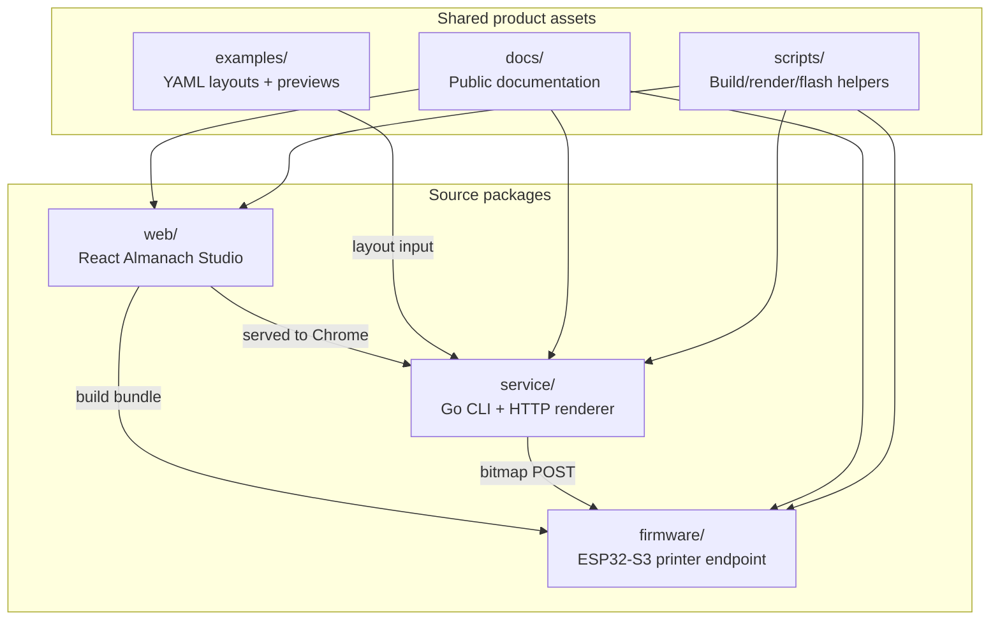

# Repository Reorganization and Packaging Design

## Executive Summary

The Almanach work now spans three distinct products that currently live inside a larger experimental workspace: ESP32-S3 printer firmware, a Go/Glazed render service, and a React Almanach Studio web app. The system works, but the current placement makes it difficult for another user to clone the project, understand what to build first, flash firmware, render examples, and print a page.

This design proposes a standalone repository named `almanach-printer` with clear product boundaries:

```text
almanach-printer/
├── firmware/    ESP-IDF firmware for the ESP32-S3 printer endpoint
├── service/     Go render service and CLI
├── web/         React Almanach Studio source and build pipeline
├── examples/    YAML layouts and rendered previews
├── docs/        user-facing and developer documentation
├── scripts/     repeatable build/render/flash helpers
└── packaging/   systemd, release, and deployment assets
```

The goal is not only to move files. The goal is to make the first successful user path obvious:

```bash
git clone <repo>
cd almanach-printer
make build
make render-example
open /tmp/almanach-example.png
```

A user with flashed hardware should then be able to run:

```bash
ALMANACH_PRINTER_IP=192.168.0.126 make print-example
```

The repository should feel like a product repository rather than a history of experiments. It should have one root README, stable examples, package-local READMEs, CI, Docker support, and release packaging.

---

## Problem Statement

The current implementation is technically functional, but it is embedded in a broad workspace:

```text
/home/manuel/workspaces/2025-12-21/echo-base-documentation/esp32-s3-m5/
```

Relevant code is distributed under paths such as:

```text
stoms3r/
stoms3r/cmd/almanach-render-service/
stoms3r/web/almanach/
stoms3r/main/assets/almanach/
ttmp/2026/05/08/ALMANACH-CLI--...
```

That is acceptable for development, but it creates several problems for external users:

- The project boundary is unclear. A new reader cannot tell whether `stoms3r`, `cmd/almanach-render-service`, or the workspace root is the product.
- The Go service currently lives under firmware-oriented paths even though it should be independently buildable and releasable.
- The web app is shared by the firmware and the render service, but its ownership is not obvious.
- Generated assets and source assets are close together, which makes it easy to edit the wrong copy.
- Example layouts are currently under the service directory, but they are product-level examples.
- The docmgr ticket contains excellent design information, but public users need a curated `docs/` set in the repository itself.
- CI, release packaging, systemd deployment, and installation docs are not yet represented as first-class repo concepts.

A reorganized repository should reduce the number of decisions a first-time user must make. The user should not need to understand the entire development history before rendering a PNG or flashing firmware.

---

## Goals

The new repository layout should satisfy these goals:

1. **Fast first success.** A user should render an example PNG within five minutes of cloning.
2. **Clear product boundaries.** Firmware, service, web, examples, and docs should have separate directories.
3. **Repeatable builds.** Root-level tasks should call package-local builds without requiring users to memorize paths.
4. **Single source for the web app.** The React source should live in one place; firmware assets should be generated or copied from that source.
5. **Release-ready service.** The Go service should have a conventional `cmd/` and `internal/` shape.
6. **Firmware as a proper ESP-IDF project.** The firmware should be directly buildable with `idf.py build` from its package directory.
7. **Examples as product assets.** YAML layouts and rendered previews should live at top level.
8. **Documentation that matches the package.** Public docs should live in `docs/`, and CLI help should remain embedded in the service binary.
9. **Deployment path.** Docker Compose, systemd, and release artifacts should be represented from the start.

---

## Non-Goals

This reorganization should not attempt to redesign every subsystem at once.

Non-goals for the first packaging pass:

- Rewriting the React SPA.
- Replacing ESP-IDF with another firmware framework.
- Replacing Chrome headless with a Go-native renderer.
- Changing the printer bitmap protocol.
- Building a full cloud scheduler.
- Supporting every ESP32 board variant in the first public layout.

The first public repository should package what already works and make future extension easier.

---

## Proposed Repository Layout

The recommended full layout is:

```text
almanach-printer/
├── README.md
├── LICENSE
├── Makefile
├── justfile                         # optional, nicer local task runner
├── .gitignore
├── .env.example
├── docker-compose.yml
├── docs/
│   ├── getting-started.md
│   ├── hardware.md
│   ├── firmware.md
│   ├── render-service.md
│   ├── layout-dsl.md
│   ├── printer-protocol.md
│   ├── examples.md
│   ├── troubleshooting.md
│   └── images/
│       ├── wiring.png
│       ├── web-ui.png
│       └── sample-print.jpg
├── firmware/
│   ├── README.md
│   ├── CMakeLists.txt
│   ├── sdkconfig.defaults
│   ├── partitions.csv
│   ├── main/
│   │   ├── CMakeLists.txt
│   │   ├── app_main.c
│   │   ├── web_server.c
│   │   ├── web_server.h
│   │   ├── printer_drv.c
│   │   ├── printer_drv.h
│   │   ├── printer_cmd.c
│   │   ├── wifi_cmd.c
│   │   ├── assets/
│   │   │   ├── index.html
│   │   │   └── almanach/
│   │   │       ├── almanach.html
│   │   │       └── almanach-bundle.js
│   │   └── ...
│   └── tools/
│       ├── flash.sh
│       ├── monitor.sh
│       └── erase.sh
├── service/
│   ├── README.md
│   ├── go.mod
│   ├── go.sum
│   ├── Makefile
│   ├── Dockerfile
│   ├── cmd/
│   │   └── almanach-render-service/
│   │       └── main.go
│   ├── internal/
│   │   ├── cli/
│   │   │   ├── root.go
│   │   │   ├── serve.go
│   │   │   ├── render.go
│   │   │   ├── inspect.go
│   │   │   └── print.go
│   │   ├── config/
│   │   │   └── config.go
│   │   ├── server/
│   │   │   ├── server.go
│   │   │   ├── handlers.go
│   │   │   └── static.go
│   │   ├── render/
│   │   │   ├── renderer.go
│   │   │   ├── options.go
│   │   │   ├── oneshot.go
│   │   │   └── metrics.go
│   │   ├── layout/
│   │   │   ├── layout.go
│   │   │   ├── defaults.go
│   │   │   └── validate.go
│   │   ├── bitmap/
│   │   │   └── bitmap.go
│   │   ├── printer/
│   │   │   └── client.go
│   │   └── fetchers/
│   │       ├── date.go
│   │       ├── weather.go
│   │       ├── news.go
│   │       ├── quote.go
│   │       ├── word.go
│   │       └── history.go
│   ├── doc/
│   │   ├── doc.go
│   │   ├── layouts-getting-started.md
│   │   ├── layouts-user-guide.md
│   │   ├── layout-dsl-reference.md
│   │   ├── tutorial-daily-briefing.md
│   │   └── tutorial-knowledge-strip.md
│   └── testdata/
│       ├── layouts/
│       └── images/
├── web/
│   ├── README.md
│   ├── package.json
│   ├── package-lock.json             # or pnpm-lock.yaml; choose one
│   ├── vite.config.js
│   ├── esbuild.mjs
│   ├── src/
│   │   ├── index.jsx
│   │   └── almanach-studio.jsx
│   └── dist/
│       ├── index.html
│       └── almanach-bundle.js
├── examples/
│   ├── README.md
│   ├── layouts/
│   │   ├── 01-minimal.yaml
│   │   ├── 02-daily-briefing.yaml
│   │   ├── 03-knowledge-strip.yaml
│   │   ├── 04-tracker-journal.yaml
│   │   ├── 05-wrapped-render-request.yaml
│   │   └── 06-paper-shell-preview.yaml
│   └── rendered/
│       ├── contact-sheet.png
│       └── ...
├── scripts/
│   ├── build-web.sh
│   ├── copy-web-to-firmware.sh
│   ├── render-examples.sh
│   ├── print-example.sh
│   └── smoke-test.sh
├── packaging/
│   ├── systemd/
│   │   └── almanach-render-service.service
│   ├── udev/
│   │   └── 99-almanach-printer.rules
│   └── release/
│       └── goreleaser.yaml
└── .github/
    └── workflows/
        ├── service.yml
        ├── web.yml
        ├── firmware.yml
        └── release.yml
```

This layout separates source responsibilities from generated and operational artifacts. It also gives every major subsystem a local README while keeping the root README focused on first success.

---

## Repository Mental Model

The repository should present the system as three buildable layers plus shared assets:



The web app is shared by firmware and service. The firmware embeds built assets. The service serves built assets to Chrome. Examples feed the service. The service sends bitmap output to the firmware. The docs and scripts explain and automate these paths.

---

## Root README Design

The root README should avoid explaining every source file. Its job is to get a user to a first render or first print.

Recommended opening:

```markdown
# Almanach Printer

A self-hosted thermal almanac system for 58mm printers.

It contains:

- ESP32-S3 firmware that exposes `/api/print/bitmap`
- A Go render service that turns YAML layouts into printer bitmaps
- A React Almanach Studio UI for designing layouts
- Example YAML layouts and rendered previews
```

Recommended quick start:

```markdown
## Quick Start

### 1. Render an example locally

```bash
make build
make render-example
open /tmp/almanach-example.png
```

### 2. Print to a flashed ESP32 printer

```bash
ALMANACH_PRINTER_IP=192.168.0.126 make print-example
```

### 3. Build firmware

```bash
cd firmware
idf.py build
```

### 4. Flash firmware

```bash
idf.py flash monitor
```
```

The README should point to detailed docs, not contain all of them.

---

## Root Makefile Design

The root Makefile should provide user-facing commands that call package-local builds.

```makefile
.PHONY: build test render-example print-example build-web firmware-build firmware-flash render-examples

build:
	cd service && go build -o bin/almanach-render-service ./cmd/almanach-render-service

test:
	cd service && go test ./...
	cd web && npm test --if-present

render-example:
	cd service && go run ./cmd/almanach-render-service render \
		--layout ../examples/layouts/01-minimal.yaml \
		--out /tmp/almanach-example.png

print-example:
	cd service && go run ./cmd/almanach-render-service print \
		--layout ../examples/layouts/01-minimal.yaml \
		--printer-ip $${ALMANACH_PRINTER_IP}

build-web:
	cd web && npm install && npm run build

copy-web-to-firmware:
	./scripts/copy-web-to-firmware.sh

firmware-build:
	cd firmware && idf.py build

firmware-flash:
	cd firmware && idf.py flash monitor

render-examples:
	./scripts/render-examples.sh
```

This file should not hide important prerequisites. If a command requires `ALMANACH_PRINTER_IP`, the command should fail with a helpful message when it is missing.

---

## Go Service Package Design

The current service package works, but it is too flat for a standalone repository. The public version should split responsibilities into `internal/` packages.

Recommended service structure:

```text
service/
├── cmd/almanach-render-service/main.go
├── internal/cli/
├── internal/config/
├── internal/server/
├── internal/render/
├── internal/layout/
├── internal/bitmap/
├── internal/printer/
├── internal/fetchers/
├── doc/
├── testdata/
├── go.mod
└── README.md
```

### Package Responsibilities

| Package | Responsibility |
|---|---|
| `cmd/almanach-render-service` | Minimal `main()` that calls `cli.NewRootCommand()`. |
| `internal/cli` | Glazed/Cobra commands: `serve`, `render`, `inspect`, `print`. |
| `internal/config` | Environment variables, defaults, CLI override helpers. |
| `internal/server` | HTTP route registration and handlers. |
| `internal/render` | Chrome allocator, render options, one-shot server, metrics. |
| `internal/layout` | Layout structs, validation, default layout construction. |
| `internal/bitmap` | PNG-to-1-bit conversion and blank-row padding. |
| `internal/printer` | ESP32 HTTP printer client. |
| `internal/fetchers` | Date, weather, news, quote, word, history data providers. |
| `doc` | Embedded Glazed help pages. |

### Why Split the Service

The split makes tests clearer:

- `internal/layout` can test schema and validation without Chrome.
- `internal/bitmap` can test raster packing and trailing blank rows without HTTP.
- `internal/printer` can test headers and request bodies with `httptest`.
- `internal/render` can isolate Chrome-specific tests.
- `internal/cli` can test command parsing and structured output behavior.

The split also allows external contributors to find the right layer without reading the whole service.

---

## Firmware Package Design

The firmware should be a normal ESP-IDF project under `firmware/`:

```text
firmware/
├── README.md
├── CMakeLists.txt
├── sdkconfig.defaults
├── partitions.csv
├── main/
│   ├── CMakeLists.txt
│   ├── app_main.c
│   ├── web_server.c
│   ├── web_server.h
│   ├── printer_drv.c
│   ├── printer_drv.h
│   ├── printer_cmd.c
│   ├── wifi_cmd.c
│   ├── assets/
│   │   ├── index.html
│   │   └── almanach/
│   │       ├── almanach.html
│   │       └── almanach-bundle.js
│   └── ...
└── tools/
    ├── flash.sh
    ├── monitor.sh
    └── erase.sh
```

The firmware README should cover:

- supported board: M5Stack AtomS3R / ESP32-S3,
- supported printer: M5Stack K118 / 58mm thermal mechanism,
- Wi-Fi configuration,
- flash and monitor commands,
- bitmap API endpoints,
- serial console expectations.

The firmware should prefer USB Serial/JTAG console:

```ini
CONFIG_ESP_CONSOLE_USB_SERIAL_JTAG=y
# CONFIG_ESP_CONSOLE_UART is not set
```

This avoids contaminating UART traffic used for peripherals or printer control.

---

## Web Package Design

The React web app is a source package, not a generated firmware artifact. It should live under `web/`:

```text
web/
├── README.md
├── package.json
├── package-lock.json
├── vite.config.js
├── esbuild.mjs
├── src/
│   ├── index.jsx
│   └── almanach-studio.jsx
└── dist/
    ├── index.html
    └── almanach-bundle.js
```

The web app is consumed by two targets:

1. The Go render service serves it to Chrome headless.
2. The firmware embeds built files into flash.

The build pipeline should therefore have explicit scripts:

```bash
scripts/build-web.sh
scripts/copy-web-to-firmware.sh
```

`build-web.sh` should produce `web/dist/`. `copy-web-to-firmware.sh` should copy or transform those files into:

```text
firmware/main/assets/almanach/almanach.html
firmware/main/assets/almanach/almanach-bundle.js
```

This keeps the source of truth in `web/` and makes firmware assets reproducible.

---

## Examples Package Design

Examples should be top-level product assets:

```text
examples/
├── README.md
├── layouts/
│   ├── 01-minimal.yaml
│   ├── 02-daily-briefing.yaml
│   ├── 03-knowledge-strip.yaml
│   ├── 04-tracker-journal.yaml
│   ├── 05-wrapped-render-request.yaml
│   └── 06-paper-shell-preview.yaml
└── rendered/
    ├── contact-sheet.png
    ├── 01-minimal.png
    └── ...
```

Examples should serve as both documentation and regression artifacts. A user can inspect the YAML, render it, compare the PNG, and print it. A maintainer can rerender the corpus after changes to the renderer.

Recommended example commands:

```bash
make render-examples
open examples/rendered/contact-sheet.png
```

The rendered files can be committed initially because visual output is central to this project. If the corpus grows too large, the repository can later move generated PNGs to release artifacts or documentation assets.

---

## Documentation Set

The public repository should include these docs:

```text
docs/
├── getting-started.md
├── hardware.md
├── firmware.md
├── render-service.md
├── layout-dsl.md
├── printer-protocol.md
├── examples.md
├── troubleshooting.md
└── development.md
```

### `docs/getting-started.md`

This should be the first long-form document a user reads. It should cover:

1. installing prerequisites,
2. rendering an example locally,
3. printing to an existing device,
4. building firmware,
5. flashing firmware,
6. opening the browser UI.

### `docs/hardware.md`

This should cover:

- board models,
- printer models,
- power requirements,
- UART wiring,
- known-good AtomS3R/K118 setup,
- troubleshooting physical symptoms.

### `docs/printer-protocol.md`

This should define:

```text
POST /api/print/bitmap
Content-Type: application/octet-stream
X-Width: 384
X-Height: <height>
X-Feed: 0

<body: packed 1-bit bitmap, MSB-first>
```

It should document:

- black bit = `1`,
- white bit = `0`,
- width padded to a multiple of 8,
- bytes per row = width / 8,
- the Go service appends blank raster rows for feed spacing.

### `docs/layout-dsl.md`

This can mirror the embedded Glazed help page `layout-dsl-reference`. The repository should not make users run the binary just to read the DSL, but the binary should also contain the same material.

---

## Docker and Compose Design

The top-level `docker-compose.yml` should run the service and Chrome in the recommended production-like mode:

```yaml
services:
  chrome:
    image: chromedp/headless-shell:latest
    command:
      - --remote-debugging-address=0.0.0.0
      - --remote-debugging-port=9222
      - --no-sandbox
    ports:
      - "9222:9222"

  almanach-render:
    build:
      context: ./service
    environment:
      ALMANACH_PORT: "8199"
      ALMANACH_WEB_DIR: /app/web
      ALMANACH_PRINTER_IP: ${ALMANACH_PRINTER_IP:-}
      CHROME_WS_URL: ws://chrome:9222
    ports:
      - "8199:8199"
    depends_on:
      - chrome
```

The service `Dockerfile` should copy the binary and the built web assets. It should default to server mode:

```dockerfile
ENTRYPOINT ["almanach-render-service", "serve"]
```

The root README should include:

```bash
ALMANACH_PRINTER_IP=192.168.0.126 docker compose up
curl http://localhost:8199/health
```

---

## Systemd Packaging

The repository should include a systemd unit for Raspberry Pi or other always-on hosts:

```ini
[Unit]
Description=Almanach Render Service
After=network-online.target
Wants=network-online.target

[Service]
ExecStart=/usr/local/bin/almanach-render-service serve
Environment=ALMANACH_PORT=8199
Environment=ALMANACH_WEB_DIR=/opt/almanach/web
Environment=ALMANACH_PRINTER_IP=192.168.0.126
Restart=on-failure
User=almanach
Group=almanach

[Install]
WantedBy=multi-user.target
```

This belongs under:

```text
packaging/systemd/almanach-render-service.service
```

The docs should explain where to install the binary, where to put web assets, and how to override the printer IP.

---

## CI Design

CI should answer four questions:

1. Does the Go service build and test?
2. Does the web bundle build?
3. Does the firmware compile?
4. Can examples render in a headless environment?

Recommended workflows:

```text
.github/workflows/service.yml
.github/workflows/web.yml
.github/workflows/firmware.yml
.github/workflows/release.yml
```

### Service CI

```yaml
- run: cd service && go test ./...
- run: cd service && go build ./cmd/almanach-render-service
```

### Web CI

```yaml
- run: cd web && npm ci
- run: cd web && npm run build
```

### Firmware CI

Use an Espressif image:

```yaml
container: espressif/idf:release-v5.4
steps:
  - run: cd firmware && idf.py build
```

### Example Render CI

Example rendering requires Chrome. This can run in service CI if Chrome is installed, or in a Docker job using the headless-shell image.

```bash
cd service
go run ./cmd/almanach-render-service render \
  --layout ../examples/layouts/01-minimal.yaml \
  --out /tmp/almanach-ci.png
identify /tmp/almanach-ci.png
```

---

## Migration Plan

The reorganization should happen in small commits. Do not move everything and refactor everything in one step.

### Phase 1: Create the New Repository Skeleton

Create directories:

```text
README.md
docs/
examples/
service/
firmware/
web/
scripts/
packaging/
.github/workflows/
```

Add stub READMEs and root Makefile. At this point the repo can be empty of code, but the shape should be clear.

### Phase 2: Move the Go Service

Move current:

```text
stoms3r/cmd/almanach-render-service/
```

into:

```text
service/
```

For the first move, preserve package shape if necessary. Then split into `cmd/` and `internal/` in a follow-up commit.

### Phase 3: Move the Web App

Move current:

```text
stoms3r/web/almanach/
```

into:

```text
web/
```

Ensure service and firmware builds know where to read built assets.

### Phase 4: Move Firmware

Move current:

```text
stoms3r/
```

into:

```text
firmware/
```

Keep `sdkconfig.defaults`, `partitions.csv`, `CMakeLists.txt`, and `main/` together.

### Phase 5: Move Examples

Move current service examples:

```text
service/examples/
```

into top-level:

```text
examples/
```

Update CLI examples in README and scripts to use `../examples/...` from the service directory.

### Phase 6: Add Scripts

Add:

```text
scripts/build-web.sh
scripts/copy-web-to-firmware.sh
scripts/render-examples.sh
scripts/print-example.sh
scripts/smoke-test.sh
```

Each script should fail fast and print commands as it runs them.

### Phase 7: Add CI

Add service, web, and firmware CI separately. Start with Go CI because it is fastest.

### Phase 8: Add Release Packaging

Add systemd unit, GoReleaser config, and Docker image release flow.

---

## Alternatives Considered

### Keep Everything Under `stoms3r/`

This is the lowest-effort option, but it keeps the product boundary unclear. The render service and React app are not firmware subdirectories conceptually. They are separate packages that cooperate with firmware.

### Make the Go Service the Repository Root

This would optimize for CLI users but make firmware and web assets feel secondary. The project is broader than a Go service; the firmware and web app are first-class components.

### Use a Monorepo with `packages/`

A `packages/service`, `packages/web`, `packages/firmware` layout is common, but it adds a layer of indirection. For this project, top-level `service/`, `web/`, and `firmware/` are easier for new users.

### Do a Full Go Package Split During Migration

This is attractive but risky. The first move should preserve behavior. Package splitting should happen after the new repository builds and examples render.

---

## Design Decisions

### Decision 1: Use Top-Level Product Directories

`firmware/`, `service/`, and `web/` are top-level because they are independently buildable products. This makes the repository easier to scan and makes CI workflows simpler.

### Decision 2: Keep Examples Top-Level

Examples teach the whole product, not just the service. They should be visible from the root and used by README quick starts.

### Decision 3: Keep Embedded CLI Help in the Service

The CLI should remain self-documenting. The same material can be mirrored in `docs/layout-dsl.md`, but the binary should still answer `help layout-dsl-reference` offline.

### Decision 4: Use Scripts for Cross-Package Asset Flow

The web app is source. Firmware assets are generated. Scripts make this relationship explicit and repeatable.

### Decision 5: Preserve a Short Root Makefile

The root Makefile should be an orientation tool. Package-specific complexity belongs in package-local Makefiles or scripts.

---

## Definition of Done

The reorganization is complete when:

- A fresh clone can run `make build` successfully.
- A fresh clone can run `make render-example` and produce a PNG.
- `service/` can build and test independently.
- `web/` can build independently.
- `firmware/` can run `idf.py build` independently.
- `examples/layouts/` contains the known-good YAML examples.
- `examples/rendered/contact-sheet.png` exists or can be regenerated.
- `docs/getting-started.md` explains the first render and first print paths.
- `docs/printer-protocol.md` documents the bitmap endpoint and blank-row feed behavior.
- Docker Compose can start the service.
- CI runs at least Go tests, web build, and firmware build.
- The old workspace-specific assumptions have been removed from READMEs and scripts.

---

## Open Questions

1. Should rendered PNG previews remain committed, or should they become generated artifacts? For now, committing them is useful because visual output is part of the product contract.
2. Should `web/dist/` be committed? Firmware builds need assets, but generated files can become stale. A script-driven copy from `web/` to `firmware/` is preferable.
3. Should the public repo include devctl integration? It is useful for Manuel's workflow, but root Makefile commands are more universally accessible.
4. Should the firmware support multiple boards in the first public release, or document AtomS3R as the supported target and defer variants?
5. Should the Go service split into `internal/` packages before or after the first repository migration? The safer order is after the first successful migration build.

---

## References

Current source locations in this workspace:

```text
/home/manuel/workspaces/2025-12-21/echo-base-documentation/esp32-s3-m5/stoms3r
/home/manuel/workspaces/2025-12-21/echo-base-documentation/esp32-s3-m5/stoms3r/cmd/almanach-render-service
/home/manuel/workspaces/2025-12-21/echo-base-documentation/esp32-s3-m5/stoms3r/web/almanach
```

Related ticket documents:

```text
ttmp/2026/05/08/ALMANACH-CLI--almanach-render-service-cli-verbs-with-glazed/design-doc/01-cli-verbs-with-glazed-analysis-design-and-implementation-guide.md
ttmp/2026/05/08/ALMANACH-CLI--almanach-render-service-cli-verbs-with-glazed/reference/01-implementation-diary.md
```
