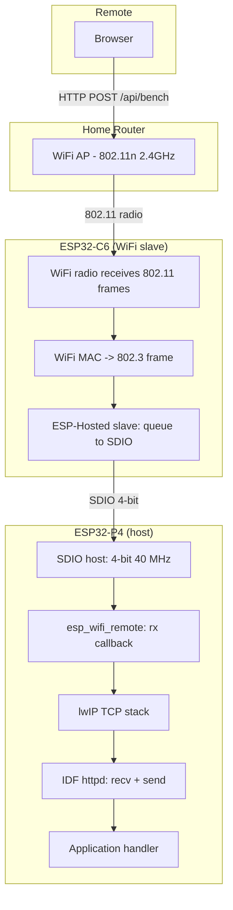

# Benchmark Firmware Design and Intern Guide

## Goal

Build a dedicated ESP32-P4 firmware for the M5Stack Tab5 that measures throughput at every layer of the WiFi-to-HTTP data path. The firmware exposes HTTP endpoints that accept uploads of varying sizes and compression modes, instruments the transfer with microsecond timestamps, and returns detailed per-layer timing and throughput metrics. The resulting data will identify exactly where the 3-second observed upload time diverges from the 0.3-second theoretical minimum documented in the upload optimization article.

This document also serves as an onboarding guide. An intern joining the project should be able to read this document, understand the entire data path from browser to pixel, build the firmware, run the benchmarks, and interpret the results — without needing to read any other document first.

---

## 1. The system you are benchmarking

### 1.1 Physical hardware

The M5Stack Tab5 is a 10.1-inch tablet built around two ESP32 chips on a single PCB:

| Component | Chip | Role |
|---|---|---|
| Application processor | ESP32-P4 | Dual-core RISC-V @ 400 MHz, 2 MB SRAM, 32 MB PSRAM, MIPI DSI controller |
| WiFi slave | ESP32-C6 | RISC-V @ 160 MHz, 802.11b/g/n/ax (2.4 GHz), runs full WiFi stack |
| Display | ST7123 panel | 720x1280 portrait, MIPI DSI, 2 data lanes @ 730 Mbps |
| Flash | 16 MB SPI flash | Stores bootloader, partition table, application |
| PSRAM | 32 MB OMAP PSRAM | Accessible via SPI/DDR, used for large buffers |

The two chips communicate over an SDIO bus. The P4 is the bus host; the C6 is the bus slave. The P4 has no direct WiFi radio access. Every WiFi frame — inbound or outbound — traverses the SDIO link.

### 1.2 The data path

When a browser on the local network uploads data to the Tab5, the bytes traverse this path:



Each arrow in this diagram is a potential bottleneck. The benchmark firmware must instrument enough of these transitions to determine which ones contribute to the observed latency.

### 1.3 The SDIO bus

The SDIO bus configuration for the Tab5 is defined in `sdkconfig.defaults`:

```
CONFIG_ESP_HOSTED_SDIO_4_BIT_BUS=y
CONFIG_ESP_HOSTED_SDIO_BUS_WIDTH=4
CONFIG_ESP_HOSTED_SDIO_CLOCK_FREQ_KHZ=40000
CONFIG_ESP_HOSTED_SDIO_PIN_CMD=13
CONFIG_ESP_HOSTED_SDIO_PIN_CLK=12
CONFIG_ESP_HOSTED_SDIO_PIN_D0=11
CONFIG_ESP_HOSTED_SDIO_PIN_D1=10
CONFIG_ESP_HOSTED_SDIO_PIN_D2=9
CONFIG_ESP_HOSTED_SDIO_PIN_D3=8
```

The bus is 4 bits wide at 40 MHz, giving a raw bit rate of 160 Mbps. After protocol overhead (command framing, CRC, response latency), the effective throughput is approximately 12 MB/s. The SDIO bus queue sizes are:

```
CONFIG_ESP_HOSTED_SDIO_TX_Q_SIZE=20
CONFIG_ESP_HOSTED_SDIO_RX_Q_SIZE=20
```

Each queue entry holds one WiFi frame. At typical MTU (1500 bytes), the combined queue capacity is 20 x 1500 = 30 KB in each direction. When the P4's TCP stack cannot drain the RX queue fast enough, the C6 applies backpressure: it signals the WiFi access point to pause transmission using 802.11 power-save or explicit PS-POLL frames.

### 1.4 ESP-Hosted: the driver that glues P4 to C6

ESP-Hosted is Espressif's driver framework for connecting a host processor (P4) to a WiFi slave (C6) over a serial transport (SDIO or SPI). On the P4 side, it provides the `esp_wifi_remote` component, which implements the same `esp_wifi_*` API as the native WiFi driver. Applications call `esp_wifi_connect()`, `esp_wifi_set_mode()`, etc., and the calls are forwarded over SDIO to the C6, which executes them.

Key files in the IDF:

| File | Location | Purpose |
|---|---|---|
| `esp_hosted_api.h` | `managed_components/espressif__esp_hosted/host/api/include/` | Public API for host-side ESP-Hosted |
| `esp_hosted_transport_config.h` | same | SDIO/SPI transport configuration |
| `esp_wifi_remote` | `components/esp_wifi/` (IDF) | Thin wrapper that forwards WiFi API calls to ESP-Hosted |

The `esp_wifi_remote` component registers an RX callback with the SDIO transport. When the C6 sends a received WiFi frame over SDIO, this callback fires on the P4. The callback pushes the frame into the lwIP TCP stack, which then delivers the data to the application's socket.

### 1.5 IDF HTTP server (httpd)

The IDF provides a lightweight HTTP server in the `esp_http_server` component. It runs in a single FreeRTOS task and processes one request at a time per socket. The default configuration:

| Parameter | Default | Our override | Reason |
|---|---|---|---|
| `stack_size` | 4096 | 49152 (48 KB) | `tinfl_decompress_mem_to_mem` needs ~43 KB |
| `recv_wait_timeout` | 5 | 30 | Large uploads exceed 5s per recv |
| `send_wait_timeout` | 5 | 5 | Small JSON responses, no change needed |
| `max_uri_handlers` | 8 | 8 | Sufficient for benchmark endpoints |
| `max_open_sockets` | 7 | 7 | One client at a time is fine |

API reference: `esp_http_server.h` in `components/esp_http_server/include/`

The server task calls `httpd_req_recv()` to read the request body. This function blocks until data is available in the socket buffer, the timeout expires, or the connection closes. Each call may involve an SDIO round-trip if the socket buffer is empty and the P4 must wait for the C6 to deliver more WiFi frames.

### 1.6 WiFi modes: STA vs SoftAP

The Tab5 runs in APSTA mode — it acts as both a station (client) connected to a home router and an access point serving its own WiFi network.

- **STA mode**: The Tab5 connects to a home router. The browser is on the same LAN. Data path: browser → router → C6 → SDIO → P4. Round-trip latency is typically 20-30 ms due to the extra radio hop through the router.
- **SoftAP mode**: The browser connects directly to the Tab5's own WiFi network (SSID: `Tab5-UI-Viewer`). Data path: browser → C6 → SDIO → P4. Round-trip latency is typically 5-10 ms because there is no router hop.

For benchmarking, both paths must be measured separately because the latency difference directly affects TCP slow-start duration.

---

## 2. What we need to measure

### 2.1 Per-request timing breakdown

For each upload, we need these timestamps:

| Timestamp | Name | Where captured | What it measures |
|---|---|---|---|
| T0 | `req_start` | HTTP handler entry | When httpd dispatches the request |
| T1 | `recv_start` | Before first `httpd_req_recv()` | Start of body reception |
| T2 | `recv_end` | After last `httpd_req_recv()` returns | End of body reception |
| T3 | `decompress_start` | Before `tinfl_decompress_mem_to_mem` | Start of decompression (if applicable) |
| T4 | `decompress_end` | After decompression returns | End of decompression |
| T5 | `resp_start` | Before `httpd_resp_send()` | Start of HTTP response |
| T6 | `resp_end` | After `httpd_resp_send()` returns | End of HTTP response |

From these, we derive:

- **Network recv time**: T2 - T1 (dominated by WiFi + SDIO + TCP)
- **Decompression time**: T4 - T3 (CPU-bound, proportional to output size)
- **Total server time**: T6 - T0 (including all IDF httpd overhead)

### 2.2 Per-recv-segment timing

A single upload involves multiple `httpd_req_recv()` calls. For large payloads, the number of calls and the time per call reveal the TCP receive pattern. We should capture:

```
struct recv_segment {
    uint32_t call_number;    // 1, 2, 3, ...
    uint32_t bytes_read;     // bytes returned by this recv() call
    int64_t  timestamp_us;  // esp_timer_get_time() at return
};
```

The interval between consecutive segments shows the TCP receive cadence. Gaps larger than 1 ms indicate stalls — either TCP flow control (waiting for ACKs to clear), SDIO backpressure (C6 queues full), or WiFi contention (radio retransmissions).

### 2.3 System-level counters

In addition to per-request timing, we should capture:

| Counter | Source | What it reveals |
|---|---|---|
| Free heap (internal) | `esp_get_free_heap_size()` | Is internal RAM under pressure? |
| Free heap (SPIRAM) | `heap_caps_get_free_size(MALLOC_CAP_SPIRAM)` | PSRAM usage |
| WiFi RSSI | `esp_wifi_sta_get_ap_info()` | Signal quality |
| TCP RTT estimate | `lwip_get_rtt()` or socket option | Current TCP round-trip time |
| TCP congestion window | `lwip_get_cwnd()` or socket option | Current sending window size |

### 2.4 Benchmark matrix

The firmware must support varying these parameters:

| Parameter | Values | Why it matters |
|---|---|---|---|---|---|---|
| Payload size | 1 KB, 10 KB, 100 KB, 500 KB, 1 MB, 1.8 MB | Throughput scaling; TCP slow-start effects |
| Compression | raw, zlib (deflate) | Compression ratio vs decompression CPU cost |
| Connection mode | STA (via router), SoftAP (direct) | Router hop adds latency and contention |
| Concurrent connections | 1, 2, 4 | httpd is single-threaded; queuing effects |
| HTTP method | POST (upload), GET (download) | Asymmetric: send vs recv path |
| TCP options | default, TCP_NODELAY, SO_SNDBUF=64K | Nagle's algorithm and buffer sizing |

---

## 3. Firmware architecture

### 3.1 Endpoints

| Method | Path | Parameters | Response |
|---|---|---|---|
| GET | `/api/health` | — | `{"ok":true}` |
| GET | `/api/system` | — | Free heap, PSRAM, WiFi RSSI, uptime |
| POST | `/api/bench/upload` | Query params: `size=N`, `compress=raw\|deflate` | Timing JSON (T0-T6, segment array, counters) |
| GET | `/api/bench/download` | Query params: `size=N`, `compress=raw\|deflate` | Timing JSON + body of requested size |
| POST | `/api/bench/ping` | Body: any data | Echoes body back, returns round-trip time |
| GET | `/` | — | Simple HTML page with benchmark controls |
| GET | `/app.js` | — | Browser benchmark script |

### 3.2 The upload benchmark handler (pseudocode)

```
function bench_upload_handler(req):
    size = parse_int(query_param("size", default=1843200))
    compress = query_param("compress", default="raw")

    T0 = esp_timer_get_time()
    
    // Determine expected content length
    expected = size
    if compress == "deflate":
        max_recv = expected * 2  // compressed could be up to 2x for incompressible
    else:
        max_recv = expected

    // Allocate receive buffer in SPIRAM
    recv_buf = heap_caps_malloc(max_recv, MALLOC_CAP_SPIRAM)
    
    // Receive body with per-segment timing
    T1 = esp_timer_get_time()
    received = 0
    segments = []
    while received < content_length:
        n = httpd_req_recv(req, recv_buf + received, content_length - received)
        if n <= 0: return error
        received += n
        segments.append({bytes: n, time_us: esp_timer_get_time()})
    T2 = esp_timer_get_time()

    // Decompress if needed
    if compress == "deflate":
        T3 = esp_timer_get_time()
        dest_buf = heap_caps_malloc(expected, MALLOC_CAP_SPIRAM)
        dec_len = tinfl_decompress_mem_to_mem(dest_buf, expected,
                    recv_buf, received,
                    TINFL_FLAG_PARSE_ZLIB_HEADER | TINFL_FLAG_USING_NON_WRAPPING_OUTPUT_BUF)
        T4 = esp_timer_get_time()
        free(dest_buf)
    else:
        T3 = T4 = T2  // no decompression

    // Build response
    free(recv_buf)
    T5 = esp_timer_get_time()
    httpd_resp_set_type(req, "application/json")
    
    response = {
        ok: true,
        payload_bytes: content_length,
        decompressed_bytes: dec_len or received,
        timing_us: {
            recv: T2 - T1,
            decompress: T4 - T3,
            total: esp_timer_get_time() - T0,
        },
        recv_throughput_kbps: (received * 8) / ((T2 - T1) / 1000) / 1000,
        segments: segments,  // array of {bytes, time_us}
        system: {
            free_heap: esp_get_free_heap_size(),
            free_spiram: heap_caps_get_free_size(MALLOC_CAP_SPIRAM),
            rssi: get_sta_rssi(),
        },
    }
    
    send_json(response)
    T6 = esp_timer_get_time()
```

### 3.3 The download benchmark handler

The download handler sends a generated payload of the requested size. This measures the P4 → C6 → WiFi direction, which exercises the SDIO TX path.

```
function bench_download_handler(req):
    size = parse_int(query_param("size", default=1843200))
    compress = query_param("compress", default="raw")

    // Allocate and fill a pattern buffer in SPIRAM
    buf = heap_caps_malloc(size, MALLOC_CAP_SPIRAM)
    fill_pattern(buf, size, PATTERN_INCREMENTING)  // 0x00, 0x01, 0x02, ...
    
    T0 = esp_timer_get_time()

    if compress == "deflate":
        // Compress in firmware using tdefl (not available in ROM, need component)
        // Alternative: pre-compress during init and store compressed version
        compressed = precomputed_compress(buf, size)
        httpd_resp_set_hdr(req, "Content-Encoding", "deflate")
        httpd_resp_send(req, compressed.data, compressed.len)
    else:
        httpd_resp_send(req, buf, size)

    T1 = esp_timer_get_time()

    response = {timing, size, throughput}
    // Note: timing is for the send, not for the client receiving
    // Client-side timing must be measured in JavaScript
```

### 3.4 The ping handler

The simplest benchmark: POST any data, get it back. Measures pure round-trip time without throughput concerns.

```
function bench_ping_handler(req):
    body = receive_body(req)
    T0 = esp_timer_get_time()
    httpd_resp_send(req, body.data, body.len)
    T1 = esp_timer_get_time()
    return {rtt_us: T1 - T0, bytes: body.len}
```

### 3.5 Browser benchmark script

The `app.js` will run automated benchmark suites from the browser:

```
async function run_benchmarks():
    results = []
    
    for mode in [STA, SoftAP]:
        base_url = mode == SoftAP ? "http://192.168.4.1" : "http://192.168.0.26"
        
        for size in [1024, 10240, 102400, 512000, 1048576, 1843200]:
            for compress in [raw, deflate]:
                // Generate payload
                payload = new Uint8Array(size)
                fill_incrementing(payload)
                
                if compress == "deflate":
                    payload = await compress_deflate(payload)
                
                // Time the upload from browser side
                t0 = performance.now()
                resp = await fetch(base_url + "/api/bench/upload?compress=" + compress, {
                    method: "POST",
                    body: payload,
                    headers: compress == "deflate" 
                        ? {"Content-Encoding": "deflate"} 
                        : {}
                })
                t1 = performance.now()
                
                server_timing = await resp.json()
                
                results.append({
                    mode, size, compress,
                    browser_time_ms: t1 - t0,
                    server_recv_us: server_timing.timing.recv,
                    server_decompress_us: server_timing.decompress,
                    server_total_us: server_timing.total,
                    recv_throughput_kbps: server_timing.recv_throughput_kbps,
                    segments: server_timing.segments,
                })
    
    display_results(results)
    offer_download_as_json(results)
```

---

## 4. Implementation plan

### Phase 1: Fork and scaffold

Fork the `0093-tab5-ui-screen-viewer` project as the base. It already has WiFi, HTTP, console, and SPIRAM allocation working. Strip the display-specific code (display_app, LVGL image) and replace with the benchmark handlers.

Tasks:
- [ ] Copy 0093 → 0094-tab5-wifi-bench, update CMakeLists.txt project name
- [ ] Remove display_app.c/h, LVGL image code from app_main.c
- [ ] Add bench_server.c/h with the benchmark handlers
- [ ] Build and flash, verify HTTP server starts

### Phase 2: Upload benchmark

Implement the POST /api/bench/upload endpoint with per-segment timing.

Tasks:
- [ ] Implement bench_upload_handler with T0-T6 timestamps
- [ ] Capture per-recv-segment data (bytes, timestamp)
- [ ] Capture system counters (heap, PSRAM, RSSI)
- [ ] Return timing JSON
- [ ] Test with curl for various sizes

### Phase 3: Download and ping benchmarks

Implement the GET /api/bench/download and POST /api/bench/ping endpoints.

Tasks:
- [ ] Implement bench_download_handler (generate payload, send, time)
- [ ] Implement bench_ping_handler (echo, time)
- [ ] Test with curl

### Phase 4: Browser automation

Build the HTML + JS benchmark runner.

Tasks:
- [ ] Write index.html with benchmark controls
- [ ] Write app.js with automated benchmark matrix
- [ ] Display results as a table and offer JSON download
- [ ] Support both STA and SoftAP base URLs

### Phase 5: Analysis and documentation

Run the full benchmark matrix, analyze results, document findings.

Tasks:
- [ ] Run benchmarks over STA and SoftAP
- [ ] Run benchmarks with raw and deflate payloads
- [ ] Run benchmarks at multiple payload sizes
- [ ] Analyze TCP segment timing to identify stalls
- [ ] Write findings document
- [ ] Upload to reMarkable

---

## 5. Key files and APIs reference

### 5.1 ESP-IDF components used

| Component | Header | Purpose |
|---|---|---|
| `esp_http_server` | `esp_http_server.h` | HTTP server framework |
| `esp_wifi` / `esp_wifi_remote` | `esp_wifi.h` | WiFi API (forwarded to C6) |
| `esp_netif` | `esp_netif.h` | Network interface (IP address, DHCP) |
| `nvs_flash` | `nvs_flash.h` | Non-volatile storage (WiFi credentials) |
| `esp_timer` | `esp_timer.h` | Microsecond-precision timing |
| `esp_heap_caps` | `esp_heap_caps.h` | PSRAM allocation |
| `miniz` (ROM) | `miniz.h` (via `esp_rom/include/`) | Zlib decompression |

### 5.2 Timing API

The benchmark firmware uses `esp_timer_get_time()` for all timestamps. This function returns a 64-bit microsecond count since boot. It is driven by a hardware timer and is accurate to within 1 microsecond. It is safe to call from any task context, including the HTTP handler task.

```c
#include "esp_timer.h"

int64_t t0 = esp_timer_get_time();  // microseconds since boot
// ... do work ...
int64_t t1 = esp_timer_get_time();
int64_t elapsed_us = t1 - t0;
```

For TCP-level metrics (RTT, congestion window), lwIP provides socket-level introspection. These require `lwip/priv/tcp_priv.h` access, which may need a custom lwIP hook or the `lwip_get_tcp_stats()` function if available in the IDF build.

### 5.3 Heap allocation from PSRAM

```c
#include "esp_heap_caps.h"

// Allocate in PSRAM (32 MB available)
void *buf = heap_caps_malloc(size, MALLOC_CAP_SPIRAM);

// Check free PSRAM
size_t free_spiram = heap_caps_get_free_size(MALLOC_CAP_SPIRAM);

// Check free internal RAM
size_t free_heap = esp_get_free_heap_size();
```

### 5.4 WiFi RSSI

```c
#include "esp_wifi.h"

wifi_ap_record_t ap_info;
if (esp_wifi_sta_get_ap_info(&ap_info) == ESP_OK) {
    int8_t rssi = ap_info.rssi;  // typically -30 to -80 dBm
}
```

### 5.5 HTTP server configuration

```c
#include "esp_http_server.h"

httpd_config_t cfg = HTTPD_DEFAULT_CONFIG();
cfg.stack_size = 48 * 1024;       // 48 KB for tinfl decompressor
cfg.recv_wait_timeout = 30;        // 30s for large uploads
cfg.max_uri_handlers = 10;         // benchmark endpoints
```

### 5.6 Existing project to fork

The benchmark firmware forks from:

```
/home/manuel/workspaces/2025-12-21/echo-base-documentation/esp32-s3-m5/0093-tab5-ui-screen-viewer/
```

Key files in the fork base:

| File | Purpose |
|---|---|
| `main/app_main.c` | Entry point — will be simplified (remove display init) |
| `main/wifi_app.c` | WiFi APSTA + NVS — keep as-is |
| `main/wifi_console.c` | esp_console REPL — keep as-is |
| `main/http_server.c` | Replace with bench_server.c |
| `main/display_app.c` | Remove entirely |
| `main/assets/` | Replace with benchmark HTML/JS |
| `sdkconfig.defaults` | Keep as-is (ESP-Hosted + SDIO config) |
| `partitions/partitions_2m_app.csv` | Keep as-is (2 MB factory partition) |
| `components/m5stack_tab5/` | BSP — remove display init, keep I2C + IO expander if needed |

---

## 6. Expected results and what they mean

### 6.1 Upload throughput by size

For raw (uncompressed) uploads over STA, we expect:

| Payload | Theoretical time @ 2.5 MB/s | Expected observed | Overhead factor |
|---|---|---|---|
| 1 KB | 0.0004s | 0.01-0.05s | 25-125x (fixed HTTP overhead dominates) |
| 10 KB | 0.004s | 0.02-0.1s | 5-25x |
| 100 KB | 0.04s | 0.2-0.5s | 5-12x |
| 500 KB | 0.2s | 1-2s | 5-10x |
| 1.8 MB | 0.74s | 4-6s | 5-8x |

The overhead factor should decrease as payload size increases (TCP reaches steady-state). If it stays constant, the bottleneck is per-request overhead, not bandwidth.

### 6.2 SoftAP vs STA comparison

SoftAP should show lower round-trip times (5-10 ms vs 20-30 ms) and therefore shorter TCP slow-start duration. For small payloads (1-100 KB), the total time should be noticeably shorter. For large payloads (1+ MB), the difference may be smaller because steady-state throughput is limited by the C6's radio, not the RTT.

### 6.3 Segment timing patterns

The per-recv-segment data will reveal one of these patterns:

**Steady pattern**: Segments arrive at regular intervals with consistent sizes. This indicates the TCP window has reached steady state and the C6 is delivering data as fast as the radio allows.

**Burst pattern**: Several segments arrive quickly, then a pause, then more bursts. This indicates TCP window growth: the sender transmits a full window, waits for ACKs, then transmits the next window.

**Stall pattern**: Long gaps (>50 ms) between segments. This indicates either WiFi retransmissions (the C6 lost a frame and is waiting for retransmission) or SDIO backpressure (the P4 is not draining the RX queue fast enough).

**Shrinking segment sizes**: The recv() returns smaller and smaller chunks. This indicates the TCP receive buffer is being drained faster than new data arrives — the bottleneck is on the network side, not the P4 processing side.

---

## 7. Open questions

1. **Can we access lwIP TCP internals?** The IDF builds lwIP as a precompiled library. Accessing `tcp_pcb` fields like `cwnd`, `ssthresh`, and `rtt` may require patching lwIP or using the debug hooks. If available, these would provide direct TCP-level metrics without needing to infer from segment timing.

2. **What is the ESP-Hosted RX streaming throughput?** The sdkconfig enables `CONFIG_ESP_HOSTED_SDIO_OPTIMIZATION_RX_STREAMING_MODE=y`. This mode batches received WiFi frames into larger SDIO transactions, reducing per-frame SDIO overhead. The benchmark should measure whether this optimization actually improves throughput compared to the default per-frame mode.

3. **Is the C6's WiFi throughput the limiting factor?** The ESP32-C6 supports 802.11ax (WiFi 6) but only on 2.4 GHz. Its maximum PHY rate is approximately 57 Mbps (MCS 7, 20 MHz channel). After MAC overhead, the practical maximum is 20-30 Mbps. If the benchmark shows throughput close to this limit, the bottleneck is the radio, not the SDIO or HTTP layers.

4. **Does keep-alive improve throughput?** The current firmware closes the TCP connection after each request. HTTP keep-alive would reuse the connection, eliminating the TCP three-way handshake and slow-start for subsequent requests. The benchmark should test both modes to quantify the keep-alive benefit.
