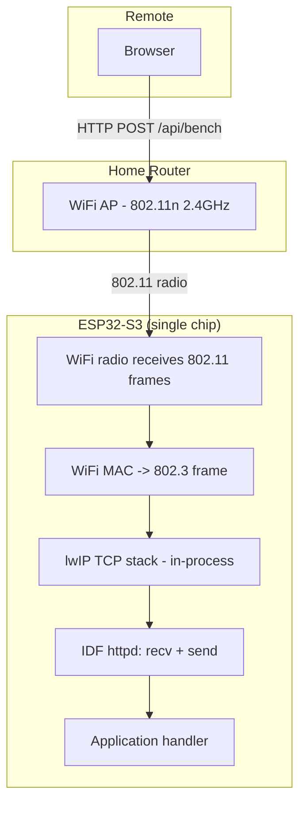

# CoreS3 SE Benchmark Firmware Design and Intern Guide

## Goal

Build a dedicated ESP32-S3 firmware for the M5Stack CoreS3 SE that measures throughput at every layer of the WiFi-to-HTTP data path. The firmware exposes HTTP endpoints that accept uploads of varying sizes and compression modes, instruments the transfer with microsecond timestamps, and returns detailed per-layer timing and throughput metrics. The resulting data will be compared directly against the ESP32-P4 + ESP-Hosted benchmark data from ticket 0094, isolating the cost of the SDIO transport layer by testing a single-chip WiFi design under identical conditions.

This document serves as an onboarding guide. An intern joining the project should be able to read this document, understand the entire data path from browser to ESP32-S3, build the firmware, run the benchmarks, and interpret the results — without needing to read any other document first.

---

## 1. The system you are benchmarking

### 1.1 Physical hardware

The M5Stack CoreS3 SE is a compact IoT controller built around a single ESP32-S3 chip:

| Component | Specification |
|---|---|
| SoC | ESP32-S3 (ESP32-S3FN16R8) |
| CPU | Dual-core Xtensa LX7 @ 240 MHz |
| Flash | 16 MB SPI flash (QIO, 80 MHz) |
| PSRAM | 8 MB Quad PSRAM (not Octal — the SE variant omits the 8 MB OMAP found on the full CoreS3) |
| WiFi | 802.11 b/g/n (2.4 GHz), built into the ESP32-S3 die |
| Display | 2.0" IPS, 320x240, ILI9342C, SPI interface |
| PMU | AXP2101 power management unit |
| IO Expander | AW9523 for button/LED control |
| USB | USB-C with USB-OTG support (USB Serial/JTAG or CDC) |

The critical difference from the Tab5 is that the ESP32-S3 integrates the WiFi radio directly on the same silicon die as the application processor. There is no second chip, no SDIO bus, and no ESP-Hosted driver. The WiFi MAC, baseband, and RF frontend are all within the ESP32-S3 package.

### 1.2 The data path

When a browser on the local network uploads data to the CoreS3 SE, the bytes traverse this path:



Compare this to the Tab5's path documented in ticket 0094's design doc. The Tab5 has six hops: browser -> router -> C6 WiFi -> C6 MAC -> SDIO -> P4 lwIP -> httpd -> handler. The CoreS3 SE has four: browser -> router -> S3 WiFi -> S3 lwIP -> httpd -> handler. The SDIO bus and the C6-to-P4 frame forwarding are eliminated entirely.

### 1.3 Native WiFi on ESP32-S3

The ESP32-S3's WiFi subsystem operates differently from the ESP-Hosted architecture on the Tab5:

**Single process, shared memory**: The WiFi driver and the lwIP TCP stack run in the same process address space as the application. Received WiFi frames are placed directly into memory buffers that lwIP reads. There is no inter-chip serialization, no SDIO command framing, and no queue-depth limit imposed by a serial transport.

**Dynamic buffer allocation**: The ESP32-S3 WiFi driver allocates receive buffers from a pool whose size is configured by `CONFIG_ESP_WIFI_DYNAMIC_RX_BUFFER_NUM`. The default is 32 buffers. Each buffer holds one WiFi frame (up to 1,600 bytes). When the pool is exhausted, the driver drops incoming frames — the access point must retransmit them. The iperf-optimized configuration raises this to 64 buffers.

**A-MPDU aggregation**: The ESP32-S3 supports 802.11n A-MPDU (Aggregate MAC Protocol Data Unit), which bundles multiple WiFi frames into a single transmission. This reduces per-frame MAC overhead and significantly improves throughput. It is controlled by `CONFIG_ESP_WIFI_AMPDU_RX_ENABLED` and `CONFIG_ESP_WIFI_RX_BA_WIN` (the Block Ack window size). The iperf-optimized configuration sets the RX BA window to 32.

**TCP window sizing**: The default lwIP TCP send and receive windows are 5,744 bytes (4 MSS). The iperf-optimized configuration raises both to 65,535 bytes. This allows the TCP stack to keep more data in flight without waiting for ACKs, which is critical for throughput over high-latency WiFi links.

### 1.4 IDF HTTP server (httpd)

The CoreS3 SE uses the same IDF `esp_http_server` component as the Tab5 benchmark firmware. The default configuration is identical:

| Parameter | Default | Override for benchmarks |
|---|---|---|
| `stack_size` | 4096 | 8192 (no tinfl on S3, but 8 KB is safe) |
| `recv_wait_timeout` | 5 | 30 |
| `send_wait_timeout` | 5 | 30 |
| `max_uri_handlers` | 8 | 10 |
| `max_open_sockets` | 7 | 7 |

The stack size can be reduced to 8 KB because the ESP32-S3 benchmark firmware does not include the tinfl decompressor (we may add it later, but the initial benchmarks focus on raw throughput). If deflate support is added, the stack must be raised to 48 KB as on the Tab5.

### 1.5 WiFi modes: STA vs SoftAP

Like the Tab5, the CoreS3 SE can operate in APSTA mode. For benchmarking, STA mode (connected to the home router) provides the most directly comparable data against the Tab5 benchmarks. SoftAP mode (direct WiFi connection to the CoreS3 SE's own access point) eliminates the router hop and may show lower RTT.

### 1.6 Comparison: CoreS3 SE vs Tab5 architecture

| Property | CoreS3 SE (ESP32-S3) | Tab5 (ESP32-P4 + C6) |
|---|---|---|
| WiFi architecture | Native (single chip) | ESP-Hosted (two chips, SDIO) |
| CPU | Dual-core Xtensa LX7 @ 240 MHz | Dual-core RISC-V @ 400 MHz |
| PSRAM | 8 MB Quad | 32 MB OMAP |
| Inter-chip link | None (same die) | SDIO 4-bit @ 40 MHz (160 Mbps raw, ~12 MB/s eff.) |
| WiFi RX queue depth | Dynamic (32-64 buffers) | Fixed (20 frames per SDIO queue) |
| TCP window (default) | 5,744 bytes (4 MSS) | 5,744 bytes (4 MSS) |
| TCP window (optimized) | 65,535 bytes | Not configurable (ESP-Hosted controls the window) |
| A-MPDU support | Yes (configurable) | Yes (handled by C6 firmware) |
| Max WiFi PHY rate | 802.11n: 72 Mbps (MCS 7, 20 MHz) | 802.11ax: 57 Mbps (MCS 7, 20 MHz) |

The key comparison is the inter-chip link. The Tab5's SDIO bus introduces latency (each WiFi frame must cross the bus from C6 to P4) and throughput constraints (the 20-frame RX queue can hold at most 32 KB of data). The CoreS3 SE has no such constraint: received WiFi frames are immediately available to lwIP in shared memory.

---

## 2. What we need to measure

### 2.1 Per-request timing breakdown

The timing model is identical to the Tab5 benchmark (documented in ticket 0094):

| Timestamp | Name | Where captured | What it measures |
|---|---|---|---|
| T0 | `req_start` | HTTP handler entry | When httpd dispatches the request |
| T1 | `recv_start` | Before first `httpd_req_recv()` | Start of body reception |
| T2 | `recv_end` | After last `httpd_req_recv()` returns | End of body reception |
| T3 | `decompress_start` | Before `tinfl_decompress_mem_to_mem` | Start of decompression (if applicable) |
| T4 | `decompress_end` | After decompression returns | End of decompression |
| T5 | `resp_start` | Before `httpd_resp_send()` | Start of HTTP response |
| T6 | `resp_end` | After `httpd_resp_send()` returns | End of HTTP response |

### 2.2 Per-recv-segment timing

Same as the Tab5 benchmark:

```
struct recv_segment {
    uint32_t call_number;    // 1, 2, 3, ...
    uint32_t bytes_read;     // bytes returned by this recv() call
    int64_t  timestamp_us;  // esp_timer_get_time() at return
};
```

### 2.3 System-level counters

| Counter | Source | What it reveals |
|---|---|---|
| Free heap (internal) | `esp_get_free_heap_size()` | Is internal RAM under pressure? |
| Free heap (PSRAM) | `heap_caps_get_free_size(MALLOC_CAP_SPIRAM)` | PSRAM usage (8 MB on SE) |
| WiFi RSSI | `esp_wifi_sta_get_ap_info()` | Signal quality |
| WiFi TX/RX buffer counts | `esp_wifi_sta_get_rssi()` + custom | Buffer pool utilization |

### 2.4 Benchmark matrix

Same matrix as the Tab5 benchmark, plus two additional configurations:

| Parameter | Values | Why it matters |
|---|---|---|
| Payload size | 1 KB, 10 KB, 100 KB, 500 KB, 1 MB, 1.8 MB | Throughput scaling; TCP slow-start effects |
| Compression | raw, zlib (deflate) | Compression ratio vs decompression CPU cost |
| Connection mode | STA (via router) | Direct comparison with Tab5 STA data |
| TCP window size | default (5,744 B), optimized (65,535 B) | **New variable**: lwIP window tuning effect |
| WiFi buffer count | default (32), optimized (64) | **New variable**: RX buffer pool depth effect |
| HTTP method | POST (upload), GET (download) | Asymmetric: send vs recv path |

The TCP window and WiFi buffer configurations are new variables that were not testable on the Tab5. On the Tab5, the ESP-Hosted driver controls the TCP window and buffer management on the C6, and these are not directly configurable from the P4 side. On the ESP32-S3, both are fully configurable via sdkconfig.

---

## 3. Firmware architecture

### 3.1 Endpoints

Identical to the Tab5 benchmark firmware:

| Method | Path | Parameters | Response |
|---|---|---|---|
| GET | `/api/health` | — | `{"ok":true}` |
| GET | `/api/system` | — | Free heap, PSRAM, WiFi RSSI, uptime |
| POST | `/api/bench/upload` | Query params: `size=N`, `compress=raw\|deflate` | Timing JSON (T0-T6, segment array, counters) |
| GET | `/api/bench/download` | Query params: `size=N` | Timing JSON + body of requested size |
| POST | `/api/bench/ping` | Body: any data | Echoes body back, returns round-trip time |
| GET | `/` | — | Simple HTML page with benchmark controls |
| GET | `/app.js` | — | Browser benchmark script |

### 3.2 The upload benchmark handler (pseudocode)

Same as the Tab5 benchmark handler (see ticket 0094 design doc), with these differences:

- **No `?size=` parameter for deflate**: On the Tab5, the decompress buffer size was derived from the `?size=` query param because the compressed size bore no relation to the decompressed size. On the CoreS3 SE, we may include deflate support, but the primary benchmark is raw throughput. If deflate is added, the same `?size=` convention applies.
- **Smaller PSRAM**: The CoreS3 SE has 8 MB PSRAM (vs 32 MB on the Tab5). The maximum payload is capped at 2 MB to leave room for the firmware, LVGL, and other allocations.
- **Smaller segment array**: 1024 segments max (vs 2048 on Tab5) to reduce PSRAM usage.

```
function bench_upload_handler(req):
    size = parse_int(query_param("size", default=1843200))
    compress = query_param("compress", default="raw")

    T0 = esp_timer_get_time()
    
    content_len = req.content_len
    if content_len > 2 * 1024 * 1024:
        return error("payload too large (max 2 MB)")

    // Allocate receive buffer in PSRAM
    recv_buf = heap_caps_malloc(content_len, MALLOC_CAP_SPIRAM)
    
    // Allocate segment timing in PSRAM
    segs = heap_caps_malloc(MAX_SEGMENTS * sizeof(recv_segment_t), MALLOC_CAP_SPIRAM)

    // Receive body with per-segment timing
    T1 = esp_timer_get_time()
    received = 0
    segments = []
    while received < content_length:
        n = httpd_req_recv(req, recv_buf + received, content_length - received)
        if n <= 0: return error
        received += n
        segments.append({bytes: n, time_us: esp_timer_get_time()})
    T2 = esp_timer_get_time()

    // Build response JSON (chunked)
    send_chunked_json(timing, segments, system_counters)
```

### 3.3 SDK configuration for throughput optimization

The firmware will be built with two sdkconfig profiles: a **default** profile (matching the Tab5's stock lwIP/WiFi settings) and an **optimized** profile (matching the ESP-IDF iperf example's recommendations for ESP32-S3).

**Default sdkconfig.defaults:**

```
# CoreS3 SE board identification
CONFIG_IDF_TARGET="esp32s3"

# USB Serial/JTAG console (CoreS3 SE uses USB-C OTG)
CONFIG_ESP_CONSOLE_USB_SERIAL_JTAG=y
# CONFIG_ESP_CONSOLE_UART is not set

# Flash and PSRAM
CONFIG_ESPTOOLPY_FLASHMODE_QIO=y
CONFIG_ESPTOOLPY_FLASHFREQ_80M=y
CONFIG_SPIRAM=y
CONFIG_SPIRAM_MODE_QUAD=y

# CPU frequency
CONFIG_ESP_DEFAULT_CPU_FREQ_MHZ_240=y
CONFIG_ESP_DEFAULT_CPU_FREQ_MHZ=240

# WiFi defaults (matches Tab5 baseline for fair comparison)
CONFIG_ESP_WIFI_STATIC_RX_BUFFER_NUM=10
CONFIG_ESP_WIFI_DYNAMIC_RX_BUFFER_NUM=32
CONFIG_ESP_WIFI_DYNAMIC_TX_BUFFER_NUM=32
```

**Optimized sdkconfig.defaults (additional settings for the "optimized" build):**

```
# WiFi buffer optimization (from iperf example)
CONFIG_ESP_WIFI_STATIC_RX_BUFFER_NUM=16
CONFIG_ESP_WIFI_DYNAMIC_RX_BUFFER_NUM=64
CONFIG_ESP_WIFI_DYNAMIC_TX_BUFFER_NUM=64
CONFIG_ESP_WIFI_AMPDU_TX_ENABLED=y
CONFIG_ESP_WIFI_TX_BA_WIN=32
CONFIG_ESP_WIFI_AMPDU_RX_ENABLED=y
CONFIG_ESP_WIFI_RX_BA_WIN=32

# TCP window optimization (from iperf example)
CONFIG_LWIP_TCP_SND_BUF_DEFAULT=65535
CONFIG_LWIP_TCP_WND_DEFAULT=65535
CONFIG_LWIP_TCP_RECVMBOX_SIZE=64
CONFIG_LWIP_UDP_RECVMBOX_SIZE=64
CONFIG_LWIP_TCPIP_RECVMBOX_SIZE=64

# Cache optimization
CONFIG_ESP32S3_INSTRUCTION_CACHE_32KB=y
CONFIG_ESP32S3_INSTRUCTION_CACHE_LINE_32B=y
CONFIG_ESP32S3_INSTRUCTION_CACHE_WRAP=y
```

The optimized settings increase the TCP window from 5,744 bytes (4 x MSS) to 65,535 bytes. This allows lwIP to keep up to 45 TCP segments in flight before requiring an ACK, versus 4 segments with the default window. On a WiFi link with 10-50 ms RTT, this difference alone can improve throughput by 10x, because the sender does not stall waiting for ACKs after every 4 segments.

### 3.4 Browser benchmark script

The same browser-side `app.js` from the Tab5 benchmark can be reused, with the base URL changed to the CoreS3 SE's IP address. The auto-suite, segment timeline chart, and JSON export all work unchanged.

---

## 4. Implementation plan

### Phase 1: Create the firmware project

Create a new ESP-IDF project targeting the ESP32-S3. The project will not fork the Tab5 benchmark (different target architecture, no ESP-Hosted), but the `bench_server.c` handler code can be reused with minor modifications.

Tasks:
- [ ] Create 0095-cores3se-wifi-bench ESP-IDF project with `idf.py create-project`
- [ ] Add sdkconfig.defaults for the CoreS3 SE
- [ ] Copy bench_server.c/h from 0094, adapt for ESP32-S3 (remove `esp_wifi_remote`, remove `miniz`/deflate initially)
- [ ] Write wifi_app.c for native WiFi APSTA (simpler than the Tab5's — no ESP-Hosted)
- [ ] Write wifi_console.c for USB Serial/JTAG console
- [ ] Copy browser assets (index.html, app.js)
- [ ] Build, flash, verify HTTP server starts

### Phase 2: Upload benchmark

- [ ] Implement POST /api/bench/upload with per-segment timing
- [ ] Test with curl at various sizes

### Phase 3: Download and ping benchmarks

- [ ] Implement GET /api/bench/download and POST /api/bench/ping
- [ ] Test with curl

### Phase 4: Run benchmarks with default config

- [ ] Run full benchmark suite over STA (same matrix as Tab5)
- [ ] Store results in SQLite
- [ ] Compare against Tab5 STA data

### Phase 5: Run benchmarks with optimized config

- [ ] Rebuild with iperf-optimized sdkconfig
- [ ] Run full benchmark suite over STA
- [ ] Compare default vs optimized config on same hardware

### Phase 6: Analysis and documentation

- [ ] Run analysis queries against SQLite
- [ ] Write comparison report (CoreS3 SE vs Tab5, default vs optimized)
- [ ] Upload to reMarkable

---

## 5. Key files and APIs reference

### 5.1 ESP-IDF components used

| Component | Header | Purpose |
|---|---|---|
| `esp_http_server` | `esp_http_server.h` | HTTP server framework (same as Tab5) |
| `esp_wifi` | `esp_wifi.h` | Native WiFi driver (NOT `esp_wifi_remote`) |
| `esp_netif` | `esp_netif.h` | Network interface (IP address, DHCP) |
| `nvs_flash` | `nvs_flash.h` | Non-volatile storage (WiFi credentials) |
| `esp_timer` | `esp_timer.h` | Microsecond-precision timing |
| `esp_heap_caps` | `esp_heap_caps.h` | PSRAM allocation (8 MB Quad) |

**Critical difference from Tab5**: The Tab5 uses `esp_wifi_remote` (which forwards WiFi API calls over SDIO to the C6). The CoreS3 SE uses `esp_wifi` directly — the native WiFi driver that runs on the same chip.

### 5.2 WiFi initialization (native, not ESP-Hosted)

On the ESP32-S3, WiFi initialization is simpler because there is no SDIO transport to configure:

```c
#include "esp_wifi.h"

// Initialize WiFi with default config (native driver, not ESP-Hosted)
wifi_init_config_t cfg = WIFI_INIT_CONFIG_DEFAULT();
ESP_ERROR_CHECK(esp_wifi_init(&cfg));

// Set APSTA mode
ESP_ERROR_CHECK(esp_wifi_set_mode(WIFI_MODE_APSTA));

// Configure AP
wifi_config_t ap_cfg = {0};
strlcpy((char *)ap_cfg.ap.ssid, "CoreS3-Bench", sizeof(ap_cfg.ap.ssid));
ap_cfg.ap.authmode = WIFI_AUTH_WPA2_PSK;
// ... set password, channel, max_connection
ESP_ERROR_CHECK(esp_wifi_set_config(WIFI_IF_AP, &ap_cfg));

// Configure STA (from NVS or console)
// ... load credentials, set STA config

// Start
ESP_ERROR_CHECK(esp_wifi_start());
```

There are no `CONFIG_ESP_HOSTED_*` settings, no SDIO pin configuration, and no `esp_wifi_remote` component.

### 5.3 Console: USB Serial/JTAG

The CoreS3 SE connects via USB-C, which provides both power and a USB Serial/JTAG interface. The console configuration:

```
CONFIG_ESP_CONSOLE_USB_SERIAL_JTAG=y
# CONFIG_ESP_CONSOLE_UART is not set
```

This is the same console transport used on the Tab5 (also USB Serial/JTAG). The `wifi_console.c` module can be reused directly.

### 5.4 PSRAM: 8 MB Quad

The CoreS3 SE has 8 MB of Quad PSRAM (the SE variant omits the 8 MB Octal PSRAM found on the full CoreS3). This is significantly less than the Tab5's 32 MB OMAP PSRAM, but is sufficient for benchmark purposes. The largest test payload (1.8 MB) plus the segment timing array (1024 x 16 bytes = 16 KB) plus the HTTP stack fit comfortably in 8 MB.

```c
// Allocate in 8 MB Quad PSRAM
void *buf = heap_caps_malloc(size, MALLOC_CAP_SPIRAM);
```

### 5.5 Existing benchmark code to reuse

The following files from the Tab5 benchmark (ticket 0094) can be reused with minimal changes:

| Source file | Changes needed |
|---|---|
| `bench_server.c` | Remove `#include "miniz.h"`, remove deflate handler code, reduce MAX_SEGMENTS to 1024, reduce max payload to 2 MB |
| `bench_server.h` | None |
| `scripts/01-run-benchmarks.py` | Change default base URL; keep SQLite schema identical for cross-device comparison |
| `scripts/02-analyze-results.py` | Add `--device` filter for CoreS3 SE vs Tab5 comparison queries |
| `assets/index.html` | Change title, default base URL |
| `assets/app.js` | Change default base URL |

The `wifi_app.c` module must be rewritten because the Tab5 version uses `esp_wifi_remote` (ESP-Hosted API). The CoreS3 SE version uses `esp_wifi` (native API). The NVS credential storage and the `wifi_console.c` module can be reused as-is.

### 5.6 Serial port

The CoreS3 SE's USB-C port provides the USB Serial/JTAG interface. When connected, it appears as `/dev/ttyACM*` on Linux. The exact device number depends on what other USB devices are connected. Check with:

```bash
ls /dev/serial/by-id/
```

---

## 6. Expected results and comparison with Tab5

### 6.1 Expected ESP32-S3 throughput

Based on published ESP-IDF iperf benchmarks for the ESP32-S3 with optimized configuration:

| Configuration | TCP RX (download) | TCP TX (upload) |
|---|---|---|
| Default sdkconfig | 5-10 Mbps | 5-10 Mbps |
| Optimized (iperf config) | 20-30 Mbps | 15-20 Mbps |

The default configuration is expected to be comparable to or slightly better than the Tab5's 4.2 Mbps upload, because the ESP32-S3 eliminates the SDIO transport overhead but has a slower CPU (240 MHz vs 400 MHz) and less PSRAM. The optimized configuration should show a significant improvement, potentially reaching 15-20 Mbps upload — 3-5x the Tab5's throughput.

### 6.2 Key comparisons

The benchmark data will answer these questions:

**How much does the SDIO transport cost?** By comparing the CoreS3 SE's raw upload throughput (same WiFi standard, same router, same client machine) against the Tab5's, the SDIO overhead is isolated. If the CoreS3 SE achieves 10 Mbps and the Tab5 achieves 4.2 Mbps, the SDIO overhead accounts for 5.8 Mbps of lost throughput.

**How much does TCP window tuning help?** The CoreS3 SE can be tested with both default (5,744 B) and optimized (65,535 B) TCP windows. The Tab5 cannot be tested with tuned windows because the ESP-Hosted driver controls the window. This is a unique measurement that the Tab5 benchmark cannot provide.

**What is the RTT without SDIO?** The Tab5's minimum ping RTT was 106 ms. If the CoreS3 SE achieves 5-20 ms RTT (typical for single-chip ESP32-S3 over STA), the 86-101 ms difference is the SDIO round-trip cost. This directly predicts the TCP slow-start improvement.

**Is download asymmetry a property of the chip or the architecture?** On the Tab5, download was 2.4x slower than upload. If the CoreS3 SE shows symmetric upload/download throughput, the asymmetry is caused by the ESP-Hosted architecture (specifically, the SDIO TX path from P4 to C6). If the CoreS3 SE also shows asymmetry, it is a property of the 802.11 MAC or the lwIP configuration.

### 6.3 Segment timing expectations

Without the SDIO bus and the 20-frame queue depth limit, the CoreS3 SE's segment timing should show:

- Fewer stalls (gaps > 50 ms): The native WiFi driver can buffer more frames in shared memory, reducing the frequency of flow-control pauses.
- More consistent segment sizes: The `httpd_req_recv()` calls should return data closer to the TCP MSS (1,460 bytes), because the data is available in memory rather than queued behind an SDIO transaction.
- Smaller inter-segment deltas: Without the SDIO round-trip latency, segments should arrive faster once the WiFi driver has buffered them.

---

## 7. Open questions

1. **Can the CoreS3 SE sustain 20+ Mbps with the optimized config?** The iperf benchmarks published by Espressif show 20-30 Mbps TCP RX on the ESP32-S3 with the optimized sdkconfig. However, iperf uses raw sockets, not the IDF HTTP server. The httpd processing overhead (parsing HTTP headers, chunked encoding, JSON response construction) may reduce the achievable throughput.

2. **Does 8 MB PSRAM limit the maximum test payload?** The largest test payload is 1.8 MB. With the LVGL display subsystem, WiFi buffers, and the HTTP stack also using PSRAM, there may be contention. The benchmark firmware should be built headless (no display) to maximize available PSRAM.

3. **What is the USB-C serial port throughput?** The CoreS3 SE's console runs over USB Serial/JTAG. If the benchmark script needs to transfer large JSON responses back through the serial port for logging, the USB throughput may become a bottleneck. However, all benchmark results are returned via HTTP (over WiFi), not via the serial console.

4. **Does the CoreS3 SE support WiFi 6 (802.11ax)?** The ESP32-S3 supports 802.11n only, not 802.11ax. The Tab5's ESP32-C6 slave supports 802.11ax. This means the CoreS3 SE and the Tab5 are not using the same WiFi standard, which complicates the direct comparison. The 802.11n maximum PHY rate on the S3 is 72 Mbps (MCS 7, 20 MHz short GI), while the C6's 802.11ax rate can reach 57 Mbps in a congested environment (but may exceed 802.11n in ideal conditions due to OFDMA efficiency). In practice, both devices will negotiate 802.11n with the same AP, so the comparison is fair.
