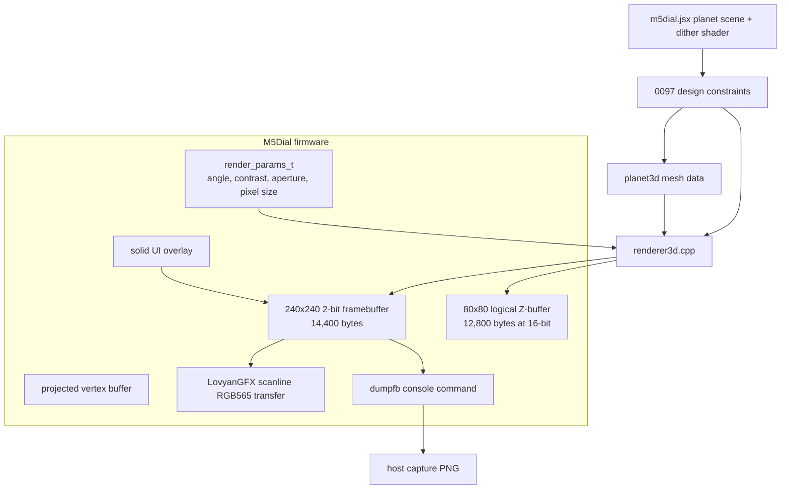

# Proper 3D Planet Renderer Analysis and Implementation Guide

## Executive Summary

Ticket 0096 produced a stable M5Dial dithered scene viewer by using poster-style procedural renderers. That was the correct first milestone: it validated the display pins, LovyanGFX scanline transfer, RGB565 byte order, 2-bit framebuffer, palette system, encoder input, console controls, and `dumpfb` screenshot workflow on real hardware. Ticket 0097 starts the second stage: add a proper 3D renderer for one scene, beginning with `PLANET`, while preserving the working 0096 firmware as a fallback.

The correct architecture is not a direct port of Three.js. The browser reference renders a high-resolution mesh into a GPU render target and then applies a fragment shader that pixelates, contrasts, Bayer-dithers, and quantizes to four colors. The M5Dial has no GPU and no PSRAM, so the firmware must collapse that pipeline into a small software rasterizer. The renderer should transform and rasterize triangles at a coarse logical resolution such as `80×80`, use a small full-frame logical Z-buffer, quantize directly into the existing 240×240 2-bit framebuffer, and draw solid UI text after the 3D pass.

The recommended first implementation target is:

```text
scene:          PLANET only
logical render: 80 × 80
physical scale: 3 × 3 pixels per logical pixel
color target:   existing 240 × 240 2-bit framebuffer, 14,400 bytes
Z-buffer:       80 × 80 × uint16_t = 12,800 bytes
mesh:           low-poly sphere, ~500 vertices / ~1,000 triangles or less
output:         direct Bayer 4×4 four-color quantization during rasterization
validation:     dumpfb → host PNG capture, plus physical LCD inspection
```

The `80×80` target is intentionally coarse. It matches the visual language of the original JSX, whose default `pixelSize` is `2`, and it reduces both memory and CPU work by a large factor. A full 240×240 16-bit Z-buffer costs 115,200 bytes and requires up to 57,600 per-pixel depth tests for full-screen coverage. An 80×80 Z-buffer costs 12,800 bytes and has only 6,400 logical pixels. This is the right starting point for an ESP32-S3FN8 M5Dial with no PSRAM.

The first proper 3D milestone should render a rotating red/blue dithered sphere. The ring and moon come after the sphere path is correct. This order avoids debugging mesh generation, depth precision, ring occlusion, and dithering at the same time.

## Problem Statement and Scope

The current firmware has a visually useful poster renderer. It produces five dithered scenes and supports runtime tuning, but it is not a true 3D renderer in the sense of transforming a mesh, projecting triangles, doing depth tests, and drawing the nearest surface at each pixel. The new goal is to implement that real 3D path for one scene without destabilizing the working firmware.

The reference scene is the `PLANET` scene in `m5dial.jsx`. The browser version uses:

- a `THREE.SphereGeometry(2.6, 80, 60)` planet mesh;
- vertex colors generated from latitude, procedural noise, and a red/blue split;
- a small white moon sphere;
- a thin blue ring implemented as `THREE.TorusGeometry(3.7, 0.04, 8, 100)`;
- animation that rotates the planet, moves the moon, and rotates the ring;
- a post-processing shader that pixelates and quantizes the rendered image to black, warm, cool, and high colors.

The firmware implementation should preserve the parts that define the visual identity:

1. A rotating 3D planet, not a flat poster disk.
2. Four output colors: black, red/warm, blue/cool, white/high.
3. Ordered Bayer dithering locked to logical pixel coordinates.
4. Circular display mask.
5. Solid non-dithered UI overlay after the 3D pass.
6. Runtime inspection through `fps`, `heap`, `dumpfb`, and host-side PNG capture.

The firmware implementation should not attempt to preserve the browser implementation literally. It should not implement Three.js, a scene graph, materials, transparency, a full RGB framebuffer, or the original high-polygon sphere. Those abstractions are too expensive and unnecessary for the first embedded milestone.

## Evidence from the Existing System

### The browser shader already defines a coarse-pixel dither pipeline

The original GLSL shader in `m5dial.jsx` has a pixelation step before dithering. It computes a logical pixel coordinate with `floor(vUv * uResolution / uPixelSize)`, samples the center of that pixel block, applies contrast, and then uses a 4×4 Bayer threshold. The relevant source is `m5dial.jsx` lines 41–112.

Key facts from the shader:

- `uPixelSize` is an explicit runtime control.
- Bayer uses a 4×4 matrix with thresholds 0 through 15.
- Dither is applied to pixel blocks, not necessarily every physical display pixel.
- The color classifier selects high/white, warm/red, cool/blue, or black.
- Circular masking happens after quantization.

This is important because it justifies a coarse firmware renderer. Rendering at `80×80` and scaling each logical pixel to `3×3` physical pixels is not merely an optimization; it is consistent with the source aesthetic.

### The planet scene is bounded and suitable for a first 3D target

The planet source is in `m5dial.jsx` lines 298–365. It creates a sphere, displaces vertices with noise, colors them from latitude and speckle, adds a moon, adds a ring, and reports camera parameters:

```text
distance: 9
height:   0.5
target:   (0, 0, 0)
```

The planet scene is a better first target than terrain because it is centered, bounded, mostly convex, and recognizable even at low triangle counts. Terrain would require a large grid and careful horizon composition. Planet tests the core 3D pipeline with less geometry.

### The firmware already has the right output framebuffer

The existing `framebuffer.h` defines a 2-bit packed framebuffer. It stores four pixels per byte and uses exactly 14,400 bytes for the 240×240 display. The relevant source is `0096-m5dial-dithered-3d/main/framebuffer.h` lines 6–19 and 30–42.

The important contract is:

```cpp
#define FB_WIDTH  240
#define FB_HEIGHT 240
#define FB_BYTES_PER_ROW  (FB_WIDTH / 4)
#define FB_TOTAL_BYTES    (FB_BYTES_PER_ROW * FB_HEIGHT)

#define COLOR_BLACK 0
#define COLOR_WARM  1
#define COLOR_COOL  2
#define COLOR_HIGH  3
```

The proper 3D renderer should write these same four indices. It should not allocate a full RGB565 framebuffer.

### The display path is already validated

The current app loop expands the 2-bit framebuffer one scanline at a time to RGB565 and sends it through LovyanGFX. `app_main.cpp` lines 173–185 show the validated LCD transfer path, including the required `display.setSwapBytes(true)` call. That part should remain unchanged. The new renderer should only replace the scene pass that fills `ctx->fb`.

### The current triangle renderer is a reference, not the final design

The existing `renderer.cpp` contains useful code for camera setup, projection, barycentric interpolation, and Bayer quantization. It also contains a limitation: it uses a scanline Z-buffer reset inside triangle rendering. `renderer.cpp` lines 21–24 define a scanline Z-buffer, and lines 278–290 loop triangles. This was acceptable for early smoke tests but is not the correct final architecture for inter-triangle occlusion. The 0097 renderer should use a full logical Z-buffer for the coarse render target.

### The existing screenshot tooling should be the main validation loop

`console_commands.cpp` lines 246–268 implement `dumpfb`, which emits the active 2-bit framebuffer and palette as text. Ticket 0096 added host scripts to convert dumps to PNGs and capture all scenes over serial. This gives us an evidence loop for the new renderer: implement one change, capture the frame, inspect the PNG, compare against the expected shape, and repeat.

## Hardware and Memory Model

The M5Dial board uses an ESP32-S3FN8. It has no PSRAM. The specification-level internal SRAM number is 512 KB, but firmware cannot treat 512 KB as one general-purpose allocation pool. SRAM is divided between instruction memory, data memory, reserved runtime regions, task stacks, static data, heap regions with different capabilities, and RTC memory.

The most relevant boot log from ticket 0096 showed heap regions like:

```text
I heap_init: At 3FC97368 len 000523A8 (328 KiB): RAM
I heap_init: At 3FCE9710 len 00005724 (21 KiB): RAM
I heap_init: At 3FCF0000 len 00008000 (32 KiB): DRAM
I heap_init: At 600FE01C len 00001FCC (7 KiB): RTCRAM
```

That does not mean a single 388 KiB graphics allocation is safe. The number that matters for large renderer buffers is the largest allocatable block with the right capabilities, especially `MALLOC_CAP_INTERNAL | MALLOC_CAP_8BIT`.

Before committing to a large Z-buffer, add a `heap` command and an `allocprobe` command to the firmware. They should report:

```cpp
esp_get_free_heap_size();
esp_get_minimum_free_heap_size();
heap_caps_get_free_size(MALLOC_CAP_INTERNAL | MALLOC_CAP_8BIT);
heap_caps_get_largest_free_block(MALLOC_CAP_INTERNAL | MALLOC_CAP_8BIT);
heap_caps_get_free_size(MALLOC_CAP_DMA);
heap_caps_get_largest_free_block(MALLOC_CAP_DMA);
```

The design below does not require a large allocation. At `80×80`, the Z-buffer is only 12,800 bytes with 16-bit depth or 6,400 bytes with 8-bit depth. This is intentionally conservative.

## Memory Budget

The following table compares possible render target sizes. The final color framebuffer remains the existing 240×240 2-bit framebuffer in every case.

| Logical render size | Physical pixel scale | Logical pixels | 8-bit Z | 16-bit Z | Relative raster work |
|---:|---:|---:|---:|---:|---:|
| 240×240 | 1×1 | 57,600 | 57,600 B | 115,200 B | 100% |
| 120×120 | 2×2 | 14,400 | 14,400 B | 28,800 B | 25% |
| 80×80 | 3×3 | 6,400 | 6,400 B | 12,800 B | 11% |
| 60×60 | 4×4 | 3,600 | 3,600 B | 7,200 B | 6.25% |
| 40×40 | 6×6 | 1,600 | 1,600 B | 3,200 B | 2.8% |

The first implementation should use 80×80 with 16-bit depth. That gives enough resolution to make the planet read as a sphere while keeping the renderer small. If frame time is excellent, 120×120 can be tested. If frame time is poor, 60×60 remains available.

A safe first memory budget:

| Buffer or data | Estimated size | Notes |
|---|---:|---|
| Existing 240×240 2-bit framebuffer | 14,400 B | Already allocated by `fb_init()` |
| 80×80 16-bit Z-buffer | 12,800 B | Full logical Z-buffer |
| Projected vertices, 600 × 24 B | 14,400 B | Static/global, not stack |
| Visibility flags / triangle scratch | < 2 KB | Static |
| Mesh source data | preferably flash | Generated as `const` or built once |
| RGB565 LCD scanline | 480 B | Already in `AppContext` |
| Total new runtime RAM | ~30–45 KB | Safe for M5Dial |

This budget is deliberately low. It leaves room for console, stacks, LovyanGFX, and future ring/moon work.

## Why 16-bit Z First, Then 8-bit

The user asked whether 16-bit depth is necessary. It is not strictly necessary for a coarse four-color planet, but it is the right first implementation. At 80×80, a 16-bit Z-buffer costs only 12.8 KB. That is too small to justify adding depth precision artifacts while the renderer itself is new.

Use a compile-time type alias so 8-bit can be tested later:

```cpp
#ifndef R3D_Z_BITS
#define R3D_Z_BITS 16
#endif

#if R3D_Z_BITS == 8
using r3d_z_t = uint8_t;
constexpr r3d_z_t R3D_Z_FAR = 255;
#else
using r3d_z_t = uint16_t;
constexpr r3d_z_t R3D_Z_FAR = 65535;
#endif
```

The depth encoding should normalize camera-space `z` into a known range:

```cpp
static inline r3d_z_t encode_depth(float z) {
    constexpr float kNear = 3.0f;
    constexpr float kFar = 16.0f;
    float t = (z - kNear) / (kFar - kNear);
    if (t < 0.0f) t = 0.0f;
    if (t > 1.0f) t = 1.0f;
    return static_cast<r3d_z_t>(t * R3D_Z_FAR + 0.5f);
}
```

Smaller encoded depth means closer. The Z-test is:

```cpp
if (z_encoded < zbuf[index]) {
    zbuf[index] = z_encoded;
    write_color_index(...);
}
```

Once the 16-bit renderer produces correct captures, rebuild with 8-bit Z and compare `dumpfb` screenshots. If there are no visible ring/planet occlusion artifacts, keep 8-bit. If there are speckles near the ring or silhouette, keep 16-bit.

## Proposed Architecture

The 0097 renderer should be a separate module, not a replacement for the poster renderer on day one.

Recommended files:

```text
0096-m5dial-dithered-3d/main/renderer3d.h
0096-m5dial-dithered-3d/main/renderer3d.cpp
0096-m5dial-dithered-3d/main/planet3d_mesh.h
0096-m5dial-dithered-3d/main/planet3d_mesh.cpp
```

The current poster renderer remains in `terrain_poster.cpp`. The app render loop can dispatch based on scene and backend mode:

```cpp
if (scene_current_id() == SCENE_PLANET && p->backend_3d) {
    renderer3d_render_planet(ctx->fb, p);
    draw_common_ui_or_existing_overlay(...);
} else {
    poster_render_scene(ctx->fb, scene_current_id(), p);
}
```

A cleaner version introduces a backend enum:

```cpp
enum RenderBackend {
    RENDER_BACKEND_POSTER = 0,
    RENDER_BACKEND_3D_PLANET = 1,
};
```

Add a console command:

```text
backend poster
backend planet3d
backend
```

Do not remove the poster path. It is the known-good fallback while the 3D renderer is being developed.

### Data Flow



The renderer owns only the scene pass. It should not own the LCD, console, or UI text. That separation keeps the validated display path unchanged.

## Renderer API Sketch

`renderer3d.h` should expose a small API:

```cpp
#pragma once

#include <stdint.h>
#include <stdbool.h>
#include "framebuffer.h"
#include "scene.h"

typedef struct {
    uint16_t logical_w;
    uint16_t logical_h;
    uint8_t pixel_scale;
    uint8_t z_bits;
    uint32_t triangles_submitted;
    uint32_t triangles_drawn;
    uint32_t fragments_tested;
    uint32_t fragments_drawn;
    uint64_t render_us;
} renderer3d_stats_t;

bool renderer3d_init(void);
void renderer3d_set_resolution(uint16_t logical_w, uint16_t logical_h);
void renderer3d_render_planet(uint8_t* fb, const render_params_t* params, float time_s);
const renderer3d_stats_t* renderer3d_stats(void);
```

The first version can make resolution compile-time constants. Runtime resolution is useful later, but compile-time constants keep the first implementation simpler and safer:

```cpp
#define R3D_W 80
#define R3D_H 80
#define R3D_PIXEL_SCALE 3
```

## Data Types

Use explicit small structs. Avoid C++ dynamic containers in firmware.

```cpp
typedef struct {
    float x, y, z;
    uint8_t r, g, b;
} r3d_vertex_t;

typedef struct {
    uint16_t i0, i1, i2;
} r3d_tri_t;

typedef struct {
    float x, y;      // logical screen coordinates
    float z;         // camera-space positive depth
    uint8_t r, g, b;
    bool visible;
} r3d_projected_t;
```

Keep the projected buffer static/global, not on the render task stack:

```cpp
static r3d_projected_t s_proj[R3D_MAX_VERTICES];
static r3d_z_t s_zbuf[R3D_W * R3D_H];
```

The first mesh can be generated at boot into static arrays, or generated offline into `const` tables. For implementation speed, generate at boot once. For final firmware determinism, consider generating offline and storing the mesh in flash.

## Mesh Strategy

The browser sphere uses `SphereGeometry(2.6, 80, 60)`, which is too dense. The firmware should start with a lower-resolution UV sphere or icosphere.

Recommended first mesh:

```text
UV sphere:
  latitude steps: 18
  longitude steps: 28
  vertices: (18 + 1) × 28 = 532
  triangles: about 952
```

This is what the host prototype uses. It is a little denser than an icosphere subdivision 2, but still feasible at 80×80. If performance is poor, reduce to `lat=14`, `lon=22`.

Alternative mesh:

```text
Icosphere subdivision 2:
  vertices: 162
  triangles: 320
```

An icosphere has more uniform triangles and fewer polar artifacts. A UV sphere is easier to generate and gives direct latitude for the red/blue color split. Either is valid. For a new intern, the UV sphere is easier to implement first.

### Planet Vertex Color

Port the reference formula conceptually, not byte-for-byte. From `m5dial.jsx` lines 317–324:

```js
const lat = y / 2.6;
const heat = Math.max(0, lat);
const cold = Math.max(0, -lat);
const speckle = (Math.sin(x * 5) * Math.cos(z * 5) * 0.5 + 0.5);
colors[i * 3 + 0] = heat * (0.6 + speckle * 0.5) + Math.max(0, n) * 0.5;
colors[i * 3 + 1] = 0;
colors[i * 3 + 2] = cold * (0.6 + speckle * 0.5) + Math.max(0, -n) * 0.3;
```

Firmware equivalent:

```cpp
float lat = y / radius;
float heat = maxf(0.0f, lat);
float cold = maxf(0.0f, -lat);
float speckle = sinf(x * 5.0f) * cosf(z * 5.0f) * 0.5f + 0.5f;
float n = cheap_noise2(x * 1.0f, y * 1.0f) * 0.18f
        + cheap_noise2(z * 1.2f, y * 1.5f) * 0.10f;

vertex.r = clamp_u8(255.0f * (heat * (0.6f + speckle * 0.5f) + maxf(0.0f, n) * 0.5f));
vertex.g = 0;
vertex.b = clamp_u8(255.0f * (cold * (0.6f + speckle * 0.5f) + maxf(0.0f, -n) * 0.3f));
```

Precompute this at mesh build time. Do not compute noise per frame.

## Camera and Projection

Use the same conceptual camera as the existing renderer and reference scene:

```text
distance = 9
height   = 0.5
target   = (0, 0, 0)
```

Camera position:

```cpp
eye.x = target.x + distance * sinf(camera_angle);
eye.y = target.y + height;
eye.z = target.z + distance * cosf(camera_angle);
```

Build a look-at basis:

```cpp
forward = normalize(target - eye);
right   = normalize(cross(world_up, forward));
up      = cross(forward, right);
```

Projection into logical coordinates:

```cpp
const float focal = 2.145f; // 1 / tan(25 deg), matches 50 deg FOV
screen_x = (view_x * focal / view_z) * (R3D_W * 0.5f) + R3D_W * 0.5f;
screen_y = -(view_y * focal / view_z) * (R3D_H * 0.5f) + R3D_H * 0.5f;
```

The physical LCD position is computed only when writing a winning logical pixel:

```cpp
physical_x = logical_x * R3D_PIXEL_SCALE;
physical_y = logical_y * R3D_PIXEL_SCALE;
```

## Rasterization Algorithm

Use triangle bounding boxes and barycentric coordinates. At 80×80 this is simpler and fast enough.

Pseudocode:

```cpp
void rasterize_triangle(Projected a, Projected b, Projected c) {
    float area = edge(a, b, c);
    if (fabsf(area) < epsilon) return;

    if (backface_culling_enabled && area_is_backfacing(area)) return;

    int min_x = clamp(floor(min(a.x, b.x, c.x)), 0, R3D_W - 1);
    int max_x = clamp(ceil (max(a.x, b.x, c.x)), 0, R3D_W - 1);
    int min_y = clamp(floor(min(a.y, b.y, c.y)), 0, R3D_H - 1);
    int max_y = clamp(ceil (max(a.y, b.y, c.y)), 0, R3D_H - 1);

    for y in min_y..max_y:
        for x in min_x..max_x:
            float px = x + 0.5f;
            float py = y + 0.5f;
            compute w0, w1, w2;
            if outside triangle: continue;

            float z = w0*a.z + w1*b.z + w2*c.z;
            z_encoded = encode_depth(z);
            index = y * R3D_W + x;
            if z_encoded >= zbuf[index]: continue;

            zbuf[index] = z_encoded;

            rgb = interpolate vertex colors;
            color_index = dither_quantize(rgb, x, y, params->contrast);
            write_logical_pixel_block(fb, x, y, color_index, params);
```

This is full-frame logical Z-buffering. It fixes the fundamental limitation of the old scanline-per-triangle smoke renderer.

## Direct Four-Color Quantization

Do not allocate an RGB render target. The renderer should quantize directly from interpolated vertex color to a 2-bit framebuffer index.

The firmware quantizer should mirror the GLSL shader:

```cpp
static const uint8_t kBayer4[4][4] = {
    {  0,  8,  2, 10 },
    { 12,  4, 14,  6 },
    {  3, 11,  1,  9 },
    { 15,  7, 13,  5 },
};

uint8_t quantize_4color(uint8_t r, uint8_t g, uint8_t b, int logical_x, int logical_y, float contrast) {
    r = apply_contrast_u8(r, contrast);
    g = apply_contrast_u8(g, contrast);
    b = apply_contrast_u8(b, contrast);

    uint8_t threshold = kBayer4[logical_y & 3][logical_x & 3]; // 0..15
    uint8_t r4 = r >> 4;
    uint8_t g4 = g >> 4;
    uint8_t b4 = b >> 4;
    uint8_t lum4 = (r4 + g4 + b4) / 3;

    bool is_white = r > 140 && g > 140 && b > 140;
    if (is_white && lum4 > threshold) return COLOR_HIGH;
    if (r > b + 13) return (r4 > threshold) ? COLOR_WARM : COLOR_BLACK;
    if (b > r + 13) return (b4 > threshold) ? COLOR_COOL : COLOR_BLACK;
    if (lum4 > 4 && lum4 > threshold) return COLOR_COOL;
    return COLOR_BLACK;
}
```

The threshold uses logical coordinates, not physical LCD coordinates. If the render target is 80×80 with 3×3 physical blocks, the dither pattern is applied once per 3×3 block. This matches the source shader's pixel-block logic.

## Writing Coarse Pixels into the Existing Framebuffer

The 3D renderer writes directly into the existing 240×240 packed framebuffer. A logical pixel fills a physical block:

```cpp
void write_logical_pixel_block(uint8_t* fb, int lx, int ly, uint8_t color, const render_params_t* p) {
    int px0 = lx * R3D_PIXEL_SCALE;
    int py0 = ly * R3D_PIXEL_SCALE;

    for (int yy = 0; yy < R3D_PIXEL_SCALE; ++yy) {
        int py = py0 + yy;
        for (int xx = 0; xx < R3D_PIXEL_SCALE; ++xx) {
            int px = px0 + xx;
            if (!inside_aperture(px, py, p)) continue;
            fb_set(fb, px, py, color);
        }
    }
}
```

This is why no logical color buffer is needed. The only full logical render buffer is the Z-buffer.

## Ring and Moon Plan

Do not implement ring and moon in the first firmware commit. The first commit should prove sphere rendering. Then add ring and moon separately.

### Ring

The ring should begin as a thin two-sided triangle strip:

```text
segments: 64 or 96
inner radius: 3.55
outer radius: 3.82
triangles: segments × 2
color: cool/high, e.g. #6688ff equivalent
orientation: rotate around X by π / 2.4, then around Z over time
```

For visual correctness, there are two options:

1. Use the same Z-buffer for ring and planet. This is geometrically straightforward, but thin ring triangles may alias at low resolution.
2. Split the ring into back and front halves: render back ring, render planet, render front ring. This can produce a cleaner iconic ring faster than perfect geometry.

Start with option 1. If it looks noisy or disappears, switch to option 2.

### Moon

The moon can start as a projected billboard, not a mesh. Compute its 3D center with the JSX formula:

```cpp
moon.x = cosf(time * 0.6f) * 5.2f;
moon.y = sinf(time * 0.4f) * 0.6f;
moon.z = sinf(time * 0.6f) * 5.2f;
```

Project the center, estimate radius from depth, and draw a small high-color dithered circle with a depth test against the Z-buffer. A real low-poly moon sphere can come later.

## Host-Side Experiment

This ticket includes a host-side prototype:

```text
ttmp/2026/05/28/0097--m5dial-proper-3d-planet-renderer-design/scripts/01-host-planet-renderer-prototype.py
```

It implements the proposed data flow in Python:

- builds a low-resolution UV sphere;
- colors vertices using the reference planet formula;
- projects into an 80×80 or 120×120 logical render target;
- uses an 8-bit or 16-bit Z-buffer;
- rasterizes triangles with barycentric coordinates;
- quantizes directly to four colors using Bayer 4×4;
- upscales logical pixels to 240×240;
- draws solid `PLANET` text after the scene pass.

Commands run during this analysis:

```bash
python3 ttmp/2026/05/28/0097--m5dial-proper-3d-planet-renderer-design/scripts/01-host-planet-renderer-prototype.py \
  --logical 80 --zbits 16 \
  --out ttmp/2026/05/28/0097--m5dial-proper-3d-planet-renderer-design/artifacts/planet-80-z16.png

python3 ttmp/2026/05/28/0097--m5dial-proper-3d-planet-renderer-design/scripts/01-host-planet-renderer-prototype.py \
  --logical 80 --zbits 8 \
  --out ttmp/2026/05/28/0097--m5dial-proper-3d-planet-renderer-design/artifacts/planet-80-z8.png

python3 ttmp/2026/05/28/0097--m5dial-proper-3d-planet-renderer-design/scripts/01-host-planet-renderer-prototype.py \
  --logical 120 --zbits 16 \
  --out ttmp/2026/05/28/0097--m5dial-proper-3d-planet-renderer-design/artifacts/planet-120-z16.png
```

Observed 80×80 / 16-bit stats:

```text
logical_pixels: 6400
zbuffer_bytes: 12800
physical_framebuffer_bytes_2bpp: 14400
sphere_vertices: 532
sphere_triangles: 952
ring_vertices: 192
ring_triangles: 192
planet_pixels: 2066
ring_pixels: 0
pixel_scale: 3
```

The host prototype validates the sphere path and memory assumptions. It also exposes a future ring issue: the first ring experiment did not draw visible fragments in the prototype. That is useful evidence. The firmware implementation should not include the ring in the first milestone. Add it as a second milestone after the planet body works.

## Implementation Phases

### Phase 1: Add measurement commands

Before adding the renderer, add `heap` and `allocprobe` commands to `console_commands.cpp`.

`heap` should print total free heap, minimum free heap, internal 8-bit free, and largest internal 8-bit block. `allocprobe <bytes>` should allocate and free a temporary `MALLOC_CAP_INTERNAL | MALLOC_CAP_8BIT` block.

Acceptance criteria:

```text
3d> heap
internal 8-bit largest: <number>

3d> allocprobe 65536
allocated 65536 bytes at 0x...
```

This confirms actual allocation headroom on the target firmware.

### Phase 2: Add `renderer3d` module skeleton

Create:

```text
main/renderer3d.h
main/renderer3d.cpp
```

Add static buffers:

```cpp
static r3d_z_t s_zbuf[R3D_W * R3D_H];
static r3d_projected_t s_proj[R3D_MAX_VERTICES];
```

Add `renderer3d_init()` and `renderer3d_stats()`.

Acceptance criteria:

- firmware builds;
- `renderer3d_init()` logs buffer sizes;
- no scene uses the renderer yet.

### Phase 3: Build and project a sphere mesh

Create:

```text
main/planet3d_mesh.h
main/planet3d_mesh.cpp
```

Generate a small UV sphere at boot or store a static mesh. Use `lat=14..18`, `lon=22..28`. Compute vertex colors once.

Acceptance criteria:

- `fps` or a temporary `planet3d stats` command prints vertex and triangle counts;
- no frame-time heap allocation.

### Phase 4: Rasterize the planet body

Implement:

- camera basis;
- model rotation around Y;
- perspective projection;
- bounding-box triangle rasterization;
- full logical Z-buffer;
- direct Bayer quantization into the 2-bit physical framebuffer.

Wire `SCENE_PLANET` to use the 3D backend behind a console flag.

Acceptance criteria:

```text
3d> backend planet3d
3d> scene planet
3d> dumpfb
```

The captured PNG should show a red/blue dithered sphere.

### Phase 5: Validate 16-bit vs 8-bit Z

Add a compile-time switch or simple build-time constant for `R3D_Z_BITS`.

Capture:

```text
planet-80-z16.png
planet-80-z8.png
```

Acceptance criteria:

- if captures are visually equivalent, 8-bit can be considered;
- if silhouette/ring artifacts appear, keep 16-bit.

Do not switch to 8-bit before the renderer is otherwise correct.

### Phase 6: Add ring

Add ring strip mesh. Try Z-buffered two-sided ring first. If it is too noisy, split the ring into back/front halves.

Acceptance criteria:

- ring is visible;
- planet occludes part of the ring;
- no severe speckle near ring/planet intersection.

### Phase 7: Add moon billboard

Add projected moon center and dithered high-color circle. Optionally depth-test the moon center against the Z-buffer.

Acceptance criteria:

- moon orbits visibly under auto-rotate or time;
- moon does not corrupt the planet surface.

### Phase 8: Tune and document

Tune:

- logical resolution: 80 vs 120;
- mesh density;
- contrast;
- ring thickness;
- camera distance/height;
- title/status UI positions.

Capture screenshots with `03-capture-dumpfb.py` and update the ticket diary.

## Firmware Integration Points

### Current render loop

`app_main.cpp` currently calls:

```cpp
poster_render_scene(ctx->fb, scene_current_id(), p);
```

Replace with a dispatch function:

```cpp
static void render_scene_frame(AppContext* ctx, const render_params_t* p, float time_s) {
    if (scene_current_id() == SCENE_PLANET && p->backend == RENDER_BACKEND_3D_PLANET) {
        renderer3d_render_planet(ctx->fb, p, time_s);
        ui_draw_scene_label(ctx->fb, "PLANET", 4, p);
    } else {
        poster_render_scene(ctx->fb, scene_current_id(), p);
    }
}
```

If the existing UI helper remains private to `terrain_poster.cpp`, move common UI drawing into a small `ui_overlay.h/cpp` module. Do not duplicate font code across renderers if avoidable.

### Render parameters

Extend `render_params_t` carefully:

```cpp
typedef struct {
    float camera_angle;
    float auto_rotate_speed;
    float contrast;
    float aperture;
    int pixel_size;
    float encoder_step;
    uint32_t revision;
    bool paused;
    bool wireframe;
    bool debug_ui;
    RenderBackend backend;
} render_params_t;
```

For the 3D renderer, `pixel_size` should define logical resolution if runtime switching is implemented:

```text
pixel 2 -> 120×120
pixel 3 -> 80×80
pixel 4 -> 60×60
```

For the first implementation, hard-code 80×80 and ignore runtime pixel-size for the 3D path except for documentation.

### Console commands

Add or extend:

```text
backend [poster|planet3d]
heap
allocprobe <bytes>
r3dstats
```

`r3dstats` should report:

```text
logical: 80x80 scale=3 zbits=16
zbuffer bytes: 12800
vertices: 532
triangles: 952
fragments tested: ...
fragments drawn: ...
render_us: ...
```

## Testing and Validation Strategy

### Host tests

Use the host prototype before firmware changes:

```bash
python3 scripts/01-host-planet-renderer-prototype.py --logical 80 --zbits 16 --out artifacts/planet-80-z16.png
python3 scripts/01-host-planet-renderer-prototype.py --logical 80 --zbits 8  --out artifacts/planet-80-z8.png
python3 scripts/01-host-planet-renderer-prototype.py --logical 120 --zbits 16 --out artifacts/planet-120-z16.png
```

Review with `read` or an image viewer. The sphere should be recognizable and the UI should be solid.

### Firmware build tests

Always build with IDF 5.4.2:

```bash
cd 0096-m5dial-dithered-3d
source /home/manuel/esp/esp-idf-5.4.2/export.sh
idf.py build
```

### Device tests

Use USB Serial/JTAG single-owner discipline. Stop monitors before capture or flash.

```bash
fuser -v /dev/ttyACM0
idf.py -p /dev/ttyACM0 flash monitor
```

Console sequence:

```text
heap
allocprobe 65536
backend planet3d
scene planet
fps
r3dstats
dumpfb
```

Capture PNG:

```bash
python3 ttmp/2026/05/27/0096--m5dial-dithered-3d-scene-viewer/scripts/03-capture-dumpfb.py \
  --port /dev/ttyACM0 \
  --setup "backend planet3d" \
  --setup "scene planet" \
  --out ttmp/2026/05/28/0097--m5dial-proper-3d-planet-renderer-design/artifacts/device-planet3d.png \
  --transcript ttmp/2026/05/28/0097--m5dial-proper-3d-planet-renderer-design/artifacts/device-planet3d.txt
```

### Visual acceptance criteria

The first acceptable `PLANET` 3D capture should show:

- a circular black field;
- a centered sphere with red upper/northern region and blue lower/southern region;
- ordered Bayer dithering at the logical pixel scale;
- solid, readable `PLANET` title;
- no unexpected green color, confirming the existing RGB565 byte-swap path remains correct;
- no massive triangle cracks or inverted projection;
- stable output under repeated `dumpfb` captures.

## Risks and Mitigations

| Risk | Why it matters | Mitigation |
|---|---|---|
| Ring disappears or aliases badly | Thin geometry at 80×80 can miss pixel centers | Implement after sphere; increase thickness; split back/front ring; test 120×120 |
| Depth precision artifacts | 8-bit Z may be too coarse near ring/planet intersections | Start with 16-bit; compare captures before switching |
| Frame time too high | Triangle rasterization is CPU-bound | Use 80×80; reduce mesh density; measure fragments tested/drawn |
| Stack overflow | Projected buffers are too large for task stack | Use static/global buffers only |
| UI becomes dithered again | 3D pass may accidentally own UI | Keep UI as separate solid overlay pass |
| Renderer destabilizes working demo | Poster scenes are currently functional | Keep backend flag and poster fallback |
| Memory fragmentation | Large heap allocations can fail despite total free heap | Prefer static buffers; add `heap` and `allocprobe` commands |

## Alternatives Considered

### Full 240×240 3D renderer

This gives maximum spatial resolution but costs 115,200 bytes for a 16-bit Z-buffer and 57,600 logical pixels of raster work. It is not the right first milestone. It can be tested later if 80×80 and 120×120 are too coarse.

### RGB565 intermediate framebuffer

Rejected. A full RGB565 framebuffer costs 115,200 bytes. The output is only four colors, and the existing 2-bit framebuffer already solves the final storage problem. Direct quantization during rasterization is simpler and cheaper.

### Continue improving poster renderer only

The poster renderer is useful and should remain, but it does not answer the user's new goal: port a proper 3D renderer from the original JSX. The new backend should coexist with the poster renderer.

### Terrain first

Rejected for first implementation. Terrain needs a grid mesh, many triangles, camera composition, horizon tuning, and sun/halo handling. Planet is a better first target because a low-poly sphere is bounded and exercises the renderer with less scene-specific complexity.

## Open Questions

1. Should the first firmware mesh be a UV sphere or an icosphere? The host prototype uses UV sphere for implementation simplicity. Icosphere may be better visually.
2. Should ring use true Z-buffered triangles or a back/planet/front split? Start with true Z; switch if the capture is noisy.
3. Should runtime `pixel` control change the 3D logical resolution? Defer until 80×80 works.
4. Is 8-bit Z acceptable after ring is added? Validate with captures; do not decide from theory alone.
5. Should mesh data be generated at boot or stored as `const` tables? Generate first, freeze later.

## File Reference Map

| File | Role in 0097 |
|---|---|
| `ttmp/2026/05/27/0096--.../scripts/m5dial.jsx` | Source of planet geometry intent and dither shader semantics. |
| `0096-m5dial-dithered-3d/main/framebuffer.h` | Existing 2-bit framebuffer contract. |
| `0096-m5dial-dithered-3d/main/app_main.cpp` | Render loop integration point and LCD transfer path. |
| `0096-m5dial-dithered-3d/main/console_commands.cpp` | Add `backend`, `heap`, `allocprobe`, and `r3dstats`; reuse `dumpfb`. |
| `0096-m5dial-dithered-3d/main/renderer.cpp` | Reference for projection and barycentric raster code, but not final Z-buffer architecture. |
| `0096-m5dial-dithered-3d/main/terrain_poster.cpp` | Current poster fallback and UI/text drawing behavior. |
| `ttmp/2026/05/28/0097--.../scripts/01-host-planet-renderer-prototype.py` | Executable host-side design prototype for the coarse 3D renderer. |

## Implementation Checklist for the Intern

1. Read this document completely.
2. Run the host prototype and inspect the PNGs.
3. Add `heap` and `allocprobe` commands.
4. Add `renderer3d.h/cpp` with static buffers and stats.
5. Add a generated low-poly planet mesh.
6. Render a rotating sphere at 80×80 with 16-bit Z.
7. Capture with `dumpfb` and compare to the host prototype.
8. Only then add ring.
9. Only then add moon.
10. Only then consider 8-bit Z or 120×120.

## Closing

The practical path is to build a small renderer that matches the visual semantics of the JSX shader rather than the browser implementation details. The M5Dial can support a real 3D planet if the renderer is coarse, indexed, and direct. The existing 2-bit framebuffer, palette system, console controls, and screenshot pipeline are the foundation. The new work is the missing middle: a proper transform/project/raster/Z path that writes four-color dithered logical pixels into the framebuffer the firmware already knows how to display.
