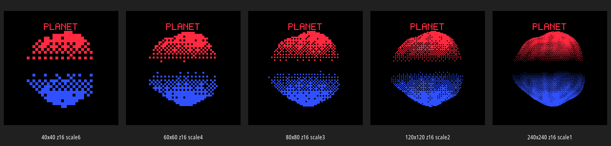
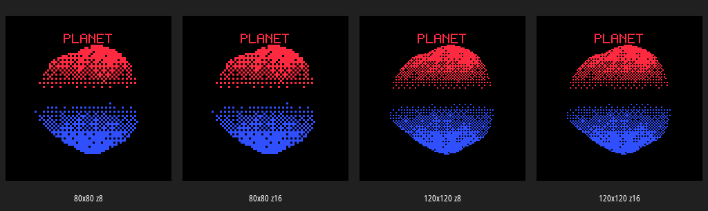
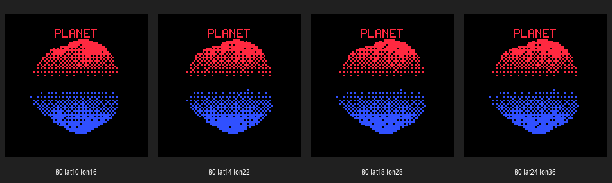
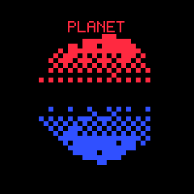
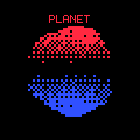
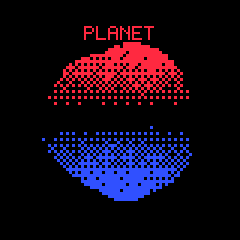
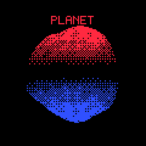
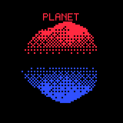
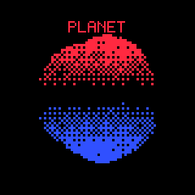
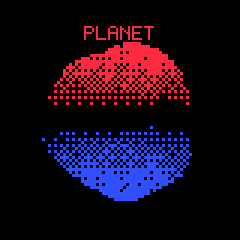

# Host-Side Buffer Configuration Comparison Report

This report compares candidate framebuffer configurations for the ticket 0097 proper 3D planet renderer. The comparison is host-side because the host can render many configurations quickly, write PNGs, and make the visual tradeoffs inspectable before firmware code is written. The goal is not to measure ESP32-S3 performance directly. The goal is to choose a firmware starting point using concrete evidence: logical resolution, physical pixel scale, Z-buffer size, mesh density, and visible quality.

The renderer under test is the host prototype in `scripts/01-host-planet-renderer-prototype.py`. It mirrors the proposed firmware pipeline:

1. Render a low-poly planet at a coarse logical resolution.
2. Use a full logical Z-buffer.
3. Quantize each winning fragment directly to four color indices with Bayer 4×4 ordered dithering.
4. Scale logical pixels to a 240×240 output image.
5. Draw solid non-dithered UI text after the scene pass.

The batch runner is `scripts/02-compare-buffer-configs.py`. It generated screenshots and metrics under:

```text
ttmp/2026/05/28/0097--m5dial-proper-3d-planet-renderer-design/artifacts/buffer-config-comparison
```

## Executive Summary

The best first firmware configuration remains:

```text
logical render target: 80 × 80
physical pixel scale: 3 × 3
Z-buffer: uint16_t, 12,800 bytes
mesh: around lat18/lon28 initially, or lat14/lon22 if firmware time is high
final color framebuffer: existing 240 × 240 2-bit packed buffer, 14,400 bytes
```

The comparison confirms four important points:

- `40×40` is too coarse for the planet. It shows the basic red/blue split but loses the rounded surface quality.
- `60×60` is recognizable, but the sphere still looks visibly sparse and blocky.
- `80×80` is the first configuration that looks like a usable embedded target. It gives a clear sphere, visible dither density, readable UI, and a small 12.8 KB 16-bit Z-buffer.
- `120×120` looks better, but it more than doubles Z-buffer memory and logical pixel work relative to `80×80`. It is an excellent second target after the 80×80 path works.

The 8-bit and 16-bit Z screenshots are visually identical in the current sphere-only prototype. That does not prove 8-bit Z is safe for the final ringed planet. It only proves that, for the current sphere-only scene, depth precision is not the limiting visual factor. The implementation should still begin with 16-bit Z because it costs only 12.8 KB at 80×80 and removes one class of debugging ambiguity.

## Resolution Comparison

The first comparison holds mesh density and Z depth constant while changing only the logical render target size. All images below use 16-bit Z and the same `lat18/lon28` sphere mesh.



The visual progression is clear. The `40×40` image uses `6×6` physical pixels. The UI remains readable because it is drawn after the scene at 240×240, but the planet surface has too little spatial information. The `60×60` image improves the silhouette and hemisphere separation, but the dither pattern still dominates the shape. The `80×80` image reaches a useful balance: it is chunky enough to match the M5Dial aesthetic, but it has enough logical samples to show curvature and surface variation. The `120×120` image is smoother and closer to the browser reference, but it costs more memory and raster work. The `240×240` image is visually rich but no longer has the same bold embedded pixel aesthetic, and it is much more expensive.

### Resolution Metrics

| Configuration | Pixel scale | Logical pixels | Z-buffer bytes, 8-bit | Z-buffer bytes, 16-bit | Host render ms, 16-bit | Planet fragments |
|---|---:|---:|---:|---:|---:|---:|
| 40×40 | 6 | 1,600 | 1,600 | 3,200 | 32.745 | 516 |
| 60×60 | 4 | 3,600 | 3,600 | 7,200 | 36.233 | 1,156 |
| 80×80 | 3 | 6,400 | 6,400 | 12,800 | 42.071 | 2,066 |
| 120×120 | 2 | 14,400 | 14,400 | 28,800 | 56.204 | 4,650 |
| 240×240 | 1 | 57,600 | 57,600 | 115,200 | 91.272 | 18,573 |

Host render time is Python time, not firmware time. It is still useful as a relative indicator because the same algorithm and mesh run under each configuration. The trend is what matters: `120×120` has more than twice the logical pixels of `80×80`, and `240×240` has nine times the logical pixels of `80×80`.

The Z-buffer memory trend is exact and directly relevant to firmware. At 80×80, 16-bit Z is cheap. At 240×240, 16-bit Z becomes a major allocation.

## 8-bit vs 16-bit Z

The second comparison keeps the render size constant and compares 8-bit and 16-bit Z.



The current sphere-only prototype produces visually identical images for 8-bit and 16-bit Z at both 80×80 and 120×120. This is expected. A single convex sphere does not stress depth precision severely. Most visible pixels have one frontmost surface that is clearly closer than the back-facing geometry.

This result supports a future 8-bit experiment, but it does not justify starting with 8-bit Z in firmware. The final planet scene needs a ring and possibly a moon. The ring creates near-overlap and thin geometry around the planet silhouette. That is exactly where low Z precision can produce speckle or incorrect occlusion.

The implementation rule should be:

1. Implement 80×80 with 16-bit Z first.
2. Capture the sphere.
3. Add ring.
4. Capture ringed planet.
5. Only then test 8-bit Z and compare captures.

At 80×80, the difference between 8-bit and 16-bit Z is only:

```text
16-bit Z: 12,800 bytes
8-bit Z:   6,400 bytes
savings:   6,400 bytes
```

That saving is not worth complicating the first renderer milestone.

## Mesh Density Comparison

The third comparison keeps the logical render target at `80×80` and 16-bit Z while changing the UV sphere density.



The images show that mesh density has much less visual impact than logical resolution for this prototype. The visible planet pixels are limited by the `80×80` raster grid and the 4-color dither pattern. Increasing the mesh from `lat10/lon16` to `lat24/lon36` changes surface detail slightly, but it does not radically improve the output.

### Mesh Density Metrics

| Configuration | Vertices | Triangles | Z-buffer bytes | Host render ms | Planet fragments |
|---|---:|---:|---:|---:|---:|
| 80×80, lat10/lon16 | 176 | 288 | 12,800 | 35.457 | 2,039 |
| 80×80, lat14/lon22 | 330 | 572 | 12,800 | 37.142 | 2,056 |
| 80×80, lat18/lon28 | 532 | 952 | 12,800 | 38.997 | 2,066 |
| 80×80, lat24/lon36 | 900 | 1,656 | 12,800 | 41.536 | 2,072 |

This is a useful result. At `80×80`, raster coverage is nearly the same for all mesh densities. More triangles mostly affect CPU cost and subtle curvature/surface variation. The firmware should start with a moderate mesh, not the densest mesh.

A good first firmware mesh is either:

```text
lat14 / lon22: 330 vertices, 572 triangles
```

or:

```text
lat18 / lon28: 532 vertices, 952 triangles
```

I would start with `lat14/lon22` if implementation speed and frame time are the priority. I would start with `lat18/lon28` if the goal is to match the host prototype screenshots more closely. Both are reasonable. The design guide's `lat18/lon28` recommendation remains acceptable, but this comparison suggests that `lat14/lon22` may be the better first firmware mesh.

## Individual Screenshots

### Resolution set

| 40×40 | 60×60 | 80×80 | 120×120 | 240×240 |
|---|---|---|---|---|
|  |  |  |  |  |

### Z-bit set

| 80×80 Z8 | 80×80 Z16 | 120×120 Z8 | 120×120 Z16 |
|---|---|---|---|
|  |  |  |  |

### Mesh-density set

| lat10/lon16 | lat14/lon22 | lat18/lon28 | lat24/lon36 |
|---|---|---|---|
|  |  |  |  |

## Interpretation for Firmware

The firmware should not optimize for maximum visible quality on the first pass. It should optimize for correctness, robustness, and a clear validation loop. The host comparison points to this implementation profile:

```text
R3D_W = 80
R3D_H = 80
R3D_PIXEL_SCALE = 3
R3D_Z_BITS = 16
mesh = lat14/lon22 or lat18/lon28 UV sphere
```

This configuration has the following advantages:

- The Z-buffer is only 12.8 KB.
- The output style remains visibly pixelated and consistent with the original shader.
- The sphere is recognizable.
- Mesh density can be moderate without losing much visual quality.
- There is still a clear upgrade path to 120×120.

The first firmware milestone should not attempt 240×240. The screenshot is visually smooth, but the Z-buffer is 115.2 KB and the logical raster work is 9× the 80×80 path. It is the wrong first implementation target.

## Recommendations

### Recommended first firmware configuration

Use:

```cpp
#define R3D_W 80
#define R3D_H 80
#define R3D_PIXEL_SCALE 3
#define R3D_Z_BITS 16
```

Use either:

```text
lat14/lon22 sphere: 330 vertices, 572 triangles
```

or:

```text
lat18/lon28 sphere: 532 vertices, 952 triangles
```

My recommendation is to start with `lat14/lon22` in firmware and keep `lat18/lon28` as the first quality upgrade. The host images show only a small visual difference at 80×80, and fewer triangles reduce firmware risk.

### Recommended validation sequence

1. Implement 80×80 / 16-bit Z / lat14-lon22 sphere.
2. Capture with `dumpfb`.
3. Compare against `mesh-L80-Z16-lat14-lon22.png`.
4. Upgrade to lat18-lon28 if the sphere looks too faceted.
5. Test 120×120 only after the 80×80 path is correct.
6. Test 8-bit Z only after ring occlusion works.

### Recommended report-backed decision

The comparison supports this final decision:

> Build the first proper 3D planet renderer at 80×80 with 16-bit Z and a moderate UV sphere mesh. This is the lowest-risk configuration that still produces a recognizable, visually useful planet in the target four-color dithered style.

## Caveats

The host prototype is not firmware. Python render time is not ESP32-S3 render time. The host result also currently fails to draw the ring (`ring_pixels: 0`), which means the ring path needs its own design and validation pass. The report therefore compares the sphere renderer and buffer configurations, not final ringed-planet composition.

The 8-bit Z result is also not final evidence for ringed planet. It is evidence only for the current convex sphere. Depth precision must be re-evaluated after thin ring geometry is added.

## Reproduction Commands

Run the batch comparison:

```bash
python3 ttmp/2026/05/28/0097--m5dial-proper-3d-planet-renderer-design/scripts/02-compare-buffer-configs.py \
  --out-dir ttmp/2026/05/28/0097--m5dial-proper-3d-planet-renderer-design/artifacts/buffer-config-comparison
```

Generate montages:

```bash
cd ttmp/2026/05/28/0097--m5dial-proper-3d-planet-renderer-design/artifacts/buffer-config-comparison

montage \
  -label '40x40 z16 scale6' resolution-L40-Z16-lat18-lon28.png \
  -label '60x60 z16 scale4' resolution-L60-Z16-lat18-lon28.png \
  -label '80x80 z16 scale3' resolution-L80-Z16-lat18-lon28.png \
  -label '120x120 z16 scale2' resolution-L120-Z16-lat18-lon28.png \
  -label '240x240 z16 scale1' resolution-L240-Z16-lat18-lon28.png \
  -tile 5x1 -geometry 240x270+8+8 -background '#202020' -fill white resolution-z16-montage.png
```

Inspect the report:

```bash
md-view view ttmp/2026/05/28/0097--m5dial-proper-3d-planet-renderer-design/design-doc/02-buffer-configuration-comparison-report.md
```
