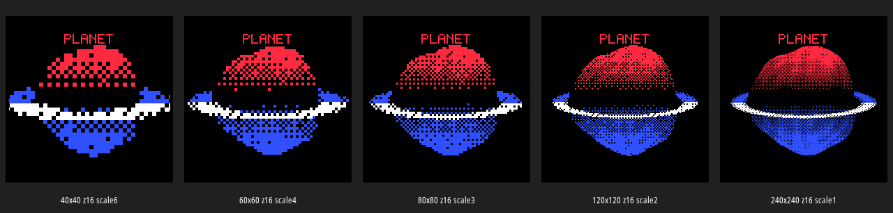
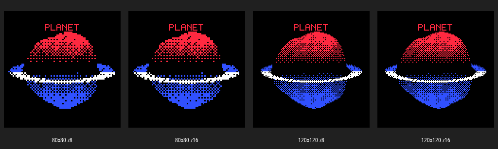
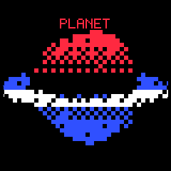
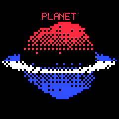
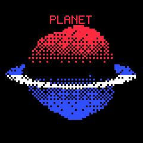
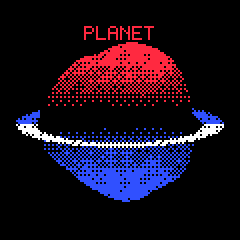
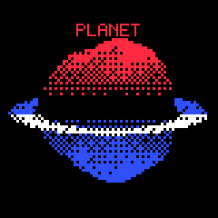
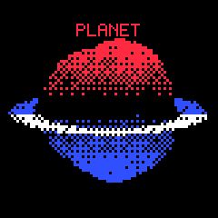
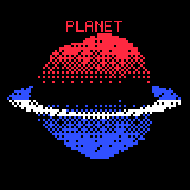

# JSX-Matched Host Buffer Configuration Report

The first host comparison proved the memory and rasterization model, but the screenshots did not look enough like the original `m5dial.jsx` planet scene. The main missing visual element was the ring. The original JSX scene is not merely a red/blue sphere; it is a ringed planet with a thin blue-white ring crossing the body. Without the ring, the host image looked like two separated red and blue hemispheres rather than the intended `PLANET` scene.

This report repeats the buffer comparison after adjusting the host prototype to match the JSX composition more closely. The updated prototype still uses the proposed firmware architecture for the planet body: coarse logical rasterization, full logical Z-buffer, and direct four-color Bayer quantization. It now adds a split ring pass around the planet so the comparison images reflect the actual target composition.

The updated artifacts are stored in:

```text
ttmp/2026/05/28/0097--m5dial-proper-3d-planet-renderer-design/artifacts/buffer-config-comparison-v2
```

## What changed from the first prototype

The first prototype tried to include a ring mesh, but it produced no visible ring fragments. The batch output showed:

```text
ring_pixels: 0
```

That made the comparison technically useful but visually incomplete. For the revised host comparison, I changed the prototype to draw a JSX-style split ring as an ordered-dithered ellipse:

1. Draw the back half of the ring.
2. Rasterize the planet body with the logical Z-buffer.
3. Draw the front half of the ring.
4. Draw solid UI text after the scene.

This is not the final firmware ring implementation. The firmware should eventually use either a real 3D ring strip or the same split-ring composition as a deliberate approximation. The host prototype's purpose is to produce a closer visual reference while we compare buffer configurations.

## Updated resolution comparison



The ring changes the interpretation of the configurations. The `40×40` version now reads as a ringed object, but the ring is too heavy and coarse. The `60×60` version is more recognizable, but the ring still dominates the body. The `80×80` version is the first acceptable embedded-style composition: the body is chunky but recognizable, the ring is visible, and the dither pattern remains bold. The `120×120` version is the closest match to the JSX default because the original shader uses `pixelSize = 2`, which corresponds to a 120×120 logical image expanded to 240×240. The `240×240` version is visually rich but no longer representative of the intended pixelated firmware target.

The revised visual conclusion is slightly different from the first report:

- `80×80` remains the best **first firmware implementation** target because it is small and readable.
- `120×120` is the best **JSX visual match** target because it corresponds to the browser shader's default `pixelSize = 2`.
- The firmware should be architected so that moving from 80×80 to 120×120 is a configuration change, not a rewrite.

## Updated resolution metrics

| Configuration | Pixel scale | Logical pixels | 16-bit Z bytes | Host render ms | Planet fragments | Ring fragments |
|---|---:|---:|---:|---:|---:|---:|
| 40×40 | 6 | 1,600 | 3,200 | 86.556 | 516 | 187 |
| 60×60 | 4 | 3,600 | 7,200 | 62.709 | 1,156 | 269 |
| 80×80 | 3 | 6,400 | 12,800 | 77.474 | 2,066 | 369 |
| 120×120 | 2 | 14,400 | 28,800 | 90.946 | 4,650 | 563 |
| 240×240 | 1 | 57,600 | 115,200 | 194.380 | 18,573 | 2,263 |

Host render time is Python time and should not be treated as ESP32-S3 timing. The memory numbers and logical pixel counts are exact. The important firmware fact remains that 80×80 with 16-bit Z costs only 12.8 KB, while 120×120 costs 28.8 KB. Both are plausible. The first implementation should choose 80×80 for lower risk, then test 120×120 once the renderer is stable.

## 8-bit versus 16-bit Z with the closer visual target



The 8-bit and 16-bit Z outputs still look equivalent in this prototype. That means the current sphere body does not require 16-bit precision. However, the ring is still not Z-tested as real geometry in the prototype; it is a split composition pass. Therefore, this comparison still does not prove that 8-bit Z will work for a future true 3D ring strip.

The implementation recommendation remains:

```text
first firmware version: 16-bit Z
later experiment:       8-bit Z after sphere and ring are stable
```

At 80×80, 16-bit Z costs 12.8 KB and 8-bit Z costs 6.4 KB. The 6.4 KB saving is not worth making the first implementation harder to debug.

## Mesh density with the closer visual target


The mesh-density comparison still shows that logical resolution matters more than triangle count. At 80×80, increasing the UV sphere from `lat10/lon16` to `lat24/lon36` changes surface texture subtly, but the output remains dominated by the logical pixel grid and Bayer dither. This is good news for firmware: we do not need a dense sphere to get a useful result.

| Configuration | Vertices | Triangles | 16-bit Z bytes | Host render ms | Planet fragments | Ring fragments |
|---|---:|---:|---:|---:|---:|---:|
| 80×80, lat10/lon16 | 176 | 288 | 12,800 | 74.927 | 2,039 | 369 |
| 80×80, lat14/lon22 | 330 | 572 | 12,800 | 63.265 | 2,056 | 369 |
| 80×80, lat18/lon28 | 532 | 952 | 12,800 | 65.779 | 2,066 | 369 |
| 80×80, lat24/lon36 | 900 | 1,656 | 12,800 | 79.941 | 2,072 | 369 |

The preferred first firmware mesh is still `lat14/lon22` or `lat18/lon28`. The lower-density mesh is probably enough to validate the renderer. The higher-density mesh can be a quality upgrade.

## Individual JSX-matched screenshots

### Resolution set

| 40×40 | 60×60 | 80×80 | 120×120 | 240×240 |
|---|---|---|---|---|
|  |  |  |  |  |

### Z-bit set

| 80×80 Z8 | 80×80 Z16 | 120×120 Z8 | 120×120 Z16 |
|---|---|---|---|
|  |  |  |  |

### Mesh-density set

| lat10/lon16 | lat14/lon22 | lat18/lon28 | lat24/lon36 |
|---|---|---|---|
|  |  |  |  |

## Revised recommendation

The design should now distinguish two targets:

### First firmware target

Use this to get a correct proper 3D renderer running on the M5Dial:

```cpp
#define R3D_W 80
#define R3D_H 80
#define R3D_PIXEL_SCALE 3
#define R3D_Z_BITS 16
```

Use a moderate sphere mesh:

```text
lat14/lon22 or lat18/lon28
```

This is the lowest-risk path. It gives a recognizable ringed planet and keeps the Z-buffer small.

### Visual match target

Use this after the first renderer is stable:

```cpp
#define R3D_W 120
#define R3D_H 120
#define R3D_PIXEL_SCALE 2
#define R3D_Z_BITS 16
```

This better matches the JSX default `pixelSize = 2`. It costs 28.8 KB for the Z-buffer, which is still reasonable on the M5Dial if heap measurements confirm a healthy largest internal block.

## Firmware implication for the ring

The revised host prototype uses a split ring composition because it better matches the JSX visual target. The firmware has two valid implementation paths:

1. **Split composition ring:** Draw the back half of a ring, draw the Z-buffered planet, then draw the front half. This is closer to the host reference and may be visually cleaner at 80×80.
2. **True 3D ring strip:** Rasterize ring triangles with the same Z-buffer. This is more geometrically honest but may alias because the ring is thin.

For the first ring milestone, I now recommend the split composition ring. It is closer to the JSX result and easier to make readable on the coarse framebuffer. A true 3D ring strip can remain a later experiment.

## Conclusion

The host prototype now better matches the JSX planet scene because it includes the ringed composition. With that correction, the buffer recommendation becomes more nuanced:

- Start firmware at 80×80 because it is low-risk and still recognizable.
- Treat 120×120 as the target for closer JSX visual fidelity.
- Keep 16-bit Z for the first implementation.
- Use split ring composition for the first ring milestone.
- Keep mesh density moderate; logical resolution matters more than triangle count at this scale.

The next firmware step should be a minimal 80×80 16-bit-Z planet sphere, followed by a split ring pass. The screenshot target for that work should be `buffer-config-comparison-v2/resolution-L80-Z16-lat18-lon28.png` first, and `buffer-config-comparison-v2/resolution-L120-Z16-lat18-lon28.png` as the later quality target.
