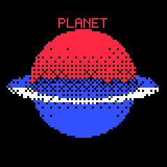
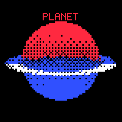

# Firmware Planet Renderer Spherical Silhouette Analysis

The first on-device `planet3d` capture proved that the M5Dial can render a coarse Z-buffered planet scene at interactive speed, but it also exposed an important visual problem: the planet did not read as a sphere. The body looked pinched around the equator and irregular around the boundary. This report records the cause, the fix, and the remaining visual tradeoffs.

The short version is: **the issue was not Z-buffer precision**. The renderer was already using a 16-bit logical Z-buffer. The misshapen appearance came from geometry and quantization decisions upstream of depth testing.

## Before and after

### First firmware capture


The first capture is recognizable as the intended ringed planet composition: black background, solid `PLANET` title, red upper hemisphere, blue lower hemisphere, and split blue/white ring. However, the visible body is not a clean disk. The middle band is too empty, the body appears squeezed, and the silhouette is lumpy.

### Corrected firmware capture



The corrected capture keeps the same architecture and runtime target: `80×80` logical rasterization, 3× physical expansion, 16-bit Z, and a 2-bit final framebuffer. The planet now reads more like a round body. It is still intentionally chunky because every logical pixel becomes a 3×3 physical block, but the visible disk is no longer shaped by radial noise and missing equatorial color.

### Corrected host preview



The host preview and the firmware dump now agree closely enough to be useful for further iteration. The host path remains the fastest place to tune color ramps and shape rules, while the firmware capture remains the ground truth for the exact embedded renderer.

## Why higher Z precision did not fix it

A Z-buffer stores depth. During rasterization, each fragment computes a depth value and compares it against the current value at that logical pixel. If the new fragment is closer, it replaces the old fragment.

That means Z precision can fix these classes of errors:

- two surfaces fighting at nearly the same depth,
- incorrect front/back ordering due to quantized depth,
- ring/sphere occlusion errors when both are real 3D geometry.

It cannot fix these classes of errors:

- vertices that are not on a sphere,
- a low-resolution silhouette,
- color values that quantize to black,
- an analytic overlay ring that is drawn after the planet,
- threshold/dither patterns that remove large parts of the body.

The first firmware path already used:

```text
80 * 80 * 16 bits = 12,800 bytes of Z
```

That is enough precision for the current sphere-only body. The visible shape problem happened before Z precision became relevant.

## Root cause 1: noise changed the geometry

The first host and firmware implementations used procedural noise to perturb the sphere radius. Conceptually, the code did this:

```text
position = unit_sphere_position * (radius * (1.0 + noise * 0.5))
```

That means the object was not a mathematical sphere. It was a low-resolution bumpy sphere. At high resolution this could look like terrain or planet relief. At `80×80`, with 3× pixel expansion and four-color dithering, that radial displacement damaged the silhouette instead of reading as subtle surface texture.

The corrected version keeps the mesh spherical:

```text
position = unit_sphere_position * radius
```

Noise is still available, but only for color texture:

```text
color = latitude_gradient + procedural_texture + base_density
```

This distinction matters. Geometry noise changes the boundary of the rendered body. Color noise changes only the interior pattern.

## Root cause 2: the color model erased the middle of the sphere

The first color model used a mostly latitude-driven warm/cool split:

```text
red  = max(0, latitude) * texture
blue = max(0, -latitude) * texture
```

At the equator, both terms approach zero. Near the limb, the sampled colors could also be weak. After contrast and Bayer thresholding, many of those logical pixels became black. The mesh could be present and the Z-buffer could be correct, while the visible output still looked like part of the planet was missing.

The corrected version adds a density floor:

```text
lat01 = clamp(latitude * 0.5 + 0.5, 0, 1)
red   = 0.18 + lat01 * 0.74 + texture
blue  = 0.18 + (1.0 - lat01) * 0.74 - texture * 0.35
```

This keeps the red/blue latitude split, but every point on the body starts with enough density to survive quantization more often. The result is less fragile under a 4×4 Bayer threshold.

## Firmware changes

The firmware changes are concentrated in:

```text
0096-m5dial-dithered-3d/main/renderer3d.cpp
```

The sphere generation now does three separate jobs:

1. Generate positions on a true UV sphere.
2. Compute procedural texture values from the spherical position.
3. Assign red/blue color densities with a minimum floor.

The important invariant is:

```text
vertex_position.length == planet_radius
```

for the generated sphere, modulo floating-point error. The renderer can now tune visual texture without damaging the silhouette.

## Host prototype changes

The host prototype was updated in parallel:

```text
ttmp/2026/05/28/0097--m5dial-proper-3d-planet-renderer-design/scripts/01-host-planet-renderer-prototype.py
```

Keeping host and firmware aligned is important because the host script is still the faster visual laboratory. If the host prototype kept the old lumpy geometry, future screenshots would continue to recommend misleading visual choices.

## Updated runtime measurements

After the correction, the M5Dial reported:

```text
R3D: 80x80 scale=3 z=16-bit render=23147 us (43.2 FPS render-only)
Buffers: z=12800 bytes color=6400 bytes fb=14400 bytes
Mesh: 532 vertices, 952 triangles
Triangles: 952 submitted, 573 drawn
Pixels: planet=2095 ring=367 moon=0

Frame time: 36018 us (27.8 FPS)
Mode: triangle
Triangles: 952 submitted, 573 drawn
Pixels written: 2462
```

The fix did not materially change the memory model. It slightly changed fragment counts and produced a rounder body. The renderer remains fast enough for the first firmware target.

## Remaining visual issues

The corrected result is better, but it is not final.

1. **It is still visibly chunky.** This is expected at `80×80` logical resolution with 3× expansion.
2. **The equatorial band is visually strong.** The density floor makes the sphere rounder, but the red/blue transition and ring overlap may need artistic tuning.
3. **The ring is still analytic split geometry, not a real 3D strip.** That is acceptable for the first milestone, but future occlusion tests should use either a deliberate split-composition design or a true mesh.
4. **Moon visibility still needs angle-sweep validation.** The captured angle reports `moon=0`, so the moon path has not yet been visually validated.

## Recommendation

Keep the corrected spherical geometry as the baseline. Do not reintroduce radial displacement until the renderer has a higher-resolution mode or a deliberate normal/shading model that can preserve the silhouette.

For the next firmware step:

1. Capture an angle sweep at `80×80` to confirm the body stays round while rotating.
2. Tune the red/blue density ramp using hardware captures, not only host PNGs.
3. Validate moon visibility across several angles.
4. Only then branch to a `120×120` experiment.

The next quality experiment should be about **logical resolution and color tuning**, not Z precision. The Z-buffer is already doing its job for the current sphere.
