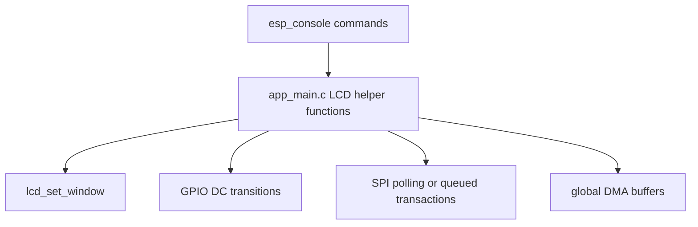
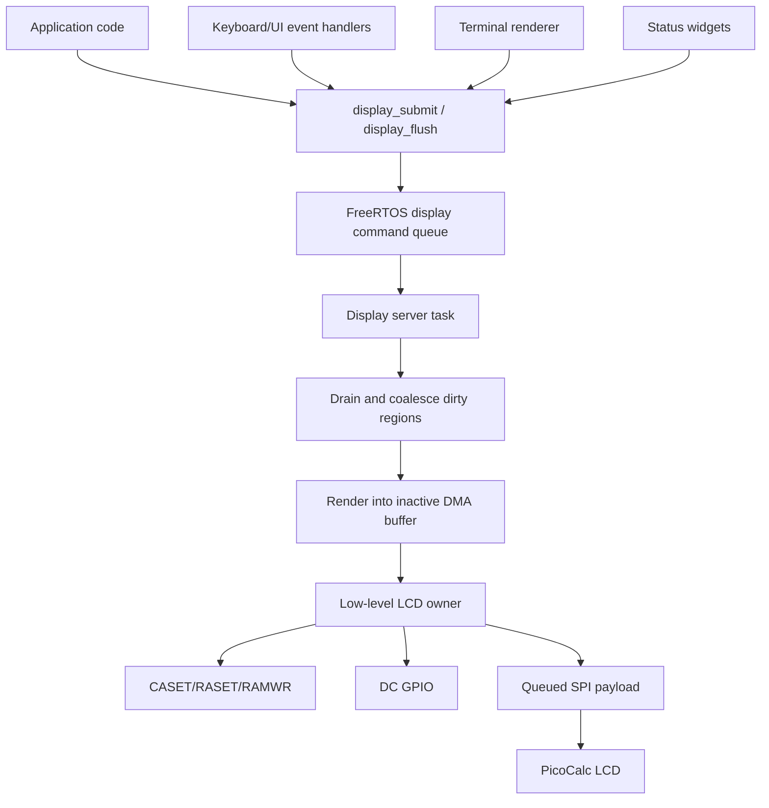

# Display Server Design and Implementation Guide

## Executive summary

The ESP32-P4 PicoCalc display path has moved beyond bring-up. The lean `0099-esp32-p4-picocalc-display-keyboard` firmware has validated the same-position LCD wiring, actual 80 MHz SPI using `SPI_CLK_SRC_SPLL`, 32 KiB DMA-capable transfers, visual pattern tests, terminal-shaped benchmarks, queued SPI payload transfers, double-buffered rendering, moving-rectangle workloads, background-restore workloads, and mixed dirty-region workloads.

The next production step is a **display server**: a dedicated FreeRTOS task and API layer that owns all LCD state. The display server should be the only code that programs LCD address windows, toggles the DC GPIO, submits SPI transactions, manages DMA-capable buffers, waits for queued transfers, batches dirty regions, and renders text rows or blits into internal transfer buffers.

This design is for a new intern. It explains what the system is, why it is needed, which files already contain the validated pieces, what invariants must not be broken, and how to implement the first production-quality display server incrementally.

The key design rule is simple but strict:

> No code outside the display server may directly call `lcd_set_window()`, toggle `LCD_PIN_DC`, submit SPI transfers to the LCD device, or reuse a DMA buffer that might still be owned by an in-flight queued transaction.

That rule prevents subtle display corruption. In the current manual LCD driver, the SPI transaction does not encode whether bytes are commands or pixels. The command/data phase is carried by a separate GPIO (`LCD_PIN_DC`). If application code changes the LCD window or DC state while a queued pixel transfer is still in flight, the panel may interpret bytes under the wrong state. The display server exists to make that ordering correct by construction.

## Problem statement and scope

### Problem

The current firmware exposes LCD operations directly through console commands and helper functions in `app_main.c`. That is appropriate for bring-up and benchmarking, but it is not a scalable architecture for a real PicoCalc firmware.

A production PicoCalc firmware will have several producers of display work:

- terminal text rendering;
- keyboard input echo;
- cursor blink;
- status bar updates;
- menus and dialogs;
- scroll operations;
- future graphics/widgets;
- background tasks that report progress.

If these producers call low-level LCD functions directly, they will compete for the same protocol state: SPI device handle, LCD address window, DC GPIO, DMA buffers, and queued transaction results. That creates correctness risks and makes batching impossible.

### Scope

This ticket covers the design and implementation guide for a display server running inside the ESP32-P4 firmware. It does not implement the full final UI. It specifies the infrastructure needed so future UI work has a correct display foundation.

In scope:

1. Display server task ownership model.
2. Public display API for fills, blits, text rows, scroll requests, dirty invalidation, and flush.
3. Internal command queue and batching model.
4. DMA buffer lifecycle.
5. Safe queued SPI transfer sequencing.
6. Dirty-region normalization and coalescing policy.
7. Text row rendering integration path.
8. Testing and benchmark strategy using the existing `0099` evidence.

Out of scope for the first implementation:

1. Full terminal emulator semantics.
2. Unicode shaping.
3. Proportional fonts.
4. Hardware vertical scroll command implementation.
5. Migration to `esp_lcd_panel_io_spi`.
6. Final adapter PCB routing.

Those items remain future work. The display server should make them easier to add later.

## Current-state analysis

### Validated firmware base

The current implementation lives in:

```text
0099-esp32-p4-picocalc-display-keyboard/main/app_main.c
0099-esp32-p4-picocalc-display-keyboard/README.md
```

The firmware is intentionally lean. It excludes Wi-Fi and ESP-Hosted so LCD and keyboard development remains fast and quiet. The README lists the validated command surface and includes the latest display benchmark commands.

The LCD constants are defined in `app_main.c` lines 41–57:

```c
#define LCD_HOST               SPI2_HOST
#define LCD_PIN_SCK            3
#define LCD_PIN_MOSI           2
#define LCD_PIN_MISO           (-1)
#define LCD_PIN_CS             7
#define LCD_PIN_DC             24
#define LCD_PIN_RST            25
#define LCD_WIDTH              320
#define LCD_HEIGHT             320
#define LCD_DEFAULT_SPI_HZ        (80 * 1000 * 1000)
#define LCD_SPI_CLK_SRC           SPI_CLK_SRC_SPLL
#define LCD_SPI_MAX_TRANSFER_SZ   (32 * 1024)
#define LCD_FILL_DMA_CHUNK_BYTES  LCD_SPI_MAX_TRANSFER_SZ
```

These definitions encode several important decisions:

- The current hardware mapping is the same-position adapter mapping, not the ideal SPI2 IO-MUX mapping.
- The validated display size is 320×320 RGB565.
- The validated clock source is `SPI_CLK_SRC_SPLL`, not `SPI_CLK_SRC_DEFAULT`.
- The active DMA transaction size is 32 KiB, which matches the ESP32-P4 SPI DMA limit.

### Why `SPI_CLK_SRC_SPLL` matters

ESP-IDF v5.4.2 checks the requested GPSPI clock against the selected clock source. The relevant local design guide records the rule:

```c
clock_speed_hz <= MIN(clock_source_hz / 2, 80 MHz)
```

With the default XTAL source, ESP32-P4 uses a 40 MHz source and rejects SCLK above 20 MHz. Selecting `SPI_CLK_SRC_SPLL` makes 80 MHz accepted and measured as actual 80 MHz.

This is why the display server should not treat clock configuration as a minor detail. It should either keep the validated constants or expose clock setup through a single initialization path that reports requested and actual speed.

### Current transfer primitives

The existing code has several validated primitives:

- `lcd_tx()` chunks transfers and uses `spi_device_polling_transmit()` for synchronous TX-only payloads.
- `lcd_ensure_dma_buffer()` allocates a reusable internal DMA-capable buffer.
- `lcd_ensure_row_buffers()` allocates two internal DMA-capable buffers for queued/double-buffered payloads.
- `lcd_set_window()` sends `CASET`, `RASET`, and `RAMWR` commands.
- `lcd_fill_rect()` uses the 32 KiB buffer to send large solid-color chunks.
- queued text and dirty-region helpers use `spi_device_queue_trans()` and `spi_device_get_trans_result()`.

The display server should reuse the validated ideas, but not necessarily keep all of them in `app_main.c`. A production refactor should move display code into a dedicated component or module.

Suggested initial module layout:

```text
0099-esp32-p4-picocalc-display-keyboard/main/
  app_main.c                 // console and high-level app wiring
  display_server.h           // public API
  display_server.c           // task, queue, batching, ownership
  display_lcd_lowlevel.h     // private LCD command/SPI helpers
  display_lcd_lowlevel.c     // init, set_window, tx, queued payload wait
  display_render.h           // text/rect render helpers
  display_render.c           // RGB565 generation into DMA buffers
  picocalc_keyboard.*        // existing keyboard driver
```

This split keeps the display server understandable:

- `display_lcd_lowlevel.*` knows how to talk to the panel.
- `display_render.*` knows how to turn commands into RGB565 pixels.
- `display_server.*` owns sequencing, queues, coalescing, and task behavior.
- `app_main.c` submits display work and exposes console commands for tests.

### Current benchmark evidence

The existing ticket `ESP32-P4-PICOCALC` contains the main LCD optimization guide:

```text
ttmp/2026/06/01/ESP32-P4-PICOCALC--esp32-p4-wifi6-as-picocalc-mcu-replacement-rp2350-swap/design-doc/04-picocalc-lcd-spi-throughput-optimization-guide.md
```

The most important results are:

| Workload | Result |
|---|---:|
| Full-screen solid fill | 21 ms/frame, about 9105 KiB/s |
| Generated full-screen pattern | 33 ms/frame, about 6052 KiB/s |
| Polling pseudo-text 8×16 | 950–955 ms / 20 screens, about 20–21 screens/s |
| Queued pseudo-text 8×16 | 568 ms / 20 screens, about 35 screens/s |
| 8×16 cell fill | about 1207 updates/s |
| 320×16 row fill | about 546 updates/s |
| Moving 64×64 rect, polling | 754 ms / 500 frames, 662 frames/s |
| Moving 64×64 rect, queued | 503 ms / 500 frames, 992 frames/s |
| Restore 64×64 rect, polling | 922 ms / 300 frames, 325 frames/s |
| Restore 64×64 rect, queued | 604 ms / 300 frames, 496 frames/s |
| Mixed 40×24 rects, polling | 386 ms / 200 frames, 517 frames/s |
| Mixed 40×24 rects, queued | 303 ms / 200 frames, 659 frames/s |

These numbers shape the architecture:

- Full-screen fills are close to the 80 MHz payload floor, so clock speed is not the next problem.
- Pseudo-text is balanced between render and transfer, so double-buffered overlap helps.
- Medium dirty rectangles benefit from queued transfer.
- Very small mixed dirty rectangles benefit less because command/window overhead dominates.
- The display server should batch and coalesce where possible.

## Gap analysis

The current firmware proves the necessary pieces, but it lacks production ownership structure.

### Current state



This is simple, but every helper shares global state. It is acceptable for one console command at a time. It is not acceptable once multiple application subsystems want to update the screen.

### Target state



The display server centralizes ownership. Application code submits commands. The server decides when and how to touch the LCD.

### Gaps to close

1. There is no public display API.
2. There is no display task.
3. There is no command queue.
4. There is no explicit DMA-buffer ownership state.
5. There is no batching/coalescing phase.
6. Existing benchmark logic is embedded in console command branches.
7. Text rendering is still pseudo-glyph generation, not a real bitmap font.
8. Queued transfer visual confirmation remains pending for newer queued workloads.

The first display server does not need to solve all of these perfectly. It needs to introduce the right ownership boundary and keep the validated benchmark behavior reproducible.

## Proposed architecture

### Responsibilities

The display server owns:

- LCD initialization.
- SPI device handle.
- LCD address-window commands.
- DC and reset GPIOs.
- Internal DMA-capable buffers.
- Queued SPI transaction descriptors while in flight.
- Dirty-command queue.
- Dirty-region coalescing.
- Render-to-RGB565 conversion for basic primitives.
- Flush and completion notifications.

The display server does not own:

- Keyboard scanning.
- Terminal parser state.
- Application domain state.
- Wi-Fi or networking.
- File system or SD card logic.

Those subsystems submit display work through the API.

### Public API sketch

Create `display_server.h`:

```c
#pragma once

#include <stddef.h>
#include <stdint.h>
#include "freertos/FreeRTOS.h"
#include "esp_err.h"

typedef enum {
    DISPLAY_CMD_FILL_RECT,
    DISPLAY_CMD_BLIT_RGB565,
    DISPLAY_CMD_TEXT_ROW,
    DISPLAY_CMD_SCROLL,
    DISPLAY_CMD_CLEAR,
    DISPLAY_CMD_PRESENT,
    DISPLAY_CMD_SYNC,
} display_cmd_type_t;

typedef enum {
    DISPLAY_ROTATION_0,
    DISPLAY_ROTATION_90,
    DISPLAY_ROTATION_180,
    DISPLAY_ROTATION_270,
} display_rotation_t;

typedef struct {
    uint16_t width;
    uint16_t height;
    int requested_hz;
    int actual_khz;
    size_t dma_chunk_bytes;
    bool initialized;
} display_status_t;

typedef struct {
    display_cmd_type_t type;
    uint16_t x;
    uint16_t y;
    uint16_t w;
    uint16_t h;
    union {
        struct {
            uint16_t color;
        } fill;
        struct {
            const uint16_t *pixels;
            size_t stride_pixels;
            bool copy_before_return;
        } blit;
        struct {
            uint16_t row;
            const char *text;
            uint16_t fg;
            uint16_t bg;
            uint8_t font_id;
        } text_row;
        struct {
            int16_t dy;
            uint16_t fill_color;
        } scroll;
    } u;
} display_cmd_t;

esp_err_t display_start(void);
esp_err_t display_stop(void);
esp_err_t display_submit(const display_cmd_t *cmd, TickType_t timeout);
esp_err_t display_submit_batch(const display_cmd_t *cmds, size_t count, TickType_t timeout);
esp_err_t display_flush(TickType_t timeout);
esp_err_t display_get_status(display_status_t *out);
```

### API behavior

`display_start()` initializes the task and LCD if necessary. It should be idempotent.

`display_submit()` enqueues one command. It should copy the command struct into the queue. It must not store pointers to stack-owned command structures.

`display_submit_batch()` enqueues several commands. The first implementation may enqueue them one by one. A later implementation can optimize by sending a batch object.

`display_flush()` waits until all commands submitted before the flush are complete. This is necessary for tests and for code that needs a stable final screen before proceeding.

`display_get_status()` reports display dimensions, requested and actual SPI clock, DMA chunk size, and initialization status.

### Pixel data lifetime rule

`DISPLAY_CMD_BLIT_RGB565` is the only tricky public command because it may refer to caller-owned pixel memory. The API should start with one of two safe policies:

1. **Copy-before-return policy.** `display_submit()` copies the pixels into an internal staging buffer before returning. This is safe but limited by memory and command size.
2. **Borrow-until-flush policy.** The caller promises that `pixels` remains valid until `display_flush()` returns. This is faster but easier to misuse.

For the first intern implementation, prefer copy-before-return for small blits and generated internal buffers for text/fills. Avoid accepting arbitrary borrowed pointers until the display server has explicit lifetime tests.

## Internal data structures

### Command queue

Use a FreeRTOS queue initially:

```c
#define DISPLAY_QUEUE_DEPTH 32

static QueueHandle_t s_display_queue;
static TaskHandle_t s_display_task;
```

The queue stores `display_cmd_t` values. This is simple and deterministic. If future commands need large payloads, the server can add a small memory pool or command arena.

### Dirty operation

Internally, normalize public commands into dirty operations:

```c
typedef enum {
    DIRTY_OP_FILL,
    DIRTY_OP_BLIT,
    DIRTY_OP_TEXT_ROW,
    DIRTY_OP_SCROLL_FILL,
} dirty_op_type_t;

typedef struct {
    dirty_op_type_t type;
    uint16_t x, y, w, h;
    union {
        struct { uint16_t color; } fill;
        struct { const uint16_t *pixels; size_t stride; } blit;
        struct { const char *text; uint16_t fg, bg; uint8_t font_id; } text;
    } u;
} dirty_op_t;
```

The display server can coalesce or reorder dirty operations only when it is safe. Do not reorder commands that have visible semantic order unless the operations are independent and non-overlapping.

### DMA buffers

Use internal DMA-capable memory for active transfers:

```c
#define DISPLAY_DMA_BUF_COUNT 2
#define DISPLAY_DMA_BUF_BYTES (32 * 1024)

static uint8_t *s_dma_buf[DISPLAY_DMA_BUF_COUNT];
static size_t s_dma_buf_len;
```

The allocation must use:

```c
heap_caps_malloc(bytes, MALLOC_CAP_DMA | MALLOC_CAP_INTERNAL)
```

Do not transmit directly from PSRAM unless the SPI driver and allocation flags prove it is DMA-safe for this target and mode. The validated path uses internal DMA memory.

### In-flight transaction state

The display task should track at most one in-flight payload for the first implementation:

```c
typedef struct {
    bool active;
    int buffer_index;
    spi_transaction_t trans;
} display_inflight_t;
```

One in-flight payload is enough to overlap rendering and transfer. It avoids deeper queue semantics while preserving the manual DC invariant.

## Key flow: server task loop

The display server task has four phases:

1. Receive at least one command.
2. Drain additional pending commands for a bounded short interval.
3. Normalize and optionally coalesce dirty operations.
4. Render and transmit operations using double-buffered queued payloads.

Pseudocode:

```text
display_task:
    initialize LCD if needed
    allocate two internal DMA buffers

    loop forever:
        cmd = wait for display_queue
        batch = [cmd]

        while queue has more commands and batch not full:
            batch.append(receive_nowait())

        dirty_ops = normalize(batch)
        dirty_ops = coalesce(dirty_ops)

        render_and_send_dirty_ops(dirty_ops)
        signal any pending flush waiter
```

A bounded drain interval is useful because it lets several UI updates collapse into one display pass. Keep it short. The first implementation can use immediate no-wait draining only; do not add frame-timing complexity until correctness is established.

## Key flow: queued render and transfer

This is the most important implementation flow.

```text
render_and_send_dirty_ops(ops):
    current = 0
    next = 1

    render ops[0] into dma[current]

    for i in 0..len(ops)-1:
        program address window for ops[i]
        set DC high
        queue dma[current] pixel payload

        if i + 1 < len(ops):
            render ops[i + 1] into dma[next]

        wait for queued payload completion

        swap current and next
```

The wait happens before the next address window is programmed. That is not optional in the current manual driver.

### Why the wait is placed there

The LCD window and DC GPIO are global panel state. The queued pixel transaction depends on that state. If the firmware changes the window while the transaction is still in flight, later bytes may land in the wrong region. If the firmware changes DC while the transaction is still in flight, later bytes may be interpreted as commands instead of data.

The safe order is:

```text
window A configured
DC high
payload A queued
render payload B
wait payload A done
window B configured
DC high
payload B queued
```

The unsafe order is:

```text
window A configured
payload A queued
window B configured before payload A done
```

The display server should make the unsafe order impossible for callers.

## Dirty-region coalescing

Dirty-region coalescing reduces command/window overhead. It is most valuable for many small rectangles.

### First coalescing rule

Start with a conservative rule: merge horizontally adjacent rectangles that share the same `y`, `h`, and render type, and whose combined width still fits in the DMA buffer.

```text
can_merge(a, b):
    return a.y == b.y
       and a.h == b.h
       and a.x + a.w == b.x
       and a.type compatible with b.type
       and ((a.w + b.w) * a.h * 2) <= DISPLAY_DMA_BUF_BYTES
```

This is useful for text rows and adjacent dirty cells.

### Do not over-coalesce initially

Do not merge arbitrary overlapping rectangles in the first implementation. Correct general rectangle union can create larger areas that require background composition. It can also increase transferred pixels. Start with simple row-oriented coalescing and measure.

### Text-specific coalescing

Text updates should naturally coalesce by row:

```text
cell dirty events -> row dirty mask -> text row blit
```

For a 40×20 terminal with 8×16 cells, a dirty row is 320×16 pixels, or 10,240 bytes. That fits comfortably in the 32 KiB DMA buffer and matches the benchmarked efficient row shape.

## Text rendering plan

The existing pseudo-text renderer is a benchmark. The display server should eventually use a real bitmap font renderer.

### Minimal font contract

```c
typedef struct {
    uint8_t width;
    uint8_t height;
    uint8_t first_codepoint;
    uint8_t last_codepoint;
    const uint8_t *bitmap;
} display_font_t;

bool display_font_get_pixel(const display_font_t *font, uint32_t ch, uint8_t x, uint8_t y);
```

### Text row render pseudocode

```text
render_text_row(buf, row, text, fg, bg, font):
    y_pixels = row * font.height
    width = LCD_WIDTH
    height = font.height

    for py in 0..height-1:
        for col in 0..cols-1:
            ch = text[col]
            for gx in 0..font.width-1:
                on = font_get_pixel(font, ch, gx, py)
                color = fg if on else bg
                write RGB565 big-endian into buf
```

The first real renderer can support ASCII only. That is enough for the PicoCalc console and many firmware screens.

## Scroll handling

Scrolling has three possible implementations.

### Option 1: repaint rows

Repaint all affected rows. This is simple and already approximated by `lcd scrollbench`.

Pros:

- Easy to implement.
- Works with any panel.
- Uses existing row rendering path.

Cons:

- Full terminal scroll redraw was measured around 27 scroll-style redraws/s for 16-pixel rows.
- Repainting every row consumes CPU and SPI bandwidth.

### Option 2: dirty row shift in a framebuffer

Maintain a framebuffer or text backing store in PSRAM, update the backing store, and repaint only necessary rows.

Pros:

- Keeps rendering logic explicit.
- Allows composition before transfer.

Cons:

- Full RGB565 framebuffer is 204,800 bytes; this is fine in PSRAM but active DMA still needs internal staging.
- More code than direct row rendering.

### Option 3: panel vertical scroll commands

Investigate ST7365P/ILI9488-compatible vertical scroll commands.

Pros:

- Potentially much faster for terminal scroll.

Cons:

- Requires panel-specific command validation.
- Must preserve coordinate mapping and dirty region semantics.
- Needs visual confirmation.

The display server should start with option 1 and expose the API in a way that can later switch to option 3 internally.

## Public API examples

### Clear the screen

```c
display_cmd_t cmd = {
    .type = DISPLAY_CMD_CLEAR,
    .x = 0,
    .y = 0,
    .w = 320,
    .h = 320,
    .u.fill.color = 0x0000,
};
ESP_ERROR_CHECK(display_submit(&cmd, pdMS_TO_TICKS(100)));
ESP_ERROR_CHECK(display_flush(pdMS_TO_TICKS(1000)));
```

### Draw one dirty status bar

```c
display_cmd_t cmd = {
    .type = DISPLAY_CMD_FILL_RECT,
    .x = 0,
    .y = 0,
    .w = 320,
    .h = 16,
    .u.fill.color = 0x2104,
};
display_submit(&cmd, 0);
```

### Submit a text row

```c
display_cmd_t cmd = {
    .type = DISPLAY_CMD_TEXT_ROW,
    .x = 0,
    .y = 10 * 16,
    .w = 320,
    .h = 16,
    .u.text_row = {
        .row = 10,
        .text = "p4dk> lcd perf queued",
        .fg = 0xffff,
        .bg = 0x0000,
        .font_id = 0,
    },
};
display_submit(&cmd, pdMS_TO_TICKS(10));
```

### Submit a batch

```c
display_cmd_t cmds[2] = {
    status_bar_fill,
    status_bar_text,
};
display_submit_batch(cmds, 2, pdMS_TO_TICKS(20));
display_flush(pdMS_TO_TICKS(200));
```

## Implementation phases

### Phase 1: Extract low-level LCD module

Move existing low-level functions out of `app_main.c` into `display_lcd_lowlevel.c`:

- LCD constants.
- SPI bus/device initialization.
- GPIO setup.
- reset sequence.
- `lcd_set_window()`.
- polling transfer.
- queued payload transfer and wait.
- actual SPI frequency query.

Acceptance criteria:

- `idf.py build` passes.
- Existing console commands still work.
- `lcd perf full` matches the current baseline within normal run-to-run variance.

### Phase 2: Add display server task and queue

Implement `display_start()`, `display_submit()`, `display_flush()`, and a task that handles `DISPLAY_CMD_FILL_RECT` and `DISPLAY_CMD_CLEAR`.

Acceptance criteria:

- Console command can clear and fill through display server API.
- No direct app-level code calls `lcd_set_window()` except inside display internals.
- `display_flush()` reliably waits for completion.

### Phase 3: Add queued dirty-op renderer

Implement internal dirty ops and double-buffered queued transfer for fill and generated blit operations.

Acceptance criteria:

- Recreate `movebench`, `restorebench`, and `mixedbench` through display server calls.
- Benchmark numbers are comparable to the current direct helper path.
- No watchdog warnings.

### Phase 4: Add text row renderer

Replace pseudo-text path with a real ASCII bitmap font renderer.

Acceptance criteria:

- Can draw a 40×20 8×16 text screen.
- Can update one dirty row.
- Can update one dirty cell or cursor rectangle.
- Performance is measured against the pseudo-text baseline.

### Phase 5: Add dirty tracking and coalescing

Add terminal-facing APIs:

```c
void terminal_mark_cell_dirty(uint16_t col, uint16_t row);
void terminal_mark_row_dirty(uint16_t row);
void terminal_present(void);
```

Internally, these produce display commands. The display server coalesces cells into rows where appropriate.

Acceptance criteria:

- Cursor blink does not redraw the full screen.
- Keypress echo updates one cell or one row.
- Line redraw batches into row-sized transfers.

### Phase 6: Add stress and visual validation commands

Add commands:

```text
display status
display filltest
display texttest
display dirtytest
display stresstest [seconds]
```

Acceptance criteria:

- Operator can run repeatable tests.
- Long stress test has explicit watchdog/progress handling.
- Human visual confirmation is recorded for queued display-server output.

## Testing strategy

### Build test

```bash
cd 0099-esp32-p4-picocalc-display-keyboard
. $HOME/esp/esp-idf-5.4.2/export.sh >/tmp/esp-idf-export-0099.log 2>&1
idf.py build
```

### Serial ownership rule

Before flashing or monitoring:

```bash
PORT=/dev/serial/by-id/usb-1a86_USB_Single_Serial_5B61091051-if00
lsof "$PORT" || true
lsof /dev/ttyACM1 || true
```

If the existing `0099_p4_dk_monitor` tmux monitor owns the port, use `Ctrl-T A` inside that monitor instead of starting a competing serial session.

### Regression command set

After a display-server refactor, run:

```text
lcd speed
lcd perf full
lcd perf queued
lcd movebench both 64 64 500
lcd restorebench both 64 64 300
lcd mixedbench both 40 24 200 4
```

Once display-server commands exist, add equivalent server-backed commands and compare.

### Visual validation

Visual validation is required after any change that affects:

- LCD init sequence;
- SPI speed;
- DC/window ordering;
- queued transfer behavior;
- RGB565 byte order;
- text renderer;
- dirty-region coalescing;
- scroll commands.

SPI success is not enough. The user must confirm that the panel output is correct.

### Unit-test-like checks inside firmware

The first firmware can include lightweight assertions:

```c
assert(bytes <= DISPLAY_DMA_BUF_BYTES);
assert(!inflight.active || current_buffer_not_reused);
assert(window_programmed_before_payload);
```

ESP-IDF firmware tests can be added later, but early embedded bring-up benefits from explicit runtime checks and clear console output.

## Risks and mitigations

### Risk: DC/window race with queued payload

Mitigation: The display server waits for each queued pixel payload before any next `lcd_set_window()` call or DC-low command phase.

### Risk: caller-owned pixel memory becomes invalid

Mitigation: Do not accept borrowed arbitrary pixel pointers in the first implementation, or require `display_flush()` lifetime and document it clearly.

### Risk: too many tiny dirty rectangles

Mitigation: Coalesce horizontally adjacent cells and prefer row rendering for text.

### Risk: display task starves watchdog

Mitigation: Long benchmark/stress loops must yield explicitly or run with proper watchdog handling. The previous `lcd perf full` watchdog warning was caused by long console-task loops, not LCD failure.

### Risk: PSRAM buffer is not DMA-safe

Mitigation: Keep active transfer buffers in internal DMA-capable memory. Use PSRAM for backing store only.

### Risk: visual corruption is missed by metrics

Mitigation: Keep human visual confirmation as an acceptance criterion for timing and queued-transfer changes.

## Alternatives considered

### Keep direct helper calls

This is simplest, but it does not scale. Multiple future callers would share low-level LCD state without a single owner.

### Use only polling SPI transfers

Polling is simple and should remain as a baseline. It leaves performance on the table for workloads where rendering and transfer can overlap.

### Queue commands and pixel payloads deeply

This could improve throughput, but it is unsafe with the current manual DC GPIO design unless command/data phase is encoded per transaction. Start with one in-flight payload.

### Move immediately to `esp_lcd_panel_io_spi`

This may eventually be useful, especially for DC handling. It should be compared after the display server boundary exists. The current manual path is already validated and easier to reason about during the first server refactor.

### Maintain a full RGB565 framebuffer in internal RAM

A full frame is 204,800 bytes. Internal RAM is too valuable for that. PSRAM can hold backing state, but active DMA transfer buffers should remain small and internal.

## Implementation checklist for the intern

1. Read this document once from beginning to end.
2. Read `0099-esp32-p4-picocalc-display-keyboard/README.md` to understand the current commands.
3. Read `app_main.c` around:
   - LCD constants and buffers: lines 41–76.
   - SPI/LCD initialization: lines 140–310.
   - dirty/queued helper code: approximately lines 480–760.
   - benchmark command branches: approximately lines 1180–1470.
4. Build `0099` before changing anything.
5. Run or review baseline benchmark output.
6. Extract low-level LCD code into `display_lcd_lowlevel.*` without changing behavior.
7. Add `display_server.*` with `display_start()`, `display_submit()`, and `display_flush()`.
8. Route one simple console command through the display server.
9. Add queued dirty-op handling inside the display server.
10. Recreate benchmark commands through the display server and compare results.
11. Update the ticket diary after each phase.

## File references

Primary files:

```text
/home/manuel/workspaces/2025-12-21/echo-base-documentation/esp32-s3-m5/0099-esp32-p4-picocalc-display-keyboard/main/app_main.c
/home/manuel/workspaces/2025-12-21/echo-base-documentation/esp32-s3-m5/0099-esp32-p4-picocalc-display-keyboard/README.md
```

Prior LCD optimization guide:

```text
/home/manuel/workspaces/2025-12-21/echo-base-documentation/esp32-s3-m5/ttmp/2026/06/01/ESP32-P4-PICOCALC--esp32-p4-wifi6-as-picocalc-mcu-replacement-rp2350-swap/design-doc/04-picocalc-lcd-spi-throughput-optimization-guide.md
```

Prior investigation diary:

```text
/home/manuel/workspaces/2025-12-21/echo-base-documentation/esp32-s3-m5/ttmp/2026/06/01/ESP32-P4-PICOCALC--esp32-p4-wifi6-as-picocalc-mcu-replacement-rp2350-swap/reference/01-investigation-diary.md
```

Use `docmgr doc search --query "queued LCD"` or `docmgr doc search --file 0099-esp32-p4-picocalc-display-keyboard/main/app_main.c` if additional prior context is needed.

## Open questions

1. Should `DISPLAY_CMD_BLIT_RGB565` copy pixels immediately or borrow them until flush?
2. Should the first server support only row-sized text updates, or arbitrary text rectangles?
3. Should display commands have priorities, or should all commands be FIFO?
4. Should coalescing be bounded by time, command count, or bytes?
5. Should the production renderer maintain a text backing store, a dirty-cell matrix, or a full RGB565 PSRAM framebuffer?
6. When should the project compare manual `spi_master` control against `esp_lcd_panel_io_spi`?
7. Which queued workloads have been visually confirmed by the operator?

## References

- `0099-esp32-p4-picocalc-display-keyboard/main/app_main.c` — current validated LCD and keyboard firmware.
- `0099-esp32-p4-picocalc-display-keyboard/README.md` — current build, flash, and command documentation.
- `ttmp/2026/06/01/ESP32-P4-PICOCALC--esp32-p4-wifi6-as-picocalc-mcu-replacement-rp2350-swap/design-doc/04-picocalc-lcd-spi-throughput-optimization-guide.md` — prior throughput guide and benchmark history.
- ESP-IDF v5.4.2 `components/esp_driver_spi/src/gpspi/spi_master.c` — GPSPI speed validation rule.
- ESP-IDF v5.4.2 `components/soc/esp32p4/include/soc/clk_tree_defs.h` — ESP32-P4 SPI clock source definitions.
