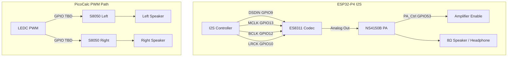

# Audio Design and Implementation Guide

## Executive summary

The ESP32-P4 PicoCalc has two audio output paths. The Waveshare ESP32-P4-WIFI6 board provides an onboard ES8311 low-power mono audio codec connected via I2S, plus an NS4150B Class-D power amplifier driving an 8Ω 2W speaker or 3.5mm headphone jack. The PicoCalc mainboard provides dual speakers driven by PWM through the same-position adapter (RP2040 GP26/GP27). This guide explains both paths, the I2S and PWM driver architectures, the pin assignments, and an implementation plan that starts with the Waveshare ES8311 path for quality audio and later adds the PicoCalc PWM path for parity.

## Problem statement and scope

### Problem

A PicoCalc needs audio output for:

- Key click feedback.
- Status beeps and alerts.
- Terminal bell.
- Music or sound playback for applications.

The original PicoCalc uses PWM-driven speakers, which produces basic audio but with limited quality. The Waveshare ES8311 codec path provides much better audio quality with I2S digital-to-analog conversion.

### Scope

In scope:

1. ES8311 codec initialization via I2C.
2. I2S bus configuration for audio data output.
3. NS4150B power amplifier enable control.
4. Basic tone and beep generation.
5. WAV file playback from SD card.
6. PicoCalc PWM speaker path via same-position adapter.
7. Audio console commands.

Out of scope for the first implementation:

1. MP3/AAC software decoding (requires additional codec libraries).
2. Microphone input (ES8311 ADC path, MEMS microphone).
3. Volume control beyond basic on/off and gain levels.
4. Audio mixing or multi-source playback.
5. Bluetooth audio.

## Current-state analysis

### Waveshare ES8311 audio path

The Waveshare ESP32-P4-WIFI6 board integrates:

- **ES8311**: Low-power mono audio codec with I2S/PCM interface, I2C control, and headphone amplifier.
- **NS4150B**: Class-D audio power amplifier (8Ω 2W speaker output).
- **MX1.25 2P speaker connector**: For external 8Ω speaker.
- **3.5mm audio jack**: For headphones.
- **SMD MEMS microphone**: Connected to ES8311 ADC input.

The I2S and I2C pin assignments are:

| Signal | ESP32-P4 GPIO | Direction | Description |
|---|---|---|---|
| MCLK | GPIO13 | Output | Master clock to ES8311 |
| SCLK (BCLK) | GPIO12 | Output | Serial bit clock |
| LRCK (WS) | GPIO10 | Output | Left/right word select |
| DSDIN (DOUT) | GPIO9 | Output | Audio data from ESP32-P4 to ES8311 DAC |
| ASDOUT (DIN) | GPIO11 | Input | Audio data from ES8311 ADC to ESP32-P4 |
| PA_Ctrl | GPIO53 | Output | NS4150B amplifier enable (active high) |

The ES8311 I2C address is `0x18`. The I2C bus uses the Waveshare default pins:

| Signal | ESP32-P4 GPIO |
|---|---|
| SDA | GPIO7 |
| SCL | GPIO8 |

**Important note:** The keyboard I2C bus uses GPIO50/GPIO49 (same-position adapter). The ES8311 uses the Waveshare onboard I2C bus on GPIO7/GPIO8. These are separate I2C buses.

### PicoCalc PWM speaker path

The original PicoCalc has dual speakers driven by PWM:

| Signal | RP2040 GPIO | Pico Physical Pin |
|---|---|---|
| Speaker Left | GP26 | Pin 31 |
| Speaker Right | GP27 | Pin 30 |

The PicoCalc V2.0 schematic shows:

- S8050 NPN transistor amplifier per speaker channel.
- PWM source at approximately 1.6 kHz low-pass filtered.
- Output power: 0.5W per channel at 8Ω.

With the same-position adapter, physical pins 30 and 31 map to ESP32-P4 GPIOs that need discovery. The ESP32-P4 LEDC (LED PWM Controller) peripheral can generate PWM signals suitable for audio output.

### ESP32-P4 I2S peripheral

The ESP32-P4 has one I2S peripheral. Key features:

- Supports I2S, PCM, TDM, and PDM modes.
- Configurable clock and data pin routing via GPIO matrix.
- DMA-capable with multiple buffer slots.
- Master or slave mode.
- Supports 8/16/24/32-bit data widths.

The ESP-IDF I2S driver provides:

```c
#include "driver/i2s_std.h"

i2s_chan_handle_t tx_handle;
i2s_chan_handle_t rx_handle;

i2s_chan_config_t chan_cfg = I2S_CHANNEL_DEFAULT_CONFIG(I2S_NUM_0, I2S_ROLE_MASTER);
i2s_new_channel(&chan_cfg, &tx_handle, &rx_handle);

i2s_std_config_t std_cfg = {
    .clk_cfg = I2S_STD_CLK_DEFAULT_CONFIG(44100),
    .slot_cfg = I2S_STD_PHILIPS_SLOT_DEFAULT_CONFIG(I2S_DATA_BIT_WIDTH_16BIT, I2S_SLOT_MODE_STEREO),
    .gpio_cfg = {
        .mclk = GPIO13,
        .bclk = GPIO12,
        .ws = GPIO10,
        .dout = GPIO9,
        .din = GPIO11,
        .invert_flags = {0},
    },
};
i2s_channel_init_std_mode(tx_handle, &std_cfg);
```

### ES8311 codec driver

Espressif provides an ES8311 component via the IDF Component Manager:

```text
idf.py add-dependency "espressif/es8311^1.0"
```

The component handles:

- I2C register write for ES8311 initialization.
- Clock configuration (MCLK/BCLK/LRCK ratio).
- DAC and ADC enable.
- Gain and volume control.
- Headphone and speaker output routing.

### Audio signal path diagram



## Gap analysis

### Gaps

1. No I2S initialization code in `0099`.
2. No ES8311 codec initialization in `0099`.
3. No audio output code in `0099`.
4. The Waveshare I2C bus (GPIO7/GPIO8) is not initialized in `0099`.
5. The PicoCalc PWM speaker GPIO mapping is unknown.
6. No audio console commands exist.

### What we have

- Known I2S and I2C pin assignments for the Waveshare ES8311 path.
- ESP-IDF I2S driver documentation in `sources/`.
- ES8311 IDF component available.
- Waveshare example code with ES8311 initialization (referenced in `sources/`).
- Keyboard I2C bus working on GPIO50/GPIO49 (separate bus).

## Proposed architecture

### Audio output API sketch

```c
#pragma once

#include <stddef.h>
#include <stdint.h>
#include "esp_err.h"

typedef enum {
    AUDIO_PATH_ES8311,   // Waveshare onboard codec
    AUDIO_PATH_PWM,      // PicoCalc PWM speakers
} audio_path_t;

typedef struct {
    audio_path_t path;
    int sample_rate;
    int bits_per_sample;
    int volume;           // 0-100
    bool initialized;
} audio_config_t;

esp_err_t audio_init(const audio_config_t *config);
esp_err_t audio_deinit(void);
esp_err_t audio_write(const int16_t *samples, size_t count, TickType_t timeout);
esp_err_t audio_set_volume(int volume);
esp_err_t audio_set_sample_rate(int sample_rate);
esp_err_t audio_play_tone(int frequency_hz, int duration_ms);
esp_err_t audio_play_beep(void);
```

### Console commands

```text
audio init [es8311|pwm]
audio tone <freq_hz> <duration_ms>
audio beep
audio volume <0-100>
audio deinit
audio play <wav_file_path>
```

## Implementation phases

### Phase 1: I2C bus for ES8311

Initialize the Waveshare onboard I2C bus (GPIO7/GPIO8) and detect the ES8311 at address `0x18`.

Steps:

1. Add I2C master bus configuration for GPIO7/GPIO8.
2. Scan the bus for devices.
3. Verify ES8311 presence at `0x18`.
4. Add `audio init es8311` console command.

Acceptance criteria:

- I2C scan finds ES8311 at `0x18`.
- No conflict with keyboard I2C bus on GPIO50/GPIO49.

### Phase 2: ES8311 codec initialization and I2S output

Initialize the I2S bus and ES8311 codec, then produce a test tone.

Steps:

1. Add ES8311 IDF component dependency.
2. Configure I2S in standard Philips mode, 16-bit stereo, 44100 Hz.
3. Initialize ES8311 via I2C (clock config, DAC enable, output routing).
4. Enable NS4150B amplifier via GPIO53.
5. Generate a 440 Hz sine wave in a buffer.
6. Write sine wave data to I2S and verify audio output.

Acceptance criteria:

- A 440 Hz tone is audible from the speaker or headphone jack.
- No I2S underrun errors.
- LCD and keyboard continue to function.

### Phase 3: Audio utilities

Add tone generation, beep, and volume control.

Steps:

1. Implement `audio_play_tone()` with a sine wave generator.
2. Implement `audio_play_beep()` as a short 800 Hz tone.
3. Implement `audio_set_volume()` by adjusting ES8311 DAC gain.
4. Add all `audio` console commands.

### Phase 4: WAV file playback

Add simple WAV file playback from SD card.

Steps:

1. Parse WAV file header (RIFF, fmt, data chunks).
2. Read PCM data from file.
3. Write PCM data to I2S in chunks.
4. Support 8-bit and 16-bit mono/stereo formats.
5. Add `audio play <path>` command.

Acceptance criteria:

- `audio play /sdmmc/test.wav` plays a WAV file with audible output.
- No buffer underruns at 44100 Hz 16-bit stereo.
- LCD and keyboard remain responsive during playback.

### Phase 5: PicoCalc PWM speaker path (optional)

Discover the PicoCalc PWM speaker GPIOs and implement LEDC PWM audio.

Steps:

1. Discover ESP32-P4 GPIOs for PicoCalc speaker pins (same-position adapter).
2. Configure LEDC channels for PWM output at audio-appropriate frequencies.
3. Implement delta-sigma or PWM audio generation.
4. Add `audio init pwm` command.

Pseudocode for PWM audio output:

```c
void pwm_audio_write(const int16_t *samples, size_t count) {
    for (size_t i = 0; i < count; i++) {
        // Convert 16-bit PCM to duty cycle (0-100%)
        uint32_t duty = (samples[i] + 32768) * 100 / 65536;
        ledc_set_duty(LEDC_LOW_SPEED_MODE, LEDC_CHANNEL_0, duty);
        ledc_update_duty(LEDC_LOW_SPEED_MODE, LEDC_CHANNEL_0);
        // Wait for next sample period
        delay_us(1000000 / sample_rate);
    }
}
```

**Note:** PWM audio quality is significantly lower than I2S/ES8311 audio. The PicoCalc PWM path should be treated as a fallback or parity feature, not the primary audio path.

## Testing strategy

### I2C detection test

```text
audio init es8311
```

Verify I2C scan finds ES8311 at `0x18`.

### Tone test

```text
audio tone 440 1000
audio tone 800 500
audio beep
```

Audibly verify tone output at different frequencies.

### Volume test

```text
audio volume 50
audio tone 440 1000
audio volume 100
audio tone 440 1000
audio volume 0
audio tone 440 1000
```

Verify volume changes are audible.

### WAV playback test

```text
audio play /sdmmc/test.wav
```

Play a known WAV file and verify quality.

### Conflict test

1. Initialize LCD, keyboard, and audio simultaneously.
2. Run `lcd perf full` to check LCD performance.
3. Run `kbd poll 10` to check keyboard responsiveness.
4. Run `audio tone 440 2000` to check audio output.
5. Verify no crashes, hangs, or bus conflicts.

### Visual validation

Not required for audio. Audible confirmation is sufficient.

## Risks and mitigations

### Risk: I2C bus conflict between keyboard and ES8311

Mitigation: they are on separate I2C buses (GPIO50/49 vs GPIO7/8). No conflict.

### Risk: I2S DMA buffer underruns during heavy LCD SPI traffic

Mitigation: use large enough DMA buffers (e.g., 8 × 1 KiB). The I2S and SPI2 peripherals are independent. Monitor underrun count and adjust buffer sizes if needed.

### Risk: GPIO53 (PA enable) shared with other functions

Mitigation: check that GPIO53 is not used for any other purpose in the `0099` firmware. On the DEV-KIT variant, GPIO53 appears at header pin 27 and is noted as the speaker PA enable pin.

### Risk: PicoCalc PWM speaker GPIOs unknown

Mitigation: defer PWM audio implementation until the same-position adapter mapping is discovered for pins 30 and 31.

### Risk: ES8311 initialization sequence is complex

Mitigation: use the Espressif ES8311 IDF component, which handles the initialization sequence. Do not write a custom ES8311 driver.

## ESP-IDF driver reference

### I2S Standard Mode API

```c
#include "driver/i2s_std.h"

i2s_chan_handle_t tx_chan;

i2s_chan_config_t chan_cfg = I2S_CHANNEL_DEFAULT_CONFIG(I2S_NUM_0, I2S_ROLE_MASTER);
i2s_new_channel(&chan_cfg, &tx_chan, NULL);

i2s_std_config_t std_cfg = {
    .clk_cfg = I2S_STD_CLK_DEFAULT_CONFIG(44100),
    .slot_cfg = I2S_STD_PHILIPS_SLOT_DEFAULT_CONFIG(I2S_DATA_BIT_WIDTH_16BIT, I2S_SLOT_MODE_STEREO),
    .gpio_cfg = {
        .mclk = 13,
        .bclk = 12,
        .ws = 10,
        .dout = 9,
        .din = 11,
    },
};
i2s_channel_init_std_mode(tx_chan, &std_cfg);
i2s_channel_enable(tx_chan);
```

### I2S Write

```c
size_t bytes_written;
i2s_channel_write(tx_chan, samples, num_samples * 2, &bytes_written, pdMS_TO_TICKS(100));
```

### LEDC PWM for PWM audio

```c
#include "driver/ledc.h"

ledc_timer_config_t timer_cfg = {
    .speed_mode = LEDC_LOW_SPEED_MODE,
    .duty_resolution = LEDC_TIMER_10_BIT,
    .timer_num = LEDC_TIMER_0,
    .freq_hz = 80000,  // well above audio, for delta-sigma modulation
    .clk_cfg = LEDC_AUTO_CLK,
};
ledc_timer_config(&timer_cfg);

ledc_channel_config_t chan_cfg = {
    .gpio_num = SPEAKER_GPIO,
    .speed_mode = LEDC_LOW_SPEED_MODE,
    .channel = LEDC_CHANNEL_0,
    .intr_type = LEDC_INTR_DISABLE,
    .timer_sel = LEDC_TIMER_0,
    .duty = 0,
    .hpoint = 0,
};
ledc_channel_config(&chan_cfg);
```

## Implementation checklist for the intern

1. Read this document from beginning to end.
2. Read `0099-esp32-p4-picocalc-display-keyboard/main/app_main.c` for existing SPI2/I2C usage.
3. Read the ESP32-P4 I2S reference in `sources/esp32-p4-i2s.md`.
4. Read the Waveshare I2S audio example in `sources/waveshare-esp32-p4-wifi6-idf-setup.md` (I2S section).
5. Read the ES8311 datasheet reference in `sources/`.
6. Add I2C bus initialization for GPIO7/GPIO8.
7. Add ES8311 IDF component dependency.
8. Add I2S initialization for ES8311 path.
9. Add tone generation and beep function.
10. Add audio console commands.
11. Add WAV file playback.
12. Update the ticket diary after each phase.

## File references

```text
/home/manuel/workspaces/2025-12-21/echo-base-documentation/esp32-s3-m5/0099-esp32-p4-picocalc-display-keyboard/main/app_main.c
/home/manuel/workspaces/2025-12-21/echo-base-documentation/esp32-s3-m5/0099-esp32-p4-picocalc-display-keyboard/main/picocalc_keyboard.h
/home/manuel/workspaces/2025-12-21/echo-base-documentation/esp32-s3-m5/0099-esp32-p4-picocalc-display-keyboard/main/picocalc_keyboard.c
```

Research sources stored in `sources/`:
- `esp32-p4-i2s.md` — ESP-IDF I2S driver reference for ESP32-P4
- `waveshare-esp32-p4-wifi6-idf-setup.md` — Waveshare ESP-IDF setup guide with ES8311 I2S example
- `pipapo-picocalc.md` — PicoCalc hardware reference with PWM speaker pin mapping
- `picocalc-specs.md` — PicoCalc mainboard V2.0 schematic with audio circuit

## Open questions

1. What are the ESP32-P4 GPIO numbers for the PicoCalc PWM speaker pins (same-position adapter mapping for physical pins 30 and 31)?
2. Does the ES8311 I2C bus (GPIO7/8) conflict with any existing peripheral in `0099`?
3. What is the maximum sample rate achievable without I2S underruns while LCD SPI2 is active?
4. Is the MEMS microphone path needed for the PicoCalc use case?
5. Should the ES8311 headphone jack and speaker output be independently controllable?

## References

- ESP-IDF I2S Driver: https://docs.espressif.com/projects/esp-idf/en/stable/esp32p4/api-reference/peripherals/i2s.html
- ES8311 IDF Component: https://components.espressif.com/component/espressif/es8311
- ES8311 Datasheet: https://files.waveshare.com/wiki/common/ES8311.DS.pdf
- ES8311 User Guide: https://files.waveshare.com/wiki/common/ES8311.user.Guide.pdf
- Waveshare ESP32-P4-WIFI6 I2S Demo: https://docs.waveshare.com/ESP32-P4-WIFI6-Touch-LCD-X/Development-Environment-Setup-IDF
