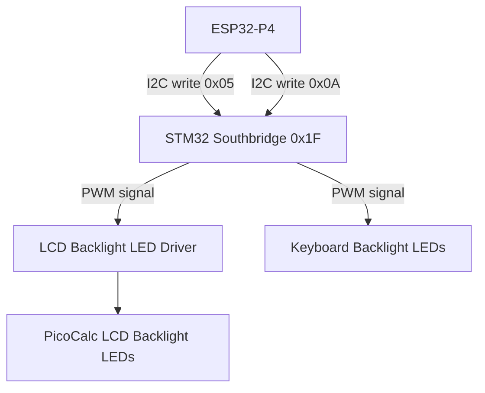

# LCD Backlight Control Design and Implementation Guide

## Executive summary

The PicoCalc LCD backlight is controlled through the STM32 southbridge co-processor, not through a direct GPIO PWM signal. The STM32 exposes a backlight brightness register at I2C address `0x1F`, register `0x05`, accepting values from 0 to 255. The ESP32-P4 communicates with the STM32 on the same I2C bus used for keyboard polling (GPIO50/GPIO49). This guide explains the backlight control path, the I2C register interface, and an implementation plan that adds backlight brightness control and keyboard backlight control to the `0099` firmware.

This is a simpler peripheral than it might first appear, because the hardware PWM and LED driver are handled entirely by the STM32. The ESP32-P4 only needs to write a single I2C register byte.

## Problem statement and scope

### Problem

A PicoCalc needs LCD backlight control for:

- Adjusting screen brightness for indoor vs outdoor use.
- Dimming the display to save battery.
- Turning off the backlight during idle or sleep.
- Providing keyboard backlight control if the PicoCalc hardware supports it.

Without backlight control, the display is always at full brightness, which wastes battery and may be too bright in dark environments.

### Scope

In scope:

1. Reading and writing the STM32 southbridge backlight register `0x05`.
2. Reading and writing the keyboard backlight register `0x0A`.
3. Console commands for backlight control.
4. Backlight dimming for idle or battery-saving scenarios.
5. Integration with the existing keyboard I2C driver.

Out of scope for the first implementation:

1. Direct GPIO PWM backlight control (not used in the PicoCalc).
2. Automatic ambient light sensing.
3. Smooth fade-in/fade-out animations.
4. Display-off state that also disables LCD SPI output.

## Current-state analysis

### PicoCalc backlight architecture

The PicoCalc LCD backlight is driven by a PWM-controlled LED driver circuit on the PicoCalc mainboard. On the original RP2040 PicoCalc, the backlight PWM was generated by RP2040 GP12. On the newer PicoCalc hardware with the STM32 southbridge, the STM32 generates the backlight PWM signal and exposes brightness control via I2C register.

This is a critical architectural insight: **the ESP32-P4 does not need to generate a PWM signal for the backlight.** It only needs to write a single byte to the STM32 I2C register `0x05`.

### STM32 southbridge I2C register map (backlight-related)

The STM32 southbridge is at I2C address `0x1F`, on the same bus as the keyboard (GPIO50/GPIO49 on ESP32-P4).

| Register | Name | R/W | Description |
|---|---|---|---|
| `0x05` | REG_ID_BKL | R/W | LCD Backlight brightness (0-255) |
| `0x0A` | REG_ID_BK2 | R/W | Keyboard Backlight brightness (0-255) |

Register `0x05` controls the LCD backlight intensity. A value of 0 turns the backlight off, and 255 sets it to maximum brightness. The mapping between register value and perceived brightness may not be linear, because LED brightness perception is approximately logarithmic.

Register `0x0A` controls the keyboard backlight, if the PicoCalc hardware has keyboard backlight LEDs. This may not be present on all PicoCalc versions.

### Existing keyboard driver

The `0099` firmware already has an I2C driver for the STM32 southbridge:

```c
#define PICOCALC_KBD_I2C_SDA_GPIO      50
#define PICOCALC_KBD_I2C_SCL_GPIO      49
#define PICOCALC_KBD_I2C_SPEED_HZ      10000
#define PICOCALC_KBD_I2C_ADDR          0x1F
```

The driver provides `picocalc_keyboard_read_register()`, which reads from any STM32 register. For backlight control, a write function is also needed.

```c
esp_err_t picocalc_keyboard_read_register(uint8_t reg, uint8_t *dst, size_t len);
```

The driver does not yet provide a write function, but the underlying I2C master bus API supports writes.

### Backlight signal path diagram



## Gap analysis

### Gaps

1. No backlight control code exists in `0099`.
2. The existing keyboard driver has `read_register()` but not `write_register()`.
3. The register `0x05` value-to-brightness mapping is not yet validated (linear vs gamma-corrected).
4. The keyboard backlight register `0x0A` may or may not control real hardware.
5. No backlight console commands exist.

### What we have

- Working I2C bus to STM32 at `0x1F`.
- Working `picocalc_keyboard_read_register()` that can read the current backlight value.
- PicoCalc STM32 firmware source for reference at https://github.com/clockworkpi/PicoCalc/tree/master/Code/picocalc_keyboard.
- PiPAPo reference documentation confirming register `0x05` and `0x0A`.

## Proposed architecture

### Public API sketch

```c
#pragma once

#include <stdint.h>
#include "esp_err.h"

#define BACKLIGHT_MAX 255
#define BACKLIGHT_MIN 0

esp_err_t backlight_init(void);
esp_err_t backlight_set(uint8_t level);       // 0-255
esp_err_t backlight_get(uint8_t *level);
esp_err_t backlight_set_percentage(uint8_t pct); // 0-100
esp_err_t keyboard_backlight_set(uint8_t level); // 0-255
esp_err_t keyboard_backlight_get(uint8_t *level);
```

### Console commands

```text
backlight status
backlight set <0-255>
backlight percent <0-100>
backlight off
backlight max
backlight kbd <0-255>
backlight kbd off
```

### Southbridge register write function

Add a write function alongside the existing read function:

```c
esp_err_t southbridge_write_register(uint8_t reg, uint8_t value) {
    uint8_t buf[2] = {reg, value};
    return i2c_master_transmit(s_i2c_dev_handle, buf, 2, -1);
}
```

Or if the I2C API uses separate write-then-read:

```c
esp_err_t southbridge_write_register(uint8_t reg, uint8_t value) {
    // Write register address byte, then value byte
    esp_err_t err = i2c_master_transmit(s_i2c_dev_handle, &value, 1, -1);
    // Or use i2c_master_write_reg_device() equivalent
    return err;
}
```

The exact ESP-IDF I2C master API call depends on the driver version. The new I2C master driver in ESP-IDF v5.4.2 uses `i2c_master_transmit()` for writes.

## Implementation phases

### Phase 1: Add southbridge write function

Extend the keyboard driver (or create a separate southbridge driver) with a register write function.

Steps:

1. Add `picocalc_keyboard_write_register()` or a general `southbridge_write_register()` function.
2. Test by writing a known value to register `0x05` and reading it back.

Acceptance criteria:

- Write succeeds without I2C error.
- Read-back returns the written value.

### Phase 2: LCD backlight control

Implement `backlight_set()` and `backlight_get()`.

Steps:

1. Write to register `0x05` with values 0, 128, 255.
2. Visually verify that the LCD brightness changes.
3. Document the perceived brightness curve (linear, logarithmic, or stepped).

Acceptance criteria:

- `backlight set 0` turns the backlight off (dark screen).
- `backlight set 255` sets maximum brightness.
- `backlight set 128` produces a visible intermediate brightness.
- Backlight changes are visible on the PicoCalc LCD.

**WARNING:** Setting backlight to 0 makes the screen completely dark. Ensure there is a way to restore brightness without seeing the screen (e.g., a console command that can be typed blind, or a timeout that restores brightness after N seconds).

### Phase 3: Keyboard backlight control (if hardware supports it)

Attempt to control keyboard backlight via register `0x0A`.

Steps:

1. Write to register `0x0A` with values 0 and 255.
2. Visually check if keyboard LEDs respond.
3. If no hardware response, document that keyboard backlight is not present or not wired.

### Phase 4: Backlight automation

Add idle dimming and battery-aware brightness.

Steps:

1. Track time since last keyboard or display activity.
2. After an idle timeout (e.g., 60 seconds), dim backlight to 30%.
3. After a longer timeout (e.g., 300 seconds), turn backlight off.
4. On any keyboard input, restore backlight to previous level.
5. When battery is low (from `battery_read()`), cap maximum brightness at 70%.

Pseudocode:

```c
void backlight_idle_check(void) {
    uint32_t now = xTaskGetTickCount();
    uint32_t idle_ms = (now - s_last_activity_tick) * portTICK_PERIOD_MS;
    
    if (idle_ms > 300000 && s_backlight_level > 0) {  // 5 minutes
        backlight_set(0);
        s_backlight_dimmed = true;
    } else if (idle_ms > 60000 && s_backlight_level > 76) {  // 1 minute
        backlight_set(76);  // ~30%
        s_backlight_dimmed = true;
    }
}

void backlight_on_activity(void) {
    if (s_backlight_dimmed) {
        backlight_set(s_backlight_saved_level);
        s_backlight_dimmed = false;
    }
    s_last_activity_tick = xTaskGetTickCount();
}
```

## Testing strategy

### Register write test

```text
backlight set 255
backlight status
backlight set 128
backlight status
backlight set 0
backlight status
backlight set 255
```

Verify that each write succeeds and read-back matches.

### Visual brightness test

Set backlight to different levels and observe the PicoCalc LCD:

- 0: completely dark
- 64: dim
- 128: medium
- 192: bright
- 255: maximum

**Human visual confirmation is required.** I2C register success does not guarantee that the backlight LED is actually changing. The operator must confirm visible brightness changes.

### Keyboard backlight test (if applicable)

```text
backlight kbd 255
backlight kbd 0
```

### Idle dimming test

1. Set backlight to 255.
2. Wait 60 seconds without touching the keyboard.
3. Verify that backlight dims to approximately 30%.
4. Press any key.
5. Verify that backlight restores to 255.

## Risks and mitigations

### Risk: backlight register 0 causes completely dark screen

Mitigation: add a safety timeout that restores backlight to a safe level after 10 seconds if no further commands are received. Or require a confirmation prompt before setting backlight to 0.

### Risk: register value is not a direct PWM duty cycle

Mitigation: test the perceived brightness curve experimentally. If the relationship is non-linear, apply a gamma correction lookup table in the API.

### Risk: keyboard backlight register has no effect

Mitigation: the PicoCalc may not have keyboard backlight LEDs. If register `0x0A` has no visible effect, document it as unsupported.

### Risk: I2C bus contention between keyboard polling and backlight writes

Mitigation: the keyboard polls every ~20 ms and backlight writes are rare. Add a mutex on the I2C bus if needed, or schedule backlight writes between keyboard polls.

## Implementation checklist for the intern

1. Read this document from beginning to end.
2. Read `0099-esp32-p4-picocalc-display-keyboard/main/picocalc_keyboard.h` and `picocalc_keyboard.c`.
3. Read the PicoCalc STM32 firmware source: https://github.com/clockworkpi/PicoCalc/tree/master/Code/picocalc_keyboard
4. Read the PiPAPo reference in `sources/pipapo-picocalc.md` (backlight register section).
5. Add a southbridge I2C register write function.
6. Add `backlight set`, `backlight status`, and `backlight off` commands.
7. Test brightness levels visually.
8. Optionally add keyboard backlight control.
9. Add idle dimming automation.
10. Update the ticket diary after each phase.

## File references

```text
/home/manuel/workspaces/2025-12-21/echo-base-documentation/esp32-s3-m5/0099-esp32-p4-picocalc-display-keyboard/main/picocalc_keyboard.h
/home/manuel/workspaces/2025-12-21/echo-base-documentation/esp32-s3-m5/0099-esp32-p4-picocalc-display-keyboard/main/picocalc_keyboard.c
/home/manuel/workspaces/2025-12-21/echo-base-documentation/esp32-s3-m5/0099-esp32-p4-picocalc-display-keyboard/main/app_main.c
```

Research sources stored in `sources/`:
- `esp32-p4-ledc.md` — ESP-IDF LEDC PWM driver reference (for reference only; not used for PicoCalc backlight)
- `pipapo-picocalc.md` — PicoCalc hardware reference with STM32 register map including backlight
- `picocalc-specs.md` — PicoCalc mainboard V2.0 schematic with backlight circuit
- `waveshare-esp32-p4-wifi6.md` — Waveshare board general documentation

## Open questions

1. What is the perceived brightness curve for register `0x05` values (linear, logarithmic, or stepped)?
2. Does the PicoCalc hardware have keyboard backlight LEDs controlled by register `0x0A`?
3. What happens if register `0x05` is set to 0 while the LCD is displaying content? Does the LCD retain its frame buffer, or does it lose display data?
4. Is there a minimum backlight level below which the backlight PWM becomes unstable?
5. Should the backlight automatically turn on when the device wakes from sleep?

## References

- PicoCalc STM32 Firmware Source: https://github.com/clockworkpi/PicoCalc/tree/master/Code/picocalc_keyboard
- PiPAPo PicoCalc Reference: https://github.com/toyoshim-i/PiPAPo/blob/main/docs/reference/picocalc.md
- ESP-IDF LEDC Driver: https://docs.espressif.com/projects/esp-idf/en/stable/esp32p4/api-reference/peripherals/ledc.html
