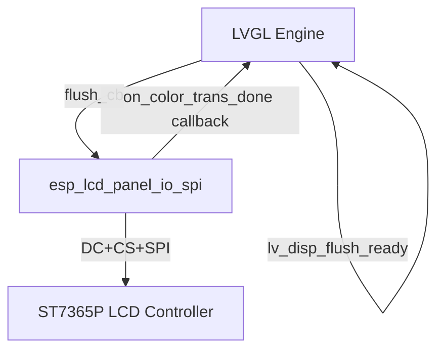
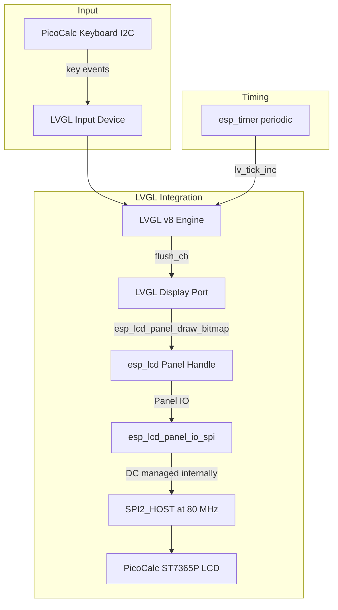

# LVGL Demo Design and Implementation Guide

## Executive summary

This guide investigates what it takes to run an LVGL demo on the ESP32-P4 PicoCalc with its 320×320 RGB565 SPI LCD. The PicoCalc display is driven by an ST7365P controller (ILI9488-compatible) connected through the same-position adapter at 80 MHz SPI using `SPI_CLK_SRC_SPLL`. The current `0099` firmware drives the LCD manually through `spi_master` with custom GPIO-controlled DC. LVGL requires a display driver that receives dirty-region flush callbacks from the LVGL engine and sends pixel data to the panel.

There are two viable integration paths:

1. **`esp_lcd` path** — use ESP-IDF's `esp_lcd_panel_io_spi` and an ILI9488 panel driver component. This is the officially recommended approach. It handles DC switching, SPI transaction queuing, and provides a callback-based `on_color_trans_done` notification that LVGL needs.
2. **Manual `spi_master` path** — adapt the existing `0099` LCD driver to implement an LVGL `flush_cb` that calls `lcd_set_window()` and `spi_device_polling_transmit()` or the queued transfer path.

This guide recommends starting with the `esp_lcd` path because it is the path used by the official ESP-IDF `spi_lcd_touch` LVGL example, it handles DC switching internally, and it is supported by the `esp_lvgl_adapter` component from ESP-IoT-Solution. It also explains exactly what must change from the existing M5Stack/Cardputer LVGL projects in this repository, which use M5GFX (LovyanGFX) as the display backend — a dependency that cannot carry over to the ESP32-P4 PicoCalc.

## Problem statement and scope

### Problem

The PicoCalc needs a GUI framework for building interactive interfaces: menus, dialogs, text editors, and eventually a full terminal emulator. LVGL is the most widely used open-source embedded GUI library, and it has first-class ESP-IDF support. Running an LVGL demo on the PicoCalc proves that the display driver stack is complete enough for production UI work.

### Scope

In scope:

1. Evaluating the two LVGL display driver integration paths.
2. Identifying the ILI9488 panel driver component for `esp_lcd`.
3. Planning the SPI bus initialization, panel IO configuration, and panel device configuration for the PicoCalc LCD.
4. Planning LVGL initialization, display buffer allocation, and tick timer setup.
5. Adding keyboard input as an LVGL input device.
6. Identifying what can be reused from the existing M5Stack/Cardputer LVGL projects.
7. Implementing a minimal LVGL demo that draws widgets on the PicoCalc screen.

Out of scope for the first demo:

1. Full terminal emulator.
2. Touch input (the PicoCalc has no touch screen).
3. SD card file browser.
4. Custom fonts or themes.
5. MIPI-DSI display path.
6. LVGL v9 migration (existing projects use v8; start with v8 for compatibility).

## Current-state analysis

### PicoCalc LCD hardware

The PicoCalc LCD is a 4-inch 320×320 IPS TFT display with an ST7365P controller, marketed as ILI9488-compatible. The key hardware facts:

- **Interface**: SPI (TX-only, no MISO needed for display output).
- **Pixel format**: RGB565 (16-bit, 65K colors).
- **SPI bus**: SPI2_HOST on ESP32-P4.
- **Clock**: 80 MHz actual, using `SPI_CLK_SRC_SPLL`.
- **Pin mapping** (same-position adapter):

| Signal | ESP32-P4 GPIO |
|---|---|
| SCK | GPIO3 |
| MOSI | GPIO2 |
| CS | GPIO7 |
| DC | GPIO24 |
| RST | GPIO25 |

- **Init sequence**: 18-step sequence including vendor command unlock (`0xF0` with keys `0xC3` and `0x96`), power control, gamma correction, and display inversion. Without the vendor unlock, `COLMOD 0x55` (RGB565) is silently ignored.
- **MADCTL**: `0x48` (MX | BGR) — MX mirrors for panel orientation, BGR for the ST7365P's native subpixel order.
- **Display inversion on** (`0x21`) is required for correct color polarity.

### Existing `0099` LCD driver

The current firmware drives the LCD through manual `spi_master` calls:

```c
// Constants
#define LCD_HOST               SPI2_HOST
#define LCD_PIN_SCK            3
#define LCD_PIN_MOSI           2
#define LCD_PIN_CS             7
#define LCD_PIN_DC             24
#define LCD_PIN_RST            25
#define LCD_DEFAULT_SPI_HZ     (80 * 1000 * 1000)
#define LCD_SPI_CLK_SRC        SPI_CLK_SRC_SPLL
#define LCD_SPI_MAX_TRANSFER_SZ (32 * 1024)
```

The driver uses `spi_device_polling_transmit()` for synchronous transfers and `spi_device_queue_trans()` + `spi_device_get_trans_result()` for queued transfers. It manually toggles the DC GPIO between command and data phases.

This manual approach works for benchmarks, but it requires the caller to manage DC state and window sequencing. LVGL expects a simpler contract: it provides a dirty rectangle and a pixel buffer, and the flush callback sends it to the display and calls `lv_disp_flush_ready()` when done.

### Existing M5Stack/Cardputer LVGL projects

This repository contains several LVGL projects for M5Stack ESP32-S3 devices:

**0025-cardputer-lvgl-demo**: Basic LVGL demo on M5Stack Cardputer. Uses:
- LVGL v8.3.0 (via `idf_component.yml`: `lvgl/lvgl: "^8.3.0"`).
- M5GFX (LovyanGFX) as the display backend.
- A custom `lvgl_port_m5gfx` module that implements `flush_cb` using M5GFX's `setAddrWindow()` + `writePixels()`.

**0047-cardputer-adv-lvgl-chain-encoder-list**: Advanced LVGL application with:
- Multiple demo screens (file browser, system monitor, pomodoro, split console).
- Keyboard input as LVGL input device.
- M5GFX display port.
- SD card FatFS integration.

The key `lvgl_port_m5gfx` module (from 0047) implements the LVGL v8 display driver pattern:

```c
// Flush callback: LVGL calls this with a dirty rectangle
static void flush_cb(lv_disp_drv_t *disp, const lv_area_t *area, lv_color_t *color_p) {
    auto *gfx_ptr = static_cast<m5gfx::M5GFX *>(disp->user_data);
    m5gfx::M5GFX &gfx = *gfx_ptr;
    const int w = (area->x2 - area->x1 + 1);
    const int h = (area->y2 - area->y1 + 1);
    gfx.startWrite();
    gfx.setAddrWindow(area->x1, area->y1, w, h);
    // Chunked pixel write
    gfx.writePixels(src, chunk);
    gfx.endWrite();
    lv_disp_flush_ready(disp);  // Tell LVGL the flush is complete
}

// Initialization
bool lvgl_port_m5gfx_init(m5gfx::M5GFX &display, const LvglM5gfxConfig &cfg) {
    lv_init();
    // Allocate draw buffers (DMA-capable)
    lv_color_t *buf1 = alloc_draw_buf(buf_bytes);
    lv_color_t *buf2 = cfg.double_buffer ? alloc_draw_buf(buf_bytes) : nullptr;
    lv_disp_draw_buf_init(&draw_buf, buf1, buf2, buf_pixels);
    // Configure display driver
    lv_disp_drv_init(&disp_drv);
    disp_drv.hor_res = w;
    disp_drv.ver_res = h;
    disp_drv.flush_cb = flush_cb;
    disp_drv.draw_buf = &draw_buf;
    disp_drv.user_data = &display;
    lv_disp_drv_register(&disp_drv);
    // Start tick timer
    esp_timer_create(&args, &s_tick_timer);
    esp_timer_start_periodic(s_tick_timer, tick_ms * 1000);
}
```

**What can be reused:**

- The LVGL initialization pattern (tick timer, display buffer allocation, driver registration).
- The general concept of a `lvgl_port_*` module that wraps the display backend.
- The keyboard-as-input-device concept from 0047.
- The component dependency declaration (`lvgl/lvgl: "^8.3.0"`).

**What cannot be reused:**

- M5GFX/LovyanGFX — it is an M5Stack-specific display library that does not support the ST7365P/ILI9488 over raw SPI on ESP32-P4. The PicoCalc uses a completely different display controller and SPI bus setup.
- The `lvgl_port_m5gfx` module directly — it calls M5GFX methods. A new `lvgl_port_picocalc` module must be written.
- The M5GFX component directory reference in `CMakeLists.txt` (`EXTRA_COMPONENT_DIRS`).

### ESP-IDF `esp_lcd` component and LVGL

ESP-IDF provides the `esp_lcd` component, which abstracts LCD panel communication into two layers:

1. **Panel IO** — handles the transport (SPI, I2C, parallel, MIPI-DSI). For SPI, `esp_lcd_new_panel_io_spi()` creates a panel IO handle that manages DC switching, CS, and SPI transactions internally.
2. **Panel Device** — handles the controller-specific initialization and commands. ESP-IDF includes built-in drivers for ST7789 and NT35510. Third-party components exist for ILI9488, ILI9341, and others.

The official `spi_lcd_touch` example demonstrates LVGL integration with `esp_lcd`:



### The `esp_lvgl_adapter` component

The ESP-IoT-Solution project provides `esp_lvgl_adapter`, which unifies display registration, tearing control, thread-safe LVGL access, and optional integration with filesystem, image decoding, and FreeType fonts. It supports LVGL v8 and v9.

Features:

- Unified display registration for MIPI-DSI / RGB / QSPI / SPI / I2C / I80 interfaces.
- Tearing effect (TE) signal handling.
- Thread-safe LVGL access via mutex.
- Integration with `esp_lcd` panel handles.
- LVGL task management (dedicated FreeRTOS task or manual loop).

For the first demo, `esp_lvgl_adapter` is optional but recommended if it simplifies the integration. The manual approach (writing the `flush_cb` directly) is also viable and more educational.

### ILI9488 panel driver component

The PicoCalc LCD uses an ST7365P controller, which is ILI9488-compatible. The ESP Component Registry has an ILI9488 panel driver:

- **`atanisoft/esp_lcd_ili9488`** (v1.1.1): Provides `esp_lcd_new_panel_ili9488()` compatible with the `esp_lcd` panel API.
- **`codewitch-honey-crisis/esp_lcd_panel_ili9488`** (v0.1.1): Alternative ILI9488 driver.

The ST7365P vendor-specific unlock sequence (`0xF0` with `0xC3`, `0x96`) may or may not be included in these standard ILI9488 drivers. If the standard ILI9488 init sequence does not enable RGB565 mode correctly on the PicoCalc panel, a custom panel driver or a modified init sequence will be needed.

## Gap analysis

### Gaps

1. No `esp_lcd` panel IO or panel device configuration for the PicoCalc ST7365P/ILI9488 exists.
2. No LVGL initialization code for the PicoCalc exists.
3. The ST7365P vendor unlock sequence is not in standard ILI9488 drivers.
4. No LVGL keyboard input device driver for the PicoCalc STM32 southbridge exists.
5. M5GFX cannot be used on the PicoCalc — a new display backend is needed.
6. The LVGL display buffer allocation strategy for ESP32-P4 (internal DMA vs PSRAM) is not yet decided.
7. No `idf_component.yml` with LVGL dependency for the PicoCalc project exists.

### What we have

- Validated SPI2 bus at 80 MHz with `SPI_CLK_SRC_SPLL`.
- Complete pin mapping for the LCD (GPIO3/2/7/24/25).
- Working LCD init sequence (in `app_main.c`).
- Working keyboard I2C driver with key event polling.
- Existing LVGL projects (0025, 0047) as architectural reference.
- ESP-IDF `esp_lcd` SPI panel IO and panel device APIs.
- ILI9488 panel driver component available from the ESP Component Registry.
- `esp_lvgl_adapter` component available for simplified integration.

## Proposed architecture

### Option A: `esp_lcd` path (recommended for first demo)

Use ESP-IDF's `esp_lcd_panel_io_spi` + an ILI9488 panel driver + LVGL.



Steps:

1. Initialize SPI2 bus with `spi_bus_initialize()`.
2. Create panel IO with `esp_lcd_new_panel_io_spi()` — this handles DC GPIO switching internally.
3. Create panel device with the ILI9488 panel driver (or a custom ST7365P driver if needed).
4. Initialize LVGL with `lv_init()`.
5. Allocate display buffers (DMA-capable internal memory).
6. Register `flush_cb` that calls `esp_lcd_panel_draw_bitmap()`.
7. Start `esp_timer` for `lv_tick_inc()`.
8. Create an LVGL task or call `lv_task_handler()` in the main loop.
9. Add keyboard input device.

### Option B: Manual `spi_master` path

Adapt the existing `0099` LCD driver into an LVGL `flush_cb`.

Steps:

1. Keep the existing SPI2 bus and device initialization.
2. Write `flush_cb()` that:
   - Calls `lcd_set_window(area->x1, area->y1, area->x2, area->y2)`.
   - Sends pixel data using `spi_device_polling_transmit()` in 32 KiB chunks.
   - Calls `lv_disp_flush_ready()` when done.
3. This approach requires careful handling of the DC GPIO state, which the manual driver currently manages explicitly.

**Why Option A is preferred:** `esp_lcd_panel_io_spi` manages the DC GPIO internally, supports queued transactions, provides `on_color_trans_done` callbacks for asynchronous flush completion, and is the path used by all official ESP-IDF LVGL examples. The manual path works but requires more careful state management.

### Display buffer strategy

LVGL needs one or two draw buffers. For a 320×320 RGB565 display:

- Full frame: 320 × 320 × 2 = 204,800 bytes. Too large for internal DMA RAM.
- 40-line buffer: 320 × 40 × 2 = 25,600 bytes. Fits in internal DMA RAM. This is the same approach used in the Cardputer LVGL projects.
- Double-buffered 40-line: 2 × 25,600 = 51,200 bytes internal DMA RAM. Feasible on ESP32-P4 (768 KB L2MEM available).

For the first demo, use single-buffered 40 lines. Add double-buffering later for performance.

```c
#define LVGL_BUF_LINES 40
const uint32_t buf_pixels = 320 * LVGL_BUF_LINES;
const size_t buf_bytes = buf_pixels * sizeof(lv_color_t);  // 25,600 bytes

lv_color_t *buf1 = heap_caps_malloc(buf_bytes, MALLOC_CAP_DMA | MALLOC_CAP_INTERNAL);
```

### Keyboard input device

LVGL supports custom input devices. The PicoCalc keyboard (STM32 southbridge at I2C `0x1F`) can be registered as an LVGL `LV_INDEV_TYPE_KEYPAD` input device.

The input driver reads key events and maps them to LVGL key codes:

```c
static void keypad_read_cb(lv_indev_drv_t *drv, lv_indev_data_t *data) {
    picocalc_key_event_t event;
    esp_err_t err = picocalc_keyboard_poll_event(&event);
    if (err == ESP_OK && event.valid) {
        data->key = map_key_to_lvgl(event.key);
        data->state = (event.state == PICOCALC_KBD_STATE_PRESSED) ? LV_INDEV_STATE_PRESSED : LV_INDEV_STATE_RELEASED;
        data->continue_reading = true;  // more events may be pending
    } else {
        data->key = 0;
        data->state = LV_INDEV_STATE_RELEASED;
        data->continue_reading = false;
    }
}

static uint32_t map_key_to_lvgl(uint8_t key) {
    switch (key) {
        case 0xB5: return LV_KEY_UP;
        case 0xB6: return LV_KEY_DOWN;
        case 0xB7: return LV_KEY_RIGHT;
        case 0xB4: return LV_KEY_LEFT;
        case 0x0A: return LV_KEY_ENTER;
        case 0x08: return LV_KEY_BACKSPACE;
        case 0xB1: return LV_KEY_ESC;
        default:
            if (key >= 0x20 && key <= 0x7E) return key;  // printable ASCII
            return 0;
    }
}
```

### LVGL task pattern

Use a dedicated FreeRTOS task for LVGL:

```c
static void lvgl_task(void *arg) {
    while (1) {
        lv_task_handler();
        vTaskDelay(pdMS_TO_TICKS(2));  // ~500 Hz LVGL refresh
    }
}

xTaskCreatePinnedToCore(lvgl_task, "lvgl", 8192, NULL, 5, NULL, 1);
```

## Implementation phases

### Phase 1: Create a new firmware project

Create a new ESP-IDF project `0100-esp32-p4-picocalc-lvgl-demo` that starts from a clean `idf.py create-project` template.

Steps:

1. Create the project directory alongside `0099`.
2. Add `idf_component.yml` with LVGL and ILI9488 dependencies.
3. Add `sdkconfig.defaults` with the same LCD and keyboard settings as `0099`.
4. Verify the project builds before adding any LCD or LVGL code.

```yaml
# idf_component.yml
dependencies:
  idf:
    version: ">=5.4.0"
  lvgl/lvgl: "^8.3.0"
  atanisoft/esp_lcd_ili9488: "^1.1.1"
```

### Phase 2: Initialize `esp_lcd` panel IO and panel device

Set up the `esp_lcd` panel IO and device for the PicoCalc ST7365P/ILI9488 display.

```c
// SPI bus initialization
spi_bus_config_t buscfg = {
    .sclk_io_num = LCD_PIN_SCK,
    .mosi_io_num = LCD_PIN_MOSI,
    .miso_io_num = -1,
    .quadwp_io_num = -1,
    .quadhd_io_num = -1,
    .max_transfer_sz = LCD_SPI_MAX_TRANSFER_SZ,
};
ESP_ERROR_CHECK(spi_bus_initialize(LCD_HOST, &buscfg, SPI_CLK_SRC_SPLL));

// Panel IO initialization
esp_lcd_panel_io_handle_t io_handle = NULL;
esp_lcd_panel_io_spi_config_t io_config = {
    .dc_gpio_num = LCD_PIN_DC,
    .cs_gpio_num = LCD_PIN_CS,
    .pclk_hz = LCD_DEFAULT_SPI_HZ,
    .lcd_cmd_bits = 8,
    .lcd_param_bits = 8,
    .spi_mode = 0,
    .trans_queue_depth = 10,
    .on_color_trans_done = NULL,  // Will be set by LVGL adapter
    .user_ctx = NULL,
};
ESP_ERROR_CHECK(esp_lcd_new_panel_io_spi((esp_lcd_spi_bus_handle_t)LCD_HOST, &io_config, &io_handle));

// Panel device initialization (ILI9488)
esp_lcd_panel_dev_config_t panel_config = {
    .reset_gpio_num = LCD_PIN_RST,
    .rgb_ele_order = LCD_RGB_ELEMENT_ORDER_BGR,
    .bits_per_pixel = 16,
    .data_endian = LCD_RGB_DATA_ENDIAN_BIG,
};
esp_lcd_panel_handle_t panel_handle = NULL;
ESP_ERROR_CHECK(esp_lcd_new_panel_ili9488(io_handle, &panel_config, &panel_handle));

ESP_ERROR_CHECK(esp_lcd_panel_reset(panel_handle, -1));
ESP_ERROR_CHECK(esp_lcd_panel_init(panel_handle));
ESP_ERROR_CHECK(esp_lcd_panel_mirror(panel_handle, true, false));  // MADCTL MX
ESP_ERROR_CHECK(esp_lcd_panel_invert_color(panel_handle, true));   // Display inversion on
```

**Critical issue:** The standard ILI9488 init sequence may not include the ST7365P vendor unlock (`0xF0` + `0xC3`, `0x96`). If the panel does not display RGB565 correctly, a custom panel driver or a pre-init hook must add the vendor unlock before the standard ILI9488 init sequence.

### Phase 3: Initialize LVGL with `flush_cb`

Implement the LVGL display driver with a flush callback that uses `esp_lcd_panel_draw_bitmap()`.

```c
static lv_disp_draw_buf_t draw_buf;
static lv_disp_drv_t disp_drv;

static void flush_cb(lv_disp_drv_t *disp, const lv_area_t *area, lv_color_t *color_p) {
    esp_lcd_panel_handle_t panel = (esp_lcd_panel_handle_t)disp->user_data;
    const int w = area->x2 - area->x1 + 1;
    const int h = area->y2 - area->y1 + 1;
    esp_lcd_panel_draw_bitmap(panel, area->x1, area->y1, area->x2 + 1, area->y2 + 1, color_p);
    lv_disp_flush_ready(disp);
}

void lvgl_init(esp_lcd_panel_handle_t panel) {
    lv_init();

    // Allocate display buffer (40 lines, single-buffered)
    const uint32_t buf_pixels = 320 * 40;
    lv_color_t *buf1 = heap_caps_malloc(buf_pixels * sizeof(lv_color_t), MALLOC_CAP_DMA | MALLOC_CAP_INTERNAL);
    assert(buf1);
    lv_disp_draw_buf_init(&draw_buf, buf1, NULL, buf_pixels);

    // Register display driver
    lv_disp_drv_init(&disp_drv);
    disp_drv.hor_res = 320;
    disp_drv.ver_res = 320;
    disp_drv.flush_cb = flush_cb;
    disp_drv.draw_buf = &draw_buf;
    disp_drv.user_data = panel;
    lv_disp_drv_register(&disp_drv);

    // Tick timer
    const esp_timer_create_args_t args = {
        .callback = [](void *arg) { lv_tick_inc(2); },
        .name = "lv_tick",
    };
    esp_timer_handle_t tick_timer;
    ESP_ERROR_CHECK(esp_timer_create(&args, &tick_timer));
    ESP_ERROR_CHECK(esp_timer_start_periodic(tick_timer, 2000));  // 2 ms
}
```

### Phase 4: Add keyboard input device

Register the PicoCalc keyboard as an LVGL keypad input device.

Steps:

1. Implement `keypad_read_cb()` as shown in the architecture section.
2. Create a group with `lv_group_create()` and assign it as the default group.
3. Register the input device.

```c
static lv_indev_drv_t kb_drv;
static lv_indev_t *kb_indev;

void lvgl_keyboard_init(void) {
    lv_indev_drv_init(&kb_drv);
    kb_drv.type = LV_INDEV_TYPE_KEYPAD;
    kb_drv.read_cb = keypad_read_cb;
    kb_indev = lv_indev_drv_register(&kb_drv);

    lv_group_t *g = lv_group_create();
    lv_group_set_default(g);
    lv_indev_set_group(kb_indev, g);
}
```

### Phase 5: Add demo widgets

Add a simple LVGL demo that displays widgets and responds to keyboard input.

```c
void create_demo(void) {
    lv_obj_t *scr = lv_scr_act();

    // Title label
    lv_obj_t *title = lv_label_create(scr);
    lv_label_set_text(title, "PicoCalc LVGL Demo");
    lv_obj_align(title, LV_ALIGN_TOP_MID, 0, 10);

    // Button
    lv_obj_t *btn = lv_btn_create(scr);
    lv_obj_set_size(btn, 120, 50);
    lv_obj_align(btn, LV_ALIGN_CENTER, 0, 0);
    lv_obj_t *label = lv_label_create(btn);
    lv_label_set_text(label, "Click Me");

    // Arc widget (animated)
    lv_obj_t *arc = lv_arc_create(scr);
    lv_obj_set_size(arc, 100, 100);
    lv_obj_align(arc, LV_ALIGN_BOTTOM_MID, 0, -20);
}
```

### Phase 6: Handle the ST7365P vendor unlock

If the standard ILI9488 panel driver does not enable RGB565 correctly, add the vendor unlock sequence.

Two approaches:

1. **Pre-init callback**: Send the vendor unlock commands through `esp_lcd_panel_io_tx_param()` before calling `esp_lcd_panel_init()`.
2. **Custom panel driver**: Fork the ILI9488 panel driver and add the ST7365P-specific init commands.

Approach 1 is simpler:

```c
// Before panel init, send vendor unlock
esp_lcd_panel_io_tx_param(io_handle, 0xF0, (uint8_t[]){0xC3}, 1);
esp_lcd_panel_io_tx_param(io_handle, 0xF0, (uint8_t[]){0x96}, 1);
// Now the standard ILI9488 init should work
ESP_ERROR_CHECK(esp_lcd_panel_init(panel_handle));
```

This must be tested. If the standard init still does not produce correct colors, a full custom driver is needed.

## Testing strategy

### Build test

```bash
cd 0100-esp32-p4-picocalc-lvgl-demo
. $HOME/esp/esp-idf-5.4.2/export.sh
idf.py build
```

### Visual demo test

1. Flash and monitor.
2. Verify that LVGL widgets appear on the PicoCalc LCD.
3. Verify correct colors (not inverted or shifted).
4. Press arrow keys — verify focus navigation.
5. Press Enter — verify button activation.

### Vendor unlock test

If colors are wrong after standard ILI9488 init:

1. Add vendor unlock before `esp_lcd_panel_init()`.
2. Rebuild and flash.
3. Verify colors are now correct.

### Performance test

1. Run the arc animation demo.
2. Measure frame rate visually (should be smooth at 40-line single-buffer).
3. If too slow, switch to double-buffered 40 lines.

## Risks and mitigations

### Risk: ST7365P vendor unlock not in standard ILI9488 driver

Mitigation: add the vendor unlock sequence via `esp_lcd_panel_io_tx_param()` before panel init. If that is insufficient, write a custom panel driver based on the `0099` init sequence.

### Risk: `esp_lcd_panel_io_spi` DC management conflicts with manual GPIO setup

Mitigation: `esp_lcd_panel_io_spi` manages the DC GPIO internally. Do not manually configure the DC GPIO as an output when using `esp_lcd_panel_io_spi`. Remove any manual DC GPIO configuration from the initialization code.

### Risk: ILI9488 component not compatible with ESP32-P4 at 80 MHz SPI

Mitigation: the `esp_lcd_panel_io_spi` API handles clock configuration and transaction management. The `pclk_hz` parameter sets the pixel clock. Set it to 80 MHz and verify. If it fails, fall back to 40 MHz for the first demo.

### Risk: LVGL display buffer allocation fails in internal DMA RAM

Mitigation: ESP32-P4 has 768 KB of L2MEM. A 40-line single buffer (25.6 KB) should fit. If allocation fails, try PSRAM (slower but larger) with `MALLOC_CAP_SPIRAM`.

### Risk: LVGL task watchdog timeout

Mitigation: `lv_task_handler()` should complete quickly per call. Use a 2 ms delay between calls. If complex rendering causes watchdog issues, increase the task stack or reduce the refresh rate.

### Risk: keyboard polling conflicts with LVGL task timing

Mitigation: the keyboard I2C polling (10 kHz, ~20 ms per poll) is fast enough to be called from the LVGL input device read callback without blocking LVGL significantly.

## What carries over from existing M5Stack projects

| Aspect | Cardputer (0025/0047) | PicoCalc LVGL |
|---|---|---|
| LVGL version | v8.3.0 | v8.3.0 (same) |
| Display backend | M5GFX | `esp_lcd` panel IO + ILI9488 driver |
| `flush_cb` pattern | Calls M5GFX methods | Calls `esp_lcd_panel_draw_bitmap()` |
| Display buffer | DMA-capable, 40 lines | DMA-capable, 40 lines (same strategy) |
| Tick timer | `esp_timer` at 2 ms | `esp_timer` at 2 ms (same) |
| Keyboard input | Custom `input_keyboard.cpp` | New `keypad_read_cb` using `picocalc_keyboard` |
| Language | C++ | C (can add C++ later) |
| Component deps | `lvgl/lvgl`, M5GFX | `lvgl/lvgl`, `atanisoft/esp_lcd_ili9488` |
| LVGL task | `xTaskCreate` with `lv_task_handler()` loop | Same pattern |

The architectural pattern carries over. The display-specific code (`flush_cb`, display init) must be rewritten for the PicoCalc LCD. The keyboard input mapping must be adapted for the PicoCalc STM32 southbridge instead of the M5Stack Cardputer keyboard controller.

## Implementation checklist for the intern

1. Read this document from beginning to end.
2. Read the `0099` firmware README and `app_main.c` for the current LCD and keyboard setup.
3. Read the existing Cardputer LVGL project at `0025-cardputer-lvgl-demo/` for architectural reference.
4. Read the `lvgl_port_m5gfx.cpp` in `0047-cardputer-adv-lvgl-chain-encoder-list/` for the LVGL display port pattern.
5. Read the ESP-IDF SPI LCD + LVGL example reference in `sources/esp-idf-spi-lcd-touch-lvgl-example.md`.
6. Read the ESP LVGL adapter reference in `sources/esp-lvgl-adapter.md`.
7. Read the LVGL ESP-IDF integration guide in `sources/lvgl-esp32-idf-integration.md`.
8. Read the ESP-IDF SPI LCD API reference in `sources/esp32-p4-spi-lcd.md`.
9. Create the `0100-esp32-p4-picocalc-lvgl-demo` project.
10. Add `idf_component.yml` with LVGL and ILI9488 dependencies.
11. Implement SPI2 bus and `esp_lcd_panel_io_spi` initialization.
12. Implement ILI9488 panel device initialization (with ST7365P vendor unlock if needed).
13. Implement LVGL initialization with `flush_cb` and display buffers.
14. Implement keyboard input device.
15. Add demo widgets.
16. Build, flash, and visually verify.
17. Update the ticket diary after each phase.

## File references

```text
/home/manuel/workspaces/2025-12-21/echo-base-documentation/esp32-s3-m5/0099-esp32-p4-picocalc-display-keyboard/main/app_main.c
/home/manuel/workspaces/2025-12-21/echo-base-documentation/esp32-s3-m5/0099-esp32-p4-picocalc-display-keyboard/main/picocalc_keyboard.h
/home/manuel/workspaces/2025-12-21/echo-base-documentation/esp32-s3-m5/0099-esp32-p4-picocalc-display-keyboard/main/picocalc_keyboard.c
/home/manuel/workspaces/2025-12-21/echo-base-documentation/esp32-s3-m5/0025-cardputer-lvgl-demo/main/main.cpp
/home/manuel/workspaces/2025-12-21/echo-base-documentation/esp32-s3-m5/0047-cardputer-adv-lvgl-chain-encoder-list/main/lvgl_port_m5gfx.h
/home/manuel/workspaces/2025-12-21/echo-base-documentation/esp32-s3-m5/0047-cardputer-adv-lvgl-chain-encoder-list/main/lvgl_port_m5gfx.cpp
/home/manuel/workspaces/2025-12-21/echo-base-documentation/esp32-s3-m5/0047-cardputer-adv-lvgl-chain-encoder-list/main/input_keyboard.cpp
/home/manuel/workspaces/2025-12-21/echo-base-documentation/esp32-s3-m5/0047-cardputer-adv-lvgl-chain-encoder-list/main/idf_component.yml
/home/manuel/workspaces/2025-12-21/echo-base-documentation/esp32-s3-m5/ttmp/2026/06/01/ESP32-P4-PICOCALC--esp32-p4-wifi6-as-picocalc-mcu-replacement-rp2350-swap/design-doc/03-full-rpico-socket-to-waveshare-esp32-p4-pin-map.md
/home/manuel/workspaces/2025-12-21/echo-base-documentation/esp32-s3-m5/ttmp/2026/06/01/ESP32-P4-PICOCALC--esp32-p4-wifi6-as-picocalc-mcu-replacement-rp2350-swap/design-doc/04-picocalc-lcd-spi-throughput-optimization-guide.md
```

Research sources stored in `sources/`:
- `esp32-p4-spi-lcd.md` — ESP-IDF SPI LCD panel IO API reference for ESP32-P4
- `esp-idf-spi-lcd-touch-lvgl-example.md` — ESP-IDF SPI LCD + touch + LVGL example walkthrough
- `esp-lvgl-adapter.md` — ESP-IoT-Solution LVGL adapter component reference
- `lvgl-esp32-idf-integration.md` — LVGL official ESP-IDF integration guide

## Open questions

1. Does the `atanisoft/esp_lcd_ili9488` component include the ST7365P vendor unlock sequence, or must it be added separately?
2. Can `esp_lcd_panel_io_spi` successfully drive the PicoCalc LCD at 80 MHz with `SPI_CLK_SRC_SPLL`, or does it need configuration beyond `pclk_hz`?
3. Should the first demo use `esp_lvgl_adapter` or a manual LVGL initialization?
4. What is the actual frame rate with 40-line single-buffered LVGL on the PicoCalc?
5. Does the PicoCalc keyboard input work smoothly as an LVGL keypad device, or does the 10 kHz I2C polling introduce latency?
6. Should the project be C or C++? The Cardputer projects use C++, but the `0099` base is C.
7. Can the ILI9488 panel driver be extended with a custom init table, or is forking required?

## References

- ESP-IDF SPI LCD: https://docs.espressif.com/projects/esp-idf/en/stable/esp32p4/api-reference/peripherals/lcd/spi_lcd.html
- ESP-IDF LCD Overview: https://docs.espressif.com/projects/esp-idf/en/stable/esp32p4/api-reference/peripherals/lcd/index.html
- ESP LVGL Adapter: https://docs.espressif.com/projects/esp-iot-solution/en/latest/display/tools/esp_lvgl_adapter.html
- LVGL ESP-IDF Integration: https://lvgl.io/docs/open/9.4/details/integration/chip_vendors/espressif/add_lvgl_to_esp32_idf_project
- ILI9488 Panel Driver: https://components.espressif.com/components/atanisoft/esp_lcd_ili9488
- PiPAPo PicoCalc LCD Reference: https://github.com/toyoshim-i/PiPAPo/blob/main/docs/reference/picocalc_lcd.md
