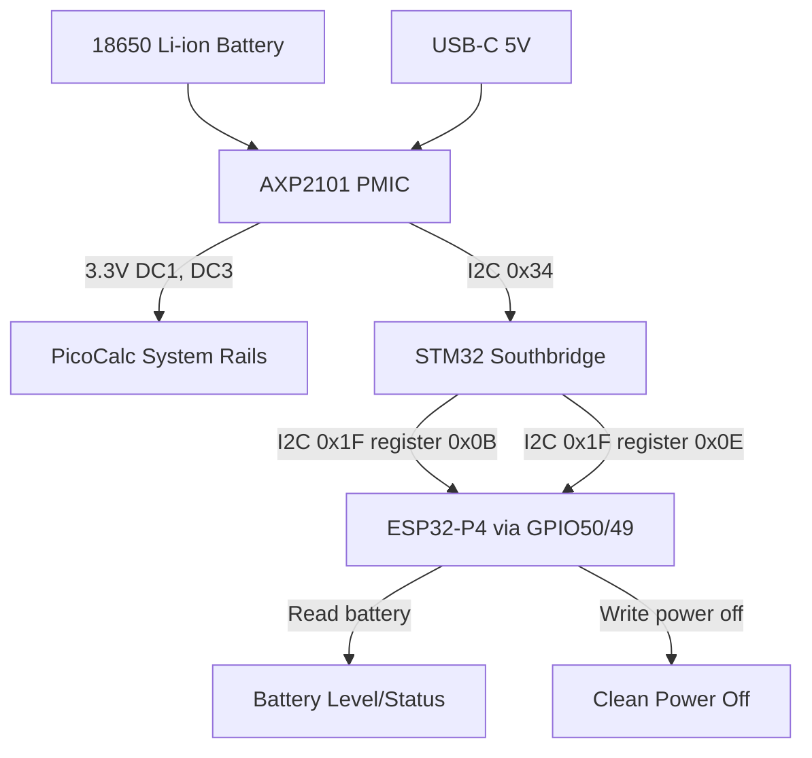

# Power and Battery Management Design and Implementation Guide

## Executive summary

The PicoCalc has an internal 18650 Li-ion battery and power management circuitry. On the original RP2350 design, power management is handled through the STM32 southbridge co-processor, which exposes battery voltage and percentage information via I2C register `0x0B`, and power-off control via I2C register `0x0E`. The newer PicoCalc hardware uses an AXP2101 PMIC for voltage regulation and battery management, but the AXP2101 is managed by the STM32 southbridge — the ESP32-P4 does not talk to the AXP2101 directly.

This guide explains the PicoCalc power architecture, the I2C register interface for battery and power-off, the relevant ESP-IDF APIs, and an implementation plan for adding battery monitoring and power control to the `0099` firmware.

## Problem statement and scope

### Problem

A handheld PicoCalc needs to:

- Display battery level so the user knows when to charge.
- Report charging status so the user knows when charging is complete.
- Power off cleanly when the user requests shutdown or when battery is critically low.
- Potentially warn before sudden power loss.

These features require access to battery voltage and charging state. In the PicoCalc, these are exposed by the STM32 southbridge on the same I2C bus used for keyboard polling.

### Scope

In scope:

1. Reading battery voltage/percentage from STM32 southbridge register `0x0B`.
2. Power-off via STM32 southbridge register `0x0E`.
3. Battery status console commands.
4. Low-battery warning and auto-shutdown policy.
5. Integration with the existing keyboard I2C driver.

Out of scope for the first implementation:

1. Direct AXP2101 I2C communication (if the AXP2101 is on a separate I2C bus that the ESP32-P4 can also reach).
2. Battery fuel gauge calibration.
3. Charging profile configuration.
4. USB power path detection.

## Current-state analysis

### PicoCalc power architecture

The PicoCalc uses an 18650 Li-ion battery cell for portable power. The battery management system differs between hardware revisions:

**PicoCalc V1/V2 (RP2040):** Uses a TP4056 linear charger and a 3.3V LDO regulator. Battery status is minimal — the firmware reads battery voltage through an ADC or through the STM32 southbridge.

**PicoCalc with RP2350 / newer hardware:** Uses an AXP2101 PMIC for comprehensive power management. The AXP2101 provides:

- Multiple DC-DC converters (DC1–DC5) and LDOs (ALDO1–4, BLDO1–2).
- Linear or switch-mode battery charging.
- 14-bit ADC for voltage and temperature monitoring.
- Fuel gauge.
- Over-voltage, over-current, and over-temperature protection.
- GPIO outputs for power rail control.

The AXP2101 is managed by the STM32 southbridge co-processor. The ESP32-P4 accesses battery information through the STM32, not directly through the AXP2101.

### STM32 southbridge I2C register map (power-related)

The STM32 southbridge is at I2C address `0x1F`, on the same bus as the keyboard (GPIO50/GPIO49 on ESP32-P4).

| Register | Name | R/W | Description |
|---|---|---|---|
| `0x0B` | REG_ID_BAT | R | Battery voltage/percentage |
| `0x0E` | REG_ID_OFF | W | Power off (write to trigger shutdown) |

The battery register `0x0B` format needs to be reverse-engineered or read from the STM32 firmware source. Based on community reports, it returns either a raw voltage or a percentage value.

The power-off register `0x0E` triggers a clean shutdown through the STM32, which can then cut power via the AXP2101.

### Existing keyboard driver

The `0099` firmware already has a keyboard driver (`picocalc_keyboard.c`) that polls the STM32 on the same I2C bus:

```c
#define PICOCALC_KBD_I2C_SDA_GPIO      50
#define PICOCALC_KBD_I2C_SCL_GPIO      49
#define PICOCALC_KBD_I2C_SPEED_HZ      10000
#define PICOCALC_KBD_I2C_ADDR          0x1F
```

The keyboard driver already implements `picocalc_keyboard_read_register()`, which reads from the STM32 I2C register space. This function can be reused (or generalized) for battery and power-off register access.

```c
esp_err_t picocalc_keyboard_read_register(uint8_t reg, uint8_t *dst, size_t len);
```

### AXP2101 PMIC details

The AXP2101 is a single-cell Li-battery PMIC from X-Powers. Key specifications:

- Input: USB 5V or battery.
- 5 DC-DC converters and 11 LDOs.
- Linear or switch-mode charging, programmable charge current.
- 14-bit ADC for battery voltage, charge current, discharge current, and temperature.
- I2C interface (address `0x34` or `0x35` depending on chip variant).
- Fuel gauge with coulomb counter.

The AXP2101 register map includes:

| Register | Function |
|---|---|
| `0x00` | Power status (ACIN, VBUS, battery presence, charging) |
| `0x01` | Charging status |
| `0x02` | Configuration (interrupts, overflow, modes) |
| `0x34–0x3C` | DC-DC voltage settings |
| `0x40–0x4B` | ADC results (battery voltage, charge current, etc.) |
| `0x64–0x6A` | Fuel gauge |

If the AXP2101 is reachable from the ESP32-P4 I2C bus (same bus as keyboard or a separate bus), it could provide more detailed power information than the STM32 southbridge registers alone. This needs hardware verification.



## Gap analysis

### Gaps

1. No battery reading code exists in `0099`.
2. The STM32 register `0x0B` data format (raw voltage vs percentage, byte count) is not yet validated.
3. The AXP2101 I2C accessibility from ESP32-P4 is unknown (may be on the same bus, may not be).
4. No power-off command exists.
5. No low-battery warning or auto-shutdown policy exists.
6. The existing `picocalc_keyboard_read_register()` function works for 1-byte reads; battery data may require multi-byte reads.

### What we have

- Working I2C bus to STM32 at `0x1F`.
- Working `picocalc_keyboard_read_register()` that can be extended.
- AXP2101 datasheet and register map references in `sources/`.
- PicoCalc STM32 firmware source at https://github.com/clockworkpi/PicoCalc/tree/master/Code/picocalc_keyboard.

## Proposed architecture

### Public API sketch

```c
#pragma once

#include <stdbool.h>
#include <stdint.h>
#include "esp_err.h"

typedef enum {
    BATTERY_STATE_DISCHARGING,
    BATTERY_STATE_CHARGING,
    BATTERY_STATE_FULL,
    BATTERY_STATE_UNKNOWN,
} battery_state_t;

typedef struct {
    bool valid;
    battery_state_t state;
    uint8_t percentage;       // 0-100 if available
    uint16_t voltage_mv;      // millivolts if available
    bool usb_powered;         // true if running on USB power
} battery_info_t;

esp_err_t battery_init(void);
esp_err_t battery_read(battery_info_t *info);
esp_err_t power_off(void);
```

### Console commands

```text
battery status
battery read [loops] [interval_ms]
power off
```

### Implementation approach

The first implementation should use the STM32 southbridge registers:

1. Extend the existing keyboard I2C driver to add `picocalc_read_battery()` and `picocalc_power_off()` functions.
2. Add a battery polling task that reads battery state periodically (e.g., every 30 seconds).
3. Add a low-battery check that triggers a warning at 10% and auto-shutdown at 5%.
4. Add a `power off` command that writes to register `0x0E`.

Later, if the AXP2101 is discovered on the same I2C bus, add direct AXP2101 access for more detailed information.

## Implementation phases

### Phase 1: Battery register discovery

Read the STM32 southbridge register `0x0B` and document its format.

Steps:

1. Add a console command `battery read` that reads register `0x0B`.
2. Read multiple bytes and print raw hex output.
3. Compare output when:
   - Device is running on USB power with full battery.
   - Device is running on USB power with charging battery.
   - Device is running on battery only (unplug USB).
   - Device has low battery.
4. Document the register format.

Acceptance criteria:

- Raw register data is printed for different battery states.
- The data format is understood well enough to parse percentage or voltage.

### Phase 2: Battery info parsing

Implement `battery_read()` based on the discovered register format.

Steps:

1. Parse the register `0x0B` data into `battery_info_t`.
2. Add `battery status` console command.
3. Test over time while battery charges and discharges.

Acceptance criteria:

- `battery status` prints human-readable battery level and state.
- Percentage or voltage changes as expected during charge/discharge.

### Phase 3: Power-off control

Implement `power_off()` by writing to register `0x0E`.

Steps:

1. Add `power off` console command.
2. Write a specific value (or any value) to register `0x0E`.
3. Verify that the device powers off.

Acceptance criteria:

- `power off` causes a clean shutdown.
- The device can be powered back on normally.

**WARNING:** Test this carefully. If the power-off register triggers an immediate shutdown without a software handshake, unsaved data could be lost. Consider adding a confirmation prompt or a brief delay before writing to `0x0E`.

### Phase 4: Low-battery warning and auto-shutdown

Add a battery monitoring task.

```c
void battery_monitor_task(void *arg) {
    battery_info_t info;
    while (1) {
        battery_read(&info);
        if (info.valid && info.percentage <= 5 && info.state == BATTERY_STATE_DISCHARGING) {
            ESP_LOGW(TAG, "Critical battery: %d%%, shutting down", info.percentage);
            display_show_warning("Low battery - shutting down");
            vTaskDelay(pdMS_TO_TICKS(3000));
            power_off();
        } else if (info.valid && info.percentage <= 10 && info.state == BATTERY_STATE_DISCHARGING) {
            ESP_LOGW(TAG, "Low battery: %d%%", info.percentage);
            display_show_warning("Low battery - connect USB");
        }
        vTaskDelay(pdMS_TO_TICKS(30000));  // check every 30s
    }
}
```

### Phase 5: AXP2101 direct access (optional)

If the AXP2101 is on the ESP32-P4 reachable I2C bus:

1. Scan the I2C bus for address `0x34` or `0x35`.
2. Read AXP2101 power status register `0x00` and charging status `0x01`.
3. Read ADC results for battery voltage and charge current.
4. Compare AXP2101 readings with STM32 southbridge readings.
5. Decide whether to use AXP2101 as primary or supplementary data source.

## Testing strategy

### Register discovery test

```text
battery read 10 2000
```

Read battery register 10 times at 2-second intervals. Observe raw data while:
1. On USB power.
2. On battery power.
3. Charging.

### Battery status test

```text
battery status
```

Print parsed battery info. Verify against expected states.

### Power-off test

```text
power off
```

Verify device shuts down and can be restarted.

### Long-running battery drain test

Leave the device running on battery and periodically check `battery status` over several hours. Verify that the percentage decreases and that the low-battery warning triggers.

## Risks and mitigations

### Risk: register `0x0B` format unknown

Mitigation: Phase 1 is a register discovery exercise. Read raw bytes and compare across known battery states before parsing.

### Risk: AXP2101 not accessible from ESP32-P4

Mitigation: start with STM32 southbridge registers. They are confirmed accessible on the existing I2C bus.

### Risk: power-off register causes immediate shutdown

Mitigation: flush all pending display and storage operations before writing to `0x0E`. Add a brief delay and a visual warning.

### Risk: battery monitoring task interferes with keyboard polling

Mitigation: the battery monitor and keyboard driver share the same I2C bus. Use a mutex or schedule battery reads between keyboard polls. The bus runs at 10 kHz and keyboard polling is every ~20 ms, so a battery read every 30 seconds will not cause contention.

### Risk: battery percentage is not linearly related to voltage

Mitigation: if the STM32 returns raw voltage, apply a Li-ion discharge curve lookup table. If it returns a pre-computed percentage, trust the STM32 calculation.

## ESP-IDF reference

### I2C master read (already used in keyboard driver)

```c
esp_err_t picocalc_keyboard_read_register(uint8_t reg, uint8_t *dst, size_t len) {
    // Write register address, then read len bytes
    // Uses i2c_master_transmit_receive() or equivalent
}
```

For battery register access, extend this pattern or create a general southbridge register read function:

```c
esp_err_t southbridge_read_register(uint8_t reg, uint8_t *dst, size_t len);
esp_err_t southbridge_write_register(uint8_t reg, const uint8_t *src, size_t len);
```

### Power management APIs

```c
#include "esp_pm.h"
#include "esp_sleep.h"

// Configure power management
esp_pm_config_t pm_config = {
    .max_freq_mhz = 360,
    .min_freq_mhz = 40,
    .light_sleep_enable = false,
};
esp_pm_configure(&pm_config);
```

## Implementation checklist for the intern

1. Read this document from beginning to end.
2. Read `0099-esp32-p4-picocalc-display-keyboard/main/picocalc_keyboard.h` and `picocalc_keyboard.c`.
3. Read the PicoCalc STM32 firmware source at: https://github.com/clockworkpi/PicoCalc/tree/master/Code/picocalc_keyboard
4. Read the PiPAPo reference in `sources/pipapo-picocalc.md` (battery section).
5. Read the AXP2101 references in `sources/axp2101-nanoframework.md` and `sources/axp2101-pmic-esp.md`.
6. Add `battery read` command and discover the register `0x0B` format.
7. Implement `battery_read()` and `battery status` command.
8. Add `power off` command with confirmation.
9. Add battery monitoring task.
10. Optionally scan I2C bus for AXP2101 and add direct access.
11. Update the ticket diary after each phase.

## File references

```text
/home/manuel/workspaces/2025-12-21/echo-base-documentation/esp32-s3-m5/0099-esp32-p4-picocalc-display-keyboard/main/picocalc_keyboard.h
/home/manuel/workspaces/2025-12-21/echo-base-documentation/esp32-s3-m5/0099-esp32-p4-picocalc-display-keyboard/main/picocalc_keyboard.c
/home/manuel/workspaces/2025-12-21/echo-base-documentation/esp32-s3-m5/0099-esp32-p4-picocalc-display-keyboard/main/app_main.c
```

Research sources stored in `sources/`:
- `axp2101-nanoframework.md` — AXP2101 driver reference with register map
- `axp2101-pmic-esp.md` — AXP2101 ESP-IDF driver example
- `pipapo-picocalc.md` — PicoCalc hardware reference with STM32 register map
- `picocalc-specs.md` — PicoCalc mainboard V2.0 schematic

## Open questions

1. What is the exact data format of STM32 register `0x0B` (byte count, encoding)?
2. Is the AXP2101 on the same I2C bus as the keyboard (address `0x34` or `0x35`)?
3. What value triggers power-off when written to register `0x0E`? Does any write trigger it, or is a specific payload required?
4. Does the STM32 firmware provide USB power detection as a separate register or flag?
5. What is the low-battery threshold behavior in the original RP2350 firmware?

## References

- PicoCalc STM32 Firmware Source: https://github.com/clockworkpi/PicoCalc/tree/master/Code/picocalc_keyboard
- PiPAPo PicoCalc Reference: https://github.com/toyoshim-i/PiPAPo/blob/main/docs/reference/picocalc.md
- AXP2101 Datasheet: https://files.waveshare.com/wiki/common/X-power-AXP2101_SWcharge_V1.0.pdf
- AXP2101 ESP-IDF Driver (HwzLoveDz): https://github.com/HwzLoveDz/AXP2101-PMIC
- AXP2101 nanoFramework Driver: https://docs.nanoframework.net/devicesdetails/Axp2101/README.html
