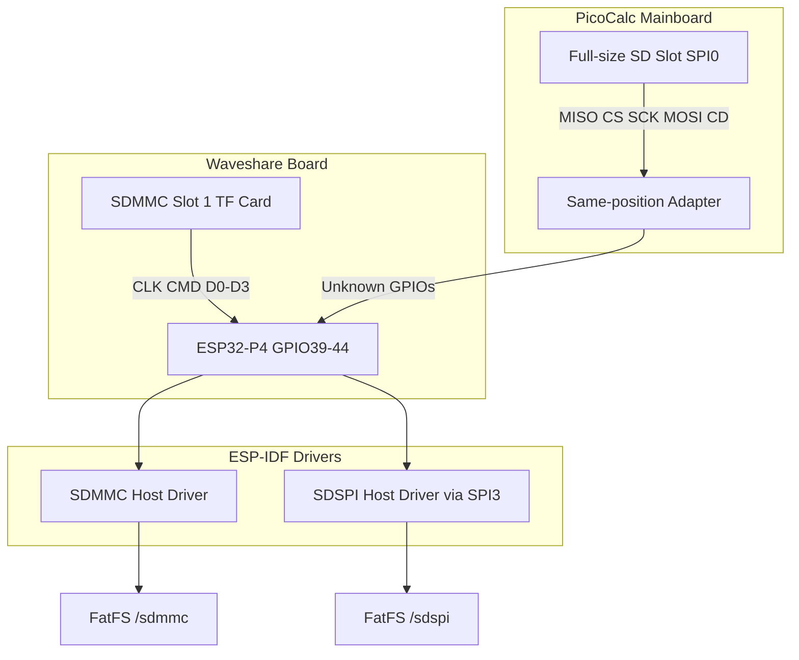

# SD Card Design and Implementation Guide

## Executive summary

The ESP32-P4 PicoCalc has two physically distinct SD card paths available. The Waveshare ESP32-P4-WIFI6 board provides an onboard MicroSD/TF card slot connected via SDMMC (4-bit wide, SDIO 3.0, GPIO39–44). The PicoCalc mainboard provides a full-size SD card slot connected via SPI0 through the same-position adapter (RP2040 GP16–19, GP22). This guide explains both paths, the ESP-IDF drivers involved, the pin mappings, the protocol differences, and an implementation plan that starts with the faster Waveshare SDMMC path and later adds the PicoCalc SPI path for user-facing parity.

## Problem statement and scope

### Problem

A PicoCalc needs persistent storage for firmware configuration, user files, scripts, and potentially media. The original RP2350 PicoCalc uses its SPI0 SD card slot for all storage. The ESP32-P4 replacement has access to both the PicoCalc SPI SD slot (through the same-position adapter) and the Waveshare onboard SDMMC slot. Both should be supported, but they require different drivers and have different performance characteristics.

### Scope

In scope:

1. Waveshare onboard SDMMC TF card slot initialization, mounting, and file I/O.
2. PicoCalc full-size SD card slot via SPI through the same-position adapter.
3. FatFS integration for both paths.
4. Console commands for SD card testing.
5. Pin discovery for the PicoCalc SPI SD path (same-position adapter mapping).

Out of scope for the first implementation:

1. Wear leveling or filesystem reliability beyond what FatFS provides.
2. SD card hot-plug detection and remounting.
3. Boot-from-SD or SD-based firmware update.
4. Performance optimization beyond basic SDMMC high-speed mode.

## Current-state analysis

### Waveshare onboard SDMMC slot

The Waveshare ESP32-P4-WIFI6 (SKU 32020) has an onboard MicroSD/TF card slot connected via SDMMC. The pin assignment (from Waveshare documentation and DEV-KIT examples) is:

| Signal | ESP32-P4 GPIO |
|---|---|
| CLK | GPIO43 |
| CMD | GPIO44 |
| D0 | GPIO39 |
| D1 | GPIO40 |
| D2 | GPIO41 |
| D3 | GPIO42 |

Configuration in ESP-IDF:

```c
sdmmc_host_t host = SDMMC_HOST_DEFAULT();
host.max_freq_khz = SDMMC_FREQ_HIGHSPEED;

sdmmc_slot_config_t slot_config = SDMMC_SLOT_CONFIG_DEFAULT();
slot_config.width = 4;
slot_config.clk = 43;
slot_config.cmd = 44;
slot_config.d0 = 39;
slot_config.d1 = 40;
slot_config.d2 = 41;
slot_config.d3 = 42;
slot_config.flags |= SDMMC_SLOT_FLAG_INTERNAL_PULLUP;
```

The ESP32-P4 SDMMC host peripheral has two slots. Slot 1 is routed via GPIO matrix (any GPIO). Slot 0 is dedicated to UHS-I mode. The Waveshare board uses Slot 1 for the TF card.

The ESP32-P4 SDMMC host requires an external IO voltage supply via the `VDDPST_5` (SD_VREF) pin. For non-UHS-I designs, this pin can be connected to 3.3V. The Waveshare board handles this in hardware.

### PicoCalc SPI SD slot

The original PicoCalc RP2040/RP2350 firmware uses SPI0 for SD card access:

| Signal | RP2040 GPIO | Pico Physical Pin | ESP32-P4 GPIO (same-position) |
|---|---|---|---|
| MISO | GP16 | Pin 21 | GPIO48 |
| CS | GP17 | Pin 22 | GPIO47 |
| SCK | GP18 | Pin 24 | GPIO46 |
| MOSI | GP19 | Pin 25 | GPIO33 |
| CD (Card Detect) | GP22 | Pin 29 | GPIO26 |

With the same-position adapter, each RP2040 physical pin position maps to a specific ESP32-P4 GPIO. The full pin map is documented in `ESP32-P4-PICOCALC` ticket design doc `03-full-rpico-socket-to-waveshare-esp32-p4-pin-map.md`. The PicoCalc SD card pins map as follows:

The PicoCalc SD card uses SPI mode, not SDMMC mode. In ESP-IDF, this requires the SDSPI host driver instead of the SDMMC host driver.

SD SPI mode initialization sequence:

1. Start the SPI bus at ≤400 kHz (SD spec requires slow clock for CMD0).
2. Send CMD0 with CS low to enter SPI mode.
3. Initialize the card with the SD protocol commands.
4. Switch to data clock up to 25 MHz (SD SPI mode maximum).

### Existing firmware context

The current `0099-esp32-p4-picocalc-display-keyboard` firmware uses SPI2 for the LCD. SPI0 is the flash cache bus on ESP32-P4. SPI1 is available but may conflict with flash. SPI2 is already used for the LCD. SPI3 should be used for the PicoCalc SD card SPI path.

The existing keyboard I2C bus (GPIO50/GPIO49) is separate from the SDMMC/SPI paths.



## Gap analysis

### Gaps

1. The Waveshare SDMMC slot pin assignment is known but not yet initialized in `0099`.
2. The PicoCalc SPI SD slot ESP32-P4 GPIO mapping is unknown (same-position adapter discovery needed).
3. No FatFS mount points exist in `0099`.
4. No SD card console commands exist.
5. The `0098-esp32-p4-wifi6-webserver` firmware may have SDMMC initialization code to reference.
6. The PicoCalc SD card detect pin (GP22) mapping is unknown.

### What we have

- Validated SPI2 bus for LCD (separate from SD paths).
- Validated I2C bus for keyboard (separate from SD paths).
- ESP-IDF SDMMC and SDSPI driver documentation in `sources/`.
- Waveshare example projects with SDMMC initialization code.
- PicoCalc pinout reference showing the RP2040 SPI0 SD assignment.

## Proposed architecture

### Two-path SD strategy

```text
/sdmmc  -> Waveshare onboard TF slot (SDMMC, 4-bit, high-speed)
/sdspi  -> PicoCalc full-size SD slot (SPI, 1-bit, 25 MHz max)
```

Both paths mount through FatFS. Application code selects the path based on use case:

- `/sdmmc` for fast internal storage (firmware config, cache, media).
- `/sdspi` for PicoCalc user-facing SD card compatibility.

### Public API sketch

```c
#pragma once

#include "esp_err.h"

typedef enum {
    SD_PATH_SDMMC,  // Waveshare onboard TF
    SD_PATH_SDSPI,  // PicoCalc external SD
} sd_path_t;

esp_err_t sd_init(sd_path_t path);
esp_err_t sd_deinit(sd_path_t path);
esp_err_t sd_info(sd_path_t path, size_t *total_bytes, size_t *free_bytes);
bool sd_is_mounted(sd_path_t path);
const char *sd_mount_point(sd_path_t path);
```

### Console commands

```text
sd init mmc|spi|both
sd info mmc|spi
sd ls [path]
sd cat <path>
sd deinit mmc|spi|both
sd bench mmc|spi [block_count]
```

## Implementation phases

### Phase 1: Waveshare SDMMC slot

Implement SDMMC initialization and FatFS mount for the Waveshare onboard TF slot.

Steps:

1. Add `sdmmc_host_init()` and `sdmmc_host_init_slot()` calls using the known GPIO mapping.
2. Mount FatFS at `/sdmmc`.
3. Add `sd init mmc` console command.
4. Add `sd info mmc` and `sd ls` commands.
5. Test with a FAT32-formatted MicroSD card.

Acceptance criteria:

- `sd init mmc` succeeds and prints card info.
- `sd ls /sdmmc/` lists files on the card.
- `sd info mmc` reports total and free space.
- No SPI2/LCD or I2C/keyboard conflicts.

Key risk: the `0099` firmware currently uses SPI2 for LCD. SDMMC uses dedicated SDMMC peripheral, not a GPSPI bus, so there is no SPI bus conflict.

### Phase 2: PicoCalc SPI SD slot

Discover the same-position adapter GPIO mapping for the PicoCalc SD card pins, then implement SDSPI initialization.

Steps:

1. Define pin constants using the validated same-position adapter mapping:
   - SD_MISO = GPIO48, SD_CS = GPIO47, SD_SCK = GPIO46, SD_MOSI = GPIO33, SD_CD = GPIO26
2. Define pin constants.
3. Initialize SPI3 bus with the discovered pins.
4. Configure SDSPI host using `sdspi_host_init()` and `sdspi_host_init_device()`.
5. Mount FatFS at `/sdspi`.
6. Add `sd init spi` console command.
7. Test with a FAT32-formatted full-size SD card in the PicoCalc slot.

Acceptance criteria:

- `sd init spi` succeeds and prints card info.
- `sd ls /sdspi/` lists files.
- Card detect pin reflects insertion status.
- No conflicts with LCD SPI2, keyboard I2C, or SDMMC.

Key risk: the same-position adapter mapping (GPIO48/47/46/33/26) must be verified with a continuity test on the actual adapter before relying on it in production. The mapping is derived from the pin map document and has not yet been probed physically for the SD card pins specifically (only LCD and keyboard pins have been validated in firmware).

### Phase 3: SD benchmark

Add a simple read/write benchmark for both paths.

```text
sd bench mmc 100
sd bench spi 100
```

Measure sequential read and write throughput in KiB/s. This is useful for understanding whether the PicoCalc SPI SD slot is fast enough for media playback or script loading.

### Phase 4: Integration with display server

Wire the SD paths into the display server or application layer so that:

- Configuration files can be loaded from `/sdmmc`.
- User scripts or files can be loaded from `/sdspi`.
- Save/load state for terminal sessions.

## Testing strategy

### Waveshare SDMMC test

1. Insert a FAT32 MicroSD card into the Waveshare TF slot.
2. Run `sd init mmc`.
3. Verify card detection and CSD parsing.
4. Run `sd ls /sdmmc/`.
5. Run `sd bench mmc 50`.

### PicoCalc SPI SD test

1. Insert a FAT32 full-size SD card into the PicoCalc slot.
2. Run `sd init spi`.
3. Verify card detection.
4. Run `sd ls /sdspi/`.
5. Run `sd bench spi 50`.

### Conflict test

1. Initialize LCD (SPI2) and keyboard (I2C) as usual.
2. Initialize SDMMC (dedicated peripheral).
3. Initialize SDSPI (SPI3).
4. Run `lcd perf full` to verify LCD performance is unchanged.
5. Run `kbd poll 10` to verify keyboard is unchanged.
6. Run `sd bench mmc 50` and `sd bench spi 50` to verify SD performance.

### Visual validation

Not required for SD card access. SPI success and file listing are sufficient validation.

## Risks and mitigations

### Risk: same-position adapter pin mapping unknown for SPI SD

Mitigation: use the Waveshare ESP32-P4-WIFI6 pinout diagram or physically probe with a multimeter/LED test before writing the SDSPI driver.

### Risk: SDMMC and ESP-Hosted SDIO conflict on Slot 0

Mitigation: the Waveshare board uses SDMMC Slot 1 for the TF card. ESP-Hosted (if present) would use Slot 0. Keep them separate. If both are needed, verify that Slot 0 and Slot 1 can operate concurrently.

### Risk: SPI3 conflict with LCD SPI2

Mitigation: SPI3 is a separate GPSPI bus from SPI2. No hardware conflict. Verify by running LCD benchmarks after SD init.

### Risk: SD card detect pin is active-low but GPIO is misconfigured

Mitigation: start with a known pull-up configuration and verify card detect state with card inserted and removed before relying on it for auto-mount.

## ESP-IDF driver reference

### SDMMC Host Driver API

```c
#include "driver/sdmmc_host.h"
#include "sdmmc_cmd.h"
#include "esp_vfs_fat.h"

esp_err_t sdmmc_host_init(void);
esp_err_t sdmmc_host_init_slot(int slot, const sdmmc_slot_config_t *slot_config);
esp_err_t sdmmc_host_deinit(void);
esp_err_t sdmmc_host_set_card_clk(int slot, uint32_t freq_khz);
```

### SDSPI Host Driver API

```c
#include "driver/sdspi_host.h"
#include "sdmmc_cmd.h"
#include "esp_vfs_fat.h"

esp_err_t sdspi_host_init(void);
esp_err_t sdspi_host_init_device(const sdspi_device_config_t *config, sdspi_dev_handle_t *out_handle);
esp_err_t sdspi_host_deinit(void);
esp_err_t sdspi_host_set_card_clk(sdspi_dev_handle_t handle, uint32_t freq_khz);
```

### FatFS VFS mount pattern

```c
esp_vfs_fat_sdmmc_mount_config_t mount_config = {
    .format_if_mount_failed = false,
    .max_files = 5,
    .allocation_unit_size = 16 * 1024,
};
sdmmc_card_t *card;
esp_err_t ret = esp_vfs_fat_sdmmc_mount("/sdmmc", &host, &slot_config, &mount_config, &card);
```

For SDSPI, use `esp_vfs_fat_sdspi_mount()` instead.

## Implementation checklist for the intern

1. Read this document from beginning to end.
2. Read `0099-esp32-p4-picocalc-display-keyboard/README.md`.
3. Read `0099-esp32-p4-picocalc-display-keyboard/main/app_main.c` to understand current SPI2 and I2C usage.
4. Read the SDMMC host driver reference in `sources/esp32-p4-sdmmc-host.md`.
5. Read the SDSPI host driver reference in `sources/esp32-p4-sdspi-host.md`.
6. Read the PicoCalc pin reference in `sources/pipapo-picocalc.md` (SD card section).
7. Add SDMMC initialization code to `app_main.c` or a new `sd_card.c` module.
8. Build and test with a MicroSD card in the Waveshare TF slot.
9. Discover the PicoCalc SPI SD pin mapping (physical probing or pinout diagram).
10. Add SDSPI initialization code.
11. Build and test with a full-size SD card in the PicoCalc slot.
12. Add benchmark commands.
13. Update the ticket diary after each phase.

## File references

```text
/home/manuel/workspaces/2025-12-21/echo-base-documentation/esp32-s3-m5/0099-esp32-p4-picocalc-display-keyboard/main/app_main.c
/home/manuel/workspaces/2025-12-21/echo-base-documentation/esp32-s3-m5/0099-esp32-p4-picocalc-display-keyboard/main/picocalc_keyboard.h
/home/manuel/workspaces/2025-12-21/echo-base-documentation/esp32-s3-m5/0099-esp32-p4-picocalc-display-keyboard/main/picocalc_keyboard.c
/home/manuel/workspaces/2025-12-21/echo-base-documentation/esp32-s3-m5/0099-esp32-p4-picocalc-display-keyboard/README.md
```

Research sources stored in `sources/`:
- `esp32-p4-sdmmc-host.md` — ESP-IDF SDMMC host driver reference
- `esp32-p4-sdmmc-protocol.md` — ESP-IDF SD/SDIO/MMC protocol layer reference
- `esp32-p4-sdspi-host.md` — ESP-IDF SDSPI host driver reference
- `pipapo-picocalc.md` — PicoCalc hardware specifications including SD card pin mapping
- `picocalc-specs.md` — PicoCalc mainboard V2.0 schematic documentation

## Open questions

1. Has the same-position adapter SD card mapping (GPIO48/47/46/33/26) been verified with a continuity test on the physical adapter?
2. Does the `0098` webserver firmware already have working SDMMC initialization code that can be reused?
3. Can SDMMC Slot 1 and ESP-Hosted SDIO Slot 0 coexist if Wi-Fi is later added to `0099`?
4. What is the actual throughput of the Waveshare SDMMC slot in 4-bit high-speed mode?
5. Is the PicoCalc card detect line (GPIO26) connected on the same-position adapter and does it reflect card insertion correctly?

## References

- ESP-IDF SDMMC Host Driver: https://docs.espressif.com/projects/esp-idf/en/stable/esp32p4/api-reference/peripherals/sdmmc_host.html
- ESP-IDF SD/SDIO/MMC Protocol: https://docs.espressif.com/projects/esp-idf/en/stable/esp32p4/api-reference/storage/sdmmc.html
- ESP-IDF SDSPI Host Driver: https://docs.espressif.com/projects/esp-idf/en/stable/esp32p4/api-reference/peripherals/sdspi_host.html
- Waveshare ESP32-P4-WIFI6: https://docs.waveshare.com/ESP32-P4-WIFI6
- PiPAPo PicoCalc Reference: https://github.com/toyoshim-i/PiPAPo/blob/main/docs/reference/picocalc.md
