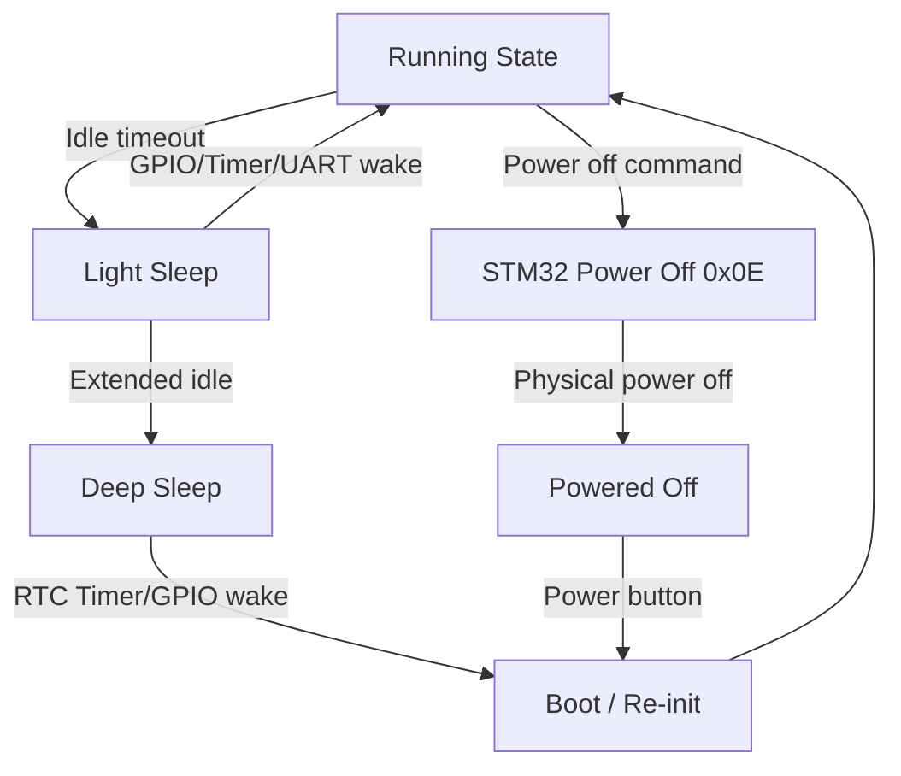

# Sleep Wake and RTC Design and Implementation Guide

## Executive summary

The ESP32-P4 supports two major power-saving modes: light sleep and deep sleep. For a PicoCalc handheld, sleep modes are essential for battery life. When the user closes the device or leaves it idle, the system should enter a low-power state and wake quickly when the user returns. The ESP32-P4 also has an RTC (real-time clock) powered by a dedicated RTC battery or the main battery, which can maintain time across sleep cycles. The Waveshare ESP32-P4-WIFI6 board has an RTC battery header for this purpose.

This guide explains the ESP32-P4 sleep architecture, the available wake sources, the RTC subsystem, the interaction with the PicoCalc STM32 southbridge (which controls power-off), and an implementation plan for adding sleep/wake behavior to the `0099` firmware.

## Problem statement and scope

### Problem

A handheld PicoCalc must:

- Conserve battery when idle.
- Wake quickly when the user presses a key.
- Maintain wall-clock time across sleep periods.
- Handle the distinction between sleep (ESP32-P4 low-power state) and power-off (STM32 southbridge controlled shutdown).
- Avoid losing display content or peripheral state across unintended sleep entries.

Without sleep support, the ESP32-P4 runs at full clock speed continuously, draining the battery in hours rather than days.

### Scope

In scope:

1. Light sleep mode configuration and entry.
2. Deep sleep mode configuration and entry.
3. Wake sources: GPIO, RTC timer, and keyboard (via STM32 interrupt).
4. RTC time keeping across sleep.
5. Sleep/wake console commands.
6. Automatic idle sleep policy.

Out of scope for the first implementation:

1. ULP (Ultra-Low-Power) coprocessor programming.
2. Power-off via STM32 as a "deeper sleep" alternative (covered in POWER ticket).
3. Peripheral state save/restore across deep sleep.
4. Display content preservation across deep sleep.
5. Wake from Wi-Fi or network event.

## Current-state analysis

### ESP32-P4 sleep modes

The ESP32-P4 supports two major sleep modes:

**Light sleep:**

- CPUs are clock-gated (paused), not powered off.
- Most digital peripherals are clock-gated.
- RAM is retained.
- RTC is active.
- Wake sources: GPIO, RTC timer, UART (if enabled).
- Wake latency: typically <1 ms.
- Current reduction: moderate (depends on active peripherals).

**Deep sleep:**

- CPUs are powered off.
- Most digital peripherals are powered off.
- RTC memory and RTC peripherals remain powered.
- Only RTC domain is active.
- Wake sources: RTC timer, GPIO (via RTC IO), EXT0/EXT1.
- Wake latency: full boot sequence (similar to reset), typically 100–500 ms.
- Current reduction: significant (can reach microamp range).

**Sub-sleep modes:**

The ESP32-P4 has additional sub-modes depending on which power domains are kept on:

- **PM_TOP**: HP system power domain. Off in deep sleep.
- **PM_LP_PERIPH**: LP peripheral domain. Can be kept on in deep sleep for certain wake sources.
- **PM_HP_CPU**: HP CPU domain. Off in both light and deep sleep.

### ESP32-P4 RTC subsystem

The ESP32-P4 has a dedicated RTC (real-time clock) that runs in the LP (low-power) domain. The RTC continues running during both light sleep and deep sleep, as long as the LP domain is powered.

The Waveshare ESP32-P4-WIFI6 board has:

- An RTC battery header (J6) for a rechargeable RTC battery.
- An alternate RTC battery header (H6).
- The RTC can be powered from the main battery when the RTC battery is not installed.

RTC time is accessed through:

```c
#include "esp_sntp.h"
#include "esp_timer.h"

// Get time since boot (not wall clock)
int64_t us = esp_timer_get_time();

// Get wall clock time (requires SNTP or manual setting)
time_t now;
time(&now);
```

### Wake sources for PicoCalc

For a PicoCalc, the most important wake sources are:

1. **Keyboard activity** — the STM32 southbridge detects key presses and could assert an interrupt line.
2. **GPIO wake** — if the STM32 has an interrupt output pin connected to an ESP32-P4 GPIO.
3. **RTC timer wake** — periodic wake for timekeeping or battery check.
4. **Power button** — if the PicoCalc has a dedicated power button with a GPIO connection.

**Critical gap:** The STM32 southbridge I2C protocol includes a register `0x03` (`REG_ID_INT`) for interrupt status. However, it is not yet known whether the STM32 has a hardware interrupt output pin connected to the ESP32-P4 through the same-position adapter. Without a hardware interrupt, the ESP32-P4 cannot wake from light or deep sleep on keyboard activity unless it uses a periodic RTC timer wake to poll the keyboard.

### Sleep mode interaction with peripherals

| Peripheral | Light Sleep | Deep Sleep |
|---|---|---|
| LCD SPI2 | Clock-gated, retained | Off, needs re-init |
| Keyboard I2C | Clock-gated, retained | Off, needs re-init |
| SDMMC | Clock-gated, retained | Off, needs re-init |
| I2S Audio | Clock-gated, retained | Off, needs re-init |
| PSRAM | Retained | Off or retained (configurable) |
| RTC | Active | Active |
| UART0 console | Can be wake source | Off |
| GPIO states | Retained | Only RTC IO retained |

After deep sleep wake, the firmware must reinitialize all peripherals. This is equivalent to a fresh boot, except that RTC memory contents are preserved.



## Gap analysis

### Gaps

1. No sleep mode code in `0099`.
2. The STM32 southbridge interrupt output pin (if any) is not mapped to an ESP32-P4 GPIO.
3. No RTC time is set or maintained in `0099`.
4. No idle detection or auto-sleep policy.
5. No peripheral re-initialization path after deep sleep.
6. Deep sleep wake currently behaves like a fresh boot with no state restore.

### What we have

- ESP-IDF sleep mode API documentation in `sources/`.
- Waveshare board with RTC battery header.
- STM32 southbridge with interrupt register `0x03`.
- Working I2C bus to STM32 for keyboard and power-off control.

## Proposed architecture

### Sleep mode API sketch

```c
#pragma once

#include <stdint.h>
#include "esp_err.h"

typedef enum {
    SLEEP_MODE_NONE,       // Running normally
    SLEEP_MODE_LIGHT,      // CPU paused, RAM retained
    SLEEP_MODE_DEEP,       // CPU off, RTC only
} sleep_mode_t;

typedef struct {
    sleep_mode_t last_mode;    // What mode we woke from
    uint64_t sleep_duration_us;
    bool woke_from_timer;
    bool woke_from_gpio;
    bool woke_from_uart;
} wake_info_t;

esp_err_t sleep_configure_light(uint32_t idle_ms, int wake_gpio);
esp_err_t sleep_configure_deep(uint32_t idle_ms, uint64_t wake_period_us);
esp_err_t sleep_enter_light(void);
esp_err_t sleep_enter_deep(void);
wake_info_t sleep_get_wake_info(void);
bool sleep_is_waking_from_deep(void);
esp_err_t rtc_set_time(time_t unix_time);
time_t rtc_get_time(void);
```

### Console commands

```text
sleep light [idle_ms]
sleep deep [wake_period_us]
sleep status
sleep cancel
rtc set <unix_timestamp>
rtc get
sleep wakeinfo
```

### Automatic sleep policy

```text
After 60s idle      -> light sleep
After 600s idle     -> deep sleep with RTC wake every 60s for battery check
On keyboard activity -> wake and restore
On low battery      -> power off via STM32
```

## Implementation phases

### Phase 1: Light sleep with GPIO wake

Implement basic light sleep entry and exit with a GPIO wake source.

Steps:

1. Configure a GPIO as a wake source (use the keyboard I2C INT pin if discovered, or a spare GPIO).
2. Configure `esp_sleep_enable_gpio_wakeup()`.
3. Enter light sleep with `esp_light_sleep_start()`.
4. On wake, resume execution immediately.
5. Add `sleep light` console command.

If no STM32 interrupt pin is available, use a periodic RTC timer wake instead:

```c
esp_sleep_enable_timer_wakeup(60 * 1000000);  // wake every 60s
esp_light_sleep_start();
// On wake, poll keyboard
// If no key, go back to sleep
```

Acceptance criteria:

- Light sleep entry reduces current consumption measurably.
- Wake from GPIO or timer resumes execution within 1 ms.
- LCD and keyboard continue to function after wake.

### Phase 2: Deep sleep with RTC timer wake

Implement deep sleep entry and wake.

Steps:

1. Configure `esp_sleep_enable_timer_wakeup()` with a wake period.
2. Optionally configure RTC GPIO wake (if an interrupt pin is discovered).
3. Save critical state to RTC memory if needed.
4. Enter deep sleep with `esp_deep_sleep_start()`.
5. On wake, detect that this is a deep sleep wake (not a fresh boot).
6. Add `sleep deep` console command.
7. Add `sleep wakeinfo` command.

```c
// Detect deep sleep wake
esp_sleep_wakeup_cause_t cause = esp_sleep_get_wakeup_cause();
if (cause == ESP_SLEEP_WAKEUP_TIMER) {
    ESP_LOGI(TAG, "Woke from deep sleep (timer)");
} else if (cause == ESP_SLEEP_WAKEUP_GPIO) {
    ESP_LOGI(TAG, "Woke from deep sleep (GPIO)");
} else {
    ESP_LOGI(TAG, "Fresh boot");
}
```

Acceptance criteria:

- Deep sleep wake is detected correctly.
- Wake info reports the cause.
- After wake, LCD and keyboard re-initialize successfully.
- Current consumption in deep sleep is significantly lower than running state.

### Phase 3: RTC time keeping

Maintain wall-clock time across sleep periods.

Steps:

1. Add an RTC battery to the Waveshare header (if not already installed).
2. Set RTC time manually or via SNTP (if Wi-Fi is available).
3. Verify that time is maintained across light sleep and deep sleep.
4. Add `rtc set` and `rtc get` commands.

```c
#include "esp_sntp.h"

// Initialize SNTP if Wi-Fi is available
esp_sntp_setoperatingmode(SNTP_OPMODE_POLL);
esp_sntp_setservername(0, "pool.ntp.org");
esp_sntp_init();

// Or set time manually
struct timeval tv = { .tv_sec = 1748800000, .tv_usec = 0 };
settimeofday(&tv, NULL);
```

Acceptance criteria:

- `rtc get` returns wall-clock time.
- Time is maintained across light sleep.
- Time is maintained across deep sleep (if RTC battery is installed).
- Time drift is within acceptable limits (<1 second per hour).

### Phase 4: Automatic idle sleep

Add automatic sleep entry based on idle time.

Steps:

1. Track time since last keyboard or display activity.
2. After 60 seconds idle, enter light sleep.
3. On any wake, poll keyboard. If key pressed, resume. If no key, go back to sleep.
4. After 600 seconds total idle, enter deep sleep with periodic wake.
5. During periodic wake, check battery. If critically low, power off.

Pseudocode:

```c
void idle_monitor_task(void *arg) {
    uint32_t idle_ticks = 0;
    uint32_t light_sleep_threshold = pdMS_TO_TICKS(60000);   // 60s
    uint32_t deep_sleep_threshold = pdMS_TO_TICKS(600000);   // 600s = 10min
    
    while (1) {
        if (activity_since_last_check()) {
            idle_ticks = 0;
        } else {
            idle_ticks += pdMS_TO_TICKS(1000);
        }
        
        if (idle_ticks >= deep_sleep_threshold) {
            esp_deep_sleep_start();
            // Never reaches here; wake is like a fresh boot
        } else if (idle_ticks >= light_sleep_threshold) {
            esp_light_sleep_start();
            // Resumes here after wake
            idle_ticks = light_sleep_threshold;  // reset partially
        }
        
        vTaskDelay(pdMS_TO_TICKS(1000));
    }
}
```

### Phase 5: Peripheral re-init after deep sleep

After deep sleep wake, reinitialize all peripherals.

Steps:

1. Detect deep sleep wake.
2. Re-initialize LCD SPI bus and LCD panel.
3. Re-initialize I2C bus for keyboard.
4. Re-initialize SDMMC/SDSPI if mounted.
5. Re-initialize I2S/audio if active.
6. Restore backlight level from RTC memory.
7. Optionally restore display content.

```c
RTC_DATA_ATTR uint8_t rtc_backlight_level = 255;
RTC_DATA_ATTR bool rtc_was_initialized = false;

void app_main(void) {
    esp_sleep_wakeup_cause_t cause = esp_sleep_get_wakeup_cause();
    
    if (cause == ESP_SLEEP_WAKEUP_TIMER || cause == ESP_SLEEP_WAKEUP_GPIO) {
        ESP_LOGI(TAG, "Waking from deep sleep");
        // Re-init all peripherals
        lcd_init();
        keyboard_init();
        backlight_set(rtc_backlight_level);
        // ... other peripherals
    } else {
        ESP_LOGI(TAG, "Fresh boot");
        // Normal initialization
    }
    
    rtc_was_initialized = true;
}
```

## Testing strategy

### Light sleep test

```text
sleep light
```

Wait for idle timeout. Verify that:

1. The device enters light sleep (no console output).
2. A GPIO or timer event wakes the device.
3. Console resumes normally.
4. LCD and keyboard work after wake.

### Deep sleep test

```text
sleep deep 10000000
```

(10 second wake period). Verify that:

1. The device enters deep sleep (full boot sequence on wake).
2. Wake cause is reported correctly.
3. Peripherals re-initialize.
4. RTC time is maintained.

### RTC test

```text
rtc set 1748800000
rtc get
sleep deep 5000000
rtc get
```

Verify that time advances correctly across deep sleep.

### Auto-sleep test

1. Leave the device idle for 60 seconds.
2. Verify light sleep entry.
3. Press a key.
4. Verify immediate wake and resume.
5. Leave idle for 10 minutes.
6. Verify deep sleep entry.
7. Wait for RTC timer wake.
8. Verify re-initialization.

### Current measurement

Measure current consumption in each state:

- Running: baseline.
- Light sleep: expected significant reduction.
- Deep sleep: expected microamp range.

Use a USB power meter or a current probe on the battery.

## Risks and mitigations

### Risk: no STM32 interrupt pin connected to ESP32-P4

Mitigation: use periodic RTC timer wake for keyboard polling. This is less efficient than a hardware interrupt, but it works. Typical power cost: wake every 100 ms for a brief I2C poll, then go back to sleep. This still saves significant power compared to running continuously.

### Risk: deep sleep wake requires full peripheral re-init

Mitigation: the re-init code is the same as the boot path. Use the same initialization functions. Store critical state (backlight level, RTC time) in RTC memory.

### Risk: LCD content lost in deep sleep

Mitigation: the display content cannot be preserved across deep sleep without a framebuffer. Options:
1. Re-render the screen from application state after wake.
2. Use PSRAM as a framebuffer and copy it to the LCD after wake.
3. Accept that the screen goes blank during deep sleep and shows a lock screen on wake.

### Risk: deep sleep wake time is noticeable (100-500 ms)

Mitigation: for a handheld, 500 ms is acceptable for a power-on-from-sleep experience. Light sleep wake is near-instant (<1 ms), so use light sleep for short idle periods and deep sleep only for extended idle.

### Risk: RTC drift accumulates over long deep sleep periods

Mitigation: if Wi-Fi is available, sync time via SNTP periodically. If no Wi-Fi, accept drift and document it. The ESP32-P4 RTC is typically accurate to within ±10 ppm, which is about 0.86 seconds per day.

## ESP-IDF reference

### Light sleep API

```c
#include "esp_sleep.h"

// Configure wake sources
esp_sleep_enable_gpio_wakeup();
esp_sleep_enable_timer_wakeup(60 * 1000000);  // 60 seconds

// Enter light sleep
esp_light_sleep_start();

// After wake, check cause
esp_sleep_wakeup_cause_t cause = esp_sleep_get_wakeup_cause();
```

### Deep sleep API

```c
#include "esp_sleep.h"

// Configure wake sources
esp_sleep_enable_timer_wakeup(600 * 1000000);  // 10 minutes
esp_sleep_enable_ext0_wakeup(GPIO_NUM_XX, 1);  // GPIO wake

// Save state to RTC memory
RTC_DATA_ATTR uint8_t saved_state = 42;

// Enter deep sleep (never returns)
esp_deep_sleep_start();
```

### RTC time API

```c
#include "esp_sntp.h"

// SNTP initialization
esp_sntp_setoperatingmode(SNTP_OPMODE_POLL);
esp_sntp_setservername(0, "pool.ntp.org");
esp_sntp_init();

// Get current time
time_t now;
time(&now);
printf("Current time: %s", ctime(&now));
```

## Implementation checklist for the intern

1. Read this document from beginning to end.
2. Read the ESP32-P4 sleep modes reference in `sources/esp32-p4-sleep-modes.md`.
3. Read the Waveshare board documentation in `sources/waveshare-esp32-p4-wifi6.md`.
4. Read `0099-esp32-p4-picocalc-display-keyboard/main/app_main.c` for current peripheral initialization.
5. Discover whether the STM32 southbridge has an interrupt output pin connected to the ESP32-P4.
6. Implement light sleep with timer wake.
7. Implement deep sleep with timer wake.
8. Add RTC time keeping.
9. Add automatic idle sleep monitoring.
10. Add peripheral re-init after deep sleep.
11. Update the ticket diary after each phase.

## File references

```text
/home/manuel/workspaces/2025-12-21/echo-base-documentation/esp32-s3-m5/0099-esp32-p4-picocalc-display-keyboard/main/app_main.c
/home/manuel/workspaces/2025-12-21/echo-base-documentation/esp32-s3-m5/0099-esp32-p4-picocalc-display-keyboard/main/picocalc_keyboard.h
/home/manuel/workspaces/2025-12-21/echo-base-documentation/esp32-s3-m5/0099-esp32-p4-picocalc-display-keyboard/main/picocalc_keyboard.c
```

Research sources stored in `sources/`:
- `esp32-p4-sleep-modes.md` — ESP-IDF sleep modes reference for ESP32-P4
- `pipapo-picocalc.md` — PicoCalc hardware reference with STM32 interrupt register
- `picocalc-specs.md` — PicoCalc mainboard V2.0 schematic
- `waveshare-esp32-p4-wifi6.md` — Waveshare board documentation with RTC battery header
- `waveshare-esp32-p4-wifi6-dev-kit.md` — Waveshare DEV-KIT documentation with RTC battery details

## Open questions

1. Does the STM32 southbridge have a hardware interrupt output pin connected to the ESP32-P4 through the same-position adapter?
2. What is the current consumption of the ESP32-P4 in light sleep vs deep sleep on the Waveshare board?
3. Is an RTC battery installed in the Waveshare board's RTC battery header?
4. What is the wake latency from deep sleep on the Waveshare ESP32-P4-WIFI6 board?
5. Can PSRAM be retained during deep sleep for framebuffer preservation?
6. What is the STM32 register `0x03` (interrupt status) format, and can it be used to detect pending keyboard events after wake?

## References

- ESP-IDF Sleep Modes: https://docs.espressif.com/projects/esp-idf/en/stable/esp32p4/api-reference/system/sleep_modes.html
- ESP-IDF SNTP: https://docs.espressif.com/projects/esp-idf/en/stable/esp32p4/api-reference/system/system_time.html
- ESP32-P4 Technical Reference Manual: https://documentation.espressif.com/esp32-p4_technical_reference_manual_en.pdf
- PiPAPo PicoCalc Reference: https://github.com/toyoshim-i/PiPAPo/blob/main/docs/reference/picocalc.md
