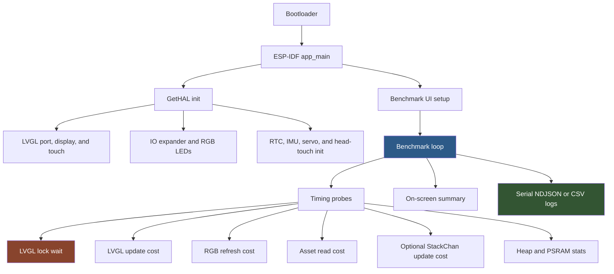

# Standalone Benchmark Harness: Analysis, Design, and Implementation Guide

## Executive summary

This document designs a minimal standalone benchmark firmware for the M5StackChan/CoreS3 platform. The benchmark is not a Mooncake app. It is a purpose-built `app_main()` that reuses the same hardware abstraction layer, LVGL port, display driver, RGB LED path, assets partition, and ESP-IDF build system, but removes the Mooncake app manager, launcher, XiaoZhi AI runtime, avatar modifiers, and production application loop from the hot path.

The goal is to answer a practical performance question: when the launcher animations feel choppy, is the limiting factor the hardware, the LVGL/display pipeline, the HAL initialization, the Mooncake scheduling pattern, the launcher itself, or a specific peripheral such as RGB LEDs or SPIFFS assets? A standalone benchmark gives us a theoretical ceiling: how fast the same device can update LVGL widgets, flush display frames, acquire the LVGL lock, refresh RGB LEDs, and run a paced main loop when the production framework is not competing for CPU time.

The benchmark should be implemented as a temporary benchmark build target or temporary replacement `main.cpp`, not as a normal StackChan app. It should print structured serial logs, show a live on-screen summary, and run a small matrix of pacing modes (`vTaskDelay(0)`, `vTaskDelay(1)`, ~60 FPS, ~30 FPS). It should also report min/avg/max/p95 timing for critical operations using `esp_timer_get_time()`.

> [!summary]
> - Build a standalone ESP-IDF benchmark firmware that calls `GetHAL().init()` and then runs its own paced loop without installing Mooncake apps.
> - Measure LVGL lock wait time, LVGL update time, display-frame cadence, RGB LED refresh time, SPIFFS/assets read latency, loop rate, heap pressure, and optional `StackChan::update()` cost.
> - Compare standalone results against production launcher behavior to separate hardware/display ceilings from Mooncake/launcher overhead.
> - Keep the benchmark read-only/safe by default: it should not modify NVS, OTA state, servo calibration, WiFi credentials, or cloud/account configuration.

## Problem statement and scope

The production launcher animations can feel choppy. The current evidence shows several plausible causes, but no single measurement proves which one dominates.

The firmware currently enters the Mooncake path in `main/main.cpp`: it initializes the HAL, installs the launcher and other apps, and then repeatedly calls `GetMooncake().update()` in the main loop. In the launcher app, `onLauncherRunning()` acquires an LVGL lock, updates the launcher view, updates the screensaver, and then calls `GetStackChan().update()` before releasing the lock. This pattern is safe from a data-race perspective but could create scheduling pressure: animation updates, avatar/motion/neon updates, LVGL object mutations, and display-render coordination all happen behind one coarse lock.

The benchmark is scoped to measurement and diagnosis, not production optimization. It should answer:

1. What is the best-case LVGL/UI update cadence on this hardware with the same HAL and display port?
2. How expensive is acquiring the LVGL lock under different loop pacing modes?
3. How expensive are representative operations: label update, animated object update, RGB LED refresh, asset lookup/read, and optional `StackChan::update()`?
4. Does adding a small `vTaskDelay()` improve smoothness by allowing the LVGL port task to run predictably?
5. How much heap/PSRAM headroom exists during benchmark operation?

Out of scope:

- Changing production launcher behavior.
- Rewriting the display driver.
- Building a polished UI profiler.
- Benchmarking XiaoZhi cloud/audio workloads.
- Producing final user-facing firmware.

## Current-state architecture and evidence

### Factory main loop

The factory entry point is `main/main.cpp`. It initializes the HAL, installs Mooncake apps, and runs the Mooncake main loop:

```cpp
GetHAL().init();
...
while (1) {
    GetHAL().feedTheDog();
    GetHAL().updateHeapStatusLog();
    GetMooncake().update();
    if (GetHAL().isXiaozhiStartRequested()) {
        break;
    }
}
```

Evidence:

- `/home/manuel/workspaces/2025-12-21/echo-base-documentation/M5StackChan/build/firmware/main/main.cpp:22-23` initializes the HAL.
- `main.cpp:33-42` installs apps.
- `main.cpp:44-54` runs the Mooncake loop.
- `Hal::feedTheDog()` in `main/hal/hal.cpp:66-69` is implemented as `vTaskDelay(1)`, so the production loop yields once per iteration before `GetMooncake().update()`.

The important nuance is that the production loop does yield, but the yield happens before all app updates. If one app's update holds the LVGL lock for too long or performs too much work, the later tasks still see jitter.

### Launcher hot path

The launcher update path is especially relevant because the choppy animation is observed on the main menu. `AppLauncher::onLauncherRunning()` holds a `LvglLockGuard` around its view update and then calls `GetStackChan().update()` while still inside the same scope:

```cpp
void AppLauncher::onLauncherRunning()
{
    LvglLockGuard lock;

    if (_startup_worker) {
        _startup_worker->update();
        ...
    } else {
        _view->update();
        screensaver_update();
    }

    GetStackChan().update();
}
```

Evidence:

- `/home/manuel/.../build/firmware/main/apps/app_launcher/app_launcher.cpp:37-54` contains this hot path.
- `app_launcher.cpp:39` acquires the LVGL lock.
- `app_launcher.cpp:49` updates the launcher view.
- `app_launcher.cpp:53` calls `GetStackChan().update()` before the lock guard goes out of scope.

This is a likely measurement target. It may be correct, but it means launcher smoothness depends not only on `_view->update()`, but also on the runtime cost of `GetStackChan().update()` and any LVGL lock contention caused by the display render task.

### HAL initialization

The HAL initializes many subsystems before LVGL is ready:

```cpp
nvs_flash_init();
xiaozhi_board_init();
xiaozhi_mcp_init();
head_touch_init();
io_expander_init();
rtc_init();
imu_init();
servo_init();
lvgl_init();
```

Evidence:

- `/home/manuel/.../build/firmware/main/hal/hal.cpp:23-43` defines `Hal::init()`.

For a standalone benchmark, using `GetHAL().init()` gives high fidelity: same board initialization, same LVGL port, same display driver, same IO expander, same touch input, same RGB LED path. The tradeoff is that it also initializes more than the benchmark strictly needs. That is acceptable for the first benchmark because the question is about the same firmware stack's performance ceiling, not a synthetic bare-metal display driver ceiling.

### LVGL port configuration

The CoreS3 display path uses Espressif's `esp_lvgl_port`. The StackChan display setup configures:

- LVGL port initialization via `lvgl_port_init()`.
- Task priority set to `3`.
- Task affinity set when multiple cores are present.
- Display buffer size set to `width * 20` pixels.
- RGB565 color format.
- DMA-capable display buffer.
- PSRAM image cache sized to 2 MB when 8 MB PSRAM is available.

Evidence:

- `/home/manuel/.../build/firmware/main/hal/board/stackchan_display.cc:120-127` initializes `lvgl_port` and sets task priority/affinity.
- `stackchan_display.cc:130-156` configures the display buffer and flags.
- `stackchan_display.cc:110-117` configures PSRAM image cache.
- `stackchan_display.cc:216-223` exposes lock/unlock through `lvgl_port_lock()` and `lvgl_port_unlock()`.

This is a central benchmark target. If the LVGL port task priority is low relative to main-loop work, a busy main loop can interfere with perceived smoothness. The benchmark should test several main-loop pacing modes to show whether yielding changes observed frame cadence.

### LVGL locking API

The StackChan HAL exposes `lvglLock()` and `lvglUnlock()`:

```cpp
void Hal::lvglLock()
{
    hal_bridge::disply_lvgl_lock();
}

void Hal::lvglUnlock()
{
    hal_bridge::disply_lvgl_unlock();
}
```

`LvglLockGuard` is a small RAII wrapper:

```cpp
class LvglLockGuard {
public:
    LvglLockGuard() { GetHAL().lvglLock(); }
    ~LvglLockGuard() { GetHAL().lvglUnlock(); }
};
```

Evidence:

- `/home/manuel/.../build/firmware/main/hal/hal.cpp:248-255` implements lock/unlock.
- `/home/manuel/.../build/firmware/main/hal/hal.h:324-334` defines `LvglLockGuard`.

The benchmark should measure both lock acquisition wait and lock-held duration. These are different. A long wait means another task owns LVGL. A long hold means this benchmark is blocking the render task.

### RGB LED path

The RGB LED HAL path is direct and measurable:

```cpp
void Hal::setRgbColor(uint8_t index, uint8_t r, uint8_t g, uint8_t b)
{
    if (!_io_expander) return;
    _io_expander->setLedColor(index, r, g, b);
}

void Hal::refreshRgb()
{
    if (!_io_expander) return;
    _io_expander->refreshLeds();
}
```

Evidence:

- `/home/manuel/.../build/firmware/main/hal/hal.h:234-237` declares `setRgbColor`, `showRgbColor`, and `refreshRgb`.
- `/home/manuel/.../build/firmware/main/hal/hal_io_expander.cpp:47-55` initializes RGB support and sets LED count to 12.
- `hal_io_expander.cpp:69-90` implements `setRgbColor`, `refreshRgb`, and `showRgbColor`.

RGB LED refresh should not be mixed into LVGL lock timing. It uses the IO expander path and should be measured separately.

### StackChan update path

`StackChan::update()` updates modifiers, avatar, motion, and neon light animations:

```cpp
void update()
{
    _modifier_pool.forEach(...);
    _modifier_pool.cleanup();
    if (_avatar) _avatar->update();
    if (_motion) _motion->update();
    _left_neon_light.update();
    _right_neon_light.update();
}
```

Evidence:

- `/home/manuel/.../build/firmware/main/stackchan/stackchan.h:130-145` defines the update sequence.

`NeonLight::update()` rate-limits itself to 50 Hz and only writes hardware when the animation is not done or needs to snap to target:

- `/home/manuel/.../build/firmware/main/stackchan/addons/neon_light/neon_light.cpp:20-49` defines the update behavior.
- `neon_light.cpp:26-29` limits update rate to every 20 ms.
- `neon_light.cpp:51-54` shows that `setColor()` queues a target rather than writing hardware immediately.

This path should be optional in the standalone benchmark. The first pass should avoid it to measure raw LVGL/display behavior. A second pass should include it to quantify the cost of production robot updates.

### Partition layout and assets

The firmware uses a 4 MB SPIFFS assets partition at `0xA00000` and dual OTA app partitions:

```csv
ota_0, app, ota_0, 0x20000, 0x4f0000,
ota_1, app, ota_1, ,        0x4f0000,
assets, data, spiffs, 0xA00000, 4M,
coredump, data, coredump, , 0x10000,
```

Evidence:

- `/home/manuel/.../build/firmware/partitions.csv:6-9` defines app, assets, and coredump partitions.

A benchmark that measures asset lookup should reuse this partition instead of embedding synthetic images. That keeps the measurement representative of launcher icon loading.

## Gap analysis

The existing firmware is observable through serial logs and subjective UI smoothness, but it does not expose the quantitative data needed to diagnose choppiness:

- No live FPS counter is shown on the launcher.
- No timing is logged for LVGL lock wait or hold duration.
- No timing is logged for launcher view update.
- No timing is logged for `GetStackChan().update()`.
- No timing is logged for RGB refresh or SPIFFS asset lookup.
- No benchmark mode runs the same LVGL/display stack without Mooncake.

Without these measurements, changes such as "add `vTaskDelay(1)`", "reduce animation complexity", "lower image cache", or "move `GetStackChan().update()` outside the lock" are guesses. The standalone benchmark gives the baseline numbers needed to evaluate those changes.

## Proposed architecture

### High-level shape

The benchmark should be a standalone firmware entry point that keeps the same project and component graph but replaces the application loop.



The benchmark is deliberately not a Mooncake app. If it were a Mooncake app, it would measure the system under the same framework overhead as production. That is useful later, but not for the theoretical ceiling. The first question is: how smooth can this hardware and HAL be when the app manager is removed?

### Runtime modes

The benchmark should run several modes, each for a fixed duration such as 10 seconds:

| Mode | Loop pacing | Purpose |
|------|-------------|---------|
| `busy` | no explicit delay except watchdog feed if needed | Stress test; shows worst-case contention and raw loop rate |
| `yield` | `taskYIELD()` or `vTaskDelay(0)` | Cooperative yield without sleeping for a tick |
| `tick-1ms` | `vTaskDelay(1)` | Common FreeRTOS-friendly loop; likely production candidate |
| `fps-60` | frame period ~16.67 ms | 60 FPS target, even if display cannot sustain it |
| `fps-30` | frame period ~33.33 ms | Stable target matching many embedded UIs |
| `with-stackchan-update` | repeat selected modes with `GetStackChan().update()` | Quantifies robot subsystem overhead |

Each mode should produce a summary record with min/avg/max/p95 timings.

### Output channels

Use two output channels:

1. **Serial log** — authoritative data for later analysis. Prefer CSV or NDJSON so it can be parsed.
2. **On-screen summary** — human-readable live display: mode name, loop rate, approximate FPS, lock wait p95, heap free.

The serial output should be more detailed than the screen. The screen should not become the benchmark bottleneck.

Example NDJSON summary shape:

```json
{"mode":"tick-1ms","duration_ms":10000,"loop_hz":872,"lvgl_lock_wait_us":{"avg":84,"p95":220,"max":1200},"label_update_us":{"avg":36,"p95":60,"max":310},"rgb_refresh_us":{"avg":940,"p95":1100,"max":1800},"heap_free":147000,"psram_free":7200000}
```

## Measurement design

### Time source

Use `esp_timer_get_time()` for microsecond timing. `GetHAL().millis()` is sufficient for human-scale app logic, but not for lock acquisition, RGB refresh, or label update timing.

```cpp
uint64_t now_us() {
    return esp_timer_get_time();
}
```

### Stats collector

Avoid allocating on every sample. Use a fixed-size ring buffer or streaming accumulators. A simple first implementation can store samples in a fixed `std::array<uint32_t, N>` for each metric and compute p95 at the end of each mode.

Important fields:

- `count`
- `min_us`
- `max_us`
- `sum_us`
- p50/p95/p99 if sample buffer sorting is acceptable
- dropped/overflow count if sample buffer fills

Pseudocode:

```text
struct Metric {
    samples[N]
    count
    min
    max
    sum

    record(value):
        if count < N: samples[count++] = value
        min = min(min, value)
        max = max(max, value)
        sum += value

    summarize():
        sort(samples[0:count])
        avg = sum / count
        p95 = samples[count * 95 / 100]
}
```

For long runs, keep `N` modest (e.g. 2048 samples per metric per mode) or sample every Nth loop to avoid turning the benchmark into a memory benchmark.

### LVGL lock wait vs hold time

Measure both:

```text
start = now_us()
GetHAL().lvglLock()
acquired = now_us()
perform LVGL operation
released_before = now_us()
GetHAL().lvglUnlock()
released_after = now_us()

lock_wait = acquired - start
lock_hold = released_before - acquired
unlock_cost = released_after - released_before
```

This distinction matters:

- High `lock_wait` means another task owns LVGL or the port task is busy.
- High `lock_hold` means the benchmark itself is doing too much while holding the lock.
- High `unlock_cost` is unusual and may indicate port-level behavior worth investigating.

### LVGL update operation

Use a fixed label and update it with a small changing integer. Avoid creating/destroying LVGL objects in the hot loop because object creation measures allocator pressure rather than animation cost.

Benchmark operations:

1. `lv_label_set_text_fmt(label, "loop %lu", loop_count)`
2. `lv_obj_set_x(obj, x)` or `lv_obj_set_pos(obj, x, y)` for animation-like movement
3. Optional: style change (`lv_obj_set_style_bg_color`) at lower frequency

A moving rectangle is useful because it resembles launcher animation more than a static label update.

### Frame cadence / display flush

There are two levels of FPS measurement:

1. **UI update FPS** — how often the benchmark changes LVGL object state.
2. **Display flush FPS** — how often LVGL/esp_lvgl_port actually flushes pixels to the display.

The first is easy: count benchmark loop iterations or object updates. The second may require deeper instrumentation in the display flush callback or the `esp_lvgl_port` layer. For the first iteration, treat it as optional and use the on-screen smoothness plus lock timing as a proxy. For the second iteration, add a tiny hook around the display flush callback if accessible in `stackchan_display.cc`.

### RGB LED timing

Measure the direct HAL path:

```cpp
uint64_t t0 = esp_timer_get_time();
for (int i = 0; i < 12; i++) {
    GetHAL().setRgbColor(i, r, g, b);
}
GetHAL().refreshRgb();
uint64_t rgb_us = esp_timer_get_time() - t0;
```

Run this at a low rate, such as 10 Hz, not every loop. Otherwise the benchmark will measure LED traffic instead of display smoothness.

### Asset timing

Measure one known asset lookup periodically:

```cpp
uint64_t t0 = esp_timer_get_time();
auto icon = assets::get_image("icon_setup.bin");
uint64_t asset_us = esp_timer_get_time() - t0;
```

Important caveat: repeated reads may hit caches. The benchmark should intentionally distinguish cold-ish and warm reads:

- Warm read: same asset repeatedly.
- Mixed read: rotate through several icons.
- Cold read: harder to force without cache eviction; do not overclaim.

### Heap and PSRAM

At each mode boundary, log:

- free internal heap
- minimum free internal heap
- free PSRAM if available
- largest free block for internal heap and PSRAM if possible

Use ESP-IDF heap APIs in the implementation. This tells whether choppiness correlates with low memory or fragmentation.

## Proposed implementation sequence

### Phase 1: Build a standalone entry point with HAL initialization

Create a benchmark source file under a clearly named path, for example:

```text
main/bench/benchmark_main.cpp
```

Then add a build-time switch that selects either production `main.cpp` or benchmark `benchmark_main.cpp` as the application entry point. Avoid manually editing `main.cpp` repeatedly after the first prototype.

Fast prototype option:

- Temporarily replace `main/main.cpp` with benchmark `app_main()`.
- Build/flash.
- Restore production `main.cpp` afterward.

Cleaner option:

- Add a Kconfig option such as `CONFIG_STACKCHAN_STANDALONE_BENCHMARK`.
- In `main/CMakeLists.txt`, include either `main.cpp` or `bench/benchmark_main.cpp`.

For an intern, the fast prototype is easier; for a reusable tool, the Kconfig option is better.

### Phase 2: Minimal on-screen UI

The UI should be deliberately simple:

- title label: `StackChan Benchmark`
- mode label: current mode
- metric label: loop Hz, lock p95, label p95, RGB avg, heap free
- moving rectangle or dot to visually judge smoothness

All LVGL object creation happens once during setup. The hot loop only updates text and moves one object.

### Phase 3: Mode runner

Implement a mode runner that executes one mode for a fixed duration:

```text
run_mode(mode, duration_ms):
    reset all metrics
    start_ms = millis()
    while millis() - start_ms < duration_ms:
        loop_start = now_us()

        if should_update_ui_this_iteration:
            measure_lvgl_label_update()
            measure_lvgl_object_move()

        if should_refresh_rgb_this_iteration:
            measure_rgb_refresh()

        if should_read_asset_this_iteration:
            measure_asset_lookup()

        apply_pacing(mode, loop_start)

    emit_summary(mode)
```

Do not update every metric on every loop. Some operations should be sampled periodically to avoid changing the workload too much.

### Phase 4: Serial output and log capture

Serial output should be parseable. Prefer one JSON line per mode summary, plus optional periodic progress lines:

```text
BENCH_START firmware=1.4.2 target=esp32s3 mode=tick-1ms
{"kind":"summary","mode":"tick-1ms",...}
BENCH_DONE
```

This makes it possible to collect logs with:

```bash
idf.py -p /dev/ttyACM0 monitor | tee /tmp/stackchan-bench.log
```

### Phase 5: Comparison runs

Run at least three firmware variants:

1. **Standalone benchmark, no Mooncake** — theoretical ceiling with same HAL.
2. **Mooncake benchmark app** — same benchmark logic inside Mooncake to measure framework overhead.
3. **Production launcher instrumentation** — lightweight timing around `_view->update()` and `GetStackChan().update()` to identify launcher-specific costs.

Only the first variant is in scope for this ticket, but the design should keep the comparison path clear.

## API sketch

### Benchmark mode enum

```cpp
enum class BenchMode {
    Busy,
    YieldOnly,
    Delay1Tick,
    Target60Fps,
    Target30Fps,
};
```

### Metric recorder

```cpp
class MetricRecorder {
public:
    void reset();
    void record(uint32_t us);
    MetricSummary summarize();
};
```

### Scoped timing helper

```cpp
class ScopedTimer {
public:
    ScopedTimer(MetricRecorder& metric) : _metric(metric), _start(esp_timer_get_time()) {}
    ~ScopedTimer() { _metric.record(esp_timer_get_time() - _start); }
private:
    MetricRecorder& _metric;
    int64_t _start;
};
```

### LVGL measured update

```cpp
void measured_label_update(lv_obj_t* label, MetricRecorder& wait, MetricRecorder& hold) {
    int64_t t0 = esp_timer_get_time();
    GetHAL().lvglLock();
    int64_t t1 = esp_timer_get_time();

    lv_label_set_text_fmt(label, "loop %lu", loop_count);

    int64_t t2 = esp_timer_get_time();
    GetHAL().lvglUnlock();

    wait.record(t1 - t0);
    hold.record(t2 - t1);
}
```

### RGB measured update

```cpp
void measured_rgb_update(MetricRecorder& metric, uint8_t r, uint8_t g, uint8_t b) {
    int64_t t0 = esp_timer_get_time();
    for (int i = 0; i < 12; i++) {
        GetHAL().setRgbColor(i, r, g, b);
    }
    GetHAL().refreshRgb();
    metric.record(esp_timer_get_time() - t0);
}
```

## Decision records

### Decision: Standalone benchmark instead of Mooncake app

- **Context:** The observed issue is launcher animation choppiness. A Mooncake app would measure the framework plus the benchmark, not the hardware/display ceiling.
- **Options considered:** Mooncake app, standalone `app_main()`, separate ESP-IDF project with copied drivers.
- **Decision:** Use standalone `app_main()` in the same firmware project, reusing `GetHAL().init()` and the same component graph.
- **Rationale:** This preserves hardware fidelity while removing Mooncake scheduling and launcher overhead.
- **Consequences:** The first benchmark cannot directly measure launcher overhead; it only establishes the ceiling. A second benchmark app can measure framework overhead later.
- **Status:** accepted.

### Decision: Reuse HAL initialization for first pass

- **Context:** A minimal display-only benchmark would be cleaner but would not use the same board initialization path as production firmware.
- **Options considered:** Full `GetHAL().init()`, custom display-only initialization, direct `esp_lvgl_port` setup copied from board files.
- **Decision:** Call `GetHAL().init()`.
- **Rationale:** The user's question is about the firmware on the actual device, not a synthetic display driver demo. HAL reuse captures real initialization, touch input, display port configuration, IO expander, and assets setup.
- **Consequences:** Some unused subsystems are initialized, so the absolute ceiling is lower than a display-only synthetic benchmark. This is acceptable and more relevant.
- **Status:** accepted.

### Decision: Separate lock wait from lock hold time

- **Context:** A single "LVGL update time" number can hide whether the benchmark is waiting for LVGL or blocking LVGL.
- **Options considered:** One duration around lock+operation, separate wait/hold/unlock metrics.
- **Decision:** Record wait time and hold time separately.
- **Rationale:** These numbers imply different fixes: priority/yield changes for high wait time, smaller lock scopes for high hold time.
- **Consequences:** Slightly more instrumentation complexity, much better diagnostics.
- **Status:** accepted.

### Decision: Use direct RGB HAL path for LED timing

- **Context:** The high-level `NeonLight` wrapper queues animation targets and only applies them during update.
- **Options considered:** `leftNeonLight().setColor()`, `GetStackChan().update()`, direct `GetHAL().setRgbColor()` + `refreshRgb()`.
- **Decision:** Measure direct HAL path.
- **Rationale:** The benchmark should measure the actual hardware push cost, not animation-layer behavior.
- **Consequences:** This does not measure production neon animation overhead unless explicitly added as a separate optional metric.
- **Status:** accepted.

## Testing and validation strategy

### Build validation

Commands:

```bash
source ~/esp/esp-idf-5.5.4/export.sh
cd /home/manuel/workspaces/2025-12-21/echo-base-documentation/M5StackChan/build/firmware
idf.py build
```

Expected:

- Build succeeds with no errors.
- `stack-chan.bin` remains below the 0x4f0000 app partition size.

### Flash validation

```bash
idf.py -p /dev/ttyACM0 flash monitor
```

Expected:

- Device boots into benchmark UI, not Mooncake launcher.
- Serial log prints `BENCH_START` and mode progress.
- No WDT, Guru Meditation, panic, or repeated reset.

### Runtime validation

Each mode should run for its configured duration and produce exactly one summary line. The on-screen display should update once per second. RGB LED tests should not dominate display tests; if they visibly affect smoothness, reduce their sampling frequency and record that result separately.

### Sanity checks

- `busy` mode should produce the highest loop rate and may produce worse lock/FPS behavior.
- `tick-1ms` should reduce lock contention if main-loop pressure is the issue.
- `fps-30` should produce the smoothest visual movement if the display path can sustain it.
- RGB refresh timing should be much slower than a simple label update, because it traverses IO expander/LED hardware.
- Repeated asset reads should get faster after warmup if caching is effective.

## Risks and mitigations

| Risk | Why it matters | Mitigation |
|------|----------------|------------|
| Benchmark changes the workload it measures | Too much serial logging or screen updating can dominate timing | Log summaries per mode, not per loop; update screen once per second |
| Full HAL init includes unused subsystems | Absolute ceiling lower than display-only benchmark | Document that this is the realistic HAL ceiling, not a bare display ceiling |
| LVGL flush FPS not directly measured | UI update FPS is not the same as real display FPS | Phase 2 can instrument display flush callback in `stackchan_display.cc` |
| Watchdog resets in busy mode | Busy mode may starve IDLE tasks | Keep busy mode short, feed/yield explicitly, record WDT as a finding if it happens |
| Asset reads are cached | Warm reads may understate cold SPIFFS latency | Rotate assets and label warm vs mixed reads clearly |
| Replacing `main.cpp` risks losing production state | Easy to accidentally flash benchmark over working firmware | Keep patch small, commit/stash separately, and document restore procedure |

## Recommended implementation plan for an intern

### Day 1: Read and map

Read these files first:

1. `main/main.cpp` — understand factory boot and Mooncake loop.
2. `main/hal/hal.cpp` — understand `GetHAL().init()`, `millis()`, `feedTheDog()`, `lvgl_init()`.
3. `main/hal/hal.h` — understand public HAL APIs and `LvglLockGuard`.
4. `main/hal/board/stackchan_display.cc` — understand LVGL port configuration.
5. `main/apps/app_launcher/app_launcher.cpp` — understand the production launcher hot path.
6. `main/hal/hal_io_expander.cpp` — understand RGB LED path.
7. `partitions.csv` — understand app/assets/coredump layout.

Deliverable: one-page notes describing where `app_main()`, LVGL locking, display flush, and RGB LEDs live.

### Day 2: Build the skeleton benchmark

Implement a temporary `benchmark_main.cpp` with:

- logger setup
- `GetHAL().init()`
- simple LVGL screen with labels
- infinite loop with `vTaskDelay(1)`
- serial `BENCH_START` line

Do not add all metrics yet. Validate that it boots and displays text.

### Day 3: Add timing metrics

Add:

- `MetricRecorder`
- lock wait/hold timing
- label update timing
- moving rectangle timing
- mode duration loop
- serial summary

Validate with one mode (`tick-1ms`) before adding mode matrix.

### Day 4: Add peripherals and mode matrix

Add:

- RGB refresh measurement at 10 Hz
- asset lookup measurement at 1 Hz
- heap stats at mode boundary
- modes: busy, yield, delay1, 60 FPS, 30 FPS

Validate each mode separately before running the full matrix.

### Day 5: Compare and report

Run full benchmark and save logs:

```bash
idf.py -p /dev/ttyACM0 flash monitor | tee /tmp/stackchan-standalone-benchmark.log
```

Write a short report:

- best smooth mode
- lock wait p95 by mode
- label update p95 by mode
- RGB refresh p95
- asset lookup p95
- heap/PSRAM headroom
- recommendation for production launcher investigation

## References

### Source files

- `/home/manuel/workspaces/2025-12-21/echo-base-documentation/M5StackChan/build/firmware/main/main.cpp`
- `/home/manuel/workspaces/2025-12-21/echo-base-documentation/M5StackChan/build/firmware/main/CMakeLists.txt`
- `/home/manuel/workspaces/2025-12-21/echo-base-documentation/M5StackChan/build/firmware/main/hal/hal.cpp`
- `/home/manuel/workspaces/2025-12-21/echo-base-documentation/M5StackChan/build/firmware/main/hal/hal.h`
- `/home/manuel/workspaces/2025-12-21/echo-base-documentation/M5StackChan/build/firmware/main/hal/board/stackchan_display.cc`
- `/home/manuel/workspaces/2025-12-21/echo-base-documentation/M5StackChan/build/firmware/main/apps/app_launcher/app_launcher.cpp`
- `/home/manuel/workspaces/2025-12-21/echo-base-documentation/M5StackChan/build/firmware/main/hal/hal_io_expander.cpp`
- `/home/manuel/workspaces/2025-12-21/echo-base-documentation/M5StackChan/build/firmware/main/stackchan/stackchan.h`
- `/home/manuel/workspaces/2025-12-21/echo-base-documentation/M5StackChan/build/firmware/main/stackchan/addons/neon_light/neon_light.cpp`
- `/home/manuel/workspaces/2025-12-21/echo-base-documentation/M5StackChan/build/firmware/partitions.csv`

### Existing documentation

- `/home/manuel/workspaces/2025-12-21/echo-base-documentation/M5StackChan/docs/guides/firmware-build-developer-guide.md`
- `/home/manuel/workspaces/2025-12-21/echo-base-documentation/esp32-s3-m5/ttmp/2026/06/11/M5STACKCHAN-BLINKY--build-and-flash-the-blinky-custom-app-intern-implementation-guide/design/01-blinky-custom-app-analysis-design-and-implementation-guide.md`
- `/home/manuel/workspaces/2025-12-21/echo-base-documentation/esp32-s3-m5/ttmp/2026/06/11/M5STACKCHAN-BENCH--standalone-cores3-benchmark-harness-for-stackchan-firmware-performance/reference/01-investigation-diary.md`

## Open questions

1. Should the first implementation use a temporary replacement `main.cpp` or a Kconfig-selectable benchmark entry point?
2. Does `esp_lvgl_port` expose a clean display flush hook that can be instrumented without forking the component?
3. Is the LVGL port task priority (`3`) appropriate for launcher smoothness, or is the main loop/lock scope the dominant issue?
4. How much does `GetStackChan().update()` cost when an avatar is attached versus when only neon lights are active?
5. Does PSRAM image-cache behavior correlate with icon-scroll stutter?

## Handoff checklist

- [ ] Benchmark skeleton boots and displays text.
- [ ] Serial log emits parseable mode summaries.
- [ ] LVGL lock wait and hold metrics are separated.
- [ ] Loop pacing modes are implemented.
- [ ] RGB and asset measurements are sampled, not run every loop.
- [ ] Logs are saved under `/tmp/stackchan-standalone-benchmark.log` or ticket `scripts/`/`sources/`.
- [ ] Results are compared against production launcher behavior.

## Appendix A: First Hardware Run Results (Phase 1)

The first stable standalone benchmark run completed after moving metric storage out of the ESP-IDF `main` task stack. Earlier versions crashed from watchdog pressure, LVGL label text allocation/free churn, and finally a `main` task stack overflow caused by large local sample buffers.

### Build and flash

Successful stack-safe benchmark build:

```text
stack-chan.bin binary size 0x2f1f40 bytes. Smallest app partition is 0x4f0000 bytes. 0x1fe0c0 bytes (40%) free.
```

Successful flash evidence:

```text
Hash of data verified.
Hard resetting via RTS pin...
Done
```

Logs:

```text
/tmp/stackchan-bench-build4.log
/tmp/stackchan-bench-flash4.log
/tmp/stackchan-bench-monitor4.log
```

### Raw serial summaries

```text
BENCH_SUMMARY mode=delay_1_tick duration_ms=10009 loop_count=974 loop_hz=97 heap_internal_free=209727 heap_internal_min=209015 psram_free=8059436 lvgl_wait_count=100 lvgl_wait_min_us=27 lvgl_wait_avg_us=1917 lvgl_wait_p95_us=17729 lvgl_wait_max_us=29682 lvgl_hold_count=100 lvgl_hold_min_us=753 lvgl_hold_avg_us=814 lvgl_hold_p95_us=827 lvgl_hold_max_us=1097 rgb_count=51 rgb_min_us=6170 rgb_avg_us=6912 rgb_p95_us=6749 rgb_max_us=15988 asset_count=11 asset_min_us=50 asset_avg_us=12660 asset_p95_us=138756 asset_max_us=138756
BENCH_SUMMARY mode=target_60_fps duration_ms=10009 loop_count=495 loop_hz=49 heap_internal_free=209515 heap_internal_min=209015 psram_free=8059436 lvgl_wait_count=100 lvgl_wait_min_us=25 lvgl_wait_avg_us=30 lvgl_wait_p95_us=33 lvgl_wait_max_us=42 lvgl_hold_count=100 lvgl_hold_min_us=755 lvgl_hold_avg_us=810 lvgl_hold_p95_us=830 lvgl_hold_max_us=945 rgb_count=50 rgb_min_us=6096 rgb_avg_us=6460 rgb_p95_us=6513 rgb_max_us=6530 asset_count=10 asset_min_us=53 asset_avg_us=58 asset_p95_us=82 asset_max_us=82
BENCH_SUMMARY mode=target_30_fps duration_ms=10029 loop_count=251 loop_hz=25 heap_internal_free=209727 heap_internal_min=209015 psram_free=8059436 lvgl_wait_count=84 lvgl_wait_min_us=25 lvgl_wait_avg_us=279 lvgl_wait_p95_us=31 lvgl_wait_max_us=7114 lvgl_hold_count=84 lvgl_hold_min_us=767 lvgl_hold_avg_us=805 lvgl_hold_p95_us=831 lvgl_hold_max_us=884 rgb_count=50 rgb_min_us=6048 rgb_avg_us=6162 rgb_p95_us=6525 rgb_max_us=6525 asset_count=10 asset_min_us=53 asset_avg_us=62 asset_p95_us=66 asset_max_us=66
BENCH_SUMMARY mode=yield duration_ms=10025 loop_count=1304294 loop_hz=130104 heap_internal_free=209727 heap_internal_min=209015 psram_free=8059436 lvgl_wait_count=101 lvgl_wait_min_us=26 lvgl_wait_avg_us=28 lvgl_wait_p95_us=30 lvgl_wait_max_us=34 lvgl_hold_count=101 lvgl_hold_min_us=749 lvgl_hold_avg_us=813 lvgl_hold_p95_us=834 lvgl_hold_max_us=839 rgb_count=51 rgb_min_us=6092 rgb_avg_us=6429 rgb_p95_us=6492 rgb_max_us=6495 asset_count=11 asset_min_us=52 asset_avg_us=56 asset_p95_us=103 asset_max_us=103
```

### Initial interpretation

- The simple LVGL update's lock hold time is about 0.8 ms.
- Direct refresh of all 12 RGB LEDs costs about 6-7 ms.
- Asset lookup is normally tens of microseconds after warmup, but the first mode saw a 138 ms outlier from first-use asset initialization/checksum/cache behavior.
- `target_60_fps` measured about 49 loop Hz with this pacing implementation, so future runs should distinguish `vTaskDelay(1)` pacing granularity from true display throughput.
- The standalone HAL/LVGL path is stable once benchmark-owned stack pressure is removed.
