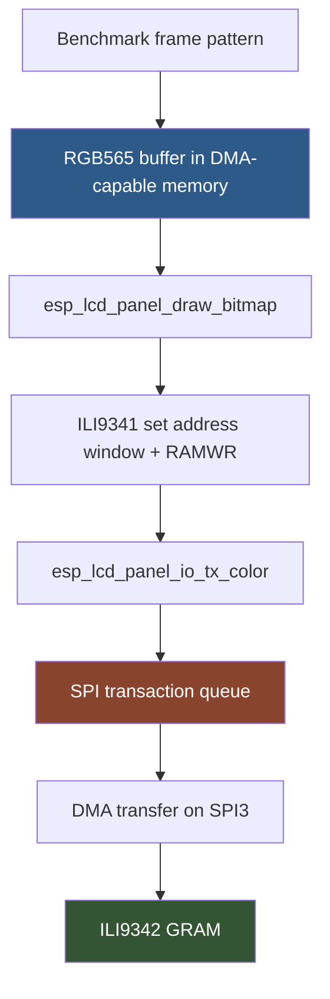

# Raw blit performance analysis design and implementation guide

## Executive summary

This ticket measures the raw LCD pixel-transfer limit of the M5StackChan/CoreS3 display path. The earlier standalone benchmark proved that small LVGL object updates can run stably and that the benchmark harness can collect serial timing data on real hardware. It did not measure full-screen frame throughput. This guide designs the next step: a raw blit benchmark that sends RGB565 rectangles directly to the LCD panel with `esp_lcd_panel_draw_bitmap()`, measures full-screen and partial-region transfer throughput, and experiments with safe SPI/display parameters to see how far the hardware can go.

The display is a 320×240 LCD initialized as an ILI9341-compatible ILI9342 panel over SPI3 at 40 MHz. A full RGB565 frame is 153,600 bytes. At the configured 40 MHz SPI clock, the theoretical payload-only ceiling is about 32.5 full-screen frames per second. That number ignores command overhead, DMA queueing, transaction gaps, render/fill cost, and FreeRTOS scheduling. The purpose of this benchmark is to replace the estimate with measured numbers.

The benchmark should be implemented as a Kconfig-selectable standalone firmware entry point, not as a production Mooncake app. It should reuse the real board initialization path so the panel, GPIOs, power management, and display orientation match the factory firmware. It should then bypass LVGL scene rendering and call the raw `esp_lcd` panel API directly. The benchmark should print structured `RAWBLIT_SUMMARY` lines over serial and show enough on-screen color patterns to verify that full-screen and partial-rectangle transfers are actually happening.

> [!summary]
> - Measure raw LCD transfer throughput separately from LVGL object-update cost.
> - Test full-screen, half-screen, quarter-screen, and small-rectangle RGB565 blits.
> - Distinguish CPU pattern-fill time, `esp_lcd_panel_draw_bitmap()` submit/blocking time, and transfer-completion cadence where possible.
> - Experiment cautiously with SPI pixel clock, transaction queue depth, chunk height, and buffer placement, always keeping a known-good 40 MHz baseline.
> - Treat any FPS number as meaningful only when it is tied to the number of pixels actually transferred.

## Problem statement

The previous benchmark answered one question: a small LVGL update consisting of two labels and a moving dot holds the LVGL lock for roughly 0.8 ms. That is useful, but it does not tell us the maximum full-screen animation rate. Small updates and full-screen updates stress different parts of the system.

A small LVGL update may invalidate only a few thousand pixels. A full-screen transition invalidates 76,800 pixels. Because each pixel is RGB565, a full-screen transfer sends 153,600 bytes. At 40 MHz SPI, this is already close to a 30 FPS ceiling before software overhead. If the launcher animation is choppy, we need to know whether it is hitting this pixel-transfer ceiling or whether the problem is elsewhere: LVGL lock scope, Mooncake scheduling, asset loading, RGB LED refresh, or production app logic.

This ticket should answer these specific questions:

1. What is the measured full-screen RGB565 blit throughput at the current 40 MHz SPI configuration?
2. How does throughput scale with smaller invalidated rectangles?
3. Does chunking a full-screen frame into 20-line, 40-line, 80-line, or full-frame transfers change throughput?
4. Does using one static DMA-capable buffer differ from double buffering?
5. How much of each frame is spent filling the CPU-side buffer versus submitting/waiting for LCD transfer?
6. Can safe SPI parameter changes improve throughput without making the display unstable?
7. How should these raw numbers constrain later LVGL and launcher optimization work?

Out of scope for the first pass:

- Rewriting the panel driver.
- Changing production launcher behavior.
- Permanently changing factory firmware display parameters.
- Measuring camera, audio, Wi-Fi, or AI workloads.
- Claiming final user-visible FPS before LVGL flush-completion instrumentation exists.

## Current display architecture

The relevant firmware files are:

| File | Why it matters |
|---|---|
| `/home/manuel/workspaces/2025-12-21/echo-base-documentation/M5StackChan/build/firmware/main/hal/board/config.h` | Defines `DISPLAY_WIDTH=320`, `DISPLAY_HEIGHT=240`, orientation flags, and offsets. |
| `/home/manuel/workspaces/2025-12-21/echo-base-documentation/M5StackChan/build/firmware/main/hal/board/stackchan.cc` | Initializes SPI3, creates the panel IO, installs the ILI9341-compatible driver, resets/initializes the ILI9342 panel. |
| `/home/manuel/workspaces/2025-12-21/echo-base-documentation/M5StackChan/build/firmware/main/hal/board/stackchan_display.cc` | Adds the panel to `esp_lvgl_port`, configures the LVGL draw buffer, RGB565 format, DMA buffer, and LVGL task. |
| `/home/manuel/workspaces/2025-12-21/echo-base-documentation/M5StackChan/build/firmware/main/bench/benchmark_main.cpp` | Existing standalone benchmark pattern: Kconfig entry point, metric recorder, serial summaries, stack-safe storage. |
| `/home/manuel/esp/esp-idf-5.5.4/components/esp_lcd/include/esp_lcd_panel_ops.h` | Declares `esp_lcd_panel_draw_bitmap()`. |
| `/home/manuel/esp/esp-idf-5.5.4/components/esp_lcd/include/esp_lcd_panel_io.h` | Declares `esp_lcd_panel_io_register_event_callbacks()` and explains color transfer callbacks. |
| `/home/manuel/esp/esp-idf-5.5.4/components/esp_lcd/include/esp_lcd_types.h` | Defines `esp_lcd_panel_io_color_trans_done_cb_t` and callback structs. |

The board initializes SPI like this:

```cpp
void InitializeSpi()
{
    spi_bus_config_t buscfg = {};
    buscfg.mosi_io_num      = GPIO_NUM_37;
    buscfg.miso_io_num      = GPIO_NUM_NC;
    buscfg.sclk_io_num      = GPIO_NUM_36;
    buscfg.quadwp_io_num    = GPIO_NUM_NC;
    buscfg.quadhd_io_num    = GPIO_NUM_NC;
    buscfg.max_transfer_sz  = DISPLAY_WIDTH * DISPLAY_HEIGHT * sizeof(uint16_t);
    ESP_ERROR_CHECK(spi_bus_initialize(SPI3_HOST, &buscfg, SPI_DMA_CH_AUTO));
}
```

The panel IO is SPI3 at 40 MHz:

```cpp
esp_lcd_panel_io_spi_config_t io_config = {};
io_config.cs_gpio_num       = GPIO_NUM_3;
io_config.dc_gpio_num       = GPIO_NUM_35;
io_config.spi_mode          = 2;
io_config.pclk_hz           = 40 * 1000 * 1000;
io_config.trans_queue_depth = 10;
io_config.lcd_cmd_bits      = 8;
io_config.lcd_param_bits    = 8;
ESP_ERROR_CHECK(esp_lcd_new_panel_io_spi(SPI3_HOST, &io_config, &panel_io));
```

The panel driver is installed as ILI9341-compatible with RGB565/BGR order:

```cpp
esp_lcd_panel_dev_config_t panel_config = {};
panel_config.reset_gpio_num = GPIO_NUM_NC;
panel_config.rgb_ele_order  = LCD_RGB_ELEMENT_ORDER_BGR;
panel_config.bits_per_pixel = 16;
ESP_ERROR_CHECK(esp_lcd_new_panel_ili9341(panel_io, &panel_config, &panel));
```

The LVGL port uses a 20-line DMA-capable draw buffer:

```cpp
const lvgl_port_display_cfg_t display_cfg = {
    .buffer_size   = static_cast<uint32_t>(width_ * 20),
    .double_buffer = false,
    .hres          = static_cast<uint32_t>(width_),
    .vres          = static_cast<uint32_t>(height_),
    .color_format  = LV_COLOR_FORMAT_RGB565,
    .flags = {
        .buff_dma     = 1,
        .buff_spiram  = 0,
        .swap_bytes   = 1,
        .full_refresh = 0,
        .direct_mode  = 0,
    },
};
```

The raw blit benchmark should start with these exact defaults. Optimization experiments only make sense after a baseline exists.

## Mental model: what a raw blit measures

A raw blit is a rectangle transfer from CPU-visible memory to the LCD panel. The data path is:



There are at least three timings:

1. **Fill time:** how long the CPU takes to generate the RGB565 pattern in memory.
2. **Submit/block time:** how long `esp_lcd_panel_draw_bitmap()` takes to return.
3. **Completion time:** how long until the SPI transfer has actually finished.

The second and third are not always the same. The ESP-IDF panel IO layer can queue SPI transactions. A call to `draw_bitmap()` may return after queueing the transfer, while the DMA transaction continues. If the benchmark calls `draw_bitmap()` repeatedly, later calls may block when the transaction queue fills. That means a long batch can still reveal steady-state throughput even if individual submit calls are asynchronous.

The cleanest benchmark records both:

```cpp
t_submit_start = esp_timer_get_time();
esp_lcd_panel_draw_bitmap(panel, x0, y0, x1, y1, buffer);
t_submit_end = esp_timer_get_time();
wait_for_transfer_done_callback();
t_done = esp_timer_get_time();

submit_us = t_submit_end - t_submit_start;
complete_us = t_done - t_submit_start;
```

If callback-based completion timing conflicts with `esp_lvgl_port`, the first implementation can use batch timing instead:

```cpp
t0 = esp_timer_get_time();
for i in 0..N:
    esp_lcd_panel_draw_bitmap(panel, x0, y0, x1, y1, buffer[i % buffers]);
t1 = esp_timer_get_time();

batch_fps = N * 1_000_000 / (t1 - t0);
```

Batch timing is less precise for the first few queued transfers, but it becomes useful once the queue is saturated.

## Design decision: reuse board init, expose panel handles

The benchmark should reuse `GetHAL().init()` or the same board initialization path rather than duplicating display bring-up. The reason is correctness. The panel reset, power state, display orientation, color inversion, SPI mode, and GPIO choices are already encoded in the board code. A clean-room display init might measure a different configuration.

The problem is that the public HAL currently exposes the LVGL display handle but not the raw `esp_lcd` panel handle or panel IO handle. The guide therefore recommends a small benchmark-oriented accessor:

```cpp
// stackchan_display.h
esp_lcd_panel_handle_t GetPanelHandle() const { return panel_; }
esp_lcd_panel_io_handle_t GetPanelIoHandle() const { return panel_io_; }

// hal_bridge.h
esp_lcd_panel_handle_t display_get_panel_handle();
esp_lcd_panel_io_handle_t display_get_panel_io_handle();
```

This is intentionally narrow. It does not expose the whole board object or make production app code depend on raw LCD handles. It simply lets benchmark code use the same initialized panel that LVGL uses.

A reviewer should confirm whether this accessor should remain behind a Kconfig guard. For local benchmark work, it is acceptable as an internal HAL bridge function because the firmware tree is already being modified for benchmark entry points.

## Benchmark matrix

The first benchmark matrix should be small enough to run quickly and rich enough to show scaling.

### Region sizes

| Name | Rectangle | Pixels | Bytes/frame | 40 MHz payload-only ceiling |
|---|---:|---:|---:|---:|
| `full_320x240` | 320×240 | 76,800 | 153,600 | 32.55 FPS |
| `half_320x120` | 320×120 | 38,400 | 76,800 | 65.10 FPS |
| `quarter_160x120` | 160×120 | 19,200 | 38,400 | 130.21 FPS |
| `tile_80x60` | 80×60 | 4,800 | 9,600 | 520.83 FPS |
| `tile_32x32` | 32×32 | 1,024 | 2,048 | 2441.41 FPS |

The benchmark should always print the byte count so results can be converted to effective MB/s:

```text
effective_MBps = bytes_transferred / seconds / 1_000_000
effective_bus_utilization = effective_MBps / 5.0
```

### Chunk heights

For full-width blits, test several chunk heights:

| Chunk height | Bytes/chunk | Chunks/full frame | Why test it |
|---:|---:|---:|---|
| 20 lines | 12,800 | 12 | Matches current LVGL draw-buffer height. |
| 40 lines | 25,600 | 6 | Tests whether larger chunks reduce command/queue overhead. |
| 80 lines | 51,200 | 3 | Larger DMA transactions, fewer address-window commands. |
| 240 lines | 153,600 | 1 | Maximum full-screen transfer, possible best throughput if memory permits. |

### Buffer modes

| Mode | Description | Why test it |
|---|---|---|
| `single_static` | One DMA-capable buffer reused for every transfer after waiting/completion. | Safest baseline. |
| `double_static` | Two DMA-capable buffers alternated between transfers. | Lets CPU fill one buffer while previous transfer is queued/done, if synchronized correctly. |
| `psram_source` | Source buffer allocated in PSRAM if accepted by driver. | Tests whether PSRAM source hurts DMA behavior or requires internal bounce/copy. |

For the first pass, use DMA-capable internal memory via `heap_caps_malloc(size, MALLOC_CAP_DMA | MALLOC_CAP_INTERNAL)`. Full-screen internal allocation may fail depending on heap state, so the benchmark should handle failure and fall back to chunked transfers.

## Output format

Use one structured line per test case:

```text
RAWBLIT_SUMMARY region=full_320x240 w=320 h=240 bytes=153600 chunk_h=240 clock_hz=40000000 queue_depth=10 buffers=1 frames=120 elapsed_us=3860000 fps=31.09 mbps=4.77 fill_avg_us=900 submit_avg_us=31500 complete_avg_us=32100 heap_free=...
```

Keep names stable so scripts can parse them later. Include:

- region name
- width/height
- bytes per frame
- chunk height
- SPI clock
- queue depth
- buffer count/mode
- frame count
- elapsed microseconds
- FPS
- effective MB/s
- fill min/avg/p95/max
- submit min/avg/p95/max
- completion min/avg/p95/max when available
- heap free/minimum free

## Implementation sketch

### Kconfig and CMake

Add a second benchmark switch next to the existing standalone benchmark:

```kconfig
config STACKCHAN_RAW_BLIT_BENCHMARK
    bool "Build raw LCD blit benchmark firmware"
    default n
    help
        Replace the production Mooncake entry point with a raw LCD blit
        benchmark that measures esp_lcd_panel_draw_bitmap throughput.
```

CMake should select entry points in priority order:

```cmake
if(CONFIG_STACKCHAN_RAW_BLIT_BENCHMARK)
    list(APPEND MAIN_SRCS bench/raw_blit_benchmark_main.cpp)
elseif(CONFIG_STACKCHAN_STANDALONE_BENCHMARK)
    list(APPEND MAIN_SRCS bench/benchmark_main.cpp)
else()
    list(APPEND MAIN_SRCS main.cpp)
endif()
```

Only one benchmark should be enabled at a time.

### Panel handle accessors

Add public getters to `StackChanAvatarDisplay`:

```cpp
esp_lcd_panel_handle_t GetPanelHandle() const;
esp_lcd_panel_io_handle_t GetPanelIoHandle() const;
```

Implement bridge functions:

```cpp
esp_lcd_panel_handle_t display_get_panel_handle()
{
    auto display = static_cast<StackChanAvatarDisplay*>(Board::GetInstance().GetDisplay());
    return display->GetPanelHandle();
}

esp_lcd_panel_io_handle_t display_get_panel_io_handle()
{
    auto display = static_cast<StackChanAvatarDisplay*>(Board::GetInstance().GetDisplay());
    return display->GetPanelIoHandle();
}
```

### Benchmark flow

```cpp
extern "C" void app_main(void)
{
    init_logging();
    GetHAL().init();

    panel = hal_bridge::display_get_panel_handle();
    panel_io = hal_bridge::display_get_panel_io_handle();

    maybe_register_color_done_callback(panel_io);

    for clock in selected_clock_configs:
        // first implementation may only use compiled 40 MHz
        for region in region_matrix:
            for chunk_h in chunk_matrix:
                run_case(region, chunk_h, buffer_mode);

    while (true) {
        vTaskDelay(pdMS_TO_TICKS(1000));
    }
}
```

### Run case pseudocode

```cpp
run_case(region, chunk_h, buffer_mode):
    allocate one or two buffers sized for min(region_h, chunk_h)
    warm up with 3 frames
    reset metrics
    start = now_us()

    while now_us() - start < duration_us:
        for y in region_y .. region_y + region_h step chunk_h:
            h = min(chunk_h, remaining)
            fill buffer with color pattern for current frame/y
            t0 = now_us()
            esp_lcd_panel_draw_bitmap(panel, x, y, x + w, y + h, buffer)
            t1 = now_us()
            optionally wait for transfer done
            t2 = now_us()
            record submit and completion timings
        frames++

    elapsed = now_us() - start
    print RAWBLIT_SUMMARY
```

### Pattern generation

The pattern should change each frame so a human can see that transfers are real. Keep it cheap:

```cpp
uint16_t make_rgb565(uint32_t frame, int x, int y)
{
    uint8_t r = (frame * 3 + x) & 0x1F;
    uint8_t g = (frame * 2 + y) & 0x3F;
    uint8_t b = (frame + x + y) & 0x1F;
    return (r << 11) | (g << 5) | b;
}
```

For fill-cost isolation, run both:

1. `pattern=solid_precomputed` — buffer filled once, transfer only.
2. `pattern=generated_each_frame` — includes CPU fill cost.

The first isolates transfer. The second is closer to animation.

## Optimization experiments

Optimization should be staged. Do not change all parameters at once.

### Experiment 1: chunk height

Keep SPI at 40 MHz and queue depth at 10. Compare chunk heights 20, 40, 80, 240. If larger chunks improve throughput, command/transaction overhead is significant. If not, bus bandwidth dominates.

### Experiment 2: queue depth

Queue depth is currently 10. The raw benchmark can test build-time variants such as 2, 4, 8, 10, 16. Queue depth affects how many transactions can be in flight. It may help chunked transfers, but it also consumes memory and can make synchronization harder.

### Experiment 3: SPI pixel clock

The baseline is 40 MHz. Test higher clocks only after the 40 MHz result is stable. Candidate build-time values:

- 40 MHz baseline.
- 60 MHz cautious increase.
- 80 MHz aggressive upper experiment.

Every clock increase requires visual verification. A faster SPI clock that produces corrupted colors, tearing, or intermittent panel lockups is not a usable optimization.

### Experiment 4: buffer count and placement

Compare one versus two DMA-capable internal buffers. If double buffering helps, the benchmark may be overlapping fill and transfer. If not, the transfer is probably synchronous enough or fill cost is too small.

PSRAM source buffers should be treated carefully. Some SPI DMA paths require DMA-capable internal memory. If PSRAM works, it may still perform worse or use an internal bounce buffer. Record allocation flags and failures explicitly.

## Risks and failure modes

| Risk | Symptom | Mitigation |
|---|---|---|
| Overwriting LVGL panel callback breaks LVGL flush state | Display task stalls or crashes | Avoid LVGL object updates during raw benchmark; prefer batch timing if callback conflicts. |
| Source buffer reused before DMA transfer completes | Corrupted colors or random stripes | Wait for transfer completion or use enough buffers and strict ownership. |
| Full-screen DMA buffer allocation fails | `heap_caps_malloc` returns null | Fall back to chunked transfers and print allocation failure. |
| SPI clock too high | Color corruption, blank display, resets | Start at 40 MHz; test increments; keep serial logs. |
| Queue-depth experiments hide completion timing | Submit calls look fast but real transfer is still pending | Measure long batches or callback completion. |
| Benchmark itself causes watchdog issues | WDT reset before summaries | Use `vTaskDelay(1)` between cases and avoid busy infinite loops. |
| Pattern generation dominates transfer | Low FPS unrelated to LCD | Include precomputed-solid transfer-only mode. |

## Validation plan

A successful first implementation must show:

1. Firmware builds with `CONFIG_STACKCHAN_RAW_BLIT_BENCHMARK=y`.
2. Firmware flashes to `/dev/ttyACM0`.
3. Device boots and prints `RAWBLIT_BOOT`.
4. Display shows changing full-screen or rectangle patterns.
5. Serial log contains `RAWBLIT_SUMMARY` for at least:
   - full screen 320×240,
   - half screen 320×120,
   - quarter screen 160×120,
   - 80×60 tile,
   - 32×32 tile.
6. No WDT, panic, stack overflow, or heap assertion appears during a full run.
7. Results include effective MB/s and FPS.
8. The guide and diary are updated with measured results.

## How to interpret results

If full-screen throughput is near 30–32 FPS, the display bus is already close to the theoretical limit. Launcher optimization should then focus on reducing invalidated area rather than trying to push the whole screen faster.

If full-screen throughput is far below 30 FPS, inspect chunking, queueing, buffer placement, and SPI clock. The bottleneck may be transaction overhead, not payload bandwidth.

If small rectangles are much faster than full-screen but launcher animation remains choppy, the production launcher may be invalidating too much area, holding the LVGL lock too long, or doing non-display work in the animation path.

If raw blits are fast but LVGL full-screen invalidation is slow, LVGL render cost or flush integration is the next target.

## References

- Existing draw-performance article in the vault:
  - `/home/manuel/code/wesen/go-go-golems/go-go-parc/Projects/2026/06/11/ARTICLE - M5StackChan - Measuring Draw Performance and Display Pipeline Limits.md`
- Previous benchmark ticket:
  - `/home/manuel/workspaces/2025-12-21/echo-base-documentation/esp32-s3-m5/ttmp/2026/06/11/M5STACKCHAN-BENCH--standalone-cores3-benchmark-harness-for-stackchan-firmware-performance/`
- Firmware working copy:
  - `/home/manuel/workspaces/2025-12-21/echo-base-documentation/M5StackChan/build/firmware/`
- ESP-IDF version:
  - `/home/manuel/esp/esp-idf-5.5.4/`

## Appendix A: Implementation and first hardware measurements

The raw blit benchmark was implemented as a second Kconfig-selectable benchmark entry point. The implementation reuses the normal StackChan HAL and board initialization, then obtains the initialized `esp_lcd_panel_handle_t` and `esp_lcd_panel_io_handle_t` through narrow benchmark accessors on `StackChanAvatarDisplay` and `hal_bridge`.

### Files changed

| File | Change |
|---|---|
| `main/Kconfig.projbuild` | Added `CONFIG_STACKCHAN_RAW_BLIT_BENCHMARK` and `CONFIG_STACKCHAN_LCD_PIXEL_CLOCK_HZ`. |
| `main/CMakeLists.txt` | Selects `bench/raw_blit_benchmark_main.cpp` when raw blit benchmark is enabled. |
| `main/hal/board/stackchan_display.h` | Added getters for raw panel and panel IO handles. |
| `main/hal/board/hal_bridge.h` | Declared raw panel bridge accessors. |
| `main/hal/board/hal_bridge.cc` | Implemented raw panel bridge accessors. |
| `main/hal/board/stackchan.cc` | Uses `CONFIG_STACKCHAN_LCD_PIXEL_CLOCK_HZ` for LCD SPI `pclk_hz`. |
| `main/bench/raw_blit_benchmark_main.cpp` | New raw blit benchmark entry point. |
| `sdkconfig.defaults.local` | Locally enables raw blit benchmark and selects tested pixel clock. |

### Build result

The raw blit benchmark builds successfully:

```text
stack-chan.bin binary size 0x25a6f0 bytes. Smallest app partition is 0x4f0000 bytes. 0x295910 bytes (52%) free.
```

Important logs:

```text
/tmp/stackchan-rawblit-40-build.log
/tmp/stackchan-rawblit-40-flash.log
/tmp/stackchan-rawblit-40-monitor.log
/tmp/stackchan-rawblit-60-build.log
/tmp/stackchan-rawblit-60-flash.log
/tmp/stackchan-rawblit-60-monitor.log
/tmp/stackchan-rawblit-80-build.log
/tmp/stackchan-rawblit-80-flash.log
/tmp/stackchan-rawblit-80-monitor.log
```

### First failure and fix

The first raw benchmark build flashed successfully but rebooted while printing the first summary:

```text
RAWBLIT_SUMMARY case=full_320x240_chunk80 ... elapsed_us=lu fps_x100Guru Meditation Error: Core  0 panic'ed (LoadProhibited).
```

The cause was a `printf` format issue: the ESP-IDF/newlib printf path did not handle the `%llu` formatting used for `elapsed_us`. The fix was to clamp the elapsed value to `uint32_t` for the summary line and print it with `%lu`.

This is a measurement lesson: serial reporting code is part of the firmware. A benchmark can complete its measurement and still fail if the reporting path uses unsupported or mismatched format specifiers.

### Raw hardware results

The benchmark measured full-screen and partial-region RGB565 blits at 40 MHz, 60 MHz, and 80 MHz requested LCD SPI pixel clocks. The summary lines report `fps_x100`, so `2500` means `25.00 FPS`.

#### 40 MHz baseline

| Case | Chunk | Pattern | FPS | Effective MB/s | Notes |
|---|---:|---|---:|---:|---|
| `full_320x240_chunk240` | 240 | generated | — | — | Allocation failed: 153,600-byte contiguous DMA buffer unavailable after HAL init. |
| `full_320x240_chunk120` | 120 | generated | 25.00 | 3.84 | Best 40 MHz full-screen generated case. |
| `full_320x240_chunk80` | 80 | generated | 22.18 | 3.40 | Lower than 120-line chunks due more transactions. |
| `full_320x240_chunk80_solid` | 80 | solid | 24.27 | 3.72 | Reduced fill cost improves FPS. |
| `full_320x240_chunk40` | 40 | generated | 16.66 | 2.56 | Transaction/chunk overhead dominates. |
| `full_320x240_chunk20` | 20 | generated | 16.30 | 2.50 | Similar to 40-line case, much more transaction overhead. |
| `half_320x120_chunk40` | 40 | generated | 33.33 | 2.56 | Same MB/s as full chunk40, doubled FPS because half bytes/frame. |
| `quarter_160x120_chunk40` | 40 | generated | 61.69 | 2.36 | Smaller region, lower effective MB/s due overhead. |
| `tile_80x60_chunk60` | 60 | generated | 198.89 | 1.90 | Small-rectangle overhead significant. |
| `tile_32x32_chunk32` | 32 | generated | 266.08 | 0.54 | Dominated by command/transaction overhead, not payload bandwidth. |

#### 60 MHz requested clock

The 60 MHz run was stable but produced effectively the same timings as 40 MHz. For example:

| Case | 40 MHz FPS | 60 MHz requested FPS |
|---|---:|---:|
| `full_320x240_chunk120` | 25.00 | 25.00 |
| `full_320x240_chunk80` | 22.18 | 22.18 |
| `full_320x240_chunk40` | 16.66 | 16.66 |
| `half_320x120_chunk40` | 33.33 | 33.33 |

The likely explanation is SPI clock quantization/divider behavior. The requested 60 MHz does not appear to produce a real 60 MHz transfer on this path. The benchmark still prints `clock_hz=60000000` because that is the configured value, but measured completion timing did not improve.

#### 80 MHz requested clock

The 80 MHz run was stable in serial logs and significantly faster. Visual corruption was not independently documented, so this should be treated as a promising measurement that still needs human visual confirmation.

| Case | Chunk | Pattern | FPS | Effective MB/s | Notes |
|---|---:|---|---:|---:|---|
| `full_320x240_chunk240` | 240 | generated | — | — | Allocation still failed for full-frame DMA buffer. |
| `full_320x240_chunk120` | 120 | generated | 36.42 | 5.59 | Best measured full-screen case. |
| `full_320x240_chunk80` | 80 | generated | 33.33 | 5.12 | Reaches roughly the old 40 MHz theoretical full-screen limit. |
| `full_320x240_chunk80_solid` | 80 | solid | 33.33 | 5.12 | Solid fill did not improve over generated at this clock/chunk shape. |
| `full_320x240_chunk40` | 40 | generated | 31.91 | 4.90 | Much better than 40 MHz, but still below chunk120. |
| `full_320x240_chunk20` | 20 | generated | 24.19 | 3.71 | Too much transaction overhead. |
| `half_320x120_chunk40` | 40 | generated | 61.43 | 4.71 | Good partial-region throughput. |
| `quarter_160x120_chunk40` | 40 | generated | 89.55 | 3.43 | Effective MB/s lower because overhead dominates smaller regions. |
| `tile_80x60_chunk60` | 60 | generated | 263.69 | 2.53 | Small tile still overhead limited. |
| `tile_32x32_chunk32` | 32 | generated | 268.87 | 0.55 | Tiny tile mostly measures fixed transaction overhead. |

### Interpretation

The best measured full-screen result so far is:

```text
80 MHz requested pclk, 320×240, 120-line chunks, generated pattern:
36.42 FPS, 5.59 MB/s
```

At the factory 40 MHz pclk, the best full-screen generated case is:

```text
40 MHz pclk, 320×240, 120-line chunks, generated pattern:
25.00 FPS, 3.84 MB/s
```

The full-frame 240-line transfer could not be tested with an internal DMA buffer because the 153,600-byte contiguous allocation failed after HAL initialization. That does not mean full-screen updates are impossible; the 120-line, 80-line, 40-line, and 20-line chunked cases all update the full 320×240 screen. It means one full-frame DMA-capable internal buffer is not available in this firmware state.

The chunk-height result is clear: larger chunks improve full-screen throughput until allocation constraints intervene. On this hardware/firmware state, 120-line chunks are better than 80-line, 40-line, or 20-line chunks. The current LVGL draw buffer is only 20 lines high, so LVGL full-screen flushes may be leaving throughput on the table compared with a larger flush buffer.

The 60 MHz result is also informative. It did not improve. The next reviewer should confirm the ESP32-S3 SPI clock-divider behavior and the actual clock emitted on SCLK with a logic analyzer. Based on measured timing, 60 MHz requested behaves like 40 MHz, while 80 MHz requested changes the actual transfer rate.

### Optimization implications

1. **If 80 MHz is visually stable, it is the most promising simple throughput optimization.** It raises full-screen raw blit throughput from 25 FPS to 36 FPS in the best generated-pattern case.
2. **Chunk height matters.** The 120-line chunks outperform smaller chunks. The production LVGL buffer is 20 lines, so increasing LVGL buffer size may improve full-screen and large-region animation throughput if enough DMA-capable memory is available.
3. **Tiny rectangles are overhead-bound.** Small 32×32 blits have high FPS but low MB/s. This is expected: fixed command and transaction overhead dominate payload transfer.
4. **One full-frame internal DMA buffer is not available after normal HAL init.** Any full-frame buffering strategy would need PSRAM, bounce buffering, earlier allocation, or a display-only initialization path.
5. **FPS must always be attached to region size.** A 268 FPS 32×32 tile is not comparable to a 36 FPS 320×240 full-screen blit.
