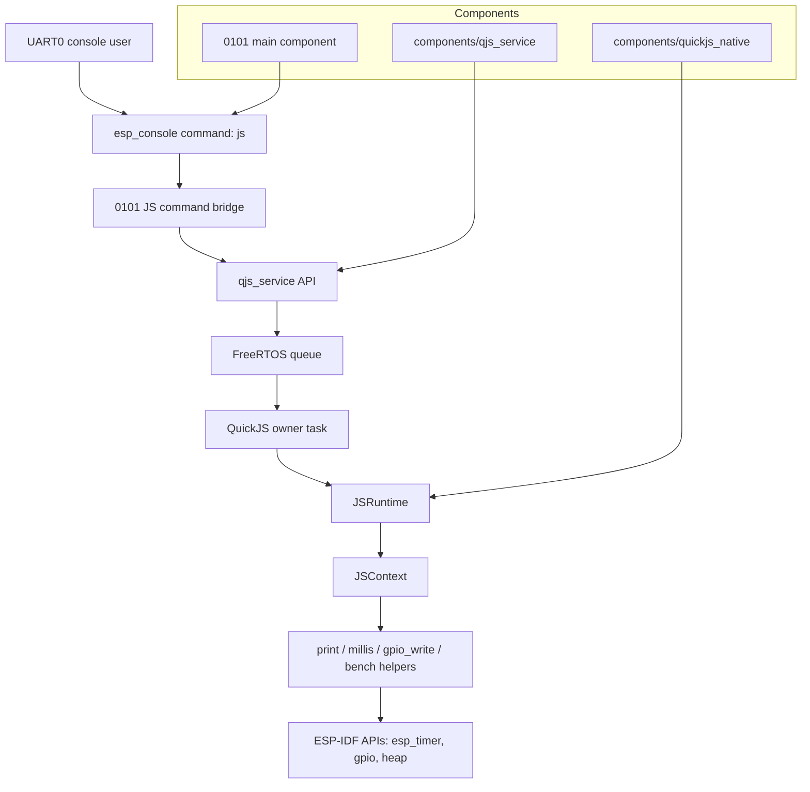
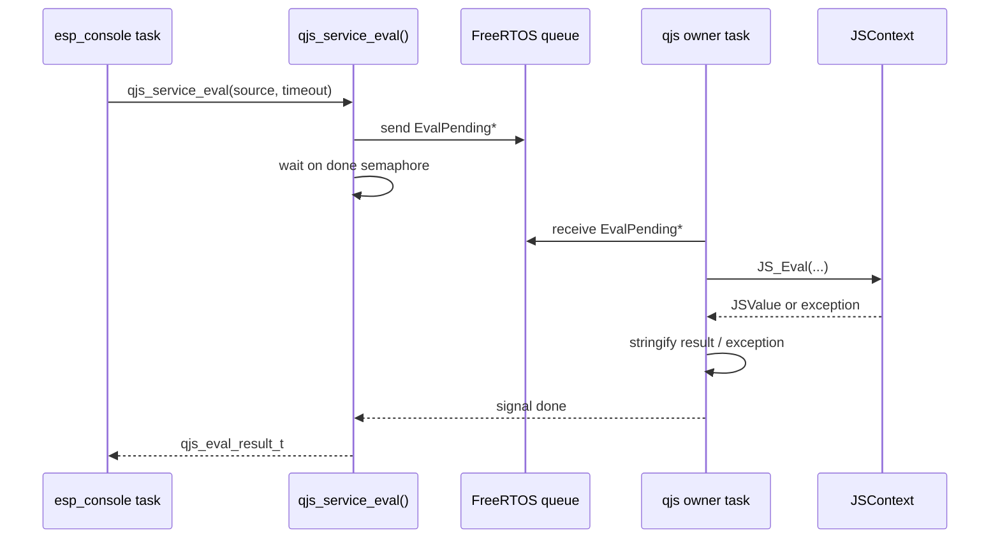

# Native QuickJS on the ESP32-P4 — Analysis, Design, and Implementation Guide

## Executive summary

The current `0100-esp32-p4-quickjs-wasm` firmware proves that an ESP32-P4 can boot a JavaScript console, create a QuickJS context, and evaluate JavaScript. It does so by compiling QuickJS to WebAssembly and running that WebAssembly module inside WAMR. That stack is useful for sandboxing research, but it adds a large runtime layer and an interpreter-on-interpreter execution path. The measured device performance is interactive for small scripts but slow for compute loops: `qjs_init` is about 2.7 seconds, `print(1+2)` is about 50 ms host-visible roundtrip, and a 100k integer addition loop is about 3.7 seconds inside JavaScript.

This ticket designs the next firmware: a native ESP32-P4 QuickJS firmware. "Native" means QuickJS is compiled directly by ESP-IDF for the ESP32-P4 RISC-V target and linked into the firmware as C sources. There is no WebAssembly module, no WAMR runtime, no WAMR linear memory, no native-symbol import table, and no WAMR thread-manager `pthread_self` issue. The firmware still keeps one owner task for the JavaScript runtime, because QuickJS contexts are mutable runtime state and should be serialized. The owner-task pattern already exists in the repository as `components/mqjs_service`, which wraps MicroQuickJS with a task, queue, eval API, deadline handling, output capture, and job API.

The recommended implementation is:

1. Create a new firmware directory, `0101-esp32-p4-native-quickjs/`, based on the proven ESP32-P4 console/PSRAM baseline from `0099` and the console shape from `0100`.
2. Add a reusable full-QuickJS component, tentatively `components/qjs_service`, rather than modifying `components/mqjs_service` in place.
3. Vendor the minimal upstream QuickJS engine sources (`quickjs.c`, `quickjs.h`, `cutils.c`, `cutils.h`, `dtoa.c`, `dtoa.h`, `libregexp.c`, `libunicode.c`, opcode/atom headers) into a dedicated `components/quickjs_native` component.
4. Implement `qjs_service` with the same public service shape as `mqjs_service`: `start`, `stop`, `eval`, `run`, `post`, `reset`, `status`, and `free_result`.
5. Use full QuickJS APIs directly: `JS_NewRuntime`, `JS_SetMemoryLimit`, `JS_SetMaxStackSize`, `JS_SetInterruptHandler`, `JS_NewContext`, `JS_Eval`, `JS_GetException`, `JS_NewCFunction`, `JS_SetPropertyStr`, `JS_FreeContext`, `JS_FreeRuntime`.
6. Validate by reproducing the 0100 smoke tests and speed tests, then compare native timing against the Wasm/WAMR baseline.

The expectation is that native QuickJS should be faster and simpler than the Wasm path. The risk is not memory capacity; the ESP32-P4 board has 32 MB PSRAM and the current WAMR firmware already reserves a 16 MB runtime pool. The main implementation risks are build integration, stack sizing, malloc placement, interrupt/deadline correctness, and whether to include or exclude `quickjs-libc.c`.

## Problem statement and scope

### Problem

Project 0100 answered the research question "can QuickJS compiled to Wasm run under WAMR on the ESP32-P4?" The answer is yes. However, the resulting path is expensive:

```text
ESP console command
  -> C++ runner queue
  -> WAMR host API
  -> WAMR interpreter
  -> wasm32 QuickJS C code
  -> QuickJS bytecode interpreter
  -> user JavaScript
```

The device now evaluates JavaScript, but the speed measurement in the 0100 diary shows the cost of that stack. A 100k integer loop takes roughly 3.7 seconds. That is acceptable for proving the architecture and for tiny control scripts, but it is not the simplest or fastest way to run JavaScript on a memory-rich ESP32-P4.

### Goal

Build a new ESP32-P4 firmware that compiles QuickJS directly into the firmware and exposes a console-driven JavaScript runtime. The first milestone is a minimal console-only firmware:

```text
0101> js status
0101> js eval "print(1+2)"       # prints 3
0101> js bench                   # reports startup/eval/loop timings
0101> js reset                   # rebuilds the QuickJS runtime/context
```

The firmware should be easy for an intern to build, flash, test, and extend. It should reuse proven local patterns where possible, especially the `mqjs_service` single-owner service model.

### Non-goals for the first milestone

The first milestone does not need:

- WAMR or WebAssembly support.
- A sandbox boundary equivalent to Wasm linear memory.
- A file system, network module loader, or CommonJS/ESM loader.
- The full `quickjs-libc.c` command-line environment.
- PicoCalc display/keyboard integration.
- Wi-Fi/HTTP integration.

Those can be later phases once the core native runtime is stable.

## Current-state analysis

### 1. The repository already contains a JavaScript service pattern

`components/mqjs_service` is the strongest local prior art. Its public API is small and service-oriented. The header defines a service config with task properties, queue length, arena size, stdlib pointer, and a `fix_global_this` toggle (`components/mqjs_service/include/mqjs_service.h:23-33`). It exposes `mqjs_service_start`, `mqjs_service_stop`, `mqjs_service_eval`, `mqjs_service_run`, `mqjs_service_post`, and `mqjs_eval_result_free` (`components/mqjs_service/include/mqjs_service.h:51-64`).

The implementation owns a FreeRTOS task, a queue, a ready semaphore, an arena pointer, an `MqjsVm`, and a `JSContext` (`components/mqjs_service/mqjs_service.cpp:80-91`). The service task receives messages from the queue, initializes the JS context lazily, evaluates code, runs jobs, and signals per-request semaphores (`components/mqjs_service/mqjs_service.cpp:185-277`). The public `mqjs_service_eval` allocates an `EvalPending`, queues it, waits for completion, and returns the status (`components/mqjs_service/mqjs_service.cpp:382-414`).

This is the right shape for full QuickJS too. The runtime should be owned by one task. Console, HTTP, timers, and peripherals should submit work to that owner task rather than directly calling into the JS context from arbitrary tasks.

### 2. MicroQuickJS differs from full QuickJS in memory model and API shape

MicroQuickJS uses a fixed arena. `MqjsVm::Create` requires an externally supplied arena and calls `JS_NewContext(cfg.arena, cfg.arena_bytes, cfg.stdlib)` (`components/mqjs_service/mqjs_vm.cpp:36-43`). The service tries to allocate the requested arena and can fall back in 4 KB decrements down to 32 KB (`components/mqjs_service/mqjs_service.cpp:101-145`).

Full upstream QuickJS uses a runtime/context split. The QuickJS header declares `JS_NewRuntime`, `JS_SetMemoryLimit`, `JS_SetMaxStackSize`, `JS_NewContext`, `JS_Eval`, `JS_GetException`, `JS_SetInterruptHandler`, and `JS_NewCFunction` (`0100-esp32-p4-quickjs-wasm/wasm-src/quickjs/quickjs.h:369-389`, `:669`, `:836`, `:926`, `:1050-1053`). The native service should wrap that API directly.

The full engine source is much larger than MicroQuickJS but already present in the 0100 host work. The minimal QuickJS engine source set used for the Wasm build is `quickjs.c`, `cutils.c`, `dtoa.c`, `libregexp.c`, and `libunicode.c` (`0100-esp32-p4-quickjs-wasm/wasm-src/build-quickjs-wasm.sh:20-23`). The source sizes are approximately 75k lines total for the relevant engine files, with `quickjs.c` around 61k lines.

### 3. 0067 shows how application APIs sit above the JS service

The 0067 LED matrix firmware uses `mqjs_service` to expose a domain API. Its main component depends on `mquickjs` and `mqjs_service` (`0067-esp-c3-led-matrix-http/main/CMakeLists.txt:12-24`). Its bridge starts the JS service with a task name, stack, priority, queue length, arena size, stdlib pointer, and `fix_global_this` (`0067-esp-c3-led-matrix-http/main/mqjs/js_runtime_bridge.cpp:361-378`). It then runs a bootstrap job that installs JavaScript globals such as `cancel`, `every`, and `matrix.*` functions (`0067-esp-c3-led-matrix-http/main/mqjs/js_runtime_bridge.cpp:80-225`).

The important design lesson is layering:

1. The generic JS service owns the engine and provides eval/job APIs.
2. The application bridge registers domain-specific functions and state.
3. Console/HTTP handlers call the bridge, not the engine directly.

The native P4 firmware should keep this layering. The first firmware can register only `print`, `millis`, and `gpio_write`; later PicoCalc work can add display and keyboard APIs.

### 4. 0100 provides the performance baseline and failure-mode evidence

The Wasm firmware's wrapper exposes `qjs_init` and `qjs_eval` and registers `print`, `millis`, and `gpio_write` inside QuickJS (`0100-esp32-p4-quickjs-wasm/wasm-src/wasm_main.c:58-95`). It sets a 256 KB QuickJS memory limit and disables QuickJS's C-stack check because the check is meaningless under WAMR's interpreter (`0100-esp32-p4-quickjs-wasm/wasm-src/wasm_main.c:61-68`). That last workaround should not be copied blindly into native QuickJS. In native QuickJS, the C stack pointer is real, so the implementation should set a real stack limit rather than disabling the check.

The Wasm runner also had to create a long-lived pthread owner for WAMR calls (`0100-esp32-p4-quickjs-wasm/main/wasm_runner.cpp:1-8`, `:171-195`). Native QuickJS does not need WAMR's thread environment, but it still benefits from the owner-thread pattern. The reason changes: native QuickJS does not have the WAMR `pthread_self` assertion, but QuickJS context ownership should still be serialized.

### 5. ESP32-P4 baseline hardware settings are known

The P4 board uses the CH343 USB-UART bridge on UART0, not USB Serial/JTAG. The P4 baseline documents that console configuration in `0099-esp32-p4-picocalc-display-keyboard/sdkconfig.defaults:4-7` and in the app banner comments (`0099-esp32-p4-picocalc-display-keyboard/main/app_main.c:12-14`). The same defaults should be used for the native QuickJS firmware.

The P4 board has 32 MB stacked PSRAM, configured as hex PSRAM at 200 MHz with `CONFIG_SPIRAM_USE_MALLOC=y` (`0099-esp32-p4-picocalc-display-keyboard/sdkconfig.defaults:14-19`). Native QuickJS should use this memory advantage. The first pass can rely on the standard ESP-IDF allocator plus QuickJS memory limits; later passes can use `JS_NewRuntime2` with a heap-caps-aware allocator if allocation placement needs to be controlled.

## Gap analysis

The current repository has enough pieces to implement native QuickJS, but no full-QuickJS ESP-IDF component or native-P4 firmware target yet.

| Need | Existing evidence | Gap |
|---|---|---|
| Full QuickJS source | 0100 has vendored upstream QuickJS under `wasm-src/quickjs`; minimal source list is in `build-quickjs-wasm.sh`. | Need a committed ESP-IDF component with the required sources. `wasm-src/quickjs` is treated as host vendoring and should not be the firmware source of truth. |
| Single-owner JS service | `components/mqjs_service` already has task/queue/eval/job APIs. | Need a full-QuickJS equivalent because MicroQuickJS API and memory model differ. |
| P4 console/PSRAM baseline | 0099 and 0100 already configure UART0 and PSRAM. | Need new `0101` firmware directory with those defaults but without WAMR. |
| JS globals | 0100 registers `print`, `millis`, `gpio_write`; 0067 shows domain bootstrap. | Need native C functions using full QuickJS signatures and proper GPIO config. |
| Benchmark baseline | 0100 diary has startup/eval/loop measurements. | Need `js bench` in native firmware to compare. |
| Reset/status | `mqjs_service` has stop/reset-like patterns through application bridge; 0100 has `js status`. | Need first-class native `js reset` and `js status`. |

## Proposed architecture

### High-level component map



### Runtime ownership model

Only the owner task may touch `JSRuntime *` and `JSContext *`. Other tasks call `qjs_service_eval` or `qjs_service_run`. This mirrors the existing `mqjs_service` model and prevents accidental concurrent use.



### Recommended directory layout

```text
components/
  quickjs_native/
    CMakeLists.txt
    include/quickjs_native_config.h        # optional local compile config
    quickjs/quickjs.c
    quickjs/quickjs.h
    quickjs/cutils.c
    quickjs/cutils.h
    quickjs/dtoa.c
    quickjs/dtoa.h
    quickjs/libregexp.c
    quickjs/libunicode.c
    quickjs/quickjs-atom.h
    quickjs/quickjs-opcode.h
    quickjs/libregexp.h
    quickjs/libregexp-opcode.h
    quickjs/libunicode.h
    quickjs/libunicode-table.h
    quickjs/list.h
    quickjs/unicode_gen_def.h

  qjs_service/
    CMakeLists.txt
    include/qjs_service.h
    qjs_service.cpp
    qjs_vm.cpp
    qjs_vm.h
    qjs_bindings.cpp
    qjs_bindings.h

0101-esp32-p4-native-quickjs/
  CMakeLists.txt
  README.md
  sdkconfig.defaults
  partitions.csv                         # optional; native build may fit default but keep roomy
  main/
    CMakeLists.txt
    app_main.cpp
    js_command.cpp
    js_command.h
    native_qjs_app.cpp
    native_qjs_app.h
```

### Why two components?

`quickjs_native` is the vendored third-party engine component. It should be boring: compile QuickJS sources with the right defines and warning suppressions. `qjs_service` is our integration layer. It owns tasking, deadlines, eval result formatting, C globals, reset, status, and application hooks. Keeping them separate makes it possible to update QuickJS without rewriting the service and to reuse the service in later firmware.

## API design

### `qjs_service.h`

The native service should intentionally resemble `mqjs_service.h` so engineers familiar with 0067 can transfer knowledge.

```c
#pragma once
#include <stdbool.h>
#include <stddef.h>
#include <stdint.h>
#include "esp_err.h"

#ifdef __cplusplus
extern "C" {
#endif

typedef struct qjs_service qjs_service_t;
typedef struct JSContext JSContext;

typedef struct {
    const char *task_name;          // default: "qjs_svc"
    uint32_t task_stack_bytes;      // default: 32 * 1024; tune on P4
    uint32_t task_priority;         // default: 8
    int32_t task_core_id;           // default: -1 no pin
    uint32_t queue_len;             // default: 8 or 16

    size_t memory_limit_bytes;      // default: 2 MB or 4 MB for first P4 pass
    size_t max_stack_size_bytes;    // default: 64 KB or 128 KB native C stack limit
    bool install_base_globals;      // print, millis, gc, heap/status helpers
    bool can_block;                 // JS_SetCanBlock(rt, false) initially
} qjs_service_config_t;

typedef struct {
    bool ok;
    bool timed_out;
    int eval_return_code;           // 0 success, negative service/engine error
    uint32_t elapsed_ms;
    char *output;                   // malloc-owned; free with qjs_eval_result_free
    char *error;                    // malloc-owned; free with qjs_eval_result_free
} qjs_eval_result_t;

typedef struct {
    bool ready;
    size_t memory_limit_bytes;
    size_t malloc_size;
    size_t malloc_limit;
    size_t malloc_count;
    size_t malloc_peak_size;
    uint32_t eval_count;
    uint32_t last_eval_ms;
} qjs_service_status_t;

typedef esp_err_t (*qjs_job_fn_t)(JSContext *ctx, void *user);

typedef struct {
    qjs_job_fn_t fn;
    void *user;
    uint32_t timeout_ms;
} qjs_job_t;

esp_err_t qjs_service_start(const qjs_service_config_t *cfg, qjs_service_t **out);
void qjs_service_stop(qjs_service_t *svc);
esp_err_t qjs_service_reset(qjs_service_t *svc);

esp_err_t qjs_service_eval(qjs_service_t *svc,
                           const char *code,
                           size_t len,
                           uint32_t timeout_ms,
                           const char *filename,
                           qjs_eval_result_t *out);

esp_err_t qjs_service_run(qjs_service_t *svc, const qjs_job_t *job);
esp_err_t qjs_service_post(qjs_service_t *svc, const qjs_job_t *job);
esp_err_t qjs_service_get_status(qjs_service_t *svc, qjs_service_status_t *out);
void qjs_eval_result_free(qjs_eval_result_t *r);

#ifdef __cplusplus
}
#endif
```

### Console commands

```text
js status
js eval <source>
js reset
js bench [quick|loop|all]
js gc
```

The `js eval` command should join remaining arguments the way 0100 does (`0100/main/js_command.cpp:42-57`). That preserves both forms:

```text
0101> js eval "print(1+2)"
0101> js eval print(1 + 2)
```

### Native globals for milestone 1

| Global | C backing | Purpose |
|---|---|---|
| `print(...args)` | Convert args with `JS_ToCString`; write to console/output capture. | Basic user output. |
| `millis()` | `esp_timer_get_time() / 1000` | In-engine benchmarks and timing. |
| `gc()` | `JS_RunGC(rt)` | Manual collection during tests. |
| `heap()` | `JS_ComputeMemoryUsage` or service status wrapper if enabled. | Memory diagnostics. |
| `gpio_write(pin, value)` | `gpio_set_level` after explicit configuration. | Minimal hardware output; should be gated/configured. |

The first milestone can implement `print`, `millis`, and `gc`. GPIO should not be exposed until pin configuration is explicit.

## Core implementation flows

### Service startup pseudocode

```c
esp_err_t qjs_service_start(const qjs_service_config_t *cfg, qjs_service_t **out) {
    validate cfg and out;
    allocate Service with defaults;
    create internal queue;
    create ready semaphore;
    xTaskCreatePinnedToCore or xTaskCreate(qjs_task, ...);
    wait up to 1000 ms for ready semaphore;
    return service handle;
}
```

This should follow the same defensive pattern as `mqjs_service_start`, which creates internal-capability synchronization primitives, starts the task, waits for readiness, then returns the handle (`components/mqjs_service/mqjs_service.cpp:282-349`).

### Owner task pseudocode

```c
static void qjs_task(void *arg) {
    Service *s = arg;
    qjs_runtime_create(s);
    signal ready;

    for (;;) {
        Msg msg;
        xQueueReceive(s->q, &msg, portMAX_DELAY);
        switch (msg.type) {
        case MSG_EVAL:
            qjs_handle_eval(s, msg.eval);
            break;
        case MSG_JOB:
            qjs_handle_job(s, msg.job);
            break;
        case MSG_RESET:
            qjs_runtime_destroy(s);
            qjs_runtime_create(s);
            signal reset completion;
            break;
        case MSG_STATUS:
            fill status snapshot;
            signal completion;
            break;
        }
    }
}
```

### Runtime creation pseudocode

```c
static esp_err_t qjs_runtime_create(Service *s) {
    s->rt = JS_NewRuntime();
    if (!s->rt) return ESP_ERR_NO_MEM;

    JS_SetMemoryLimit(s->rt, s->cfg.memory_limit_bytes);
    JS_SetMaxStackSize(s->rt, s->cfg.max_stack_size_bytes);
    JS_SetCanBlock(s->rt, s->cfg.can_block ? 1 : 0);
    JS_SetInterruptHandler(s->rt, qjs_interrupt_handler, s);

    s->ctx = JS_NewContext(s->rt);
    if (!s->ctx) return ESP_ERR_NO_MEM;

    JS_SetContextOpaque(s->ctx, s);
    qjs_install_base_globals(s);
    qjs_run_bootstrap(s);
    return ESP_OK;
}
```

Do not copy 0100's `JS_SetMaxStackSize(rt, 0)` into this firmware. That was a Wasm-specific workaround because the QuickJS stack check observed WAMR interpreter stack state rather than JS execution state. Native QuickJS should use a real limit.

### Eval pseudocode

```c
static void qjs_handle_eval(Service *s, EvalPending *p) {
    int64_t t0 = esp_timer_get_time();
    s->deadline_us = p->timeout_ms ? t0 + p->timeout_ms * 1000 : 0;

    JSValue val = JS_Eval(s->ctx,
                          p->code,
                          p->len,
                          p->filename ? p->filename : "<eval>",
                          JS_EVAL_TYPE_GLOBAL);

    p->elapsed_ms = (esp_timer_get_time() - t0) / 1000;
    s->deadline_us = 0;

    if (JS_IsException(val)) {
        JSValue exc = JS_GetException(s->ctx);
        p->out->ok = false;
        p->out->error = qjs_value_to_cstring(s->ctx, exc);
        JS_FreeValue(s->ctx, exc);
    } else {
        p->out->ok = true;
        p->out->output = qjs_optional_result_string(s->ctx, val);
    }
    JS_FreeValue(s->ctx, val);
    signal p->done;
}
```

### Interrupt/deadline handler pseudocode

```c
static int qjs_interrupt_handler(JSRuntime *rt, void *opaque) {
    Service *s = opaque;
    if (!s || s->deadline_us == 0) return 0;
    return esp_timer_get_time() > s->deadline_us;
}
```

The existing MicroQuickJS wrapper uses the same concept: `MqjsVm::SetDeadlineMs` stores an absolute deadline and `InterruptHandler` returns true after that deadline (`components/mqjs_service/mqjs_vm.cpp:106-112`, `:136-147`).

## Build design

### `components/quickjs_native/CMakeLists.txt`

```cmake
idf_component_register(
    SRCS
        "quickjs/quickjs.c"
        "quickjs/cutils.c"
        "quickjs/dtoa.c"
        "quickjs/libregexp.c"
        "quickjs/libunicode.c"
    INCLUDE_DIRS
        "quickjs"
)

target_compile_definitions(${COMPONENT_LIB} PRIVATE
    CONFIG_VERSION="2026-06-04"
)

target_compile_options(${COMPONENT_LIB} PRIVATE
    -Wno-unused-function
    -Wno-unused-variable
    -Wno-format
    -Wno-type-limits
    -Wno-maybe-uninitialized
)
```

Start without `quickjs-libc.c`. It provides a large OS-like standard library that is useful for the `qjs` CLI but not necessary for a firmware console. The 0100 Wasm build also excludes `quickjs-libc.c` intentionally to keep dependencies small (`0100/wasm-src/build-quickjs-wasm.sh:5-8`).

### `components/qjs_service/CMakeLists.txt`

```cmake
idf_component_register(
    SRCS
        "qjs_service.cpp"
        "qjs_vm.cpp"
        "qjs_bindings.cpp"
    INCLUDE_DIRS
        "include"
    PRIV_REQUIRES
        freertos
        esp_timer
        esp_driver_gpio
        heap
        quickjs_native
)
```

### `0101/main/CMakeLists.txt`

```cmake
idf_component_register(
    SRCS
        "app_main.cpp"
        "js_command.cpp"
        "native_qjs_app.cpp"
    INCLUDE_DIRS
        "."
    REQUIRES
        console
        qjs_service
    PRIV_REQUIRES
        esp_psram
        heap
)
```

### `sdkconfig.defaults`

Start from 0099/0100 P4 defaults, without WAMR:

```ini
CONFIG_IDF_TARGET="esp32p4"
CONFIG_ESP_CONSOLE_UART_DEFAULT=y
CONFIG_ESP_CONSOLE_SECONDARY_NONE=y

CONFIG_ESPTOOLPY_FLASHMODE_DIO=y
CONFIG_ESPTOOLPY_FLASHFREQ_80M=y
CONFIG_ESPTOOLPY_FLASHSIZE_32MB=y

CONFIG_IDF_EXPERIMENTAL_FEATURES=y
CONFIG_SPIRAM=y
CONFIG_SPIRAM_MODE_HEX=y
CONFIG_SPIRAM_SPEED_200M=y
CONFIG_SPIRAM_USE_MALLOC=y

CONFIG_PARTITION_TABLE_CUSTOM=y
CONFIG_PARTITION_TABLE_CUSTOM_FILENAME="partitions.csv"
CONFIG_PARTITION_TABLE_FILENAME="partitions.csv"
```

The app may fit in the default partition, but a custom 4 MB app partition avoids rediscovering the 0100 partition-size problem and leaves room for future embedded JS examples or display assets.

## Decision records

### Decision: compile QuickJS natively instead of running through Wasm/WAMR

- **Context:** 0100 proves the Wasm architecture works but measured 100k loop time is about 3.7 seconds and required WAMR-specific fixes.
- **Options considered:** Keep WAMR and tune AOT; implement native QuickJS; use MicroQuickJS only.
- **Decision:** Create a native full-QuickJS ESP32-P4 firmware.
- **Rationale:** ESP32-P4 has enough RAM/PSRAM, native build removes WAMR overhead and simplifies the runtime path, and full QuickJS gives a more standard API than MicroQuickJS.
- **Consequences:** Less sandboxing than Wasm; must control memory/timeouts through QuickJS APIs and service ownership. Performance should improve substantially but must be measured.
- **Status:** proposed.

### Decision: create new `qjs_service` instead of modifying `mqjs_service`

- **Context:** `mqjs_service` is built around MicroQuickJS's arena API and `JS_NewContext(arena, arena_bytes, stdlib)`.
- **Options considered:** Modify `mqjs_service` to support both engines; fork it into `qjs_service`; write all code inside `0101/main`.
- **Decision:** Fork the service shape into a new reusable `components/qjs_service`.
- **Rationale:** Full QuickJS has a different runtime/context/memory API. A separate component avoids destabilizing 0067 and keeps the full QuickJS wrapper clean.
- **Consequences:** Some duplicated service code initially; later common queue/result abstractions can be extracted if needed.
- **Status:** proposed.

### Decision: one owner task for the JS runtime

- **Context:** JS runtime state is mutable, callbacks can call into ESP-IDF, and multiple firmware subsystems may want to evaluate or run jobs.
- **Options considered:** Direct calls from console/HTTP tasks; global mutex around direct calls; owner task with queue.
- **Decision:** Use an owner task with a queue, following `mqjs_service`.
- **Rationale:** It serializes all QuickJS access, simplifies deadline handling, and matches proven local code.
- **Consequences:** Calls are synchronous RPCs into the owner task unless `post` is used. Long scripts can block other JS work until timeout or completion.
- **Status:** proposed.

### Decision: exclude `quickjs-libc.c` for milestone 1

- **Context:** `quickjs-libc.c` implements a richer host library for the QuickJS command-line tool, but firmware needs a controlled small API.
- **Options considered:** Include full `quickjs-libc.c`; exclude it and install selected globals manually; include selected pieces later.
- **Decision:** Exclude it for milestone 1.
- **Rationale:** 0100 already excludes `quickjs-libc.c` for a smaller minimal runtime. Firmware APIs should be explicit and audited.
- **Consequences:** No built-in `std`/`os` module initially. If module loading or timers are needed, implement firmware-specific APIs deliberately.
- **Status:** proposed.

### Decision: use default QuickJS allocator first, custom allocator second

- **Context:** Full QuickJS supports `JS_NewRuntime2` with custom malloc functions, but ESP-IDF with `CONFIG_SPIRAM_USE_MALLOC=y` can already route heap allocations to PSRAM according to heap policy.
- **Options considered:** Start with default allocator; immediately write heap-caps allocator; force all QuickJS allocations to PSRAM.
- **Decision:** Start with default allocator plus `JS_SetMemoryLimit`; add custom allocator only if measurement shows internal memory pressure.
- **Rationale:** This minimizes first-pass complexity and provides a baseline.
- **Consequences:** Initial allocation placement may not be optimal. Status/bench commands must report heap state before deciding.
- **Status:** proposed.

## Implementation plan

### Phase 0: prepare the ticket and source vendoring

1. Choose QuickJS version. Use the same version already tested in 0100 (`v2026-06-04`) unless there is a reason to update.
2. Create `components/quickjs_native` and copy the minimal full QuickJS source set.
3. Add a `README.md` in the component recording upstream source, version, license, and update command.
4. Ensure `.gitignore` does not exclude the new component source.

Validation:

```bash
git check-ignore -v components/quickjs_native/quickjs/quickjs.c || true
```

### Phase 1: compile native QuickJS in ESP-IDF

1. Create a minimal `0101-esp32-p4-native-quickjs` project.
2. Add `quickjs_native` to the build.
3. Write a tiny `app_main.cpp` that creates `JSRuntime`, `JSContext`, evaluates `1+2`, logs result, then frees context/runtime.
4. Build with ESP-IDF 5.4.2 and target `esp32p4`.

Validation:

```bash
cd 0101-esp32-p4-native-quickjs
source /home/manuel/esp/esp-idf-5.4.2/export.sh
idf.py set-target esp32p4
idf.py build
```

Expected first failures:

- Missing `CONFIG_VERSION` define.
- Warnings treated as errors in QuickJS sources.
- Missing math/libc symbols if source list is incomplete.
- Stack or memory limits if `app_main` directly creates too much on the main task.

### Phase 2: implement `qjs_service`

1. Add `components/qjs_service/include/qjs_service.h`.
2. Implement service task, queue, eval result, and result-freeing based on `mqjs_service`.
3. Implement `QjsVm` helper for output capture, exception formatting, deadline, and globals.
4. Register `print`, `millis`, and `gc`.
5. Add `qjs_service_reset`.

Validation:

- Host compile is not enough; flash the P4 and run console evals.
- Confirm repeated evals do not leak unbounded memory.

### Phase 3: implement `0101` console

1. Add `js status`, `js eval`, `js reset`, and `js bench`.
2. Use `esp_console` over UART0/CH343.
3. Keep `js eval` source length bounded initially (e.g. 2 KB or 4 KB), then add paste/file support later.

Validation commands:

```text
0101> js status
0101> js eval "print(1+2)"
0101> js eval "let s=0; for(let i=0;i<100000;i++) s+=i; print(s)"
0101> js eval "throw new Error('boom')"
0101> js bench
0101> js reset
0101> js eval "print(1+2)"
```

### Phase 4: benchmark and compare against 0100

Use the same measurements as the Wasm firmware:

| Benchmark | 0100 QuickJS-WASM baseline | Native target expectation |
|---|---:|---:|
| startup / context init | ~2.7 s | should be lower; measure |
| `print(1+2)` roundtrip | ~50 ms | should be lower or similar; console overhead may dominate |
| 10k sum loop | ~365 ms JS-side | should be significantly lower |
| 100k sum loop | ~3.7 s JS-side | should be significantly lower |
| recursive `fib(20)` | WAMR operand stack overflow | should run or hit native stack timeout/limit depending configuration |

### Phase 5: optional PicoCalc and service integration

Once native QuickJS is stable:

- Add PicoCalc display/keyboard APIs from 0099.
- Add async timers based on the 0067 timer service.
- Add HTTP or WebSocket bridge if desired.
- Add embedded JS examples with `EMBED_TXTFILES`.

## Testing strategy

### Build tests

```bash
source /home/manuel/esp/esp-idf-5.4.2/export.sh
cd 0101-esp32-p4-native-quickjs
idf.py build
```

If `sdkconfig.defaults` changes, delete `sdkconfig` before rebuilding. This is documented in `AGENTS.md` and `docs/01-playbook-esp-idf-build-and-dev-environment.md`.

### Hardware smoke tests

Use one serial owner. Prefer tmux monitor:

```bash
tmux kill-session -t qjs0101 2>/dev/null || true
idf.py -p /dev/ttyACM0 flash
tmux new-session -d -s qjs0101 -c "$PWD" \
  "bash -lc 'source /home/manuel/esp/esp-idf-5.4.2/export.sh >/dev/null 2>&1; idf.py -p /dev/ttyACM0 monitor'"
sleep 6
tmux capture-pane -t qjs0101 -p | tail -80
tmux send-keys -t qjs0101 'js eval "print(1+2)"' Enter
```

Expected:

```text
0101> js eval "print(1+2)"
3
```

### Correctness tests

- Arithmetic: `print(1+2)`.
- Loop: `let s=0; for(let i=0;i<1000;i++) s+=i; print(s)`.
- Strings: `print(['a','b'].join('-'))`.
- Exceptions: `throw new Error('boom')`.
- Reset: define a global, reset, confirm it disappears.
- Timeout: infinite loop should interrupt and return a timeout error.
- Memory: repeated eval loop should not grow without bound.

### Performance tests

Implement `js bench` so the firmware can measure without host UART noise:

```text
js bench quick
js bench loops
js bench alloc
js bench all
```

Bench output should include:

- runtime/context init time,
- trivial eval time,
- 10k and 100k loop time,
- exception path time,
- heap before/after,
- peak QuickJS malloc usage if available.

## Risks and mitigations

### Risk: QuickJS source does not compile cleanly under ESP-IDF

Mitigation: start with the known minimal source list from 0100, define `CONFIG_VERSION`, suppress third-party warnings only on the QuickJS component, and exclude `quickjs-libc.c` initially.

### Risk: default allocator consumes too much internal RAM

Mitigation: enable PSRAM malloc, measure `heap_caps_get_free_size(MALLOC_CAP_INTERNAL)` before/after runtime init, and add a `JS_NewRuntime2` allocator that routes large allocations to PSRAM if needed.

### Risk: native stack overflows on recursive JS or parser recursion

Mitigation: run QuickJS in its own task with a generous stack (start 32 KB or 64 KB), set `JS_SetMaxStackSize`, and add recursion/timeout tests.

### Risk: long-running JS starves other firmware tasks

Mitigation: use `JS_SetInterruptHandler` with deadlines. For cooperative APIs, expose `millis`, timers, and stop flags. Do not allow unbounded eval without timeout from HTTP or console.

### Risk: `quickjs-libc.c` temptation grows scope

Mitigation: implement firmware-specific globals explicitly. Add modules only after the minimal console is stable.

## Open questions

1. What exact memory limit should native QuickJS use on the P4: 1 MB, 2 MB, 4 MB, or higher?
2. Should QuickJS allocations use default ESP-IDF malloc or a custom PSRAM-first allocator from day one?
3. Should `qjs_service` be generic enough for later ESP32-S3 builds, or P4-specific initially?
4. Should `js eval` use `JS_EVAL_TYPE_GLOBAL` or a REPL-like mode that returns expression values more conveniently?
5. Should the firmware expose a module system, or only globals and embedded scripts?
6. Should the native QuickJS firmware reuse 0067's timer API design (`setTimeout`, `clearTimeout`, `every`) in Phase 2?

## File reference map

| File | Why it matters |
|---|---|
| `components/mqjs_service/include/mqjs_service.h` | Existing service API to mirror for native full QuickJS. |
| `components/mqjs_service/mqjs_service.cpp` | Existing owner-task/queue/eval/job implementation. |
| `components/mqjs_service/mqjs_vm.cpp` | Existing interrupt/deadline/output-capture helper patterns. |
| `0067-esp-c3-led-matrix-http/main/mqjs/js_runtime_bridge.cpp` | Example application bridge that starts JS service and installs domain globals. |
| `0067-esp-c3-led-matrix-http/main/CMakeLists.txt` | Example firmware depending on `mquickjs` and `mqjs_service`. |
| `0100-esp32-p4-quickjs-wasm/wasm-src/build-quickjs-wasm.sh` | Minimal upstream QuickJS source list and decision to exclude `quickjs-libc.c`. |
| `0100-esp32-p4-quickjs-wasm/wasm-src/wasm_main.c` | Minimal QuickJS globals and eval wrapper from the Wasm experiment. |
| `0100-esp32-p4-quickjs-wasm/main/wasm_runner.cpp` | Proven owner-thread/queue pattern after resolving WAMR crash. |
| `0099-esp32-p4-picocalc-display-keyboard/sdkconfig.defaults` | ESP32-P4 UART0/PSRAM baseline. |
| `0099-esp32-p4-picocalc-display-keyboard/main/app_main.c` | P4 hardware notes and peripheral baseline. |

## Intern checklist

Before writing code:

- [ ] Read this guide once end-to-end.
- [ ] Read `components/mqjs_service/include/mqjs_service.h` and `components/mqjs_service/mqjs_service.cpp`.
- [ ] Read `0100/wasm-src/build-quickjs-wasm.sh` and understand the minimal QuickJS source list.
- [ ] Read `0100/wasm-src/wasm_main.c` for the minimal `print`/`millis`/`gpio_write` bindings.
- [ ] Read `0099/sdkconfig.defaults` for P4 console/PSRAM settings.

First code milestone:

- [ ] Create `components/quickjs_native`.
- [ ] Create `0101-esp32-p4-native-quickjs`.
- [ ] Build a native QuickJS smoke firmware.
- [ ] Flash and print `3`.

Second code milestone:

- [ ] Add `components/qjs_service`.
- [ ] Add `js status`, `js eval`, `js reset`, `js bench`.
- [ ] Record benchmark comparison against 0100.
