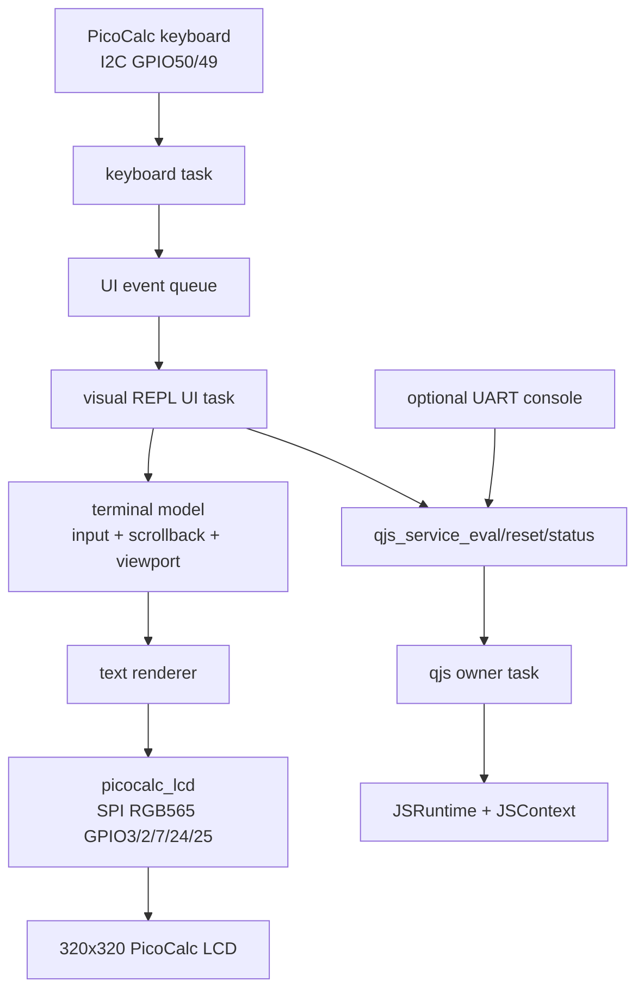

# Visual QuickJS REPL on the ESP32-P4 PicoCalc LCD — Analysis, Design, and Implementation Guide

## Executive summary

The repository now has two working foundations for a PicoCalc JavaScript device. Project `0099-esp32-p4-picocalc-display-keyboard` proves that the ESP32-P4 can drive the PicoCalc 320×320 RGB565 LCD over SPI and read the PicoCalc keyboard over I2C. Project `0101-esp32-p4-native-quickjs` proves that the same ESP32-P4 can compile and run full upstream QuickJS natively under ESP-IDF, with an owner-task service, timeouts, reset, status reporting, and console commands.

This ticket designs the next firmware: a visual QuickJS REPL on the PicoCalc LCD. The REPL should accept keyboard input, evaluate JavaScript through the native QuickJS service, and render the interaction on the LCD with scrollback and colored output. The first version should not be a full terminal emulator. It should be a firmware-native REPL UI with a controlled screen model: a prompt/input line, scrollback lines, colored records for input/output/errors/status, and a small set of navigation keys.

The recommended implementation is a new firmware target, `0102-esp32-p4-visual-quickjs-repl`, built from three reusable parts:

1. `components/quickjs_native` from 0101, unchanged at first.
2. `components/qjs_service` from 0101, extended only if the UI needs small API improvements.
3. New PicoCalc display/keyboard components extracted from 0099, so the visual REPL does not copy a 1600-line diagnostic `app_main.c` into another firmware.

The core design choice is to keep QuickJS execution, keyboard input, and LCD rendering as separate responsibilities. QuickJS remains owned by `qjs_service`. The keyboard task translates PicoCalc key events into UI input events. The UI/terminal task owns the scrollback model and the current input line. The renderer turns dirty rows into RGB565 buffers and sends them to the LCD using the proven SPI/DMA routines from 0099.

The first milestone is intentionally small:

```text
+--------------------------------+
| js> print(1+2)                 |
| 3                              |
| js> throw new Error('boom')    |
| Error: boom                    |
| js>                            |
+--------------------------------+
```

The text should be colored by record type: prompt/input, normal output, errors, status/diagnostic lines, and cursor. The UI should keep scrollback in RAM, repaint visible rows after scroll, and avoid evaluating JavaScript directly from the render path.

## Problem statement and scope

### Problem

The native QuickJS firmware currently exposes JavaScript through the UART ESP console. That is useful for development because it works with `idf.py monitor`, tmux, and scripted validation. It does not use the PicoCalc display and keyboard as the user-facing interface. The PicoCalc hardware is intended to support a self-contained interaction loop: type code on the keyboard, see output on the display, scroll through previous interactions, and recover with reset or timeout controls.

The repository already contains the hardware work needed for this direction, but it is not packaged as a reusable visual REPL. The 0099 LCD code is a diagnostic app with many benchmark commands. The 0101 QuickJS code is a UART console app. The next step is integration with a clean architecture rather than a direct merge of both `app_main` files.

### Goal

Create a new firmware that boots into a visual QuickJS REPL on the PicoCalc LCD:

- The PicoCalc keyboard edits an input line.
- Enter submits the current input to QuickJS.
- QuickJS output is appended to scrollback.
- JavaScript exceptions are rendered as error records.
- Long-running code is interrupted by the existing QuickJS deadline mechanism.
- The visible area is repainted with colored rows.
- Scrollback can be navigated with keyboard keys.
- A UART console may remain as a debug fallback, but it is no longer the primary interface.

### Non-goals for the first implementation milestone

The first milestone does not need:

- ANSI terminal emulation.
- Proportional fonts or Unicode shaping.
- JavaScript source editing beyond a single input line.
- Syntax highlighting while typing.
- File persistence or command history persistence.
- A module loader, filesystem bridge, Wi-Fi, or HTTP server.
- Full PicoCalc application shell behavior.

Those features can be added after the rendering model, input model, and QuickJS eval loop are stable.

## Current-state analysis

### 1. PicoCalc LCD and keyboard are already proven in 0099

Project `0099-esp32-p4-picocalc-display-keyboard` is the hardware baseline. Its README documents the same-position adapter pin mapping. Keyboard I2C uses Pico GP6/GP7 mapped to ESP32-P4 GPIO50/GPIO49. LCD SPI uses Pico GP10/GP11/GP13/GP14/GP15 mapped to ESP32-P4 GPIO3/GPIO2/GPIO7/GPIO24/GPIO25. The console remains the CH343 USB-UART bridge on UART0.

The LCD code in `0099/main/app_main.c` defines a 320×320 RGB565 panel, uses `SPI2_HOST`, selects `SPI_CLK_SRC_SPLL`, defaults to 80 MHz, and sets a 32 KiB maximum SPI transfer size. These constants are important because the default ESP32-P4 SPI source cannot satisfy high SCLK requests; 0099 explicitly uses SPLL to get the tested 80 MHz path.

The most important LCD primitives are:

- `lcd_init_panel()` initializes SPI, resets the panel, exits sleep, sets RGB565 mode, configures `MADCTL`, enables inversion, and turns the display on.
- `lcd_set_window()` sends `CASET`, `RASET`, and `RAMWR` for a rectangular pixel write.
- `lcd_fill_rect()` clips a rectangle, sets a window, fills a 32 KiB internal DMA buffer with a color, and sends the pixel stream in chunks.
- `lcd_text_row_timed()` renders one pseudo-text row into a DMA buffer and transfers it.
- `lcd_text_screen_timed()` repaints rows by calling `lcd_text_row_timed()`.
- `lcd_text_screen_queued_timed()` uses two row buffers and queued SPI transfers so one row can be rendered while a previous row is in flight.

The README records measured display improvements. A reusable 32 KiB DMA-capable fill buffer reduced full-screen 320×320 RGB565 fills from roughly 32 ms to roughly 21 ms at actual 80 MHz. That performance is enough for row-based terminal repaint if the UI avoids full-screen redraw on every keypress.

The keyboard code in `0099/main/picocalc_keyboard.c` is already isolated from the LCD. It initializes an I2C master bus, adds the PicoCalc keyboard device at address `0x1f`, reads the status register `0x04`, checks FIFO count with mask `0x1f`, and reads key events from FIFO register `0x09`. The public API in `picocalc_keyboard.h` is small: initialize, read status/registers, poll events, get diagnostics, and map state/key codes to names.

### 2. Native QuickJS is already proven in 0101

Project `0101-esp32-p4-native-quickjs` compiles full upstream QuickJS directly into ESP-IDF. It has two reusable components:

- `components/quickjs_native`, which vendors the QuickJS core source set.
- `components/qjs_service`, which owns `JSRuntime*` and `JSContext*` on a FreeRTOS task.

The public service API is the right integration point for a visual REPL. `qjs_service_eval()` accepts source text, a timeout, a filename label, and returns `qjs_eval_result_t` with `ok`, `timed_out`, `elapsed_ms`, `output`, and `error`. `qjs_service_reset()` rebuilds the runtime. `qjs_service_get_status()` reports service counters, memory limits, QuickJS memory usage, and ESP heap state. `qjs_service_run()` and `qjs_service_post()` provide owner-task callbacks for future bindings.

The native firmware has already been validated on the ESP32-P4:

| Operation | Measured result |
|---|---:|
| QuickJS runtime init | about 6 ms |
| `print(1+2)` eval | about 2 ms reported eval time |
| 10k integer loop | about 13 ms eval / 11 ms JS-side |
| 100k integer loop | about 133 ms eval / 133 ms JS-side |
| `fib(20)` | about 32 ms eval / 31 ms JS-side |
| `while(true){}` | interrupted at about 1000 ms with `InternalError: interrupted` |

The visual REPL should reuse these service semantics rather than re-embedding QuickJS in UI code.

### 3. The existing 0099 LCD code should be extracted before integration

The 0099 app is intentionally a diagnostic firmware. It combines LCD primitives, keyboard diagnostics, command registration, benchmarks, status output, and app lifecycle in one `app_main.c`. That is productive for bring-up, but it is not the right unit to link into a visual REPL. The REPL needs a display component with a focused API.

The extraction boundary should be:

```text
components/picocalc_lcd/
  include/picocalc_lcd.h
  picocalc_lcd.c or picocalc_lcd.cpp

components/picocalc_keyboard/
  include/picocalc_keyboard.h
  picocalc_keyboard.c
```

`picocalc_keyboard` can start as a direct move/copy of the 0099 keyboard module. `picocalc_lcd` should start with only the required panel and row/rect primitives, not every benchmark command. The diagnostic commands can remain in 0099 or be reintroduced later as optional debug commands.

### 4. The REPL needs a screen model, not ad hoc drawing

A visual REPL is stateful. It needs to remember previous records, the visible window into those records, the current input buffer, cursor position, and style for each record. If the firmware writes pixels directly from each event handler without a model, scrollback and repaint correctness become difficult.

The first screen model should be text-cell based:

- 320×320 LCD.
- Default cell size: 8×16 pixels, matching the 0099 text benchmark assumptions.
- Columns: `320 / 8 = 40`.
- Rows: `320 / 16 = 20`.
- Reserve one row for the input line or render the input as the last record.
- Keep scrollback as wrapped logical lines with style metadata.

The renderer should operate on rows, not individual pixels from the UI layer. The UI produces rows such as "prompt", "input", "output", "error", and "status". The renderer converts rows to RGB565 pixels and transfers only dirty rows where possible.

## Gap analysis

| Need | Existing evidence | Gap |
|---|---|---|
| LCD SPI panel init and fast row transfer | 0099 has panel init, 80 MHz SPLL SPI, 32 KiB DMA buffer, row render benchmarks. | Need reusable `picocalc_lcd` component and a text-cell renderer API. |
| Keyboard polling | 0099 has `picocalc_keyboard_poll_event()` and key name helpers. | Need an input task that turns raw key events into editor actions. |
| QuickJS eval service | 0101 has `qjs_service_eval`, reset, status, timeout, result ownership. | Need a UI bridge that submits input lines and appends result records to scrollback. |
| Colored output | 0099 renders pseudo text in black/white only. | Need glyph rendering with foreground/background colors per cell/row. |
| Scrollback | No current LCD scrollback model. | Need a bounded ring buffer of styled logical lines plus viewport offset. |
| Visual prompt/input editing | 0101 uses UART console line editing. | Need firmware-side input buffer, cursor, backspace, enter, arrows, and scroll keys. |
| Build target | 0099 and 0101 are separate apps. | Need `0102-esp32-p4-visual-quickjs-repl` combining extracted components. |

## Proposed architecture

### Component map



The UI task is the coordinator. It consumes keyboard events, updates the model, calls QuickJS for submitted input, and schedules repaint. The renderer owns pixel conversion and LCD transfer. QuickJS remains behind `qjs_service`.

### Task model

The first implementation should use three long-lived tasks plus the existing ESP console task if debug console is enabled:

| Task | Owner | Responsibility |
|---|---|---|
| `qjs0102` | `qjs_service` | Own `JSRuntime*` and `JSContext*`; execute eval/reset/status. |
| `repl_ui` | new visual REPL component/app | Own input buffer, scrollback, viewport, dirty rows; call `qjs_service`. |
| `kbd_scan` | new keyboard integration | Poll PicoCalc keyboard FIFO and publish high-level key events. |
| UART REPL task | ESP console, optional | Debug commands such as `js status` and `ui status`. |

LCD drawing can initially run inside `repl_ui`. If rendering blocks keyboard responsiveness, split rendering into a separate task later. The first version should keep the design simpler: one UI task mutates the model and calls renderer functions synchronously.

### Data model

The visual REPL should separate logical records from physical rows. A record is something the REPL wants to remember: input, output, error, status, or system banner. A row is a fixed-width slice of a record after wrapping.

```c
typedef enum {
    REPL_STYLE_PROMPT,
    REPL_STYLE_INPUT,
    REPL_STYLE_OUTPUT,
    REPL_STYLE_ERROR,
    REPL_STYLE_STATUS,
    REPL_STYLE_CURSOR,
} repl_style_t;

typedef enum {
    REPL_RECORD_INPUT,
    REPL_RECORD_OUTPUT,
    REPL_RECORD_ERROR,
    REPL_RECORD_STATUS,
    REPL_RECORD_SYSTEM,
} repl_record_type_t;

typedef struct {
    repl_record_type_t type;
    repl_style_t style;
    char *text;
    uint32_t seq;
    uint32_t elapsed_ms;
} repl_record_t;

typedef struct {
    repl_record_t *records;
    size_t capacity;
    size_t count;
    size_t head;
    uint32_t next_seq;
} repl_scrollback_t;

typedef struct {
    char input[REPL_INPUT_MAX];
    size_t input_len;
    size_t cursor;
    int viewport_bottom_offset;
    bool dirty_all;
    uint32_t dirty_row_mask;
} repl_model_t;
```

The first version can store complete text strings and rewrap them on repaint. That is simpler than storing precomputed rows and is acceptable for a bounded scrollback. If wrapping becomes expensive, add a cached row index later.

### Screen layout

With 8×16 cells, the display has 40 columns and 20 rows. The initial layout should reserve the last row for the current input line and use the first 19 rows for scrollback.

```text
Rows 0..18: scrollback viewport
Row  19:    prompt + editable input + cursor
```

A submitted line is appended to scrollback as an input record, then evaluated, then one or more output/error/status records are appended. The current input row is cleared after submission.

```text
js> print(1+2)
3
js> throw new Error('boom')
Error: boom
js> _
```

### Color palette

Use a fixed RGB565 palette first. Do not add themes until the rendering path is stable.

| Style | Foreground | Background | Purpose |
|---|---:|---:|---|
| prompt | cyan | black | `js>` prefix. |
| input | white | black | User-entered source. |
| output | green | black | Captured `print()` output and returned values. |
| error | red | black | Exceptions, timeouts, service errors. |
| status | yellow | black | Startup banner, reset/status notes. |
| cursor | black | white | Current cursor cell. |

The renderer should accept style per row or per span. The first implementation can render each physical row with one style. If the prompt and input need different colors on the same row, add span rendering for only the input row.

### Renderer API sketch

The LCD component should not know about QuickJS. The terminal renderer should not know about SPI registers. Keep the boundary narrow.

```c
// components/picocalc_lcd/include/picocalc_lcd.h
esp_err_t picocalc_lcd_init(void);
esp_err_t picocalc_lcd_fill(uint16_t rgb565);
esp_err_t picocalc_lcd_blit_rect(uint16_t x, uint16_t y,
                                  uint16_t w, uint16_t h,
                                  const uint16_t *pixels);
esp_err_t picocalc_lcd_blit_row(uint16_t y, uint16_t h,
                                 const uint16_t *pixels,
                                 size_t pixel_count);
int picocalc_lcd_actual_khz(void);

// components/visual_repl/include/visual_repl_renderer.h
esp_err_t repl_renderer_init(void);
esp_err_t repl_renderer_draw_row(uint16_t row_index,
                                 const char *text,
                                 repl_style_t style);
esp_err_t repl_renderer_draw_input_row(const char *prompt,
                                        const char *input,
                                        size_t cursor);
esp_err_t repl_renderer_present_model(const repl_model_t *model);
```

The renderer can start with a minimal bitmap font. The 0099 pseudo-glyph function was enough for benchmarking but not for a readable REPL. A practical first pass is to add a small 8×8 or 8×16 monospace bitmap font as source data, then scale or pad to 8×16 cells. The renderer should draw foreground/background RGB565 pixels into an internal DMA-capable row buffer and call `picocalc_lcd_blit_row()`.

### Input API sketch

Keyboard input should become semantic actions before it reaches the model. The UI should not interpret raw I2C bytes directly.

```c
typedef enum {
    REPL_KEY_CHAR,
    REPL_KEY_ENTER,
    REPL_KEY_BACKSPACE,
    REPL_KEY_LEFT,
    REPL_KEY_RIGHT,
    REPL_KEY_UP,
    REPL_KEY_DOWN,
    REPL_KEY_PAGE_UP,
    REPL_KEY_PAGE_DOWN,
    REPL_KEY_HOME,
    REPL_KEY_END,
    REPL_KEY_ESCAPE,
} repl_key_type_t;

typedef struct {
    repl_key_type_t type;
    char ch;          // valid for REPL_KEY_CHAR
    uint32_t mods;    // shift/ctrl/sym if tracked later
} repl_key_event_t;
```

The first version only needs printable ASCII, Enter, Backspace, arrows, PageUp/PageDown, Home/End, and Escape. Shift/Sym composition can be refined after observing the PicoCalc keyboard's emitted codes for all needed characters.

### UI loop pseudocode

```c
void repl_ui_task(void *arg) {
    repl_model_init(&model);
    repl_renderer_init();
    qjs_service_start(&qjs_cfg, &qjs);

    append_status("Native QuickJS visual REPL ready");
    redraw_all();

    for (;;) {
        repl_key_event_t ev;
        if (xQueueReceive(ui_queue, &ev, portMAX_DELAY) != pdTRUE) continue;

        switch (ev.type) {
        case REPL_KEY_CHAR:
            model_insert_char(&model, ev.ch);
            mark_input_dirty();
            break;

        case REPL_KEY_BACKSPACE:
            model_backspace(&model);
            mark_input_dirty();
            break;

        case REPL_KEY_ENTER:
            char source[REPL_INPUT_MAX];
            model_take_input(&model, source, sizeof(source));
            append_record(REPL_RECORD_INPUT, source);
            redraw_all_or_bottom();

            qjs_eval_result_t r = {};
            esp_err_t err = qjs_service_eval(qjs, source, strlen(source), 1000, "<lcd-repl>", &r);
            if (err != ESP_OK) append_error(esp_err_to_name(err));
            else if (r.output) append_output(r.output);
            if (r.error) append_error(r.error);
            if (r.timed_out) append_status("timed out");
            qjs_eval_result_free(&r);

            scroll_to_bottom();
            redraw_all_or_bottom();
            break;

        case REPL_KEY_PAGE_UP:
            viewport_page_up(&model);
            redraw_all();
            break;

        case REPL_KEY_PAGE_DOWN:
            viewport_page_down(&model);
            redraw_all();
            break;
        }
    }
}
```

The first implementation may block the UI while QuickJS evaluates. That is acceptable for a milestone if timeouts work and the UI shows a busy/status record before eval. If responsiveness during eval becomes important, submit eval from the UI task and let another completion event update the model. Do not call QuickJS directly from keyboard or renderer code.

## Decision records

### Decision: Create `0102-esp32-p4-visual-quickjs-repl` instead of modifying 0101 in place

- **Context:** 0101 is now a clean UART-console native QuickJS firmware. The visual REPL will add LCD, keyboard, rendering, scrollback, and UI state.
- **Options considered:** Modify 0101 directly; create a new firmware target; create a branch-only experiment.
- **Decision:** Create a new firmware directory, `0102-esp32-p4-visual-quickjs-repl`.
- **Rationale:** 0101 remains a stable regression target for QuickJS service behavior. 0102 can add hardware UI complexity without destabilizing the known-good UART console.
- **Consequences:** Some app-level boilerplate is duplicated initially. Shared pieces should live in components so 0101 and 0102 can both use them.
- **Status:** accepted.

### Decision: Extract PicoCalc LCD/keyboard components from 0099

- **Context:** 0099 contains working LCD/keyboard code, but it is a diagnostic application rather than a reusable component.
- **Options considered:** Copy 0099 `app_main.c` into 0102; extract reusable components; keep 0102 dependent on 0099 source paths.
- **Decision:** Extract `components/picocalc_lcd` and `components/picocalc_keyboard`.
- **Rationale:** The REPL needs panel primitives and key events, not benchmark command parsing. Component extraction makes future PicoCalc apps easier.
- **Consequences:** The first phase includes refactoring before feature work. The extraction must preserve the tested pin mapping, SPI clock source, DMA transfer size, and keyboard timing.
- **Status:** accepted.

### Decision: Use a text-cell UI, not ANSI terminal emulation

- **Context:** The requirement is scrollback and colored output, not full terminal compatibility.
- **Options considered:** ANSI terminal emulator; LVGL text area; firmware-native text-cell model.
- **Decision:** Implement a firmware-native text-cell model.
- **Rationale:** A controlled model is easier to validate on constrained hardware and aligns with REPL semantics. It can support colors, scrollback, prompt, and cursor without parsing terminal escape sequences.
- **Consequences:** ANSI programs will not run as-is. If ANSI output is needed later, add a small parser that converts selected escape codes into styled records.
- **Status:** accepted.

### Decision: Keep QuickJS behind `qjs_service`

- **Context:** Visual UI code will run in separate tasks from the QuickJS owner task.
- **Options considered:** Let UI code hold `JSContext*`; call `qjs_service_eval`; create a second QuickJS runtime for the visual REPL.
- **Decision:** Use the existing `qjs_service` API and one runtime.
- **Rationale:** 0101 already validated service ownership, timeouts, reset, status, output capture, and exception formatting. Direct context access would reintroduce concurrency risk.
- **Consequences:** Eval is serialized through a queue. UI code must handle async/blocking semantics explicitly.
- **Status:** accepted.

### Decision: Start with row repaint, then optimize dirty cells later

- **Context:** LCD transfer performance is good enough for row-level updates, and 0099 already has row rendering/queued transfer experiments.
- **Options considered:** Full-screen repaint; row repaint; per-cell dirty rectangles; hardware scroll.
- **Decision:** Start with row repaint and a dirty-row mask.
- **Rationale:** A 40×20 text display has only 20 rows. Repainting one 8×16 row transfers 320×16×2 = 10,240 bytes, which fits inside the 32 KiB DMA transfer size. Row repaint is much simpler than per-cell tracking and fast enough for typing.
- **Consequences:** Large scroll operations may repaint 19 rows. If this is visibly slow, add optimized scroll or queued row rendering later.
- **Status:** accepted.

## Implementation plan

### Phase 0: ticket and evidence setup

Create the ticket, design guide, diary, tasks, file relations, and initial reMarkable upload. This phase is documentation-first so the implementation has a clear target.

### Phase 1: extract PicoCalc hardware components

1. Create `components/picocalc_keyboard` from 0099's `picocalc_keyboard.c/.h`.
2. Create `components/picocalc_lcd` from the required 0099 LCD primitives.
3. Preserve pin constants, 80 MHz SPLL clock source, 32 KiB transfer size, reset/init sequence, and RGB565 format.
4. Add a minimal component README explaining source and pin mapping.
5. Build a small smoke target or use 0102 skeleton to verify extraction.

Validation:

```text
lcd init equivalent succeeds
lcd fill black/white/red works
keyboard init succeeds
keyboard poll reports events
```

### Phase 2: create 0102 firmware skeleton

1. Create `0102-esp32-p4-visual-quickjs-repl/`.
2. Base `sdkconfig.defaults` on 0099/0101: ESP32-P4 target, UART0 console, 32 MB flash, hex PSRAM at 200 MHz.
3. Add `EXTRA_COMPONENT_DIRS` for `quickjs_native`, `qjs_service`, `picocalc_lcd`, `picocalc_keyboard`, and later `visual_repl`.
4. Start `qjs_service` and initialize LCD/keyboard.
5. Keep optional UART debug commands for status while the visual UI is being built.

Validation:

```text
idf.py build
idf.py -p /dev/ttyACM0 flash
boot log shows LCD init, keyboard init, QuickJS ready
```

### Phase 3: implement text renderer

1. Add `components/visual_repl` or app-local renderer files.
2. Add a small monospace bitmap font.
3. Implement RGB565 palette.
4. Implement `draw_row`, `draw_input_row`, `clear_row`, and `present_model`.
5. Repaint a static demo screen with colored rows.

Validation:

- The screen shows a banner, prompt, normal output, and error line in distinct colors.
- Row repaint latency is logged.
- Typing is not enabled yet; this is render-only.

### Phase 4: implement keyboard-to-input editing

1. Add keyboard polling task.
2. Translate printable keys and control keys into `repl_key_event_t`.
3. Implement input buffer insert, backspace, cursor left/right, home/end.
4. Render the input row with cursor.

Validation:

- Typed characters appear on the LCD.
- Backspace deletes.
- Cursor movement works within the line.
- Enter can append the input record to scrollback without eval first.

### Phase 5: connect input to QuickJS eval

1. On Enter, append the input record and call `qjs_service_eval`.
2. Append output records from `result.output`.
3. Append error records from `result.error`.
4. Show timeout/status records when `timed_out` is true.
5. Add reset key or visual command, for example `/reset`.

Validation:

```text
print(1+2)          -> output row: 3
throw new Error(...) -> red error row
while(true){}        -> timeout error/status row after 1000 ms
/reset               -> runtime reset status row
```

### Phase 6: scrollback and viewport navigation

1. Implement bounded scrollback ring.
2. Implement wrapping from records to physical rows.
3. Implement viewport offset.
4. Map PageUp/PageDown or function keys to scroll.
5. Add auto-scroll-to-bottom on new output unless the user is viewing older scrollback.

Validation:

- More than 20 rows can be produced.
- PageUp shows older rows.
- PageDown returns toward the bottom.
- New eval output returns to bottom or indicates off-bottom state according to chosen behavior.

### Phase 7: polish, benchmarking, and docs

1. Add `ui status` / debug command if useful.
2. Measure row repaint, full redraw, scroll repaint, eval-to-display latency.
3. Update design guide with deviations and measured results.
4. Keep diary and changelog current.
5. Run `docmgr doctor` and upload updated bundle.

## Testing strategy

### Build tests

```bash
source /home/manuel/esp/esp-idf-5.4.2/export.sh
cd 0102-esp32-p4-visual-quickjs-repl
idf.py set-target esp32p4
idf.py build
```

### Hardware smoke tests

Use one owner for `/dev/ttyACM0`:

```bash
tmux kill-session -t qjs0102 2>/dev/null || true
idf.py -p /dev/ttyACM0 flash
tmux new-session -d -s qjs0102 -c "$PWD" \
  "bash -lc 'source /home/manuel/esp/esp-idf-5.4.2/export.sh >/dev/null 2>&1; idf.py -p /dev/ttyACM0 monitor'"
sleep 6
tmux capture-pane -t qjs0102 -p | tail -80
```

Do not run another monitor, flash, or probe against the same serial device while this session is active.

### Visual acceptance tests

- Boot screen appears on LCD.
- Prompt appears at the bottom row.
- Keyboard input appears as typed.
- Backspace and cursor movement update only the input row or a small dirty set.
- `print(1+2)` appends an input row and green output row `3`.
- `throw new Error('boom')` appends a red error row.
- `while(true){}` appends timeout/error output and does not trip task watchdog.
- More than one page of output can be generated and scrolled.
- Reset clears JavaScript globals and appends a status row.

### Performance tests

Measure and record:

| Metric | Why it matters |
|---|---|
| Boot-to-visual-ready time | User sees when the device is usable. |
| Row repaint time | Determines typing responsiveness. |
| Full viewport redraw time | Determines scroll responsiveness. |
| Eval-to-output-visible time for `print(1+2)` | End-to-end REPL latency. |
| 100-line output render time | Scrollback stress. |
| Free internal/PSRAM before and after stress | Detects memory growth. |

## Risks and mitigations

### Risk: text rendering is unreadable or too slow

The 0099 pseudo-glyph renderer was a benchmark tool, not a UI font. Use a real bitmap font early. Keep the renderer row-based and measure row repaint latency before optimizing.

### Risk: keyboard mapping is incomplete

The PicoCalc keyboard reports key codes and state, but full character composition may need device-specific handling for Shift/Sym. Start with ASCII keys observed from hardware, then record gaps in the diary.

### Risk: UI blocks during eval

The first version may block while `qjs_service_eval` waits. The 1000 ms timeout bounds the worst case. If this feels poor, split eval completion into a separate worker or add a non-blocking request/completion message path.

### Risk: FreeRTOS stack sizing

0101 already showed that 12 KiB was too small for `fib(20)`. Use the proven 32 KiB qjs owner-task stack in 0102. Measure UI and keyboard task stack high-water marks after hardware validation.

### Risk: memory ownership bugs in scrollback

Scrollback stores strings. Use one allocation policy and one free path. Prefer `repl_record_set_text()` and `repl_scrollback_clear()` helpers rather than manual `malloc/free` in many places.

### Risk: LCD and QuickJS compete for internal memory

LCD DMA buffers must be internal DMA-capable memory. QuickJS can use broader 8-bit heap/PSRAM through ESP-IDF malloc. Keep LCD row buffers bounded and report internal free memory in `ui status`.

## References

Key source files:

- `0099-esp32-p4-picocalc-display-keyboard/README.md` — PicoCalc pin mapping, LCD/keyboard command list, display performance notes.
- `0099-esp32-p4-picocalc-display-keyboard/main/app_main.c` — proven LCD init, SPI/SPLL, DMA transfer, row text benchmark, console command patterns.
- `0099-esp32-p4-picocalc-display-keyboard/main/picocalc_keyboard.c` — proven PicoCalc keyboard I2C polling.
- `0099-esp32-p4-picocalc-display-keyboard/main/picocalc_keyboard.h` — keyboard pin/register/event API.
- `0101-esp32-p4-native-quickjs/main/app_main.cpp` — proven native QuickJS service startup configuration.
- `0101-esp32-p4-native-quickjs/main/js_command.cpp` — proven QuickJS console eval/status/reset/bench command behavior.
- `components/qjs_service/include/qjs_service.h` — public QuickJS owner-task service API.
- `components/qjs_service/qjs_service.cpp` — runtime lifecycle, eval queue, output capture, exception formatting, deadlines, reset/status.
- `components/quickjs_native/README.md` — vendored QuickJS source set and ESP-IDF compatibility notes.

Related documentation:

- Native QuickJS ticket: `ttmp/2026/06/23/ESP32-P4-NATIVE-QUICKJS--native-quickjs-firmware-on-the-esp32-p4-intern-implementation-guide/`.
- Native QuickJS Obsidian article: `/home/manuel/code/wesen/go-go-golems/go-go-parc/Projects/2026/06/23/ARTICLE - Native QuickJS on ESP32-P4 - Removing Wasm from the Firmware Stack.md`.
- WAMR device postmortem: `/home/manuel/code/wesen/go-go-golems/go-go-parc/Projects/2026/06/23/ARTICLE - QuickJS Wasm on ESP32-P4 - Device Bring-Up and Two WAMR Embedding Crashes.md`.
