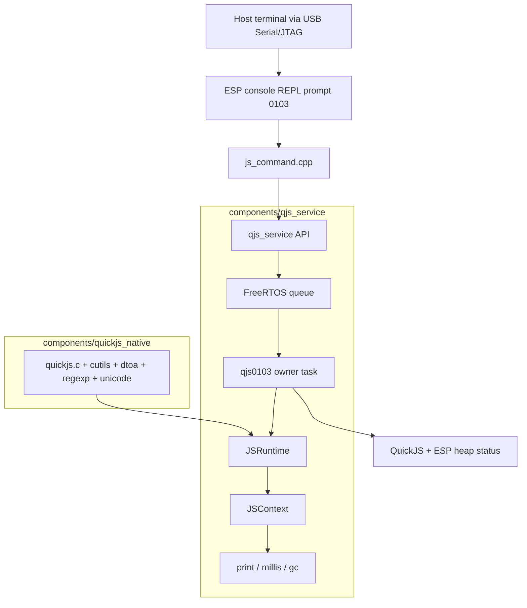

# AtomS3R M12 Native QuickJS with PSRAM — Analysis, Design, and Implementation Guide

## Executive summary

This ticket creates a new ESP-IDF firmware target, `0103-atoms3r-m12-native-quickjs`, that runs full upstream QuickJS natively on an AtomS3R M12 / ESP32-S3R8-class board with PSRAM. The first milestone is intentionally a USB Serial/JTAG console firmware. It does not initialize the AtomS3R display, WiFi, filesystem, or storage APIs. The purpose is to prove the native QuickJS runtime, service-task ownership model, PSRAM configuration, and memory budget on the smaller ESP32-S3 platform before adding additional subsystems.

The firmware reuses the native QuickJS work that was already validated on the ESP32-P4:

- `components/quickjs_native` vendors the upstream QuickJS engine source set and contains the ESP-IDF portability shim.
- `components/qjs_service` owns `JSRuntime*` and `JSContext*` on a single FreeRTOS task and exposes eval/reset/status/native-job APIs.
- `0101-esp32-p4-native-quickjs` provides the proven UART console command pattern.

The AtomS3R M12 board is connected at the same time as an ESP32-P4 board. Serial discipline is therefore part of the design. The AtomS3R M12 was identified as the Espressif USB Serial/JTAG device:

```text
/dev/serial/by-id/usb-Espressif_USB_JTAG_serial_debug_unit_B4:3A:45:BE:16:80-if00 -> /dev/ttyACM1
```

The ESP32-P4 is the CH343 bridge and must not be used for this firmware:

```text
/dev/serial/by-id/usb-1a86_USB_Single_Serial_5B61091051-if00 -> /dev/ttyACM0
```

The scaffold builds for `esp32s3`; the validated binary is `0xb4d00` bytes, leaving 82% free in the 4 MiB app partition. Hardware validation succeeded on the AtomS3R by-id USB Serial/JTAG path. The boot logs identified `ESP32-S3-PICO-1`, embedded 8 MB flash, embedded 8 MB PSRAM, and PSRAM initialized at 80 MHz. QuickJS initialized in 9 ms, simple eval/exception/reset/bench smoke passed, and the 1 MiB QuickJS cap failed cleanly as `InternalError: out of memory` under deliberate allocation pressure.

Current memory evidence supports keeping the default QuickJS cap at 1 MiB for the next milestone. Do not raise the cap to 2 MiB until WiFi/TLS/storage memory pressure is measured on the same board.

## Problem statement

The ESP32-P4 native QuickJS work proved that QuickJS can run efficiently as a native ESP-IDF component. The question now is whether the same engine and service architecture can be used on an ESP32-S3 board with a smaller memory profile: an AtomS3R M12 with 8 MB PSRAM and an 8 MB flash baseline.

This is not the same as the earlier WAMR experiment. The WAMR path used a large Wasm runtime and guest memory budget that is not appropriate for an 8 MB PSRAM device. The native path is much smaller. On ESP32-P4, an idle QuickJS runtime reported roughly 50 KiB of QuickJS memory use, with a configurable memory limit. The AtomS3R firmware therefore starts with a 1 MiB QuickJS memory cap rather than the 2 MiB cap used on the ESP32-P4 visual REPL.

The firmware has four immediate constraints:

1. It must use the AtomS3R USB Serial/JTAG console, not the ESP32-P4 CH343 port.
2. It must enable PSRAM and prove that ESP-IDF exposes it to the heap allocator.
3. It must keep QuickJS behind the existing owner-task service boundary.
4. It must leave enough headroom for future WiFi and storage work.

## Scope

### In scope for the first milestone

- New firmware directory: `0103-atoms3r-m12-native-quickjs`.
- ESP32-S3 target.
- USB Serial/JTAG console.
- 8 MB flash configuration.
- Octal PSRAM enabled at conservative 80 MHz.
- 4 MiB app partition plus a reserved 3 MiB data partition for future storage experiments.
- Native QuickJS service with:
  - 1 MiB QuickJS memory limit,
  - 64 KiB QuickJS stack limit,
  - 32 KiB-class owner task stack,
  - `print`, `millis`, and `gc` globals,
  - `js status`, `js eval`, `js reset`, `js gc`, and `js bench` console commands.
- Boot-time memory logs before and after starting QuickJS.

### Out of scope for the first milestone

- AtomS3R LCD UI.
- WiFi JavaScript APIs.
- Storage JavaScript APIs.
- Script loading from filesystem.
- Persistent JavaScript packages.
- Async JavaScript event loop semantics.
- WAMR/Wasm QuickJS.

These are intentionally deferred. The first milestone should answer one question: can the native QuickJS service run reliably on the AtomS3R M12 with PSRAM and enough memory headroom to justify the next phase?

## Hardware and serial baseline

The current workstation sees two serial devices:

| Board | USB identity | Device path | Role |
|---|---|---|---|
| ESP32-P4 PicoCalc replacement | `1a86:55d3 QinHeng Electronics USB Single Serial` | `/dev/serial/by-id/usb-1a86_USB_Single_Serial_5B61091051-if00` -> `/dev/ttyACM0` | Existing ESP32-P4 QuickJS/LCD work; do not use for 0103. |
| AtomS3R M12 | `303a:1001 Espressif USB JTAG/serial debug unit` | `/dev/serial/by-id/usb-Espressif_USB_JTAG_serial_debug_unit_B4:3A:45:BE:16:80-if00` -> `/dev/ttyACM1` | Target for this ticket. |

Always use the by-id AtomS3R path:

```bash
PORT=/dev/serial/by-id/usb-Espressif_USB_JTAG_serial_debug_unit_B4:3A:45:BE:16:80-if00
```

Do not flash by numeric `/dev/ttyACM*` unless rechecking the symlink immediately before flashing. Numeric ACM order can change when boards reset or reconnect.

## Architecture

The architecture is a direct reuse of the native QuickJS service architecture from the ESP32-P4 work. The application starts the service and registers a console command. The console command never touches `JSContext*` directly. It submits eval/reset/status work to the service.



The design has three important boundaries:

| Boundary | Rule |
|---|---|
| Serial boundary | Flash and monitor only through the AtomS3R by-id Espressif USB Serial/JTAG path. |
| Runtime boundary | Only `qjs_service` owns `JSRuntime*` and `JSContext*`. |
| API boundary | JavaScript sees explicit firmware globals and future namespaces, not QuickJS desktop `std`/`os`. |

## Firmware layout

The new firmware target contains:

```text
0103-atoms3r-m12-native-quickjs/
  CMakeLists.txt
  README.md
  partitions.csv
  sdkconfig.defaults
  main/
    CMakeLists.txt
    app_main.cpp
    js_command.cpp
    js_command.h
```

The top-level CMake file links the reusable components:

```cmake
set(EXTRA_COMPONENT_DIRS
    "${CMAKE_CURRENT_LIST_DIR}/../components/quickjs_native"
    "${CMAKE_CURRENT_LIST_DIR}/../components/qjs_service"
)
```

The application component requires only the QuickJS service and console:

```cmake
idf_component_register(
    SRCS
        "app_main.cpp"
        "js_command.cpp"
    INCLUDE_DIRS
        "."
    REQUIRES
        qjs_service
        console
    PRIV_REQUIRES
        esp_psram
        esp_timer
        heap
)
```

## ESP-IDF configuration

The firmware uses `sdkconfig.defaults` to keep the target reproducible.

### Target and console

```text
CONFIG_IDF_TARGET="esp32s3"
CONFIG_ESP_CONSOLE_USB_SERIAL_JTAG=y
# CONFIG_ESP_CONSOLE_UART_DEFAULT is not set
# CONFIG_ESP_CONSOLE_UART_CUSTOM is not set
CONFIG_ESP_CONSOLE_USB_CDC=n
CONFIG_ESP_CONSOLE_SECONDARY_NONE=y
CONFIG_ESP_CONSOLE_USB_SERIAL_JTAG_ENABLED=y
CONFIG_ESP_CONSOLE_UART_NUM=-1
```

This follows the repository rule for ESP32-S3 boards: prefer USB Serial/JTAG for interactive `esp_console` work so UART pins remain available for peripherals.

### Flash and partitions

```text
CONFIG_ESPTOOLPY_FLASHSIZE_8MB=y
CONFIG_ESPTOOLPY_FLASHSIZE="8MB"
CONFIG_PARTITION_TABLE_CUSTOM=y
CONFIG_PARTITION_TABLE_CUSTOM_FILENAME="partitions.csv"
```

The partition table reserves a 4 MiB app partition and a 3 MiB data partition:

```csv
# Name,   Type, SubType, Offset,   Size, Flags
nvs,      data, nvs,     0x9000,   0x6000,
phy_init, data, phy,     0xf000,   0x1000,
factory,  app,  factory, 0x10000,  4M,
storage,  data, fat,     ,         3M,
```

The storage partition is not used in milestone 1. It is reserved so later script-storage experiments do not need to redesign the flash layout.

### PSRAM

```text
CONFIG_SPIRAM=y
CONFIG_SPIRAM_MODE_OCT=y
CONFIG_SPIRAM_SPEED_80M=y
CONFIG_SPIRAM_USE_MALLOC=y
```

The AtomS3R M12 is expected to have 8 MB Octal PSRAM. The first build uses 80 MHz because it is a conservative validation target. Raising to 120 MHz should be considered only after the 80 MHz smoke test is stable.

`CONFIG_SPIRAM_USE_MALLOC=y` is important because the native QuickJS engine uses normal allocation paths. With this setting, ESP-IDF can satisfy normal heap allocations from PSRAM when appropriate.

## QuickJS runtime configuration

The AtomS3R firmware starts more conservatively than the ESP32-P4 firmware:

```cpp
constexpr size_t kQuickJsMemoryLimit = 1 * 1024 * 1024;
constexpr size_t kQuickJsStackLimit = 64 * 1024;
```

The service task configuration is:

```cpp
qjs_service_config_t cfg = {};
cfg.task_name = "qjs0103";
cfg.task_stack_words = 32768;
cfg.task_priority = 8;
cfg.task_core_id = -1;
cfg.queue_len = 8;
cfg.memory_limit_bytes = kQuickJsMemoryLimit;
cfg.stack_limit_bytes = kQuickJsStackLimit;
cfg.can_block = false;
```

The 1 MiB heap cap is not preallocated. It limits QuickJS-managed allocations. The actual idle runtime should be much smaller. On ESP32-P4, comparable native firmware reported about 50 KiB of QuickJS memory use at idle. The AtomS3R test must measure its own values with `js status`.

The 32 KiB-class owner task stack is retained because recursive JavaScript and the interpreter's C stack use the FreeRTOS task stack. Reducing this too early risks stack-overflow failures that look like engine instability.

## Console API

The first milestone keeps the same command surface as the proven ESP32-P4 native firmware:

```text
js status
js eval <source>
js reset
js gc
js bench
```

### `js status`

Reports service and memory state:

```text
ready=1 busy=0 evals=0 resets=0 last_eval_ms=0
limits: memory=1048576 stack=65536
quickjs: used=... malloc=... atoms=...
esp_heap: internal=... 8bit=... psram=...
```

This is the primary memory-characterization command.

### `js eval <source>`

Evaluates JavaScript through `qjs_service_eval()` with a 1000 ms timeout and label `atoms3r-eval`.

Examples:

```text
js eval "print(1+2)"
js eval "let x=41; x+1"
js eval "throw new Error('boom')"
```

### `js reset`

Recreates the QuickJS runtime/context and reinstalls firmware globals. This should clear JavaScript globals such as `x`.

### `js gc`

Runs `gc()` through the normal eval path.

### `js bench`

Runs 10k loop, 100k loop, and `fib(20)` smoke benchmarks. These are not full performance benchmarks; they are regression probes for eval, recursion, timing, output capture, and stack headroom.

## Build result

The initial scaffold was built with:

```bash
source /home/manuel/esp/esp-idf-5.4.2/export.sh
cd 0103-atoms3r-m12-native-quickjs
idf.py build
```

The build completed successfully:

```text
0103-atoms3r-m12-native-quickjs.bin binary size 0xb4d00 bytes.
Smallest app partition is 0x400000 bytes.
0x34b300 bytes (82%) free.
```

The QuickJS component emitted the known upstream pointer-type warnings that are already tolerated locally in `components/quickjs_native`. Those warnings are the same class seen on the ESP32-P4 native build and are contained to the QuickJS component.

## Flash and monitor plan

Use tmux so monitor output can be captured to a file and long crash logs do not flood the agent context.

Recommended session:

```bash
PORT=/dev/serial/by-id/usb-Espressif_USB_JTAG_serial_debug_unit_B4:3A:45:BE:16:80-if00
source /home/manuel/esp/esp-idf-5.4.2/export.sh
cd /home/manuel/workspaces/2025-12-21/echo-base-documentation/esp32-s3-m5/0103-atoms3r-m12-native-quickjs

tmux new-session -d -s qjs0103 "idf.py -p '$PORT' flash monitor"
```

Capture logs without dumping them into chat:

```bash
tmux capture-pane -t qjs0103 -p -S -2000 > /tmp/0103-atoms3r-m12-native-quickjs-smoke.log
```

If the monitor is still open and a reflash is needed, use the ESP-IDF monitor control flow from inside tmux rather than starting a second serial owner. Keep `/dev/serial/by-id/...B4:3A:45:BE:16:80...` single-owner.

## Hardware validation sequence

After flashing, validate in this order:

1. Boot logs show `0103 AtomS3R M12 native QuickJS console`.
2. Boot logs show PSRAM initialized and a plausible PSRAM size.
3. Boot logs show `before_qjs` and `after_qjs` memory baselines.
4. Boot logs show QuickJS service ready.
5. Console prompt appears as `0103>`.
6. Run:

```text
js status
js eval "print(1+2)"
js eval "throw new Error('boom')"
js eval "let x=41; x+1"
js reset
js eval "typeof x"
js bench
```

Expected behavior:

| Command | Expected result |
|---|---|
| `js status` | `ready=1`, memory limit `1048576`, stack limit `65536`, heap/PSRAM values printed. |
| `js eval "print(1+2)"` | `ok=1`, output `3`. |
| `throw new Error('boom')` | `ok=0`, error string includes `Error: boom`. |
| `let x=41; x+1` | `ok=1`, output includes completion value `42`. |
| `js reset` | `reset: ESP_OK`. |
| `typeof x` after reset | completion value should be `undefined` if the global was cleared. |
| `js bench` | 10k, 100k, and `fib20` lines complete without timeout or stack failure. |

## Extension strategy

After the AtomS3R M12 console smoke passes, extensions should be added one namespace at a time.

### Phase A: system namespace

The implemented first namespace is a read-only `system` metadata object. It is installed by a 0103-local native job through `qjs_service_run()` at boot and again after `js reset`, so the namespace is recreated whenever QuickJS recreates its runtime.

```js
system.firmware                  // "0103-atoms3r-m12-native-quickjs"
system.board                     // "AtomS3R M12"
system.target                    // "esp32s3"
system.ticket                    // "ATOMS3R-M12-NATIVE-QUICKJS"
system.psramInitialized          // true on the validated board
system.psramBytes                // 8388608 on the validated board
system.flashBytes                // 8388608 on the validated board
system.quickjsMemoryLimitBytes   // 1048576
system.quickjsStackLimitBytes    // 65536
```

The object is non-extensible and its properties are non-writable. Hardware smoke confirmed `Object.isExtensible(system)` returns `false`, strict writes fail with `TypeError: 'board' is read-only`, and `system.board` remains available after `js reset`.

### Phase B: storage namespace

Storage should use the existing `storage` partition from `0103-atoms3r-m12-native-quickjs/partitions.csv`:

```text
storage, data, fat, , 3M,
```

The first implementation should mount this partition at `/storage` with the ESP-IDF FatFs wear-levelled read/write flash API, not SPIFFS. The relevant ESP-IDF component dependency is `fatfs`, with `wear_levelling` as the wear-levelled mount dependency; earlier repository notes show that `esp_vfs_fat` is a header/API name, not the component name. This target is not using a prebuilt read-only FAT image, so `esp_vfs_fat_spiflash_mount_rw_wl()` is the right default. Use `format_if_mount_failed=true` only for an explicit first-boot developer mode or a console command; otherwise a mount error should not silently wipe scripts.

The JavaScript namespace should be virtual-rooted. JavaScript paths must never map directly to arbitrary absolute POSIX paths.

```js
storage.status()
storage.list("/scripts", { maxEntries: 64 })
storage.stat("/scripts/demo.js")
storage.readText("/scripts/demo.js", { maxBytes: 16384 })
storage.writeText("/data/log.txt", "hello\n", { maxBytes: 16384 })
storage.remove("/data/log.txt")
```

Initial virtual roots:

| JavaScript root | Native path | Intended use |
|---|---|---|
| `/scripts` | `/storage/scripts` | User-authored JavaScript files and examples. |
| `/data` | `/storage/data` | Small app data, logs, and JSON state. |
| `/tmp` | `/storage/tmp` | Replaceable scratch files; may be cleared by firmware. |

Initial limits:

| Limit | Starting value | Reason |
|---|---:|---|
| Read text maximum | 16 KiB per call | Keeps returned QuickJS strings small under the 1 MiB cap. |
| Write text maximum | 16 KiB per call | Avoids large temporary C and JS buffers. |
| Directory list maximum | 64 entries | Prevents unbounded arrays and string allocations. |
| Path length | 127 bytes after virtual-root normalization | Fits fixed buffers and avoids heap churn. |
| Open handles | none exposed to JS | Avoids lifetime bugs across reset and GC. |

Implementation rules:

- Normalize paths before opening files: reject empty segments, `..`, repeated separators that escape roots, drive-like prefixes, and absolute native paths.
- Create root directories at mount time with `mkdir()`, because FatFs supports directories; do not inherit SPIFFS assumptions from older examples where `mkdir()` was unsupported.
- Copy file contents into bounded temporary buffers before creating JavaScript strings. Check file size with `stat()`/`fseek()` before allocation.
- Keep write operations bounded and return structured errors. Flash erase/write can be slow, so a later async worker is preferable for larger writes.
- Reinstall `storage` after `js reset` exactly like `system` once the namespace exists.
- Keep autoload separate from generic storage. A future `js run /scripts/demo.js` command can read and eval a file explicitly before any boot-time autoload policy is added.

Recommended staged implementation:

1. Mount `/storage` and add console diagnostics: `storage status`, `storage list`, `storage read`, `storage write`.
2. Add JavaScript `storage.status()`, `storage.list()`, `storage.stat()`, and `storage.readText()` only.
3. Add `storage.writeText()` and `storage.remove()` after a flash-write smoke test and reset-cycle test.
4. Add `js run <virtual-path>` once read limits and eval timeout behavior are proven.

### Phase C: WiFi namespace

Use the native ESP32-S3 WiFi-service shape from `0095-m5dial-wifi-bench` as the starting point, not the ESP32-P4/Tab5 `esp_wifi_remote` path. The existing `0095` service already has the right firmware-owned state model:

```c
typedef enum {
    WIFI_APP_STATE_UNINIT = 0,
    WIFI_APP_STATE_IDLE,
    WIFI_APP_STATE_CONNECTING,
    WIFI_APP_STATE_CONNECTED,
} wifi_app_state_t;

esp_err_t wifi_app_start(void);
esp_err_t wifi_app_get_status(wifi_app_status_t *out);
esp_err_t wifi_app_set_credentials(const char *ssid, const char *password, bool save_to_nvs);
esp_err_t wifi_app_connect(void);
esp_err_t wifi_app_disconnect(void);
esp_err_t wifi_app_scan(wifi_scan_entry_t *out, size_t max_out, size_t *out_n);
```

The JavaScript namespace should expose status snapshots and request-oriented operations. It should not expose raw ESP-IDF handles, event callbacks, or passwords.

```js
wifi.status()
wifi.configure({ ssid: "...", password: "...", save: false })
wifi.connect()
wifi.disconnect()
wifi.clearCredentials()
wifi.scanStart({ maxResults: 20 })
wifi.scanStatus()
wifi.scanResults({ maxResults: 20 })
```

Return shapes:

```js
wifi.status()
// {
//   state: "uninit" | "idle" | "connecting" | "connected",
//   ssid: "..." | "",
//   hasSavedCredentials: true,
//   hasRuntimeCredentials: true,
//   staIp: "192.168.1.23" | "",
//   apIp: "192.168.4.1" | "",
//   lastDisconnectReason: 0
// }

wifi.connect()
// { ok: true, requested: "connect", state: "connecting" }

wifi.scanResults({ maxResults: 20 })
// [{ ssid: "network", rssi: -53, channel: 6, auth: "WPA2" }]
```

Implementation rules:

- Keep WiFi state firmware-owned. QuickJS asks for snapshots and enqueues requests.
- Do not block the QuickJS owner task on WiFi operations. `0095` currently uses a blocking `esp_wifi_scan_start(..., true)` helper for console use; the JavaScript binding should instead use a WiFi worker/task or async request state for scans.
- Do not call QuickJS from ESP-IDF WiFi/IP event callbacks. Event callbacks should update firmware state under a mutex or enqueue records into a firmware-owned ring buffer.
- Do not include passwords in `wifi.status()`, scan results, logs, exceptions, or `JSON.stringify()`-reachable objects.
- Treat `wifi.configure()` as setting runtime credentials; saving to NVS must be explicit through `save: true` or a separate `wifi.saveCredentials()` method.
- Measure memory after `wifi_app_start()` before deciding whether to raise the QuickJS cap above 1 MiB.

Recommended staged implementation:

1. Port a minimal `wifi_app` service from `0095-m5dial-wifi-bench`, replacing product names and AP defaults.
2. Add console diagnostics first: `wifi status`, `wifi configure`, `wifi connect`, `wifi disconnect`, `wifi scan`.
3. Measure `js status` before WiFi start, after WiFi start, while connecting, and after disconnect.
4. Install JavaScript `wifi.status()`, `wifi.connect()`, and `wifi.disconnect()` only.
5. Add async scan methods after worker/task state is in place.

### Phase D: display namespace

AtomS3R has display prior art in earlier firmware targets, but display integration is intentionally out of milestone 1. If added later, choose between:

- REPL-safe text/status APIs that append console records, or
- an explicit canvas/application mode with a recovery path.

Do not let JavaScript draw arbitrary pixels into the same screen model used by a REPL unless the mode boundary is defined.

## Risks and mitigations

| Risk | Why it matters | Mitigation |
|---|---|---|
| Wrong serial device flashed | ESP32-P4 is connected at the same time. | Always use AtomS3R by-id path; never rely on `/dev/ttyACM1` without checking. |
| PSRAM mode mismatch | Board-specific PSRAM wiring/speed may differ. | Start with Octal 80 MHz; record boot PSRAM logs; adjust only with evidence. |
| Internal RAM pressure | WiFi/TLS, stacks, queues, and DMA require internal-capable memory. | Keep milestone 1 console-only; monitor `internal` heap in `js status`. |
| QuickJS heap cap too high | 8 MB PSRAM board has less headroom than ESP32-P4. | Start with 1 MiB cap; raise only after measurements. |
| Blocking native bindings | QuickJS timeout cannot interrupt arbitrary blocking C code. | Keep future WiFi/storage APIs bounded or asynchronous. |
| Runtime ownership violation | `JSContext*` is mutable engine state. | Only access QuickJS through `qjs_service`; use `qjs_service_run/post` for native jobs. |
| Desktop API assumptions | QuickJS `std`/`os` are not included. | Expose explicit firmware APIs and document them. |

## Decision records

### Decision: Create `0103-atoms3r-m12-native-quickjs`

- **Context:** ESP32-P4 native QuickJS is working, but AtomS3R M12 has a smaller ESP32-S3/8 MB PSRAM profile.
- **Options considered:** Modify `0101`; create a board-specific `0103`; create a generic multi-target app.
- **Decision:** Create a board-specific `0103` firmware.
- **Rationale:** The first S3R port needs board-specific console, PSRAM, flash, and validation discipline. A separate target avoids destabilizing the ESP32-P4 baseline.
- **Status:** accepted.

### Decision: Use native QuickJS, not WAMR/Wasm

- **Context:** The WAMR QuickJS path worked on ESP32-P4 but used a large runtime and guest memory budget.
- **Decision:** Use `components/quickjs_native` and `components/qjs_service`.
- **Rationale:** Native QuickJS has a much smaller memory profile and removes the Wasm/WAMR layer.
- **Status:** accepted.

### Decision: Start with a 1 MiB QuickJS memory limit

- **Context:** ESP32-P4 used a 2 MiB QuickJS memory cap and 32 MB PSRAM. AtomS3R M12 is expected to have 8 MB PSRAM.
- **Decision:** Start with 1 MiB.
- **Rationale:** It is large enough for meaningful scripts and conservative enough to leave headroom for future WiFi/storage.
- **Status:** accepted for milestone 1.

### Decision: Use USB Serial/JTAG console only

- **Context:** AtomS3R exposes Espressif USB Serial/JTAG. UART pins may be needed for peripherals.
- **Decision:** Use USB Serial/JTAG as the primary console.
- **Rationale:** This follows repository practice for ESP32-S3 interactive REPL work and avoids UART pin conflicts.
- **Status:** accepted.

## Review instructions

Start review in this order:

1. `0103-atoms3r-m12-native-quickjs/sdkconfig.defaults` — board target, console, flash, PSRAM, partition settings.
2. `0103-atoms3r-m12-native-quickjs/CMakeLists.txt` — component reuse boundary.
3. `0103-atoms3r-m12-native-quickjs/main/app_main.cpp` — service startup, PSRAM baseline logging, USB Serial/JTAG console.
4. `0103-atoms3r-m12-native-quickjs/main/js_command.cpp` — console commands and eval smoke scripts.
5. `components/qjs_service/include/qjs_service.h` — service API contract.
6. `components/qjs_service/qjs_service.cpp` — runtime owner task and eval/reset/status implementation.
7. `components/quickjs_native/README.md` — source-set and portability notes.

Validate with:

```bash
source /home/manuel/esp/esp-idf-5.4.2/export.sh
cd 0103-atoms3r-m12-native-quickjs
idf.py build
```

Then flash using only the AtomS3R by-id path:

```bash
PORT=/dev/serial/by-id/usb-Espressif_USB_JTAG_serial_debug_unit_B4:3A:45:BE:16:80-if00
idf.py -p "$PORT" flash monitor
```

## References

- `components/quickjs_native/README.md`
- `components/qjs_service/include/qjs_service.h`
- `components/qjs_service/qjs_service.cpp`
- `0101-esp32-p4-native-quickjs/`
- `0103-atoms3r-m12-native-quickjs/`
- Visual/QuickJS background note in the Obsidian vault: `Projects/2026/06/24/ARTICLE - ESP32-P4 QuickJS Internals - Porting Runtime Ownership and Extension APIs.md`
