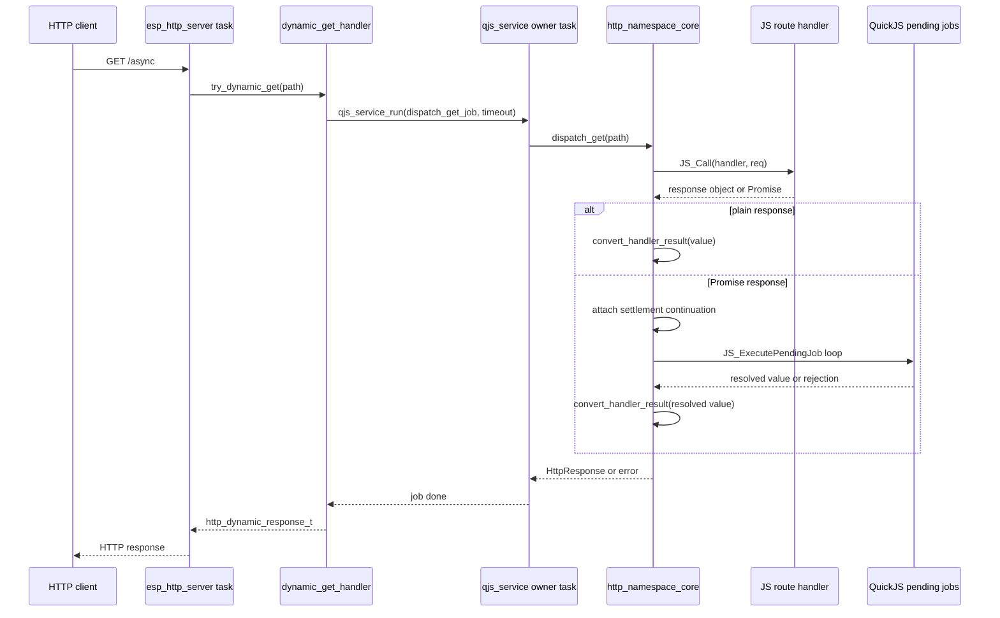

# AtomS3R QuickJS Async Dynamic Route Handlers: Analysis, Design, and Implementation Guide

## Executive summary

The current AtomS3R QuickJS firmware supports synchronous dynamic HTTP handlers. A script can register a route with `http.get(path, handler)`, the native `esp_http_server` task receives a request, and the firmware dispatches the path to the QuickJS owner task through `qjs_service_run()`. The handler must return a plain response object immediately, such as `{json: {ok: true}}` or `{text: 'hello'}`. This design is hardware-validated and reset-safe.

This ticket designs the next step: Promise-aware async route handlers. The target JavaScript API is:

```js
http.get('/proxy-healthz', async function(req) {
  const resp = await fetch('http://192.168.4.22/healthz');
  const body = await resp.text();
  return { json: { upstreamStatus: resp.status, upstreamBody: body } };
});
```

Supporting this API requires more than accepting `async function` syntax. In QuickJS, an async function returns a Promise immediately. The route dispatcher must detect that Promise, attach a continuation that converts the resolved value into the existing `HttpResponse` shape, drain pending Promise jobs inside the dispatch job's timeout window, and only then release the HTTP server task so it can send the response. The worker must remain the QuickJS owner task; the HTTP server task must still never call `JS_Call` directly.

The safest first implementation is **bounded synchronous waiting for Promise settlement inside the existing owner-task dispatch job**. That means the server task still blocks while a route is running, but the route may use Promise-producing APIs that settle during the same owner-task job. This design deliberately does not yet make HTTP request handling concurrent. It only makes handler return values Promise-aware. Worker-backed fetch, which would move network I/O off the owner task, is a separate ticket.

## Problem statement and scope

### Current behavior

The firmware currently validates this handler shape:

```js
http.get('/api/hello', function(req) {
  return { json: { ok: true, path: req.path } };
});
```

The dispatch path is:

1. `esp_http_server` receives `GET /api/hello`.
2. `http_server.cpp::static_handler()` calls `try_dynamic_get()` before static-file fallback (`http_server.cpp:273-289`).
3. `try_dynamic_get()` calls the registered `http_dynamic_get_handler_t` callback (`http_server.cpp:196-233`).
4. `http_namespace.cpp::dynamic_get_handler()` packages the path into a `DispatchGetJob` and calls `qjs_service_run()` (`http_namespace.cpp:188-205`).
5. The owner task runs `dispatch_get_job()`, which calls `s_runtime->dispatch_get(...)` (`http_namespace.cpp:171-185`).
6. The shared core calls the JavaScript handler and converts its immediate return value into `HttpResponse`.
7. The HTTP server task sends that response.

This path is synchronous by design. It is bounded by the `qjs_job_t.timeout_ms` field (`qjs_service.h:62-66`) and respects the owner-task rule.

### Desired behavior

The new behavior should allow the handler to return either:

- a plain synchronous response object, exactly as today, or
- a Promise that resolves to a plain response object.

Examples:

```js
http.get('/sync', function(req) {
  return { text: 'ok' };
});

http.get('/async', async function(req) {
  const r = await fetch('http://192.168.4.22/healthz');
  return { json: { status: r.status, body: await r.text() } };
});

http.get('/promise', function(req) {
  return fetch('http://192.168.4.22/healthz')
    .then(function(resp) { return resp.text(); })
    .then(function(body) { return { json: { body: body } }; });
});
```

### In scope

- Detecting Promise-like route return values.
- Awaiting Promise settlement inside the owner-task dispatch job.
- Reusing the current `convert_handler_result()` response rules after the Promise resolves.
- Preserving support for existing synchronous handlers.
- Keeping all `JSValue` access on the owner task.
- Enforcing route timeout and pending-job caps during settlement.
- Returning deterministic HTTP errors when a Promise rejects, times out, or settles to an invalid response.
- Host-native smoke tests for Promise-returning route handlers.
- Firmware hardware smoke tests for async routes that use already-supported Promise-producing APIs.

### Out of scope

- Moving network I/O off the owner task. That is the worker-backed fetch ticket.
- Streaming HTTP responses.
- Async POST request body parsing.
- Concurrent execution of multiple JavaScript route handlers.
- Browser-compatible `Request`/`Response` classes.
- `AbortController` or cancellation tokens.

## Current-state evidence

### qjs_service provides owner-task jobs and eval-time Promise draining

The public service API defines `qjs_job_t`, `qjs_service_eval`, `qjs_service_run`, and `qjs_service_post` (`components/qjs_service/include/qjs_service.h:60-81`). This is the only supported mechanism for entering QuickJS from another task.

The service already drains Promise jobs after console eval. `drain_pending_jobs()` calls `JS_ExecutePendingJob()` until the queue is empty, a timeout is reached, or a 64-job cap is hit (`components/qjs_service/qjs_service.cpp:222-251`). The `MSG_EVAL` path calls this drain immediately after successful `JS_Eval()` (`qjs_service.cpp:341-356`). This proves two things:

1. Promise job draining is already needed for observable `fetch().then(...)` behavior.
2. The drain helper currently exists only in eval handling, not in the `MSG_JOB` path used by dynamic route dispatch.

### The route dispatch job does not drain Promise jobs

`dynamic_get_handler()` calls `qjs_service_run()` with `dispatch_get_job` and a 1000 ms timeout (`http_namespace.cpp:195-201`). The owner-task job calls `s_runtime->dispatch_get(...)` and returns (`http_namespace.cpp:171-185`). There is no pending-job drain after the handler returns. If `dispatch_get()` receives a Promise object, the current response conversion sees it as a generic object without `json` or `text`, and the response conversion falls through to `204 No Content` (`http_namespace_core.cpp:172-247`).

### The response conversion contract is synchronous

`convert_handler_result()` accepts primitives, objects with `json`, and objects with `text` (`http_namespace_core.cpp:172-247`). It does not detect Promise objects. It does not attach continuations. It does not wait for settlement. This function should remain the final conversion step, but the dispatch path needs a new step before it: resolve Promise if needed, then convert resolved value.

### The HTTP server already handles dynamic miss versus static fallback

`try_dynamic_get()` treats `ESP_ERR_NOT_FOUND` as "no dynamic route handled this request" and returns false, which lets static serving attempt the request (`http_server.cpp:214-219`, `http_server.cpp:273-289`). For async handlers, this distinction must remain intact. A route miss should still fall through to static serving. A matched route whose Promise rejects should not fall through to static serving; it should return a 500-style error response.

## Gap analysis

| Gap | Current state | Needed state |
|---|---|---|
| Promise detection | Route return values are converted immediately. | Detect whether a return value is a Promise or thenable. |
| Settlement | Only console eval drains Promise jobs. | Dynamic dispatch can drain jobs until the route Promise settles or times out. |
| Result handoff | `convert_handler_result()` accepts immediate values. | Use the resolved Promise value as input to `convert_handler_result()`. |
| Rejection mapping | No async rejection exists. | Promise rejection maps to deterministic HTTP 500 with readable error text. |
| Timeout behavior | Job timeout interrupts synchronous JS execution. | Timeout also bounds pending job draining for Promise settlement. |
| Host tests | Host smoke covers synchronous route dispatch. | Host smoke covers Promise-returning route handlers. |
| Reset behavior | Route JSValues are cleared before reset. | Pending route settlements are also cleared or cannot survive reset. |

## Proposed architecture

The design adds Promise-aware route result handling to the shared core, not to `http_server.cpp`. The HTTP server should remain unaware of QuickJS and Promise semantics. The firmware bridge should remain responsible for scheduling the owner-task job and converting the final native `HttpResponse` into `http_dynamic_response_t`.



The new logic belongs in `http_namespace_core.cpp`, because Promise detection and response conversion are JavaScript semantics. The service should provide a reusable pending-job drain helper for job contexts, because the existing helper is private to `qjs_service.cpp` and currently tied to eval result formatting.

## Proposed API and contracts

### JavaScript API

The external route registration API does not change:

```js
http.get(path, handler)
```

A handler may return:

```js
// already supported
{ status: 200, json: { ok: true } }
{ status: 200, text: 'ok', contentType: 'text/plain; charset=utf-8' }
'plain text'
undefined

// new
Promise.resolve({ status: 200, json: { ok: true } })
async function result producing one of the supported response shapes
```

Promise rejection should map to a native error response:

```http
HTTP/1.1 500 Internal Server Error
Content-Type: text/plain; charset=utf-8

route promise rejected: <message>
```

Timeout should map to:

```http
HTTP/1.1 504 Gateway Timeout
Content-Type: text/plain; charset=utf-8

route timed out
```

ESP-IDF 5.4.2 does not expose all HTTP status macros, so the existing numeric status-to-string helper in `http_server.cpp` should be extended if `504 Gateway Timeout` is used.

### C++ core API sketch

Add a dispatch options struct:

```cpp
struct DispatchOptions {
    uint32_t timeout_ms = 1000;
    int max_pending_jobs = 64;
    bool await_promises = false;
};

struct DispatchResult {
    bool handled = false;
    bool timed_out = false;
    bool rejected = false;
    std::string error;
    HttpResponse response;
};

bool dispatch_get_async_aware(const char *path,
                              const DispatchOptions &options,
                              DispatchResult *out);
```

The first implementation can keep the existing `dispatch_get()` name and add Promise support internally. A more explicit `DispatchResult` is cleaner because it distinguishes route miss, rejection, timeout, and conversion error without overloading `bool`.

### qjs_service helper API sketch

The pending job drain should be reusable from both eval and job paths. A narrow service-level helper can be added:

```cpp
typedef struct {
  bool ok;
  bool timed_out;
  bool too_many_jobs;
  char *error;          // malloc-owned, optional
  int jobs_executed;
} qjs_drain_result_t;

esp_err_t qjs_service_drain_jobs_current(JSRuntime *rt,
                                         JSContext *default_ctx,
                                         int64_t deadline_us,
                                         int max_jobs,
                                         qjs_drain_result_t *out);
```

However, exposing `JSRuntime*` publicly widens the service API. A safer first step is to keep the helper internal and add a `qjs_job_t` flag:

```cpp
typedef struct {
  qjs_job_fn_t fn;
  void *user;
  uint32_t timeout_ms;
  bool drain_promise_jobs_after_run;
} qjs_job_t;
```

The `MSG_JOB` path would run the job, then drain pending jobs if requested. This approach is not sufficient by itself if the route core needs to know the resolved Promise value. The core still needs to attach a continuation that writes the resolved value into native state before the drain runs. Therefore, the preferred design is:

1. Add a service-internal drain helper usable by route dispatch code.
2. Call it from inside `Runtime::dispatch_get(...)` after attaching route continuations.
3. Keep `qjs_job_t` unchanged for the first implementation.

## Pseudocode for Promise-aware dispatch

The core algorithm:

```cpp
bool Runtime::dispatch_get(const char *path, HttpResponse *out, std::string *error) {
    Route *route = find_route("GET", normalized_path(path));
    if (!route) return false;

    JSValue req = make_request_object(path);
    JSValue result = JS_Call(ctx_, route->handler, JS_UNDEFINED, 1, &req);
    JS_FreeValue(ctx_, req);

    if (JS_IsException(result)) {
        *error = current_exception_string();
        return true_with_500(out, *error);
    }

    if (!is_promise(ctx_, result)) {
        bool ok = convert_handler_result(ctx_, result, out, error);
        JS_FreeValue(ctx_, result);
        return ok;
    }

    PromiseCapture capture = {};
    attach_then_handlers(result, &capture);
    JS_FreeValue(ctx_, result);

    DrainResult drain = drain_until([&] { return capture.settled; }, deadline, max_jobs);
    if (drain.timed_out) return response_504(out, "route timed out");
    if (!drain.ok) return response_500(out, drain.error);
    if (capture.rejected) return response_500(out, capture.error);

    bool ok = convert_handler_result(ctx_, capture.resolved_value, out, error);
    JS_FreeValue(ctx_, capture.resolved_value);
    return ok;
}
```

The continuation attachment can use `Promise.prototype.then`:

```cpp
JSValue on_fulfilled = JS_NewCFunctionData(ctx, capture_fulfilled, 1, 0, 1, data);
JSValue on_rejected  = JS_NewCFunctionData(ctx, capture_rejected, 1, 0, 1, data);
JSValue then = JS_GetPropertyStr(ctx, promise, "then");
JSValue argv[2] = { on_fulfilled, on_rejected };
JSValue chained = JS_Call(ctx, then, promise, 2, argv);
```

The capture functions must duplicate the resolved `JSValue` into the capture struct while still on the owner task. The capture struct lifetime must cover the drain loop and must not outlive the dispatch job.

## Decision records

### Decision: Await Promise-returning route handlers inside the owner-task dispatch job

- **Context:** Dynamic routes currently run on the owner task through `qjs_service_run()`. Async handlers return Promises that need pending-job draining before a response exists.
- **Options considered:** Reject Promise returns; drain only in `qjs_service_eval`; await Promise settlement inside the dispatch job; redesign routes around worker tasks immediately.
- **Decision:** Await Promise settlement inside the existing owner-task dispatch job for the first async route milestone.
- **Rationale:** This preserves the owner-task rule, reuses the current dispatch structure, keeps the API simple, and avoids introducing a worker scheduler before the need is proven.
- **Consequences:** A slow async route still blocks the owner task and HTTP server task until timeout. Worker-backed fetch remains a separate optimization.
- **Status:** proposed

### Decision: Keep synchronous response shapes unchanged

- **Context:** Existing scripts return `{json: ...}` or `{text: ...}` and are hardware-validated.
- **Options considered:** Replace response objects with browser `Response`; add Express-like mutable `res`; keep current shape and allow Promise of that shape.
- **Decision:** Async handlers resolve to the same response shapes already supported by `convert_handler_result()`.
- **Rationale:** This keeps compatibility, avoids adding new JavaScript classes, and focuses the ticket on Promise settlement rather than response API expansion.
- **Consequences:** Developers still cannot return arbitrary `{headers, body}` objects unless a separate compatibility feature is added.
- **Status:** proposed

### Decision: Map rejected Promises to HTTP errors, not static fallback

- **Context:** `ESP_ERR_NOT_FOUND` currently means "no dynamic route matched" and triggers static fallback.
- **Options considered:** Treat rejection as route miss; return 500; return 204; expose rejection body directly.
- **Decision:** A matched route whose Promise rejects returns a 500-style response.
- **Rationale:** Route match and route execution failure are different states. Falling through to static serving would hide application errors and make debugging harder.
- **Consequences:** The server needs an error-response mapping path distinct from route miss.
- **Status:** proposed

## Implementation plan

### Phase 1: Host-core Promise detection

- Add `is_promise(JSContext*, JSValueConst)` helper to `http_namespace_core.cpp`.
- Add host-only tests where handlers return `Promise.resolve({json:{...}})`.
- Confirm synchronous handlers still pass the existing smoke test.

Validation:

```bash
0103-atoms3r-m12-native-quickjs/host/native-http/tests/run-smoke.sh
```

### Phase 2: Promise settlement capture

- Add C function data callbacks for fulfillment and rejection.
- Store resolved `JSValue` and rejection message in a stack-owned capture struct.
- Drain QuickJS jobs until capture settles or timeout/job cap is reached.
- Convert the resolved value through the existing response converter.

Validation:

```js
http.get('/promise', () => Promise.resolve({json:{ok:true}}));
```

### Phase 3: Firmware dispatch integration

- Ensure `dispatch_get_job()` passes timeout/job-cap options to the core.
- Extend error mapping in `http_namespace.cpp` and `http_server.cpp` if needed.
- Build firmware.

Validation:

```bash
source /home/manuel/esp/esp-idf-5.4.2/export.sh
idf.py -C 0103-atoms3r-m12-native-quickjs build
```

### Phase 4: Hardware validation

- Flash through the by-id USB Serial/JTAG path.
- Register a Promise-returning handler from `js eval` or `js run`.
- Validate with `curl`.
- Validate rejection and timeout behavior.
- Validate `js reset` clears pending and stored route state.

Example:

```text
http start 80
js eval "http.get('/async-ok', function(){ return Promise.resolve({json:{ok:true}}); })"
curl --max-time 5 -i http://192.168.4.22/async-ok
```

### Phase 5: Documentation and examples

- Add an async route example under `examples/scripts/`.
- Update the README response-shape section.
- Update the host/fetch final report or add a follow-up note if behavior changes.

## Test strategy

### Host tests

1. Synchronous route still works.
2. `Promise.resolve({json:{ok:true}})` works.
3. `.then(() => ({text:'ok'}))` works.
4. `Promise.reject(new Error('boom'))` returns a deterministic error response.
5. A Promise chain longer than the job cap fails safely.
6. A handler resolving to `{headers, body}` still follows the documented response conversion behavior or fails with a documented message.

### Firmware build tests

- `idf.py -C 0103-atoms3r-m12-native-quickjs build`.
- Binary size comparison before/after.
- Host smoke after any shared core change.

### Hardware tests

- `GET /async-ok` returns 200 JSON.
- `GET /async-reject` returns 500 text.
- `GET /async-timeout` returns timeout error and the runtime remains usable.
- `js reset` clears routes and reinstalls `http`.
- Native `/healthz` still works after route errors.

## Risks and mitigations

| Risk | Impact | Mitigation |
|---|---|---|
| Owner task blocked by slow async route | Console and other routes stall. | Keep 1000 ms default timeout; cap job count; document that worker fetch is separate. |
| Promise continuation captures invalid pointers | Crash or memory corruption. | Capture struct lives on the dispatch stack; continuations only run during the same drain loop. |
| Rejected Promise falls through to static | Hidden route failures. | Distinguish route miss from matched-route failure. |
| Too many pending jobs | Owner task starvation. | Use a 64-job cap initially, matching eval drain behavior. |
| Reset during pending dispatch | Invalid JSValues. | Dispatch is synchronous; reset command queues behind current job. Future worker designs need explicit cancellation. |

## References

- `components/qjs_service/include/qjs_service.h:60-81` — owner-task job/eval API.
- `components/qjs_service/qjs_service.cpp:222-251` — existing bounded Promise job drain.
- `components/qjs_service/qjs_service.cpp:341-356` — eval path calls the drain.
- `0103-atoms3r-m12-native-quickjs/main/http_namespace_core.h:68-90` — `Runtime` owns route storage and dispatch.
- `0103-atoms3r-m12-native-quickjs/main/http_namespace_core.cpp:172-247` — current response conversion rules.
- `0103-atoms3r-m12-native-quickjs/main/http_namespace.cpp:188-205` — firmware dynamic GET bridge through `qjs_service_run()`.
- `0103-atoms3r-m12-native-quickjs/main/http_server.cpp:196-233` — server dynamic handler callback and response send.
- `0103-atoms3r-m12-native-quickjs/main/http_server.cpp:273-289` — dynamic-first, static-fallback wildcard handler.
