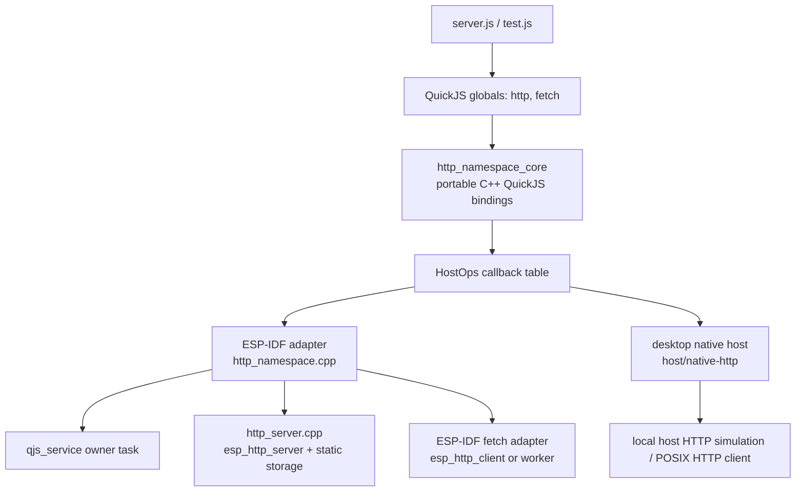

# AtomS3R QuickJS Host HTTP and Fetch API: Analysis, Design, and Implementation Guide

## Executive summary

This ticket defines the next layer of the AtomS3R M12 native QuickJS firmware: a JavaScript-facing HTTP API that can be developed and tested on a desktop host while sharing the same binding code with ESP-IDF firmware. The device is currently disconnected, so the immediate goal is to make meaningful progress without hardware by creating a host executable similar to the 0102 PicoCalc native host. The host should embed QuickJS, install the same `http` and `fetch` APIs that firmware will install, load example scripts, and run smoke tests against an in-process or local HTTP adapter.

The design has three boundaries:

1. **Portable QuickJS binding core.** This code includes `quickjs.h`, owns JavaScript objects, route tables, response objects, and `fetch()` argument/result conversion. It must not include ESP-IDF headers. It should compile both in the ESP-IDF app and in a desktop `make` build.
2. **Firmware adapter.** This code runs inside `0103-atoms3r-m12-native-quickjs`, installs the core through `qjs_service_run()`, and connects host operations to `http_server_*`, storage streaming, and ESP-IDF networking.
3. **Desktop host adapter.** This code mirrors the 0102 `native-host` pattern: compile upstream QuickJS directly with `g++`/`gcc`, install the same core, load scripts from files, and emulate host HTTP operations without needing the AtomS3R.

The requested `fetch()` API is part of the same design because it exercises the same cross-boundary problem as dynamic routes: JavaScript asks for network work, native code owns the network implementation, and results must re-enter QuickJS only on the QuickJS owner context. The first implementation should be bounded and explicit rather than a full browser-compatible Fetch stack. It should support simple HTTP requests, small text/JSON responses, timeout limits, and no credentials or ambient browser state.

## Problem statement and scope

The 0103 firmware already has a host-owned HTTP server. It can start and stop `esp_http_server`, serve `/healthz`, map URL prefixes to bounded storage virtual roots, and stream static files from FatFs. That path was validated on AtomS3R hardware before the device was disconnected. The next step is to expose a JavaScript API so scripts can configure the host server and register dynamic routes:

```javascript
http.static('/static', '/data');
http.get('/api/hello', (req) => ({ ok: true, path: req.path }));
http.start(80);
```

The user also wants `fetch()`:

```javascript
const r = await fetch('http://192.168.4.22/healthz');
print(await r.text());
```

The difficulty is not the JavaScript syntax. The difficulty is preserving the firmware's runtime ownership, reset behavior, memory limits, storage safety, and desktop-testability. QuickJS values belong to one `JSRuntime`/`JSContext`. In firmware that context is owned by `qjs_service`; other tasks must not call QuickJS directly. The desktop host has no FreeRTOS owner task, but it should still use the same core binding code so API behavior is not duplicated.

### In scope

- A shared C++ QuickJS binding core for `http` and `fetch()`.
- A desktop native host that compiles and runs the shared core without ESP-IDF.
- A firmware wrapper that installs the shared core through `qjs_service_run()`.
- `http.status()`, `http.start()`, `http.stop()`, `http.static()`, `http.clearStatic()`, and `http.get()`.
- Bounded dynamic route request/response DTOs.
- A bounded `fetch()` API with a small response object.
- Reset-safe clearing of stored JavaScript handlers and pending fetch state.
- Host smoke tests that can run while the device is disconnected.

### Out of scope for the first implementation

- HTTPS/TLS validation policy. HTTPS can be added later after memory measurements.
- Browser compatibility beyond the subset explicitly documented here.
- Cookies, redirects, cache, CORS, service workers, streams, compression, WebSocket, upload progress, and abort signals.
- Authentication helpers. The milestone remains unauthenticated by request.
- Autoloading scripts at boot. Server scripts should be manually loaded until recovery controls exist.

## Current-state analysis

### 0102 already has the host split we need

The 0102 PicoCalc work contains a desktop native host under `0102-esp32-p4-visual-quickjs-repl/js/tools/native-host`. Its README states the intended split directly: `src/pico_native_api.*` is portable/firmware-oriented binding code, while `src/main.cpp` is host-only ANSI terminal and file-loading glue (`0102-esp32-p4-visual-quickjs-repl/js/tools/native-host/README.md:3-6`). The same README calls out the portability boundary: portable code in `src/pico_native_api.hpp/.cpp`, host-only code in `src/main.cpp` (`README.md:35-42`). It also documents callback ownership and teardown: native structs store duplicated QuickJS values via RAII and `runtime_destroy()` tears native state down before freeing the QuickJS runtime (`README.md:44-48`).

The 0102 host build is intentionally simple. Its `Makefile` compiles `src/main.cpp`, `src/pico_native_api.cpp`, and the upstream QuickJS sources directly from the vendored tree (`Makefile:1-11`). The public host API is small: create/destroy runtime, get context, load files, run frames, send keys, render text, and read `host_millis()` (`pico_native_api.hpp:10-23`). This is the model to copy for 0103: the host executable should be small, the portable core should own QuickJS binding behavior, and the host-only code should handle file paths, command-line options, and local network/file adapters.

### 0103 already has a host-owned HTTP server and storage streaming layer

The current 0103 HTTP server is firmware-owned. `http_server.h` exposes start/stop and static mount operations: `http_server_start`, `http_server_stop`, `http_server_add_static_mount`, and `http_server_clear_static_mounts` (`0103-atoms3r-m12-native-quickjs/main/http_server.h:11-15`). The implementation stores server state and static mounts behind a FreeRTOS mutex (`http_server.cpp:35-61`), validates path shapes (`http_server.cpp:64-89`), maps URL prefixes to storage virtual paths (`http_server.cpp:100-137`), detects MIME types (`http_server.cpp:139-151`), and streams files in chunks (`http_server.cpp:201-222`). The server registers exact routes for `/healthz` and `/`, then a wildcard route for static files (`http_server.cpp:225-245`). Static mount registration validates the target virtual root before storing it (`http_server.cpp:403-435`).

The storage namespace now exposes the two helpers static HTTP serving needs: `storage_namespace_validate_virtual_path` and `storage_namespace_stream_file` (`0103-atoms3r-m12-native-quickjs/main/storage_namespace.h:15-21`). This is important because HTTP must not expose native `/storage/...` paths. It should consume only virtual paths such as `/data/index.html`, `/scripts/server.js`, and `/tmp/foo.txt`.

### QuickJS access is serialized by qjs_service

The firmware service API defines `qjs_job_fn_t` and `qjs_service_run()` (`components/qjs_service/include/qjs_service.h:60-79`). This is the rule that shapes firmware integration: module installation, route dispatch, and promise settlement must happen on the QuickJS owner task. The reset path already reinstalls `system`, `storage`, and `wifi` after `qjs_service_reset()` (`0103-atoms3r-m12-native-quickjs/main/js_command.cpp:121-145`). The new `http` namespace must join that same reset path, and it must clear any JavaScript callbacks it stored before the runtime is destroyed.

### App startup currently installs system/storage/wifi but not http

At boot, 0103 starts storage, starts WiFi, starts the QuickJS service, installs `system`, `storage`, and `wifi`, and registers console commands (`0103-atoms3r-m12-native-quickjs/main/app_main.cpp:63-103`). HTTP console commands are registered, but there is not yet a QuickJS `http` namespace. The implementation should add one installer after `install_wifi_namespace(svc)` and mirror it in `cmd_reset()`.

## Gap analysis

The current system has server primitives but no JavaScript route API. It has a static server but no way for a script to configure it except through the console. It has QuickJS module patterns but no host-buildable HTTP module. It has an implementation need for `fetch()` but no native outbound HTTP adapter, no response object, and no reset behavior for pending asynchronous work.

The missing pieces are:

| Gap | Why it matters | Proposed answer |
|---|---|---|
| No shared HTTP binding core | Firmware-only code cannot be tested while the device is disconnected. | Add `http_namespace_core.{h,cpp}` with no ESP-IDF headers. |
| No desktop host | API scripts cannot be smoke-tested locally. | Add `host/native-http` using the 0102 native-host pattern. |
| No JS `http` object | Scripts cannot start, stop, mount static files, or register dynamic routes. | Install global `http` through `qjs_service_run()` in firmware and directly in the host. |
| No dynamic route dispatch | `http.get()` handlers need stored callbacks and request/response objects. | Store duplicated `JSValue` callbacks in the shared core; firmware dispatches through owner-task jobs. |
| No reset clearing | Stored callbacks become invalid after `js reset`. | Clear route table and pending fetches before/after reset; reinstall namespace. |
| No `fetch()` API | Scripts cannot call HTTP endpoints or test their own routes. | Add a bounded subset using host operation callbacks and a small Response object. |
| No host/device API parity tests | Behavior can diverge silently. | Run the same JS examples on host and device. |

## Proposed architecture

The core design is an inversion of ownership. JavaScript sees a normal global API, but the C++ binding core does not own server sockets, FatFs, WiFi, or outbound networking. It owns JavaScript-facing state and calls an operation table for host services.



The shared core must be able to run in two modes:

- **Firmware mode:** installed through `qjs_service_run()`, with callbacks pointing at ESP-IDF operations.
- **Host mode:** installed directly into a host-created `JSContext*`, with callbacks pointing at desktop implementations.

The JavaScript API is the same in both modes. If a script fails in the host because it violates path rules, return limits, or route-shape rules, it should fail the same way on device.

## Public JavaScript API

### `http.status()`

Returns server and route metadata:

```javascript
http.status()
// -> {
//      running: false,
//      port: 0,
//      staticMounts: [{ prefix: '/static', root: '/data' }],
//      routes: [{ method: 'GET', path: '/api/hello' }],
//      limits: { maxRoutes: 16, maxBodyBytes: 4096, maxStaticFileBytes: 131072 }
//    }
```

The core can always report static mounts and dynamic routes because it owns those lists. Firmware-specific memory counters should stay in `system` or `js status`; `http.status()` should stay focused on HTTP state.

### `http.start(port = 80)` and `http.stop()`

These call the host operation table. They return a small result object rather than throwing for the already-running/already-stopped cases:

```javascript
http.start(80) // -> { ok: true, running: true, port: 80 }
http.stop()    // -> { ok: true, running: false, port: 0 }
```

Fatal errors such as an invalid port or adapter failure should throw an `InternalError` with an operation name.

### `http.static(prefix, virtualRoot)` and `http.clearStatic()`

These map URL prefixes to storage virtual roots:

```javascript
http.static('/static', '/data')
http.clearStatic()
```

Firmware uses `http_server_add_static_mount(prefix, virtualRoot)`, which already validates paths and stores a bounded mount table. The core should keep a mirror list for `http.status()` and for host behavior. The host must use the same path rules: prefix starts with `/`, no `..`, no backslashes, no query/hash characters, bounded length.

### `http.get(path, handler)`

Registers a dynamic GET handler:

```javascript
http.get('/api/hello', (req) => {
  return { status: 200, json: { ok: true, path: req.path } };
});
```

The first implementation should support return-object handlers rather than a mutable Express response object. This keeps the route contract small and host-testable. A handler returns one of:

```javascript
'plain text body'
{ text: 'plain text body' }
{ status: 201, text: 'created' }
{ json: { ok: true } }
{ status: 404, text: 'not found', contentType: 'text/plain; charset=utf-8' }
```

The core converts the return value to an internal `HttpResponse`:

```cpp
struct HttpResponse {
  int status;
  std::string content_type;
  std::string body;
};
```

This is intentionally smaller than Express. It does not expose streaming, sockets, or arbitrary native handles. Later phases can add a response-builder object if the simple return contract is insufficient.

### `fetch(url, options?)`

The first `fetch()` should be a bounded embedded subset. The API should look familiar, but it must not claim full browser compatibility.

Recommended contract:

```javascript
const r = await fetch('http://example.local/path', {
  method: 'GET',              // initially GET/POST only
  headers: { Accept: 'text/plain' },
  body: 'small request body', // cap enforced by native adapter
  timeoutMs: 1000             // cap enforced by native adapter
});

print(r.status);
print(r.ok);
print(r.headers['content-type']);
print(await r.text());
print(JSON.stringify(await r.json()));
```

Response object subset:

```javascript
{
  ok: boolean,
  status: number,
  statusText: string,
  url: string,
  headers: object,
  text(): Promise<string>,
  json(): Promise<any>
}
```

The body should be stored as a bounded string in native/QuickJS-owned memory. `text()` returns it. `json()` parses it with `JSON.parse`. There is no streaming body in the first milestone.

## `fetch()` execution model

There are two realistic implementation strategies.

### Option A: synchronous host operation returning an already-resolved Promise

The binding calls `ops.fetch(...)`, waits for the native adapter to complete, builds a Response object, and returns `Promise.resolve(response)`. This is easiest to test and works on desktop. In firmware, however, it blocks the QuickJS owner task while networking runs. That is acceptable only for very small, explicitly timed requests and must remain bounded.

Pseudocode:

```cpp
JSValue js_fetch(ctx, this, argc, argv) {
  FetchRequest req = parse_fetch_args(ctx, argv);
  FetchResult result = ops.fetch(req);        // bounded blocking call
  JSValue response = make_response(ctx, result);
  return JS_Call(ctx, promiseResolve, JS_UNDEFINED, 1, &response);
}
```

### Option B: asynchronous worker and pending Promise settlement

The binding creates a Promise capability, stores duplicated resolve/reject functions in a pending table, submits the native request to a worker, and returns the Promise immediately. When the worker completes, firmware posts a `qjs_service_run()` job to settle the Promise on the owner task.

Pseudocode:

```cpp
JSValue js_fetch(ctx, this, argc, argv) {
  PromiseCapability cap = JS_NewPromiseCapability(ctx);
  int id = pending.add(cap.resolve, cap.reject);
  worker.submit({ id, parsedRequest });
  return cap.promise;
}

// Worker completion path, not on QuickJS owner task:
qjs_service_run(svc, [](JSContext *ctx, void *user) {
  Completion *c = static_cast<Completion *>(user);
  Pending p = pending.take(c->id);
  if (c->ok) JS_Call(ctx, p.resolve, JS_UNDEFINED, 1, &response);
  else JS_Call(ctx, p.reject, JS_UNDEFINED, 1, &error);
});
```

Option B is architecturally stronger for firmware, but it has more moving parts: pending tables, worker lifetime, cancellation on reset, and memory ownership for completion payloads. The recommended implementation sequence is:

1. Build the shared core and host adapter with Option A so API conversion and tests exist.
2. Keep the firmware wrapper initially bounded and conservative.
3. If blocking fetch causes unacceptable owner-task stalls, move firmware fetch to Option B without changing the JavaScript API.

## Decision records

### Decision: Use a portable core plus host operation callbacks

- **Context:** The device is disconnected, but we still need to implement and test the JavaScript API. Firmware-only code would block progress and make API iteration slow.
- **Options considered:** Firmware-only implementation; desktop-only mock with duplicated JS behavior; shared core with host callbacks.
- **Decision:** Use a shared `http_namespace_core.{h,cpp}` that owns QuickJS binding behavior and calls a `HostOps` table for host-specific work.
- **Rationale:** This matches the proven 0102 native-host split and lets host tests exercise the same JavaScript bindings that firmware uses.
- **Consequences:** The core must avoid ESP-IDF headers and must represent errors with portable integer/status contracts. Firmware wrappers translate `esp_err_t`; host wrappers translate POSIX/curl/socket errors.
- **Status:** proposed

### Decision: Expose a global `http` object, not CommonJS `require('express')`

- **Context:** The firmware does not compile `quickjs-libc.c`, and the existing namespace pattern exposes globals such as `system`, `storage`, and `wifi`.
- **Options considered:** `require('http')`; `import` module loader; global `http` object.
- **Decision:** Install a non-extensible global `http` object.
- **Rationale:** The global namespace pattern is already reset-safe and does not require a filesystem-backed module loader. It fits console usage and stored scripts.
- **Consequences:** The API is smaller than Express. Examples should use `http.get(...)` directly.
- **Status:** proposed

### Decision: Start dynamic handlers with return-object responses

- **Context:** Express-style mutable `res` objects are familiar but require more native state and lifecycle tracking.
- **Options considered:** Express-like `(req, res) => res.json(...)`; return-object handlers; only static serving.
- **Decision:** Implement `handler(req) -> responseSpec` first.
- **Rationale:** It minimizes native object lifetime, is easy to test on host, and avoids response objects escaping the handler call.
- **Consequences:** Streaming responses and incremental writes are deferred. If needed, a response-builder object can be added later without breaking the initial form.
- **Status:** proposed

### Decision: Implement `fetch()` as a bounded subset

- **Context:** Browser Fetch is large. The firmware has a 1 MiB QuickJS heap cap, limited internal RAM, and no browser concepts such as CORS or cookies.
- **Options considered:** Full Fetch compatibility; synchronous `fetchSync`; Promise-returning bounded subset.
- **Decision:** Provide `fetch()` with a Promise-returning bounded subset: URL, method, headers, small body, timeout, response status/headers/text/json.
- **Rationale:** The familiar API is useful, but the implementation must explicitly reject unsupported features rather than pretending to be a browser.
- **Consequences:** Some browser code will not run unchanged. Documentation and tests must define the subset clearly.
- **Status:** proposed

### Decision: Host tests run without ESP-IDF

- **Context:** The device is disconnected. ESP-IDF builds are slower and cannot validate host-only behavior.
- **Options considered:** IDF unit tests; desktop CMake; simple Makefile like 0102.
- **Decision:** Add a simple `make`-based host tool under the 0103 tree, mirroring 0102.
- **Rationale:** The 0102 pattern already works and compiles QuickJS directly from the vendored sources.
- **Consequences:** The host adapter may need small compatibility shims for ESP-IDF types and errors, but the core should not.
- **Status:** proposed

## Implementation design

### File layout

Recommended files:

```text
0103-atoms3r-m12-native-quickjs/
  main/
    http_namespace_core.h      # portable QuickJS binding core API
    http_namespace_core.cpp    # JS http/fetch binding implementation
    http_namespace.h           # ESP-IDF install wrapper
    http_namespace.cpp         # qjs_service_run + http_server/esp_http_client adapter
    http_server.h              # existing server lifecycle/static API
    http_server.cpp            # existing host-owned esp_http_server implementation
  host/
    native-http/
      Makefile
      README.md
      src/main.cpp             # host-only script loader and request dispatcher
      src/host_http_ops.cpp    # desktop HostOps implementation
      examples/server.js
      tests/run-smoke.sh
```

The core should compile in both places. The host `Makefile` can follow the 0102 pattern: compile the host sources, the core sources from `../../main`, and the QuickJS C files from `0100-esp32-p4-quickjs-wasm/wasm-src/quickjs`.

### Core C++ API sketch

```cpp
namespace qjs_http {

struct HostStatus {
  bool running;
  uint16_t port;
};

struct FetchRequest {
  std::string url;
  std::string method;
  std::vector<Header> headers;
  std::string body;
  uint32_t timeout_ms;
};

struct FetchResponse {
  int status;
  std::string status_text;
  std::string final_url;
  std::vector<Header> headers;
  std::string body;
};

struct HostOps {
  void *user;
  int (*start)(void *user, uint16_t port);
  int (*stop)(void *user);
  int (*add_static_mount)(void *user, const char *prefix, const char *root);
  int (*clear_static_mounts)(void *user);
  int (*status)(void *user, HostStatus *out);
  int (*fetch)(void *user, const FetchRequest *req, FetchResponse *out, std::string *error);
};

class Runtime {
 public:
  Runtime(JSContext *ctx, const HostOps &ops);
  ~Runtime();
  int install_global();
  void clear_routes();
  bool dispatch_get(const char *path, HttpResponse *out, std::string *error);
};

} // namespace qjs_http
```

The exact names may change during implementation. The important property is that `HostOps` is the only path from the core to native host services.

### Firmware install wrapper pseudocode

```cpp
static qjs_http::Runtime *s_http_runtime = nullptr;

static esp_err_t install_http_job(JSContext *ctx, void *user) {
  qjs_service_t *svc = static_cast<qjs_service_t *>(user);
  qjs_http::HostOps ops = make_firmware_http_ops(svc);
  delete s_http_runtime;
  s_http_runtime = new qjs_http::Runtime(ctx, ops);
  if (!s_http_runtime) return ESP_ERR_NO_MEM;
  return s_http_runtime->install_global() == 0 ? ESP_OK : ESP_FAIL;
}

esp_err_t install_http_namespace(qjs_service_t *svc) {
  qjs_job_t job = {};
  job.fn = install_http_job;
  job.user = svc;
  job.timeout_ms = 1000;
  return qjs_service_run(svc, &job);
}

esp_err_t clear_http_namespace_state(qjs_service_t *svc) {
  qjs_job_t job = { .fn = clear_http_job, .timeout_ms = 1000 };
  return qjs_service_run(svc, &job);
}
```

The reset path should clear stored routes before the runtime is destroyed if possible. If the existing `qjs_service_reset()` API does not provide a pre-reset hook, then `cmd_reset()` should call `clear_http_namespace_state(g_svc)` before reset, then call `install_http_namespace(g_svc)` after reset. If reset destroys values before the clear hook can run, the implementation must ensure global destructors do not free `JSValue`s against a dead context.

### Firmware dynamic route dispatch pseudocode

The HTTP server task must not call QuickJS directly. A dynamic route handler in `http_server.cpp` should build a plain request DTO, then enqueue a `qjs_service_run()` job. The job calls the shared core's `dispatch_get()` on the owner task.

```cpp
struct DispatchJob {
  const char *method;
  const char *path;
  HttpResponse response;
  std::string error;
};

esp_err_t dynamic_handler(httpd_req_t *req) {
  DispatchJob job = parse_request(req);
  qjs_job_t qjob = {
    .fn = [](JSContext *ctx, void *user) {
      auto *job = static_cast<DispatchJob *>(user);
      return s_http_runtime->dispatch_get(job->path, &job->response, &job->error)
        ? ESP_OK
        : ESP_ERR_NOT_FOUND;
    },
    .user = &job,
    .timeout_ms = 1000,
  };
  esp_err_t err = qjs_service_run(g_svc, &qjob);
  return send_response(req, job.response, err, job.error);
}
```

This is the same owner-task rule as module installation. The HTTP task blocks while the route handler runs, but QuickJS stays serialized and safe.

### Host runner pseudocode

The host runner creates a QuickJS runtime directly and installs the same core. It should support at least these commands:

```bash
make -C 0103-atoms3r-m12-native-quickjs/host/native-http all
0103-atoms3r-m12-native-quickjs/host/native-http/build/qjs-http-host examples/server.js --dispatch /api/hello
0103-atoms3r-m12-native-quickjs/host/native-http/tests/run-smoke.sh
```

Pseudocode:

```cpp
int main(int argc, char **argv) {
  JSRuntime *rt = JS_NewRuntime();
  JSContext *ctx = JS_NewContext(rt);
  qjs_http::HostOps ops = make_desktop_ops();
  qjs_http::Runtime http(ctx, ops);
  http.install_global();

  eval_file(ctx, argv[1]);

  if (dispatch_path) {
    qjs_http::HttpResponse r;
    std::string err;
    http.dispatch_get(dispatch_path, &r, &err);
    print_response(r, err);
  }

  JS_FreeContext(ctx);
  JS_FreeRuntime(rt);
}
```

The host does not need to open a real server socket for the first smoke. It can call `dispatch_get()` directly, which tests route registration, handler invocation, response conversion, and reset-style teardown. A later host mode can add a real localhost server if useful.

## `fetch()` design details

### Request parsing

`fetch(input, init)` should accept a string URL first. Supporting `Request` objects can wait.

```javascript
fetch('http://127.0.0.1:8080/healthz')
fetch('http://127.0.0.1:8080/echo', {
  method: 'POST',
  headers: { 'content-type': 'text/plain' },
  body: 'hello',
  timeoutMs: 1000
})
```

Validation rules:

- URL must be a string and must start with `http://` for the first firmware milestone.
- Method defaults to `GET`; allowed methods are initially `GET` and `POST`.
- Header names and values must be strings.
- Header count is capped, for example at 16.
- Body length is capped, for example at 4096 bytes.
- Timeout is capped, for example 50 to 5000 ms, with default 1000 ms.
- Response body is capped, for example at 16 KiB or 32 KiB until memory is measured.

### Response object

The response object should be immutable in shape. It may hold body text in a private native record or as a hidden property. Simpler first implementation: store the body string as an internal property that `text()` and `json()` use.

```javascript
const res = await fetch(url);
res.ok;          // boolean, status in [200, 299]
res.status;      // number
res.statusText;  // string
res.url;         // final URL, initially same as input
res.headers;     // plain object with lower-case keys
await res.text();
await res.json();
```

`text()` can return `Promise.resolve(body)`. `json()` can evaluate `JSON.parse(body)` and return a resolved or rejected Promise. If implementing real Promise settlement is too much for the first host smoke, the temporary host-only form may return immediate strings, but the ticket goal should remain a Promise-returning API.

### Firmware adapter

The firmware adapter should use ESP-IDF HTTP client only after the core API is tested on host. It should not expose WiFi credentials and should not allow arbitrary TLS behavior by default. For the first version, `http://` only is acceptable and consistent with the local-network milestone.

Firmware fetch can be implemented in two phases:

1. **Bounded blocking fetch:** call the ESP-IDF HTTP client from the QuickJS owner task with a short timeout. This is simple but blocks the JS runtime.
2. **Worker-backed fetch:** move the network request to a FreeRTOS worker and settle a Promise with `qjs_service_run()` when complete. This is the better final architecture if fetch becomes more than a diagnostic/local-network helper.

The implementation guide recommends starting with host Option A and designing the data structures so firmware can move to Option B without changing JavaScript.

## Testing strategy

### Host smoke tests

Host tests should run without ESP-IDF and without an AtomS3R:

```bash
make -C 0103-atoms3r-m12-native-quickjs/host/native-http all
0103-atoms3r-m12-native-quickjs/host/native-http/tests/run-smoke.sh
```

Expected host smoke coverage:

- `typeof http === 'object'`
- `http.status()` returns an object.
- `http.static('/static', '/data')` records a mount.
- `http.get('/api/hello', () => ({json:{ok:true}}))` registers a route.
- Direct host dispatch of `/api/hello` returns `200` and JSON body.
- `fetch('http://127.0.0.1/...')` returns a bounded response in the accepted subset.
- Reset/teardown frees stored JS handlers without leaks or crashes.

### Firmware build tests

Until hardware is reconnected:

```bash
source /home/manuel/esp/esp-idf-5.4.2/export.sh
idf.py -C 0103-atoms3r-m12-native-quickjs build
```

Once hardware returns:

```text
js eval "http.status().running"
js eval "http.static('/static','/data')"
js eval "http.get('/api/hello', () => ({json:{ok:true}}))"
http start 80
curl http://192.168.4.22/api/hello
```

### Fetch tests

Host first:

```javascript
const r = await fetch('http://127.0.0.1:18080/healthz');
if (!r.ok) throw new Error('bad status ' + r.status);
if ((await r.text()) !== 'ok\n') throw new Error('bad body');
```

Firmware later:

```text
js eval "fetch('http://192.168.4.22/healthz').then(async r => print(await r.text()))"
```

The exact console expression may change depending on promise job draining. If `qjs_service_eval()` does not currently drain pending promise jobs after eval, that must be added or documented before `await`/`.then()` examples can work reliably.

## Risks and mitigations

| Risk | Why it matters | Mitigation |
|---|---|---|
| Host and firmware behavior diverge | Tests pass locally but scripts fail on device. | Keep argument parsing and response conversion in the shared core. |
| Stored handlers survive reset | `JSValue` callbacks point into a destroyed runtime. | Clear route table before reset and reinstall a fresh namespace after reset. |
| HTTP server task calls QuickJS directly | Violates owner-task rule and can crash. | Dispatch dynamic routes only through `qjs_service_run()`. |
| `fetch()` blocks the owner task too long | Console and routes stall while networking runs. | Start with small timeout caps; move firmware adapter to worker-backed promises if needed. |
| Response bodies exhaust QuickJS heap | AtomS3R uses a 1 MiB QuickJS cap. | Enforce body caps before constructing JS strings. |
| Browser compatibility expectations grow | Full Fetch is much larger than the firmware can support. | Document the supported subset and reject unsupported options clearly. |
| TLS memory pressure | HTTPS may consume significant internal memory. | Keep first milestone HTTP-only; measure before enabling TLS. |

## Implementation phases

### Phase 1: shared core and host runner

1. Finish `http_namespace_core.h` and add `http_namespace_core.cpp`.
2. Define `HostOps`, route storage, static mount mirrors, and response conversion.
3. Add `host/native-http/Makefile`, `src/main.cpp`, examples, and a smoke script.
4. Confirm host script loading and route dispatch work without device hardware.

### Phase 2: firmware wrapper

1. Add `http_namespace.h/cpp`.
2. Install `http` at boot after `wifi`.
3. Add reset clearing and reinstallation in `js_command.cpp`.
4. Build with ESP-IDF and verify no extra hardware dependency is introduced.

### Phase 3: dynamic routes

1. Add `http.get()` registration.
2. Add a dynamic route dispatch hook in `http_server.cpp`.
3. Convert request/response DTOs through the shared core.
4. Host-test and later hardware-test `/api/hello`.

### Phase 4: fetch

1. Add `fetch()` argument parsing and response object construction to the shared core.
2. Add host adapter HTTP client for `http://` URLs.
3. Decide whether firmware starts with bounded blocking fetch or worker-backed promises.
4. Add tests for `text()` and `json()`.

### Phase 5: script workflow

1. Add `js run <virtual-path>` so server scripts can live under `/scripts`.
2. Add `/scripts/server.js` examples.
3. Keep autoload disabled until there is a console recovery command.

## References

- `0102-esp32-p4-visual-quickjs-repl/js/tools/native-host/README.md:3-6` — 0102 host/portable split.
- `0102-esp32-p4-visual-quickjs-repl/js/tools/native-host/README.md:35-48` — 0102 portability boundary and QuickJS callback lifetime notes.
- `0102-esp32-p4-visual-quickjs-repl/js/tools/native-host/Makefile:1-11` — direct desktop build of QuickJS and portable host code.
- `0102-esp32-p4-visual-quickjs-repl/js/tools/native-host/src/pico_native_api.hpp:10-23` — small host runtime API surface.
- `components/qjs_service/include/qjs_service.h:60-79` — owner-task job API.
- `0103-atoms3r-m12-native-quickjs/main/http_server.h:11-15` — firmware HTTP lifecycle/static API.
- `0103-atoms3r-m12-native-quickjs/main/http_server.cpp:100-137` — URL prefix to storage virtual path mapping.
- `0103-atoms3r-m12-native-quickjs/main/http_server.cpp:201-222` — storage-backed static file streaming.
- `0103-atoms3r-m12-native-quickjs/main/http_server.cpp:403-435` — static mount registration and validation.
- `0103-atoms3r-m12-native-quickjs/main/storage_namespace.h:13-21` — bounded storage streaming API.
- `0103-atoms3r-m12-native-quickjs/main/js_command.cpp:121-145` — reset path that must include the new HTTP namespace.
- `0103-atoms3r-m12-native-quickjs/main/app_main.cpp:75-103` — QuickJS namespace installation and console registration path.
