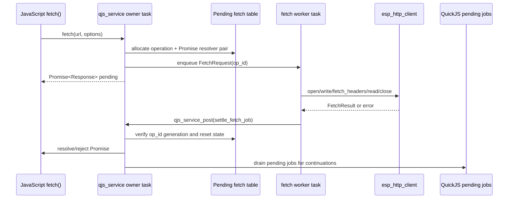

# AtomS3R QuickJS Worker-Backed Fetch: Analysis, Design, and Implementation Guide

## Executive summary

The current AtomS3R QuickJS firmware has a hardware-validated `fetch()` API. It supports bounded `http://` `GET` and `POST`, builds a JavaScript Response object, and runs Promise callbacks after console eval. The current firmware adapter is intentionally simple: `op_fetch()` performs the entire `esp_http_client` request synchronously on the QuickJS owner task. This is correct for the first milestone because requests are small, bounded, and easy to reason about.

This ticket designs the next fetch architecture: move the network I/O to a worker task while keeping all QuickJS object creation and Promise settlement on the owner task. The goal is not to change the JavaScript API. Scripts should still call:

```js
const resp = await fetch('http://192.168.4.22/healthz');
const text = await resp.text();
```

The goal is to change how firmware executes that request internally. Instead of blocking the owner task inside `esp_http_client_read()`, the owner task creates a pending fetch operation and returns a Promise. A worker task consumes the native `FetchRequest`, performs the `esp_http_client` lifecycle, stores a native `FetchResult`, and posts a completion job back to the owner task. The owner task then builds or rejects the JavaScript Response Promise.

The design is intentionally more complex than the current adapter. It introduces pending-operation state, cancellation/reset semantics, queue backpressure, worker stack sizing, and Promise settlement from a later owner-task job. It should be implemented only after the synchronous fetch milestone remains stable and after there is a real need: long requests, concurrent clients, or async dynamic route handlers that use `fetch()`.

## Problem statement and scope

### Current behavior

The current firmware `op_fetch()` is in `0103-atoms3r-m12-native-quickjs/main/http_namespace.cpp`. It is called from the shared `fetch()` binding through the `HostOps.fetch` callback (`http_namespace_core.h:41-49`). It validates `http://`, configures `esp_http_client`, opens the connection, writes the request body when present, fetches headers, reads the body in 512-byte chunks, enforces the response cap, closes the client, and returns a `FetchResult` (`http_namespace.cpp:64-168`).

This path blocks the QuickJS owner task for the full HTTP request. During validation this was acceptable: self-fetch to `/healthz` took about 261 ms and returned:

```text
fetch status=200 ok=true
fetch body=ok
```

The current Promise behavior works because `qjs_service_eval()` drains pending jobs after `JS_Eval()` (`qjs_service.cpp:341-356`). That makes `.then(...)` callbacks visible in the console. The network I/O itself still blocks owner-task progress while the request runs.

### Desired behavior

Worker-backed fetch should preserve the JavaScript contract while reducing owner-task blocking:

```js
fetch(url, options) -> Promise<Response>
Response.text() -> Promise<string>
Response.json() -> Promise<any>
```

The network request should execute on a worker task. The owner task should remain able to process other QuickJS work while the HTTP client waits for network data, subject to a small amount of scheduling overhead for operation creation and settlement.

### In scope

- A firmware-only worker fetch adapter for the existing shared `fetch()` API.
- A native pending-fetch table or queue with bounded capacity.
- Worker task lifecycle, queue, timeout handling, and result ownership.
- Owner-task Promise settlement jobs.
- Reset cancellation and cleanup of pending fetches.
- Backpressure errors when too many fetches are pending.
- Host tests that preserve existing JavaScript API behavior.
- Hardware tests for console fetch and route-triggered fetch when async route handlers exist.

### Out of scope

- HTTPS/TLS.
- Streaming response bodies into JavaScript.
- AbortController and user cancellation API.
- Browser-compatible redirects/cookies/cache/CORS.
- Multiple worker pools unless single-worker results prove insufficient.
- Async dynamic route handlers themselves. This design is compatible with them, but their Promise-aware dispatch belongs to the async-routes ticket.

## Current-state evidence

### The current FetchRequest and FetchResult are plain-native DTOs

`http_namespace_core.h` defines `FetchRequest` with URL, method, headers, body, timeout, and max response bytes (`http_namespace_core.h:24-31`). It defines `FetchResult` with status, status text, final URL, headers, and body (`http_namespace_core.h:33-39`). This is useful for worker fetch because these structs contain no `JSValue`. They can be copied or moved between tasks without touching QuickJS.

### HostOps.fetch is currently synchronous

`HostOps.fetch` is a function pointer that takes `FetchRequest*`, fills `FetchResult*`, and returns an integer error code (`http_namespace_core.h:41-49`). This is a synchronous callback contract. The current shared core expects the result immediately. Moving to worker-backed fetch requires either:

1. changing the core to support asynchronous platform fetch callbacks, or
2. adding a firmware-only implementation that creates and returns a Promise without going through the existing synchronous `HostOps.fetch` path.

The first option preserves shared host/firmware behavior better, but it requires a larger core API change. The second option is easier to prototype but risks drift.

### The current firmware fetch blocks in esp_http_client calls

`op_fetch()` configures `esp_http_client_config_t`, calls `esp_http_client_init`, sets method/headers, calls `esp_http_client_open`, optionally writes the body, calls `esp_http_client_fetch_headers`, then repeatedly calls `esp_http_client_read` until done (`http_namespace.cpp:75-168`). All of this happens on the caller task. Since `op_fetch()` is invoked from a QuickJS callback, that caller is the owner task.

### Promise draining exists only where explicitly called

`qjs_service.cpp` now has `drain_pending_jobs()` (`qjs_service.cpp:222-251`) and calls it in the eval path (`qjs_service.cpp:341-356`). A worker completion job will need its own settlement-and-drain behavior. Settling a Promise from the owner task is not enough if no pending jobs are executed afterward.

## Gap analysis

| Gap | Current state | Needed state |
|---|---|---|
| Fetch execution location | Owner task runs network I/O. | Worker task runs network I/O. |
| Promise settlement | Fetch Promise resolves before eval drain returns. | Promise settles later from a posted owner-task job. |
| Pending operation state | No pending state; call stack owns everything. | Bounded table owns request, result, error, Promise resolvers, and lifecycle flags. |
| Reset behavior | Synchronous call completes before reset can run. | Reset must cancel or invalidate pending operations. |
| Backpressure | No queue because call is synchronous. | Reject new fetches when queue/table is full. |
| Timeout | `esp_http_client` timeout plus owner job timeout. | Worker enforces HTTP timeout; owner settlement respects operation generation. |
| Host parity | Host fetch synchronous but Promise-shaped. | Host should still test API shape; firmware worker path needs separate tests. |

## Proposed architecture

The design introduces a firmware worker component, tentatively `http_fetch_worker.{h,cpp}`, and a new asynchronous fetch path in the shared core or firmware adapter. The worker accepts native requests and produces native results. It never touches QuickJS.



The key invariant is unchanged: the worker task must not create, duplicate, free, resolve, or reject any `JSValue`. It owns only native memory. The owner task creates the Promise and resolver functions, stores them in the pending table, and later resolves or rejects them.

## Proposed API changes

### Shared core option A: add async HostOps

Add an asynchronous host operation to `HostOps`:

```cpp
struct FetchAsyncCallbacks {
    void (*resolve)(void *user, const FetchResult *result);
    void (*reject)(void *user, const char *message);
    void *user;
};

struct HostOps {
    ...
    int (*fetch)(void *user, const FetchRequest *req, FetchResult *out, std::string *error);
    int (*fetch_async)(void *user, const FetchRequest *req, const FetchAsyncCallbacks *callbacks, std::string *error);
};
```

The core chooses `fetch_async` when available. If `fetch_async` is null, it uses the existing synchronous `fetch` path. This keeps the desktop host simple while allowing firmware to adopt worker fetch.

The core would create a Promise capability, hand callbacks to the adapter, and return the Promise immediately. The callbacks cannot be called from the worker directly if they touch QuickJS; in firmware they should enqueue a settlement job. In the host they may run immediately or from a host event loop.

### Shared core option B: firmware-only override

Keep `HostOps.fetch` synchronous and override the global `fetch` function in `http_namespace.cpp` after installing the core. This is simpler to wire but worse architecturally because firmware and host no longer share the same `fetch()` binding logic. It should be avoided unless option A proves too invasive.

### Pending operation data model

A pending fetch entry needs enough state to reject safely on reset and to settle exactly once:

```cpp
struct PendingFetch {
    uint32_t id;
    uint32_t generation;
    bool in_use;
    bool worker_done;
    bool settled;

    JSContext *ctx;          // owner-task only; do not use from worker
    JSValue resolve;         // owner-task only
    JSValue reject;          // owner-task only

    FetchRequest request;    // copied before enqueue
    FetchResult result;      // written by worker, consumed by owner
    std::string error;       // written by worker, consumed by owner
    esp_err_t status;
};
```

A reset increments a generation counter and rejects or frees every pending resolver on the owner task before destroying the runtime. If a worker completes after reset, its completion job sees a stale generation and only frees native memory.

## Pseudocode

### JavaScript fetch binding with async HostOps

```cpp
JSValue js_fetch(JSContext *ctx, JSValueConst this_val, int argc, JSValueConst *argv) {
    FetchRequest req;
    std::string error;
    if (!parse_fetch_request(ctx, argc, argv, &req, &error)) {
        return promise_reject_string(ctx, error);
    }

    Runtime *rt = active_runtime();
    if (rt->ops().fetch_async) {
        PromiseCapability cap = make_promise_capability(ctx);
        int err = rt->ops().fetch_async(rt->ops().user, &req, make_callbacks(cap), &error);
        if (err != 0) {
            reject_capability(ctx, cap, error);
        }
        return cap.promise;     // pending
    }

    FetchResult res;
    int err = rt->ops().fetch(rt->ops().user, &req, &res, &error);
    if (err != 0) return promise_reject_string(ctx, error);
    JSValue response = make_fetch_response(ctx, req, res);
    return promise_resolve(ctx, response);
}
```

### Firmware worker enqueue

```cpp
int firmware_fetch_async(void *user,
                         const FetchRequest *req,
                         const FetchAsyncCallbacks *callbacks,
                         std::string *error) {
    PendingFetch *op = pending_alloc();
    if (!op) {
        *error = "too many pending fetches";
        return ESP_ERR_NO_MEM;
    }

    op->request = *req;
    op->resolve = JS_DupValue(ctx, callbacks->resolve);
    op->reject = JS_DupValue(ctx, callbacks->reject);
    op->generation = current_generation;

    if (!xQueueSend(fetch_worker_queue, &op->id, 0)) {
        pending_free_on_owner(op);
        *error = "fetch worker queue full";
        return ESP_ERR_TIMEOUT;
    }
    return 0;
}
```

### Worker task

```cpp
void fetch_worker_task(void *) {
    for (;;) {
        uint32_t id;
        xQueueReceive(fetch_queue, &id, portMAX_DELAY);

        PendingFetch *op = pending_lookup_native(id);
        if (!op) continue;

        op->status = perform_esp_http_client_request(op->request,
                                                     &op->result,
                                                     &op->error);

        qjs_job_t job = {};
        job.fn = settle_fetch_job;
        job.user = make_settle_job_arg(id, op->generation);
        job.timeout_ms = 1000;
        qjs_service_post(g_svc, &job);
    }
}
```

### Owner-task settlement job

```cpp
esp_err_t settle_fetch_job(JSContext *ctx, void *user) {
    SettleArg *arg = static_cast<SettleArg *>(user);
    PendingFetch *op = pending_lookup(arg->id);
    if (!op || op->generation != arg->generation) {
        return ESP_OK; // stale completion after reset
    }

    if (op->status == ESP_OK) {
        JSValue response = make_fetch_response(ctx, op->request, op->result);
        JS_Call(ctx, op->resolve, JS_UNDEFINED, 1, &response);
        JS_FreeValue(ctx, response);
    } else {
        JSValue err = JS_NewString(ctx, op->error.c_str());
        JS_Call(ctx, op->reject, JS_UNDEFINED, 1, &err);
        JS_FreeValue(ctx, err);
    }

    JS_FreeValue(ctx, op->resolve);
    JS_FreeValue(ctx, op->reject);
    pending_free(op);
    drain_pending_jobs_for_owner_job(ctx); // run .then/.catch continuations
    return ESP_OK;
}
```

The last line is important. Settling the Promise schedules its `.then` or `.catch` callbacks. If no pending job drain runs after settlement, the JavaScript callback remains queued. This is the same failure mode fixed for console eval, now moved to worker completion.

## Decision records

### Decision: Keep the JavaScript fetch API unchanged

- **Context:** Existing scripts and examples already use `fetch(url, options).then(...)` and `await fetch(...)` should remain the long-term shape.
- **Options considered:** Add `fetchAsync`, add callback-style `fetch(url, cb)`, or keep `fetch()` Promise-shaped.
- **Decision:** Keep `fetch()` Promise-shaped and unchanged.
- **Rationale:** The JavaScript contract is already correct. The problem is implementation location, not API naming.
- **Consequences:** Native code must support delayed Promise settlement safely.
- **Status:** proposed

### Decision: Worker never touches QuickJS

- **Context:** QuickJS runtime access must stay serialized by `qjs_service`.
- **Options considered:** Let worker resolve Promises directly; let worker build native result and post owner-task settlement; make worker itself the owner task.
- **Decision:** Worker performs only ESP-IDF HTTP client I/O and writes native results. Owner task performs all JS settlement.
- **Rationale:** This preserves the existing ownership rule and avoids cross-task `JSValue` access.
- **Consequences:** Requires a pending table and a completion job, but avoids runtime races.
- **Status:** proposed

### Decision: Add async HostOps rather than firmware-only fetch override

- **Context:** The shared core currently defines JavaScript fetch semantics. Firmware-only override would drift from host tests.
- **Options considered:** Extend `HostOps`; override `fetch` in firmware; make all fetch synchronous forever.
- **Decision:** Extend the shared core with an optional asynchronous HostOps path.
- **Rationale:** The host can continue using synchronous fetch while firmware uses asynchronous settlement, but the JavaScript binding remains shared.
- **Consequences:** The core becomes more complex because it must create Promise capabilities and manage callbacks.
- **Status:** proposed

### Decision: Bounded single worker before worker pool

- **Context:** The first goal is owner-task responsiveness, not maximum throughput.
- **Options considered:** One worker task; fixed pool; one task per fetch.
- **Decision:** Use one worker task and a bounded queue/table first.
- **Rationale:** One worker is simpler to test, avoids unbounded stack use, and already prevents owner-task blocking.
- **Consequences:** Concurrent fetches still serialize through the worker, but they no longer block QuickJS while waiting on network I/O.
- **Status:** proposed

## Implementation phases

### Phase 1: Refactor fetch core for optional async HostOps

- Add Promise capability helper in `http_namespace_core.cpp`.
- Add optional `fetch_async` to `HostOps`.
- Keep synchronous host behavior as fallback.
- Add host smoke tests proving existing synchronous path still works.

Validation:

```bash
0103-atoms3r-m12-native-quickjs/host/native-http/tests/run-smoke.sh
```

### Phase 2: Add firmware pending-fetch table

- Add `http_fetch_worker.{h,cpp}` or a private section in `http_namespace.cpp` if small.
- Define `PendingFetch` with id, generation, JS resolver values, native request/result, and status.
- Add bounded capacity, e.g. `kMaxPendingFetches = 4`.
- Add allocation/free helpers that run on owner task.

### Phase 3: Add worker task

- Create a FreeRTOS task during HTTP namespace installation or first fetch use.
- Create a queue of pending fetch IDs.
- Worker reads request IDs, copies or locks native request data, performs `esp_http_client`, and posts settlement jobs.
- Worker never touches `JSContext`, `JSRuntime`, `JSValue`, or Promise resolvers.

### Phase 4: Add owner-task settlement

- Completion job validates generation and pending entry.
- Completion job resolves/rejects the stored Promise resolver.
- Completion job frees JS resolver values.
- Completion job drains pending Promise jobs so user callbacks run.

### Phase 5: Reset and cancellation

- On `clear_http_namespace_state()`, reject or invalidate every pending fetch before deleting the runtime.
- Increment generation so late worker completions are ignored.
- Stop or drain the worker queue if the namespace is being destroyed.
- Confirm `js reset` remains usable during or after pending fetches.

### Phase 6: Hardware validation

- Validate simple `fetch('/healthz')` still prints status/body.
- Validate a slow endpoint does not block immediate `js status` longer than expected.
- Validate queue-full rejection.
- Validate reset while a fetch is pending.
- Validate memory before/after repeated fetches.

## Test strategy

### Host tests

- Existing host smoke still passes.
- New async HostOps path can be unit-tested with a fake adapter that completes immediately and a fake adapter that completes after a host event-loop tick.
- Rejection path returns a rejected Promise.
- Too-many-pending path rejects immediately.

### Firmware tests without external internet

Use the device's own native endpoint first:

```text
http start 80
js eval "fetch('http://192.168.4.22/healthz').then(r => { print('status='+r.status); return r.text(); }).then(t => print('body='+t))"
```

Then add a local LAN endpoint that delays response to validate owner-task responsiveness during the delay.

### Reset tests

1. Start a fetch against a delayed endpoint.
2. Run `js reset` before the endpoint responds.
3. Confirm no crash.
4. Confirm `typeof http` is `object` after reset.
5. Confirm late worker completion is ignored or logged as stale.

### Resource tests

- Repeated fetch loop of 100 small requests.
- Pending queue saturation.
- Max response cap enforcement.
- Worker stack watermark logging if available.
- Heap before/after repeated fetches.

## Risks and mitigations

| Risk | Impact | Mitigation |
|---|---|---|
| Worker touches QuickJS by accident | Runtime race or crash. | Keep worker API native-only; code review rule: no `JS_*` calls in worker file. |
| Promise resolver outlives runtime | Use-after-free after reset. | Reset rejects/frees pending entries on owner task and increments generation. |
| Late worker completion after reset | Stale result references freed operation. | Completion includes id + generation; stale completions are ignored. |
| Queue/table exhaustion | Fetch calls fail unpredictably. | Bounded capacity with explicit rejected Promise: `too many pending fetches`. |
| Missing job drain after settlement | `.then()` callbacks never run. | Settlement job drains pending jobs or asks qjs_service to drain after job. |
| Body copy cost | Large responses use RAM twice. | Keep 16 KiB cap; defer streaming API to future ticket. |

## Intern implementation notes

Start by preserving behavior. A worker-backed implementation is not successful if it changes script-visible behavior. Before changing firmware, run and save the current host smoke output. Then add host tests for the new shared-core async path. Only after host behavior is stable should firmware worker code be added.

Do not begin with a worker pool. The first worker-backed fetch implementation should be single-worker and capacity-bounded. The purpose is to prove the lifecycle and owner-task settlement protocol, not to maximize throughput.

Do not store raw `JSValue` in data the worker can access. If the pending table contains resolver values, all functions that read or free those fields must be owner-task-only. The worker can store the operation id and write native fields only.

Do not add HTTPS in the same ticket. TLS has separate binary-size, heap, certificate, and policy questions. The current `fetch()` intentionally supports `http://` only (`http_namespace_core.cpp:337-350`).

## References

- `0103-atoms3r-m12-native-quickjs/main/http_namespace_core.h:24-39` — `FetchRequest` and `FetchResult` are native DTOs.
- `0103-atoms3r-m12-native-quickjs/main/http_namespace_core.h:41-49` — current synchronous `HostOps.fetch` callback.
- `0103-atoms3r-m12-native-quickjs/main/http_namespace_core.cpp:337-399` — current fetch request parser and caps.
- `0103-atoms3r-m12-native-quickjs/main/http_namespace.cpp:64-168` — current blocking firmware fetch implementation.
- `components/qjs_service/qjs_service.cpp:222-251` — existing bounded Promise job drain helper.
- `components/qjs_service/qjs_service.cpp:341-356` — eval path drains Promise jobs after `JS_Eval()`.
- `0103-atoms3r-m12-native-quickjs/examples/scripts/fetch-healthz.js:1-14` — current fetch smoke example.
