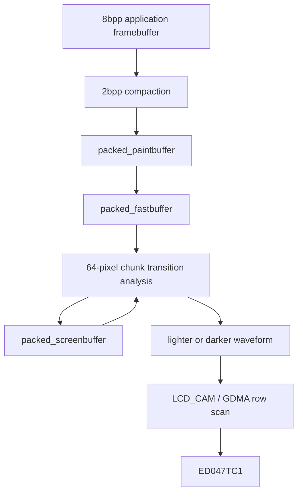

# EPD Painter independent-driver audit and experiment design

## Current status

The factory experiment did not independently test a new waveform because factory M5GFX 0.2.15 and current M5GFX 0.2.25 use identical built-in EPD LUTs. The next causal branch therefore requires a different driver and waveform representation on the same physical PaperS3.

EPD_Painter commit `753c521da8aef59756df07c1a4eb88f1c64c8227` is the candidate control. It explicitly names M5PaperS3, uses direct LCD_CAM/GDMA scanning, defines PaperS3-specific fast/normal/high lighter and darker waveforms, and supplies hard-clear and DC-balance operations. Those properties make it independent enough to discriminate the M5GFX waveform family. They do not make it safe to flash without review.

The pre-hardware gate is currently:

> **BLOCKED — do not build or flash the upstream source unchanged.**

The reproducible audit found five blockers and two review items. The pin map is correct and the hard-clear phase counts are polarity-balanced at the action-count level, but initialization and completion semantics are not sufficient for controlled hardware evidence.

## Reproducibility policy

All experiment source, commands, and outputs live in the ticket or a numbered firmware directory. No firmware project or driver checkout remains under `/tmp`.

The ticket now contains:

- complete build-relevant EPD_Painter source at the pinned commit;
- a manifest with retrieval timestamp and hashes;
- exact M5GFX 0.2.25 board source for pin comparison;
- `scripts/09-replay-factory-v0.5-flash.sh` for safe factory replay;
- `scripts/10-audit-epd-painter.py` for deterministic source review;
- generated audit output under `scripts/output/`.

Future independent-control build, flash, transcript capture, and analysis commands will also be invoked through numbered ticket scripts. The firmware itself will live in the next numbered repository project directory, not in `scripts/` and not in a temporary directory.

## Source and pin lineage

The complete driver source is pinned to:

```text
repository: https://github.com/tonywestonuk/EPD_Painter
commit:     753c521da8aef59756df07c1a4eb88f1c64c8227
version:    1.0.7
```

The PaperS3 preset matches the M5GFX 0.2.25 control exactly:

| Signal | EPD_Painter | M5GFX |
|---|---:|---:|
| PWR | 46 | 46 |
| SPV | 17 | 17 |
| CKV | 18 | 18 |
| SPH | 13 | 13 |
| OE | 45 | 45 |
| LE | 15 | 15 |
| CL | 16 | 16 |
| D0..D7 | 6, 14, 7, 12, 9, 11, 8, 10 | 6, 14, 7, 12, 9, 11, 8, 10 |

This proves that the candidate addresses the same physical scan and power signals. It does not prove timing, polarity, or power-off equivalence.

## Driver architecture

EPD_Painter owns three packed 2-bit-per-pixel buffers:

```text
packed_paintbuffer   desired frame prepared by application
packed_fastbuffer    working copy consumed by the paint task
packed_screenbuffer  driver's estimate of physical panel state
```

An 8-bit application framebuffer is compacted into the paint buffer. A background task compares desired and assumed physical state in 64-pixel chunks. Each chunk is assigned either a darker or lighter waveform. The task emits 7 passes in FAST quality or 13 passes in NORMAL/HIGH quality. The Adafruit binding enables three-stage convergence, so one application `paint()` can cause multiple waveform groups.



The architecture is materially different from M5GFX and is therefore useful as a control. Its state estimate is still not an optical sensor. Correct initialization and deterministic completion are mandatory.

## Audit findings

### Finding 1: GPIO pad-selection calls use the wrong argument

`EPD_Painter.cpp` defines:

```cpp
static inline void epd_gpio_func_sel(int pin) {
  esp_rom_gpio_pad_select_gpio((gpio_num_t)pin);
}
```

but calls it as:

```cpp
epd_gpio_func_sel(GPIO_PIN_MUX_REG[pin]);
epd_gpio_func_sel(GPIO_PIN_MUX_REG[_config.pin_cl]);
```

`esp_rom_gpio_pad_select_gpio()` expects a GPIO number. `GPIO_PIN_MUX_REG[pin]` is the IOMUX register value associated with that GPIO. Passing that register value as a GPIO number is not the documented API contract.

**Gate:** patch the calls to pass `pin` and `_config.pin_cl`. Compile before any hardware use.

### Finding 2: packed state buffers are uninitialized

The driver allocates `packed_fastbuffer`, `packed_screenbuffer`, `packed_paintbuffer`, and `bitmask`, then starts its background task without zeroing those regions. Differential painting can therefore compare a known target against indeterminate PSRAM on the first operation.

The hard-clear path eventually establishes white, but the software update issued before the direct hard-clear phases still depends on `packed_screenbuffer`. An experimental control must not begin from indeterminate state.

**Gate:** zero all packed buffers and the bitmask before task creation. The first permitted panel operation remains HARD clear to white.

### Finding 3: not every required allocation is checked

The existing check includes the DMA buffer, fast buffer, and screen buffer. It omits the paint buffer and bitmask. A failed allocation can become a null dereference in the background task.

**Gate:** validate every allocation and fail with a serial diagnostic before semaphores, tasks, or panel power are enabled.

### Finding 4: `paint()` does not wait for physical completion

`paint()` sets `paintStage` to two or three and waits only until the background task decrements that initial value. It returns after the buffer has been accepted, before the waveform scans complete.

This behavior is appropriate for asynchronous UI rendering, but invalid for an experiment that must record duration, check heap integrity, sequence cleanup, and ask an operator to judge a settled endpoint.

**Gate:** add `waitIdle(timeout_ms)` with explicit timeout and require it after every experimental operation.

### Finding 5: the Adafruit wrapper dereferences allocation without checking it

The wrapper allocates a 960×540 8-bit framebuffer in PSRAM and immediately calls `memset`. Allocation failure crashes before diagnostics. Its private ownership member is also not assigned to the allocation used by the base class, so destruction leaks the framebuffer. The leak does not matter during a single boot, but the missing null check does.

**Gate:** do not use the wrapper unchanged. Create a narrow local binding or patch allocation ownership and failure handling.

### Finding 6: power-off differs from M5GFX

Both drivers raise OE, wait 100 µs, and then raise PWR during power-on. Their power-off paths differ:

```text
M5GFX:      delay -> PWR low -> 10 µs -> OE low -> 100 µs -> SPV low
EPD_Painter:         OE low  -> 100 µs -> PWR low
```

EPD_Painter's generic `powerOff()` does not explicitly lower SPV, LE, or SPH. Lowering OE before removing the rails may be electrically reasonable, but it remains an uncontrolled difference from the tested path.

**Gate:** implement and document an explicit safe-state sequence. The review must decide the shutdown order before hardware execution rather than silently inheriting either implementation.

### Finding 7: stage count is implicit

The Adafruit binding calls `setInterlaceMode(true)`, which selects three stages. The background task alternates chunk handling and can need multiple stages to converge when one 64-pixel chunk contains both darkening and lightening transitions.

This behavior means “one paint” is not one 13-pass waveform. The stage count and actual duration must appear in every evidence record.

**Gate:** expose stage count as an explicit experiment configuration. Use one documented value for the first A/B and do not compare nominal API call counts.

## Waveform structure

EPD_Painter documents four actions:

```text
0 = float
1 = whiten polarity
2 = darken polarity
3 = both
```

The PaperS3 preset contains six tables: fast/normal/high × lighter/darker. FAST has seven actions per row; NORMAL and HIGH have thirteen. The generated audit records action counts for each row.

The table names and action counts are not sufficient to establish physical dose. The source-to-panel bit mapping, per-pass scan duration, inter-pass delays, chunk direction, and actual rail amplitude all contribute. In particular, equal numbers of codes do not prove equal volt-seconds or equal particle motion.

HIGH quality adds an 8 ms delay between waveform passes, NORMAL adds 4 ms, and FAST adds no explicit inter-pass delay. HIGH also uses different action tables. This is a real waveform/timing change, not only a name.

## Hard-clear review

HARD clear directly emits four alternating full-panel phases with counts:

```text
phase 0: action pattern A × 6
phase 1: action pattern B × 2
phase 2: action pattern A × 4
phase 3: action pattern B × 8
```

Aggregate counts are ten A and ten B actions. A final neutral scan follows. This makes HARD clear the best available controlled cleanup primitive, subject to verifying which final phase produces white and observing the panel on the first bounded run.

HARD clear is not free. It applies twenty full-panel actions and should be used only at experiment boundaries, not repeatedly as a debugging loop.

## Automatic shutdown

The library's boot controller can use reset as a shutdown toggle, store an NVS flag, paint a shutdown image, and unpaint it on the next boot. USB detection bypasses some of that behavior. Those semantics add state that is unnecessary for the optical control.

The driver exposes `setAutoShutdown(false)`. The independent firmware must call it before `begin()`. The first version will not expose system power-off. It will control only EPD rail idle behavior and leave board shutdown to a later qualified task.

## Pre-hardware decision

Do not flash upstream EPD_Painter 1.0.7 unchanged.

The approved next implementation is a local, pinned, narrow hardening patch with these constraints:

1. preserve the exact PaperS3 pin map and waveform arrays;
2. correct GPIO pad selection;
3. initialize and validate all memory;
4. add bounded `waitIdle()`;
5. make stage count explicit;
6. disable automatic shutdown;
7. establish a reviewed control-pin safe state;
8. expose boot diagnostics before any panel operation;
9. permit only HARD white cleanup as the first command;
10. keep build and flash orchestration under ticket `scripts/`.

This patch changes driver correctness and observability, not waveform content. That distinction preserves the experiment: if the independent waveform produces a different endpoint, the result can be attributed to its scan/waveform implementation rather than a locally invented LUT.

## Next document increment

The next task extends this document with the complete experiment matrix, command state machine, safety gates, evidence schema, and interpretation table. Firmware scaffolding begins only after that design is committed.
