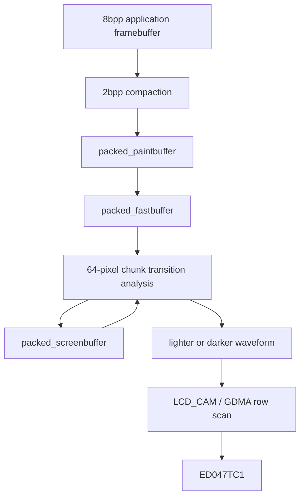
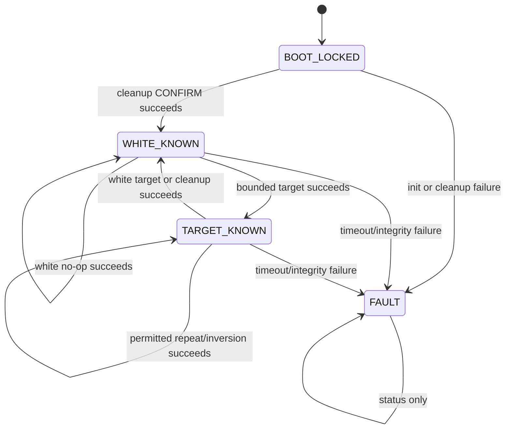

# EPD Painter independent-driver audit and experiment design

## Current status

The factory experiment did not independently test a new waveform because factory M5GFX 0.2.15 and current M5GFX 0.2.25 use identical built-in EPD LUTs. The next causal branch therefore requires a different driver and waveform representation on the same physical PaperS3.

EPD_Painter commit `753c521da8aef59756df07c1a4eb88f1c64c8227` is the candidate control. It explicitly names M5PaperS3, uses direct LCD_CAM/GDMA scanning, defines PaperS3-specific fast/normal/high lighter and darker waveforms, and supplies hard-clear and DC-balance operations. Those properties make it independent enough to discriminate the M5GFX waveform family. They do not make it safe to flash without review.

The pre-hardware gate is currently:

> **BLOCKED — do not build or flash the upstream source unchanged.**

The expanded reproducible audit found eight blockers and two review items in the full upstream surface. The raw-driver control excludes the Adafruit binding, but the remaining initialization, build, resource, and completion blockers still require a narrow patch. The pin map is correct and the hard-clear phase counts are polarity-balanced at the action-count level; neither fact is sufficient for controlled hardware evidence.

## Reproducibility policy

All experiment source, commands, and outputs live in the ticket or a numbered firmware directory. No firmware project or driver checkout remains under `/tmp`.

The ticket now contains:

- complete build-relevant EPD_Painter source at the pinned commit;
- a manifest with retrieval timestamp and hashes;
- exact M5GFX 0.2.25 board source for pin comparison;
- `scripts/09-replay-factory-v0.5-flash.sh` for safe factory replay;
- `scripts/10-audit-epd-painter.py` for deterministic source review;
- generated audit output under `scripts/output/`.

Future independent-control build, flash, transcript capture, and analysis commands will also be invoked through numbered ticket scripts. The firmware itself will live in the next numbered repository project directory, not in `scripts/` and not in a temporary directory.

## Source and pin lineage

The complete driver source is pinned to:

```text
repository: https://github.com/tonywestonuk/EPD_Painter
commit:     753c521da8aef59756df07c1a4eb88f1c64c8227
version:    1.0.7
```

The PaperS3 preset matches the M5GFX 0.2.25 control exactly:

| Signal | EPD_Painter | M5GFX |
|---|---:|---:|
| PWR | 46 | 46 |
| SPV | 17 | 17 |
| CKV | 18 | 18 |
| SPH | 13 | 13 |
| OE | 45 | 45 |
| LE | 15 | 15 |
| CL | 16 | 16 |
| D0..D7 | 6, 14, 7, 12, 9, 11, 8, 10 | 6, 14, 7, 12, 9, 11, 8, 10 |

This proves that the candidate addresses the same physical scan and power signals. It does not prove timing, polarity, or power-off equivalence.

## Driver architecture

EPD_Painter owns three packed 2-bit-per-pixel buffers:

```text
packed_paintbuffer   desired frame prepared by application
packed_fastbuffer    working copy consumed by the paint task
packed_screenbuffer  driver's estimate of physical panel state
```

An 8-bit application framebuffer is compacted into the paint buffer. A background task compares desired and assumed physical state in 64-pixel chunks. Each chunk is assigned either a darker or lighter waveform. The task emits 7 passes in FAST quality or 13 passes in NORMAL/HIGH quality. The Adafruit binding enables three-stage convergence, so one application `paint()` can cause multiple waveform groups.



The architecture is materially different from M5GFX and is therefore useful as a control. Its state estimate is still not an optical sensor. Correct initialization and deterministic completion are mandatory.

## Audit findings

### Finding 1: GPIO pad-selection calls use the wrong argument

`EPD_Painter.cpp` defines:

```cpp
static inline void epd_gpio_func_sel(int pin) {
  esp_rom_gpio_pad_select_gpio((gpio_num_t)pin);
}
```

but calls it as:

```cpp
epd_gpio_func_sel(GPIO_PIN_MUX_REG[pin]);
epd_gpio_func_sel(GPIO_PIN_MUX_REG[_config.pin_cl]);
```

`esp_rom_gpio_pad_select_gpio()` expects a GPIO number. `GPIO_PIN_MUX_REG[pin]` is the IOMUX register value associated with that GPIO. Passing that register value as a GPIO number is not the documented API contract.

**Gate:** patch the calls to pass `pin` and `_config.pin_cl`. Compile before any hardware use.

### Finding 2: packed state buffers are uninitialized

The driver allocates `packed_fastbuffer`, `packed_screenbuffer`, `packed_paintbuffer`, and `bitmask`, then starts its background task without zeroing those regions. Differential painting can therefore compare a known target against indeterminate PSRAM on the first operation.

The hard-clear path eventually establishes white, but the software update issued before the direct hard-clear phases still depends on `packed_screenbuffer`. An experimental control must not begin from indeterminate state.

**Gate:** zero all packed buffers and the bitmask before task creation. The first permitted panel operation remains HARD clear to white.

### Finding 3: not every required allocation is checked

The existing check includes the DMA buffer, fast buffer, and screen buffer. It omits the paint buffer and bitmask. A failed allocation can become a null dereference in the background task.

**Gate:** validate every allocation and fail with a serial diagnostic before semaphores, tasks, or panel power are enabled.

The DMA row buffers have an additional ordering defect: `begin()` calls `memset()` on both pointers and constructs descriptors before the delayed allocation guard. Their checks must move immediately after allocation.

### Finding 4: pure ESP-IDF compilation is not complete

The source advertises a non-Arduino path through `build_opt.h`, but the PSRAM fallback calls Arduino's `log_w` macro without an unconditional compatible logging include.

**Gate:** replace it with `ESP_LOGW` or `printf`, define `EPD_PAINTER_PRESET_M5PAPER_S3` explicitly, and compile as a pure ESP-IDF component with no Arduino dependency.

### Finding 5: FreeRTOS resource creation is unchecked

The driver does not validate either binary semaphore handle or the return from `xTaskCreatePinnedToCore`. A failed task creation would leave a partially initialized object that appears available to the console.

**Gate:** check all handles and task return values. No command is registered unless driver initialization completes atomically.

### Finding 6: `paint()` does not wait for physical completion

`paint()` sets `paintStage` to two or three and waits only until the background task decrements that initial value. It returns after the buffer has been accepted, before the waveform scans complete.

This behavior is appropriate for asynchronous UI rendering, but invalid for an experiment that must record duration, check heap integrity, sequence cleanup, and ask an operator to judge a settled endpoint.

**Gate:** add `waitIdle(timeout_ms)` with explicit timeout and require it after every experimental operation.

### Finding 7: the Adafruit wrapper dereferences allocation without checking it

The wrapper allocates a 960×540 8-bit framebuffer in PSRAM and immediately calls `memset`. Allocation failure crashes before diagnostics. Its private ownership member is also not assigned to the allocation used by the base class, so destruction leaks the framebuffer. The leak does not matter during a single boot, but the missing null check does.

**Gate:** do not use the wrapper unchanged. Create a narrow local binding or patch allocation ownership and failure handling.

### Finding 8: power-off differs from M5GFX

Both drivers raise OE, wait 100 µs, and then raise PWR during power-on. Their power-off paths differ:

```text
M5GFX:      delay -> PWR low -> 10 µs -> OE low -> 100 µs -> SPV low
EPD_Painter:         OE low  -> 100 µs -> PWR low
```

EPD_Painter's generic `powerOff()` does not explicitly lower SPV, LE, or SPH. Lowering OE before removing the rails may be electrically reasonable, but it remains an uncontrolled difference from the tested path.

**Gate:** implement and document an explicit safe-state sequence. The review must decide the shutdown order before hardware execution rather than silently inheriting either implementation.

### Finding 9: stage count is implicit

The Adafruit binding calls `setInterlaceMode(true)`, which selects three stages. The background task alternates chunk handling and can need multiple stages to converge when one 64-pixel chunk contains both darkening and lightening transitions.

This behavior means “one paint” is not one 13-pass waveform. The stage count and actual duration must appear in every evidence record.

**Gate:** expose stage count as an explicit experiment configuration. Use one documented value for the first A/B and do not compare nominal API call counts.

## Waveform structure

EPD_Painter documents four actions:

```text
0 = float
1 = whiten polarity
2 = darken polarity
3 = both
```

The PaperS3 preset contains six tables: fast/normal/high × lighter/darker. FAST has seven actions per row; NORMAL and HIGH have thirteen. The generated audit records action counts for each row.

The table names and action counts are not sufficient to establish physical dose. The source-to-panel bit mapping, per-pass scan duration, inter-pass delays, chunk direction, and actual rail amplitude all contribute. In particular, equal numbers of codes do not prove equal volt-seconds or equal particle motion.

HIGH quality adds an 8 ms delay between waveform passes, NORMAL adds 4 ms, and FAST adds no explicit inter-pass delay. HIGH also uses different action tables. This is a real waveform/timing change, not only a name.

## Hard-clear review

HARD clear directly emits four alternating full-panel phases with counts:

```text
phase 0: action pattern A × 6
phase 1: action pattern B × 2
phase 2: action pattern A × 4
phase 3: action pattern B × 8
```

Aggregate counts are ten A and ten B actions. A final neutral scan follows. This makes HARD clear the best available controlled cleanup primitive, subject to verifying which final phase produces white and observing the panel on the first bounded run.

HARD clear is not free. It applies twenty full-panel actions and should be used only at experiment boundaries, not repeatedly as a debugging loop.

## Automatic shutdown

The library's boot controller can use reset as a shutdown toggle, store an NVS flag, paint a shutdown image, and unpaint it on the next boot. USB detection bypasses some of that behavior. Those semantics add state that is unnecessary for the optical control.

The driver exposes `setAutoShutdown(false)`. The independent firmware must call it before `begin()`. The first version will not expose system power-off. It will control only EPD rail idle behavior and leave board shutdown to a later qualified task.

## Pre-hardware decision

Do not flash upstream EPD_Painter 1.0.7 unchanged.

The approved next implementation is a local, pinned, narrow hardening patch with these constraints:

1. preserve the exact PaperS3 pin map and waveform arrays;
2. correct GPIO pad selection;
3. initialize and validate all memory before dereference;
4. make the pure ESP-IDF path compile without Arduino logging;
5. validate semaphore and task creation;
6. add bounded `waitIdle()`;
7. make stage count explicit;
8. disable automatic shutdown;
9. establish a reviewed control-pin safe state;
10. expose boot diagnostics before any panel operation;
11. permit only HARD white cleanup as the first command;
12. keep build and flash orchestration under ticket `scripts/`.

This patch changes driver correctness and observability, not waveform content. That distinction preserves the experiment: if the independent waveform produces a different endpoint, the result can be attributed to its scan/waveform implementation rather than a locally invented LUT.

## Independent-control experiment design

### Question

The experiment asks one narrow causal question:

> On the same PaperS3, at controlled origin, area, history, temperature, and capture conditions, can an independently represented HIGH waveform produce a materially darker and more uniform black endpoint than M5GFX?

The experiment does not attempt to tune a production waveform. It does not modify VCOM, rail components, pulse counts, pin assignment, or the upstream EPD_Painter tables. Its purpose is to decide which causal branch deserves the next measurement.

### Decision 1: pure ESP-IDF control

**Status:** accepted for implementation.

The firmware will use ESP-IDF 5.4.2 and the base `EPD_Painter` class directly. It will not use Arduino, Adafruit_GFX, M5Unified, M5GFX, Wi-Fi, touch, RTC, SD, NVS, or an application framework.

Reasons:

1. Cell D already establishes the M5GFX behavior on IDF 5.4.2, so retaining that IDF controls one major variable.
2. EPD_Painter has an explicit pure-IDF abstraction.
3. The raw base API accepts packed 2-bpp frames, avoiding an unchecked 518,400-byte Adafruit framebuffer.
4. Excluding M5GFX is necessary for waveform independence.

Exact build identity:

```text
ESP-IDF:          /home/manuel/esp/esp-idf-5.4.2
Target:           esp32s3
EPD_Painter:      753c521da8aef59756df07c1a4eb88f1c64c8227
Preset define:    EPD_PAINTER_PRESET_M5PAPER_S3
Console:          USB Serial/JTAG
PSRAM:            octal, enabled
Application code: C++ / ESP-IDF only
```

A build must fail closed if the reported IDF version is not exactly 5.4.2.

### Decision 2: vendor plus auditable patch

**Status:** accepted for implementation.

The firmware will live in `0107-papers3-epd-painter-control/`. Its driver component will be generated from the ticket-owned pinned snapshot by a numbered script. The local changes will be represented as a patch under `scripts/patches/`, applied by that script, and documented in the firmware component.

The source-of-truth chain is:

```text
pinned upstream snapshot + SHA manifest
        |
        v
numbered preparation script
        |
        +--> exact local hardening patch
        v
0107/components/epd_painter
        |
        v
build metadata + patched-tree hash
```

The patch may change only correctness, failure handling, idle observability, and pin safe-state behavior. It may not change waveform arrays, row padding, LCD clock divisors, gate/source scan order, inter-pass delays, or hard-clear phase counts.

### Decision 3: explicit two-stage convergence

**Status:** proposed pending compile and unit inspection.

The first control will use `setInterlaceMode(false)`. In upstream terms, this requests two convergence stages. The firmware will report `stage_policy=2` on every operation.

For a uniform full-screen transition, the first stage should update all changed chunks and the second should be electrically neutral because software state has converged. For mixed-direction content, the second stage permits the opposite transition within a 64-pixel chunk. This is more explicit than the Adafruit wrapper's unconditional three-stage mode.

The stage value is not interpreted as pulse dose. Serial diagnostics must also report selected quality, waveform length, elapsed scan time, target hash, and operation id.

### Control-pin safe state

At boot, before LCD_CAM routing and before any task exists, direct control pins will be driven to a documented low state:

```text
PWR=0, OE=0, SPV=0, CKV=0, SPH=0, LE=0, CL=0
```

Data outputs remain neutral until the LCD_CAM peripheral is configured with zeroed DMA buffers.

Power-on retains the tested order:

```text
LE=0, SPV=0, SPH=0
OE=1
wait 100 us
PWR=1
wait 100 us
SPV/CKV first-line initialization
```

Power-off will mirror the known M5GFX PaperS3 order after a final neutral scan:

```text
wait for LCD_CAM idle
PWR=0
wait 10 us
OE=0
wait 100 us
SPV=0, CKV=0, LE=0, SPH=0
```

This is a deliberate control decision, not a claim that the upstream EPD_Painter order is electrically unsafe. It removes an avoidable difference from the known PaperS3 path.

### Memory and task initialization contract

`begin()` is successful only if all of the following hold:

- both DMA row buffers are non-null before their first `memset`;
- packed fast, screen, and paint buffers are non-null;
- the per-row bitmask is non-null;
- all packed buffers and bitmask are zeroed;
- both semaphores exist;
- the paint task is created successfully;
- the M5PaperS3 preset assertion passes;
- no panel power operation has occurred.

On failure, direct power/control pins return to the safe state, the console reports a stable error code, and no EPD command except `status` is registered or accepted.

`end()` is outside the first experiment. The firmware remains alive at the console until reset. This avoids introducing a partially audited dynamic teardown path.

### Bounded idle semantics

The patch will add:

```cpp
bool waitIdle(uint32_t timeout_ms);
int pendingStages() const;
```

Waiting for `paintStage == 0` alone is insufficient because the task decrements the final stage before scanning it. Correct completion is:

1. `paint()` returns only after the task has accepted the target and taken the active semaphore.
2. `waitIdle()` observes final stage progression.
3. It takes `_paint_active_sem` with the remaining timeout.
4. Taking that semaphore proves that the task completed its final waveform and neutral scan.
5. It gives the semaphore back before returning.

A timeout moves the application to `FAULT`. The application must not issue cleanup while a timed-out task may still own the panel path. Recovery requires capturing the transcript and resetting only after serial activity has stopped.

### Command state machine

No panel operation runs automatically at boot. The prompt appears in `BOOT_LOCKED`.



Allowed commands:

```text
epd help
epd status
epd cleanup CONFIRM
epd target full white
epd target full black
epd target area 1|10|25|50|100
epd target checker a|b
epd target page
epd wait
epd heap
```

Constraints:

- `cleanup` always means the unchanged upstream HARD clear, followed by bounded idle confirmation.
- `target` always means unchanged EPD_Painter HIGH waveforms and explicit two-stage policy.
- `area` is accepted only in `WHITE_KNOWN`.
- checker B is accepted only after checker A unless a hard cleanup re-establishes white.
- no command changes VCOM, pins, row padding, quality, pass count, clock divisor, inter-pass delay, or raw waveform codes.
- no command turns off the whole PaperS3.
- parser errors never invoke panel code.

### Operation evidence record

Every accepted operation emits one machine-parseable begin record and one terminal record:

```text
EPD_OP_BEGIN id=17 command="target full black" state=WHITE_KNOWN \
  origin=white-commanded target=full-black quality=HIGH stages=2 \
  target_sha256=<hash> heap_free=<bytes> heap_min=<bytes>
EPD_OP_END id=17 result=ok elapsed_ms=<ms> pending=0 \
  state=TARGET_KNOWN heap_free=<bytes> heap_min=<bytes> rails=idle
```

The firmware cannot know optical origin. It therefore reports `white-commanded` or `black-commanded`, never “physically white” or “physically black.” The operator disposition remains separate.

A serial runner writes:

- raw transcript;
- JSON operation records;
- build metadata path and binary hashes;
- board USB identity;
- requested fixture and sequence;
- operator checklist with photo filenames;
- ambient temperature supplied by the operator, or `unknown`;
- pass/fail split into automatic and optical fields.

### Deterministic fixtures

All fixtures are 960×540 physical-landscape 2-bpp buffers with encoding `0=white`, `3=black`.

#### Full fields

- white: every packed byte `0x00`;
- black: every packed byte `0xFF`.

#### Area fixtures

Area tests use centered black rectangles on white. Width and height are scaled by the square root of the requested fraction, then rounded to packed-pixel and row boundaries. The generator logs actual integer area and fraction.

Requested fractions:

```text
1%, 10%, 25%, 50%, 100%
```

Centered geometry avoids making source-column load the only variable. If area dependence appears, a later orientation experiment can compare equal-area vertical and horizontal fixtures.

#### Checker inversion

Checker A uses 32×32-pixel squares. Checker B is its exact complement. This forces simultaneous lightening and darkening transitions and stresses 64-pixel chunk direction handling without changing total black area.

#### Reader page

The reader fixture is generated offline by a numbered ticket script, packed to 2 bpp, hashed, and embedded as a deliberate asset. It contains:

- title and chapter heading;
- several paragraphs with varied line lengths;
- margins, footer, page number, and a small rule;
- approximately reader-like black coverage rather than a synthetic full field.

The generator, source text, font file/hash, rendering dimensions, and packed asset hash are preserved. Runtime font or layout libraries are excluded from this control.

### Optical capture protocol

Serial success is never an optical pass.

For each judged endpoint:

1. Place the board and camera in fixed marked positions.
2. Use fixed camera exposure, ISO, focus, and white balance.
3. Keep illumination position and level unchanged.
4. Include a stable white and dark reference patch in the frame when possible.
5. Record ambient temperature near the panel, not MCU die temperature.
6. Capture the pre-transition origin after at least 30 seconds of rest.
7. Execute exactly one named command.
8. Capture at approximately 10 seconds and 60 seconds after `EPD_OP_END`.
9. Do not touch, tilt, or power-cycle the board between a transition chain's origin and target.
10. Associate every image filename with operation id and transcript.

The operator records:

```text
black depth:       deep / medium / pale / indeterminate
uniformity:        uniform / gradient / mottled / striped / indeterminate
ghosting:          none / slight / material / severe / indeterminate
edge correctness:  pass / repeated / clipped / shifted / indeterminate
cleanup endpoint:  clean white / residual / degraded / indeterminate
```

If photographs permit, a script will compute median luminance in central and quadrant regions normalized to the reference patches. Those values are secondary evidence until the capture setup is calibrated.

### Experiment 0: build and no-drive boot

**Purpose:** prove reproducibility and that initialization does not energize the panel.

Procedure:

1. Prepare vendored source and verify upstream manifest.
2. Apply the exact hardening patch.
3. Build with IDF 5.4.2.
4. Record `idf.py --version`, target, sdkconfig digest, source commit, patch digest, ELF/BIN digests, size output, and map path.
5. Verify no Wi-Fi, M5, Arduino, touch, SD, or storage components are linked intentionally.
6. Flash with the exclusive ticket script.
7. Capture boot through the one serial owner.
8. Run only `epd status` and `epd heap`.
9. Confirm state is `BOOT_LOCKED`, pending stages are zero, and no EPD operation was logged.

**Supports:** build/lifecycle correctness only.

**Does not support:** optical quality, waveform safety, or rail correctness.

### Experiment 1: bounded smoke and cleanup

This is the maximum first live sequence:

```text
epd status
epd cleanup CONFIRM
# operator judges white and captures origin
epd target full white
# operator judges W→W
epd target full black
# operator judges W→B at 10 s and 60 s
epd target full white
# operator judges B→W
epd cleanup CONFIRM
# operator judges final cleanup
`epd status`
```

Stop immediately if:

- any command times out;
- the prompt disappears or the board resets;
- heap minimum drops unexpectedly;
- edge data repeats or scan orientation is wrong;
- the supposed white cleanup visibly darkens the panel;
- the panel remains active or visibly drifts during the idle window;
- unusual sound, heat, smell, or current behavior is observed.

**Supports:** whether the hardened driver can complete one bounded HIGH transition chain and return to a clean endpoint.

**Does not support:** endurance, production suitability, VCOM correctness, or long-term DC balance.

### Experiment 2: full-field transition matrix

After smoke passes:

```text
HARD white -> HIGH white  : W-commanded -> W
HARD white -> HIGH black  : W-commanded -> B
HIGH black -> HIGH black  : B-commanded -> B
HIGH black -> HIGH white  : B-commanded -> W
HARD white                : final cleanup
```

This chain preserves immediate history for B→B and B→W. It should be performed once before repetition. Commanded origins are photographed because software state cannot prove optical state.

**Supports:** history dependence among the four binary transitions and whether no-op transitions disturb the endpoint.

### Experiment 3: black-area response

For each fraction in `1, 10, 25, 50, 100`:

```text
HARD white
30 s rest + origin photo
target area <fraction>
10 s and 60 s photos
HARD white
final white disposition
```

Stop the matrix if final white worsens across fractions. Do not complete all fractions merely because commands return successfully.

**Supports:** whether black endpoint or uniformity scales with switched area under one driver/waveform.

**Interpretive value:** strong area dependence across independent drivers raises analog rail delivery, source/gate timing, panel load, or common physical-state hypotheses. Lack of area dependence lowers those hypotheses but does not eliminate VCOM or panel assignment.

### Experiment 4: mixed-direction inversion

```text
HARD white
target checker a
target checker b
HARD white
```

Capture after A, after B, and after cleanup.

**Supports:** mixed lightening/darkening behavior, chunk-direction convergence, spatial alignment, and inversion ghosting.

### Experiment 5: realistic reader page

```text
HARD white
target page
target page
HIGH white
HARD white
```

The repeated page is a commanded no-op test. The white target tests normal waveform cleanup; HARD white remains the final cleanup boundary.

**Supports:** whether the independent control produces usable text contrast and whether repeating an unchanged page perturbs it.

### Comparison baseline

Independent output must be compared with the existing Cell D M5GFX evidence using the same camera protocol and equivalent content. If a new M5GFX replay is necessary, a numbered ticket script must wrap the existing `0106` matrix build/flash/run tools and capture its exact output. Direct ad hoc invocations are not accepted as final evidence.

Factory V0.5 remains a vendor-application control, not an independent waveform control.

## Result-to-hypothesis decision table

| Result | Raises | Lowers | Required next step |
|---|---|---|---|
| EPD_Painter black is materially darker and uniform at 100% area | M5GFX LUT/transition representation or scan-policy limitation | panel incapable of black; global rail failure | isolate waveform and scan differences without changing hardware |
| Both drivers are pale at 100%, but independent small areas are dark | area-dependent rail/load or scan-timing limit | global code-polarity error | design safe VPOS/VNEG/VGH/VGL/VCOM measurement and equal-area geometry tests |
| Both drivers are pale even at 1% after clean white | VCOM mismatch, panel assignment/condition, polarity interpretation, temperature/history | pure area-load explanation | verify code-to-source polarity, panel temperature, assigned VCOM, then safe rail/VCOM probing |
| Full fields work, checker inversion fails | mixed-direction chunk handling, stage policy, physical history | global rail inability | inspect two-stage direction masks; compare controlled three-stage only after review |
| HARD white leaves increasing residue | cleanup/DC-balance implementation risk | safe continuation | stop all black tests; audit clear polarity and physical endpoint before another run |
| Same spatial gradient appears in both drivers | rail distribution, gate/source timing, panel nonuniformity | M5GFX-only framebuffer defect | capture aligned images and plan electrical timing/rail measurements |
| Independent edge repeats or shifts | row padding or source-chain timing | optical waveform-only diagnosis | stop; inspect row clocks and do not tune LUTs |
| Endpoint changes materially between 10 s and 60 s while rails should be idle | residual charge, incomplete power-off, panel relaxation, rail leakage | stable settled endpoint | verify control-pin shutdown and measure rails before continuation |
| Commands pass but prompt/heap degrades | firmware lifecycle defect | valid physical comparison | fix software before using optical evidence |

No single optical result proves exact VCOM or rail voltage. Electrical claims require electrical measurement.

## Risk register

| Risk | Trigger | Mitigation | Stop condition |
|---|---|---|---|
| Wrong pin mux argument | upstream call retained | compile-time/source audit and local patch | any pin assertion mismatch |
| Pin glitch at boot | outputs configured without low latch | explicit safe-low before driver initialization | panel activity before command |
| Null memory dereference | allocation pressure | immediate checks and zeroing | any init error or reset |
| Concurrent cleanup after timeout | asynchronous task still scanning | FAULT state; no cleanup after timeout | idle timeout |
| Unbounded waveform repetition | broad low-level command API | fixed commands and one-operation runner | unexpected operation id/count |
| DC imbalance/history accumulation | repeated black or incomplete cleanup | one chain, final HARD white, inspect after each fraction | worsening white residue |
| Hidden stage count | wrapper default | raw driver, explicit policy and logs | stage metadata absent |
| Wrong code-to-voltage interpretation | comments/tables are not electrical proof | do not alter waveform; use endpoints only | inverted/unexpected clear behavior |
| Rail or panel stress | long full-area driving | no endurance, bounded sequence, idle between tests | heat, smell, sound, drift, unstable power |
| Serial contention | monitor plus runner | stable by-id port and owner refusal | any competing PID |
| Misleading photography | auto exposure/lighting changes | fixed manual capture and reference patches | capture settings unavailable |
| Toolchain substitution | missing exact IDF | version check and fail closed | version not 5.4.2 |

## Automatic acceptance gates before first flash

All must pass:

- source manifest strict verification;
- patch applies with zero fuzz;
- patch changes no preset waveform bytes;
- pin-map audit still passes;
- upstream audit blockers are either fixed or excluded by build scope;
- exact IDF 5.4.2 check passes;
- clean configure/build passes;
- no compile warnings from the local component;
- `idf.py size` and ELF/BIN hashes are captured;
- USB Serial/JTAG remains the only console;
- flash script sees the stable by-id port and no owner;
- serial runner starts before any requested manual reset;
- operation list defaults to no-drive smoke.

## Optical acceptance gates before area testing

All must pass:

- HARD white reaches a plausible white endpoint without new severe artifacts;
- W→W does not materially disturb white;
- one W→B command completes with prompt continuity and stable heap;
- B→W and final HARD white do not worsen residue materially;
- output orientation and edges are correct;
- every transition has transcript, operation id, and linked photographs;
- operator explicitly approves continuation.

## Implementation sequence

1. **P0.14 — experiment design:** commit this audit/design and generated expanded audit output.
2. **P0.15 — firmware:** create `0107-papers3-epd-painter-control`, vendored component preparation, hardening patch, source manifest, sdkconfig defaults, and no-drive boot.
3. **P0.16 — commands:** implement state machine, packed fixtures, bounded wait, transaction records, heap checks, and host runner.
4. **P0.17 — smoke:** review build evidence, acquire exclusive serial ownership, flash once, and run only Experiment 0/1 with operator capture.
5. **P0.18 — matrix:** run transitions, area, checker inversion, and reader page only after the optical gate is accepted.

P0.15 and P0.16 can be built and statically tested without touching hardware. P0.17 is the first task that changes the board from official FactoryTest V0.5.

## P0.15 implementation and build result

P0.15 created `0107-papers3-epd-painter-control` and completed a clean, exact-IDF build without flashing. The application exposes only `epd help` and `epd status`; static inspection proves that its command source contains no call to `clear()`, `paint()`, `paintPacked()`, `unpaintPacked()`, or `powerDown()`.

The ticket-owned preparation chain now applies a 469-line local patch with zero fuzz. The patch:

- fixes GPIO number versus IOMUX-register arguments;
- drives direct control latches low before enabling output;
- validates GDMA creation and strategy setup;
- checks DMA pointers before first dereference;
- checks, zeros, and reports every packed allocation;
- checks semaphore, idle-power task, and paint-task creation;
- replaces Arduino-only logging;
- excludes the automatic boot/NVS/shutdown controller;
- adds bounded idle and synchronous power-down APIs;
- uses the current IDF AHB-GDMA and private peripheral-control APIs;
- mirrors the qualified M5GFX direct-GPIO shutdown order;
- retains the complete upstream PaperS3 preset and waveform file byte-for-byte.

### FreeRTOS tick-rate finding

The pure-IDF abstraction maps `EPD_DELAY_MS(ms)` to `vTaskDelay(pdMS_TO_TICKS(ms))`. At ESP-IDF's common 100 Hz tick, both the NORMAL 4 ms gap and HIGH 8 ms gap truncate to zero ticks. That would silently change the intended upstream waveform timing even though the tables remained identical.

The control therefore fixes `CONFIG_FREERTOS_HZ=1000`. The generated sdkconfig and binary audit verify it. This setting is part of the experimental waveform identity, not a general recommendation for reader firmware.

### Build failures retained as evidence

The final evidence build was reached through five recorded attempts:

1. CMake rejected nonexistent IDF 5.4.2 component `esp_driver_gdma`; GDMA belongs to `esp_hw_support` in this release.
2. Compilation rejected an upstream misleading-indentation warning in `dither()` and exposed deprecated/private-API warnings.
3. The build succeeded but exposed duplicate `IRAM_ATTR` section attributes, and the report heredoc interpreted a Markdown code fence as command substitution.
4. A clean build used current AHB-GDMA/peripheral-control headers, normalized the harmless indentation, removed duplicate definition attributes, fixed report generation, and produced zero warnings.
5. The final build reran from scratch after normalizing committed patch/log whitespace; it reproduced the same size and zero-warning result against the final patch digest.

Every attempt is preserved under `scripts/output/12-epd-painter-build-*.log`.

### Successful binary identity

```text
ESP-IDF: ESP-IDF v5.4.2
application size: 293,248 bytes
application SHA-256: e8cac94e9062a7b1a4cfc4d989d63e4e5bce5181e0d3f70a201b03dfec6ccbe1
ELF SHA-256: fd973bc3f3439a05cca9e1d699a9bb3a0a4e970eea42945a0b5ad317167f98d0
local patch SHA-256: 89e34a7f24060763c3f38aae7d4aaceeb8773e112256f1d21200b4a11fd1557b
preset/waveform SHA-256: 98152d0a16bfe02d4c150617822ebd39dae940884aca7a9d5bcb5900b0169f47
build warnings: 0
hardware modified: no
```

The static/binary audit passes twelve checks. One review item remains: IRAM is 16,383/16,384 bytes (99.99%) occupied, leaving one byte. P0.16 must not add IRAM-attributed functions and must rerun the full size gate. Flash-resident command and fixture code can still grow within the 4 MiB application partition.

### P0.15 conclusion

The independent control is now reproducibly buildable and statically no-drive. This does not establish runtime boot behavior because the board still runs FactoryTest V0.5. P0.16 may add the bounded physical command surface, but P0.17 remains the first authorized flash and requires an explicit review of the completed binary, runner, and operator sequence.

## P0.16 bounded command implementation

P0.16 adds the physical command surface without changing the no-drive boot invariant. `app_main()` validates pins/PSRAM, initializes zeroed driver and fixture memory, enters `BOOT_LOCKED`, and starts the console. It never calls a paint, clear, or power-down operation.

The first accepted physical command is exactly:

```text
epd cleanup CONFIRM
```

A successful HARD cleanup moves the state to `WHITE_KNOWN`. Only then can the fixed HIGH/two-stage targets execute. The parser enforces controlled origins for area, checker inversion, repeated black, and repeated reader-page cases.

### Bounded operation worker

Each physical command creates one worker on core 1 while EPD_Painter's scan task remains pinned to core 0. The console task waits at most 120 seconds. The worker uses 110 seconds for driver idle proof and 5 seconds for synchronous panel-control power-down.

A successful operation requires all of:

```text
driver operation returned
waitIdle() proved final neutral scan completion
powerDown() acquired the power mutex and returned controls idle
pendingStages() == 0
panelPowerActive() == false
```

If the console wait expires, the application enters `FAULT` and emits `FAULT_NO_AUTOMATIC_CLEANUP`. It does not start a competing cleanup because the timed-out worker or scan task may still own the hardware path. Only status and heap diagnostics remain accepted in `FAULT`.

Every operation emits target SHA-256, commanded origin, target name, policy, elapsed time, stage state, power-control state, and heap figures. These fields describe software intent/control state; they do not claim the physical endpoint is white or black.

### Fixtures

Runtime-generated fixtures use one 129,600-byte PSRAM buffer:

- all-white and all-black fields;
- centered 1%, 10%, 25%, 50%, and 100% black areas;
- complementary 32×32 checkerboards;
- one embedded 960×540 reader page.

The reader page is generated by `scripts/14-generate-epd-control-fixtures.py` from pinned DejaVu Serif SHA-256 `8f2c103bfa3fd5de71f1b92b18f21906b5a26871fb7e19a9a4c9af539c3cc7ab`. The packed page contains 6.741127% black pixels and has SHA-256 `14dcffa9d13e0daabda8dc56c038bcec2eb8b01c4d8ac97ae170de5509207e90`.

ImageMagick reports the preview as `Type: Bilevel`, `Colors: 2`, with exactly 34,946 black and 483,454 white pixels. A vision-model review found the layout readable, unclipped, and non-overlapping but incorrectly inferred grayscale from display rendering; the exact pixel histogram is the authoritative binary check.

### Build and audit

Two failed P0.16 builds are retained:

1. ESP32-S3 defines `uint32_t` as `unsigned long`, so `%u` operation/timing fields failed under `-Werror=format`; the code now uses `PRIu32`.
2. IDF's `EMBED_FILES` generator exported `_binary_reader_page_bin_start/end`, not path-prefixed `_binary_fixtures_reader_page_bin_start/end`; the declarations now match generated assembly.

The final warning-free build reports:

```text
application bytes: 433776
application SHA-256: 2791e8334e2dae02612cf57ef58437758420a8168487fde3994d4fc73f3c5135
ELF SHA-256: 451b4ffa026217a7fe10ff545174e0d6c62dd92b1ba2e9817577a7411f983358
flash/rodata growth: embedded 129600-byte reader fixture
IRAM: 16383 / 16384 bytes
hardware modified: no
```

The expanded static/binary audit passes fourteen checks, including no-drive boot, bounded command/evidence surface, fixture identity, waveform identity, exact tick/console/PSRAM settings, linked idle API, zero warnings, and absence of flash activity.

### P0.16 conclusion

The source and binary are ready for the P0.17 hardware smoke gate. This is not yet optical evidence: the board still runs FactoryTest V0.5. The next step is to commit P0.16, add an exclusive check/flash/serial script, and execute only boot/status plus the bounded smoke chain before any area or checker matrix.

## P0.17 preliminary flash and no-drive boot

The exclusive preflight passed and the first P0.17 flash completed successfully. The new firmware booted to `BOOT_LOCKED` with:

```text
initialized=yes
preset=match
pending=0
rails=idle
psram=ready
heap_free=8223935
```

`epd status` and `epd heap` preserved prompt continuity. No clear or paint command ran, so this established runtime initialization and no-drive boot only.

The first flash exposed an evidence-reproducibility defect in the host script. Preflight verified application SHA-256 `2791e833...`, but `idf.py flash` reran CMake because the repository contained new evidence files. IDF regenerated the application descriptor as version `9c59ed6-dirty`, relinked the image, and flashed a new application SHA-256 `dabe3338...`. Source behavior was unchanged, but the flashed bytes no longer matched the audited preflight hash.

No waveform was run on that image. The monitor was stopped, leaving the panel-control state idle. Two corrections were made before continuing:

1. project version is fixed to `esp50-p0.16-e9f3769`, so unrelated repository state cannot alter the descriptor;
2. the flash script now invokes esptool directly with the existing `flash_args`, verifies the application hash before and after flashing, and cannot trigger a rebuild.

A new clean warning-free build and 14-check audit now identify the exact candidate:

```text
application SHA-256: f24705a69ac0355006d82ea1873191c6084f96bc7a79fcd1008ef433208437f9
ELF SHA-256: 1f0134ada20285026c0c9df12b89a7c5cf9bba26d9bb9b030e97bb9172d1ffc2
project version: esp50-p0.16-e9f3769
```

This exact image must be reflashed before the first HARD cleanup. The incident does not invalidate the no-drive boot observation, but it prevents the first flash from serving as the final binary-identity baseline.

## P0.17 HARD-white result: software pass, optical fail

The corrected exact artifact (`f24705a6...`, version `esp50-p0.16-e9f3769`) passed no-drive boot and completed one bounded HARD-white cleanup:

```text
EPD_OP_BEGIN id=1 command="cleanup CONFIRM" state=BOOT_LOCKED origin=unknown-commanded target=white quality=HIGH stages=2
EPD_OP_END id=1 result=ok elapsed_ms=397 pending=0 rails=idle
EPD_CONTROL_STATUS state=WHITE_KN ... pending=0 rails=idle last=white
```

The operator reported **“lots of ghosting from the previous screen.”** No abnormal heat, smell, sound, or power behavior was noticed. This is therefore an automatic transaction pass but an optical stop-gate failure. No black target, repeated cleanup, or P0.18 matrix operation followed.

The power profile was conservative in amplitude but active in scan count. Local code did not modify rail setpoints, VCOM, waveform bytes, scan timing, or pulse count. The HARD routine used its upstream four phases with `6/2/4/8` passes, alternating `0x55` and `0xAA`: ten full-screen passes of each code polarity overall, 5 ms between passes, followed by a neutral scan and power-down. The board's fixed analog rails were active only during the 397 ms transaction according to software state. Their actual voltage/current values were not measured.

This result narrows the interpretation but does not yet identify the cause. EPD_Painter is independent of M5GFX and reproduced a poor white-cleanup endpoint, which weakens a theory confined to M5GFX's LUT tables. However, it does not distinguish among a wrong independent-driver polarity/order, an inadequate generic cleanup method, rail/VCOM mismatch, panel history, temperature, or panel condition. The next experiment must be selected from those hypotheses; blindly continuing to black would destroy the controlled stop point without explaining the failure.
