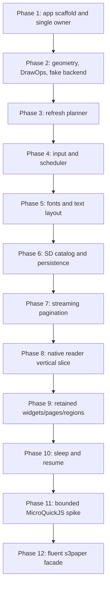
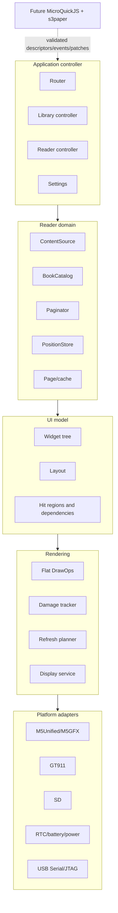

# Implementation Handoff: Native-First `s3paper` E-Reader

This document is for the engineer taking over the actual reader implementation. The goal is a useful PaperS3 reader built from native, testable primitives first, with a fluent `s3paper` JavaScript API added only after the native contracts are proven. The display hardware investigation is paused. Do not restart it as part of reader work, and do not treat the panel as optically qualified. The reader architecture must keep display policy behind one backend boundary so that hardware qualification can resume later without restructuring the application.

The primary design is not a rough idea. It contains the intended component boundaries, data contracts, phase gates, and examples of the future JS ABI:

```text
../ttmp/2026/07/14/ESP-50-PAPERS3-EREADER-PRIMITIVES--papers3-e-reader-native-primitives-and-future-javascript-api/design-doc/01-papers3-e-reader-primitives-analysis-design-and-implementation-guide.md
```

Read that guide before modifying firmware. This handoff tells you how to turn it into an implementation sequence without inheriting the accidental constraints of older demos.

> [!summary]
> - Start with a new native reader-primitives firmware, not MicroQuickJS and not a port of the JSX studio.
> - One UI owner task owns the model, display calls, refresh state, pagination cursors, and power transitions; every other producer sends bounded events.
> - Keep pure geometry, layout, drawing, pagination, and persistence logic host-testable and separate from M5/ESP headers.
> - Existing projects are evidence and reference material. Reuse their lessons, not their cross-task mutation or provisional reader behavior.

## 1. Product target and implementation order

The product target is a battery-aware e-reader for plain UTF-8 books on microSD. It needs a library, measured text layout, next/previous navigation, progress, bookmarks, resume, display refresh policy, and a USB diagnostic console. The eventual product surface is a fluent JavaScript API with constructs such as `paper`, `page`, `text`, `row`, `col`, `list`, `book`, and `region`.

Do not begin by binding those builders. The difficult work is beneath them: display ownership, geometry, clipping, draw-operation lifetime, refresh planning, touch normalization, timers, text measurement, pagination, content identity, persistence, and power transitions. A stable native substrate turns the JavaScript layer into a bounded conversion, handle-lifetime, and event-dispatch problem. An unstable substrate makes JavaScript failures impossible to localize.

The implementation order is therefore:



Each phase has an exit gate in the master design and in `tasks.md`. Do not bypass a gate because a later UI feature is attractive. In particular, do not begin MicroQuickJS integration until the native vertical slice is usable and its normalized render behavior has tests.

## 2. Repository map: what to read and what to preserve

### Authoritative design and task records

| Path | Why it matters |
| --- | --- |
| `ttmp/.../design-doc/01-papers3-e-reader-primitives-analysis-design-and-implementation-guide.md` | Master architecture, contracts, decision records, phase gates, test strategy, and MicroQuickJS ABI sketch. |
| `ttmp/.../tasks.md` | Ticket task IDs for Phase 1–13. Update this instead of keeping a private checklist. |
| `ttmp/.../reference/01-investigation-diary.md` | Chronological decisions, exact toolchain failures, and evidence history. Read before resuming any hardware-facing work. |
| `ttmp/.../sources/local/s3paper-api-design.md` | Original product/API proposal. Preserve as an input snapshot. |
| `ttmp/.../sources/local/s3paper-studio.jsx` | Executable UX and fluent-builder prototype; it is not directly targetable MicroQuickJS code. |

The `ttmp/...` abbreviation in this table means:

```text
/home/manuel/workspaces/2025-12-21/echo-base-documentation/esp32-s3-m5/
ttmp/2026/07/14/ESP-50-PAPERS3-EREADER-PRIMITIVES--papers3-e-reader-native-primitives-and-future-javascript-api/
```

### Existing firmware worth reading

| Project | What it proves | What not to copy blindly |
| --- | --- | --- |
| `0075-papers3-touch-draw-demo/` | Low-latency touch drawing, clipped fast updates. | Immediate drawing from input paths. |
| `0078-papers3-gnosis-layout/` | Retained nodes, layout, dirty rectangles, waveform hints, screens. | Direct shared mutation across console/UI paths. |
| `0080-papers3-ereader/` | Reader flow, SD content, bookmarks, touch turns, console, pagination integration. | Character-count pagination, uppercase 5×7 reading font, whole-book pre-pagination, page-number persistence, direct console/UI mutation. |
| `0079-papers3-wamr-assemblyscript-console/` | Bounded guest-to-host messages and replay boundary. | Its runtime/toolchain choices are not the new reader baseline. |
| `0106-papers3-epd-qualification/` | Diagnostics, visual fixtures, boundary and sleep/wake experiments. | Treat its optical results as a reason to pause physical claims, not as a reader implementation dependency. |

The repository has no README files for `0078` and `0080`; start from their `main/` sources. For `0080`, begin with `main/ereader_app.*`, `paginator.*`, `layout_engine.*`, `book_store.*`, `bookmark_store.*`, `widget_renderer.*`, and `ereader_console.*`.

## 3. The architecture to implement

The reader has five native layers plus a future JavaScript sidecar. Keep the dependency direction strict.



The critical ownership rule is simple and non-negotiable: **one task owns all mutable application and display state.** That task owns the widget tree, page model, display calls, refresh history, pagination cursors, callback registry, and sleep transitions. USB commands, touch samples, timer expirations, storage completions, and later JS events post bounded messages to it.

```text
console ─┐
touch ───┼──> bounded AppEvent queue ──> UI owner task ──> model/render/persist
clock ───┤
storage ─┤
JS VM ───┘
```

Do not “solve” concurrent access by putting a global mutex around display calls. A mutex cannot establish deterministic model ordering, safe callback lifetime, or a coherent refresh history. It also makes it easy for a future storage or JS callback to block the owner at the wrong time.

## 4. First implementation milestone: Phase 1

Create the next available numbered project directory; the master design’s `0106-papers3-ereader-primitives/` is only a provisional name. `0106` and later experimental projects already exist in this workspace, so choose a free number rather than overwriting anything.

Phase 1 should contain only the following responsibilities:

1. ESP-IDF project plumbing, SDK defaults, custom partitions if the selected assets require them, PSRAM configuration, and USB Serial/JTAG console.
2. A bounded POD `AppEvent` queue and bounded reply mechanism.
3. One UI owner task that processes commands and owns a small explicit app state.
4. Console commands that enqueue commands and receive replies; they must not mutate state directly.
5. Diagnostics for heap, queue depth/drop count, display backend state, and task ownership.
6. A stress fixture that emits concurrent console and synthetic input events and proves deterministic owner ordering.

A minimal contract is enough to begin:

```cpp
enum class AppEventKind : uint8_t {
    ConsoleCommand,
    Pointer,
    TimerDue,
    StorageComplete,
    ShutdownRequest,
};

struct AppEvent {
    AppEventKind kind;
    uint32_t request_id;
    int64_t monotonic_us;
    // POD payload union; no owned std::string and no borrowed JS pointer.
};

void UiOwnerTask(void*) {
    for (;;) {
        AppEvent event;
        if (!ReceiveEvent(&event, portMAX_DELAY)) continue;
        HandleEvent(event);       // mutate model only here
        RenderIfNeeded();         // display calls only here
        PersistIfDue();           // bounded/coalesced work only
    }
}
```

The Phase 1 exit gate is not a screen design. It is proof that simultaneous console traffic and input cannot mutate app state directly across tasks, and that queue-full/reply-timeout behavior is explicit.

## 5. Contracts that must stay pure and host-testable

Create `s3paper_core` without M5, ESP-IDF, FreeRTOS, or JavaScript headers in its public domain interfaces. Use it for types whose behavior must be proven quickly on the host.

### Geometry and damage

Use half-open rectangles: `[x, x+w) × [y, y+h)`. Do arithmetic in a wide integer type before narrowing. Test negative input, zero-area rectangles, overflow, rotation, every screen edge, and widths one through sixteen. The EPD alignment function belongs in one place; do not duplicate ad-hoc width rounding in widgets.

```cpp
struct Point { int32_t x, y; };
struct Size { int32_t w, h; };
struct Rect { int32_t x, y, w, h; };

Result<Rect> Intersect(Rect a, Rect b);
Result<Rect> Union(Rect a, Rect b);
Result<Rect> ClampTo(Rect r, Size bounds);
Rect AlignDamageForEpd(Rect r, Size bounds);
```

### Draw operations and frame lifetime

Layout emits flat typed `DrawOp` values. Widgets do not issue M5 calls. A frame arena owns text and glyph payloads through presentation. Do not store a pointer into an SD buffer, a temporary `std::string`, or a JavaScript value in a draw operation.

```cpp
enum class DrawOpKind : uint8_t { FillRect, StrokeRect, HLine, VLine, GlyphRun, Bitmap };
struct DrawOp { DrawOpKind kind; Rect bounds; /* POD payload or arena offset */ };
struct RenderFrame { Span<const DrawOp> ops; Span<const Rect> damage_hints; FrameId id; };
```

### Result-bearing failures

Use explicit `Status`/`Result` values rather than booleans that discard why an operation failed. Future C and JavaScript bindings need stable error vocabulary such as `InvalidArgument`, `CapacityExceeded`, `Busy`, `Timeout`, `CorruptData`, and `OutOfMemory`.

## 6. Display and refresh policy: isolate the uncertain hardware boundary

The reader must not expose `epd_quality`, `epd_text`, or `epd_fast` selection to widgets or JavaScript. Widgets report semantic intent and damage; one refresh planner maps those to the current qualified backend policy.

```cpp
enum class PresentIntent : uint8_t {
    InteractiveInk,
    TextRegion,
    TextPage,
    ImageQuality,
    CleanFull,
};
```

Only the M5 backend calls M5GFX. The safe transaction shape is:

```cpp
M5.Display.waitDisplay();
M5.Display.setEpdMode(mode);
M5.Display.startWrite();
// one coherent batch of rendering work
M5.Display.endWrite();
M5.Display.waitDisplay();
```

Do not infer visual correctness from those calls. The display qualification branch is paused after vendor, M5GFX, and independent direct-driver paths all failed to show expected fixed-aperture darkening. For reader development, preserve the boundary, log present metrics, use the fake backend for behavior tests, and avoid new waveform experimentation unless a separately reviewed task resumes it.

## 7. Text, books, and reader state

The native vertical slice should read plain UTF-8 text from microSD before EPUB. Text decoding, measurement, line breaking, rendering, and pagination must use the same metrics. If pagination uses character counts while rendering uses glyph widths, pages drift and stored positions lose meaning.

Persist a structured locator and content hash, not a page number. A page number is a cache result that changes with font, font size, margins, viewport, line height, and layout engine version.

```cpp
struct TextLocator {
    uint64_t byte_offset;
    uint32_t paragraph_index;
    uint32_t context_hash;
};

struct LayoutKey {
    ContentHash content;
    FontId font;
    int32_t font_size;
    Size viewport;
    Insets margins;
    uint32_t engine_version;
};
```

Books and disposable pagination cache belong on SD. Critical settings and last valid locator need atomic persistence with a temp/write/flush/rename/backup protocol. A missing or removed card is a recoverable application state. Never auto-format user storage.

## 8. MicroQuickJS: what to postpone and what to preserve

The future JavaScript layer is intentional, but it is not the starting point. The original JSX studio is a product and API prototype, not direct MicroQuickJS source. MicroQuickJS is mostly stricter ES5, uses a compacting GC, requires a fixed memory arena, and has bytecode that must be produced by a trusted host build pipeline.

When Phase 11 begins, start with a separate bounded spike. Pin an exact runtime commit, measure several arena sizes, bind one diagnostic function and one generation-safe opaque handle, test rooted references across allocations/GC, and establish a cancellation or bounded-handler rule. If that cannot be demonstrated, preserve the native ABI and postpone the runtime.

The eventual native ABI binds the model rather than M5GFX:

```c
s3_status s3_text_create(s3_runtime*, s3_string_view, s3_widget_handle* out);
s3_status s3_row_create(s3_runtime*, const s3_widget_handle*, size_t, s3_widget_handle* out);
s3_status s3_page_create(s3_runtime*, s3_string_view name, s3_page_handle* out);
s3_status s3_app_dispatch(s3_runtime*, const s3_event*);
```

Native code stores callback IDs, dependency IDs, and generation-safe handles. It never calls arbitrary JavaScript inside a display transaction. JS runs while resolving model changes; native rendering then consumes frozen, validated data.

## 9. Tooling and daily workflow

### ESP-IDF and project hygiene

Read the root `AGENTS.md` before building. Source the IDF version selected by the active project README; do not silently use whichever IDF shell happens to be active. Run `idf.py set-target esp32s3` once per project and use `idf.py build` for normal rebuilds. Dependencies belong in `main/idf_component.yml`, not the project root. If changing defaults that must take effect, remove `sdkconfig` before rebuilding because `sdkconfig.defaults` only seeds absent values.

The historical FactoryTest control uses ESP-IDF 5.3.3. Recent independent EPD experiments use 5.4.2. The future reader needs an explicit chosen/pinned baseline, not an accidental inheritance from either experiment. Record it in the project README, defaults, lock files, and handoff diary.

### Serial ownership

Use `/dev/serial/by-id/...` paths. Treat a PaperS3 serial device as single-owner. Do not run two monitors, flashers, or probes against it. Do not attach PaperS3 through pyserial or `idf.py monitor`; the investigation observed USB-UART-chip reset and ROM download mode from modem-control behavior. Use the ticket’s read-only capture scripts for passive observation. If a physical reset is needed, arm capture first, ask the operator, and wait for exactly one reset.

### Ticket documentation

Work in the existing ticket rather than creating disconnected notes. Before a meaningful change:

```bash
docmgr ticket list --ticket ESP-50-PAPERS3-EREADER-PRIMITIVES
docmgr task list --ticket ESP-50-PAPERS3-EREADER-PRIMITIVES
```

Use the diary for non-trivial implementation steps. Relate key code files to focused documents with absolute paths, update task IDs deliberately, and run:

```bash
docmgr doctor --ticket ESP-50-PAPERS3-EREADER-PRIMITIVES --stale-after 30
```

Commit source and documents in focused commits. Do not commit `build/`, `managed_components/`, `sdkconfig`, generated wasm sources, or unrelated serial evidence. Preserve preregistered hardware evidence as immutable records.

## 10. Suggested first week

1. Read the master design, the original API design, the studio prototype, `0080`, and this handoff.
2. Create the new reader project with a documented selected IDF/M5 stack and no MicroQuickJS dependency.
3. Implement the Phase 1 event types, owner task, queues, console proxy, diagnostics, and stress test.
4. Add a host-test target for pure `s3paper_core` types before writing display-heavy features.
5. Implement Phase 2 geometry, DrawOps, frame arena, clipping, fake backend, and M5 transaction shell.
6. Review the Phase 1/2 traces with another engineer before starting refresh policy or text layout.

The best early deliverable is not a styled library screen. It is a small firmware where a console command and a synthetic pointer event arrive through the same queue, are processed in a documented order, produce a normalized render trace in the fake backend, and can be observed through diagnostics without mutating display state from outside the owner.

## 11. Resume criteria and open questions

The reader can progress on host-testable and architectural work while the display investigation is paused. Before claiming a production refresh policy, text readability baseline, or panel power behavior, the team must decide how to resume hardware qualification. The existing evidence points to two separate branches: locked-camera spatial characterization or reviewed rail/VCOM measurement. Do not make panel modifications, analog probes, or arbitrary waveform changes as part of normal reader implementation.

The next implementation owner should also make the reader’s baseline explicit: whether it uses a validated current M5GFX path, an audited local patch, or a fake backend for most early development. That is a decision record, not a compile flag hidden in a shell environment.

## Review checklist

Before declaring a phase complete, ask:

- Does one task own every mutable UI/display/power object?
- Can the core behavior run under host tests without ESP/M5 headers?
- Are queue capacity, arena capacity, timeout, storage, and stale-handle failures explicit?
- Does a draw operation own or reference stable payload storage through presentation?
- Does only one refresh planner choose display policy?
- Are page positions stable locators rather than page numbers?
- Are JS callbacks outside display transactions and represented by IDs rather than raw runtime values?
- Is the build toolchain and dependency pin recorded and reproducible?
- Is hardware work separate from ordinary implementation work, preregistered when necessary, and safe for the current panel state?

If the answer to one of these is no, resolve it before adding another user-facing feature. That discipline is what will make the reader implementation smooth rather than merely fast at the beginning.
