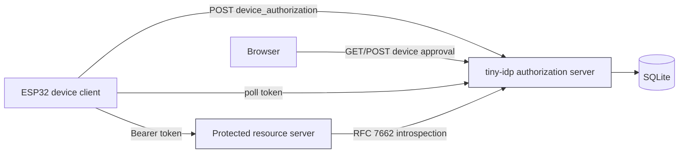
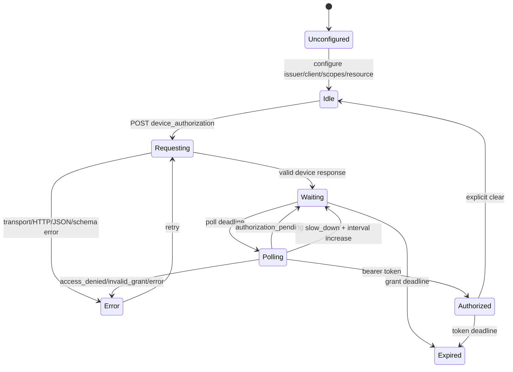

# Tiny-IDP and ESP32 Integration Friction Analysis and Maintainer Improvement Guide

## Executive summary

ESP-54 successfully connected an M5Stack PaperS3 to a Go service that embeds tiny-idp, completes OAuth 2.0 Device Authorization, calls bearer-protected REST APIs, opens an authenticated WebSocket stream, and renders a bounded live e-ink chart. tiny-idp itself did not require a source change. Its strict provider, SQLite store, account service, device-client bootstrap, device authorization endpoints, introspection endpoint, and in-process issuer transport were sufficient to build the system.

That success should not obscure the integration cost. A maintainer or intern had to assemble the supported composition from several documents and source trees, infer where the reusable resource-server boundary stopped, discover that LAN development requires HTTPS even in development mode, reverse-engineer the browser approval interaction for automation, and build substantial glue that already exists in an internal tiny-idp package but cannot be imported. The largest ESP32 failures—TLS heap fragmentation and lazy lwIP initialization—were firmware concerns rather than tiny-idp defects, but tiny-idp lacked a constrained-device integration profile that would have made those risks and the required validation matrix explicit before hardware testing.

The primary tiny-idp improvement is therefore not to weaken validation or add an ESP32-specific protocol. It is to make the supported external-consumer path complete:

1. Publish a supported `pkg/resourceauth` package for discovery, RFC 7662 introspection, principal validation, scope/audience checks, bounded responses, and correct HTTP outcomes.
2. Add a runnable strict embedded device-flow example that includes SQLite, accounts, device and introspection clients, HTTPS, protected REST, protected WebSocket upgrade, and browser approval.
3. Add a first-class LAN development TLS tool that generates a CA/server certificate and exports a device-installable CA artifact without weakening issuer validation.
4. Document the browser approval interaction as a stable contract and provide a test helper or operator command for approve/deny automation.
5. Add a machine-readable capability/diagnostic command that explains issuer, client, grant, scope, resource, introspection, and TLS readiness before the server starts.
6. Publish a constrained-device integration guide with bounded-memory parsing, native credential ownership, polling, `slow_down`, reconnect, sleep, expiry, and hardware fault testing.
7. Improve API discoverability with one complete composition path and explicit package-status labels: public/stable, public/advanced, internal reference only, and test-only.

These changes would have prevented the largest tiny-idp-specific re-derivation: the duplicate resource authenticator, uncertainty about strict device-flow maturity, LAN HTTPS setup, and browser approval automation. They would also give a new intern a safe path that does not require reading `internal/fositeadapter`, copying `cmd/tinyidp-xapp/internal/resourceauth`, or learning security invariants through failed requests.

## 1. Scope and evidence standard

This document separates three categories that are easy to conflate:

- **tiny-idp integration friction:** behavior or API boundaries that required source archaeology, duplicated code, or undocumented composition work.
- **ESP32 platform friction:** failures caused by constrained memory, lazy networking, callback fragmentation, e-ink cadence, or device lifecycle.
- **cross-system friction:** behavior that is individually correct in both systems but difficult to integrate without a shared guide or tool.

Recommendations are based on these concrete artifacts:

- tiny-idp public composition guide: `tiny-idp/docs/embedding-foundations.md`.
- tiny-idp device tutorial: `tiny-idp/cmd/tinyidp/doc/pages/tutorial-device-authorization.md`.
- public embedding APIs: `tiny-idp/pkg/embeddedidp/*`, `pkg/idpaccounts/*`, and `pkg/sqlitestore/*`.
- internal resource-server reference: `tiny-idp/cmd/tinyidp-xapp/internal/resourceauth/resourceauth.go`.
- completed ESP-54 host: `0114-papers3-pulp-os/demo-device-auth-server/`.
- completed firmware: `main/net_auth.cpp`, `main/net_socket.cpp`, and `tools/js/apps/pulp.js`.
- chronological failures and fixes: ESP-54 `reference/01-investigation-diary.md`.
- final hardware evidence: approval, denial, expiry, reconnect, sleep, parser probes, and two 30-minute runs recorded in the diary.

Observed behavior is labeled **Observed**. Proposed maintainer changes are labeled **Recommendation**. No recommendation is presented as an existing tiny-idp capability unless a public file supports it.

## 2. System model for a new intern

### 2.1 The four protocol actors

A constrained-device deployment has four actors even when three run in one Go process:

1. **Authorization server:** tiny-idp issues and introspects opaque access tokens.
2. **Device client:** the PaperS3 requests a device grant, displays the user code, polls, and stores the access token.
3. **Browser user agent:** a phone or workstation authenticates the user and approves or denies the device request.
4. **Resource server:** REST and WebSocket routes accept a bearer token only after introspection, audience, scope, token-type, issuer, and expiry validation.

The authorization server and resource server may share one executable, but they remain separate security roles. The resource server must not query tiny-idp's SQLite token tables directly. It should validate through the public protocol boundary—RFC 7662 introspection—or a public library with equivalent semantics.



### 2.2 Public tiny-idp composition

The supported package boundary is strong and should remain strong:

- `pkg/sqlitestore` provides durable identity/protocol state.
- `pkg/idpaccounts` provides account/password lifecycle and authentication.
- `pkg/embeddedidp` reconciles clients/signing keys, constructs the strict provider, reports readiness, and exposes an exact-issuer in-process HTTP transport.
- `pkg/idpstore` defines domain records and interfaces.

`docs/embedding-foundations.md:7-20` explicitly prohibits importing tiny-idp internals. ESP-54 respected that boundary.

The required order is:

```text
open SQLite
  -> create account service
  -> create/reconcile demo account
  -> bootstrap device + confidential resource clients and signing key
  -> construct embedded provider
  -> construct in-process issuer transport
  -> construct resource authenticator
  -> mount provider + protected APIs
  -> start TLS listener
```

The order matters because the Fosite client view is constructed during provider startup. `embedding-foundations.md:52-67` warns not to mutate client state after provider construction.

### 2.3 Device authorization states

A correct client is not a loop containing `sleep(5)`. It is a state machine that handles transport failures, protocol errors, expiry, application resets, and sleep.



The server determines `expires_in` and `interval`; the client must honor both. RFC 8628 `slow_down` increases the poll interval by five seconds. Device and access tokens are separate secrets with separate lifetimes.

### 2.4 Resource authorization

Introspection returns data, not a policy decision. A resource authenticator must validate at least:

```text
Authorization header is exactly one Bearer credential
AND introspection endpoint was discovered under the configured issuer
AND response is available and bounded
AND active == true
AND iss == configured issuer (when supplied/required)
AND token_type is Bearer
AND exp is in the future
AND expected audience is present
AND required scopes are present
AND subject/client identity fields satisfy route policy
```

ESP-54 implemented this in `demo-device-auth-server/internal/authn/introspection.go`. tiny-idp already has a more general implementation in `cmd/tinyidp-xapp/internal/resourceauth/resourceauth.go`, but Go's `internal` import rule correctly prevents an external application from using it.

## 3. What tiny-idp did well

A useful postmortem must preserve the parts that reduced risk.

### 3.1 The public embedding boundary was sufficient

**Observed:** `embeddedidp.DeviceClient`, `embeddedidp.Bootstrap`, `embeddedidp.New`, `Provider.Handler`, and `NewInProcessIssuerTransport` were enough to host strict device authorization without changing tiny-idp. The final tiny-idp working tree remained clean.

This is a significant success. The application did not need private signing keys, Fosite types, raw password hashers, or direct protocol-table access.

### 3.2 Validation failed closed

**Observed:** a LAN issuer such as `http://192.168.0.39:8790/idp` failed with:

```text
dev http issuer must be loopback
```

The source invariant is in `internal/oidcmeta/issuer.go:25-34`. This is correct. Weakening it would expose device codes, browser credentials, cookies, and bearer tokens on the LAN. ESP-54 changed to HTTPS/WSS and embedded the development CA in firmware.

### 3.3 Device authorization was production-shaped

**Observed:** strict mode provided durable grants, CSRF-bound browser interactions, fresh password authentication, discovery metadata, RFC 8707 resource indicators, `authorization_pending`, `slow_down`, denial, expiry, and transactional token issuance. The hardware completed all of those relevant paths.

### 3.4 The in-process transport preserved protocol boundaries

**Observed:** `NewInProcessIssuerTransport` allowed the resource server to call discovery and introspection without opening a loopback network connection. It validated the exact issuer origin/path and bounded response bytes (`pkg/embeddedidp/inprocess_transport.go`).

This is the right abstraction: optimize transport while retaining HTTP semantics and issuer checks.

### 3.5 CSRF behavior exposed incorrect automation

**Observed:** a direct POST to `/device` returned `invalid csrf token`. Correct automation had to GET the verification page, retain cookies, extract `interaction` and `csrf_token`, and POST them with the action and credentials.

The failure prevented an unsafe shortcut. The problem was discoverability, not the protection itself.

## 4. Tiny-idp-specific friction encountered

### 4.1 No complete strict embedded device/resource example

**Observed:** the documentation had separate pieces:

- `tutorial-device-authorization.md` demonstrated a curl flow and explicitly assumed loopback HTTP.
- `embedding-foundations.md` documented public construction order and device clients.
- `examples/embedded/main.go` demonstrated embedding.
- `cmd/tinyidp-xapp` demonstrated a protected resource server.
- production TLS/introspection smoke behavior lived in tests.

No single public example showed the actual ESP-54 topology: strict embedded provider + SQLite + account + device client + confidential introspection client + HTTPS + protected REST + protected WebSocket + device approval.

An expert can compose these references. An intern may incorrectly choose one of these shortcuts:

- use mock mode because the tutorial is easiest to run;
- use HTTP on the LAN;
- query SQLite directly for tokens;
- import an internal package;
- trust any `active: true` introspection response without audience/scope validation;
- attach bearer tokens to arbitrary routes.

**What I wish I had known:** the repository had all major components, but no executable “golden path” combined them. The xapp resource authenticator was a reference, not a public API.

**Recommendation:** add `examples/embedded-device-resource-server/` with a minimal but complete application and tests.

### 4.2 Resource authentication was reusable in design but internal in packaging

**Observed:** `cmd/tinyidp-xapp/internal/resourceauth` already performs discovery, endpoint-origin validation, Basic-authenticated introspection, response validation, principal construction, scope checks, audience checks, unavailable/unauthorized distinctions, and caching. ESP-54 could not import it and wrote `internal/authn/introspection.go`.

This duplicated security-sensitive logic. The duplication was intentional under the current package boundary, but it is a maintainer signal: at least two applications need the same abstraction.

**What I wish I had known:** there was no supported public resource-server package, and the correct response was duplication with tests—not bypassing introspection or violating `internal`.

**Recommendation:** promote a cleaned, application-neutral package to `pkg/resourceauth`.

Proposed API:

```go
package resourceauth

type Config struct {
    Issuer            string
    HTTPClient        *http.Client
    ClientID          string
    ClientSecret      []byte
    ExpectedAudience  string
    RequiredScopes    []string
    MaxResponseBytes  int64
    CacheTTL          time.Duration
    Now               func() time.Time
}

type Principal struct {
    Subject   string
    ClientID  string
    Audience  []string
    Scopes    []string
    ExpiresAt time.Time
}

type Outcome uint8
const (
    OutcomeAuthorized Outcome = iota
    OutcomeUnauthorized
    OutcomeForbidden
    OutcomeUnavailable
)

type Authenticator interface {
    Authenticate(*http.Request) (Principal, Outcome)
}

func New(ctx context.Context, cfg Config) (Authenticator, error)
func RequireScopes(next http.Handler, auth Authenticator, scopes ...string) http.Handler
```

Security requirements:

- discover introspection endpoint from the exact issuer;
- reject cross-origin or path-confused endpoints;
- require advertised `client_secret_basic` when used;
- cap request duration and response bytes;
- use a keyed token hash for caches, never the raw bearer token;
- never log credentials or full introspection bodies;
- distinguish invalid credentials (`401`), insufficient scope (`403`), and unavailable IdP (`503`);
- validate issuer, active, token type, expiration, audience, and scopes;
- expose metrics without token labels.

### 4.3 LAN development TLS was mandatory but not turnkey

**Observed:** device testing could not use the loopback-only HTTP tutorial because the device is a separate host. tiny-idp correctly rejected LAN HTTP. ESP-54 then had to create a CA, server certificate with the workstation IP as a SAN, HTTPS listener wiring, and firmware-embedded CA.

**What I wish I had known:** “development mode” does not mean “LAN HTTP.” For external hardware, the first integration task is trust provisioning, not OAuth.

**Recommendation:** add a tool such as:

```bash
tinyidp dev-cert create \
  --host 192.168.0.39 \
  --dns pulp-idp.local \
  --out-dir ./var/tls \
  --emit-c-header ./firmware/pulp_demo_ca.pem
```

Expected outputs:

```text
var/tls/ca.crt
var/tls/ca.key          # owner-only, never embedded
var/tls/server.crt
var/tls/server.key      # owner-only
firmware/pulp_demo_ca.pem
var/tls/manifest.json   # SANs, expiry, fingerprints, generated-at
```

The tool should:

- refuse public Internet addresses by default;
- create IP and DNS SANs explicitly;
- use short development lifetimes;
- set owner-only permissions on private keys;
- print exact Go server and curl commands;
- print the SHA-256 CA fingerprint;
- support `inspect` and `rotate`;
- never add an “allow insecure LAN HTTP” flag to the provider.

### 4.4 Approval automation contract was not easy to discover

**Observed:** the strict `/device` POST requires browser cookie state, an opaque `interaction` value, CSRF token, credentials when fresh authentication is required, and an action. The HTML renderer exposes those fields, and tests contain extraction helpers, but the device tutorial says “open in the browser” rather than documenting a test automation flow.

A direct POST failed. A deny POST with `formnovalidate` still required server-side authentication; omitting credentials redisplayed “Enter your username and password.” That is correct server behavior but non-obvious to an integration engineer.

**What I wish I had known:** HTML constraint bypass (`formnovalidate`) affects browser validation only; it does not bypass tiny-idp's fresh-authentication policy. Approval/denial automation must behave like a browser.

**Recommendation A—documentation:** add an “Automating strict approval in integration tests” section with a cookie jar, GET, hidden-field extraction, and POST.

**Recommendation B—public test helper:** provide an external-package-safe helper that operates over HTTP rather than touching provider internals:

```go
flow, err := idptest.FetchDeviceVerification(ctx, client, verificationURIComplete)
err = flow.Decide(ctx, idptest.DeviceDecision{
    Action:   idptest.Deny,
    Login:    "alice",
    Password: password,
})
```

The helper should remain under a clearly test-only package such as `pkg/idptest`. It must consume the same CSRF/browser contract as production and must not add a privileged approval endpoint.

**Recommendation C—operator CLI:** for controlled testing, add:

```bash
tinyidp device verify --url "$URI" --login alice --password-file ./secret --approve
tinyidp device verify --url "$URI" --login alice --password-file ./secret --deny
```

This is an HTTP browser client, not an admin bypass.

### 4.5 Client bootstrap required security-domain knowledge

**Observed:** ESP-54 needed two OAuth clients:

- a public device client with device-code grant and scopes;
- a confidential introspection client with a stable secret hash and allowed audience/capabilities.

`DeviceClient` made the first easy. The resource client required understanding `idpstore.Client`, secret hashing/reconciliation, production validation, and idempotency. The project learned that salted password hashes cannot be regenerated and byte-compared for equality; reconciliation must verify the stable plaintext secret against the stored hash or retain the existing credential.

**What I wish I had known:** the “resource server client” is a standard deployment role and deserves a public constructor/reconciler alongside `DeviceClient` and `BrowserClient`.

**Recommendation:** add:

```go
embeddedidp.ResourceServerClient(
    "pulp-resource-server",
    embeddedidp.ResourceServerOptions{
        Audiences: []string{"https://192.168.0.39:8790/api"},
        IntrospectionAuth: embeddedidp.ClientSecretBasic,
    },
)
```

Secret material should be supplied separately from the non-secret client spec:

```go
BootstrapConfig{
    Clients: []ClientSpec{resourceSpec},
    ClientSecrets: map[string]SecretSource{
        "pulp-resource-server": FileSecret("var/secrets/introspection.key"),
    },
}
```

The report must indicate `Created`, `Retained`, `Rotated`, or `Conflict` without exposing hashes or secrets.

### 4.6 Device-client capabilities and refresh policy were easy to misread

**Observed:** the initial design concluded that `DeviceClient` intentionally exposed only device-code grant and that ESP-54 should not request `offline_access`. The current embedding guide now explains that refresh/offline access should be added only under a reviewed long-lived-token policy. That nuance is correct but should be colocated with the constructor and tutorial.

**What I wish I had known:** “device client” does not imply “refresh token.” Device access-token renewal, persistent refresh credentials, secure storage, revocation, and theft recovery are a separate policy decision.

**Recommendation:** make the constructor's defaults and opt-ins explicit in Go documentation and generated help:

```text
DeviceClient defaults:
  public client: yes
  grant_types: device_code only
  response_types: none
  redirect_uris: none
  refresh token: disabled
  offline_access: absent
  PKCE flag: retained for public-client invariant, dormant for device flow
```

### 4.7 Discovery and route shape required cross-document reasoning

**Observed:** the provider was mounted under `/idp`; device endpoints, introspection, and discovery had to use the issuer path consistently. The tutorial also describes root aliases and path-based issuers. An intern can accidentally call root `/token` while configuring issuer `/idp`, or treat root aliases as canonical.

**Recommendation:** add `Provider.Endpoints()` or a typed endpoint manifest:

```go
type Endpoints struct {
    Issuer              string
    Discovery           string
    DeviceAuthorization string
    DeviceVerification  string
    Token               string
    Introspection       string
    JWKS                string
}

endpoints := provider.Endpoints()
```

The same object can drive startup logs, examples, tests, and tooling. It should distinguish canonical issuer-path routes from compatibility aliases.

### 4.8 Diagnostics were distributed across errors, docs, tests, and debug routes

**Observed:** meaningful failures included issuer rejection, bootstrap requirements, CSRF errors, polling errors, and client capability errors. Understanding each often required locating validation source or tests.

**Recommendation:** add a preflight command and structured report:

```bash
tinyidp doctor embedded-device \
  --issuer https://192.168.0.39:8790/idp \
  --db ./var/state/identity.db \
  --device-client pulp-papers3 \
  --resource-client pulp-resource-server \
  --audience https://192.168.0.39:8790/api \
  --tls-cert ./var/tls/server.crt
```

Example output:

```json
{
  "ready": false,
  "checks": [
    {"id":"issuer.https", "ok":true},
    {"id":"issuer.cert_san", "ok":true},
    {"id":"store.schema", "ok":true},
    {"id":"device_client.grant", "ok":true},
    {"id":"device_client.scopes", "ok":true},
    {"id":"resource_client.confidential", "ok":true},
    {"id":"resource_client.introspection", "ok":true},
    {"id":"audience.binding", "ok":false, "reason":"audience not allowed"}
  ]
}
```

Error messages should include a stable error ID and a documentation pointer while retaining the existing human-readable cause.

## 5. Cross-system friction: what tiny-idp should teach without owning

The following failures were not tiny-idp bugs. They belong in an integration guide because they predictably affect constrained clients.

### 5.1 TLS allocation under realistic device load

**Observed:** HTTP device authorization and protected REST worked, but WSS failed after the UI and HTTP activity with:

```text
mbedtls_ssl_setup returned -0x7F00
ESP_ERR_MBEDTLS_SSL_SETUP_FAILED
internal_free=50227 internal_largest=12800
```

The total heap looked sufficient, but contiguous internal memory was not. Moving mbedTLS allocation to trusted PaperS3 PSRAM and enabling dynamic TLS buffers fixed it.

**tiny-idp documentation improvement:** add a constrained-client checklist:

- measure free and largest contiguous heap;
- test TLS after UI and prior requests, not only at boot;
- test simultaneous HTTP/WSS lifetimes;
- pin and provision the CA;
- keep response sizes bounded;
- report TLS library error codes;
- define the physical-memory threat model before placing TLS structures in external RAM.

### 5.2 Lazy network initialization

**Observed:** starting auth before Wi-Fi initialized lwIP caused:

```text
assert failed: tcpip_send_msg_wait_sem ... (Invalid mbox)
```

The native API was hardened to reject startup until Wi-Fi was up, and the live probe joined saved Wi-Fi first.

**tiny-idp documentation improvement:** pseudocode should show network readiness as a prerequisite rather than starting with `POST /device_authorization` in isolation.

### 5.3 WebSocket fragmentation and malformed JSON

**Observed:** Espressif can split one logical message across data events. Firmware implemented bounded offset-aware reassembly. A later probe injected stale malformed frames and exposed an uncaught JavaScript `JSON.parse`; the app then advanced sequence state and ignored malformed/schema-invalid samples.

**tiny-idp documentation improvement:** protected WebSocket examples should state that authentication covers the HTTP upgrade, not message framing or application schema. Include separate framing and JSON validation boundaries.

### 5.4 Device application resets and token ownership

**Observed:** entering SENSOR LINK originally called `auth.configure()` and cleared an already authorized native session. The application now configures only from unconfigured state. Tokens remain native, RAM-only, redacted, and unavailable to JavaScript.

**tiny-idp documentation improvement:** add a “credential owner” design question:

```text
Who owns the access token?
How does it survive/reject app resets?
Can scripts/plugins read it?
Where can Authorization be attached?
What clears it on sleep, denial, expiry, logout, or factory reset?
```

### 5.5 E-ink and stream cadence

**Observed:** the server emitted at 2 Hz while the panel updated at 0.5 Hz. A 64-message ring and 60-point chart bounded memory. The final 30-minute app soak produced 3,778 WSS messages, 881 presents, stable heap, zero event drops, and zero JavaScript exceptions.

**tiny-idp documentation improvement:** do not prescribe e-ink rendering, but include “protocol rate is not UI rate” in the constrained-device guide. Poll cadence, network cadence, storage cadence, and display cadence are separate clocks.

## 6. Documentation redesign

### 6.1 Current information architecture problem

The existing docs are individually strong but require a reader to know which document answers which layer. A novice starting with “connect an ESP32 to tiny-idp” should not need to infer this route:

```text
README maturity statement
 -> embedding foundations
 -> device tutorial
 -> embedded example
 -> xapp internal resourceauth
 -> strict provider tests
 -> ESP-IDF TLS/WebSocket docs
```

### 6.2 Proposed documentation map

```text
docs/
  embedding-foundations.md            # package boundary and lifecycle
  device-authorization.md             # protocol semantics, all modes
  constrained-device-integration.md   # native client design + hardware checklist
  resource-server-authentication.md   # public resourceauth package
  lan-development-tls.md              # CA/cert generation and trust provisioning
  browser-interaction-testing.md       # CSRF-safe automation
examples/
  embedded-device-resource-server/
    README.md
    cmd/server/main.go
    internal/api/
    integration_test.go
    scripts/run-device-flow.sh
```

Each page should start with:

- audience;
- supported mode(s);
- security status;
- prerequisites;
- runnable command;
- related public APIs;
- explicit non-goals.

### 6.3 One “start here” decision table

| Goal | Engine/mode | Start here | Do not do |
|---|---|---|---|
| Learn device grant with curl | mock or strict loopback dev | device tutorial | expose listener to LAN |
| Embed strict provider | strict + SQLite | embedding foundations | import `internal/*` |
| Connect external hardware | strict/dev composition + HTTPS | constrained-device guide | use LAN HTTP |
| Protect REST/WSS | introspection + resourceauth | resource-server guide | query token tables directly |
| Automate browser approval | strict HTTP test helper | browser interaction testing | POST without cookie/CSRF |
| Deploy production | production mode | security profile/production host | treat hardware demo as production approval |

### 6.4 API references should include complete signatures and invariants

For each public constructor, document:

- exact signature;
- normalized inputs;
- defaults;
- idempotency;
- secret handling;
- error types and stable IDs;
- whether it performs I/O;
- whether it may partially commit;
- lifecycle ownership;
- concurrency guarantees;
- executable example.

For example, `Bootstrap` documentation should make partial reports, post-commit audit failure, drift detection, and secret reconciliation visible next to the basic call.

### 6.5 Add a “what fails first” section

A novice guide should list expected failures in likely order:

| Symptom | Layer | Likely cause | Correct response |
|---|---|---|---|
| `dev http issuer must be loopback` | tiny-idp issuer validation | external hardware uses LAN HTTP | provision HTTPS/CA |
| browser says invalid CSRF | browser interaction | direct POST or lost cookie | GET form and replay cookie + hidden fields |
| `authorization_pending` | OAuth | user has not approved | wait configured interval |
| `slow_down` | OAuth | polling too quickly | add 5 seconds |
| introspection inactive | resource auth | expired/wrong/consumed token | return 401; do not retry as server error |
| resource scope missing | resource auth | token lacks route scope | return 403 |
| TLS setup allocation failure | device | fragmented/insufficient heap | inspect largest block and TLS allocation strategy |
| `Invalid mbox` | device | network stack not initialized | gate native start on network readiness |
| WSS JSON parse error | application | malformed/stale frame | bound, validate, skip, advance cursor |

## 7. Proposed tiny-idp API and tooling roadmap

### P0: remove security-sensitive reimplementation

#### P0.1 Publish `pkg/resourceauth`

Deliverables:

- public package extracted from xapp internal implementation;
- discovery and endpoint validation;
- bounded introspection;
- principal and route-policy APIs;
- cache with keyed token hashes;
- HTTP middleware and explicit outcomes;
- external-consumer tests;
- documentation and migration of xapp to the public package.

Acceptance:

- ESP-54's `internal/authn` can be replaced without losing tests or behavior;
- no raw token appears in logs, metrics, cache keys, or errors;
- wrong issuer/audience/type/expiry/scope cases are tested;
- unavailable IdP maps differently from invalid credentials.

#### P0.2 Add the complete strict embedded device/resource example

Acceptance:

- one command starts HTTPS on loopback or a configured LAN IP;
- example provisions SQLite, account, device client, and resource client;
- curl/script drives authorization_pending, approval, denial, and introspection;
- protected REST and WSS upgrade tests pass;
- no imports from `internal/*`.

#### P0.3 Add LAN TLS tooling and guide

Acceptance:

- generated certificate validates the configured IP/DNS SAN;
- private key permissions are checked;
- CA fingerprint and device artifact are emitted;
- rotation is documented;
- insecure issuer validation is not weakened.

### P1: make integration diagnosable

#### P1.1 `doctor embedded-device`

Add stable check IDs, JSON output, and remediation links.

#### P1.2 Browser interaction test helper

Automate the real browser contract over HTTP; never expose a bypass route.

#### P1.3 Endpoint manifest

Expose canonical endpoints and aliases from one typed provider API.

#### P1.4 Resource server client constructor

Separate non-secret declaration from secret source/reconciliation.

### P2: optimize intern onboarding and constrained-device quality

#### P2.1 Constrained-device guide

Include the architecture and validation matrix in this document, but keep chip-specific settings in downstream projects.

#### P2.2 Protocol trace mode

Provide redacted structured events:

```json
{"event":"device.poll","outcome":"authorization_pending","next_poll_seconds":5}
{"event":"device.poll","outcome":"slow_down","next_poll_seconds":10}
{"event":"introspection","outcome":"active","client_id":"pulp-papers3","scope_count":4}
```

Never include device codes, user codes beyond explicitly public UI contexts, bearer tokens, secrets, passwords, or raw cookies.

#### P2.3 Compatibility matrix

Track strict/mock support for device grant, refresh, DPoP, introspection, revocation, resource indicators, debug routes, and production release gates.

## 8. Decision records

### Decision: keep non-loopback HTTP rejection

- **Context:** LAN hardware testing failed under HTTP.
- **Options considered:** allow dev LAN HTTP; add an insecure flag; require HTTPS and improve tooling.
- **Decision:** retain rejection and make development TLS turnkey.
- **Rationale:** bearer tokens, browser credentials, and cookies cross the LAN. Convenience must not redefine development security.
- **Consequences:** certificate generation and device trust provisioning become first-class onboarding steps.
- **Status:** accepted.

### Decision: publish resource authentication instead of exposing token storage

- **Context:** external resource servers duplicate introspection logic.
- **Options considered:** expose token tables; expose direct store lookup; publish protocol-shaped resource authentication.
- **Decision:** publish `pkg/resourceauth` using discovery/introspection semantics.
- **Rationale:** preserves issuer/resource boundaries and works in-process or over HTTPS.
- **Consequences:** tiny-idp owns a larger public API and compatibility commitment.
- **Status:** proposed.

### Decision: automate browser behavior, not approval bypass

- **Context:** integration tests need deterministic approve/deny flows.
- **Options considered:** debug approval endpoint; direct store mutation; HTTP test helper that follows cookies/CSRF.
- **Decision:** provide a test helper/CLI that acts as a browser.
- **Rationale:** tests the production contract and retains security invariants.
- **Consequences:** HTML/form contracts require stable semantic fields or a machine-readable test adapter.
- **Status:** proposed.

### Decision: keep ESP32 token ownership downstream

- **Context:** token secrecy and lifecycle depend on firmware architecture.
- **Options considered:** tiny-idp ESP32 SDK; generic C client; integration guidance only.
- **Decision:** document required invariants and reference implementation; do not make tiny-idp own a chip SDK yet.
- **Rationale:** networking, secure storage, tasks, and UI differ substantially across embedded platforms.
- **Consequences:** downstream firmware retains responsibility for secure clearing, destination confinement, sleep, and memory bounds.
- **Status:** proposed.

### Decision: prefer a complete example over more isolated snippets

- **Context:** individual docs were accurate but composition required expert source archaeology.
- **Options considered:** expand every page; add more snippets; maintain one executable golden path with linked explanations.
- **Decision:** add one tested strict embedded device/resource example.
- **Rationale:** compilation and integration tests prevent documentation drift.
- **Consequences:** example maintenance becomes part of tiny-idp CI.
- **Status:** proposed.

## 9. Intern implementation guide

### Phase 0: read and classify boundaries

Read in this order:

1. `README.md` maturity and engine table.
2. `docs/embedding-foundations.md` supported packages and composition order.
3. `cmd/tinyidp/doc/pages/tutorial-device-authorization.md` RFC 8628 wire flow.
4. `pkg/embeddedidp/example_test.go` executable public API.
5. ESP-54 host `internal/app/app.go` as the completed external consumer.
6. ESP-54 firmware `net_auth.cpp` and `net_socket.cpp` for constrained client behavior.

Write down which code belongs to:

- provider;
- device;
- browser;
- resource server;
- product UI.

Do not write code until every secret has one owner and every HTTP origin is named.

### Phase 1: define URLs and trust

Create a configuration table:

```text
public base:  https://192.168.0.39:8790
issuer:       https://192.168.0.39:8790/idp
audience:     https://192.168.0.39:8790/api
socket:       wss://192.168.0.39:8790/api/v1/sensors/ws
device ID:    pulp-papers3
resource ID:  pulp-resource-server
```

Generate TLS certificates before starting OAuth work. Verify SAN and CA trust from both workstation and device.

### Phase 2: open storage and accounts

Pseudocode:

```go
store := sqlitestore.Open(Config{Path: identityDB})
accounts := idpaccounts.NewService(store, passwordOptions)
ensureAccount(accounts, login, password)
```

Requirements:

- state directory is owner-controlled;
- password comes from a file or secret source, not a command-line flag;
- startup is idempotent;
- mismatched persisted account configuration fails visibly.

### Phase 3: bootstrap clients before provider construction

```go
device := embeddedidp.DeviceClient(
    "pulp-papers3",
    []string{"openid", "profile", "demo.read", "sensors.read"},
)

resource := embeddedidp.ResourceServerClient(/* proposed API */)

report, err := embeddedidp.Bootstrap(ctx, store, BootstrapConfig{
    Mode: ProductionModeOrReviewedDevMode,
    Clients: []ClientSpec{device, resource},
})
```

Check report and conflict errors. Never print secrets.

### Phase 4: construct provider and in-process transport

```go
provider := embeddedidp.New(ctx, Options{
    Issuer: issuer,
    Store: store,
    Authenticator: accounts,
    // token, cookie, audit, rate limiter, client address controls
})

transport := embeddedidp.NewInProcessIssuerTransport(
    issuer,
    provider.Handler(),
    InProcessTransportOptions{MaxResponseBytes: limit},
)
```

Mount the provider at the issuer path. Use `Readiness` before accepting traffic.

### Phase 5: protect resources

Use the proposed `pkg/resourceauth`, or if unavailable, implement and test the complete validation list in Section 2.4. Apply separate route scopes:

```text
GET /api/v1/me              -> demo.read
GET /api/v1/demo/fortune    -> demo.read
GET /api/v1/sensors/snapshot-> sensors.read
WS  /api/v1/sensors/ws      -> sensors.read
```

Authenticate the WebSocket before upgrade. Never put the bearer token in the query string.

### Phase 6: implement the constrained client

Rules:

- token lives in native RAM, not JavaScript;
- response buffers have explicit caps;
- parser validates JSON types and required fields;
- poll timer uses server interval and `slow_down`;
- Authorization header is available only after canonical destination validation;
- token and device code are securely cleared on denial, expiry, sleep, and explicit clear;
- network startup is gated on Wi-Fi readiness;
- WSS fragments are reassembled by total length and offset;
- malformed messages are dropped and counted.

### Phase 7: implement QR and presentation

Use `verification_uri_complete` as the QR payload. Keep `user_code` visible as fallback. Clear the QR after authorization or grant expiry. The QR carries a public one-time code, not the bearer token.

### Phase 8: validate failures before soak

Required cases:

- issuer rejects LAN HTTP;
- pending and `slow_down`;
- approve and deny;
- grant expiry and token expiry;
- wrong audience/scope/type/issuer introspection;
- malformed/oversized device response;
- fragmented, oversized, discontinuous, binary WSS frames;
- server stop/restart;
- Wi-Fi off/rejoin;
- deep sleep/wake;
- ring wrap;
- app reset while authorized;
- malformed JSON reaching UI;
- no token accessor/log/persistence.

### Phase 9: run product-level soak

Capture at start and end:

- auth state and redacted token length;
- socket state, received, overwritten/dropped, ring count;
- internal free/min/largest heap and external RAM;
- event queue depth/high-water/drops;
- JavaScript exception count;
- panel frame/present count;
- elapsed wall time.

A transport-only soak does not prove panel behavior. Run the actual product page.

## 10. Test strategy for tiny-idp maintainers

### 10.1 Public external-consumer test

Create a test module outside tiny-idp's import tree. It must import only public packages and build the full device/resource host. This catches accidental reliance on `internal` APIs.

### 10.2 Golden device-flow integration test

Test sequence:

```text
start device grant
 -> assert verification_uri_complete
 -> poll -> authorization_pending
 -> poll too fast -> slow_down
 -> browser GET -> cookie + interaction + CSRF
 -> approve -> token
 -> introspect -> active + audience + scopes
 -> use token at REST and WSS
 -> consume grant again -> invalid_grant
```

Add deny and expiry variants.

### 10.3 Resourceauth adversarial matrix

| Case | Expected |
|---|---|
| missing Authorization | 401 |
| multiple Authorization headers | 401 |
| malformed Bearer syntax | 401 |
| introspection timeout | 503 |
| oversized response | 503 |
| inactive token | 401 |
| wrong issuer | 401 |
| expired | 401 |
| wrong token type | 401 |
| wrong audience | 401 or policy-defined 403 |
| missing required scope | 403 |
| valid | principal + next handler |

### 10.4 Documentation tests

CI should execute:

- every README command that does not require a browser;
- device flow scripts with the test browser helper;
- certificate generation and SAN verification;
- all example builds with `GOWORK=off` where appropriate;
- link and help-slug checks;
- an external consumer compile test.

## 11. Risks and alternatives

### Risk: public resourceauth becomes too application-specific

Mitigation: keep principal extraction and policy checks composable. Do not embed xapp route names, claims, or cache policy defaults that cannot be overridden safely.

### Risk: test helper stabilizes HTML accidentally

Mitigation: expose semantic field/action constants through `pkg/idpui` and make the helper parse HTML by those names. Prefer a provider-owned interaction model only if it does not create a privileged bypass.

### Risk: dev certificate tooling is mistaken for production PKI

Mitigation: mark generated artifacts as development-only, use short expiry, print warnings, and document production certificate management separately.

### Alternative: document how to copy internal resourceauth

Rejected. Copying security code creates divergent fixes and no compatibility contract.

### Alternative: let embedded apps read token rows directly

Rejected. It couples resource servers to storage internals, bypasses issuer/audience semantics, and cannot generalize to a remote provider.

### Alternative: allow insecure HTTP with an explicit flag

Rejected. Hardware developers often run on shared LANs; an insecure flag would become the default workaround and expose credentials.

### Alternative: publish an ESP-IDF SDK now

Deferred. The completed firmware is valuable reference code, but a maintained SDK requires a stable C API, multiple chips/network stacks, secure-storage policy, and independent lifecycle ownership. Documentation and protocol fixtures provide more leverage first.

## 12. Success metrics

After the improvements, a new intern should be able to:

1. Find the external hardware guide from the README in under two minutes.
2. Start the complete example and discover all endpoint URLs without reading source.
3. Generate a LAN development CA/server certificate with one command.
4. Explain why LAN HTTP is rejected.
5. Provision device and resource clients without constructing raw `idpstore.Client` records.
6. Protect REST and WSS without copying internal code.
7. Automate approve/deny without bypassing CSRF.
8. Produce a redacted protocol trace for pending, slowdown, approval, denial, and expiry.
9. Complete the device flow without importing `internal/*` or reading Fosite internals.
10. Run the fault matrix and identify whether a failure belongs to tiny-idp, transport/TLS, firmware lifecycle, or application parsing.

Repository-level indicators:

- xapp and ESP-54-style hosts both use `pkg/resourceauth`;
- no duplicate bearer/introspection validators in examples;
- complete example runs in CI;
- docs link directly to public APIs and stable error IDs;
- source archaeology is verification, not the first route to understanding.

## 13. Maintainer work breakdown

### Ticket A: Public resource-server authentication

- extract and generalize xapp resourceauth;
- define stable principal/outcome APIs;
- add keyed cache and metrics;
- migrate xapp;
- create external consumer tests;
- document REST/WSS use.

### Ticket B: Embedded device/resource golden example

- SQLite/account/bootstrap/provider composition;
- device + resource clients;
- HTTPS listener;
- protected REST/WSS;
- browser test helper;
- full integration matrix.

### Ticket C: LAN development trust tooling

- CA/server generation;
- SAN/fingerprint manifest;
- device CA export;
- inspect/rotate commands;
- security documentation.

### Ticket D: Diagnostics and endpoint manifest

- typed endpoint API;
- stable check/error IDs;
- `doctor embedded-device` human and JSON output;
- remediation links.

### Ticket E: Constrained-device documentation

- architecture;
- state machine;
- credential ownership;
- bounded parsing;
- TLS memory checklist;
- reconnect/sleep/expiry;
- acceptance matrix and soak template.

## 14. What not to change

The integration experience does **not** justify these changes:

- do not permit non-loopback HTTP in development mode;
- do not expose raw signing keys or token-store internals;
- do not make CSRF optional for device approval;
- do not add a privileged approve endpoint for tests;
- do not make refresh tokens a default device-client capability;
- do not expose bearer tokens through diagnostics;
- do not move all internal packages public merely because one application needs them;
- do not couple tiny-idp to ESP-IDF-specific memory or task APIs.

The objective is a clearer and more complete supported boundary, not a broader unsafe boundary.

## 15. References and source reading order

### tiny-idp public documentation and APIs

1. `/home/manuel/workspaces/2026-07-23/tiny-idp-device-auth-eink/tiny-idp/README.md`
2. `/home/manuel/workspaces/2026-07-23/tiny-idp-device-auth-eink/tiny-idp/docs/embedding-foundations.md`
3. `/home/manuel/workspaces/2026-07-23/tiny-idp-device-auth-eink/tiny-idp/cmd/tinyidp/doc/pages/tutorial-device-authorization.md`
4. `/home/manuel/workspaces/2026-07-23/tiny-idp-device-auth-eink/tiny-idp/pkg/embeddedidp/bootstrap.go`
5. `/home/manuel/workspaces/2026-07-23/tiny-idp-device-auth-eink/tiny-idp/pkg/embeddedidp/options.go`
6. `/home/manuel/workspaces/2026-07-23/tiny-idp-device-auth-eink/tiny-idp/pkg/embeddedidp/provider.go`
7. `/home/manuel/workspaces/2026-07-23/tiny-idp-device-auth-eink/tiny-idp/pkg/embeddedidp/inprocess_transport.go`
8. `/home/manuel/workspaces/2026-07-23/tiny-idp-device-auth-eink/tiny-idp/pkg/idpaccounts/password.go`
9. `/home/manuel/workspaces/2026-07-23/tiny-idp-device-auth-eink/tiny-idp/pkg/sqlitestore/store.go`

### tiny-idp reusable internal reference

10. `/home/manuel/workspaces/2026-07-23/tiny-idp-device-auth-eink/tiny-idp/cmd/tinyidp-xapp/internal/resourceauth/resourceauth.go`

### Completed external consumer

11. `0114-papers3-pulp-os/demo-device-auth-server/internal/app/app.go`
12. `0114-papers3-pulp-os/demo-device-auth-server/internal/authn/introspection.go`
13. `0114-papers3-pulp-os/main/net_auth.cpp`
14. `0114-papers3-pulp-os/main/net_socket.cpp`
15. `0114-papers3-pulp-os/tools/js/apps/pulp.js`
16. ESP-54 `reference/01-investigation-diary.md`

### Protocols

17. RFC 8628 — OAuth 2.0 Device Authorization Grant.
18. RFC 7662 — OAuth 2.0 Token Introspection.
19. RFC 8707 — Resource Indicators for OAuth 2.0.
