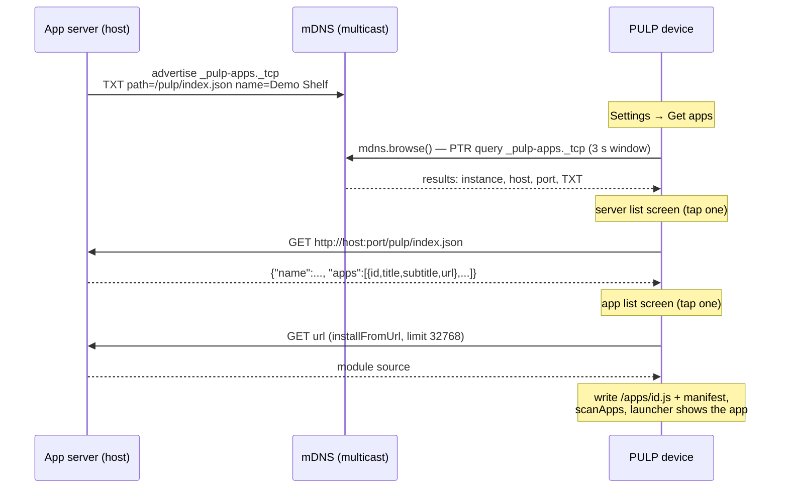

# Intern guide: app-server discovery — mDNS browse, the index contract, and the store screen

## 1. Executive summary

PULP OS can already install apps over HTTP two ways: a host can *push* a module to the device (`curl -T app.js http://pulp.local/apps/upload`), and the device can *pull* a module from a URL typed on the on-screen keyboard (Settings → install from URL, backed by `installFromUrl` in `tools/js/os/20-catalog.js:209`). Both work, and ESP-57 proved the push path at suite scale (12 demos in one script run). But both share the same friction: **a human must know and transcribe a URL**. Typing `http://192.168.0.39:8123/apps/d-widgets.js` on a 42-pixel-key e-ink keyboard is exactly the kind of chore this ticket removes.

This ticket closes the loop with three pieces:

1. **A service-type convention.** Any HTTP server that hosts installable PULP apps advertises itself on the local network as `_pulp-apps._tcp` via mDNS, with a TXT record pointing at its index endpoint. A ~30-line Python script (`zeroconf` library) turns any directory of `.js` files into such a server.
2. **An index contract.** The advertised endpoint (default `/pulp/index.json`) returns one JSON object listing the apps the server offers: id, title, subtitle, and the URL to fetch each module from. The shape deliberately extends the `/apps/list` JSON the device itself already serves (`tools/js/os/00-kernel.js:43`).
3. **A device-side browse verb and a store screen.** A new `mdns.browse(fn)` async native — built on the query half of the `espressif/mdns` component the firmware already ships for advertising — lists discovered servers. A "Get apps" screen in Settings walks: browse → pick server → fetch index (`http.get`, already exists) → pick app → `installFromUrl` (already exists). Every step is a tap; no step is a URL.

The genuinely new firmware surface is small: one async verb following the exact worker-task pattern of `HttpSend` (`main/net_http.cpp:202`), three result accessors following the exact idiom of `wifi.count()/wifi.ssid(i)` (`main/js_wifi.cpp:145`), one new `ModuleId`, and one JS screen. Everything downstream of discovery — fetch, store, manifest, catalog rescan, launcher rebuild — already exists and is hardware-proven from ESP-55/ESP-57.

## 2. Problem statement and scope

### 2.1 The problem

The device's install paths assume the URL problem is solved out-of-band:

- **Push** (`/apps/upload`, `main/net_serve.cpp`): the *host* must know the *device's* address. mDNS solved this direction in ESP-54 — the device advertises `pulp.local`, so `scripts/02-push-demos.sh` works with no IP.
- **Pull** (`installFromUrl`): the *device* must know the *host's* address. Nothing solves this direction. The Settings URL screen (`tools/js/apps/settings.js:216`) is a full QWERTY transcription exercise, and the ESP-55 QR code helps a phone find the device, not the device find a server.

The asymmetry is the gap: the device can be found but cannot find. Meanwhile the mDNS component that could fix it is already linked into the firmware — used only for advertising (`main/net_mdns.cpp` never calls a `mdns_query_*` function).

### 2.2 Scope

In scope:

- `mdns.browse` async native + result accessors (firmware).
- The `_pulp-apps._tcp` + TXT `path=` advertising convention and the index JSON contract (documentation + host script).
- `scripts/`-hosted app-index server for the ticket (serves `tools/js/demos/` and any directory).
- Store screen in Settings ("Get apps"), reusing the design-system idioms from ESP-56.
- The device serving its **own** index at `/pulp/index.json` so one PULP can install from another (cheap: it is a serve route over the catalog, and the device already advertises `_http._tcp`).

Out of scope (recorded in §9): authentication/signing of served apps, HTTPS for index servers, internet-wide (non-mDNS) registries, differential updates, and fixing the ESP-57 `scanApps` regression (tracked there; its fix gates final hardware validation here too).

## 3. The system you are extending

You need five existing mechanisms. Each subsection names the files and the exact behavior you will build on. Nothing in this section is speculative; every claim is line-anchored.

### 3.1 The mDNS layer: advertise-only today

`main/net_mdns.cpp` (125 lines) wraps the managed component `espressif/mdns ~1.2.0` (declared in `main/idf_component.yml:5`; mDNS left the IDF core tree in 5.x). The wrapper exposes exactly three lifecycle calls plus read accessors:

- `MdnsInit()` — lazy `mdns_init()` + `mdns_hostname_set("pulp")`; idempotent; **owner-only** (`AssertOwner()` guards every mutator, because the component's init/add functions are not documented thread-safe).
- `MdnsAnnounce(port)` — adds `_http._tcp`; defers silently when WiFi is down ("a stale record is harmful"); re-announces on port change.
- `MdnsStop()` — removes the service and `mdns_free()`; called from `serve.stop()`, `wifi.off()`, and the power quiesce path so the name never outlives the link.

JS sees this through the read-only `mdns` singleton (`main/js_mdns.cpp`): `mdns.status()`, `mdns.host()`, `mdns.url()`. There are **no async verbs on mdns today** — the header comment says so explicitly ("mDNS has no async verbs"). This ticket adds the first one, which is why §5.4 spends time on where the blocking query may run.

The component's query API (managed_components/espressif__mdns/include/mdns.h) offers two styles:

- `mdns_query_ptr(service_type, proto, timeout_ms, max_results, &results)` — **blocking** for up to `timeout_ms`, returns a linked list of `mdns_result_t` (instance name, hostname, port, resolved addresses, TXT records); caller frees with `mdns_query_results_free`.
- `mdns_query_async_new(...)` + `mdns_query_async_get_results(...)` — non-blocking with a notifier callback or polling.

### 3.2 The async-verb pattern: ModuleId, kDone, and the worker task

Every network verb in PULP OS follows one grammar, defined in `main/app_events.h:40`:

```c
enum class ModuleId : uint8_t {
    Files = 0, Wifi, Http, Serve,
    Images,  // ESP-54 image upload completion
    Apps,    // ESP-55 app upload completion
    Nav,     // ESP-55 P9 page navigation request
    kCount,
};

enum ModuleDoneKind : int32_t {
    kDoneWifiScan = 1, kDoneWifiJoin = 2, kDoneHttp = 3, ...
    kDoneNavRequest = 40,  // ESP-55 P9
};
```

The rules, which your browse verb must obey:

- **One pending callback per ModuleId.** `RegisterModuleCb(ctx, ModuleId::X, fn, &err)` stores at most one JS function; a second registration replaces it. Completion is delivered on the owner task via `PostModuleDone(module, kind, value, err)`, which ends up invoking the JS callback as `fn(kind, value, err)`.
- **Single-flight.** The verb returns `StatusCode::Busy` if an operation is already in flight (see `HttpSend`, `main/net_http.cpp:202`: `if (s_state.in_flight.load(...)) return StatusCode::Busy;`).
- **Blocking work happens on a short-lived worker task, not the owner.** `HttpSend` spawns `http_worker` pinned to core 0 at priority 4 (below the owner's 5) via `xTaskCreatePinnedToCore` (`main/net_http.cpp:220`); the worker fills a response mailbox ("worker writes, owner reads after ModuleDone", `main/net_http.cpp:47`) and posts `PostModuleDone(ModuleId::Http, kDoneHttp, status, len)` (`main/net_http.cpp:146`) as its last act.
- **Owner-tagged delivery.** Since ESP-55 P8 the multi-context runtime tags each `ModuleCb` with its owning context, so a completion arriving after an app switch is dropped instead of delivered to the wrong context.

This pattern is why `mdns.browse` is cheap to add correctly: it is the sixth instance of a shape with five hardware-proven precedents.

### 3.3 Result accessors: the wifi.scan idiom

MicroQuickJS callbacks carry three ints — there is no marshalling of arrays or objects through `PostModuleDone`. Every list-returning verb therefore splits into *completion* (count arrives in the callback) and *accessors* (indexed reads from a C-side snapshot). WiFi scan is the canonical example (`main/js_wifi.cpp:145`):

```js
wifi.scan(function (kind, count, err) {   // kDoneWifiScan
  var i;
  for (i = 0; i < wifi.count(); i++) {
    rows.push(wifi.ssid(i));              // reads C-side snapshot
  }
});
```

The snapshot stays valid until the next scan overwrites it. `mdns.browse` copies this exactly (§5.3): the worker parses `mdns_result_t` into a fixed C array of `{name, host, port, path}` entries, frees the component's list, and JS reads the array by index after the completion fires.

### 3.4 Install machinery: everything after discovery already exists

`tools/js/os/20-catalog.js` provides the entire back half of the store flow:

- `idFromUrl(u)` (`:193`) — derives the app id from the URL's last path segment, enforcing `[a-z0-9_-]{1,24}` (the same charset the upload route enforces in `main/net_serve.cpp`).
- `installFromUrl(url, done)` (`:209`) — `os.netUp` gate → `http.get(url).limit(32768)` → `apps.writeText('/apps/<id>.js', http.body())` → write a default manifest if none exists → `scanApps` → `done(msg)` exactly once with a human-readable outcome. Lives in the OS core precisely "so Settings and test drivers share it" — the store screen is the third sharer.
- `scanApps` → `merge()` — SD manifests override ROM (except `settings`, the recovery app), `hidden` honored, launcher rebuilds via the `appsWatch`/`home()` path.

`JSON.parse` is available and already trusted for exactly this job — manifest parsing uses it (`tools/js/os/20-catalog.js:147`), and the radio app parses HTTP JSON bodies with it (`tools/js/apps/radio.js:51`). Parsing the fetched index is therefore ordinary JS, no native support needed.

### 3.5 The device's own app listing: /apps/list

The OS serves `GET /apps/list` (`tools/js/os/00-kernel.js:43`), hand-building JSON over the catalog:

```json
{"apps":[{"id":"dice","title":"Dice Tray","source":"rom"}, ...]}
```

Two consequences for this ticket. First, the index contract (§5.2) extends this shape rather than inventing a second vocabulary. Second, the device is already an HTTP server with per-app metadata — serving its own installable index is a route registration away (§5.7).

### 3.6 How a native is born (the four-file checklist)

Adding `mdns.browse` + accessors touches a fixed set of places; missing any one is a link error or — worse — a sandbox hole:

1. **Implement** the `extern "C"` functions in `main/js_mdns.cpp` (pattern: `main/js_http.cpp`).
2. **Declare** each with `PULP_JS_FN(...)` in `main/app_js_bindings.h` (mdns block at `:116`).
3. **Register** in the stdlib source of truth `tools/js/pulp_stdlib.c` (the mdns singleton's `JSPropDef` table at `:198`), then rerun `tools/js/gen_pulp_stdlib.sh` — it regenerates **both** `main/js_stdlib.h` and `components/mquickjs/mquickjs_atom.h`, and because bytecode is atom-coupled you must rerun `tools/js/build_bytecode_apps.sh` afterwards (the script's header says exactly this).
4. **Deny in the UI sandbox.** `main/js_stdlib_table_ui.c` builds the browser-page stdlib by `#define`-ing every capability native to `js_ui_denied` before including the table. Every new native must be added to the deny list unless pages are explicitly allowed to use it. Browse is a capability (it probes the network) — pages must not get it. This is the standing maintenance rule from ESP-55 P9; forgetting it is a silent sandbox escape, which is why it appears in this list and again in the phase plan and §8.

## 4. Gap analysis

| Needed for zero-typing install | Exists? | Where / what is missing |
|---|---|---|
| Device advertises itself | Yes | `MdnsAnnounce`, `_http._tcp`, ESP-54 |
| Device browses the network | **No** | No `mdns_query_*` call anywhere in `main/`; no ModuleId slot; no JS verb |
| Server-side advertising convention | **No** | No service type, no TXT vocabulary; ESP-55's page server (`scripts/08-pulp-page-server.py`) and ESP-57's push script assume known addresses |
| Machine-readable "what can I install from you" | **Partial** | `/apps/list` exists on-device (installed apps, no URLs); nothing defined for host servers |
| Fetch a module by URL | Yes | `http.get` builder, 32 KiB limit path proven |
| Store module + manifest + rescan | Yes | `installFromUrl`, `scanApps`, `appsWatch` |
| Pick-from-list UI idioms | Yes | ESP-56 design system: `os.body/menuRow/button/label` |
| URL entry as fallback | Yes | Settings URL screen (keep it; discovery must not remove the manual path) |

The whole ticket is the three **No** rows plus the UI to connect them.

## 5. Design

### 5.1 The wire story in one diagram



Three network round-trips, all initiated by taps. The only typing anywhere is on the host, once, to start the server script.

### 5.2 Decision R-SVCTYPE: a dedicated service type with a TXT path

- **Context.** The device must find app servers among everything else answering mDNS on a home network.
- **Options.** (a) Browse `_http._tcp` and probe each result for an index — simple convention, but a busy network yields printers and NAS boxes, and probing each with the single-flight `http` slot is slow and rude. (b) A dedicated `_pulp-apps._tcp` type — only intentional servers answer; the PTR query result set *is* the server list. (c) DNS-SD subtypes of `_http._tcp` — standards-pretty, but the espressif component's subtype query support is not worth the added moving part for a LAN-local convention we own.
- **Decision.** `_pulp-apps._tcp`, TXT records `path=<index path>` (default `/pulp/index.json`) and `name=<human label>`. Unknown TXT keys are ignored; a missing `path` means the default.
- **Consequences.** Zero-noise browse results; the host script must advertise (the `zeroconf` Python package makes this ~10 lines); the device's own `_http._tcp` announcement is untouched — when §5.7 lands, the device additionally announces `_pulp-apps._tcp` itself.
- **Status.** Proposed.

### 5.3 Decision R-BROWSEAPI: one verb, count/field accessors, snapshot semantics

- **Context.** JS needs the browse results; completions carry only ints (§3.3).
- **Options.** (a) Return a JSON string from a synchronous native — blocks the owner for the query window; rejected outright (3 s of frozen UI and watchdog risk). (b) Async verb + JSON-string accessor — one accessor, but hand-building JSON in C for variable TXT data is the exact string-escaping bug class the upload-manifest route already fought in ESP-57. (c) Async verb + indexed field accessors, the `wifi.scan` idiom.
- **Decision.** Option (c):

```js
// JS surface (additions to the mdns singleton)
mdns.browse(fn)        // rc int; fn(kDoneMdnsBrowse=50, count, err)
mdns.count()           // servers found in the last completed browse
mdns.name(i)           // human label: TXT name, else mDNS instance name
mdns.indexUrl(i)       // "http://<host or ip>:<port><path>" — ready for http.get
```

`indexUrl` does the assembly in C (host vs. resolved IPv4, default port elision, TXT `path` default) so JS never string-builds a URL from parts it cannot validate. The snapshot is a fixed array — `kMdnsMaxResults = 8`, each entry `name[32] + url[96]` ≈ 1 KiB static, matching the fixed-buffer discipline used everywhere else in the firmware.
- **Consequences.** Two small accessors instead of one clever one; a re-browse invalidates prior indices (documented; same caveat as `wifi.ssid(i)`).
- **Status.** Proposed.

### 5.4 Decision R-BROWSEEXEC: blocking query on a throwaway worker task

- **Context.** `mdns_query_ptr` blocks up to its timeout; the owner task must never block (UI + event pump live there).
- **Options.** (a) `mdns_query_async_new` polled from the owner tick — no extra task, but adds a poll obligation to the owner loop and a second completion style unlike every other verb. (b) Blocking `mdns_query_ptr(3000 ms)` on a short-lived worker task that posts `ModuleDone` and exits — byte-for-byte the `HttpWorker` shape (`main/net_http.cpp:220`): same core, same priority 4, same in-flight atomic, same mailbox discipline.
- **Decision.** Option (b). New `ModuleId::Mdns` (append before `kCount`; the enum backs an array of that size, so append-only) and `kDoneMdnsBrowse = 50` continuing the decade-spaced numbering (`kDoneNavRequest = 40`).
- **Consequences.** ~1.5 KiB worker stack for 3 s per browse; single-flight means a second `browse()` during the window returns Busy, which the store screen surfaces as "already looking". The component's own lifecycle guard: browse must check `MdnsInit()` succeeded and WiFi is up (`WifiStatus() != kWifiUp` → complete immediately with `err=1, count=0` rather than multicast into the void — mirrors `MdnsAnnounce`'s deferral logic).
- **Status.** Proposed.

### 5.5 The index contract

`GET <path from TXT>` (default `/pulp/index.json`) returns:

```json
{
  "v": 1,
  "name": "Demo Shelf",
  "apps": [
    {"id": "d-widgets", "title": "Type and Widgets",
     "subtitle": "faces rules buttons", "url": "http://192.168.0.39:8123/apps/d-widgets.js"},
    {"id": "d-canvas", "title": "Canvas", "subtitle": "ink primitives",
     "url": "http://192.168.0.39:8123/apps/d-canvas.js"}
  ]
}
```

Rules, each earned by an ESP-55/57 scar:

- `id` obeys `[a-z0-9_-]{1,24}` — the charset `idFromUrl` and the upload route both enforce; the store screen passes `url` to `installFromUrl`, whose derived id must match `id` (the screen warns on mismatch rather than trusting either side alone).
- `title`/`subtitle` are plain ASCII, no `&<>"` — the ESP-57 encoding lesson, promoted from script comment to contract.
- `url` is **absolute**. Relative would be friendlier to servers behind port-forwards, but absolute keeps the device's URL assembly at zero and the index self-describing; a `v:2` may relax this.
- The whole body must fit the fetch limit: the store screen fetches with `.limit(8192)`, bounding an index at roughly 60 apps — far above the launcher's practical ceiling, and the `v` field exists so pagination can arrive without breaking old devices.
- Extra keys are ignored (forward compatibility).

The shape is `/apps/list` plus `subtitle` and `url` — same `apps` array key, same `id`/`title` names — so a future "device serves its own index" (§5.7) is a projection of data it already serializes.

### 5.6 The store screen

A new screen inside Settings (`tools/js/apps/settings.js`), reachable from a "get apps" row; the existing URL screen stays as the manual fallback. Three states, all built from ESP-56 idioms (`os.body`, `os.label`, `os.menuRow`, `os.button`):

```
[GET APPS]                      // os.label — lg grotesque, screen identity
find servers                    // primary button → mdns.browse
  "looking..." → count or "none found — is a server running?"
<server rows: name(i)>          // tap → fetch indexUrl(i) (.limit(8192))
[DEMO SHELF]                    // index name
<app rows: title — subtitle>    // tap → installFromUrl(url, toast)
  installed rows say "installed" and re-tap runs the app (os.launch)
back                            // standard chrome
```

Pseudocode for the middle transition, showing where each existing piece slots in:

```js
function pickServer(i) {
  a.serverName = mdns.name(i);
  var rc = http.get(mdns.indexUrl(i)).limit(8192).done(function (k, st, len) {
    if (st !== 200) { toast('index http ' + st); return; }
    var idx = null;
    try { idx = JSON.parse(http.body()); } catch (e) { idx = null; }
    if (!idx || !idx.apps) { toast('bad index'); return; }
    a.idx = idx; a.screen = 'store-apps'; render();
  }).send();
  if (rc !== 0) { toast('http busy'); }
}
```

Install marks: the screen cross-references `catalog()` by id so already-installed apps read as such — the store doubles as an update path (`installFromUrl` overwrites the module; manifests keep their no-clobber-except-metadata rule from ESP-57).

### 5.7 The device as a server, and the scripts

- **Host script** `scripts/01-app-index-server.py`: serves a directory of `.js` files, generates the index from the files (title/subtitle from an optional sidecar JSON or the filename), advertises via `zeroconf`. Replaces nothing — `02-push-demos.sh` (ESP-57) stays for push; this is the pull twin.
- **Device index route**: `serve.get('/pulp/index.json')` registered in `osRoutes` (`tools/js/os/00-kernel.js`), projecting the catalog with `url: 'http://<mdns.url or ip>/apps/read?id=...'` — plus announcing `_pulp-apps._tcp` alongside `_http._tcp` in `MdnsAnnounce`. This makes any two PULPs on one network able to copy apps from each other with four taps. It is last in the phase order because it is delight, not necessity.

## 6. Implementation plan

Phases are ordered so each lands independently testable; hardware gates use the ESP-55 hold-open console client (`04-papers3-console-hold.py`) and the ESP-56 shot pipeline.

**P1 — native browse verb.** `main/app_events.h` (ModuleId::Mdns, kDoneMdnsBrowse=50); `main/net_mdns.{h,cpp}` (`MdnsBrowse()`, worker task, result snapshot, `MdnsResultCount/Name/IndexUrl`); `main/js_mdns.cpp` (four natives); `main/app_js_bindings.h`; `tools/js/pulp_stdlib.c`; regen stdlib + atoms + bytecode; **deny all four in `main/js_stdlib_table_ui.c`**. Gate: from the console driver, `js mdns.browse(...)` against the P3 script finds it; browse with WiFi down completes `err=1` immediately; second browse during window returns Busy.

**P2 — store screen.** `tools/js/apps/settings.js` (three store states + get-apps row), `installFromUrl` unchanged. Gate: full tap path on hardware with shots into `sources/shots/`.

**P3 — host server script.** `scripts/01-app-index-server.py` (http.server + zeroconf, index generation, plain-ASCII validation of titles at startup — fail fast on the ESP-57 encoding trap). Gate: `avahi-browse -r _pulp-apps._tcp` sees it; `curl` returns a valid index; device installs `d-widgets` from it end-to-end.

**P4 — device-serves-device.** `00-kernel.js` route + `_pulp-apps._tcp` announce + `/apps/read` (or embed source via existing files read route). Gate: two-device test, or single-device loopback curl of its own index.

**P5 — validation + docs.** §7/§8 of this guide gain evidence; diary; playbook update for the discovery workflow; reMarkable re-upload. Blocked-by note: final on-hardware walk shares the ESP-57 gate (scanApps regression fix + USB return).

## 7. Testing and validation strategy

- **Host-first:** the index server is plain Python — unit-test index generation and TXT encoding on the host; `python3 -m http.server` semantics need no device.
- **Contract tests without radio:** `idFromUrl`-vs-index-`id` mismatch handling and index JSON edge cases (missing path key, oversize body, non-JSON) run in the host eval harness (`scripts/02-host-eval-harness.sh` from ESP-55) — they are pure JS.
- **Console-driven browse:** `mdns.browse` is testable before any UI exists via the `js` console op with the hold-open client; error paths (wifi down, busy, zero results) are all reachable by ordering commands.
- **On-panel walk:** shot pipeline captures of the three store states; the walk script forces home first (`js pulp`) per the ESP-55 409 rule.
- **Soak angle:** browse repeatedly across app switches (the ESP-55 soak driver pattern) to prove the ModuleCb owner-tagging drops completions that outlive their context.

## 8. Risks, alternatives, open questions

- **Sandbox regression risk (highest).** Four new natives; each missing from the UI deny table is a page capability leak. Mitigation: the P1 checklist and a grep gate in review (`rg js_mdns_ main/js_stdlib_table_ui.c` must show four hits).
- **mDNS query vs. announce interplay.** `mdns_query_ptr` and the announce lifecycle share component state; browse during `serve.stop()`'s `MdnsStop()` window must fail cleanly (Busy), not crash — the in-flight atomic must gate `MdnsStop` too (stop while browsing: defer free until worker exit, or refuse stop with Busy; decide in P1, record in diary).
- **Multicast reality.** Some APs filter multicast between wireless clients ("AP isolation"); browse then finds nothing while direct HTTP works. The store screen's empty-state copy points at the manual URL fallback for exactly this.
- **Single http slot.** Index fetch and install share the one `http` builder; the screen must serialize (fetch → then install taps), and a `Busy` toast covers races. A second http slot is out of scope.
- **Open:** should `installFromUrl` grow an optional metadata argument so the store passes title/subtitle from the index into the manifest (today a URL-install manifest says "installed from url")? Cheap, touches the shared core — decide at P2 with the screen in hand.
- **Open:** TXT `abi=` key so servers can advertise the ABI they target and the store can warn before fetch (the descriptor's `abi:2` check currently fires only at launch).

## 9. References

- `main/net_mdns.{h,cpp}` — advertise lifecycle, owner contract; the file browse extends.
- `main/js_mdns.cpp`, `main/app_js_bindings.h:116`, `tools/js/pulp_stdlib.c:198` — the mdns singleton's three registration points.
- `main/net_http.cpp:202,220,146` — HttpSend single-flight, worker spawn, ModuleDone post: the pattern to copy.
- `main/app_events.h:40` — ModuleId and ModuleDoneKind enums to extend.
- `main/js_wifi.cpp:145` — count/indexed-accessor idiom.
- `main/js_stdlib_table_ui.c` — UI sandbox deny table (must grow four entries).
- `tools/js/os/20-catalog.js:193,209` — idFromUrl, installFromUrl (the store's back half).
- `tools/js/os/00-kernel.js:43` — /apps/list route (index contract ancestor; P4 route home).
- `tools/js/apps/settings.js:216` — URL screen (fallback path; store screens live beside it).
- `tools/js/gen_pulp_stdlib.sh` — stdlib/atom regen + bytecode-recoupling warning.
- `managed_components/espressif__mdns/include/mdns.h` — `mdns_query_ptr` (:680), async query family (:577–:634).
- ESP-55 ticket (app loader: push/pull/QR, worker patterns, soak driver); ESP-56 (design idioms); ESP-57 (encoding trap, manifest rules, files.list cap history).
