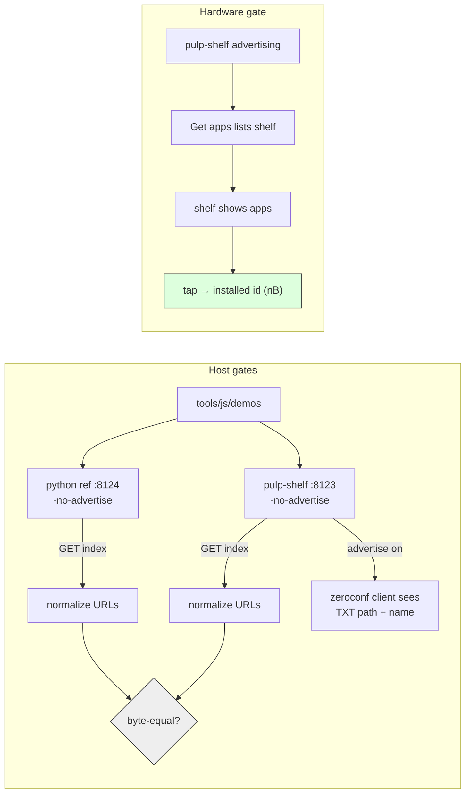

# Intern guide: pulp-shelf in Go — the shelf contract, the mDNS layer, and byte-level parity with the Python reference

## 1. Executive summary

ESP-58 gave PULP OS network app discovery: the device browses `_pulp-apps._tcp` over mDNS, fetches a JSON index from each server it finds, and installs apps with taps. The first server implementation was a Python script (`zeroconf` + `http.server`), written as a ticket artifact and validated end-to-end against hardware. This ticket produces the production form: **`pulp-shelf`, a single static Go binary** living at `0114-papers3-pulp-os/shelf/`, implementing the identical wire contract — same service type, same TXT vocabulary, same index JSON, same URL shapes, same validation rules. The Python script stays where it is, untouched, as the executable reference: when the two disagree, the contract section of the ESP-58 guide arbitrates, and a parity gate in this ticket makes disagreement visible mechanically.

The Go version is not a feature rewrite. It adds exactly the things a `go build` artifact buys — no interpreter or pip dependency on the host, a `-listen` you can hand to systemd, graceful mDNS goodbye packets on shutdown — and changes nothing the device can observe. An intern who reads §3 (the contract and its consumer) and §4 (the design) should be able to re-implement the binary from this document without reading the Python.

## 2. Problem statement and scope

### 2.1 Why a Go version

- The Python script needs `python3` + the `zeroconf` package on every host that wants to be a shelf; the Go binary needs nothing (`CGO_ENABLED=0`, pure stdlib + one vendored-by-module mDNS library).
- The go-go-golems toolbox is Go; a shelf that might grow registry features (versioning, signing, upload) should start in the language the rest of the tooling lives in.
- This repo already hosts standalone Go servers next to firmware projects (`mled-server/`, `0074-m5dial-web-remote/server/`) — the layout is established.

### 2.2 Scope

In scope: the binary (serve + advertise + index generation + sidecar metadata + fail-fast validation), a parity harness against the Python reference, and hardware validation (the device's store screen must list and install from the Go shelf exactly as it did from the Python one).

Out of scope (inherited from ESP-58 §2.2): authentication/signing, HTTPS, non-mDNS registries, index pagination beyond the `v` field. The Python script is NOT deprecated or modified — it remains the small, dependency-light reference and the second data point for parity tests.

## 3. The system you are joining

### 3.1 The wire contract (what the device depends on)

The authoritative statement is the ESP-58 guide §5; this is the operational summary. A shelf is any HTTP server that:

1. **Advertises** `_pulp-apps._tcp` on the local network, with TXT records:
   - `path=<index path>` — default `/pulp/index.json`; a missing key means the default.
   - `name=<human label>` — optional; shown in the device's server list. Without it the device falls back to the mDNS instance name.
2. **Serves the index** at that path:

```json
{"v": 1, "name": "Demo Shelf",
 "apps": [{"id": "d-widgets", "title": "Type and Widgets",
           "subtitle": "faces rules buttons",
           "url": "http://192.168.0.39:8123/apps/d-widgets.js"}]}
```

3. **Serves each module** at its advertised absolute `url`.

Rules the device enforces or assumes — every one earned by an ESP-55/57 incident, so treat them as law, not style:

- `id` matches `[a-z0-9_-]{1,24}`. The device's `idFromUrl` derives the id from the URL's last path segment and the store screen renders any id/URL mismatch inert — so the module URL must end `/<id>.js`.
- `title` and `subtitle` are plain ASCII with none of `&<>"`. The device-side manifest path never urldecodes and hand-builds JSON; a `&` once truncated its own title on the wire (ESP-57).
- `url` is absolute. The device performs zero URL assembly on index entries.
- The whole index body must fit the device's 8 KiB fetch cap; the fetched module must fit 32 KiB.
- Unknown JSON keys are ignored by the device; `"v": 1` is fixed until a paging revision.

### 3.2 The consumer (what happens on the device)

For debugging a shelf, you need the device-side sequence, all built in ESP-58 (`d8c13f2f`, `6e1b6acb`):

```
mdns.browse(fn)                      # 3 s PTR query on a worker task
  -> fn(50, count, err)              # err 1 = wifi down, 2 = query failed
mdns.name(i), mdns.indexUrl(i)       # C-assembled: IPv4 preferred over
                                     #   hostname.local; TXT path applied;
                                     #   :80 elided
http.get(indexUrl).limit(8192)       # store screen fetches + JSON.parse
installFromUrl(app.url, done)        # 32 KiB cap, writes /apps/<id>.js
                                     #   + manifest, rescans catalog
```

Two behaviors that look like bugs but are not: the device never lists **itself** (the espressif mDNS responder ignores its own answers), and a shelf on a network with AP client isolation is simply invisible (multicast filtered) — the store's empty state points users at manual URL entry for that case.

### 3.3 The Python reference, anatomically

`ttmp/.../ESP-58-PULP-APP-DISCOVERY/scripts/01-app-index-server.py` (~180 lines). Its five decisions ARE the behavioral spec for the Go port:

1. **Index built per request** by scanning `--dir` for `*.js` — drop a file in, it appears on the next fetch. No caching, no watchers.
2. **Sidecar metadata**: `<id>.json` next to `<id>.js` may carry `{"title","subtitle"}`; a missing or unparseable sidecar degrades to `title = id`, `subtitle = ""` (with a stderr note), never to a hard failure.
3. **Fail-fast validation at startup — but only for metadata**: a title/subtitle that is not plain ASCII kills the server with a message naming the file, BEFORE anything is advertised (bad metadata must die on the host, not become a manifest on a device). A filename whose id does not match the charset is merely skipped with a warning, in both implementations: a non-conforming filename is "not an app module," while a bad sidecar is a mistake someone made on purpose. (The Go port initially made bad ids fatal too; the parity gate caught the divergence — see the diary.)
4. **Base URL from the outbound interface**: the UDP-connect trick (`connect()` to a TEST-NET address; the kernel picks the source IP; no packet is sent). `http://<that-ip>:<port>` is what goes into every `url`.
5. **Single-interface mDNS bind**: registering on all interfaces exhausted `igmp_max_memberships` on a host with many virtual interfaces (`OSError: ENOBUFS`). The zeroconf handle binds only the outbound IP.

Known host quirk (diary, ESP-58 step 2): `avahi-browse` on the dev host sees NO `_pulp-apps` records — not even the device's — while a python-zeroconf client sees all of them. Never use avahi as a gate; use the zeroconf snippet from the ESP-58 diary or the device itself.

### 3.4 Where Go modules live in this repo

Standalone Go servers sit as self-contained modules beside the firmware they serve: `mled-server/go.mod` (`module mled-server`), `0074-m5dial-web-remote/server/go.mod`. Project-scoped servers nest under the project directory. `pulp-shelf` follows that: `0114-papers3-pulp-os/shelf/` with its own `go.mod` — it is not part of any workspace, builds with a bare `go build`, and never touches the ESP-IDF build.

## 4. Design

### 4.1 Decision R-GOMDNS: which mDNS library

- **Context.** Go's stdlib has no mDNS. The binary must *register* a service with TXT records on a chosen interface; browsing is not required.
- **Options.** (a) `github.com/grandcat/zeroconf` — the classic, API fits exactly, but unmaintained with a 2019-era `x/net` pin. (b) `github.com/libp2p/zeroconf/v2` — the maintained fork of (a), same `Register(instance, service, domain, port, txt, ifaces)` surface, kept alive by the libp2p project. (c) `github.com/hashicorp/mdns` — maintained but server API is lower-level (you construct the `MDNSService` yourself) and TXT handling is clumsier. (d) Hand-rolled responder on `golang.org/x/net/ipv4` — full control, ~500 lines of protocol code this ticket does not need.
- **Decision.** (b) `libp2p/zeroconf/v2`. Same one-call ergonomics the Python version enjoys, maintained, and both candidate imports were verified fetchable from this host before committing to the design.
- **Consequences.** One third-party dependency tree (`x/net`, `x/sys`, `miekg/dns`). `Register` handles the goodbye packet on `Shutdown()`, which the Python version also does via `unregister_service` — shutdown behavior stays symmetric.
- **Status.** Accepted.

### 4.2 CLI surface: flag-for-flag parity

```
pulp-shelf -dir <modules> [-port 8123] [-name "App Shelf"]
           [-index-path /pulp/index.json] [-no-advertise]
```

Same five knobs, same defaults, same meanings as the Python script (Go's flag package uses single-dash; both `-dir` and `--dir` parse). No new flags in v1 — parity first, features later. `-no-advertise` exists for the same reason it does in Python: contract tests over plain HTTP with no multicast involved.

### 4.3 Behavior parity table

| Behavior | Python reference | Go binary |
|---|---|---|
| Index freshness | rescan per request | same |
| Sidecar errors | stderr note, fall back to id | same |
| Startup validation | exit non-zero, name the file | same |
| Base URL | UDP-connect trick | same (`net.Dial("udp", "192.0.2.1:9")`) |
| mDNS bind | outbound interface only | same (resolve IP → `net.Interface`) |
| Module route | `^/apps/([a-z0-9_-]{1,24})\.js$` | same regexp |
| Everything else | 404 | same |
| Shutdown | unregister then exit | `Shutdown()` on SIGINT/SIGTERM, then `http.Server.Shutdown` |
| Request log | one line per request | same shape |

One deliberate difference: Go serves via `http.Server` with a context-based graceful shutdown instead of Python's `ThreadingHTTPServer` + KeyboardInterrupt. Observable behavior (a goodbye packet, then the socket closes) is identical.

### 4.4 Program shape

```go
main()
 ├─ parse flags; abs(dir)
 ├─ ip := outboundIP()                     // UDP-connect trick
 ├─ idx := buildIndex(dir, name, baseURL)  // fail-fast: any invalid
 │                                         // id/title/subtitle → exit 1
 ├─ mux: GET <indexPath> → json(buildIndex(...))   // fresh scan
 │       GET /apps/{id}.js → file bytes (regexp-gated)
 ├─ if !noAdvertise:
 │     zeroconf.Register(name, "_pulp-apps._tcp", "local.",
 │                       port, ["path=...", "name=..."], [iface(ip)])
 ├─ go srv.ListenAndServe()
 └─ wait SIGINT/SIGTERM → mdns.Shutdown() → srv.Shutdown(ctx)
```

`buildIndex` is the contract's core and stays a pure function of `(dir, name, baseURL)`:

```go
type App struct {
    ID       string `json:"id"`
    Title    string `json:"title"`
    Subtitle string `json:"subtitle"`
    URL      string `json:"url"`
}
type Index struct {
    V    int    `json:"v"`
    Name string `json:"name"`
    Apps []App  `json:"apps"`
}
```

Field order in the struct matches the Python `dict` insertion order, so `encoding/json` emits keys in the same sequence — which is what makes the parity gate (§5) a plain byte comparison after URL normalization.

### 4.5 What the Go version must NOT do

- No caching or fs-watching: the per-request rescan is a contract behavior (drop-in freshness), not an inefficiency.
- No urlencoding or HTML entities in titles: the validation rejects what the device cannot digest; do not "helpfully" escape instead.
- No serving of files outside the `{id}.js` shape — the regexp is the whole access-control story, exactly as `/appsrc/` on the device makes traversal inexpressible rather than filtered.

## 5. Testing and validation strategy



1. **Parity gate (host, no radio).** Run both servers over the same directory with `-no-advertise` on distinct ports; fetch both indexes; rewrite `host:port` in every `url` to a fixed token; require byte-equal JSON after normalization through `json.Marshal`/`json.dumps(sort_keys=False)`. Then fetch the same module from both and require byte-equal bodies.
2. **Validation gate.** A directory with a bad id (`D-Widgets.js`) and a bad sidecar title (`Type & Widgets`) must make both servers refuse to start, naming the file.
3. **mDNS gate (host).** The zeroconf client snippet from the ESP-58 diary must list the Go shelf with its TXT `path`/`name`. (avahi-browse is explicitly not a gate — §3.3.)
4. **Hardware gate.** On the PaperS3: Settings → Get apps must list the Go shelf by name; opening it must show the directory's apps; tapping one must toast `installed <id> (<n>B)`. This is the same walk that validated ESP-58 P2, pointed at the new binary.

## 6. Risks, alternatives, open questions

- **Library rot.** `libp2p/zeroconf/v2`'s upstream activity is modest; the mitigation is that the API surface used is one function plus `Shutdown`, so swapping to `hashicorp/mdns` later is an afternoon, and the parity+hardware gates define "works" independently of the library.
- **Interface selection on multi-homed hosts.** The outbound-IP trick picks the default-route interface; a host that should shelf on a different network needs a `-iface`/`-ip` flag — deferred until someone actually has that host.
- **Open:** should `pulp-shelf` eventually absorb the push direction too (`curl -T` proxying to `pulp.local/apps/upload`), making it the one host-side tool? Out of scope here; belongs to a registry-features ticket.

## 7. References

| Topic | File |
|---|---|
| Wire contract (authoritative) | ESP-58 guide §5, ticket `ESP-58-PULP-APP-DISCOVERY/design-doc/01-…` |
| Python reference implementation | `ESP-58-PULP-APP-DISCOVERY/scripts/01-app-index-server.py` |
| Device browse verb | `0114-papers3-pulp-os/main/net_mdns.cpp` (BrowseWorker), `main/js_mdns.cpp` |
| Device store screens | `0114-papers3-pulp-os/tools/js/apps/settings.js` (storeScreen/storeAppsScreen) |
| Device install path | `0114-papers3-pulp-os/tools/js/os/20-catalog.js` (idFromUrl, installFromUrl) |
| Go module precedents | `mled-server/`, `0074-m5dial-web-remote/server/` |
| Go binary (this ticket) | `0114-papers3-pulp-os/shelf/` (`go.mod`, `main.go`) |
| zeroconf client gate snippet | ESP-58 diary step 2 |
