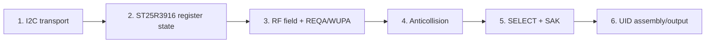

# Fresh Base-Principles Reconstruction of the ESP-IDF ST25R3916 Failure

## 1. Purpose and reset of assumptions

This document restarts the investigation from externally observable behavior. Previous work proved several useful facts, but one strong explanation — that a preventive I2C command-FSM reset would eliminate the NACKs — was tested and refuted. That negative result is retained as evidence, not used as a premise.

The goal is not to make an error counter look better. The goal is for native ESP-IDF firmware to print at least one valid ISO14443-A UID from the four tags currently resting on the StackChan antenna, while preserving enough diagnostics to distinguish a transport defect from a legal multi-tag collision.

No layer may be skipped. A UID appears only when all of these layers work:



A failure at one layer must not be named after a different layer. In particular:

- `ESP_ERR_INVALID_STATE` from `i2c_master_transmit_receive` is a confirmed I2C NACK.
- `ESP_ERR_INVALID_STATE` returned by `nfca_anticoll_select` when `ST25R_IRQ_COL` is set is an RF collision in the current application logic.
- Four tags simultaneously on the antenna are expected to collide during the first anticollision round.
- The current standalone ESP-IDF implementation explicitly says "Phase-1 single-tag assumption" and aborts when it sees that collision. Therefore a four-tag run can prove RF reception while still producing no UID by design.

## 2. Current known facts (kept, but not overinterpreted)

### 2.1 Hardware and placement

- The ST25R3916 responds at I2C address `0x50`.
- Identity is type `0x05`, revision `0x02`.
- The antenna is the narrow top edge of the StackChan head.
- Official Arduino firmware reads real UIDs there.
- Four tags are currently present on the antenna.

### 2.2 I2C transport

- ESP-IDF intermittently receives `I2C_EVENT_NACK`; the public API returns `ESP_ERR_INVALID_STATE`.
- These are NACK events, not timeouts (driver DEBUG evidence; zero timeout log lines).
- M5GFX reports zero logical failures over 10,187 traced ST25R3916 transactions.
- A bare unconditional `fsm_rst` patch made the ESP-IDF failure rate worse and was reverted.
- The reverted board currently runs the standalone `0115` ESP-IDF debug build.

### 2.3 NFC protocol implementation

The current ESP-IDF code can only resolve a single tag:

```c
if (irq & ST25R_IRQ_COL) {
    /* Phase-1 single-tag assumption: a collision means two+ tags; report it. */
    return ESP_ERR_INVALID_STATE;
}
```

The Arduino control uses M5Unit-NFC's full anticollision/detection layer and can retain multiple PICCs. It is therefore not valid to compare "Arduino found four tags" against "ESP-IDF returned collision" as if both implemented the same protocol algorithm.

## 3. Observation ladder

Each experiment must answer one narrow question and record the exact evidence.

### Layer 1 — transport

Question: can the host perform the register/direct-command transactions needed by one read attempt without a NACK?

Evidence:

- trace count and transport-failure count;
- first failed logical/wire key;
- driver DEBUG event class;
- whether a retry succeeds immediately.

Pass condition for protocol debugging: either zero transport failures in the attempt or an explicit attempt result that says "protocol evidence observed despite N transport failures." Transport failures must never be silently converted to no-tag.

### Layer 2 — chip state

Question: after initialization, are the exact critical registers equal to the measured Arduino state?

Minimum matrix:

```text
MODE=09 RX1=08 RX2=2D RX3=D8 RX4=22
ANT1=82 ANT2=82 TXD=D0
NRT=0350 for a 4 ms request (depending on timer-step configuration)
Space-B OS=40/03 US=40/03 CORR=47/00 EMD=40
```

Pass condition: successful reads and exact values immediately before RF request.

### Layer 3 — RF request/response

Question: with four tags present, does REQA or WUPA produce RF evidence?

Evidence, in increasing strength:

1. `RXS` IRQ — receiver saw start-of-frame.
2. `COL` IRQ — at least two tag responses overlap; this is positive evidence that tags and RF field are active.
3. `RXE` IRQ + FIFO bytes — a complete response frame.
4. ATQA bytes — complete request response.

With four tags, `COL` is not a failure of the RF layer. It is the expected input to Layer 4.

### Layer 4 — anticollision

Question: can the firmware resolve one UID bit path when multiple tags collide?

ISO14443-A anticollision uses `SEL` (`0x93`, `0x95`, `0x97`) and NVB to request progressively more known UID bits. On collision, read the collision position, choose a branch bit, and retransmit with a longer NVB. The current ESP-IDF implementation does none of this; it requests the full cascade-level UID once (`NVB=0x20`) and aborts on collision.

Pseudocode:

```text
known_bits = empty
while known_bits < 40:
    send SEL + NVB(known_bits) + known_prefix
    wait for RXE or COL
    if COL:
        p = collision_bit_position
        copy valid received bits before p
        append chosen branch bit (0 or 1)
        continue
    if RXE:
        append remaining UID+BCC bits
        validate BCC
        break
```

Pass condition: one 5-byte cascade-level result (four UID bytes/cascade tag + BCC) with valid BCC.

### Layer 5 — selection

Question: can the resolved cascade-level UID be selected with `NVB=0x70`, and does the chip receive SAK + CRC?

Pass condition: valid SAK frame; continue to CL2/CL3 when the cascade bit (`SAK & 0x04`) is set.

### Layer 6 — UID output

Question: does the assembled 4-, 7-, or 10-byte UID match a UID already observed by Arduino?

Pass condition: print UID/ATQA/SAK and retain transport counters separately.

## 4. First experiment: observe the four-tag RF result before changing code

The connected hardware is valuable because four tags create a deterministic protocol condition. Run the reverted baseline firmware and collect:

```text
nfc-trace clear
nfc-i2c-debug off
nfc-read --attempts 1
nfc-trace status
nfc-trace first-error
```

Interpretation matrix:

| Observation | Meaning |
|---|---|
| no RXS/RXE/COL, FIFO=0 | RF request not producing a visible response; inspect field/config/request timing |
| COL=1 | RF field and multiple tag responses confirmed; implement collision resolution |
| RXE=1, FIFO=2, ATQA | request layer works; proceed to anticollision |
| transport NACK before direct command `0xC6/0xC7` | request was not transmitted; protocol conclusion invalid |
| NACK only during IRQ polling but later COL/RXE | transport unstable, but RF evidence still usable; report both |

## 5. Fresh hypotheses (ordered by layer, not confidence)

### H1 — current four-tag failure is legal RF collision

The code explicitly aborts on `ST25R_IRQ_COL`; with four tags on the antenna, this is expected. If the first experiment sees COL, the immediate implementation task is ISO14443-A collision resolution, not more I2C backend theory.

### H2 — request timing/configuration prevents any RF response

If no RXS/COL/RXE occurs, compare the exact request sequence against M5Unit-NFC: field sequencing, NRT timer, interrupt masks/clears, auxiliary `no_crc_rx`, antcl bit, and direct command completion.

### H3 — I2C NACK prevents the request from being sent

If the first transport failure precedes `DIRECT 0xC6/0xC7`, the RF layer was never exercised. The attempt must be retried observably or the transport backend must change.

### H4 — RF request succeeds but selection implementation is wrong

If ATQA is read but no UID appears with one tag, compare anticollision frame length, TX byte count encoding, CRC mode, FIFO bytes, BCC, SELECT frame, and SAK/CRC handling.

### H5 — transport backend framing differs from M5GFX

The bare FSM reset is refuted. Remaining host differences include explicit command programming, final-read NACK/STOP handling, bus-idle wait, pin routing/mode reinit, and timeout programming. Defined operations can isolate framing without copying M5GFX wholesale.

## 6. Rules for this investigation

- Do not make a transport conclusion from an RF collision.
- Do not make an RF conclusion if the request command was never transmitted.
- Do not hide the first NACK behind eventual success.
- Do not add broad retries until a one-attempt trace identifies the failing layer.
- Commit at evidence boundaries: analysis baseline, instrumentation/behavior change, hardware result, diary.
- Keep the board in a documented firmware state after every flash.

## 7. Immediate plan

1. Capture one four-tag read on the reverted baseline.
2. Identify the last successful direct command and RF IRQ/FIFO result.
3. Compare the exact M5Unit-NFC request and anticollision implementation to the current driver at source level.
4. If COL is present, implement bounded anticollision for one UID branch, then SELECT and print one UID.
5. If no RF evidence, fix the request layer before anticollision.
6. If a NACK prevents request transmission, test explicit defined operations for just the failing transaction class.

## 8. Active evidence log

### 8.1 Four-tag baseline: RF receive disabled by application code

Capture: `sources/hardware/10-four-tag-layered-baseline.txt`.

- `OPC=0x8B`: oscillator, TX, and external field detector enabled; `RX_EN=0`.
- REQA and WUPA produced no `RXS`, `RXE`, or `COL`; FIFO stayed empty.
- The request direct commands (`0xC6`/`0xC7`) were reached; three transient polling NACKs recovered immediately.

A fresh source comparison found that our `st25r3916_field_on()` cleared `TX_EN|RX_EN` after the 5 ms field-on guard. M5Unit-NFC's `nfc_initial_field_on()` does the opposite: `modify_bit_register8(OPERATION_CONTROL, tx_en | rx_en, 0x00)` sets both bits. The local comment claiming M5 clears them was wrong.

### 8.2 Field-enable correction: four-tag RF response confirmed

Fix: commit `7465a834`, replace `clear_bits(TX_EN|RX_EN)` with `set_bits(TX_EN|RX_EN)`.

Capture: `sources/hardware/11-four-tag-field-enable-fix.txt`.

- `OPC=0xCB`: oscillator + TX + RX + external field detector enabled.
- WUPA produced `irq=0x34` = `RXS|RXE|COL`.
- This is positive RF evidence: the field is active, the receiver sees responses, and multiple tags collide.
- The current helper then returned `ESP_FAIL` because it requires a clean two-byte ATQA FIFO result; the current anticollision implementation also explicitly aborts on `COL`.

The first concrete root cause was therefore not the ESP-IDF backend: our application disabled the RF receiver after field-on. The remaining blocker is now at the protocol boundary: transition a collision-bearing WUPA into bounded anticollision and SELECT one UID branch.

### 8.3 Collision port and single-tag simplification

The bounded M5 anticollision algorithm was ported (`6e365ebc`) and reusable field-state probes preserved (`e9d22b1f`). The user removed three tags, leaving one. Even with `OPC=0xCB`, responses were intermittent and FIFO-based anticollision timed out. A single tag sometimes produced `COL` with empty FIFO, proving that the earlier collision interpretation was not yet trustworthy.

### 8.4 Same-firmware transport A/B removes I2C framing as active blocker

Firmware `c339ea7a` added runtime `idf-high` and `idf-defined` transports plus `nfc-backend`/`nfc-configure`. Capture 17 ran both in one boot against the same tag:

- `idf-high`: 0 failures / 2836 transactions, no RF response.
- `idf-defined`: 0 failures / 2556 transactions, no RF response.

Explicit START/address/repeated-START/final-NACK/STOP framing removed the NACK noise but did not change RF behavior. The active blocker was above I2C transport.

### 8.5 Arduino control confirms current physical setup

Capture 18 full-flashed the instrumented Arduino control without moving the tag. Cycle 1 returned WUPA ATQA `0x0044`, detected/identified one PICC, and retained it in the registry. More than 13,874 transactions completed with zero transport failures. Hardware, placement, and tag were good during the native ESP-IDF experiments.

### 8.6 Idempotent field-on crosses the request layer

M5 never issues `CMD_NFC_INITIAL_FIELD_ON` when TX is already active; ESP-IDF called it before every poll. Commit `fe6252a5` made field-on idempotent and read-backed. Capture 19 then produced a clean two-byte ATQA FIFO on both backends, but anticollision still timed out. This isolated the failure to FIFO-based transmit setup.

### 8.7 NUM_TX_BYTES byte order was reversed — UID breakthrough

M5Unit-NFC explicitly documents register `0x22` as the MSB and `0x23` as the LSB of `((bytes & 0x1FF) << 3) | bits`. Our code wrote low byte to `0x22` and high byte to `0x23`. For a two-byte anticollision frame (`0x0010`), the chip received `0x1000`, so REQA/WUPA special commands worked while every FIFO-based anticollision/SELECT frame used an invalid length.

Commit `ace8a809` corrected the byte order. Capture 20 produced the same real UID on both backends with zero transport failures:

```text
idf-high:    UID=04:91:D4:4C:9E:61:80 ATQA=0044 SAK=00, failed=0/200
idf-defined: UID=04:91:D4:4C:9E:61:80 ATQA=0044 SAK=00, failed=0/439
```

## 9. Final conclusion

The missing UID was caused primarily by deterministic mistakes in our native port, not by a fundamental ESP-IDF I2C incompatibility:

1. field-on cleared TX/RX instead of setting them;
2. polling restarted initial-field-on while the carrier was already active;
3. transmitted-byte-count registers were written in reversed byte order, breaking FIFO-based anticollision and SELECT.

The intermittent I2C NACKs were real and worth instrumenting, but they were amplified by long broken IRQ-polling paths and were not the root cause of the missing UID. With the protocol path corrected, both ESP-IDF backends complete with zero transport failures and print a valid UID.

The diagnostic collection remains useful: prompt-aware probes, trace ring, first-error bundle, runtime backend selector, explicit configuration command, Arduino trace normalizer, and the side-by-side comparison script are reusable for NFC and I2C regression testing.
