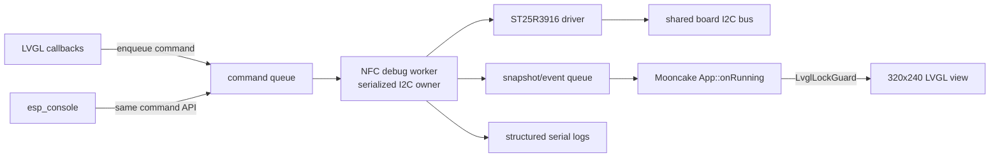

# M5StackChan NFC Debug UI — 320x240 LVGL Design

## Executive summary

The M5Stack CoreS3 has a 2.0-inch capacitive-touch IPS display with a native landscape resolution of **320×240 pixels** and an ILI9342C controller. The production StackChan firmware already initializes this display through `esp_lcd` and `esp_lvgl_port`, registers a 320×240 LVGL display using RGB565, and provides touch input, fonts, C++ widget wrappers, and `LvglLockGuard`.

The recommended UI is therefore a **Mooncake NFC Debug app**, not a display port inside the standalone reader. The app should use the existing board I2C bus exposed by `hal_bridge::board_get_i2c_bus()`, attach the NFC driver to address `0x50`, and run all NFC/I2C operations on a dedicated worker task. The UI thread consumes immutable diagnostic snapshots and never performs I2C from an LVGL callback.

The standalone console firmware remains necessary. It is the smallest environment for transport-backend experiments and serial logs. The Mooncake app provides a more usable view once low-level experiments need physical placement, repeated scans, error counters, and register comparisons.

## Current project status

### Proven

- The ST25R3916 is present at I2C address `0x50` and reports type `0x05`, revision `0x02`.
- The official M5 `Detect.ino` reads the NTAG and displays `PICC:<UID>`.
- The working physical position is across the **literal narrow top edge of the head**, not on the display face and not on the robot body.
- The antenna capacitance measurement is stable around 124.
- Corrected Space-A and Space-B initialization values can be written and read back under favorable transactions.
- The CoreS3 screen is 320×240 landscape, and the StackChan firmware already uses full-screen 320×240 LVGL containers.

### Incomplete

- ESP-IDF `nfc-read` has not produced ATQA or UID.
- The current new-driver I2C path exhibits intermittent invalid state, timeout, and corrupt readback.
- A 100 kHz experiment did not fix transport and made readback worse.
- The NFC driver is not integrated into the full StackChan/Mooncake firmware.

### Consequence for the UI

The UI must present transport health as a first-class result. It must not reduce every failure to “No tag.” A no-tag protocol result, an I2C timeout, a register mismatch, an RX collision, and an empty FIFO are different states and need different visual treatment.

## Display and interaction constraints

| Constraint | Design response |
|---|---|
| 320×240 landscape | Fixed full-screen layout; no desktop-style sidebars |
| 2.0-inch display | 16–20 px body fonts; 24 px only for primary state/UID |
| Capacitive touch | Primary touch targets at least 44 px high |
| Shared I2C bus | Touch callbacks enqueue commands; they never access NFC directly |
| LVGL render task | Every UI mutation from app/worker context uses `LvglLockGuard` |
| Debugging under failure | Keep error counters and last transport result visible on every page |
| Limited vertical space | 28 px header, 168 px content, 44 px bottom navigation |
| Serial remains useful | Mirror state changes and errors to USB console |

The production firmware uses 48–50 px confirmation buttons and 16/20/24 px Montserrat fonts. The proposed UI follows those established dimensions.

## Global frame

Every page uses the same frame:

```text
  0                                                319
  ┌──────────────────────────────────────────────────┐ 0
  │ NFC LAB     I2C ●  err:000     [X]              │ 28
  ├──────────────────────────────────────────────────┤
  │                                                  │
  │                PAGE CONTENT                      │ 196
  │                                                  │
  ├──────────────────────────────────────────────────┤
  │  READ  │  RF/IRQ  │   BUS   │   REGS/LOG        │ 240
  └──────────────────────────────────────────────────┘
```

### Header, 28 px

- `NFC LAB`: stable app title.
- I2C health dot:
  - green: last 20 transactions succeeded;
  - amber: retry occurred or a register mismatch was observed;
  - red: timeout/invalid-state/unrecovered bus failure.
- `err:NNN`: cumulative transport failure count since app open.
- `[X]`: quit button. It must be at least 36×28 px and can extend its invisible hit area to 44×40 px.

### Bottom navigation, 44 px

Use four equal-width buttons of 80×44 px. A `ButtonMatrix` is appropriate because it produces one compact object, consistent sizing, and a single value-change callback. The selected page uses the primary purple color already used by StackChan setup screens; inactive pages use a light background.

Do not use an animated home indicator. Earlier real-device work found watchdog/locking risk in its per-frame update path. A static quit control is sufficient for a diagnostic app.

## Page 1: Reader

This is the default page. It answers: is a tag present, what stage completed, and what card identity is available?

### Empty/ready state

```text
┌──────────────────────────────────────────────────┐
│ NFC LAB     I2C ●  err:000     [X]              │
├──────────────────────────────────────────────────┤
│                  READY                           │
│                                                  │
│       Place ONE tag across the literal           │
│              TOP EDGE of the head                │
│                                                  │
│    DETECT ○   SELECT ○   IDENTIFY ○              │
│                                                  │
│     [ READ ONCE ]       [ AUTO: OFF ]             │
├──────────────────────────────────────────────────┤
│  READ  │  RF/IRQ  │   BUS   │   REGS/LOG        │
└──────────────────────────────────────────────────┘
```

### Successful read state

```text
┌──────────────────────────────────────────────────┐
│ NFC LAB     I2C ●  err:000     [X]              │
├──────────────────────────────────────────────────┤
│                 TAG FOUND                        │
│                                                  │
│ UID  04:7D:9D:82:75:22:91                       │
│ NTAG / MIFARE Ultralight                         │
│ ATQA 0044       SAK 00       UID 7 bytes         │
│                                                  │
│    DETECT ●   SELECT ●   IDENTIFY ●              │
│                                                  │
│     [ READ AGAIN ]      [ AUTO: ON  ]             │
├──────────────────────────────────────────────────┤
│  READ  │  RF/IRQ  │   BUS   │   REGS/LOG        │
└──────────────────────────────────────────────────┘
```

### Error state

```text
┌──────────────────────────────────────────────────┐
│ NFC LAB     I2C ●  err:012     [X]              │
├──────────────────────────────────────────────────┤
│              TRANSPORT ERROR                     │
│                                                  │
│ ESP_ERR_INVALID_STATE                            │
│ operation: READ reg 0x27                         │
│ attempt: 2/2      elapsed: 10.3 ms               │
│                                                  │
│ DETECT —   SELECT —   IDENTIFY —                 │
│                                                  │
│     [ RETRY ]          [ OPEN BUS PAGE ]          │
├──────────────────────────────────────────────────┤
│  READ  │  RF/IRQ  │   BUS   │   REGS/LOG        │
└──────────────────────────────────────────────────┘
```

### Reader widgets

- Primary state label: `READY`, `SCANNING`, `TAG FOUND`, `NO TAG`, `TRANSPORT ERROR`, `PROTOCOL ERROR`.
- UID label with monospace or fixed-width font.
- Type/details label.
- Three stage indicators:
  - Detect = ATQA received;
  - Select = anticollision/SAK completed;
  - Identify = optional detailed type identification.
- `READ ONCE` button.
- `AUTO` toggle. Auto mode should poll at 2–4 Hz, not in a tight loop.

The official workflow separates detect, identify, reactivate, operation, and deactivate. Phase 1 only needs visible Detect and Select; Identify may remain “not implemented” until exact type probing is ported.

## Page 2: RF / IRQ

This page helps the user find the physical sensing position and distinguish no response from malformed receive activity.

```text
┌──────────────────────────────────────────────────┐
│ NFC LAB     I2C ●  err:000     [X]              │
├──────────────────────────────────────────────────┤
│ RF FIELD     ON          CAP 124                 │
│ RSSI 00      FIFO 000    NRT 0350                │
│                                                  │
│ LAST IRQ  0x0034                                 │
│ RXS ●   RXE ●   COL ●   NRE ○   ERR ○            │
│ TIMER 00       ERROR 00       COLL 00            │
│                                                  │
│ receive events  ███████░░░  7 / 10 s             │
│                                                  │
│    [ SAMPLE 10s ]       [ CLEAR COUNTERS ]        │
├──────────────────────────────────────────────────┤
│  READ  │  RF/IRQ  │   BUS   │   REGS/LOG        │
└──────────────────────────────────────────────────┘
```

### RF/IRQ widgets

- Field state: ON/OFF/UNKNOWN.
- Antenna capacitance.
- RSSI display.
- FIFO byte and bit counts.
- NRT value.
- IRQ chips for RXS, RXE, COL, NRE, parity, CRC, and generic error.
- Raw Timer/NFC, Error/Wakeup, and Collision Display bytes.
- Ten-second receive-event bar. This is an event count, not a calibrated RF-strength meter.
- `SAMPLE 10s`: runs controlled alternating REQA/WUPA and records a summary.
- `CLEAR COUNTERS`.

Do not label amplitude measurement as signal strength until its configuration and interpretation are validated. The UI may expose `AMP` under an “experimental” section, but it must not direct placement decisions as though it were calibrated.

## Page 3: I2C bus

This page is the most important page for the current blocker.

```text
┌──────────────────────────────────────────────────┐
│ NFC LAB     I2C !  err:012     [X]              │
├──────────────────────────────────────────────────┤
│ ST25R3916  0x50     type 05 rev 02               │
│ backend    idf-new  speed 400 kHz                │
│                                                  │
│ txns  1842   ok 1830   fail 12   retry 4         │
│ timeout 3    invalid 7  mismatch 2               │
│                                                  │
│ LAST: READ Space-A 0x27                          │
│ got 00  expected 82   10.3 ms                    │
│                                                  │
│ [ PROBE ] [ VERIFY 20x ] [ RESET BUS ]           │
├──────────────────────────────────────────────────┤
│  READ  │  RF/IRQ  │   BUS   │   REGS/LOG        │
└──────────────────────────────────────────────────┘
```

### Bus widgets

- Address, chip type, revision.
- Backend identifier: `idf-new`, `idf-legacy`, or experimental transaction implementation.
- Configured speed.
- Cumulative transaction totals.
- Error class counters:
  - timeout;
  - invalid state;
  - NACK;
  - readback mismatch;
  - recovery attempted/succeeded/failed.
- Last failed operation with register space, address, expected/actual value, duration, and attempt count.
- `PROBE`: one identity read.
- `VERIFY 20x`: repeatedly read a stable register set and report corruption rate.
- `RESET BUS`: guarded operation; resets the I2C controller and reinitializes the NFC device. Require a confirmation dialog because every board peripheral shares the bus.

A useful verification set is:

```text
IC_ID=2A, MODE=09, RX1=08, RX2=2D,
ANT1=82, ANT2=82, TXD=D0,
SpaceB OS=40/03, US=40/03, CORR=47/00, EMD=40
```

## Page 4: Registers and event log

The fourth page switches between a compact register table and a scrollable event log using two small sub-buttons.

### Register view

```text
┌──────────────────────────────────────────────────┐
│ NFC LAB     I2C ●  err:000     [X]              │
├──────────────────────────────────────────────────┤
│ [ REGISTERS ] [ EVENT LOG ]                      │
│                                                  │
│ NAME       EXP  GOT  STATE                       │
│ IO1        17   17    OK                         │
│ IO2        A4   A4    OK                         │
│ MODE       09   09    OK                         │
│ ANT1       82   82    OK                         │
│ ANT2       82   00    BAD                        │
│ CORR1      47   47    OK                         │
│                                                  │
│ [ SPACE A ] [ SPACE B ] [ REFRESH ]              │
├──────────────────────────────────────────────────┤
│  READ  │  RF/IRQ  │   BUS   │   REGS/LOG        │
└──────────────────────────────────────────────────┘
```

Use `lv_table` if its styling remains readable at 320 px. A custom vertical list of labels is simpler if table cell padding consumes too much width. Show only diagnostic registers by default; a “full dump” can stream to the serial console.

### Event log view

```text
┌──────────────────────────────────────────────────┐
│ NFC LAB     I2C !  err:012     [X]              │
├──────────────────────────────────────────────────┤
│ [ REGISTERS ] [ EVENT LOG ]                      │
│                                                  │
│ 14:03:22.104  READ start                         │
│ 14:03:22.111  REQA irq=000000                    │
│ 14:03:22.173  WUPA irq=000000                    │
│ 14:03:22.180  I2C timeout reg=27                 │
│ 14:03:22.190  verify ANT2 00 != 82               │
│ 14:03:22.201  READ failed transport              │
│                                                  │
│ [ CLEAR ] [ FREEZE ] [ SERIAL FULL DUMP ]        │
├──────────────────────────────────────────────────┤
│  READ  │  RF/IRQ  │   BUS   │   REGS/LOG        │
└──────────────────────────────────────────────────┘
```

Keep 32–64 events in a fixed-size ring buffer. The on-screen log should use abbreviated lines. `SERIAL FULL DUMP` prints structured full records to USB Serial/JTAG without trying to fit them on the display.

## State and color model

| State | Color | Meaning |
|---|---|---|
| success | green | operation completed and values validated |
| active | blue/purple | worker operation in progress |
| no tag | neutral gray | transport succeeded; no PICC response |
| warning | amber | retry, collision, mismatch recovered, experimental value |
| transport error | red | I2C timeout/invalid state/NACK/recovery failure |
| protocol error | magenta | transport worked but NFC frame/CRC/FIFO/select failed |

“No tag” must not be red. It is a normal result when the I2C exchange and REQA command succeed without a PICC response.

## Runtime architecture



### Command model

```cpp
enum class NfcDebugCommandType {
    ReadOnce,
    SetAutoPoll,
    Probe,
    VerifyRegisters,
    SampleIrqWindow,
    ClearCounters,
    ResetBus,
    SetField,
};

struct NfcDebugCommand {
    NfcDebugCommandType type;
    uint32_t argument;
};
```

Touch callbacks should only construct and enqueue these commands. They must return immediately.

### Snapshot model

```cpp
struct NfcDebugSnapshot {
    uint32_t generation;
    uint64_t timestamp_us;

    ReaderState reader_state;
    TransportState transport_state;
    ProtocolStage protocol_stage;

    uint8_t uid[10];
    uint8_t uid_len;
    uint16_t atqa;
    uint8_t sak;
    char type_name[32];

    uint32_t main_irq;
    uint8_t timer_irq;
    uint8_t error_irq;
    uint8_t collision;
    uint16_t fifo_bytes;
    uint8_t fifo_bits;
    uint8_t capacitance;
    uint8_t rssi;
    uint16_t nrt;

    TransportCounters counters;
    LastTransportError last_error;
    RegisterSummary registers;
};
```

The worker publishes complete snapshots. The UI never reads partially updated driver globals.

### Scheduling

- UI refresh: at most 10 Hz, only when snapshot generation changes.
- Auto poll: 2–4 Hz.
- Register verification: explicit action or 1 Hz while Bus page is visible.
- Event-log timestamps: `esp_timer_get_time()`; wall clock is optional.
- No blocking loop in `onRunning()`.
- No LVGL lock held during I2C or protocol work.

## Integration with the StackChan firmware

### App shape

Proposed files in the full StackChan repository:

```text
firmware/main/apps/app_nfc_debug/
├── app_nfc_debug.h
├── app_nfc_debug.cpp
├── nfc_debug_service.h
├── nfc_debug_service.cpp
└── view/
    ├── nfc_debug_view.h
    └── nfc_debug_view.cpp
```

Driver code should become a focused component or reusable directory rather than being duplicated inside the app.

### Board access

The full firmware already exposes:

```cpp
hal_bridge::board_get_i2c_bus()
```

The NFC service should add its device handle to that bus. It must not call `i2c_new_master_bus()` again for port 1.

### Mooncake lifecycle

```cpp
void AppNfcDebug::onOpen()
{
    // Start service first, then create widgets under LvglLockGuard.
}

void AppNfcDebug::onRunning()
{
    // Non-blocking: consume latest snapshot, update only changed labels/styles.
}

void AppNfcDebug::onClose()
{
    // Stop auto polling, wait for worker shutdown, destroy UI under lock.
}
```

Registration follows the established pattern:

1. include app header in `main/apps/apps.h`;
2. install with `GetMooncake().installApp(std::make_unique<AppNfcDebug>())`;
3. rely on the existing recursive app source collection.

## Widget choices

| Requirement | Widget/API |
|---|---|
| full-screen page | `Container` or `lv_obj_create` |
| static/dynamic text | `Label` / `lv_label` |
| primary actions | `Button` / `lv_button` |
| bottom navigation | `lv_buttonmatrix` |
| auto mode | styled button or `lv_switch` |
| stage/IRQ indicators | small labels/containers or `lv_led` |
| receive-event activity | `lv_bar` |
| register matrix | `lv_table` or custom label rows |
| event log | scrollable container with recycled labels |
| reset confirmation | modal container with Cancel/Confirm buttons |

Prefer the existing `smooth_ui_toolkit::lvgl_cpp` wrappers for containers, labels, buttons, sliders, and event signals. Use raw LVGL widgets where the wrapper does not provide a compact equivalent.

## Design decisions

### Decision 1: Mooncake app rather than standalone display port

**Status:** proposed.

The production firmware already solves display, touch, backlight, LVGL tasking, fonts, locking, app navigation, and power behavior. Porting those systems into `0115` would add substantial unrelated work and another touch client to the same I2C bus currently under investigation.

The standalone firmware remains the transport laboratory. The Mooncake app is the operator interface.

### Decision 2: One worker owns NFC operations

**Status:** proposed.

UI callbacks and console commands must share a serialized service. Concurrent direct calls would recreate the serial-ownership problem at the I2C/device level and produce untrustworthy logs.

### Decision 3: Show transport, RF, and protocol as separate layers

**Status:** proposed.

The project repeatedly lost time by collapsing different failure classes into “no tag.” The UI must keep these layers independent:

1. transport succeeded/failed;
2. configuration matched/mismatched;
3. RF receive event occurred/did not occur;
4. protocol stage completed/failed.

### Decision 4: No animation in the first debug UI

**Status:** proposed.

Static controls reduce LVGL update frequency and avoid known watchdog risk from continuously animated common widgets. Diagnostic accuracy has priority over visual polish.

## Alternatives considered

### Add LVGL directly to the standalone firmware

This keeps the NFC experiment isolated but requires CoreS3 LCD panel initialization, backlight/power setup, touch setup, LVGL port configuration, display buffers, rotation, fonts, and locking. It also makes the diagnostic firmware larger before transport is stable. Reject for the first UI.

### Use M5GFX text only

This matches the Arduino example and is fast to implement, but it does not provide reusable touch controls, page navigation, structured state widgets, or clean integration with the ESP-IDF production firmware. Useful only as a narrow smoke test.

### Replace console with UI

Reject. Serial logs can preserve full register/error records and are required when the display itself fails. The UI should mirror and summarize, not replace, console diagnostics.

## Phased implementation plan

### Phase UI-0: Service extraction

1. Define command, snapshot, event, and counter structures.
2. Route existing console commands through `NfcDebugService`.
3. Add transport operation context and counters.
4. Prove console behavior is unchanged.

### Phase UI-1: Static Reader page

1. Create Mooncake app and 320×240 frame.
2. Add Reader page, `READ ONCE`, and static quit button.
3. Connect `hal_bridge::board_get_i2c_bus()`.
4. Show ReaderState and transport error separately.

### Phase UI-2: Bus and RF pages

1. Add raw IRQ/FIFO/capacitance snapshot.
2. Add transaction counters and last-error context.
3. Add register verification action.
4. Mirror every action to serial logs.

### Phase UI-3: Register/log page

1. Add expected/current register rows.
2. Add fixed-size event ring.
3. Add serial full-dump action.
4. Add guarded bus-reset confirmation.

### Phase UI-4: Continuous operation

1. Add 2–4 Hz auto poll.
2. Add tag insertion/removal state.
3. Validate no watchdog resets and no concurrent I2C calls.
4. Measure task stack, heap, and UI latency.

## Validation checklist

- [ ] Screen uses native 320×240 landscape dimensions.
- [ ] Every primary touch action is at least 44 px high.
- [ ] No I2C call executes from an LVGL callback.
- [ ] No LVGL call executes without the LVGL lock outside its task.
- [ ] Console and UI commands serialize through one worker.
- [ ] “No tag” is distinct from transport and protocol errors.
- [ ] Error counters survive page changes.
- [ ] Register mismatch shows expected and actual values.
- [ ] Full logs remain available over USB Serial/JTAG.
- [ ] Closing the app stops polling and releases its device handle safely.
- [ ] The app can run for 30 minutes without watchdog reset or heap growth.

## Open questions

1. Should the first implementation live directly in the full StackChan repository, or should the display HAL be packaged so `0115` can reuse it later?
2. Does the current ST25R3916 board connection expose an IRQ GPIO, or must the app continue polling interrupt registers?
3. Should bus reset be available in the UI while audio/touch/PMIC clients are active, or only in a dedicated diagnostic firmware?
4. Should the transport backend be selected at build time (`idf-new`, `idf-legacy`, explicit operations) or exposed as a controlled runtime experiment?
5. Is `lv_table` legible with the production fonts and padding at 320 px, or should register rows use a custom two-column container?

## References

### Official documentation

- https://docs.m5stack.com/en/core/CoreS3
- https://docs.m5stack.com/en/arduino/m5cores3/display
- https://docs.m5stack.com/en/arduino/stackchan/nfc
- https://docs.lvgl.io/9.4/

### Preserved ticket sources

- `sources/web/04-m5stack-stackchan-nfc-full-official-doc.md`
- `sources/web/03-m5stack-stackchan-nfc-official-images.md`
- `sources/code/BSP-NFC-Detect-example.ino`
- `sources/code/m5unit-nfc/nfc_layer_a.cpp`

### StackChan implementation references

- `firmware/main/hal/board/config.h` — `DISPLAY_WIDTH=320`, `DISPLAY_HEIGHT=240`
- `firmware/main/hal/board/stackchan_display.cc` — `esp_lvgl_port`, RGB565, buffers, locking
- `firmware/main/hal/board/hal_bridge.h` — `board_get_i2c_bus()`
- `firmware/main/apps/app_template/app_template.cpp` — Mooncake lifecycle and static quit button
- `firmware/main/apps/app_setup/workers/system.cpp` — 320×240 containers, 48–50 px buttons, fonts
- `firmware/main/apps/common/status_bar/status_bar.cpp` — 320×28 status bar pattern
