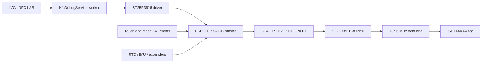

# ST25R3916 I2C Transport Debugging Analysis, Design, and Intern Implementation Guide

## Executive summary

The M5StackChan’s ST25R3916 NFC controller works with M5’s official Arduino firmware. The official `Detect.ino` reads the known-good NTAG when it is placed flat across the literal narrow top edge of the head. The current ESP-IDF firmware identifies the same chip, writes the expected configuration, and runs an on-device NFC LAB diagnostic interface, but one-shot reads intermittently fail at the I2C transport layer before an RF request is transmitted.

The first controlled NFC LAB read reported:

```text
transactions 365
succeeded    360
failed         5
last error   ESP_ERR_INVALID_STATE
operation    WRITE A
key          0x0A
```

Operation `WRITE A`, key `0x0A`, is a Space-A write to the ST25R3916 Auxiliary Definition register. The failing call attempts to set `no_crc_rx` immediately before REQA. The driver returns on that error, so this attempt did not reach REQA transmission, ATQA reception, anticollision, or UID selection. The tag cannot be the cause of this specific failure.

The online and source-code investigation establishes four facts:

1. ESP-IDF 5.5.4’s synchronous new I2C driver maps any final controller status other than `I2C_STATUS_DONE` to `ESP_ERR_INVALID_STATE`. A NACK, timeout-related state, or another incomplete transaction can therefore appear under the same public error name.
2. Espressif issue #14030 reports similar NACK-followed-by-invalid-state behavior on the new driver. A related fix is already present in 5.5.4, so that issue supports the investigation but does not prove that this device has the same bug.
3. The successful M5 stack uses a materially different I2C implementation. M5GFX 0.2.27 uses a per-port mutex, direct controller-register programming, an FSM reset at transaction start, explicit repeated starts, and forced STOP/bus recovery after error.
4. M5Unit-NFC’s `detect(..., timeout_ms=1000)` retries failed REQA attempts for up to one second. The official UI displays eventual success and does not expose each failed request.

The debugging plan must separate two questions:

- Can M5-style retries make a complete UID read eventually succeed?
- Can the underlying transport be made stable enough that retries are not needed to conceal failures?

The recommended implementation sequence is:

1. Freeze a reproducible baseline and preserve first-error context.
2. Capture SDA/SCL with a logic analyzer to distinguish a physical NACK from a host-state error.
3. Add an observable M5-style request retry experiment without clearing failure counters.
4. Add an explicit defined-operations backend in the standalone firmware.
5. Audit direct-command completion timing required by the ST25R3916 datasheet.
6. Compare the new-driver high-level, new-driver defined-operations, and legacy-driver backends under the same test matrix.
7. Integrate only the winning backend into NFC LAB, retaining diagnostics and zero-failure acceptance gates.

A UID obtained only after hidden transaction failures is useful diagnostic progress, but it is not transport completion. The final acceptance criterion remains a stable UID read with no transport errors or register mismatches across a sustained test.

## 1. Scope and non-goals

This guide explains how to diagnose and implement the next transport experiments. It is written for an engineer who knows C/C++ and ESP-IDF but has not worked on this repository, the ST25R3916, M5Unified, or StackChan.

The guide covers:

- I2C transaction structure relevant to the ST25R3916;
- the distinction between the ESP-IDF and M5GFX backends;
- the meaning and limitations of `ESP_ERR_INVALID_STATE`;
- the current NFC LAB service and instrumentation architecture;
- safe retry and recovery design;
- logic-analyzer evidence collection;
- explicit-operation and legacy-backend experiments;
- implementation APIs, file changes, pseudocode, tests, and acceptance gates.

The guide does not propose changing RF tuning, receiver gain, anticollision logic, or tag placement while transport remains unstable. Those are later layers. It also does not recommend copying M5GFX’s direct register manipulation into the production StackChan firmware. Doing so while ESP-IDF owns the same hardware controller would violate the current bus ownership model.

## 2. Facts, observations, and hypotheses

A debugging plan must keep observed facts separate from explanations that still require tests.

### 2.1 Proven facts

- The device is an ESP32-S3 StackChan/CoreS3 system.
- The ST25R3916 acknowledges at 7-bit I2C address `0x50`.
- Stable identity reads report chip type `0x05`, revision `0x02`.
- The official Arduino firmware displayed `PICC:<UID>` with the known-good tag.
- The known-good tag position is the literal narrow top edge of the head.
- NFC LAB uses ESP-IDF 5.5.4’s new `driver/i2c_master.h` API.
- NFC LAB’s first controlled read observed five failed transactions among 365 attempts.
- Its last failure was a Space-A write to register `0x0A` before REQA.
- A previous 100 kHz experiment did not improve behavior and produced worse readback corruption.
- The NFC LAB driver records every direct call to `i2c_master_transmit()` and `i2c_master_transmit_receive()`.
- The complete StackChan firmware shares one ESP-IDF bus handle across multiple board clients.

### 2.2 Strong inferences

- The controlled `0x0A` failure is not caused by tag type or RF placement because it occurs before REQA transmission.
- The official Arduino result does not prove zero intermediate I2C failures because M5’s detector retries request discovery for up to one second.
- The visible difference between Arduino and ESP-IDF can result from both retry policy and backend behavior.
- A broad application retry may produce a UID while leaving the underlying transaction defect present.

### 2.3 Unproven hypotheses

The current evidence does not yet choose among these causes:

- a real ST25R3916 NACK on address or data;
- a false NACK detected by the ESP32-S3 controller;
- a controller FSM state/recovery problem in the ESP-IDF new driver;
- access to the ST25R3916 while a direct command is still busy;
- an electrical rise-time, pull-up, crosstalk, or signal-integrity problem;
- a timing difference between the generated high-level transaction and M5GFX’s explicit transaction;
- a shared-bus interaction that changes when the full UI firmware is running;
- a combination of the preceding factors.

Do not write code that assumes one hypothesis before completing the discriminating tests.

## 3. System architecture

### 3.1 Hardware path

The ESP32-S3 is the only I2C master. The ST25R3916 is an I2C slave at address `0x50`. The bus is shared with other StackChan peripherals through the board HAL.



The NFC worker serializes NFC operations, but it does not own the complete board bus. ESP-IDF’s bus semaphore serializes API transactions from different device handles. A read-modify-write at the ST25R level still consists of two separate I2C transactions unless a higher-level lock spans both.

### 3.2 Software layers

The system has five relevant layers:

| Layer | Responsibility | Typical failure evidence |
|---|---|---|
| UI | Present command and result | stale state, wrong classification |
| NFC service | Serialize work and publish snapshots | queue, lifecycle, retry policy |
| ST25R driver | Encode registers, direct commands, FIFO, NFC-A | wrong command byte, wrong order, early access |
| Host I2C backend | Generate START/address/data/ACK/STOP | NACK, timeout, invalid state, bus busy |
| Electrical bus and target | Physical signaling and target readiness | slow rise, missing ACK, stuck line |

The tag protocol begins only after all preceding layers complete the request setup.

### 3.3 Two experiment hosts

Use the projects for different purposes:

```text
0115-m5stackchan-nfc-reader
  - minimal standalone firmware
  - preferred for backend and logic-analyzer experiments
  - no LVGL/touch workload
  - console-first raw evidence

0116-m5stackchan-nfc-debug-ui
  - production StackChan HAL and shared bus
  - preferred for operational validation
  - visible counters and state pages
  - not the first place to replace the whole bus backend
```

A backend should first pass in `0115`, then be adapted to the shared-bus constraints of `0116`.

## 4. ST25R3916 I2C protocol

The preserved ST25R3916/7 datasheet is:

```text
sources/datasheets/ST25R3916-datasheet.pdf
DS12484 Rev 3, pages 53–57 for I2C
```

The device supports 100 kHz, 400 kHz, 1 MHz, and 3.4 MHz modes. The current firmware and successful M5 configuration use 400 kHz.

### 4.1 Space-A register write

A Space-A write is one transaction:

```text
START
0xA0              address 0x50 + write bit
REGISTER_COMMAND  lower six bits are register address
VALUE
STOP
```

For register `0x0A`, setting `no_crc_rx`, the payload generated by the current driver is:

```text
A0 0A <old-value | 80>
```

The bus analyzer should distinguish ACKs for:

1. address byte `0xA0`;
2. register command `0x0A`;
3. value byte.

### 4.2 Space-A register read

A one-byte register read requires a repeated start:

```text
START
0xA0              address + write
0x40 | register   read-register command
REPEATED START
0xA1              address + read
READ one byte
NACK               master terminates final read byte
STOP
```

This exact shape is shown in datasheet Figure 22.

### 4.3 Space-B access

Space-B inserts prefix `0xFB`. Its access remains selected until STOP:

```text
Write B:
START  A0  FB  register  value  STOP

Read B:
START  A0  FB  (40 | register)  REPEATED_START  A1  data  NACK  STOP
```

The STOP boundary is semantically important. A backend experiment must not merge unrelated Space-B and Space-A accesses.

### 4.4 FIFO and direct commands

FIFO load uses command `0x80`; FIFO read uses `0x9F`. Direct commands use values in the `0xC0`–`0xFF` range and complete as write transactions.

The datasheet states that some direct commands take time to execute and that **no I2C access may occur until command completion**. Those commands signal completion through an interrupt. Fixed delays are acceptable only after confirming that the specific command’s maximum completion time is bounded by the chosen delay.

This creates a second failure path independent of the ESP-IDF driver:

```text
direct command accepted
        ↓
target remains busy
        ↓
firmware accesses register too early
        ↓
target NACKs or returns invalid state
```

The implementation audit must classify every direct command as:

- immediate;
- fixed-delay completion documented by ST/M5;
- interrupt-completed;
- unknown and requiring measurement.

## 5. Reconstruction of the first physical failure

The current transport wrappers are in:

```text
0116-.../st25r3916/st25r3916.c:41–89
```

Every high-level write calls:

```c
i2c_master_transmit(s_dev, data, len, pdMS_TO_TICKS(100));
```

Every write/read call uses:

```c
i2c_master_transmit_receive(
    s_dev, command, command_len, data, data_len,
    pdMS_TO_TICKS(100));
```

The NFC request sequence is at `st25r3916.c:649–683`:

```text
write 4 ms NRT
write ISO14443-A antcl mode
read Auxiliary Definition
write Auxiliary Definition with no_crc_rx
clear interrupts
clear FIFO
transmit REQA or WUPA
wait for IRQ
```

The reported operation was write A, key `0x0A`. Therefore the read-modify-write reached the write phase of Auxiliary Definition and failed there. The function returned at line 657. The following operations did not execute for that request:

- interrupt clear;
- FIFO clear;
- direct REQA/WUPA command;
- IRQ wait;
- FIFO read;
- ATQA decode.

This ordering is the strongest current reason not to adjust RF parameters in response to the failed read.

## 6. What `ESP_ERR_INVALID_STATE` means here

The public name is broader than the observed internal condition.

In preserved ESP-IDF 5.5.4 source:

```text
sources/code/esp-idf-v5.5.4-i2c_master.c
```

`i2c_master.c:561–570` handles `I2C_STATUS_ACK_ERROR`. It starts a STOP and exits command generation. Later, `i2c_master.c:724–728` maps every final state other than `I2C_STATUS_DONE` to:

```c
ret = ESP_ERR_INVALID_STATE;
```

The synchronous wrapper holds the bus semaphore, executes the transaction, and resets the hardware FSM without clearing the whole bus after an error (`i2c_master.c:1002–1033`).

The result is:

```text
ESP_ERR_INVALID_STATE
    does not uniquely mean
"device handle was never initialized"
```

It can also mean that the synchronous controller did not finish in `DONE`. The preserved API documentation does not list `ESP_ERR_INVALID_STATE` among all transaction outcomes consistently, but the implementation emits it.

### 6.1 Relevant Espressif reports

The ticket preserves these GitHub issues with full comments:

- `sources/web/06-esp-idf-issue-13136-i2c-failure-notification.md`
- `sources/web/07-esp-idf-issue-14030-nack-invalid-state.md`
- `sources/web/08-esp-idf-issue-17556-defined-operations-invalid-state.md`
- `sources/web/09-esp-idf-issue-17720-nack-stop-watchdog.md`

Issue #14030 is the closest pattern: an initial NACK followed by repeated `ESP_ERR_INVALID_STATE`. It includes reports from ESP32-S3 users and later reports on IDF 5.5. It remains open at the saved retrieval date.

A 2025 fix cited in that issue changed error recovery so an ordinary transaction error resets the hardware FSM without clearing the whole bus. That behavior is already present in the tagged 5.5.4 source. Therefore:

- do not assume upgrading to 5.5.4 fixes the current issue; the project already uses it;
- do not assume issue #14030 is the exact cause;
- use it to justify collecting raw ACK/NACK and post-error recovery evidence.

Issue #17556 is intentionally preserved as a caution. Its original report blamed defined operations, but the author later found that the analyzer was attached to the wrong bus and closed the issue. It demonstrates why logic-analyzer channel and bus identity must be verified before drawing conclusions.

Issue #17720 documents NACK/STOP recovery hangs in 5.4.2 and 5.5.1 and was resolved with a later fix. It is relevant to watchdog and recovery tests, not direct proof of the current write failure.

## 7. Why the Arduino sketch can appear reliable

### 7.1 M5 request retry behavior

The successful official example calls M5Unit-NFC’s multi-PICC detector. Its implementation at preserved `nfc_layer_a.cpp:224–259` loops until a timeout:

```cpp
do {
    PICC picc{};
    if (!request(picc.atqa)) {
        delay(1);
        continue;
    }
    if (!select(picc)) return false;
    // append selected PICC
} while (millis() <= timeout_at);
```

The default vector-detect timeout is one second. A failed register access or failed REQA can return false and be retried. The official display reports selected PICCs after the aggregate call. It does not show transaction failures.

NFC LAB’s READ ONCE currently performs one high-level `st25r3916_poll_nfca()` call. It tries REQA once and WUPA only if REQA completed as a no-tag result. A transport error returns immediately.

These are not equivalent user operations:

| Behavior | Official M5 detect | NFC LAB READ ONCE |
|---|---|---|
| Request deadline | up to 1000 ms | one REQA, optional WUPA |
| Retry after request false | yes, 1 ms delay | no |
| Shows intermediate transport errors | no | yes |
| Backend | M5GFX direct controller | ESP-IDF new master |

### 7.2 M5GFX backend behavior

M5Unified’s `I2C_Class` delegates start, restart, read, write, and stop to M5GFX. The exact versions from the successful build are preserved:

```text
M5Unified 0.2.20
M5GFX     0.2.27
```

M5GFX’s ESP32 implementation contains behavior not present in a simple wrapper around `i2c_master_transmit_receive()`:

- a per-port FreeRTOS mutex (`common.cpp:1249–1270`);
- a forced STOP and up to nine SCL recovery pulses (`common.cpp:1477–1511`);
- explicit NACK/end/arbitration wait handling (`common.cpp:1514–1600`);
- explicit repeated-start construction (`common.cpp:1839–1871`);
- hardware FSM reset at each transaction start on supported targets (`common.cpp:1966–2001`);
- FIFO/controller initialization per transaction (`common.cpp:2003–2045`);
- explicit write/restart/read/end composition (`common.cpp:2220–2231`).

This does not prove every detail is responsible for success. It proves that Arduino and NFC LAB are not exercising the same host transport implementation.

## 8. Quantifying the current failure

The observed rate was:

```text
5 failures / 365 transactions = 1.37%
```

This rate is descriptive. Do not treat transactions as statistically independent until timestamps show that failures are not clustered.

If independent failures were assumed only for illustration, the probability of a fully successful sequence would be:

```text
P(sequence success) = (1 - p)^N
```

At `p = 0.0137`:

| Transactions in operation | Illustrative all-success probability |
|---:|---:|
| 10 | 87% |
| 20 | 76% |
| 50 | 50% |

A one-second retry loop could frequently produce eventual success under such conditions. The correct data products are therefore:

- first-attempt success rate;
- eventual success rate within retry deadline;
- transaction failure rate;
- failure burst length;
- recovery success rate;
- exact first failed operation and byte stage.

Do not report only eventual UID success.

## 9. Diagnostic architecture to build

### 9.1 Transport backend interface

Separate ST25R framing from the host implementation. The standalone driver should depend on an explicit transport table:

```c
typedef enum {
    ST25R_BACKEND_IDF_HIGH_LEVEL,
    ST25R_BACKEND_IDF_DEFINED_OPS,
    ST25R_BACKEND_IDF_LEGACY,
} st25r_backend_kind_t;

typedef struct {
    esp_err_t (*write_a)(uint8_t reg, const uint8_t *data, size_t len);
    esp_err_t (*read_a)(uint8_t reg, uint8_t *data, size_t len);
    esp_err_t (*write_b)(uint8_t reg, const uint8_t *data, size_t len);
    esp_err_t (*read_b)(uint8_t reg, uint8_t *data, size_t len);
    esp_err_t (*fifo_write)(const uint8_t *data, size_t len);
    esp_err_t (*fifo_read)(uint8_t *data, size_t len);
    esp_err_t (*direct_command)(uint8_t command);
    esp_err_t (*recover)(void);
    const char *name;
} st25r_transport_vtable_t;
```

Do not select the legacy and new drivers for the same I2C port in one running firmware. The legacy comparison should be a compile-time backend in the standalone project.

### 9.2 Structured attempt trace

The existing aggregate counters are necessary but insufficient. Add a fixed-size trace record:

```c
typedef enum {
    ST25R_PHASE_INIT,
    ST25R_PHASE_FIELD_ON,
    ST25R_PHASE_REQUEST_SETUP,
    ST25R_PHASE_REQUEST_TX,
    ST25R_PHASE_IRQ_WAIT,
    ST25R_PHASE_FIFO_READ,
    ST25R_PHASE_ANTICOLLISION,
    ST25R_PHASE_SELECT,
    ST25R_PHASE_DIAGNOSTIC,
} st25r_phase_t;

typedef struct {
    uint32_t sequence;
    int64_t started_us;
    uint32_t elapsed_us;
    st25r_backend_kind_t backend;
    st25r_phase_t phase;
    st25r3916_transport_operation_t operation;
    uint8_t key;
    uint8_t attempt;
    esp_err_t result;
    bool recovery_attempted;
    bool recovery_succeeded;
} st25r_transport_event_t;
```

Keep 64 or 128 entries in a ring. Preserve both:

- `first_error_since_clear`;
- `last_error`.

The first error explains how the failure began. The last error may only describe later diagnostics performed after the bus was already unhealthy.

### 9.3 Request-level retry policy

Implement retry above the raw transaction wrappers first:

```c
typedef struct {
    uint32_t deadline_ms;       // 0 means one attempt
    uint16_t max_attempts;
    uint16_t delay_ms;
    bool recover_after_transport_error;
} st25r_request_retry_policy_t;
```

Recommended experiment values:

```text
deadline_ms = 1000
max_attempts = 100
attempt delay = 1 ms
```

The deadline matches M5’s visible detect behavior. The maximum attempt count prevents an unexpectedly fast tight loop.

Do not clear counters between attempts. Publish:

- attempts;
- first failure;
- total transport failures;
- ATQA success attempt;
- UID success attempt;
- elapsed time.

### 9.4 Error classification

Do not equate public `esp_err_t` names with physical causes. Use application-level classes:

```c
typedef enum {
    ST25R_ERROR_NONE,
    ST25R_ERROR_HOST_TIMEOUT,
    ST25R_ERROR_HOST_NOT_DONE,
    ST25R_ERROR_TARGET_NACK_OBSERVED,
    ST25R_ERROR_BUS_BUSY,
    ST25R_ERROR_READBACK_MISMATCH,
    ST25R_ERROR_TARGET_BUSY_WINDOW,
    ST25R_ERROR_NO_RF_RESPONSE,
    ST25R_ERROR_PROTOCOL_FRAME,
    ST25R_ERROR_UNKNOWN,
} st25r_error_class_t;
```

Only set `TARGET_NACK_OBSERVED` from logic-analyzer evidence or a backend API that exposes NACK distinctly. With the current synchronous high-level API, classify `ESP_ERR_INVALID_STATE` as `HOST_NOT_DONE`.

### 9.5 Command-completion table

Create one table for direct-command timing:

```c
typedef enum {
    ST25R_COMPLETION_IMMEDIATE,
    ST25R_COMPLETION_DELAY,
    ST25R_COMPLETION_IRQ,
} st25r_completion_kind_t;

typedef struct {
    uint8_t command;
    st25r_completion_kind_t kind;
    uint8_t irq_register;
    uint8_t irq_mask;
    uint16_t timeout_ms;
} st25r_command_completion_t;
```

The direct-command wrapper should use this table instead of scattered delays where possible.

## 10. Explicit defined-operations backend

ESP-IDF 5.5.4 provides:

```c
esp_err_t i2c_master_execute_defined_operations(
    i2c_master_dev_handle_t i2c_dev,
    i2c_operation_job_t *operations,
    size_t operation_count,
    int timeout_ms);
```

Use a device handle configured with:

```c
.device_address = I2C_DEVICE_ADDRESS_NOT_USED
```

The backend then supplies address bytes explicitly.

### 10.1 Register write pseudocode

```text
function write_a(reg, value):
    bytes = [0xA0, reg & 0x3F, value]
    operations = [
        START,
        WRITE(bytes, ack_check=true),
        STOP,
    ]
    return execute_defined_operations(operations)
```

### 10.2 Register read pseudocode

```text
function read_a(reg):
    address_write = 0xA0
    command = 0x40 | (reg & 0x3F)
    address_read = 0xA1

    operations = [
        START,
        WRITE([address_write, command], ack_check=true),
        START,  // generated as repeated START inside the transaction
        WRITE([address_read], ack_check=true),
        READ_ONE_BYTE(ack=NACK),
        STOP,
    ]
    return execute_defined_operations(operations)
```

The final read byte must use `I2C_NACK_VAL` before STOP, as required by the ESP-IDF API and standard I2C termination.

### 10.3 What this experiment proves

Defined operations can prove whether explicit framing changes behavior while retaining the same ESP-IDF driver core. It does **not** replace the new driver’s state machine, ISR, error mapping, or recovery code. If both high-level and defined-operation backends fail identically, move to the legacy comparison rather than endlessly rearranging operation arrays.

## 11. Legacy-driver comparison

The legacy backend is valuable because online reports and M5’s direct implementation indicate different recovery behavior. It must be isolated in the standalone firmware.

Compile-time selection:

```text
CONFIG_ST25R_BACKEND_IDF_HIGH_LEVEL=y
CONFIG_ST25R_BACKEND_IDF_DEFINED_OPS=y
CONFIG_ST25R_BACKEND_IDF_LEGACY=y
```

Exactly one backend should be selected.

The legacy read transaction should construct:

```text
START
WRITE A0 + read-command, ACK checks enabled
REPEATED START
WRITE A1, ACK check enabled
READ one byte, master NACK
STOP
```

Do not create a legacy driver on the StackChan production bus while the HAL uses the new driver. First prove results in `0115`.

## 12. Logic-analyzer plan

Software return codes cannot prove whether SDA carried a NACK. Use a logic analyzer before declaring a target or host-driver fault.

### 12.1 Connections

- Channel 0: GPIO11 / SCL.
- Channel 1: GPIO12 / SDA.
- Ground: board ground.
- Sampling: at least 10 MHz for 400 kHz I2C; 20–50 MHz preferred.
- Decoder: I2C, 7-bit address display.

Verify the channels by observing an address scan and confirming `0x50`. Do not rely only on wire color or schematic labels.

### 12.2 Trigger

Preferred trigger sequence:

```text
address 0x50 write
payload first byte 0x0A
```

If the analyzer cannot trigger on decoded data, trigger on SDA falling while SCL is high and capture a long pre-trigger window. Press READ ONCE exactly once.

### 12.3 Record these values

For the failing register write:

- ACK/NACK after `0xA0`;
- ACK/NACK after `0x0A`;
- ACK/NACK after the value byte;
- STOP presence;
- whether either line remains low;
- SCL high and low periods;
- SDA setup/hold around ACK;
- rise time from 30% to 70% if the analyzer supports analog threshold measurement;
- activity from another device immediately before the failure.

### 12.4 Interpretations

| Analyzer result | Interpretation | Next action |
|---|---|---|
| Physical NACK after address | target did not acknowledge transaction | audit target busy/power and timing |
| Physical NACK after data | target rejected or was not ready during write | command-completion audit, compare backend timing |
| All ACKs and valid STOP, API says invalid state | host controller/driver completion fault | defined-ops and legacy comparison |
| Missing STOP or stuck line | recovery/FSM problem | bus recovery experiment |
| Slow rise or threshold crossing | electrical problem | inspect pull-ups/capacitance before software changes |
| Different decoded command | framing bug | fix backend encoding |

## 13. Pull-up and electrical checks

ESP-IDF’s official guide recommends appropriate external pull-ups and notes that internal pull-ups are generally insufficient for reliable I2C. The current board configuration enables internal pull-ups, but the physical board may also contain external pull-ups.

Do not add arbitrary resistors before checking the schematic and measuring the lines. The sequence is:

1. Identify installed board pull-ups and their rails.
2. Measure idle SDA/SCL voltage.
3. Measure rise time at 400 kHz.
4. Compare against I2C Fast-mode timing.
5. Repeat only the same controlled register test after any electrical change.

The failed 100 kHz software experiment makes a simple “clock too fast” explanation less likely, but it does not replace waveform evidence.

## 14. Direct-command timing audit

The ST datasheet requires no I2C access during some command executions. Audit every current call to `direct_cmd()`.

Current calls include:

- STOP ALL ACTIVITIES;
- SET DEFAULT;
- CLEAR FIFO;
- ADJUST REGULATORS;
- NFC INITIAL FIELD ON;
- MEASURE AMPLITUDE;
- MEASURE CAPACITANCE;
- RESET RX GAIN;
- TRANSMIT REQA/WUPA;
- TRANSMIT WITH/WITHOUT CRC.

For each call, record:

| Field | Required evidence |
|---|---|
| Command | symbolic name and byte |
| Completion rule | immediate, delay, or IRQ |
| Current implementation | delay/wait/none |
| M5 implementation | exact function and behavior |
| Datasheet statement | section/page |
| Risk | next access could occur while target busy |
| Test | analyzer or IRQ-based validation |

Do not broadly insert delays. A delay can conceal ordering faults and increase UI latency. Implement the documented completion condition.

## 15. Safe retry design

### 15.1 Retry the operation at the right level

A raw write retry is safe only when the write is idempotent and the previous transaction’s completion is known. Repeating a direct command can have side effects.

Use these initial rules:

- Plain register read: retryable for an experiment.
- Plain register write to a known configuration value: retryable if readback verifies the final value.
- Read-modify-write: retry the complete read-modify-write, not only the final write.
- FIFO write: do not retry without clearing/reconstructing FIFO state.
- Direct command: retry only through a command-specific policy.
- NFC request: retry the complete request setup from a known state.

### 15.2 Preserve evidence

Retry logic must not replace the original result with `ESP_OK` and discard history.

```text
attempt 1: WRITE A 0A -> HOST_NOT_DONE
recover:   no bus reset, rebuild request state
attempt 2: request completes, no tag
attempt 3: request completes, ATQA 0044
select:    UID success
```

The UI should report:

```text
TAG FOUND
attempt 3 / 100
transport failures 1
first failure WRITE A 0A ESP_ERR_INVALID_STATE
```

This makes eventual success and transport quality visible simultaneously.

## 16. Shared-bus recovery constraints

`i2c_master_bus_reset()` resets the whole ESP-IDF master bus. In NFC LAB, that bus is used by other HAL clients. Calling it from the NFC worker without coordination can interrupt touch, RTC, IMU, expanders, or other board services.

The current UI’s `REINIT NFC` action removes and re-adds only the NFC device handle. Its label should remain `REINIT NFC`, not `RESET BUS`.

A board-wide recovery API requires:

```text
acquire board recovery coordinator
pause all periodic I2C clients
wait for in-flight transactions
reset bus
re-add or validate device handles if required
probe critical devices
resume clients
release coordinator
```

Do not build this until standalone experiments show that bus reset is required and effective.

## 17. Phased implementation plan

### Phase D0: Freeze and improve the baseline

**Goal:** Make every subsequent result comparable.

Files:

- `0115-.../st25r3916/st25r3916.h`
- `0115-.../st25r3916/st25r3916.c`
- corresponding overlay driver files in `0116` after standalone validation.

Tasks:

1. Add backend name to stats.
2. Add first-error and last-error records.
3. Add phase and attempt fields.
4. Add a fixed-size transport event ring.
5. Add console output for one machine-readable summary line.
6. Preserve current 400 kHz configuration.

Example summary:

```text
NFC_RESULT backend=idf-high attempt=1 result=transport-error phase=request-setup op=write-a key=0A err=ESP_ERR_INVALID_STATE tx=21 fail=1 elapsed_us=1234
```

Exit gate:

- one controlled read produces enough context to reconstruct the first failing transaction;
- no diagnostic refresh overwrites first-error evidence.

### Phase D1: Observable M5-style request retries

**Goal:** Determine whether retry policy explains the visible Arduino success.

Tasks:

1. Add `poll_nfca_with_policy()`.
2. Use a 1000 ms deadline, 1 ms delay, and bounded attempts.
3. Retry complete REQA setup after transport/no-response failure.
4. Preserve all errors.
5. Do not reset counters between attempts.
6. Add UI/console fields for attempt count and eventual result.

Pseudocode:

```text
function poll_with_policy(policy):
    deadline = now + policy.deadline
    first_error = none

    for attempt in 1..policy.max_attempts:
        result = poll_once(attempt)
        record(result)

        if result == TAG_FOUND:
            return success_with_history

        if result is fatal_protocol_configuration_error:
            return result

        if now >= deadline:
            break

        sleep(policy.delay)

    return best_failure_with_history
```

Exit gate:

- record whether UID appears within one second;
- report first-attempt and eventual success separately.

### Phase D2: Logic-analyzer capture

**Goal:** Establish whether the failing `0x0A` transaction contains a physical NACK.

Tasks:

1. Capture baseline address scan.
2. Capture successful ID read.
3. Capture failing READ ONCE.
4. Annotate address, command, data, ACK/NACK, repeated start, and STOP.
5. Save analyzer export under ticket `sources/traces/`.

Exit gate:

- the report identifies the byte stage of failure or proves all ACKs despite API failure.

### Phase D3: Defined-operations backend

**Goal:** Match explicit ST/M5 framing while retaining ESP-IDF 5.5.4’s new driver core.

Tasks:

1. Add `st25r_transport_idf_defined.c` to `0115`.
2. Create a device handle with `I2C_DEVICE_ADDRESS_NOT_USED`.
3. Implement Space-A, Space-B, FIFO, and direct-command operations.
4. Unit-test operation arrays on the host where possible.
5. Compare logic traces byte-for-byte with the datasheet.
6. Run the same register and UID matrix.

Exit gate:

- zero malformed transactions;
- measured failure rate materially lower than high-level backend, or result documented as no improvement.

### Phase D4: Direct-command completion audit

**Goal:** Eliminate access-during-busy as a target-side NACK source.

Tasks:

1. Build the completion table.
2. Replace undocumented delays with IRQ waits where required.
3. Log command start, completion IRQ, timeout, and next access.
4. Capture one timing trace for each long command category.

Exit gate:

- every long command has a documented completion mechanism;
- no host access occurs inside a forbidden command window.

### Phase D5: Legacy backend comparison

**Goal:** Determine whether replacing the new driver core removes the failures.

Tasks:

1. Add compile-time legacy backend to `0115` only.
2. Use the same pins, speed, register sequence, timeout, and tag position.
3. Preserve identical application-level counters.
4. Run the complete test matrix.

Exit gate:

- choose a backend based on measured error and UID results, not preference.

### Phase D6: Integrate the winner into NFC LAB

**Goal:** Validate the selected transport under shared-bus and UI load.

Tasks:

1. Port only a backend compatible with the existing board bus.
2. Keep one NFC worker.
3. Keep transport event history.
4. Add backend and retry status to the Bus page.
5. Complete UI-3 register/event-log page.
6. Run lifecycle and endurance tests.

Exit gate:

- repeated tag reads succeed without increasing transport error counters;
- touch and other board peripherals remain functional.

## 18. Test matrix

Run every backend against the same matrix.

| Test | Tag | UI load | Iterations | Required output |
|---|---|---|---:|---|
| Identity stability | absent | standalone | 1000 | exact ID, zero errors |
| Config verification | absent | standalone | 20×12 reads | zero mismatch/error |
| Register `0x0A` RMW | absent | standalone | 1000 | zero errors, expected value |
| REQA baseline | absent | standalone | 100 | no response, zero transport errors |
| REQA known tag | present | standalone | 100 | ATQA rate and transport rate |
| Full UID | present | standalone | 100 | UID consistency |
| Full UID | present | NFC LAB | 100 | UID + touch health |
| Endurance | alternating | NFC LAB | 30 min | no WDT, leak, or error growth |

Record:

```text
firmware commit
ESP-IDF commit
backend
clock
pull-up configuration
tag identity and placement
transaction totals
failure classes
first failure
UID attempts/successes
heap minimum
watchdog/reset count
logic trace filename
```

## 19. Acceptance criteria

### 19.1 Diagnostic milestone

The retry milestone is complete when:

- M5-style retry behavior is implemented;
- first failures remain visible;
- the result states whether eventual UID succeeds;
- no claim of transport stability is made from eventual success alone.

### 19.2 Transport milestone

The transport is accepted when all are true:

- 1000 identity reads: zero transaction failures;
- 20 complete 12-register verification passes: zero failures and mismatches;
- 100 no-tag requests: zero transport failures;
- 100 known-tag reads: zero transport failures;
- UID is stable and matches official firmware;
- no bus reset is required during normal operation;
- no touch or other HAL regressions occur in NFC LAB;
- 30-minute run produces no watchdog reset or heap trend.

### 19.3 Phase-1 project completion

Standalone Phase 1 remains incomplete until the ESP-IDF console prints the UID. A UI-only UID does not replace the standalone acceptance gate unless the ticket is explicitly revised.

## 20. Operational debugging runbook

### Before a run

1. Use ESP-IDF 5.5.4.
2. Confirm only one process owns `/dev/ttyACM0`.
3. Disable AUTO.
4. Remove all tags.
5. Clear counters once.
6. Record firmware commit and backend.

### No-tag baseline

1. Run PROBE.
2. Run VERIFY 20x.
3. Record totals and mismatches.
4. Press READ ONCE.
5. Expect NO TAG with no transport count increase.

### Tag-present run

1. Place one known-good tag flat across the literal top edge.
2. Record Bus counters.
3. Press READ ONCE exactly once.
4. Record Reader state.
5. Record Bus first/last error.
6. Record RF/IRQ values.
7. Save serial logs.
8. Do not immediately clear counters.

### When a transport error occurs

1. Stop AUTO.
2. Do not adjust RF settings.
3. Record phase, operation, key, attempt, and elapsed time.
4. Probe identity once.
5. If identity fails, treat the bus as unhealthy.
6. If identity succeeds, run a small configuration verification.
7. Use REINIT NFC only after evidence is saved.
8. Use board-wide reset only in the standalone experiment or coordinated recovery design.

## 21. Design decisions

### Decision: Keep retries observable

- **Context:** M5 retries can produce eventual success while individual I2C attempts fail.
- **Options considered:** no retries; hidden retries; retries with full history.
- **Decision:** implement bounded request retries while retaining first-error, aggregate, attempt, and recovery data.
- **Rationale:** this reproduces M5-visible behavior without losing transport evidence.
- **Consequences:** UI needs to represent successful UID with degraded transport health.
- **Status:** accepted.

### Decision: Compare backends in the standalone firmware first

- **Context:** StackChan’s production bus has multiple active clients.
- **Options considered:** replace the bus directly in NFC LAB; build backend experiments in `0115`; port M5GFX direct register code into the HAL.
- **Decision:** conduct backend replacement in `0115`, then integrate a shared-bus-compatible winner.
- **Rationale:** this reduces unrelated workload and avoids conflicting ownership of the ESP32 I2C peripheral.
- **Consequences:** final validation must still be repeated in NFC LAB.
- **Status:** accepted.

### Decision: Use logic-analyzer evidence before labeling NACK

- **Context:** ESP-IDF returns `ESP_ERR_INVALID_STATE` for multiple non-DONE states.
- **Options considered:** infer NACK from source; enable more logs only; capture SDA/SCL.
- **Decision:** reserve physical NACK classification for waveform or backend event evidence.
- **Rationale:** software status does not identify which byte was acknowledged.
- **Consequences:** hardware capture becomes a required phase.
- **Status:** accepted.

### Decision: Defined operations before legacy integration

- **Context:** the high-level new-driver API differs from M5’s explicit sequence.
- **Options considered:** immediately switch to legacy; use defined operations; patch ESP-IDF internals.
- **Decision:** test defined operations first, then legacy if the new driver remains unstable.
- **Rationale:** defined operations can match framing while retaining the production-compatible bus API.
- **Consequences:** it cannot isolate faults inside the new driver core; legacy remains necessary if results do not improve.
- **Status:** proposed.

### Decision: Do not patch private ESP-IDF state for production

- **Context:** internal status distinguishes ACK error and timeout, while the public API collapses outcomes.
- **Options considered:** include `i2c_private.h`; patch IDF; classify public result conservatively; use waveforms.
- **Decision:** do not make production code depend on private structs. A temporary diagnostic IDF patch is allowed only in a clearly marked experiment.
- **Rationale:** private layouts and fields are not stable APIs.
- **Consequences:** application classification remains conservative without analyzer evidence.
- **Status:** accepted.

### Decision: No uncoordinated shared-bus reset

- **Context:** NFC LAB shares the bus with multiple board services.
- **Options considered:** call `i2c_master_bus_reset()` from NFC worker; reinitialize NFC device only; build board coordinator.
- **Decision:** retain NFC-only reinitialization until a coordinated board recovery service exists.
- **Rationale:** resetting the controller can disrupt unrelated devices and invalidate test evidence.
- **Consequences:** some stuck-bus conditions may require reboot during current UI testing.
- **Status:** accepted.

## 22. Risks and alternatives

### Risk: retries make the product look fixed

Mitigation: maintain separate first-attempt, eventual-success, and transport-quality metrics. Transport acceptance requires zero failures.

### Risk: analyzer loading or wrong channel invalidates evidence

Mitigation: use high-impedance probes, common ground, and confirm the `0x50` scan before the target trace.

### Risk: direct-command audit changes NFC behavior

Mitigation: change one command completion rule at a time and compare register/IRQ results to M5.

### Risk: defined operations reproduce the same new-driver bug

Mitigation: treat defined operations as a framing experiment, not a guaranteed replacement. Proceed to legacy comparison if needed.

### Alternative: use M5Unit-NFC directly under ESP-IDF

M5Unit-NFC supports ESP-IDF-oriented abstractions, but its successful official path still depends on the M5 I2C adapter and M5GFX behavior. Integrating the library before transport is understood would change both protocol and transport at once. It remains a valid later option after backend comparison.

### Alternative: add a dedicated second I2C bus

The physical ST25R3916 is wired to the board bus pins. A second controller cannot isolate it without hardware modification or remapping that conflicts with the existing wiring. This is not a software-only solution.

## 23. Intern checklist

Before coding:

- [ ] Read this guide completely.
- [ ] Read diary Steps 14, 15, 19, 20, and 22.
- [ ] Read the ST datasheet pages 53–57.
- [ ] Read preserved ESP-IDF source around lines 532–735 and 1002–1033.
- [ ] Read preserved M5GFX source around lines 1249–1600 and 1966–2052.
- [ ] Read M5 detect retry at `nfc_layer_a.cpp:224–259`.
- [ ] Confirm the current physical firmware and Git commit.

For every experiment:

- [ ] Change one variable.
- [ ] Preserve first-error context.
- [ ] Record no-tag and tag-present baselines.
- [ ] Keep tag and placement fixed.
- [ ] Keep serial ownership exclusive.
- [ ] Save logs and traces under the ticket.
- [ ] State what the result proves and does not prove.

Before proposing completion:

- [ ] Console prints UID.
- [ ] Transport counters remain unchanged during valid reads.
- [ ] Configuration verification is clean.
- [ ] NFC LAB works under shared-bus load.
- [ ] Endurance test passes.
- [ ] Diary, changelog, tasks, and source provenance are updated.

## 24. References

### Primary local implementation

- `0115-m5stackchan-nfc-reader/main/st25r3916/st25r3916.c`
- `0115-m5stackchan-nfc-reader/main/nfc_console.c`
- `0116-m5stackchan-nfc-debug-ui/overlay/firmware/main/apps/app_nfc_debug/st25r3916/st25r3916.c`
- `0116-m5stackchan-nfc-debug-ui/overlay/firmware/main/apps/app_nfc_debug/nfc_debug_service.cpp`
- `0116-m5stackchan-nfc-debug-ui/overlay/firmware/main/apps/app_nfc_debug/view/nfc_debug_view.cpp`

### Preserved authoritative source

- `sources/code/esp-idf-v5.5.4-i2c_master.c`
- `sources/code/esp-idf-v5.5.4-i2c_master.h`
- `sources/code/M5GFX-0.2.27-esp32-common.cpp`
- `sources/code/M5Unified-0.2.20-I2C_Class.cpp`
- `sources/code/I2C-backend-source-provenance.md`
- `sources/code/m5unit-nfc/nfc_layer_a.cpp`
- `sources/code/m5unit-nfc/unit_ST25R3916_nfca.cpp`
- `sources/datasheets/ST25R3916-datasheet.pdf`

### Preserved web research

- `sources/web/05-esp-idf-5.5.4-esp32s3-i2c-programming-guide.md`
- `sources/web/06-esp-idf-issue-13136-i2c-failure-notification.md`
- `sources/web/07-esp-idf-issue-14030-nack-invalid-state.md`
- `sources/web/08-esp-idf-issue-17556-defined-operations-invalid-state.md`
- `sources/web/09-esp-idf-issue-17720-nack-stop-watchdog.md`
- `sources/web/10-st-community-st25r3916-repeat-start.md`
- `sources/web/11-st-community-st25r3916-i2c-issue.md`

### Canonical URLs

- ESP-IDF 5.5.4 I2C guide: https://docs.espressif.com/projects/esp-idf/en/v5.5.4/esp32s3/api-reference/peripherals/i2c.html
- ESP-IDF issue #14030: https://github.com/espressif/esp-idf/issues/14030
- ESP-IDF issue #13136: https://github.com/espressif/esp-idf/issues/13136
- ESP-IDF issue #17720: https://github.com/espressif/esp-idf/issues/17720
- M5GFX 0.2.27: https://github.com/m5stack/M5GFX/tree/0.2.27
- M5Unified 0.2.20: https://github.com/m5stack/M5Unified/tree/0.2.20
- M5Unit-NFC: https://github.com/m5stack/M5Unit-NFC
- ST25R3916/7 datasheet mirror: https://www.mouser.com/datasheet/2/389/st25r3916-1761505.pdf
