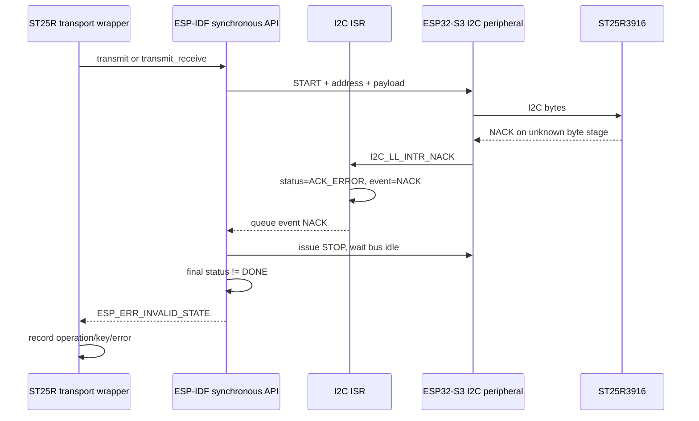
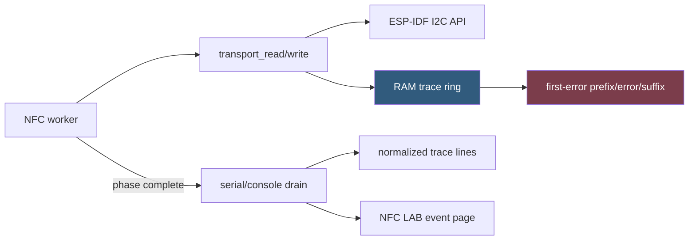

# ESP-IDF Instrumentation for Arduino-Comparable ST25R3916 Transport Traces

## Executive summary

The current ESP-IDF instrumentation proves that individual ST25R3916 operations fail, but it does not yet produce the same complete logical-transaction stream captured from the official Arduino path. The next diagnostic implementation must record every successful and failed address-`0x50` transaction in RAM, normalize keys and transaction kinds to the Arduino schema, preserve the transactions immediately preceding the first error, and defer serial output until the NFC phase ends.

The ESP-IDF 5.5.4 driver source materially narrows the current diagnosis. In synchronous mode, `s_i2c_transaction_start()` returns `ESP_ERR_INVALID_STATE` whenever the final internal status is not `I2C_STATUS_DONE`. The ISR maps a hardware NACK interrupt to `I2C_STATUS_ACK_ERROR` and `I2C_EVENT_NACK`; the synchronous sender does not convert that state to DONE after issuing STOP. The public API therefore returns `ESP_ERR_INVALID_STATE` for this NACK path. It can also return the same value after a timeout or missing completion event.

The observed failures took about 195 microseconds and were not accompanied by the driver's unconditional ERROR-level `I2C transaction timeout detected` message. The strongest current inference is therefore:

> The ESP32-S3 controller is observing a NACK-class completion on at least some failing ESP-IDF transactions, and ESP-IDF 5.5.4 is exposing that internal ACK-error state as `ESP_ERR_INVALID_STATE`.

This is not yet proof of which byte was NACKed or why. The NACK may occur on address, register command, or data. It may result from target busy timing, controller state, malformed framing, electrical integrity, or another condition. Enabling the driver's compiled-in DEBUG log can confirm `I2C_EVENT_NACK`; only SDA/SCL capture or byte-stage backend instrumentation can locate it physically.

The measured M5 control provides the comparison target. Its principal four-chip run reported 10,188 successful logical ST25R3916 transactions and zero M5Unified-level failures. It successfully traversed the same operation-control and auxiliary-definition registers that fail intermittently under ESP-IDF. M5GFX resets the hardware FSM at every transaction start and uses explicit controller commands, ACK inspection, forced STOP, pin-level bus clearing, and peripheral reset. ESP-IDF resets the FSM before a transaction only after timeout or detected bus-busy, and resets after a synchronous error. The most important controlled hypothesis is now whether M5's **preventive per-transaction FSM reset and explicit completion/recovery behavior** avoids the NACK-class outcome seen by the new ESP-IDF driver.

## 1. Scope

This document designs instrumentation and experiments. It does not select a production backend and does not claim the fault is solved.

The implementation goals are:

1. Produce ESP-IDF transaction records directly comparable to the existing Arduino `M5_I2C` records.
2. Preserve complete context before and after the first ESP-IDF failure.
3. Confirm whether `ESP_ERR_INVALID_STATE` corresponds to the driver's NACK event on this hardware.
4. Distinguish target-visible NACK, host timeout, bus busy, readback mismatch, and protocol failure.
5. Compare high-level, defined-operation, and isolated alternative backends with one trace schema.
6. Avoid serial logging in the timed transaction path.
7. Keep NFC LAB's shared-bus constraints separate from standalone experiments.

Non-goals:

- Do not import the Arduino framework into the ESP-IDF application.
- Do not patch private ESP-IDF driver state in production firmware.
- Do not add invisible retries that replace a failed first attempt with `ESP_OK`.
- Do not call a board-wide bus reset from NFC LAB without coordination.
- Do not declare Phase 1 complete until ESP-IDF prints a valid UID.

## 2. Evidence available now

### 2.1 Proven facts

| Fact | Evidence |
|---|---|
| ST25R3916 is at `0x50` | Repeated scans and identity reads |
| Identity is type `0x05`, revision `0x02` | Standalone and NFC LAB reads |
| Hardware and antenna can read tags | Official Arduino firmware printed real UIDs |
| Correct placement is the literal top edge | Official photographs and successful reads |
| ESP-IDF failure can occur before REQA | `WRITE_A key=0x0A` aborted before command `0xC6` |
| ESP-IDF failure can occur during initialization | `READ_A key=0x02` failed at transaction 65 |
| M5 completed the same logical registers | Full Arduino trace includes successful `0x42`, `0x02`, `0x4A`, and `0x0A` operations |
| M5 principal comparison exposed no API-level transport errors | 10,188 reported successes, zero failures |
| Protocol failure can occur on a clean transport | Two Arduino identify phases returned false after 87/87 successful transactions |
| ESP-IDF 5.5.4 maps non-DONE synchronous completion to invalid state | `i2c_master.c::s_i2c_transaction_start()` |
| ESP-IDF NACK ISR state is not DONE | ISR sets `I2C_STATUS_ACK_ERROR`; transaction start returns invalid state |

### 2.2 Strong inference

The 195 microsecond invalid-state failure is more consistent with the ESP-IDF NACK path than with the configured 100 ms API timeout.

Reasoning:

1. The synchronous driver returns invalid state when final status is not DONE.
2. A NACK interrupt sets ACK_ERROR and sends `I2C_EVENT_NACK`.
3. The NACK path issues STOP but leaves final status non-DONE.
4. A hardware timeout event prints `I2C transaction timeout detected` at ERROR level.
5. The captured invalid-state failure did not include that timeout message.
6. The failure returned in approximately 195 microseconds, not near the transfer deadline.

This is a strong software-path diagnosis. It is not a byte-level electrical diagnosis.

### 2.3 Unknowns

- Which byte is NACKed: address, encoded register key, or value?
- Does a NACK appear on SDA, or does the controller report NACK because of stale state?
- What transaction immediately precedes each failure?
- Is the preceding operation a direct command with a forbidden access window?
- Does another shared-bus device transaction occur between an ST25R read-modify-write pair?
- Does explicit defined-operation framing change the result?
- Does transaction-start FSM reset remove the failure?
- Is M5GFX recovering a lower-level fault without surfacing it to M5Unified?

## 3. The exact ESP-IDF error path

The relevant synchronous path is:

```text
i2c_master_transmit[_receive]
  -> s_i2c_synchronous_transaction
     -> acquire bus_lock_mux
     -> s_i2c_transaction_start
        -> reset status to IDLE
        -> configure timing and FIFOs
        -> s_i2c_send_commands
           -> ISR updates status/event
           -> queue receives DONE, NACK, or TIMEOUT
        -> if status != DONE: ESP_ERR_INVALID_STATE
     -> on error: s_i2c_hw_fsm_reset(clear_bus=false)
```

The ISR classifies events:

```c
if (interrupt_mask & I2C_LL_INTR_NACK) {
    status = I2C_STATUS_ACK_ERROR;
    event = I2C_EVENT_NACK;
} else if (interrupt_mask & (I2C_LL_INTR_TIMEOUT |
                             I2C_LL_INTR_ARBITRATION)) {
    status = I2C_STATUS_TIMEOUT;
    event = I2C_EVENT_TIMEOUT;
} else if (interrupt_mask & I2C_LL_INTR_MST_COMPLETE) {
    event = I2C_EVENT_DONE;
}
```

The synchronous sender handles NACK by writing a STOP command and waiting until the bus is no longer busy. It does not translate ACK_ERROR to a distinct public error. `s_i2c_transaction_start()` later sees status other than DONE and returns `ESP_ERR_INVALID_STATE`.



### 3.1 Why the existing public result is ambiguous

`ESP_ERR_INVALID_STATE` can still arise if:

- a timeout event sets status TIMEOUT;
- the event queue wait expires and status becomes TIMEOUT;
- another non-DONE internal path occurs;
- asynchronous queue state returns a separate invalid-state error, although NFC LAB uses synchronous calls.

The application must therefore record an evidence class, not rewrite the public error name:

```text
ESP_ERR_INVALID_STATE + driver DEBUG NACK line -> HOST_NACK_EVENT
ESP_ERR_INVALID_STATE + driver timeout line   -> HOST_TIMEOUT_EVENT
ESP_ERR_INVALID_STATE + neither               -> HOST_NOT_DONE_UNKNOWN
```

Only waveform evidence can upgrade `HOST_NACK_EVENT` to an address/data-specific physical NACK classification.

## 4. Why the M5 backend comparison matters

M5Unified does not use the same high-level ESP-IDF transaction API for the successful control. Its `I2C_Class` delegates to M5GFX direct controller code.

M5GFX performs these steps at transaction start:

1. Acquire a per-port lock.
2. Wait briefly if the bus reports busy.
3. Save peripheral registers.
4. Route pins.
5. Assert hardware `fsm_rst` on supported chips, including ESP32-S3.
6. Reinitialize controller mode and timeout.
7. Reset TX and RX FIFOs.
8. Program explicit START/address commands.

During completion it:

- polls raw interrupt bits;
- distinguishes NACK/end-detect/arbitration conditions;
- marks connection loss on missing end or NACK;
- uses explicit STOP when possible;
- otherwise uses pin-level STOP/bus clearing;
- can reset the peripheral;
- restores saved registers and releases the lock.

ESP-IDF also contains recovery logic, but the timing differs:

| Behavior | M5GFX direct backend | ESP-IDF 5.5.4 new driver |
|---|---|---|
| FSM reset before ordinary transaction | Yes, every begin on ESP32-S3 | Only if prior status timeout or bus is busy |
| FIFO reset | Every transaction begin | Every transaction start |
| ACK classification | Direct raw interrupt inspection | ISR event/status, then public invalid state |
| STOP after error | Explicit or forced pin-level recovery | STOP on NACK; FSM reset after synchronous error |
| Peripheral reset | Available in forced recovery | FSM reset helper after error |
| Logical operation API | Explicit start/write/restart/read/stop | transmit/transmit_receive or defined jobs |
| Successful measured run | 10,188/10,188 | Intermittent failures |

This makes transaction-start FSM reset the first host-side behavior to isolate. It is not yet the proven cause because M5 also differs in timing, locking, register programming, and recovery.

## 5. Comparison contract

ESP-IDF and Arduino traces must use the same definitions.

### 5.1 Logical transaction boundary

One event begins at START and ends at STOP or terminal failure.

Examples:

```text
register write: START address+W key value STOP
register read:  START address+W encoded-key RESTART address+R byte(NACK) STOP
```

M5's traced `I2C_Class` context already records this boundary. ESP-IDF's `i2c_master_transmit()` and `i2c_master_transmit_receive()` naturally correspond to one logical event.

### 5.2 Key normalization

Store both forms:

- `wire_key`: actual first ST25R command byte on SDA;
- `logical_key`: raw register/command identity used by the local driver.

Examples:

| Operation | Logical key | Wire key |
|---|---:|---:|
| Read operation control | `0x02` | `0x42` |
| Write operation control | `0x02` | `0x02` |
| Read auxiliary definition | `0x0A` | `0x4A` |
| Write auxiliary definition | `0x0A` | `0x0A` |
| FIFO load | `0x80` | `0x80` |
| FIFO read | `0x9F` | `0x9F` |
| REQA | `0xC6` | `0xC6` |

This removes the current manual conversion between NFC LAB's raw register key and Arduino's first transmitted byte.

### 5.3 Timing

Record:

- absolute monotonic start in microseconds;
- duration in microseconds;
- gap since the prior ST25R event;
- phase-relative time;
- request attempt number.

The predecessor gap is necessary for direct-command busy analysis.

### 5.4 Result levels

Every event has three result fields:

1. `api_result`: raw `esp_err_t` or M5 failure-stage result;
2. `driver_hint`: DONE, NACK, TIMEOUT, or UNKNOWN when observable;
3. `error_class`: application-level interpretation.

Do not infer byte-stage NACK in `error_class` without waveform evidence.

## 6. ESP-IDF trace schema

Use a fixed-size event record with no heap allocation.

```c
typedef enum {
    ST25R_TRACE_BACKEND_IDF_HIGH_LEVEL,
    ST25R_TRACE_BACKEND_IDF_DEFINED_OPS,
    ST25R_TRACE_BACKEND_IDF_LEGACY,
    ST25R_TRACE_BACKEND_DIRECT_EXPERIMENT,
} st25r_trace_backend_t;

typedef enum {
    ST25R_TRACE_KIND_WRITE = 1,
    ST25R_TRACE_KIND_READ = 2,
    ST25R_TRACE_KIND_WRITE_READ = 3,
} st25r_trace_kind_t;

typedef enum {
    ST25R_DRIVER_HINT_UNKNOWN,
    ST25R_DRIVER_HINT_DONE,
    ST25R_DRIVER_HINT_NACK,
    ST25R_DRIVER_HINT_TIMEOUT,
    ST25R_DRIVER_HINT_BUS_BUSY,
} st25r_driver_hint_t;

typedef enum {
    ST25R_CLASS_OK,
    ST25R_CLASS_HOST_NACK_EVENT,
    ST25R_CLASS_HOST_TIMEOUT,
    ST25R_CLASS_HOST_NOT_DONE_UNKNOWN,
    ST25R_CLASS_READBACK_MISMATCH,
    ST25R_CLASS_NO_RF_RESPONSE,
    ST25R_CLASS_PROTOCOL_FAILURE,
} st25r_trace_class_t;

typedef struct {
    uint32_t sequence;
    uint32_t timestamp_us;
    uint32_t elapsed_us;
    uint32_t gap_us;
    uint16_t write_len;
    uint16_t read_len;
    int32_t api_result;
    uint8_t backend;
    uint8_t phase;
    uint8_t attempt;
    uint8_t kind;
    uint8_t operation;
    uint8_t logical_key;
    uint8_t wire_key;
    uint8_t driver_hint;
    uint8_t error_class;
    uint8_t flags;
} st25r_trace_event_t;
```

The exact packed size should be asserted at compile time. Do not force packing until alignment and access cost are measured on Xtensa; a naturally aligned 36- or 40-byte record is acceptable for a diagnostic ring.

### 6.1 Flags

Reserve flags for:

```text
FIRST_ERROR
RECOVERY_ATTEMPTED
RECOVERY_SUCCEEDED
READBACK_VERIFIED
DIAGNOSTIC_TRANSACTION
RING_OVERWROTE_OLDER_EVENT
```

### 6.2 Phase values

Use stable phases across backends:

```text
INIT_IDENTITY
INIT_RESET
INIT_CONFIG
INIT_OSCILLATOR
INIT_ANALOG
FIELD_ON
REQUEST_SETUP
REQUEST_TRANSMIT
IRQ_WAIT
FIFO_READ
ANTICOLLISION
SELECT
IDENTIFY
DIAGNOSTIC
SHUTDOWN
```

Phase assignment belongs above raw I2C helpers. The transport wrapper receives the current phase and attempt through an explicit context, not a global inferred from call stack names.

## 7. Ring and first-error architecture

Use two related stores:

1. a circular event ring for chronological history;
2. a frozen first-error bundle.

```c
#define ST25R_TRACE_CAPACITY 512
#define ST25R_FIRST_ERROR_PREFIX 16
#define ST25R_FIRST_ERROR_SUFFIX 16

typedef struct {
    st25r_trace_event_t events[ST25R_TRACE_CAPACITY];
    uint32_t head;
    uint32_t count;
    uint32_t overwritten;
    uint32_t total_recorded;

    bool first_error_set;
    st25r_trace_event_t first_error;
    st25r_trace_event_t prefix[ST25R_FIRST_ERROR_PREFIX];
    uint8_t prefix_count;
    st25r_trace_event_t suffix[ST25R_FIRST_ERROR_SUFFIX];
    uint8_t suffix_count;
} st25r_trace_store_t;
```

When the first error occurs:

- copy the preceding 16 ring events into `prefix`;
- freeze the failing event;
- collect the next 16 events into `suffix`;
- never replace this bundle until explicit clear.

This guarantees that later diagnostics cannot overwrite the causal neighborhood.

A 512-entry ring is enough for one NFC LAB read attempt and matches the Arduino continuous tracer's bounded mode. A compile-time 6,000-entry forensic mode can preserve a full one-second M5-style request loop in standalone firmware. Do not allocate that mode in NFC LAB without measuring DRAM/PSRAM placement.

## 8. Observer-safe recording

The hot path may perform:

- timestamp reads;
- fixed-size structure assignment;
- integer counter updates;
- ring index updates under the existing single-worker ownership.

It must not perform:

- `ESP_LOG*`;
- `printf`;
- heap allocation;
- JSON formatting;
- LVGL updates;
- additional I2C reads;
- file writes.

The ESP-IDF NFC worker is already the only owner of ST25R operations, so the ring does not require a mutex for NFC events. If an ISR-level driver hook is added in an experimental ESP-IDF copy, it needs a separate ISR-safe record path and cannot write into the worker ring without a defined synchronization mechanism.



## 9. Driver-event confirmation without a private production API

### 9.1 Enable ESP-IDF I2C debug logging

Set in the diagnostic build:

```text
CONFIG_I2C_ENABLE_DEBUG_LOG=y
```

At runtime:

```c
esp_log_level_set("i2c.master", ESP_LOG_DEBUG);
```

This compiles and enables the driver's DEBUG message:

```text
I2C transaction unexpected nack detected
```

The timeout event remains ERROR:

```text
I2C transaction timeout detected
```

The test capture must correlate these lines with the application's event sequence and timestamp. Because driver log output occurs inside the API call after event processing, it adds serial overhead to a failing transaction. Use it only for a short classification run, not for baseline rate measurement.

### 9.2 Why public callbacks are not the primary solution

`i2c_master_register_event_callbacks()` is associated with asynchronous transaction handling. NFC LAB uses synchronous calls. The current driver callback path invokes `on_trans_done` when `trans_done` is true; NACK does not represent a normal completed transaction. Switching the application to asynchronous mode merely to expose events changes queueing, ownership, and timing too substantially for the first comparison.

### 9.3 Diagnostic ESP-IDF source patch

If DEBUG logging confirms NACK but more internal detail is required, maintain a minimal, disposable ESP-IDF diagnostic patch outside production source. It may record:

- final `i2c_master_event_t`;
- final `i2c_master_status_t`;
- raw ISR interrupt mask;
- whether pre-transaction FSM reset ran;
- whether post-error FSM reset ran;
- whether bus busy was observed;
- transaction operation index.

The patch must be version-pinned to ESP-IDF 5.5.4 and clearly marked as an experiment. Do not expose private structure fields through casts in application code.

## 10. Normalized serial format

Emit one header and one line per event after the phase.

Header:

```text
TRACE_BEGIN schema=1 backend=idf-high phase=request attempt=1 events=21 overwritten=0
```

Event:

```text
I2C_TRACE seq=347 t_us=1200456 gap_us=91 elapsed_us=195 backend=idf-high phase=request-setup attempt=1 kind=W op=WRITE_A logical=0A wire=0A wlen=2 rlen=0 api=ESP_ERR_INVALID_STATE hint=NACK class=HOST_NACK_EVENT flags=FIRST_ERROR
```

Footer:

```text
TRACE_END result=transport-error txns=21 failed=1 first_error_seq=347
```

Arduino output should be normalized offline into the same fields:

```text
M5_I2C txn=5 ... kind=W key=0x0A ... ok=1
```

becomes:

```text
backend=m5-direct kind=W logical=0A wire=0A api=OK hint=DONE class=OK
```

A comparison script should join by phase and operation sequence rather than absolute timestamps.

## 11. Implementation API

Add a dedicated trace module rather than expanding the transport statistics structure indefinitely.

```c
void st25r_trace_init(st25r_trace_store_t *store);
void st25r_trace_clear(st25r_trace_store_t *store);

void st25r_trace_set_context(st25r_phase_t phase, uint8_t attempt);

void st25r_trace_record(
    st25r_trace_backend_t backend,
    st25r3916_transport_operation_t operation,
    uint8_t logical_key,
    uint8_t wire_key,
    st25r_trace_kind_t kind,
    uint16_t write_len,
    uint16_t read_len,
    int64_t started_us,
    esp_err_t api_result,
    st25r_driver_hint_t hint,
    uint8_t flags);

size_t st25r_trace_snapshot(
    st25r_trace_event_t *output,
    size_t capacity,
    st25r_trace_snapshot_info_t *info);

bool st25r_trace_first_error(
    st25r_first_error_bundle_t *output);
```

`transport_write()` and `transport_read()` compute wire key and kind, invoke the API, then call `st25r_trace_record()` exactly once.

```c
static esp_err_t transport_read(...)
{
    const int64_t started = esp_timer_get_time();
    const esp_err_t result = backend->read(...);
    const st25r_driver_hint_t hint = classify_driver_hint(result);

    st25r_trace_record(
        backend->kind,
        operation,
        logical_key,
        command[0],
        ST25R_TRACE_KIND_WRITE_READ,
        command_len,
        data_len,
        started,
        result,
        hint,
        0);
    return result;
}
```

Initially, `classify_driver_hint(ESP_ERR_INVALID_STATE)` returns UNKNOWN. A short debug-log capture can annotate the corresponding stored event as NACK during offline analysis. Do not set NACK from the public error alone.

## 12. Sequence comparison

The comparison script should produce three outputs.

### 12.1 Summary

```text
backend         phase       events  failures  median_us  p95_us  max_us
m5-direct       init        338     0         176        187     351
idf-high        init        65      1         ...        ...     ...
```

### 12.2 First divergence

```text
index  m5-direct                         idf-high
61     WR wire=42 OK 178us               WR wire=42 OK 181us
62     W  wire=02 OK 102us               W  wire=02 OK 103us
63     W  wire=C8 OK 79us                W  wire=C8 OK 81us
64     WR wire=42 OK 176us               WR wire=42 INVALID_STATE 195us
```

### 12.3 Timing predecessor report

```text
failure seq=64
previous direct command=C8
command-to-failure gap=84us
M5 equivalent gap=...
datasheet minimum completion condition=...
```

This output directly tests target-busy hypotheses.

## 13. Experiment order

### Experiment A: Baseline ring, no driver DEBUG

- Backend: current high-level ESP-IDF API.
- Firmware: standalone `0115` first.
- Trace: every success and failure, deferred output.
- Runs: 100 initializations, 100 register verification passes, 20 READ ONCE attempts.
- Purpose: establish event sequences, predecessor gaps, and failure rate without serial observer effect.

### Experiment B: Short driver DEBUG classification

- Enable `CONFIG_I2C_ENABLE_DEBUG_LOG=y`.
- Set `i2c.master` to DEBUG.
- Run until one invalid-state event.
- Stop after the first failure.
- Purpose: confirm NACK versus timeout event.

Expected decisive observation:

```text
I2C transaction unexpected nack detected
NFC_I2C_FAIL ... ESP_ERR_INVALID_STATE
```

### Experiment C: Logic analyzer

- Trigger on address `0x50` and wire key `0x0A` or `0x42`.
- Perform one operation per boot where possible.
- Purpose: locate physical NACK stage and verify STOP.

### Experiment D: Defined operations

- Same event schema.
- Explicit address bytes, repeated START, final read NACK, STOP.
- Purpose: test framing control while retaining the new driver core.

### Experiment E: Preventive FSM-reset experiment

This experiment must not mutate private state in NFC LAB. Use standalone firmware and either:

- a narrowly instrumented ESP-IDF diagnostic component;
- an isolated direct backend modeled after M5GFX;
- a legal public bus reset only when standalone owns the bus, recognizing that this is broader than M5's `fsm_rst` bit.

Purpose: test whether reset before every transaction removes NACK-class failures.

### Experiment F: M5 timing replay

Compare command-to-command gaps from the Arduino trace. Reproduce only documented waits and M5 ordering. Do not insert broad delays.

## 14. Hypothesis ranking

### H1: Host-controller state/recovery difference

**Rank: highest.**

Supporting evidence:

- M5 resets FSM at every transaction start.
- ESP-IDF does not reset before an ordinary non-busy transaction.
- Failures move between ordinary registers.
- M5 completes the same registers thousands of times.
- ESP-IDF's public error is consistent with ACK_ERROR/non-DONE state.

Disproof condition:

- Logic analyzer shows a clear target NACK under both backends with equivalent timing and M5 merely retries/recoveries invisibly.

### H2: Target busy after a direct command

**Rank: medium.**

Supporting evidence:

- ST documentation prohibits access during some command execution.
- Failures occur during command-rich initialization and request setup.

Weakening evidence:

- Failures are not confined to one register or one phase.
- M5 ordering appears similar.

Decisive test:

- predecessor/gap trace plus command-completion table and waveform.

### H3: Shared-bus interleaving

**Rank: medium-low as sole cause.**

Supporting evidence:

- NFC LAB shares the bus with many clients.
- read-modify-write consists of two separately locked transactions.

Weakening evidence:

- standalone ESP-IDF also exhibited instability.
- Arduino board initialization also uses the same physical bus, though its runtime load differs.

Decisive test:

- compare standalone and NFC LAB traces with bus-owner markers.

### H4: Electrical pull-up or signal-integrity problem

**Rank: unresolved, lower than host-state difference.**

Supporting evidence:

- 400 kHz shared bus and internal pull-up configuration deserve measurement.

Weakening evidence:

- M5 completes sustained 400 kHz traffic on the same hardware.
- 100 kHz ESP-IDF experiment became worse rather than better.

Decisive test:

- rise-time and ACK waveform measurement.

### H5: Wrong NFC register/protocol implementation

**Rank: low for the transport error.**

The driver may still contain protocol defects, but a wrong NFC-A value does not explain why an ordinary I2C transaction returns non-DONE. The same values and keys complete under M5.

## 15. What is most likely happening

The evidence supports this working model:

1. The ESP-IDF application begins a valid-looking logical ST25R3916 transaction.
2. The ESP32-S3 I2C peripheral raises a NACK interrupt or another non-DONE condition early in the transaction.
3. ESP-IDF's ISR stores ACK_ERROR/NACK.
4. The synchronous path issues STOP, returns to `s_i2c_transaction_start()`, and maps the non-DONE status to `ESP_ERR_INVALID_STATE`.
5. The synchronous wrapper resets the hardware FSM after returning the error.
6. Later transactions often succeed, so the problem appears intermittent and moves among registers.
7. M5 avoids or recovers this condition through its different start/reset/stop behavior and therefore exposes zero logical failures in the measured control.

The missing fact is the physical byte stage. If SDA shows NACK after address or data, investigate target readiness and timing. If SDA shows ACKs and STOP while ESP-IDF reports invalid state, the defect is inside host completion handling. If the waveform is malformed or lacks STOP, prioritize controller FSM/recovery.

## 16. Console and UI requirements

Add standalone commands:

```text
nfc-trace clear
nfc-trace status
nfc-trace dump [--last N]
nfc-trace first-error
nfc-trace mode off|failure|all
nfc-read --attempts 1
nfc-read --deadline-ms 1000 --max-attempts 100
```

NFC LAB UI-3 should show:

- backend name;
- trace mode;
- current ring count and overwrite count;
- first error sequence, phase, attempt, kind, logical key, wire key, result, and hint;
- 16 preceding and 16 following events;
- clear action;
- export instruction over serial.

The UI callback only enqueues commands. The NFC worker owns trace snapshots and serial drains.

## 17. Acceptance tests for instrumentation

The instrumentation is correct when:

1. One Arduino register read and one ESP-IDF register read normalize to the same kind, logical key, wire key, write length, and read length.
2. Event recording adds no serial output inside the transaction path.
3. A 512-entry run does not overwrite one READ ONCE attempt.
4. The first-error bundle survives later diagnostics.
5. Clearing the aggregate counters also clears the ring only when explicitly requested.
6. Trace sequence numbers remain monotonic within a clear epoch.
7. Ring overwrite count is accurate.
8. A host test validates wraparound and prefix/suffix freezing.
9. DEBUG-driver classification can be correlated by timestamp and event sequence.
10. M5 and ESP-IDF traces can be processed by one comparison script.

## 18. Backend acceptance matrix

| Test | Iterations | Tag state | Required result |
|---|---:|---|---|
| Identity read | 1,000 | absent | exact `0x2A`, zero failures |
| Config verification | 100 × 12 regs | absent | zero failures, zero mismatches |
| Request setup | 100 | absent | zero transport failures |
| UID read | 100 | known tag | UID success rate reported; zero transport failures for acceptance |
| Multi-tag request | 50 | four tags | protocol results separated from transport |
| Command timing | each long command | absent | no access in forbidden window |
| Lifecycle | 50 init/deinit | absent | no leak, stuck bus, or failed reattach |
| NFC LAB endurance | 30 minutes | mixed | touch alive, zero transport counter growth |

Report first-attempt success and eventual success separately.

## 19. Risks

### Trace observer effect

Timestamp and memory writes add cost. Measure instrumentation overhead with tracing enabled and disabled. Deferred logging removes the dominant serial cost but does not make recording free.

### Ring overflow hides the beginning

A circular ring may retain the end of a long retry phase while losing the first failure. The frozen prefix/error/suffix bundle prevents this. Always report overwrite count.

### Driver DEBUG changes timing

The DEBUG NACK line is emitted during the API call. Use it only for event classification and stop after the first error.

### Private driver instrumentation becomes accidental production code

Keep an exact patch file and version metadata under ticket sources. Never make application correctness depend on private structures.

### M5 trace boundary hides internal recovery

Zero M5Unified failures means the logical transactions succeeded at that boundary. It does not prove the controller never observed a transient condition. Waveform comparison remains necessary.

## 20. Implementation phases and commits

Commit at these boundaries:

1. **Trace data model and host tests.** No firmware behavior change.
2. **High-level backend recording.** Build and standalone no-tag validation.
3. **First-error freeze and console commands.** Controlled failure capture.
4. **Driver DEBUG diagnostic configuration.** One short classification run; keep config isolated.
5. **Comparison script and report.** Arduino/ESP-IDF normalized output.
6. **Defined-operations backend.** Separate compile-time backend.
7. **Waveform evidence and diagnosis update.** Preserve analyzer exports.
8. **Selected backend integration.** Only after acceptance gates pass.

Each code commit should be followed by a diary update containing commands, errors, hardware conditions, exact trace excerpts, and unresolved interpretation.

## 21. Immediate next action

Implement Phase 1 of this document in standalone `0115`:

- add the trace data model;
- record every current high-level transaction;
- add host tests for wraparound and first-error freeze;
- add `nfc-trace dump`;
- run one no-tag initialization and one tag-present `nfc-read`;
- do not add retries yet.

Then perform a second short diagnostic build with:

```text
CONFIG_I2C_ENABLE_DEBUG_LOG=y
```

and:

```c
esp_log_level_set("i2c.master", ESP_LOG_DEBUG);
```

Stop at the first invalid-state event. If the driver prints `I2C transaction unexpected nack detected` immediately before the application event, record the result as confirmed `I2C_EVENT_NACK` and proceed to waveform localization.

## 22. References

### Current implementation

- `0115-m5stackchan-nfc-reader/main/st25r3916/st25r3916.c`
- `0115-m5stackchan-nfc-reader/main/nfc_console.c`
- `0116-m5stackchan-nfc-debug-ui/overlay/firmware/main/apps/app_nfc_debug/st25r3916/st25r3916.c`
- `0116-m5stackchan-nfc-debug-ui/overlay/firmware/main/apps/app_nfc_debug/nfc_debug_service.cpp`

### Arduino instrumentation

- `sources/code/arduino-trace/esp60_m5_i2c_trace.h`
- `sources/code/arduino-trace/Detect-traced.cpp`
- `sources/code/arduino-trace/Detect-continuous-traced.cpp`
- `scripts/04-instrument-official-arduino-trace.py`
- `scripts/05-analyze-arduino-trace.py`

### ESP-IDF source

- `/home/manuel/esp/esp-idf-5.5.4/components/esp_driver_i2c/i2c_master.c`
- `/home/manuel/esp/esp-idf-5.5.4/components/esp_driver_i2c/include/driver/i2c_master.h`
- `/home/manuel/esp/esp-idf-5.5.4/components/esp_driver_i2c/include/driver/i2c_types.h`
- preserved copies under ticket `sources/code/`

### M5 source

- `sources/code/M5GFX-0.2.27-esp32-common.cpp`
- `sources/code/M5Unified-0.2.20-I2C_Class.cpp`
- `sources/code/m5unit-nfc/nfc_layer_a.cpp`

### Related ticket documents

- `design-doc/03-st25r3916-i2c-transport-debugging-analysis-design-and-intern-implementation-guide.md`
- `analysis/01-official-arduino-four-chip-i2c-trace-comparison.md`
- `reference/01-investigation-diary.md`
