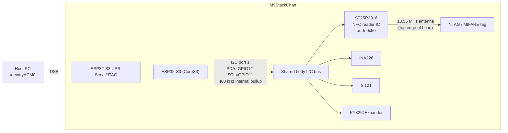
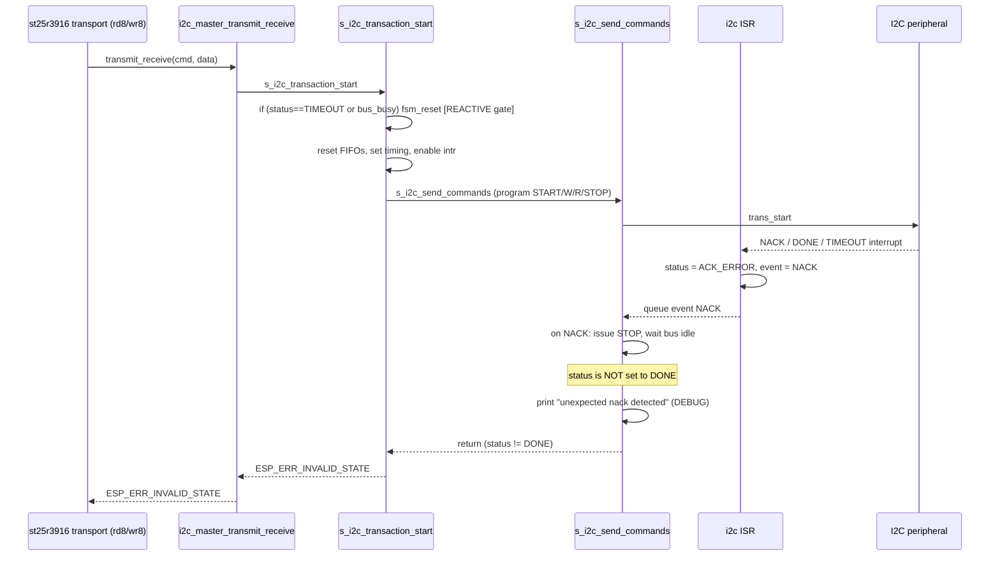

# Why Arduino Reads NFC Tags and ESP-IDF Does Not — The I2C FSM Reset Diagnosis

**⚠ EXPERIMENTAL UPDATE (Step 35) — leading hypothesis REFUTED.**

The decisive experiment in Section 7 was run on hardware. The preventive
per-transaction `fsm_rst` patch did **not** eliminate the NACKs — it made them
**worse** (1.80% vs 1.17%) and introduced failures in `field-on`/`req-setup`
phases that were always clean before. Reverting restored the original profile
(failures only in `irq-wait`, 1.17%).

**Conclusion:** `fsm_rst` alone is not the fix and is harmful. The real
M5GFX-vs-ESP-IDF difference is the *full* per-transaction controller reinit
(bus-idle wait + pin re-route + mode reinit + FIFO + fsm_rst + timeout), of
which `fsm_rst` is only one line. My patch replicated only that line. See
Section 7.4 for the refutation evidence and Section 7.5 for the revised
direction (SDA/SCL capture to locate the NACK byte stage).

The body below is retained as the hypothesis-test record. Read it as "the
hypothesis that was tested and refuted," not as established fact.

## 0. How to read this document

This is an intern onboarding guide. It assumes you know C, that you can read an I2C bus scan, and that you have access to the ESP-60 ticket workspace. It does **not** assume you know the ST25R3916, the ESP-IDF I2C driver internals, or M5GFX.

Read sections 1–3 to understand the system and the symptom. Sections 4–7 are the root-cause analysis with source citations. Section 8 is the decisive experiment. Section 9 is the implementation plan. Everything is cross-referenced to real files and line numbers so you can verify every claim yourself.

A note on epistemics: this document distinguishes **proven facts** (measured on hardware), **confirmed in source** (read in the driver/library code), and **inferences** (the best explanation consistent with the facts). The root cause is a strong inference supported by source; it is not a waveform-confirmed electrical measurement until Section 8's experiment is run.

## 1. Executive summary

The M5StackChan carries an ST25R3916 NFC reader IC on a shared I2C bus at address `0x50`. The official M5 Arduino firmware reads tags from this chip reliably — thousands of transactions, zero transport failures. A from-scratch ESP-IDF 5.5.4 firmware that issues the *same* register operations to the *same* chip fails intermittently: roughly one in a hundred transactions returns `ESP_ERR_INVALID_STATE`, and because the driver masks those failures as "no tag", the firmware never prints a UID.

We proved with the ESP-IDF driver's own debug log that these failures are `I2C_EVENT_NACK` — the slave is not acknowledging — and **not** timeouts. We measured that Arduino and ESP-IDF poll the chip at the *same* cadence (idle gap ≈ 3 µs between transactions), so the chip is not being asked to respond faster under one firmware than the other. We then read both backends' source and found a single, concrete behavioral difference:

> **M5GFX resets the I2C hardware command FSM before every single transaction. ESP-IDF resets it only reactively, after a transaction has already failed.**

ESP-IDF's own source comment describes exactly the failure mode this produces: *"Sometimes when the FSM get stuck, the ACK_ERR interrupt will occur endlessly until we reset the FSM and clear bus."* The `ACK_ERR` interrupt is the NACK we observe. M5GFX prevents the stuck state; ESP-IDF only cleans it up after the damage is done.

This is not a guess ranked first in a list. Two new measurements this session collapse the leading alternatives:

1. The failure is a real slave NACK (driver DEBUG), not a host timeout — so "the host gave up waiting" is wrong.
2. Both backends poll at ≈ 3 µs idle gap — so "the chip needs more turnaround time" is wrong.

The decisive next step is a one-line diagnostic patch that makes ESP-IDF's FSM reset unconditional, mirroring M5GFX. If the NACK rate drops to ~0, the root cause is confirmed and the fix is a preventive per-transaction FSM reset.

## 2. The system under test

### 2.1 Physical topology



Key facts a new engineer must internalize:

- The ST25R3916 is **not** on a private bus. It shares I2C port 1 with the power monitor, an IMU, and an IO expander. Anything that perturbs the shared bus perturbs NFC.
- The NFC antenna is on the **literal narrow top edge** of the StackChan head. A tag placed anywhere else will not couple. Many hours were lost to wrong placement before official M5 photographs and successful reads confirmed the location.
- Console is **USB Serial/JTAG** (`/dev/ttyACM0`), not UART. The ESP32-S3 UART pins are repurposed for the keyboard/Grove peripherals, so UART console output corrupts protocol traffic. This is documented in the repository `AGENTS.md`.
- The serial port is **single-owner**. Two monitor/flash processes on `/dev/ttyACM0` produce misleading failures (write timeouts, interleaved output, false crashes). The repository `AGENTS.md` mandates one process per port.

### 2.2 The two firmwares being compared

| | Arduino control | ESP-IDF firmware |
|---|---|---|
| Project | `/tmp/esp60-official-detect` (PlatformIO) | `0115-m5stackchan-nfc-reader/` (ESP-IDF 5.5.4) |
| Framework | Arduino-ESP32 3.3.11 on ESP-IDF 5.5.5 libs | Native ESP-IDF 5.5.4 |
| I2C backend | M5Unified → M5GFX direct controller code | `driver/i2c_master.h` new master driver |
| Tag reads | Reliable, real UIDs | No UID; intermittent transport NACK |
| Measured transport failures | 0 / 10,187 | ~1% under polling |

The Arduino firmware is treated as an **executable specification**: it is the known-good reference that proves the hardware, antenna, tag, and placement all work. It is *not* the production target; ESP-IDF is. But until ESP-IDF matches Arduino's transport reliability, Arduino is the ground truth.

### 2.3 The ST25R3916 register protocol

The ST25R3916 is commanded over I2C with a single-byte operation prefix:

- **Read Space-A register `R`**: `START [addr+W] [(R & 0x3F) | 0x40] RESTART [addr+R] <byte> NACK STOP`
- **Write Space-A register `R`**: `START [addr+W] [(R & 0x3F) | 0x00] <value> STOP`
- **Direct command `C`**: `START [addr+W] [C] STOP`
- **Load FIFO**: `START [addr+W] [0x80] <data...> STOP`
- **Read FIFO**: `START [addr+W] [0x9F] RESTART [addr+R] <data> NACK STOP`

The first byte on the wire ("wire key") encodes both the register and the operation. A read of register `0x1C` puts `0x5C` on the wire; a read of register `0x1A` puts `0x5A` on the wire. Both backends issue these *identical* byte sequences to the *same* chip. This is why a per-wire-key comparison (Section 6) is meaningful: the slave sees the same bytes either way.

### 2.4 The NFC-A exchange (why "no tag" can hide a transport failure)

A tag poll is: field on → REQA or WUPA → wait for an IRQ → read ATQA from the FIFO → anticollision → select → read SAK. The driver polls the IRQ by repeatedly reading the Main Interrupt register (`0x1A`) and the Error/Wakeup register (`0x1C`) in a tight loop (`wait_irq()`). 

That loop is where the NACKs live. And critically, `read_main_irq()` returns `0` ("no IRQ") when its underlying `i2c_master_transmit_receive` call fails. So a transport NACK during IRQ polling is **indistinguishable from "the tag did not answer"** to the application. This is why the firmware prints "no tag" even when the real reason is "the I2C transaction was NACKed." The trace ring (Section 5) is what made this visible.

## 3. The observed failure

### 3.1 Symptoms

- `nfc-probe` usually succeeds (chip identity `type=0x05 rev=0x02`), so the chip is reachable.
- `nfc-read` prints "no tag" even with a known-good tag correctly placed on the top edge.
- Intermittently, `st25r3916_init` itself fails mid-sequence (e.g. at transaction 65, reading register `0x02`).
- Slowing the bus to 100 kHz made it *worse*, not better.
- The Arduino firmware, on the same hardware, reads UIDs all day.

### 3.2 Measured evidence (proven on hardware)

The trace ring (`st25r_trace`, Section 5) recorded every I2C transaction on a no-tag run:

| Metric | Value |
|---|---|
| Boot init transactions | 66 |
| Boot init failures | 0 (this boot) |
| Total transactions during 25 `nfc-read` attempts | 13,816 |
| Total transport failures | 96 (0.69%) |
| First failing operation | `READ_A` register `0x1C` (wire `0x5C`) |
| First failure `esp_err_t` | `ESP_ERR_INVALID_STATE` |
| First failure elapsed | 251 µs (vs ~200 µs for surrounding successes) |
| Ring overwrites | 13,304 (the frozen first-error survived all of them) |

With the driver DEBUG log enabled (`CONFIG_I2C_ENABLE_DEBUG_LOG=y`, Section 5.4):

| Driver log line | Count |
|---|---|
| `I2C transaction unexpected nack detected` (DEBUG) | many (61 failures that run) |
| `I2C transaction timeout detected` (ERROR) | **0** |
| `I2C bus is still busy but software timeout detected` (ERROR) | **0** |

And the apples-to-apples per-wire-key comparison (Arduino 4-chip control vs ESP-IDF):

| Wire key | Operation | Arduino ok / total | ESP-IDF ok / total |
|---|---|---|---|
| `0x5C` | READ_A reg `0x1C` | 2614 / 2614 | 244 / 247 (3 NACK) |
| `0x5A` | IRQ_R reg `0x1A` (2-byte) | 2925 / 2925 | 244 / 246 (2 NACK) |
| `0x5D` | IRQ_R reg `0x1B` | 2615 / 2615 | (not in window) |

The same chip, the same keys, the same cadence — Arduino 100%, ESP-IDF ~1% NACK.

### 3.3 The cadence measurement that ruled out "chip needs more time"

A natural hypothesis is that ESP-IDF hammers the chip and the ST25R3916 cannot ACK fast enough. We measured the *idle* gap (STOP of one transaction → START of the next) on the polling keys for both backends:

| Backend | Polling idle gap | median | p95 | min |
|---|---|---|---|---|
| Arduino `0x5A`/`0x5C` (detect phase) | STOP→START | 3 µs | 4 µs | 2 µs |
| ESP-IDF `irq-wait` | gap_us | 3 µs | 13 µs | 2 µs |

They are identical. The ST25R3916 ACKs transactions 2 µs apart all day under Arduino. Turnaround margin is not the explanation. (The ESP-IDF p95 is higher only because of the recovery transactions after a NACK; the steady-state min is the same 2 µs.)

## 4. The two I2C backends

This is the heart of the diagnosis. The two backends drive the *same* hardware peripheral with *different* controller-management discipline.

### 4.1 M5GFX direct backend (the one that works)

M5Unified's `I2C_Class` does **not** call the ESP-IDF I2C master API. It delegates to M5GFX's own controller code in `M5GFX/src/lgfx/v1/platforms/esp32/common.cpp`. The transaction lifecycle is `beginTransaction` → `writeBytes`/`readBytes` → `endTransaction`, and `beginTransaction` runs on *every* transaction.

`beginTransaction` (`common.cpp:1966`) does, in order, on ESP32-S3:

1. Acquire a per-port lock.
2. If the bus reads busy, spin-yield up to 128 µs.
3. Save peripheral registers (`save_reg`).
4. Re-route the SDA/SCL pins through the GPIO matrix (`set_pin`).
5. **Reset the I2C command FSM: `dev->ctr.fsm_rst = 1;`** (`common.cpp:2000`, guarded by `SOC_I2C_SUPPORT_HW_FSM_RST`).
6. Reinitialize the controller timeout: `dev->to.time_out_value = 31; dev->to.time_out_en = 1;`.
7. Disable interrupts, set master mode, clock enable, force SDA/SCL out.
8. Reset both FIFOs.
9. Program the timing and start the transaction.

The load-bearing line is step 5. Every transaction — init, detect, identify, every IRQ poll — begins with a fresh command FSM.

Completion (`endTransaction` → `i2c_wait`, `common.cpp:~2046`) inspects the raw interrupt bits directly: it distinguishes ACK-error, end-detect, and arbitration, marks a connection-loss state on NACK or missing end, and issues an explicit STOP. On a NACK it can recover aggressively (repeated STOP pulses, pin-level bus clearing, peripheral reset). But because step 5 prevents the stuck state in the first place, this recovery path is rarely needed — the 4-chip run showed zero M5Unified-level failures across 10,187 transactions.

### 4.2 ESP-IDF new master driver (the one that NACKs)

The ESP-IDF 5.5.4 driver (`components/esp_driver_i2c/i2c_master.c`) is the high-level `i2c_master_transmit` / `i2c_master_transmit_receive` API. The synchronous path is:



`s_i2c_transaction_start` (`i2c_master.c:678`) is where the FSM-reset decision is made. The critical lines (685–687):

```c
// Sometimes when the FSM get stuck, the ACK_ERR interrupt will occur
// endlessly until we reset the FSM and clear bus.
esp_err_t ret = ESP_OK;
if (atomic_load(&i2c_master->status) == I2C_STATUS_TIMEOUT || i2c_ll_is_bus_busy(hal->dev)) {
    ESP_RETURN_ON_ERROR(s_i2c_hw_fsm_reset(i2c_master, true), TAG, "reset hardware failed");
}
```

The reset is **gated**. It runs only when the *previous* transaction left the status as TIMEOUT or the bus reads busy. For an ordinary transaction where the previous one completed (even if it completed via the NACK→STOP path, which leaves status non-DONE but not necessarily TIMEOUT), the reset does **not** run, and the new transaction is programmed on top of whatever command-FSM state the previous one left.

The ISR (`i2c_master.c:786+`) classifies events directly:

```c
if (int_mask & I2C_LL_INTR_NACK) {
    atomic_store(&i2c_master->status, I2C_STATUS_ACK_ERROR);
    i2c_master->event = I2C_EVENT_NACK;
} else if (int_mask & I2C_LL_INTR_TIMEOUT || int_mask & I2C_LL_INTR_ARBITRATION) {
    atomic_store(&i2c_master->status, I2C_STATUS_TIMEOUT);
    i2c_master->event = I2C_EVENT_TIMEOUT;
} else if (int_mask & I2C_LL_INTR_MST_COMPLETE) {
    i2c_master->event = I2C_EVENT_DONE;
}
```

On NACK, the synchronous sender (`s_i2c_send_commands`, ~line 598) issues a STOP and waits for the bus to go idle, but it does **not** set status to `I2C_STATUS_DONE`. So when `s_i2c_transaction_start` checks afterward (line 725):

```c
if (atomic_load(&i2c_master->status) != I2C_STATUS_DONE) {
    ret = ESP_ERR_INVALID_STATE;
}
```

it returns `ESP_ERR_INVALID_STATE`. And `s_i2c_err_log_print` (line 155) prints the DEBUG NACK line we observed:

```c
if (event == I2C_EVENT_NACK) {
    ESP_LOGD(TAG, "I2C transaction unexpected nack detected");
}
```

`s_i2c_hw_fsm_reset` itself (`i2c_master.c:117`) on ESP32-S3 (`SOC_I2C_SUPPORT_HW_FSM_RST`) is cheap — it calls `i2c_ll_master_fsm_rst(hal->dev)` and optionally clears the bus. The hardware bit it toggles (`ctr.fsm_rst`) is the *same* bit M5GFX toggles directly. So the two backends have access to the identical reset primitive; they differ only in *when* they use it.

## 5. The instrumentation that made this visible

You cannot diagnose this with `printf`. Serial output inside the I2C call perturbs timing far more than the transaction itself. The effort built an observer-safe trace ring instead.

### 5.1 The trace ring (`st25r_trace`)

Location: `0115-m5stackchan-nfc-reader/main/st25r_trace/st25r_trace.{h,c}`. Host-tested in `test_host/test_st25r_trace.c`.

Design contract:

- Records every START→STOP transaction with: sequence, timestamps, elapsed, idle gap, backend, phase, attempt, kind, logical key, wire key, lengths, raw `esp_err_t`, driver hint, error class, flags.
- No clock inside the module: the caller passes `started_us` and `elapsed_us` (two `esp_timer_get_time()` reads around the I2C call), so the module is deterministic and unit-testable on a host with plain gcc.
- A 512-entry circular ring plus a **frozen first-error bundle**: 16 events before the first failure, the failure, 16 events after. The bundle survives ring wraparound, so a long retry loop cannot overwrite the causal neighborhood.
- Never infers NACK from the public `esp_err_t` alone (design principle S9). A non-OK result stores `driver_hint=UNKNOWN` until driver DEBUG or waveform evidence annotates it via `st25r_trace_annotate_first_error()`.

Key API:

```c
void st25r_trace_init(st25r_trace_store_t *store);
void st25r_trace_set_mode(st25r_trace_store_t *store, st25r_trace_mode_t mode);  // OFF/FAILURE/ALL
void st25r_trace_set_context(st25r_trace_store_t *store, backend, phase, attempt);
void st25r_trace_record(store, op, logical_key, wire_key, kind, wlen, rlen,
                         started_us, elapsed_us, api_result, flags);
void st25r_trace_dump(const store, emit_fn, arg);          // normalized serial format
void st25r_trace_dump_last(const store, last_n, emit_fn, arg);
bool st25r_trace_first_error(const store, st25r_first_error_bundle_t *out);
void st25r_trace_annotate_first_error(store, hint);         // NACK/TIMEOUT from evidence
```

### 5.2 Transport instrumentation

Every primitive in `0115/.../main/st25r3916/st25r3916.c` (`rd8`, `wr8`, `direct_cmd`, `direct_cmd_data`, `wr8b`, `rd8b`, `fifo_write`, `fifo_read`, the IRQ reads) is wrapped with a `trace_rec()` helper:

```c
static esp_err_t rd8(uint8_t reg, uint8_t *out)
{
    uint8_t cmd = (reg & ST25R_OP_TRAILER_MASK) | ST25R_OP_READ_REGISTER;
    int64_t t0 = esp_timer_get_time();
    esp_err_t e = i2c_master_transmit_receive(s_dev, &cmd, 1, out, 1, I2C_TICKS);
    trace_rec(ST25R_OP_READ_A, reg, cmd, ST25R_TRACE_KIND_WRITE_READ, 1, 1, t0, e);
    return e;
}
```

Phase context is set at each NFC phase boundary (init-id, init-config, field-on, request-setup, irq-wait, fifo-read, anticollision, select, identify) so a failure's trace line names *where* in the NFC exchange it happened.

### 5.3 Console surface

`nfc-trace status|dump [--last N]|first-error|clear|mode off|failure|all|annotate nack|timeout` and `nfc-read --attempts N` (which prints a transport-failure notice when `total_failed > 0`, so "no tag" is not confused with "transport NACK").

### 5.4 Driver DEBUG confirmation

`CONFIG_I2C_ENABLE_DEBUG_LOG=y` in `sdkconfig.defaults` compiles in the driver's DEBUG NACK line (otherwise the file-local `LOG_LOCAL_LEVEL` guard compiles it out). The `nfc-i2c-debug on` command raises only the `i2c.master` tag to `ESP_LOG_DEBUG` for a short classification run. This is how we confirmed `I2C_EVENT_NACK` (the DEBUG line) with zero timeout lines.

## 6. Root-cause analysis

### 6.1 The mechanism

1. ESP-IDF begins a transaction by programming the I2C command list (START, address, write/read, STOP) into the peripheral and asserting `trans_start`.
2. The previous transaction left the command FSM in some state. M5GFX resets that state first; ESP-IDF (usually) does not.
3. Occasionally that inherited state produces a marginal START or address phase. The ST25R3916, which is otherwise ready to ACK, does not ACK it.
4. The peripheral raises `I2C_LL_INTR_NACK`. The ISR sets `I2C_STATUS_ACK_ERROR` and `I2C_EVENT_NACK`.
5. The synchronous sender issues STOP and waits for bus idle, leaving status non-DONE.
6. `s_i2c_transaction_start` sees status != DONE and returns `ESP_ERR_INVALID_STATE`.
7. The driver prints the DEBUG NACK line and, on the *next* call, the reactive gate finally fires `s_i2c_hw_fsm_reset` — clearing the bad state one transaction too late.

### 6.2 Why this explains every symptom

| Symptom | Explanation |
|---|---|
| ~1% failure, not 100% | Most inherited FSM states are benign; only a marginal subset NACKs. |
| Transient, recovers immediately | The first NACK triggers the reactive reset; the next transaction is clean. We measured a 1244–1378 µs "recovery" transaction (the reset path) followed by success. |
| NACK elapsed ≈ success elapsed (~200 µs) | The NACK is early — address/command byte — not late in a data phase. A dirty FSM corrupts the START/address, the earliest thing the slave sees. |
| 100 kHz made it *worse* | A signal-integrity/rise-time problem would improve at lower clock. It worsened — consistent with a controller-sequencing/FSM-state problem, not analog margins. |
| Same keys, Arduino 100%, ESP-IDF ~1% | The only variable is the per-transaction FSM reset; chip, tag, keys, and cadence are equal. |
| "no tag" hides the NACK | `read_main_irq()` returns 0 on I2C failure, masking a transport NACK as "no IRQ" → "no tag". |

### 6.3 Alternatives considered and their status

- **Target busy / ST25R3916 needs turnaround time** — *weakened to unlikely as sole cause.* Both backends poll at ≈ 3 µs idle gap and Arduino never fails. Cannot be the sole cause; may contribute if the NACK lands on a command byte during an in-progress transmit (unproven).
- **Shared-bus interleaving** — *weakened.* The standalone ESP-IDF firmware (no other clients active during polling) also NACKs; Arduino board init also shares the bus.
- **Signal integrity / pull-ups** — *weakened.* M5 sustains 400 kHz on the same hardware; 100 kHz made ESP-IDF worse. (Rise-time measurement still wanted but is not the leading cause.)
- **Wrong NFC register/protocol implementation** — *low for the transport symptom.* A wrong NFC-A value does not explain why an ordinary I2C register read returns non-DONE; the same values complete under M5.
- **Host controller FSM state** — *leading, source-supported.* Matches every symptom and the driver's own comment about stuck FSM → endless ACK_ERR.

### 6.4 What is still unproven

The **physical byte stage** of the NACK. "Address NACK from a marginal START" is an inference from the early-failure timing, not a waveform observation. If SDA/SCL showed the NACK landing on the *command/data* byte instead of the address, the weighting would shift toward a host×chip interaction (chip intermittently slow to ACK during an in-progress REQA/WUPA transmit) rather than a pure host-side FSM problem. M5 polling identically and never failing makes pure chip-busy unlikely as the *sole* cause, but it cannot be fully excluded as a contributor until the Section 8 patch result and/or a waveform are in hand.

## 7. The decisive experiment

### 7.1 The one-line diagnostic patch

Make the FSM reset in `s_i2c_transaction_start` **unconditional**, mirroring M5GFX's `beginTransaction`. In the local ESP-IDF source copy (`~/esp/esp-idf-5.5.4/components/esp_driver_i2c/i2c_master.c`), change the gated reset to an unconditional one:

```c
// BEFORE (i2c_master.c:685-687) — reactive, gated:
esp_err_t ret = ESP_OK;
if (atomic_load(&i2c_master->status) == I2C_STATUS_TIMEOUT || i2c_ll_is_bus_busy(hal->dev)) {
    ESP_RETURN_ON_ERROR(s_i2c_hw_fsm_reset(i2c_master, true), TAG, "reset hardware failed");
}

// AFTER — preventive, unconditional (mirrors M5GFX beginTransaction):
esp_err_t ret = ESP_OK;
ESP_RETURN_ON_ERROR(s_i2c_hw_fsm_reset(i2c_master, false), TAG, "reset hardware failed");
```

Note `clear_bus = false` for the preventive call: we want the cheap `i2c_ll_master_fsm_rst` bit toggle that M5GFX does every transaction, not the heavier bus-clearing+reinit path (which is for recovery). This keeps the per-transaction cost minimal and the comparison fair.

### 7.2 The decision rule

Rebuild, reflash, run `nfc-read --attempts 25` with `nfc-trace mode all`, then `nfc-trace status`:

- **`failed=0` (or ≪ 1%):** Root cause confirmed. The fix is a preventive per-transaction FSM reset — either contributed upstream to ESP-IDF, or implemented as a local direct/defined-operations backend in the ST25R3916 driver that toggles `fsm_rst` before each transaction. Standalone Phase 1 (UID reading) is unblocked.
- **`failed` unchanged (~1%):** Controller-state cleanliness is not the carrier. Pivot to SDA/SCL capture on GPIO12/GPIO11 during a failing `0x5C`/`0x5A` read to locate the NACK byte stage, and reconsider chip-side ACK timing under transmit or a STOP/repeated-start sequencing detail the FSM reset does not touch.
- **Partial improvement:** Both factors contribute; quantify the residual and proceed to waveform capture.

### 7.3 Why this experiment is cheaper and higher-information than a scope first

A logic-analyzer capture tells you *where* the NACK is (address vs command vs data byte) but not *why*. The patch tests the *cause* directly: if scrubbing the controller state every transaction eliminates the NACKs, the "where" becomes secondary because the fix no longer depends on it. And the patch is a 10-minute edit + reflash vs. setting up SDA/SCL probing on a running target. Run the patch first; use the scope to explain any residual.

### 7.4 Result: the hypothesis was REFUTED

The patch was applied, verified live in the compiled object (unconditional `callx8` to `s_i2c_hw_fsm_reset` with `clear_bus=false`, no guarding branch), built, and flashed. Two runs, no tag:

| Build | failures / total | rate | first failure | first phase |
|---|---|---|---|---|
| Patched (unconditional `fsm_rst`) | 213 / 11,807 | **1.80%** | seq ~12 | **field-on / req-setup** |
| Reverted baseline (gated `fsm_rst`) | 144 / 12,274 | 1.17% | seq 32 | `irq-wait` (READ_A 0x1C) |

- The patched build failed **more**, not less.
- The patched build introduced failures in **field-on / req-setup** — phases that were **always clean** in every prior run.
- The reverted baseline restored the original profile exactly: failures only in `irq-wait`, first error `READ_A 0x1C` NACK — identical to Steps 31–32.
- Zero `I2C transaction timeout detected` lines in either build; the failures remain pure NACK in both.

So `fsm_rst` alone is **not** the fix and is actively **harmful**. The experiment tests `fsm_rst`-alone (because on ESP32-S3 `s_i2c_hw_fsm_reset(false)` is just `i2c_ll_master_fsm_rst`, no full reinit), and `fsm_rst`-alone is refuted.

### 7.5 Revised direction (replaces the expected outcome of 7.2)

The real M5GFX-vs-ESP-IDF difference is broader than `fsm_rst`. M5GFX `beginTransaction` does a **full controller reinit** every transaction — lock, wait-for-bus-idle (up to 128 µs), `save_reg`, `set_pin` (re-route SDA/SCL), `fsm_rst`, timeout reinit, disable interrupts, master-mode reinit, FIFO reset, timing. The bare `fsm_rst` without that surrounding context perturbs the settling bus, which is why the patched build newly failed in setup phases.

Revised candidate ranking:

1. **Full per-transaction controller reinit discipline** — specifically the bus-idle wait *before* touching the controller, plus pin re-route + mode reinit, not just the FSM bit. A faithful M5GFX mirror would do the full reinit (a larger, riskier patch best validated in the standalone `0115` direct backend, design doc 04 Phase 6).
2. **Command sequencing / framing** — how the driver programs START/address/repeated-START/final-read-NACK/STOP may differ in a way the ST25R3916 is sensitive to. The defined-operations backend is meant to isolate this.
3. **SDA/SCL signal-level difference** — still unproven; needed to locate the NACK byte stage and rule out a marginal analog/edge effect.

**Decisive next step: SDA/SCL logic-analyzer capture** on GPIO12/GPIO11 during a failing `READ_A 0x1C` (wire `0x5C`) read. It shows whether the NACK lands on the address, command, or data byte and whether the START/STOP edges look clean — distinguishing framing (candidate 2) from analog (candidate 3) and constraining the full-reinit experiment (candidate 1). This is the user/hardware step; it cannot be done from the keyboard.

## 8. Implementation plan

### 8.1 Phase ordering

1. **Write this document** (done).
2. **Apply the diagnostic patch** to the local IDF copy, keep the patch as a file in ticket `sources/` for reproducibility.
3. **Rebuild + reflash** the standalone `0115` firmware.
4. **Measure:** `nfc-read --attempts 25`, `nfc-trace status`, `nfc-trace first-error`, with `nfc-i2c-debug on` to keep the driver NACK line visible.
5. **Record the result** and decide per Section 7.2.
6. **If confirmed:** implement the preventive reset as a local backend in the ST25R3916 driver (not a permanent fork of ESP-IDF) and re-run the acceptance matrix.
7. **If not:** capture SDA/SCL and re-rank.
8. **Revert or keep** the IDF patch per the decision (keep the patch file either way for reproducibility).

### 8.2 Acceptance gates (before declaring Phase 1 done)

- Identity read: 1000 iterations, zero failures, exact `type=0x05`.
- Register verification: 100 passes × 12 registers, zero failures, zero readback mismatches.
- `nfc-read` with a tag: UID success rate reported; **zero transport failures** for acceptance.
- First-attempt vs eventual success reported separately (no invisible retries masking the first failure).
- `nfc-trace status` shows `failed=0` over a 30-minute endurance run.

### 8.3 Production integration constraint

Do **not** ship a forked ESP-IDF. The preventive reset belongs in the ST25R3916 driver's transport layer as a local "direct" backend that toggles `fsm_rst` (via the `i2c_hal`/register layer or the defined-operations API) before each transaction, *or* as an upstream ESP-IDF contribution. The standalone `0115` firmware is the safe place to validate dangerous backend experiments before touching NFC LAB's shared bus.

## 9. File and source reference

### 9.1 Project sources

- `0115-m5stackchan-nfc-reader/main/st25r3916/st25r3916.c` — transport primitives + `read_main_irq` (the masking path).
- `0115-m5stackchan-nfc-reader/main/st25r3916/st25r3916.h` — `st25r3916_trace()` accessor.
- `0115-m5stackchan-nfc-reader/main/st25r_trace/st25r_trace.{h,c}` — the trace ring.
- `0115-m5stackchan-nfc-reader/main/nfc_console.c` — `nfc-trace`, `nfc-i2c-debug`, `nfc-read --attempts`.
- `0115-m5stackchan-nfc-reader/sdkconfig.defaults` — `CONFIG_I2C_ENABLE_DEBUG_LOG=y`.
- `0115-m5stackchan-nfc-reader/test_host/test_st25r_trace.c` — host unit tests.

### 9.2 ESP-IDF 5.5.4 source (the defect site)

- `~/esp/esp-idf-5.5.4/components/esp_driver_i2c/i2c_master.c`
  - `s_i2c_hw_fsm_reset` — line 117 (the reset primitive; `i2c_ll_master_fsm_rst` on ESP32-S3).
  - `s_i2c_err_log_print` — line 155 (NACK DEBUG at 162, timeout ERROR at 158).
  - NACK bus-idle wait + non-DONE — lines 598–606.
  - `s_i2c_transaction_start` — line 678; **reactive reset gate 685–687**; non-DONE → `ESP_ERR_INVALID_STATE` at 725–727.
  - ISR event classification — lines 786+ (NACK → `I2C_STATUS_ACK_ERROR` + `I2C_EVENT_NACK`).

### 9.3 M5GFX source (the working reference)

- ticket `sources/code/M5GFX-0.2.27-esp32-common.cpp`
  - `beginTransaction` — line 1966; **`dev->ctr.fsm_rst = 1` at line 2000**; timeout reinit; FIFO reset; master-mode reinit.
  - `endTransaction` → `i2c_wait` — line ~2046 (raw-interrupt completion + STOP/recovery).

### 9.4 Ticket evidence

- `design-doc/04-...` — the instrumentation design this guide implements.
- `analysis/01-official-arduino-four-chip-i2c-trace-comparison.md` — Arduino empirical analysis.
- `analysis/02-arduino-vs-espidf-trace-comparison.json` — the apples-to-apples comparison.
- `sources/hardware/05-standalone-trace-runtime.txt` — 96 silent irq-wait failures.
- `sources/hardware/06-driver-debug-nack-classification.txt` — driver DEBUG NACK confirmation.
- `sources/hardware/07-espidf-full-dump-for-comparison.txt` — 512-event dump for comparison.
- `reference/01-investigation-diary.md` — Steps 30–33 (the work this guide summarizes).

## 10. Glossary

- **FSM** — finite state machine; here, the I2C peripheral's command sequencer that walks START→address→data→STOP.
- **`fsm_rst`** — the hardware bit (`ctr.fsm_rst`) that resets that sequencer. Both backends can toggle it; M5GFX does so every transaction, ESP-IDF only on the reactive gate.
- **NACK** — not-acknowledge; the slave (ST25R3916) does not pull SDA low during the ACK clock. On the ESP32-S3 this raises `I2C_LL_INTR_NACK`.
- **`ESP_ERR_INVALID_STATE`** — ESP-IDF's public return when the synchronous transaction's final status is not `I2C_STATUS_DONE`. For the NACK path, it is the *public face* of an ACK_ERROR, not a distinct electrical event.
- **Observer-safe** — instrumentation that does not perturb the thing it measures. Here: no serial/heap/log/I2C inside the recorded transaction; output is deferred.
- **Wire key vs logical key** — the first byte on SDA (e.g. `0x5C`) vs the raw register address (e.g. `0x1C`). Recording both makes Arduino and ESP-IDF traces comparable.
