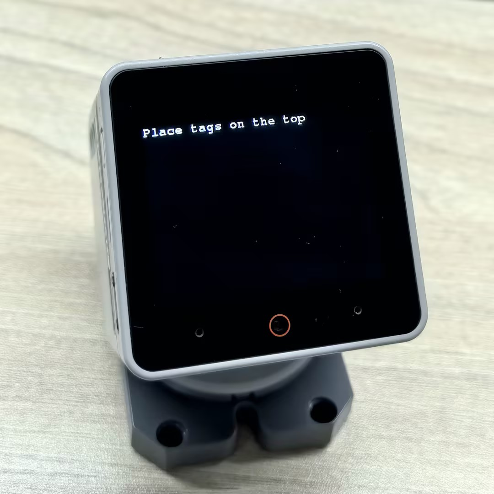
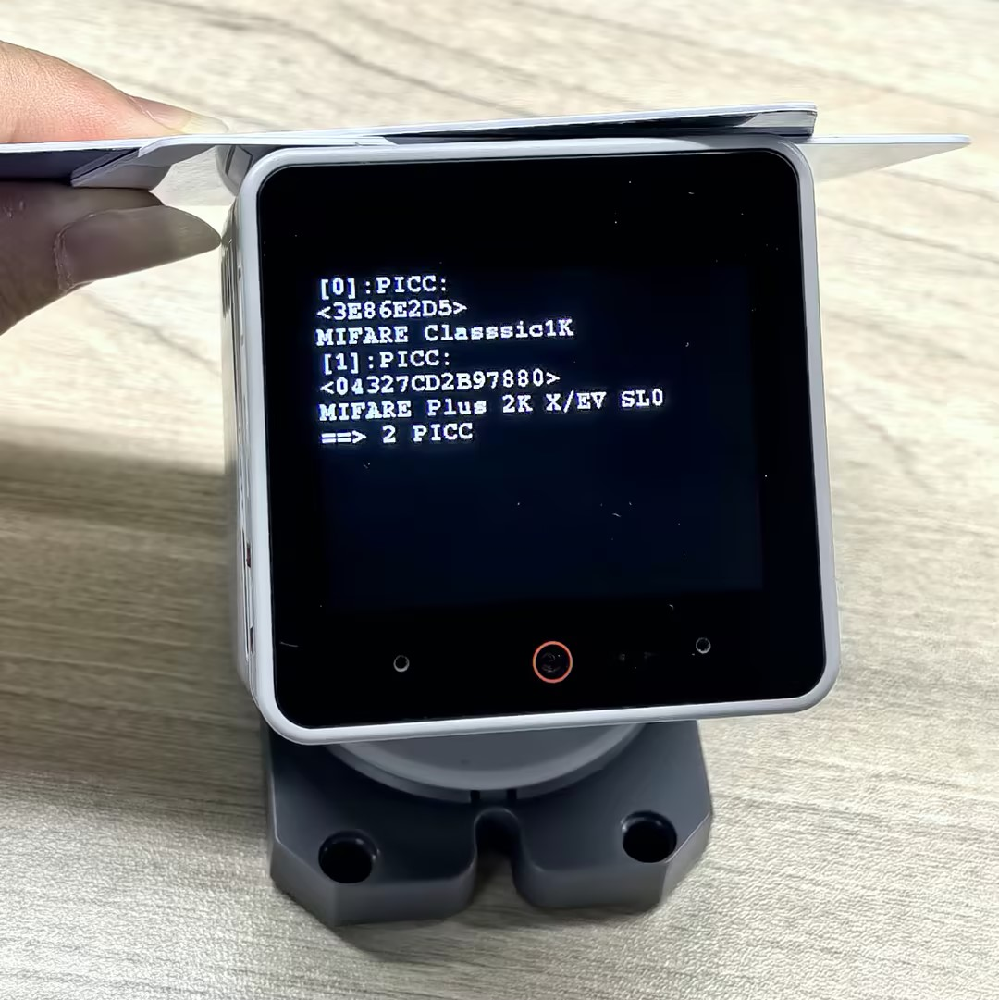

# Official M5 StackChan NFC placement images

Source page: https://docs.m5stack.com/en/arduino/stackchan/nfc
Publisher: M5Stack
Captured: 2026-08-21

## Placement finding

The official Quick Scan photographs show NFC cards laid horizontally across the **literal narrow top edge / roof of the StackChan head**, not against the front display glass.

Local preserved assets:

- `assets/StackChan_Quick_Scan_1.jpg` — device prompt: “Place tags on the top.”
- `assets/StackChan_Quick_Scan_2.jpg` — two cards visibly resting across the head’s top edge while two PICCs are detected.

Original asset URLs:

- https://m5stack-doc.oss-cn-shenzhen.aliyuncs.com/1205/StackChan_Quick_Scan_1.jpg
- https://m5stack-doc.oss-cn-shenzhen.aliyuncs.com/1205/StackChan_Quick_Scan_2.jpg

