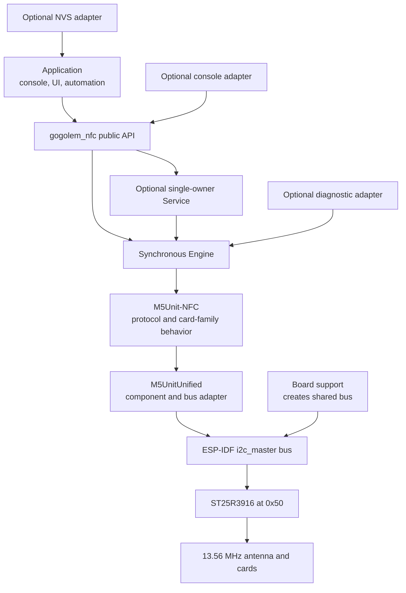
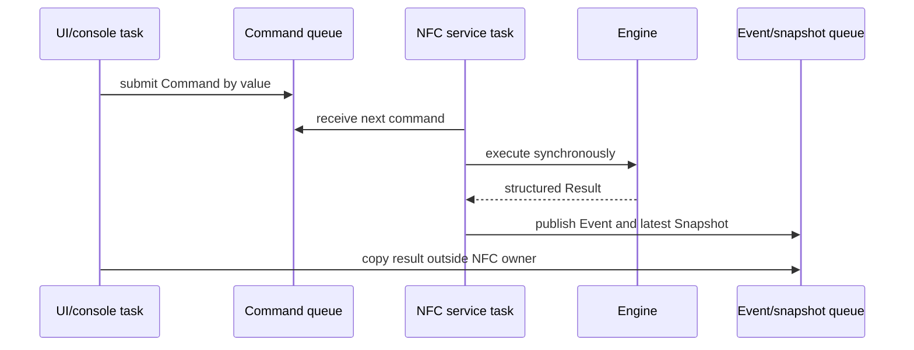
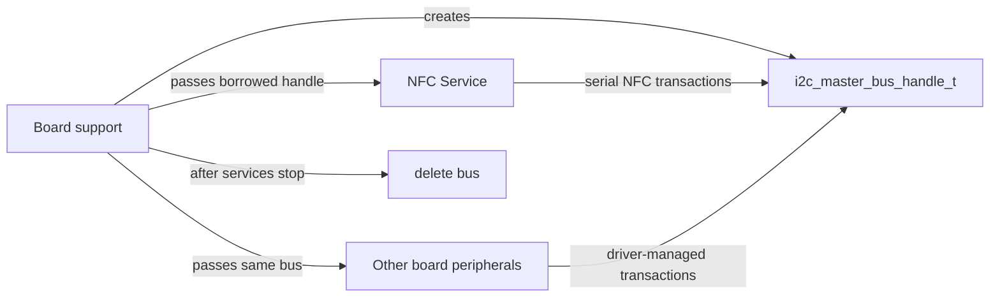
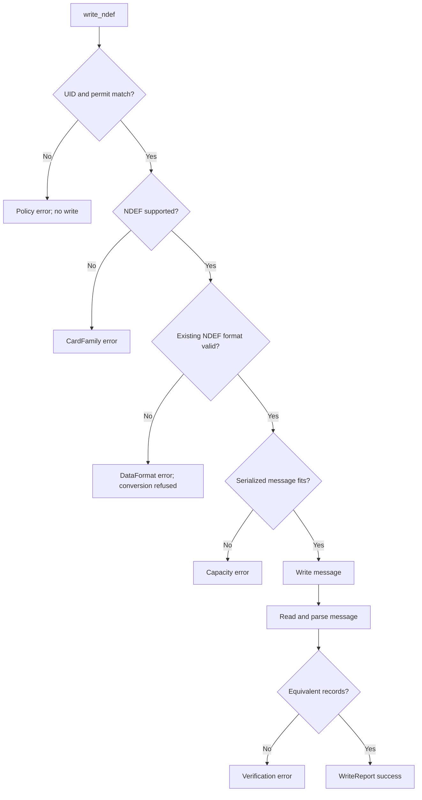
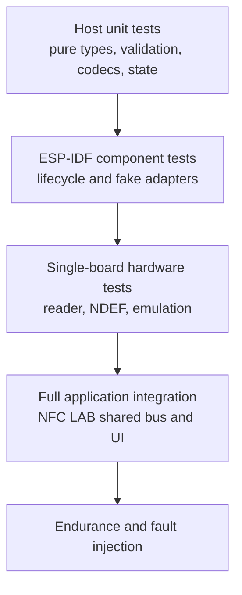

# Reusable Native ESP-IDF NFC Component Analysis, Design, and Intern Implementation Guide

## 1. Executive summary

The repository contains a complete body of proven NFC behavior, but it does not yet contain one clean, drop-in ESP-IDF component that another application can consume without carrying diagnostic-console policy with it. Three implementations serve different purposes:

1. `0115-m5stackchan-nfc-reader` is a minimal C transport, RF, NFC-A anticollision, and UID regression harness. It contains the cleanest low-level diagnostic assets, especially the observer-safe `st25r_trace` ring, but its ST25R3916 driver uses process-wide static state and implements only the narrow reader path required to prove a UID.
2. `0116-m5stackchan-nfc-debug-ui` demonstrates the correct application runtime pattern: the application obtains the existing board I²C bus, one worker owns NFC operations, UI callbacks enqueue commands, and the UI consumes immutable snapshots. Its driver predates the final standalone protocol corrections and it remains embedded inside an application overlay.
3. `0117-m5stackchan-nfc-feature-explorer` proves broad native ESP-IDF behavior through the official M5Unit-NFC protocol layer: exact tag identification, full dumps, raw reads, NDEF parsing and replacement, MIFARE Classic value operations, and Ultralight/NTAG213 target emulation. Its `NfcExplorer` accepts an application-owned `i2c_master_bus_handle_t`, which is the right integration boundary, but it prints directly, owns NVS mode policy, hard-codes demo records and keys, returns mostly `bool`, and has no reusable shutdown contract.

The proposed solution is a new C++17 ESP-IDF component named `gogolem_nfc`. It wraps the pinned M5Unit-NFC component rather than forking its protocol implementation. It separates five concerns:

- a synchronous, instance-based **engine** that owns M5Unit-NFC objects and performs one operation at a time;
- a **single-owner worker service** that serializes commands and publishes snapshots/events for UI and multi-task applications;
- optional **console**, **NVS boot-mode**, and **diagnostic trace** adapters;
- application-provided policy for confirmation, UID allow-lists, credentials, records, and emulation profiles;
- board-provided ownership of the I²C bus, pins, reset behavior, and system lifecycle.

The component should make simple projects easy without weakening complex integrations. A small console application can call the synchronous engine directly from one task. NFC LAB should use the worker service. Neither path creates a hidden I²C bus or performs unrequested global initialization.

The implementation is intentionally phased. The intern should first extract read-only engine behavior and host-test pure codecs. NDEF writing and target emulation follow after lifecycle tests. MIFARE Classic mutation comes last because access-bit and restoration failures have the highest consequence.

> **Target outcome:** another ESP-IDF project adds one manifest dependency, obtains or creates an I²C bus, constructs `gogolem::nfc::Engine` or `Service`, and receives structured results without copying `app_main.cpp`, console handlers, NVS namespaces, board pins, or demo text.

## 2. Audience and learning outcomes

This guide is written for an engineer who is new to this repository and may also be new to ESP-IDF component architecture. The reader is expected to understand C++ classes, CMake targets, basic FreeRTOS concepts, and ordinary I²C communication. NFC protocol details are introduced where they constrain the API.

After reading and implementing the plan, the engineer should be able to explain:

- what the ESP32-S3, ESP-IDF I²C driver, M5UnitUnified, M5Unit-NFC, and ST25R3916 each own;
- why a UID read is a protocol sequence rather than a register read;
- why the application must supply an existing I²C bus;
- why synchronous protocol execution and asynchronous service ownership are separate layers;
- how NFC-A IDLE, READY, ACTIVE, and HALT states affect consecutive operations;
- why REQA must fall back to WUPA for a continuously powered halted card;
- how structured errors preserve the distinction between transport, RF, protocol, family, authentication, data-format, and policy failures;
- why console text, NVS persistence, hard-coded NDEF records, and confirmation strings do not belong in the protocol engine;
- how to test pure logic on a host and hardware behavior on the board;
- how to integrate the component into a standalone console project and NFC LAB without creating a second bus or a second NFC owner.

## 3. Scope, non-goals, and terminology

### 3.1 Scope

Version one of `gogolem_nfc` should provide:

- instance-based attachment to an application-owned ESP-IDF `i2c_master_bus_handle_t`;
- NFC-A reader initialization through the pinned M5Unit-NFC component;
- single-card request/wakeup, selection, identification, and deactivation;
- multi-card scan;
- structured tag identity and memory geometry;
- raw family-aware read;
- full dump through a caller-provided sink;
- NDEF validation, read, and structured record output;
- guarded NDEF replacement with capacity and readback verification;
- read-only MIFARE Classic value-block inspection;
- guarded reversible user-memory write primitives;
- optional guarded MIFARE Classic wallet operations with explicit credentials and restoration reporting;
- Ultralight and NTAG213-compatible target emulation from caller-provided profiles;
- a service worker with command queue, snapshots, and events;
- optional adapters for `esp_console`, NVS mode persistence, and diagnostic tracing;
- host tests for pure validation, conversion, state, and result logic;
- hardware integration tests for reader and target behavior.

### 3.2 Non-goals for version one

Version one should not:

- replace or fork the upstream M5Unit-NFC protocol library;
- create an I²C controller from hard-coded pins inside the component;
- initialize or erase global NVS automatically;
- reboot the MCU from the core engine;
- own LVGL, Mooncake, USB Serial/JTAG, or a shell;
- format DESFire cards;
- convert arbitrary non-NDEF tags automatically;
- change NTAG lock bits, passwords, manufacturer pages, or configuration pages;
- change Classic keys without a separate future design;
- promise runtime reader-to-target mode switching until upstream teardown is proven;
- present a C ABI in the first extraction phase;
- claim formal NFC Forum conformance from successful interoperability tests.

### 3.3 Terms used throughout this guide

| Term | Definition in this design |
|---|---|
| Engine | Synchronous, non-thread-safe object that owns the upstream unit and protocol layers and performs one operation per call |
| Service | Optional FreeRTOS worker that exclusively owns an Engine and serializes commands from other tasks |
| Adapter | Optional integration layer for console, NVS, UI, tracing, or logging |
| Bus owner | Application or board support package that creates and destroys the ESP-IDF I²C bus |
| Device owner | Engine instance that attaches UnitNFC to the supplied bus and owns NFC protocol state |
| Reader mode | ST25R3916 creates the field and interrogates physical cards |
| Target mode | ST25R3916 responds to an external reader using a supplied emulation profile |
| Mutation | Any operation intended to change persistent physical tag memory or access state |
| Restoration | A verified attempt to write the original state after a reversible test; it is an outcome, not a guarantee |
| Snapshot | Immutable latest service state copied to a consumer without exposing mutable engine objects |
| Event | A bounded structured report of a transition or operation result |

## 4. System foundation: the parts and their responsibilities

A reusable design begins by assigning one responsibility to each layer.



### 4.1 ESP32-S3 application

The application owns board policy. It knows which I²C controller and pins are valid, whether another peripheral shares the bus, how NVS is initialized, what task owns the UI, and whether a mode switch should reboot. This knowledge must remain outside the component.

In standalone `0117`, `app_main.cpp:17-36` creates I²C port 1 on GPIO12/11 and then passes the handle to `NfcExplorer::begin()`. In production StackChan/NFC LAB, `app_nfc_debug.cpp:32` instead calls:

```cpp
_service.start(hal_bridge::board_get_i2c_bus());
```

The production pattern is the required integration model. A component that creates another bus on GPIO12/11 can conflict with the already configured shared controller and violates board ownership.

### 4.2 ESP-IDF I²C master driver

ESP-IDF 5.5.4 represents a controller through `i2c_master_bus_handle_t` and devices through `i2c_master_dev_handle_t`. The bus handle carries controller-level configuration and ownership. M5UnitUnified’s native adapter accepts the bus handle and creates the appropriate unit/device binding.

The reusable component should accept, store, and use the bus handle but must not delete it. The API documentation must state:

```text
The caller owns the bus.
The caller must keep the bus valid from Engine::begin() until Engine::end().
The Engine must stop all operations before the caller deletes the bus.
```

### 4.3 M5UnitUnified

M5UnitUnified provides adapters that attach M5 unit components to different bus implementations. The inspected upstream API includes:

```cpp
bool UnitUnified::add(Component& unit, i2c_master_bus_handle_t bus);
```

This overload appears in `/tmp/M5UnitUnified-main/src/M5UnitUnified.hpp:90` and is implemented in `M5UnitUnified.cpp:82`. It is the native ESP-IDF integration boundary. Using it avoids Arduino `Wire`, avoids creating a hidden bus, and keeps board configuration under application control.

### 4.4 M5Unit-NFC

M5Unit-NFC owns the mature protocol and card-family implementation. The project pins revision:

```text
93745b547364f310cd64b5155a870103a7800a5d
```

The lockfile resolves M5UnitUnified at `bf711f370047cf16355b00005450ef615fab36e2`, M5HAL at `0f06f9d3134706ce030fd5515601cce65a267233`, and M5Utility at `301a6b5c6413875e1dd80b027e0639921972b433`.

The upstream layers relevant to extraction are:

- `m5::unit::UnitNFC`: ST25R3916 unit abstraction;
- `m5::nfc::NFCLayerA`: NFC-A reader/card-family behavior;
- `m5::nfc::EmulationLayerA`: NFC-A target state machine;
- `m5::nfc::a::PICC`: selected-card identity and capability model;
- `m5::nfc::ndef::TLV` and `Record`: NDEF storage and record representation;
- MIFARE Classic key, authentication, value, and access helpers.

The new component should compose these objects, not duplicate their implementations.

### 4.5 ST25R3916

The ST25R3916 is the RF and framing front end at I²C address `0x50`. It controls carrier generation, receiver behavior, FIFO, timers, interrupts, collision information, and target mode. It is not an application-level tag database. Firmware still chooses reader/target configuration, activation sequence, card-family commands, and application data.

The low-level `0115` project proved three application-level corrections required for native UID selection:

- set transmitter and receiver enable after initial-field-on;
- do not reissue initial-field-on while the carrier is already active;
- write the transmitted-length register pair in MSB/LSB order.

Those fixes are preserved in `0115/main/st25r3916/st25r3916.c`, with the transmitted-length helper at line 323 and initialization at line 371. They remain valuable regression evidence even though the broad reusable component uses upstream M5Unit-NFC.

## 5. Current-state evidence and reuse assessment

### 5.1 `0115`: minimal C driver and trace toolkit

The public header `0115/main/st25r3916/st25r3916.h` exposes:

```c
esp_err_t st25r3916_init(i2c_master_bus_handle_t bus);
esp_err_t st25r3916_field_on(void);
esp_err_t st25r3916_field_off(void);
esp_err_t st25r3916_reqa(uint16_t *atqa);
esp_err_t st25r3916_wupa(uint16_t *atqa);
esp_err_t st25r3916_poll_nfca(nfc_picc_t *out);
```

This is easy to call, but the `.c` file stores device handles, backend selection, IRQ snapshots, and trace storage in static variables (`st25r3916.c:26-34`). Consequences:

- only one driver instance can exist;
- tests cannot instantiate isolated devices;
- lifecycle ownership is implicit;
- address and trace policy are compile-time/global;
- concurrent callers can interleave transactions unless an external owner serializes them;
- error context is shared process-wide.

This driver should remain a diagnostic/regression implementation. It is not the base for broad NDEF, Classic, ISO-DEP, and target features.

#### `st25r_trace` is different

`0115/main/st25r_trace/st25r_trace.{h,c}` is already close to a reusable component:

- no ESP-IDF headers are required by the data model;
- no serial output occurs in the record path;
- no heap allocation occurs in the record path;
- the caller supplies timing and raw result codes;
- it has explicit store instances rather than one hidden global;
- it supports full ring snapshots and a frozen first-error prefix/error/suffix bundle;
- `0115/test_host/test_st25r_trace.c` exercises initialization, wraparound, overwrite counts, first-error capture, failure-only mode, annotations, dumps, and snapshot behavior.

It should be extracted as an optional sibling component or a private module with minimal changes. It must not be forced into the broad engine if upstream transaction internals cannot expose equivalent operation boundaries.

### 5.2 `0116`: production ownership and UI integration pattern

`0116` contains the strongest concurrency boundary. `nfc_debug_service.h` defines:

- `CommandType` and `Command`;
- explicit `ReaderState`, `TransportState`, and `ProtocolStage` enums;
- `TransportCounters`, `LastError`, `RfDiagnostics`, and `Snapshot` structures;
- a `Service` with `start(bus)`, `stop()`, `enqueue()`, and `latest()`;
- one task, one command queue, and one snapshot queue.

The UI application calls `Service::start(hal_bridge::board_get_i2c_bus())`, reads snapshots in `onRunning()`, and calls `stop()` in `onClose()`. UI callbacks never perform I²C operations directly.

This pattern should shape the reusable service layer. The existing types are diagnostic-specific and should not be copied verbatim into the generic engine. In particular, a general component needs operation-specific payloads, tag information, NDEF records, target states, and typed error layers. The ownership pattern is accepted; the exact snapshot schema is an input, not the final API.

### 5.3 `0117`: complete feature behavior

`NfcExplorer` in `0117/main/nfc_explorer.hpp` owns:

```cpp
m5::unit::UnitUnified units_;
m5::unit::UnitNFC unit_;
m5::nfc::NFCLayerA reader_;
m5::nfc::EmulationLayerA emulation_;
std::vector<uint8_t> emulation_memory_;
SemaphoreHandle_t mutex_;
```

Its constructor connects the reader and emulation layers to the same UnitNFC. `begin(bus, mode)` attaches the unit to the supplied bus and initializes reader or target behavior. The method list covers all six official StackChan NFC example families.

The following parts should be retained conceptually:

- external bus injection (`nfc_explorer.hpp:24`);
- REQA then WUPA activation fallback (`nfc_explorer.cpp:232-266`);
- explicit deactivation on exit (`nfc_explorer.cpp:268-274`);
- family-aware raw read (`nfc_explorer.cpp:333-357`);
- user-area checks, write verification, and restoration reporting (`nfc_explorer.cpp:359-417`);
- NDEF validity and capacity checks (`nfc_explorer.cpp:440-517`);
- Classic type/user-block validation and restoration (`nfc_explorer.cpp:520-691`);
- target profile initialization and update loop (`nfc_explorer.cpp:694-742`);
- one mutex around all unit operations.

The following parts must be removed from the core API:

- direct `printf()` and `ESP_LOG*()` calls;
- global NVS namespace/key functions at lines 103-142;
- hard-coded URI, text, Classic values, and default keys;
- hard-coded Ultralight and NTAG213 profile identities;
- `bool` as the only operation result;
- console usage and confirmation text;
- application reboot behavior in `nfc_console.cpp:98`;
- process-global `g_explorer` in the console adapter;
- fixed task timing in `app_main.cpp`;
- implicit assumption that `begin()` never needs a reusable `end()` path.

### 5.4 Current quality score

| Asset | Reference/example quality | Drop-in component quality | Reason |
|---|---:|---:|---|
| M5Unit-NFC upstream | 9/10 | 8/10 | Genuine component and native bus adapter; API still exposes upstream domain types |
| `st25r_trace` | 9/10 | 9/10 | Instance-based, host-tested, bounded, dependency-light |
| `0115` ST25R driver | 9/10 diagnostic | 6/10 | Proven but singleton/global and intentionally narrow |
| `0116` service pattern | 8/10 | 6/10 | Correct ownership; application-specific schema and overlay placement |
| `0117` explorer | 9/10 example | 5/10 | Broad hardware proof; output, storage, demo, and lifecycle policy are coupled |

## 6. Requirements for the extracted component

### 6.1 Functional requirements

The component shall:

1. accept a valid application-owned `i2c_master_bus_handle_t`;
2. initialize exactly one UnitNFC instance per Engine;
3. support reader or target mode selected before initialization;
4. perform no implicit board, console, NVS, or global logger initialization;
5. preserve NFC-A REQA/WUPA/HALT lifecycle across consecutive operations;
6. return structured identity, memory, NDEF, and operation results;
7. classify failures by layer and preserve the raw upstream/ESP-IDF code when available;
8. guarantee one NFC operation at a time per Engine;
9. expose explicit lifecycle state;
10. validate mutation target family and address before writing;
11. report write, verify, and restore outcomes separately;
12. allow caller-supplied Classic credentials, NDEF messages, and emulation profiles;
13. support a single-owner worker for multi-task applications;
14. provide no unbounded logging or blocking UI work inside the RF transaction path.

### 6.2 Quality requirements

The component shall:

- build with ESP-IDF 5.5.4 and C++17;
- pin or constrain upstream revisions reproducibly;
- include SPDX/license metadata compatible with upstream dependencies;
- avoid hidden singletons;
- document thread safety and bus lifetime;
- keep public headers independent of `esp_console`, LVGL, Mooncake, and NVS;
- make ownership visible in constructors and method contracts;
- include host tests for pure logic and hardware tests for protocol behavior;
- include at least one standalone example and one shared-bus integration example;
- avoid backward-compatibility wrappers for the exploratory `NfcExplorer` API unless a real consumer requires them.

## 7. Proposed package and dependency structure

The recommended first home is inside this repository:

```text
components/
├── gogolem_nfc/
│   ├── CMakeLists.txt
│   ├── idf_component.yml
│   ├── LICENSE
│   ├── README.md
│   ├── include/gogolem/nfc/
│   │   ├── engine.hpp
│   │   ├── service.hpp
│   │   ├── types.hpp
│   │   ├── result.hpp
│   │   ├── ndef.hpp
│   │   ├── classic.hpp
│   │   ├── emulation.hpp
│   │   └── sink.hpp
│   ├── src/
│   │   ├── engine.cpp
│   │   ├── activation.cpp
│   │   ├── ndef.cpp
│   │   ├── classic.cpp
│   │   ├── emulation.cpp
│   │   └── service.cpp
│   └── test_host/
│       ├── CMakeLists.txt
│       ├── test_types.cpp
│       ├── test_safety.cpp
│       ├── test_ndef_conversion.cpp
│       ├── test_classic_value.cpp
│       └── test_service_state.cpp
├── gogolem_nfc_console/
│   ├── CMakeLists.txt
│   ├── include/gogolem/nfc/console.hpp
│   └── console.cpp
├── gogolem_nfc_nvs/
│   ├── CMakeLists.txt
│   ├── include/gogolem/nfc/nvs_mode_store.hpp
│   └── nvs_mode_store.cpp
└── st25r_trace/
    ├── CMakeLists.txt
    ├── include/st25r_trace.h
    ├── st25r_trace.c
    └── test_host/
```

The separation is deliberate:

- `gogolem_nfc` has no console or NVS dependency.
- `gogolem_nfc_console` may print and register commands.
- `gogolem_nfc_nvs` may choose namespace/key conventions.
- `st25r_trace` remains usable by low-level drivers without requiring C++ or M5Unit-NFC.

A first implementation may keep adapters under `examples/feature_explorer/main/` instead of separate components. The public core boundary must still be preserved.

### 7.1 Core `CMakeLists.txt`

A target shape is:

```cmake
idf_component_register(
    SRCS
        "src/engine.cpp"
        "src/activation.cpp"
        "src/ndef.cpp"
        "src/classic.cpp"
        "src/emulation.cpp"
        "src/service.cpp"
    INCLUDE_DIRS "include"
    PRIV_INCLUDE_DIRS "src"
    REQUIRES
        esp_driver_i2c
        freertos
        m5stack__M5Unit-NFC
)

target_compile_features(${COMPONENT_LIB} PUBLIC cxx_std_17)
```

The exact managed-component target name must be confirmed from the generated build. Use public `REQUIRES` only for dependencies whose types appear in public headers. Prefer hiding M5Unit-NFC types behind a private implementation if practical; this reduces downstream compile coupling.

### 7.2 Component manifest

```yaml
dependencies:
  idf:
    version: ">=5.5.2,<6.0"
  m5stack/M5Unit-NFC:
    git: https://github.com/m5stack/M5Unit-NFC.git
    version: 93745b547364f310cd64b5155a870103a7800a5d
```

Commit `dependencies.lock` in each consuming application. The component manifest declares acceptable direct dependencies; the lockfile records one reproducible graph.

## 8. Layered architecture

### 8.1 Layer 1: domain types

Domain types contain no I²C operations and should be easy to host-test.

```cpp
namespace gogolem::nfc {

enum class Mode : uint8_t {
    Reader,
    EmulationUltralight,
    EmulationNtag213,
    EmulationCustom,
};

enum class LifecycleState : uint8_t {
    New,
    Initializing,
    ReadyReader,
    ReadyTarget,
    Busy,
    Stopping,
    Stopped,
    Faulted,
};

enum class ErrorLayer : uint8_t {
    None,
    Argument,
    Lifecycle,
    Policy,
    Transport,
    ChipState,
    Rf,
    Activation,
    Collision,
    Protocol,
    CardFamily,
    Authentication,
    Access,
    DataFormat,
    Capacity,
    Verification,
    Restoration,
    Internal,
};

struct Error {
    ErrorLayer layer{ErrorLayer::None};
    esp_err_t esp_code{ESP_OK};
    int32_t upstream_code{0};
    Operation operation{Operation::None};
    uint8_t address{0};
    bool retryable{false};
    std::array<char, 96> detail{};
};

}  // namespace gogolem::nfc
```

The fixed-size detail buffer prevents an error path from requiring an unbounded allocation. It is diagnostic context, not the programmatic classifier; callers branch on `layer`, `esp_code`, and operation fields.

### 8.2 Layer 2: synchronous Engine

The Engine owns upstream objects and is explicitly not thread-safe. One task calls it at a time.

```cpp
class Engine {
public:
    Engine();
    ~Engine();

    Engine(const Engine&) = delete;
    Engine& operator=(const Engine&) = delete;

    Result<void> begin(const Config& config);
    Result<void> end();

    LifecycleState state() const;
    Mode mode() const;

    Result<ScanResult> scan(std::chrono::milliseconds timeout);
    Result<TagSession> activate_one();
    Result<TagInfo> identify(TagSession& session);
    Result<ByteBuffer> read(TagSession& session, const ReadRequest& request);
    Result<void> dump(TagSession& session, DumpSink& sink);
    Result<NdefMessage> read_ndef(TagSession& session);
    Result<WriteReport> write_ndef(TagSession& session,
                                   const NdefMessage& message,
                                   const MutationPermit& permit);
    Result<WriteReport> reversible_write(TagSession& session,
                                         const WriteRequest& request,
                                         const MutationPermit& permit);
    Result<std::vector<ClassicValue>> inspect_classic_values(TagSession& session,
                                                              const ClassicCredentials& credentials);
    Result<WalletReport> run_classic_wallet(TagSession& session,
                                             const WalletPlan& plan,
                                             const MutationPermit& permit);

    Result<void> start_emulation(const EmulationProfile& profile);
    Result<void> update_emulation();
    Result<void> stop_emulation();
};
```

`TagSession` represents one active selected card and owns the obligation to deactivate. The first implementation can implement it as an Engine-associated token rather than exposing upstream `PICC` directly.

```cpp
class TagSession {
public:
    TagSession(TagSession&&) noexcept;
    TagSession& operator=(TagSession&&) noexcept;
    ~TagSession();

    TagSession(const TagSession&) = delete;
    TagSession& operator=(const TagSession&) = delete;

    const TagInfo& tag() const;
    Result<void> close();

private:
    friend class Engine;
    Engine* engine_{};
    uint32_t generation_{};
    TagInfo tag_{};
    bool active_{};
};
```

The destructor should make a best-effort deactivation, but callers must be able to inspect an explicit `close()` result. Destructors cannot report restoration or deactivation failure reliably.

### 8.3 Layer 3: worker Service

The Service owns one Engine in one task. Other tasks submit bounded commands. The Service publishes the latest snapshot and operation events.

```cpp
class Service {
public:
    Result<void> start(const ServiceConfig& config);
    Result<void> stop(TickType_t timeout);
    bool submit(const Command& command, TickType_t wait = 0);
    bool latest(Snapshot& out) const;
    bool receive(Event& out, TickType_t wait = 0);
};
```

The command payload must not hold pointers to temporary caller memory. Options are:

- fixed-size value payloads inside `Command`;
- caller-owned immutable buffers with an explicit lifetime contract;
- internal request objects copied into a managed pool.

Version one should use bounded value payloads for common operations and reject oversized messages rather than introduce an implicit heap ownership protocol in a FreeRTOS queue.

### 8.4 Layer 4: adapters

Adapters translate component APIs into application mechanisms:

- console adapter parses arguments, prints results, and enforces human confirmation strings;
- NVS adapter stores a `Mode` value under a caller-specified namespace/key;
- UI adapter maps snapshots/events into view models;
- automation adapter emits JSON/CBOR or sends results over a network;
- low-level trace adapter transforms transaction events only where transaction hooks exist.

No adapter may bypass the Engine/Service ownership rule.

## 9. Public API design

### 9.1 Configuration

```cpp
struct Config {
    i2c_master_bus_handle_t bus{};
    uint8_t i2c_address{0x50};
    Mode mode{Mode::Reader};
    uint32_t bus_frequency_hz{400000};
    std::chrono::milliseconds operation_timeout{100};
    EventSink* event_sink{};
    Clock* clock{};                 // optional injectable clock for tests
    bool verify_writes{true};
    bool deactivate_after_operation{true};
};
```

Validation rules:

```text
bus must not be null
address must be a valid 7-bit address
begin may only run in New or Stopped
mode is immutable while Ready
operation timeout must be non-zero and bounded
caller retains ownership of bus, event sink, and optional clock
```

Do not put SDA/SCL or I²C port numbers in this structure. Those belong to bus creation, which already happened.

### 9.2 Result type

A compact expected-style result keeps successful values and errors explicit:

```cpp
template <typename T>
class Result {
public:
    static Result success(T value);
    static Result failure(Error error);

    bool ok() const;
    explicit operator bool() const;
    const T& value() const;
    T&& take_value();
    const Error& error() const;
};

template <>
class Result<void> {
    // same success/error contract without a value
};
```

Do not throw C++ exceptions. ESP-IDF commonly builds without exception support, and NFC failure is an expected runtime result.

### 9.3 Tag identity

```cpp
struct TagInfo {
    std::array<uint8_t, 10> uid{};
    uint8_t uid_length{};
    uint16_t atqa{};
    uint8_t sak{};
    TagFamily family{TagFamily::Unknown};
    uint16_t block_or_page_count{};
    uint16_t unit_size{};
    uint32_t user_bytes{};
    uint32_t total_bytes{};
    uint16_t first_user_unit{};
    uint16_t last_user_unit{};
    bool supports_ndef{};
    uint8_t nfc_forum_tag_type{};
};
```

Avoid storing only a human-readable type string. The enum is the programmatic contract. A formatting adapter can derive text.

### 9.4 Read and dump APIs

```cpp
struct ReadRequest {
    uint16_t address{};
    uint16_t length{};   // zero means family-native read width
    std::optional<ClassicCredentials> classic_credentials;
};

class DumpSink {
public:
    virtual ~DumpSink() = default;
    virtual Result<void> begin(const TagInfo& tag) = 0;
    virtual Result<void> unit(uint16_t address,
                              std::span<const uint8_t> bytes) = 0;
    virtual Result<void> end() = 0;
};
```

A sink avoids constructing an unbounded full-card string. Console, file, UI, and test implementations can consume units incrementally.

### 9.5 NDEF model

The public API should not expose upstream TLV objects unless downstream code intentionally depends on M5Unit-NFC. Define a stable component representation:

```cpp
enum class NdefTnf : uint8_t {
    Empty,
    WellKnown,
    Mime,
    AbsoluteUri,
    External,
    Unknown,
    Unchanged,
    Reserved,
};

struct NdefRecord {
    NdefTnf tnf{};
    std::vector<uint8_t> type;
    std::vector<uint8_t> id;
    std::vector<uint8_t> payload;
};

struct NdefMessage {
    std::vector<NdefRecord> records;
};

NdefRecord make_uri_record(std::string_view uri);
NdefRecord make_text_record(std::string_view text,
                            std::string_view language = "en");
```

Heap use is acceptable in control-plane NDEF construction if documented and bounded by tag capacity. The worker command transport should not copy arbitrary vectors through a FreeRTOS queue; it can use a prevalidated immutable request pool or execute writes synchronously in a dedicated owner.

### 9.6 Mutation permits

The core should enforce machine-checkable policy, not shell text:

```cpp
struct MutationPermit {
    std::array<uint8_t, 10> expected_uid{};
    uint8_t expected_uid_length{};
    MutationKind allowed{MutationKind::None};
    bool require_readback{true};
    bool require_restoration{false};
};
```

Before mutation:

```text
selected UID must equal expected UID
identified family must support the requested operation
address must be inside writable user memory
operation kind must match permit.allowed
message must fit advertised capacity
protected/manufacturer/config/trailer regions must be rejected
```

The console string `REPLACE-NDEF` remains useful for operator intent, but the console adapter converts it into a `MutationPermit` containing the actual selected UID. The engine never interprets human confirmation strings.

### 9.7 Write reports

```cpp
struct WriteReport {
    bool write_attempted{};
    bool write_succeeded{};
    bool verification_attempted{};
    bool verification_succeeded{};
    bool restoration_required{};
    bool restoration_attempted{};
    bool restoration_succeeded{};
    Error first_error{};
};
```

A single `bool` is insufficient. If the test write succeeds and restoration fails, the operation must report the persistent-risk outcome even if an earlier read also failed.

### 9.8 Classic credentials and plans

```cpp
struct ClassicKey {
    std::array<uint8_t, 6> bytes{};
};

struct ClassicCredentials {
    std::optional<ClassicKey> key_a;
    std::optional<ClassicKey> key_b;
};

struct WalletPlan {
    uint8_t value_block{};
    WalletMode mode{};
    int32_t initial_value{};
    int32_t decrement_amount{};
    int32_t increment_amount{};
    ClassicCredentials credentials{};
    bool restore_original{true};
};
```

There should be no default key in the engine. The console example may explicitly supply `FF FF FF FF FF FF` and print that choice.

### 9.9 Emulation profile

```cpp
struct EmulationProfile {
    EmulatedFamily family{};
    std::array<uint8_t, 10> uid{};
    uint8_t uid_length{};
    uint16_t atqa{};
    uint8_t sak{};
    std::span<uint8_t> mutable_memory;
    bool allow_external_writes{};
};
```

The caller owns the memory buffer and must keep it alive while target mode runs. Alternatively, Engine may copy it during `start_emulation()`; the API must choose and document one model. Version one should copy into Engine-owned storage with a configured maximum because it removes external lifetime hazards.

## 10. Ownership and concurrency model

### 10.1 Core rule

Exactly one execution context may call an Engine at a time. The Engine should either:

- remain lock-free and document that the caller owns serialization; or
- include a defensive mutex that detects misuse but does not replace architecture.

The proposed design keeps Engine non-thread-safe and makes Service the supported multi-task entry point. This avoids nested-lock and callback reentrancy ambiguity.

### 10.2 Service task



No UI callback calls I²C. No event callback runs inside a critical RF transaction unless the callback contract explicitly guarantees bounded, non-blocking behavior. Prefer queue publication after the operation.

### 10.3 Bus ownership

The component does not own the bus:



ESP-IDF serializes device operations at the driver level, but higher-level NFC state still requires one NFC owner. Sharing the physical controller does not permit two tasks to manipulate the same UnitNFC instance.

### 10.4 Shutdown order

Correct shutdown pseudocode:

```text
application disables new NFC submissions
application asks Service to stop
Service enqueues internal Shutdown command
worker stops auto-poll/emulation activity
worker deactivates card or target mode when possible
worker calls Engine.end()
worker publishes Stopped snapshot
worker exits
Service deletes queues/task resources
application may now release the I2C bus
```

Never delete the bus while an NFC task can still execute.

## 11. NFC lifecycle flows

### 11.1 Reader startup

```text
Engine.begin(config):
    reject null bus or invalid lifecycle
    state = Initializing
    save borrowed bus handle
    construct/initialize UnitUnified + UnitNFC
    UnitUnified.add(unit, bus)
    unit.begin()
    initialize NFCLayerA
    verify identity/capabilities where upstream exposes them
    state = ReadyReader
    publish Ready event
```

If any step fails, clean up only resources that the Engine owns. Do not delete the caller’s bus. Preserve the first error layer and code.

### 11.2 Single-card activation

This flow preserves the hardware-proven `0117` correction:

```text
activate_one():
    require ReadyReader
    request_result = reader.request(REQA)

    if request_result indicates no card:
        request_result = reader.request(WUPA)
        source = WUPA
    else:
        source = REQA

    if request_result failed for transport/protocol reasons:
        return typed failure

    select one PICC using ATQA
    identify exact family and memory geometry
    reactivate if family identification changed card state
    return TagSession(tag_info, source, generation)
```

Do not run WUPA after an I²C transport error as if that error meant “no card.” The upstream result must be classified first.

### 11.3 Multi-card scan

```text
scan(timeout):
    call upstream detect(vector<PICC>)
    for each selected PICC:
        identify
        append TagInfo or per-card error
        halt/deactivate according to enumeration contract
    return ScanResult including detected count, identified count, and errors
```

A legal collision belongs to the anticollision algorithm. It must not be converted into a transport failure.

### 11.4 Read-only NDEF

```text
read_ndef(session):
    require active session
    require tag.supports_ndef
    query format validity
    if invalid:
        return DataFormat error
    read TLV through upstream library
    convert upstream records to public NdefMessage
    return message
```

An empty valid message is success with zero records. It is not “tag not found.”

### 11.5 NDEF replacement



The comparison should use serialized record semantics, not only a human-rendered string.

### 11.6 Reversible raw write

```text
reversible_write(session, request, permit):
    validate permit UID and kind
    validate identified family
    validate address is writable ordinary user memory
    reject UID/manufacturer/lock/config/trailer regions
    read original bytes
    write requested test bytes
    read and compare
    attempt restoration regardless of verification result if write may have occurred
    read and compare original bytes
    return WriteReport with first error and restoration outcome
```

The restoration path should run through a scoped cleanup object or one explicit exit block so early returns cannot skip it after a successful mutation.

### 11.7 Target emulation

```text
begin(target config):
    validate profile UID length, BCC/memory consistency, ATQA, SAK, and size
    initialize UnitNFC in target-compatible mode
    copy profile memory into Engine-owned bounded storage
    start EmulationLayerA
    state = ReadyTarget

service loop:
    while running:
        Engine.update_emulation()
        if target state changed:
            publish TargetStateChanged event
        delay according to target timing requirement
```

Target update cadence is stricter than reader idle cadence. In `0117`, target mode updates every 1 ms while reader mode loops at 20 ms. The reusable Service should make these values internal defaults with documented limits rather than application magic numbers.

## 12. Error model and observability

### 12.1 Why `bool` is insufficient

The existing explorer can print precise text but returns `bool`. A UI or automation caller cannot branch reliably on text. The component needs structured classification.

Example failures that must remain distinct:

```text
ESP-IDF I2C NACK
no RF response to REQA/WUPA
legal multi-tag collision
bad UID BCC
unsupported family
Classic key rejected
invalid NDEF TLV
message exceeds tag capacity
write succeeded but readback mismatched
write succeeded but restoration failed
operation refused by UID policy
operation requested in target mode
```

### 12.2 First-error preservation

A `WriteReport` or operation result should preserve the first causal error while also reporting cleanup. Example:

```text
write succeeded
verification failed
restoration attempted
restoration succeeded
```

The operation is not a success merely because restoration succeeded. Conversely, restoration failure must remain visible even if the initial write and verification succeeded.

### 12.3 Events

A bounded event schema can include:

```cpp
enum class EventKind : uint8_t {
    LifecycleChanged,
    OperationStarted,
    CardActivated,
    CardIdentified,
    CardDeactivated,
    TargetStateChanged,
    OperationCompleted,
    Error,
    RestorationCompleted,
};

struct Event {
    uint32_t sequence{};
    int64_t timestamp_us{};
    EventKind kind{};
    Operation operation{};
    LifecycleState lifecycle{};
    TagInfo tag{};
    Error error{};
    WriteReport write{};
};
```

Do not place large dump or NDEF payloads in every snapshot. Deliver them through operation results or bounded sinks.

### 12.4 Low-level transaction trace

`st25r_trace` should remain an optional lower-level facility. It is useful when the component or a diagnostic backend exposes transaction boundaries. The broad engine should not fabricate low-level events from high-level failures. A raw `ESP_ERR_INVALID_STATE` does not prove an I²C NACK without driver-level evidence.

## 13. Safety architecture

### 13.1 Divide mechanism from policy

The Engine enforces invariant safety:

- family and geometry checks;
- protected-region rejection;
- UID match against `MutationPermit`;
- capacity checks;
- readback verification;
- restoration attempt/reporting;
- no Classic operations on NTAG;
- no reader writes in target mode.

The application enforces operator policy:

- confirmation phrase;
- which physical tag is sacrificial;
- credential selection;
- whether a particular NDEF message may replace existing content;
- whether a mode switch should reboot;
- audit logging and user identity.

### 13.2 No generic unsafe escape hatch in version one

Do not add `--unsafe`, `force=true`, or a generic arbitrary-page bypass during extraction. Such flags collapse family-specific rules into one unreviewable path. Add dedicated operations for lock bits, passwords, DESFire formatting, or Classic key changes only after separate designs.

### 13.3 Credential handling

Classic keys and future passwords should:

- be provided by the caller;
- avoid global constants in the engine;
- be redacted in ordinary logs unless a diagnostic application explicitly chooses otherwise;
- be cleared from temporary buffers where practical;
- never be inferred from a UID;
- be associated with the intended family and sector/application.

## 14. Decision records

### Decision: Wrap M5Unit-NFC instead of forking it

- **Context:** Broad behavior includes NFC-A families, NDEF, Classic authentication/value operations, ISO-DEP-related support, and target emulation.
- **Options considered:** Copy upstream sources; extend the minimal C driver; wrap the pinned upstream component.
- **Decision:** Wrap the pinned upstream component.
- **Rationale:** Hardware-proven behavior already exists upstream, including native ESP-IDF bus attachment. A fork creates a second protocol implementation and a large maintenance/test burden.
- **Consequences:** The component uses C++17 and inherits upstream lifecycle and allocation characteristics. Revisions must remain pinned and qualified.
- **Status:** accepted.

### Decision: Application owns the I²C bus

- **Context:** StackChan shares an internal board bus and production firmware already exposes it through `hal_bridge::board_get_i2c_bus()`.
- **Options considered:** Component creates its own bus; component accepts pins; component accepts an existing handle.
- **Decision:** Accept an existing `i2c_master_bus_handle_t`.
- **Rationale:** This avoids duplicate controllers, pin conflicts, and hidden teardown. It works on other boards because bus creation is board-specific.
- **Consequences:** The caller must honor the documented bus lifetime and stop the service before deletion.
- **Status:** accepted.

### Decision: Separate synchronous Engine from asynchronous Service

- **Context:** Small console applications need direct calls; UI applications require one worker and queued commands.
- **Options considered:** Only synchronous API; always create an internal task; expose both layers.
- **Decision:** Provide an Engine plus optional Service.
- **Rationale:** This keeps the core testable and simple while providing a safe integration path for multi-task applications.
- **Consequences:** Two API levels require clear documentation. The Service must not expose mutable Engine references.
- **Status:** accepted.

### Decision: Structured results replace direct printing

- **Context:** `0117` prints excellent diagnostics but callers receive only `bool`.
- **Options considered:** Keep print callbacks; return strings; return typed values/errors.
- **Decision:** Return typed values and errors; adapters format them.
- **Rationale:** UI, console, tests, and automation need different presentations but the same semantics.
- **Consequences:** Conversion code is required for upstream types. Public schemas become compatibility contracts.
- **Status:** accepted.

### Decision: Mode is immutable after begin in version one

- **Context:** Reader and target initialization differ, and complete upstream runtime teardown has not been proven.
- **Options considered:** Dynamic mode switch; reboot only; end/rebegin with documented experimental support.
- **Decision:** Select mode before `begin()` and require `end()` plus application-controlled restart/reboot for change. Dynamic switch is not promised.
- **Rationale:** This preserves deterministic proven initialization and prevents partially torn-down RF state.
- **Consequences:** Applications wanting mode changes must coordinate lifecycle or reboot through an adapter.
- **Status:** proposed pending teardown tests.

### Decision: Confirmation text stays outside the Engine

- **Context:** Human confirmation is useful in a console but meaningless to UI and automated callers.
- **Options considered:** Engine parses tokens; boolean `force`; typed permit with UID.
- **Decision:** Engine requires a typed `MutationPermit`; adapters obtain operator consent.
- **Rationale:** The permit can bind the operation to the selected physical UID and mutation kind.
- **Consequences:** Adapters must construct permits only after showing the selected tag.
- **Status:** accepted.

### Decision: Keep `st25r_trace` independently reusable

- **Context:** The trace ring is host-tested and lower-level than M5Unit-NFC’s public operations.
- **Options considered:** Merge into Engine; remove it; package separately.
- **Decision:** Package separately and integrate only where real transaction hooks are available.
- **Rationale:** It remains useful for minimal drivers and backend A/B tests without forcing M5 dependencies.
- **Consequences:** Broad engine events and low-level transaction traces remain two observability layers.
- **Status:** accepted.

### Decision: No compatibility shim for `NfcExplorer`

- **Context:** `NfcExplorer` has no established downstream API and mixes application policy with mechanism.
- **Options considered:** Preserve method names with wrappers; migrate the example directly to the new API.
- **Decision:** Migrate `0117` as an example without a permanent compatibility class.
- **Rationale:** A shim would preserve `bool` returns and direct-output assumptions that extraction is intended to remove.
- **Consequences:** `0117` changes at one controlled migration point.
- **Status:** accepted.

## 15. Detailed implementation plan for a new intern

### Phase 0: Establish a clean baseline

**Goal:** prove the current artifacts before moving code.

1. Source ESP-IDF 5.5.4.
2. Build `0117` without changing dependencies.
3. Run the existing host trace tests in `0115/test_host`.
4. Run the read-only probe on the known NTAG215.
5. Record the exact dependency lock revisions.
6. Do not start extraction if the baseline build or read-only probe fails.

Commands:

```bash
source ~/esp/esp-idf-5.5.4/export.sh

cd 0117-m5stackchan-nfc-feature-explorer
idf.py build

cd ../0115-m5stackchan-nfc-reader/test_host
./build.sh
```

Acceptance:

- `0117` builds without local warnings;
- host trace tests pass;
- current tag identifies as `04:91:D4:4C:9E:61:80`, NTAG215;
- no mutation command runs.

### Phase 1: Create component skeleton and domain types

**Files:**

```text
components/gogolem_nfc/CMakeLists.txt
components/gogolem_nfc/idf_component.yml
components/gogolem_nfc/LICENSE
components/gogolem_nfc/README.md
components/gogolem_nfc/include/gogolem/nfc/types.hpp
components/gogolem_nfc/include/gogolem/nfc/result.hpp
```

Tasks:

1. Add SPDX headers.
2. Copy no application code yet.
3. Define enums and fixed domain records.
4. Implement `Result<T>` without exceptions.
5. Add compile-only tests for copy/move and invalid access behavior.
6. Document ownership in public header comments.

Acceptance:

- a minimal ESP-IDF app can depend on the component;
- public headers do not include console, NVS, LVGL, or Mooncake;
- host tests compile under the repository’s chosen C++ toolchain.

### Phase 2: Implement synchronous read-only Engine

**Files:**

```text
include/gogolem/nfc/engine.hpp
src/engine.cpp
src/activation.cpp
src/upstream_conversion.hpp
```

Tasks:

1. Move object composition from `NfcExplorer` into a private implementation.
2. Accept the bus through `Config`.
3. Add lifecycle validation.
4. Implement `begin()`, `end()`, `scan()`, and `activate_one()`.
5. Preserve REQA then WUPA fallback.
6. Convert `PICC` into `TagInfo` without exposing upstream types.
7. Add explicit session close/deactivation.
8. Return typed errors; do not print.

Pseudocode test seam:

```cpp
class UpstreamReader {
public:
    virtual RequestOutcome request(bool wakeup) = 0;
    virtual SelectOutcome select(uint16_t atqa) = 0;
    virtual IdentifyOutcome identify() = 0;
    virtual bool deactivate() = 0;
};
```

If directly mocking M5Unit-NFC is too intrusive, isolate activation classification and conversion into pure functions and keep hardware integration tests for calls.

Acceptance:

- two Engine instances can be constructed independently, even if hardware runs only one;
- null bus and double begin return Lifecycle/Argument errors;
- scan/info work on hardware;
- a halted stationary card is recovered through WUPA;
- no `printf`, `ESP_LOG`, `nvs_*`, or `esp_restart` appears under core `src/`.

### Phase 3: Add raw read, dump sink, and NDEF read

Tasks:

1. Implement family-aware raw reads.
2. Define protected and user-region helpers as pure functions.
3. Implement `DumpSink` and a test sink.
4. Convert upstream NDEF TLV/Record into public records.
5. Treat valid empty NDEF as success with zero records.
6. Bound allocations by reported memory/capacity.

Host tests:

- NTAG215 user-range boundary: first 4, last 129;
- reject UID/manufacturer and configuration ranges;
- Classic block zero and trailers identified correctly;
- URI and text record conversion;
- empty valid NDEF representation;
- dump sink abort propagates as a sink/internal error and still closes session.

Hardware acceptance:

- raw address 0 returns the known 16 bytes;
- dump covers all 135 pages;
- NDEF read reports valid empty or current actual message;
- every operation leaves the next command usable.

### Phase 4: Implement Service worker

**Files:**

```text
include/gogolem/nfc/service.hpp
src/service.cpp
```

Tasks:

1. Port the ownership pattern from `0116/nfc_debug_service`.
2. Use one worker task and bounded queues.
3. Keep Engine private to the worker.
4. Publish snapshots by value.
5. Publish operation events separately from the latest snapshot.
6. Implement bounded `stop(timeout)`.
7. Reject commands after stop begins.
8. Ensure queue deletion occurs only after worker exit.

Concurrency tests with a fake Engine:

- commands execute in submit order;
- two submitters cannot execute Engine calls concurrently;
- stop drains or rejects according to documented policy;
- latest snapshot generation increases monotonically;
- callbacks/events cannot call Engine directly;
- a full queue returns false without corrupting state.

### Phase 5: Add target emulation

Tasks:

1. Define profile validation and BCC helpers.
2. Move official Ultralight/NTAG213 demo profiles into the example, not core.
3. Copy caller profile into bounded Engine-owned memory.
4. Implement target `begin`, update, state events, and stop.
5. Keep mode immutable while Engine is ready.
6. Add the 1 ms service update cadence in target mode.

Tests:

- 7-byte UID profile produces consistent CL1/CL2 BCC bytes;
- memory size matches family requirements;
- invalid UID length, ATQA/profile mismatch, and undersized memory are rejected;
- state changes publish once per transition;
- both profiles remain readable by iPhone after migration.

### Phase 6: Add mutation permits and reversible writes

Tasks:

1. Define `MutationPermit` and UID equality.
2. Implement pure protected-region validators.
3. Implement one-exit restoration flow.
4. Return full `WriteReport`.
5. Add fault-injection tests for failure after each step.

Fault matrix:

| Failure point | Expected behavior |
|---|---|
| original read | no write attempted |
| test write before completion | report attempted; restoration decision based on uncertainty |
| verification read | restoration attempted |
| verification mismatch | restoration attempted; first error preserved |
| restoration write | restoration failure high severity |
| restoration verification | restoration failure high severity |

No physical write test runs until a tag UID is designated sacrificial in the test record.

### Phase 7: Add NDEF write

Tasks:

1. Accept a caller-provided `NdefMessage`.
2. Convert to upstream records.
3. Require existing valid NDEF format.
4. Compute encoded size, including TLV/record overhead.
5. Verify selected UID permit.
6. Write and read back.
7. Compare semantic records and retain raw bytes where useful.

Example-only builder:

```cpp
NdefMessage make_demo_message() {
    return {
        .records = {
            make_uri_record("https://m5stack.com/esp60"),
            make_text_record("Native ESP-IDF M5StackChan NFC", "en"),
        },
    };
}
```

Acceptance requires firmware readback and phone readback after removing the physical tag from M5StackChan’s reader field.

### Phase 8: Add Classic read-only and wallet operations

Tasks:

1. Add caller-provided credentials.
2. Implement sector/trailer helpers as pure functions.
3. Inspect and decode value blocks read-only.
4. Define `WalletPlan` and restoration report.
5. Reject NTAG and non-Classic families before authentication.
6. Require sacrificial UID permit.
7. Preserve original data and trailer bytes before mutation.
8. Fault-test every restoration boundary.

Do not add key changes or generic trailer writes in this phase.

### Phase 9: Migrate `0117` into an example

Target structure:

```text
examples/nfc_feature_explorer/
├── CMakeLists.txt
├── sdkconfig.defaults
├── dependencies.lock
└── main/
    ├── app_main.cpp
    ├── console_adapter.cpp
    ├── demo_profiles.cpp
    ├── demo_messages.cpp
    └── nvs_mode_store.cpp
```

The example retains:

- USB Serial/JTAG REPL;
- confirmation phrases;
- NVS-selected reboot mode;
- demo URI/text;
- official demo UIDs;
- human-readable output.

The component owns none of those policies.

### Phase 10: Integrate NFC LAB

1. Add `gogolem_nfc` as a component dependency in the overlay/upstream project.
2. Start Service with `hal_bridge::board_get_i2c_bus()`.
3. Remove the app-local duplicate driver after feature parity.
4. Map Service snapshots into the existing view model.
5. Keep UI callbacks enqueue-only.
6. Validate app open/close/start/stop repeatedly.
7. Validate bus sharing with other board peripherals.
8. Run endurance polling and target-mode lifecycle tests.

Do not create a second bus. Do not call Engine from LVGL callbacks.

## 16. Testing strategy

### 16.1 Test pyramid



Most safety and state logic should be tested without RF hardware. Hardware tests prove the real upstream/library/front-end behavior. Integration tests prove ownership and lifecycle in the final application.

### 16.2 Host tests

Required host-test areas:

- Result success/failure semantics;
- lifecycle transition validation;
- UID equality and formatting;
- seven-byte UID BCC/profile construction;
- TagInfo upstream conversion using fixtures;
- Type 2 protected/user ranges for NTAG213/215/216;
- Classic block-zero, trailer, and user-block calculations;
- Classic value-block encode/decode redundancy;
- mutation permit matching;
- write-report precedence and restoration outcomes;
- NDEF URI/text public representation;
- event sequence and snapshot generation;
- queue payload size and copy semantics where host FreeRTOS simulation exists.

### 16.3 Component build matrix

At minimum:

| Target | Requirement |
|---|---|
| ESP32-S3 | Full reader and target hardware validation |
| ESP32-C6 | Compile component and example if supported by upstream target list |
| ESP32-P4 | Compile component; board must supply an external NFC bus/front end |
| Host | Pure domain/validation/trace tests |

The upstream manifest lists ESP32, ESP32-S3, ESP32-C3, ESP32-C6, ESP32-H2, and ESP32-P4. Component compilation does not prove physical board wiring.

### 16.4 Hardware reader tests

Use the known NTAG215 first:

```text
UID=04:91:D4:4C:9E:61:80
ATQA=0044
SAK=00
pages=135
user=504
total=540
```

Acceptance sequence:

1. cold boot reader mode;
2. identify tag;
3. scan then immediately identify without moving it, proving WUPA fallback;
4. raw read address 0;
5. full dump;
6. NDEF read;
7. remove and replace tag;
8. repeat 100 or more operations;
9. verify no hidden bus recreation and no service concurrency violations.

### 16.5 Target tests

For both Ultralight and NTAG213 profiles:

- initialize locally;
- observe `off → idle → ready → active` under a phone field;
- read NDEF with at least one iPhone and one second reader/app where available;
- remove/reapply field repeatedly;
- run at least 15 minutes of repeated polling;
- verify no unbounded event production or memory growth;
- stop service and confirm the bus remains usable by other components.

### 16.6 Mutation tests

Every mutation evidence bundle must include:

```text
tag UID and exact identified family
reason the tag is sacrificial
original complete dump
command/plan and permit
write report
post-write dump
restoration dump if applicable
phone/application readback for NDEF
exact firmware commit and dependency lock
```

### 16.7 Shared-bus and lifecycle tests

NFC LAB must validate:

- open app, start service, read tag, close app;
- repeat open/close at least 50 times;
- close while auto-poll is active;
- reject UI submissions after stopping begins;
- no task/queue leaks;
- no bus deletion by NFC;
- other shared-bus peripherals still work after NFC stop;
- only one worker owns UnitNFC;
- console/monitor serial has one process owner.

## 17. Migration map from current files

| Current source | Destination | Action |
|---|---|---|
| `0117/main/nfc_explorer.hpp` domain concepts | `include/gogolem/nfc/*.hpp` | Redesign into structured types; do not copy `bool` API |
| `NfcExplorer::activate_one` | `src/activation.cpp` | Preserve REQA/WUPA/select/identify sequence |
| `NfcExplorer::scan/info/raw_read/dump` | Engine methods | Remove printing, return values/sinks |
| `NfcExplorer::print_ndef_message` | console formatter | Move entirely out of core |
| `NfcExplorer::ndef_read/write_demo` | `src/ndef.cpp` | Parameterize message; return structured records/report |
| wallet helpers | `src/classic.cpp` | Parameterize keys/plan; strengthen restoration result |
| emulation templates | example `demo_profiles.cpp` | Keep demo policy outside core |
| emulation control | `src/emulation.cpp` | Parameterize profile and state events |
| NVS functions | `gogolem_nfc_nvs` or example | Caller namespace/key and no core dependency |
| `nfc_console.cpp` | example/console adapter | Convert text into typed API calls |
| `0116/nfc_debug_service.*` | `service.*` | Reuse ownership pattern, replace diagnostic schema |
| `0115/st25r_trace` | standalone `st25r_trace` component | Preserve C API and host tests |
| `0115/st25r3916` | diagnostic example/regression | Do not merge into broad engine |

## 18. Code-review guide

Review in this order:

1. **Public ownership contract:** `Config`, Engine lifecycle, bus lifetime, Service shutdown.
2. **Error model:** confirm every layer maps to a distinct machine-readable result.
3. **Activation flow:** compare against `0117/nfc_explorer.cpp:232-274` and ensure no transport error is mistaken for no-card/WUPA fallback.
4. **Safety validators:** protected regions, family checks, UID permits, Classic trailer rules.
5. **Restoration flow:** ensure every post-mutation exit attempts and reports restoration.
6. **Concurrency:** prove only the worker accesses Engine in Service mode.
7. **Adapters:** ensure console, NVS, reboot, logging, and demo content remain outside core.
8. **Tests:** require fault injection, not only success paths.
9. **Integration:** verify NFC LAB uses `hal_bridge::board_get_i2c_bus()`.
10. **Licensing/dependencies:** SPDX headers, upstream license notices, pinned manifest, committed lockfile.

Review commands:

```bash
rg -n 'printf|ESP_LOG|nvs_|esp_restart|GPIO_NUM|i2c_new_master_bus' components/gogolem_nfc
# Expected: no matches in the core component, except explicitly documented diagnostics if approved.

rg -n 'board_get_i2c_bus' 0116-m5stackchan-nfc-debug-ui/overlay

source ~/esp/esp-idf-5.5.4/export.sh
idf.py build

# Run component/host tests according to the new component README.
```

## 19. Risks and mitigations

### 19.1 Upstream lifecycle is not fully characterized

**Risk:** reader/target teardown may leave hardware or upstream objects in a state unsuitable for in-place reinitialization.

**Mitigation:** mode remains immutable after begin in version one. Test `end()` for shutdown and bus release separately from promising dynamic switch. Keep reboot selection in the example.

### 19.2 Public API accidentally mirrors upstream internals

**Risk:** exposing `PICC`, `TLV`, or upstream enums makes the wrapper a thin unstable alias.

**Mitigation:** convert into stable component-owned domain types. Keep upstream objects in a private implementation.

### 19.3 Allocations in NDEF and dump paths

**Risk:** vectors and strings can fragment constrained heaps or make service queue ownership unclear.

**Mitigation:** stream dumps through sinks, bound NDEF by tag capacity, copy emulation memory once at initialization, and document allocation behavior. Do not allocate in low-level trace record paths.

### 19.4 Restoration cannot be guaranteed

**Risk:** RF/power loss after mutation may leave changed data or access state.

**Mitigation:** require UID-bound permits, named sacrificial tags, pre-write dump, readback, explicit restoration reporting, and fault-injection tests. Never describe the operation as safe merely because it attempts restoration.

### 19.5 Shared-bus integration regression

**Risk:** an example’s convenient bus creation is copied into production.

**Mitigation:** the core API accepts only a bus handle. Production integration tests assert use of the board bridge and validate other peripherals after NFC stop.

### 19.6 Error flattening returns

**Risk:** adapters collapse typed errors back into one “failed” state.

**Mitigation:** snapshot and event schemas retain `ErrorLayer`, raw code, operation, retryability, and restoration state. Presentation may simplify text but must preserve structured data.

### 19.7 Dependency drift

**Risk:** upstream `main` revisions change APIs or behavior.

**Mitigation:** pin direct revision, commit lockfile, add a controlled upgrade procedure, and rerun reader/target/mutation acceptance before changing revisions.

## 20. Alternatives considered

### Copy `0117/main` into every project

This is fast for one additional console application but duplicates fixes, demo policy, and lifecycle assumptions. It does not solve shared ownership or structured results. Rejected as the long-term model.

### Publish the minimal C driver as the only component

The C driver is valuable for diagnostics and minimal UID reading. Extending it to NDEF, Classic, DESFire-related behavior, and target emulation duplicates upstream work. Rejected for the broad feature component; retained as a regression harness.

### Always create an internal Service task

This guarantees serialization but imposes tasks, queues, stack sizing, and async semantics on tiny applications and tests. Rejected in favor of Engine plus optional Service.

### Expose only upstream M5Unit-NFC directly

Applications can already do this. It does not provide repository-specific lifecycle, WUPA recovery, structured safety policy, service ownership, stable results, or integration adapters. Rejected as the complete solution; upstream remains the implementation dependency.

### Build a generic plugin system for reader chips

A front-end-neutral interface could support PN532, MFRC522, ST25R3916, and others. The current evidence covers ST25R3916 through M5Unit-NFC only. Designing a generic backend before a second implementation would create speculative abstractions. Deferred until another proven backend exists.

## 21. Open questions

1. Does the pinned M5Unit-NFC revision expose a reliable explicit teardown for UnitNFC, NFCLayerA, and EmulationLayerA, or must version one document Engine lifetime as initialize-once?
2. Can upstream error returns distinguish transport/no-card/authentication outcomes sufficiently, or is a small adapter-side classification table required?
3. Should NDEF public records use `std::vector`, a bounded allocator, or caller-provided buffers for the first production integration?
4. What maximum emulation memory size should Engine own, and should it be compile-time Kconfig or startup configuration?
5. Should Service commands use a fixed internal request pool for NDEF messages, or should mutation remain synchronous in a dedicated owner for version one?
6. Can low-level `st25r_trace` hooks be inserted beneath M5Unit-NFC without forking upstream, or should it remain limited to `0115` and dedicated backends?
7. Which physical tags are designated for Type 2 mutation and MIFARE Classic mutation acceptance?
8. Is a C facade required by any real consumer? If not, defer it.
9. Should the component live in this monorepo first or move to a dedicated repository after API stabilization?
10. What semantic-version policy applies once NFC LAB consumes the public API?

## 22. Definition of done

The extraction is complete when:

- `components/gogolem_nfc` builds as an independent ESP-IDF component;
- no core source creates a bus, starts a console, initializes NVS, reboots, or contains demo content;
- public APIs use structured results and errors;
- Engine is instance-based and has an explicit lifecycle;
- Service proves single-owner execution and bounded shutdown;
- read-only NTAG215 behavior matches `0117`;
- scan followed by info works without moving the halted tag;
- both target profiles remain readable by iPhone;
- host tests cover safety, value blocks, NDEF conversion, lifecycle, and fault outcomes;
- a sacrificial-tag write test has a complete evidence bundle before mutation APIs are declared validated;
- NFC LAB uses the board-owned bus and passes open/close/endurance tests;
- the feature explorer is migrated to the new component and contains only adapter/demo policy;
- component README documents installation, ownership, threading, examples, safety, and upgrade process;
- SPDX/license and upstream notices are correct;
- no build artifacts, managed components, or generated `sdkconfig` are committed.

## 23. Quick-start implementation checklist

For the intern beginning work:

1. Read this guide completely.
2. Read `0117/README.md` and `0117/main/nfc_explorer.{hpp,cpp}`.
3. Read `0116/.../nfc_debug_service.{h,cpp}` for ownership, not protocol code.
4. Read `0115/main/st25r_trace/*` and its host tests.
5. Build `0117` under ESP-IDF 5.5.4.
6. Create the component skeleton and domain tests before moving hardware calls.
7. Extract read-only Engine behavior first.
8. Prove REQA/WUPA consecutive-command behavior on hardware.
9. Add Service only after direct Engine tests pass.
10. Add mutation APIs last, with fault tests and named sacrificial tags.
11. Integrate NFC LAB only after the standalone example consumes the component.
12. Update the ticket diary after every evidence boundary.

## 24. References

### Repository files

- `/home/manuel/code/wesen/go-go-golems/esp32-s3-m5/0115-m5stackchan-nfc-reader/main/st25r3916/st25r3916.h`
- `/home/manuel/code/wesen/go-go-golems/esp32-s3-m5/0115-m5stackchan-nfc-reader/main/st25r3916/st25r3916.c`
- `/home/manuel/code/wesen/go-go-golems/esp32-s3-m5/0115-m5stackchan-nfc-reader/main/st25r_trace/st25r_trace.h`
- `/home/manuel/code/wesen/go-go-golems/esp32-s3-m5/0115-m5stackchan-nfc-reader/test_host/test_st25r_trace.c`
- `/home/manuel/code/wesen/go-go-golems/esp32-s3-m5/0116-m5stackchan-nfc-debug-ui/overlay/firmware/main/apps/app_nfc_debug/nfc_debug_service.h`
- `/home/manuel/code/wesen/go-go-golems/esp32-s3-m5/0116-m5stackchan-nfc-debug-ui/overlay/firmware/main/apps/app_nfc_debug/app_nfc_debug.cpp`
- `/home/manuel/code/wesen/go-go-golems/esp32-s3-m5/0117-m5stackchan-nfc-feature-explorer/README.md`
- `/home/manuel/code/wesen/go-go-golems/esp32-s3-m5/0117-m5stackchan-nfc-feature-explorer/main/app_main.cpp`
- `/home/manuel/code/wesen/go-go-golems/esp32-s3-m5/0117-m5stackchan-nfc-feature-explorer/main/nfc_explorer.hpp`
- `/home/manuel/code/wesen/go-go-golems/esp32-s3-m5/0117-m5stackchan-nfc-feature-explorer/main/nfc_explorer.cpp`
- `/home/manuel/code/wesen/go-go-golems/esp32-s3-m5/0117-m5stackchan-nfc-feature-explorer/main/nfc_console.cpp`
- `/home/manuel/code/wesen/go-go-golems/esp32-s3-m5/0117-m5stackchan-nfc-feature-explorer/main/idf_component.yml`
- `/home/manuel/code/wesen/go-go-golems/esp32-s3-m5/0117-m5stackchan-nfc-feature-explorer/dependencies.lock`

### Ticket evidence

- `ESP-60-M5STACKCHAN-NFC/design-doc/06-official-stackchan-nfc-sketches-to-native-esp-idf-feature-explorer.md`
- `ESP-60-M5STACKCHAN-NFC/sources/hardware/17-20-side-by-side-and-uid-breakthrough.provenance.md`
- `ESP-60-M5STACKCHAN-NFC/sources/hardware/21-24-native-feature-explorer.provenance.md`

### External APIs and datasheets

- M5Unit-NFC: https://github.com/m5stack/M5Unit-NFC
- M5UnitUnified native bus attachment: `UnitUnified::add(Component&, i2c_master_bus_handle_t)`
- ESP-IDF 5.5.4 I²C master API: https://docs.espressif.com/projects/esp-idf/en/v5.5.4/esp32s3/api-reference/peripherals/i2c.html
- ST25R3916 datasheet: https://www.st.com/resource/en/datasheet/st25r3916.pdf
- NTAG213/215/216 datasheet: https://www.nxp.com/docs/en/data-sheet/NTAG213_215_216.pdf
